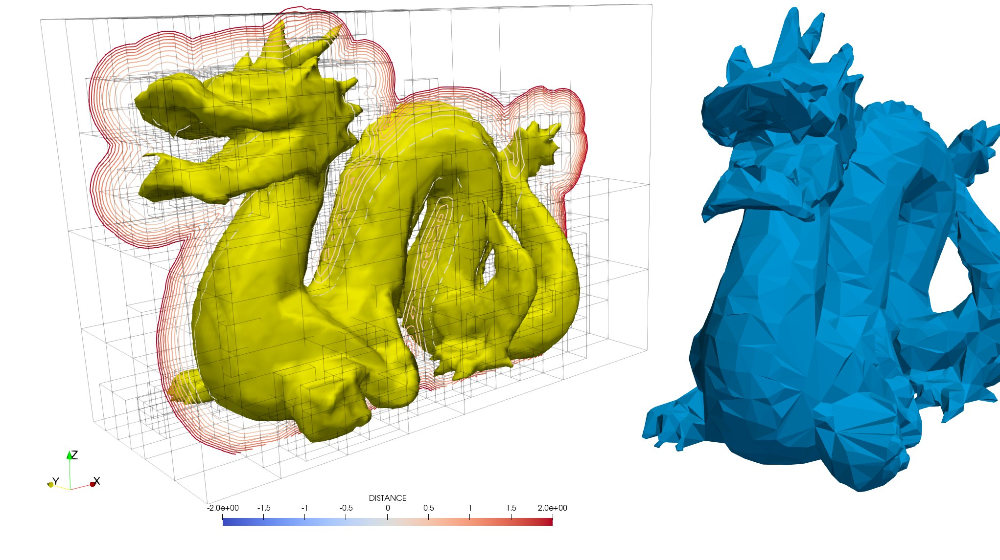
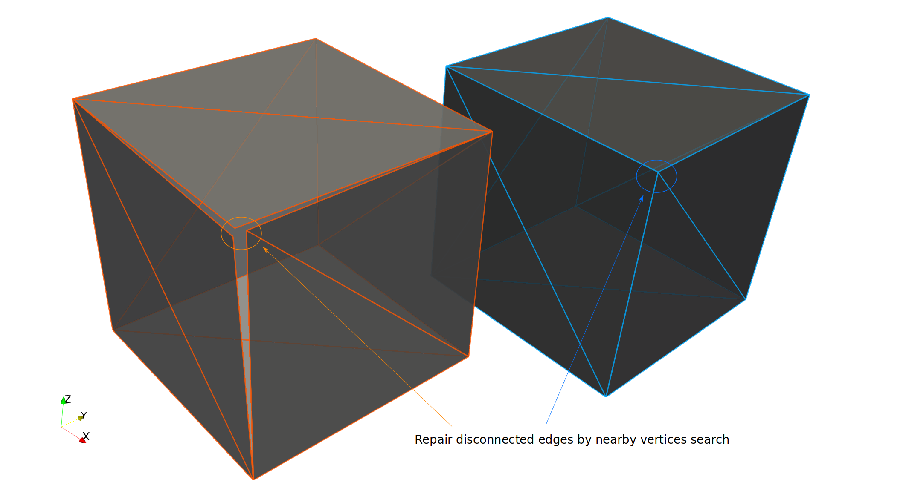

# FOSSIL

>#### FOrtran Stereo Litography parser
>a pure Fortran 2003+ OOP library for reading, writing, and manipulating [STL](https://en.wikipedia.org/wiki/STL_(file_format)) mesh files.

[](https://github.com/szaghi/FOSSIL/actions)
[](https://app.codecov.io/gh/szaghi/FOSSIL)
[](https://github.com/szaghi/FOSSIL/releases)
[](#copyrights)

| 📂 **ASCII & binary STL**<br>Auto-detect format with `guess_format=.true.` — no manual selection needed | 🔧 **Surface manipulation**<br>Translate, rotate, mirror, resize, clip, and merge STL surfaces | 📐 **Geometry analysis**<br>Volume, centroid, bounding box, connectivity, and disconnected edges | 🔨 **Mesh repair**<br>Sanitize and reverse facet normals; reconnect nearby vertices automatically |
|:---:|:---:|:---:|:---:|
| 📏 **Distance & inside queries**<br>Signed distance and point-in-polyhedron via solid angle or ray intersection | ⚡ **AABB octree**<br>Up to 7× faster distance queries over brute force using an 8-child octree | 🏗️ **OOP/TDD designed**<br>Three types (`file_stl_object`, `surface_stl_object`, `facet_object`), all functionality as type-bound procedures | 🖥️ **fossilizer CLI**<br>Companion command-line app for interactive STL analysis and manipulation |

>#### [Documentation](https://szaghi.github.io/FOSSIL/)
> For full documentation (guide, API reference, examples, etc...) see the [FOSSIL website](https://szaghi.github.io/FOSSIL/).

|  |  |
|:---:|:---:|
| *the dragon STL test (`src/tests/dragon.stl`) is composed by 6588 triangular facets. The signed distance computation on a uniform grid of 64³ is accelerated by a factor of 7× using AABB algorithm with respect the simple brute force.* | *automatic repair of disconnected edges.* |

---

## Authors

- Stefano Zaghi — [@szaghi](https://github.com/szaghi)

Contributions are welcome — see the [Contributing](https://szaghi.github.io/FOSSIL/guide/contributing) page.

## Copyrights

This project is distributed under a multi-licensing system:

- **FOSS projects**: [GPL v3](http://www.gnu.org/licenses/gpl-3.0.html)
- **Closed source / commercial**: [BSD 2-Clause](http://opensource.org/licenses/BSD-2-Clause), [BSD 3-Clause](http://opensource.org/licenses/BSD-3-Clause), or [MIT](http://opensource.org/licenses/MIT)

> Anyone interested in using, developing, or contributing to this project is welcome — pick the license that best fits your needs.

---

## Quick start

```fortran
use fossil
use penf, only: R8P
implicit none
type(file_stl_object)    :: file_stl
type(surface_stl_object) :: surface

call file_stl%load_from_file(facet=surface%facet, file_name='cube.stl', guess_format=.true.)
call surface%analize
print '(A)', surface%statistics()

call surface%sanitize_normals
call surface%translate(x=1.0_R8P, y=2.0_R8P, z=0.5_R8P)
call file_stl%save_into_file(facet=surface%facet, file_name='cube-moved.stl')
```

See [`src/tests/`](src/tests/) for more examples including clipping, distance queries, and point-in-polyhedron tests.

---

## Install

### FoBiS

**Standalone** — clone with submodules and build:

```bash
git clone https://github.com/szaghi/FOSSIL --recursive && cd FOSSIL
FoBiS.py build -mode static-gnu   # build static library
FoBiS.py build -mode tests-gnu && ./scripts/run_tests.sh  # build and run tests
```

**As a project dependency** — declare FOSSIL in your `fobos` and run `fetch`:

```ini
[dependencies]
deps_dir = src/third_party
FOSSIL = https://github.com/szaghi/FOSSIL
```

```bash
FoBiS.py fetch           # fetch and build
FoBiS.py fetch --update  # re-fetch and rebuild
```

### CMake

```bash
git clone https://github.com/szaghi/FOSSIL --recursive && cd FOSSIL
cmake -B build && cmake --build build && ctest --test-dir build
```

**As a CMake subdirectory:**

```cmake
add_subdirectory(FOSSIL)
target_link_libraries(your_target FOSSIL::FOSSIL)
```
