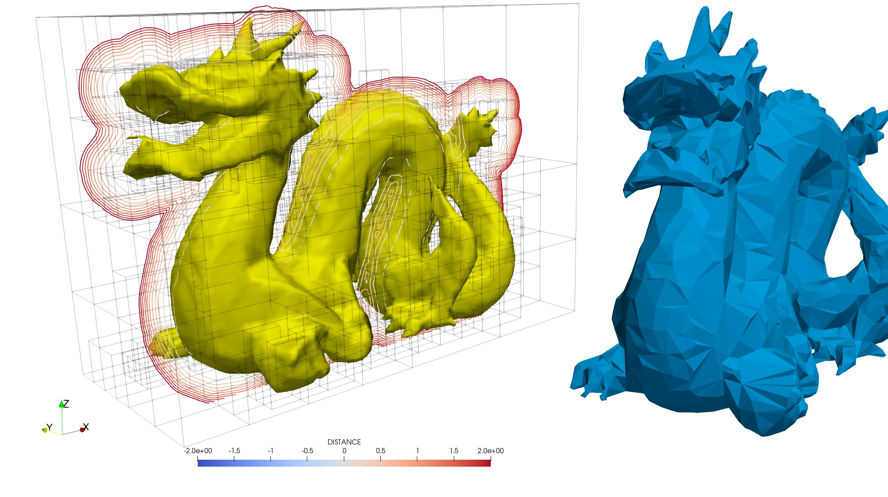
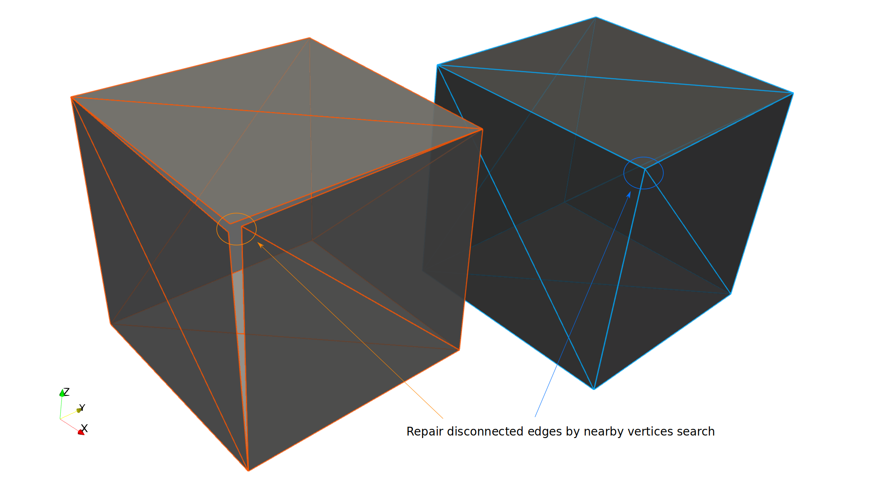

# FOSSIL

>#### FOrtran Stereo Litography parser
>A pure Fortran 2003+ OOP library for reading, writing, and manipulating [STL](https://en.wikipedia.org/wiki/STL_(file_format)) mesh files.

[](https://github.com/szaghi/FOSSIL/actions)
[](https://app.codecov.io/gh/szaghi/FOSSIL)
[](https://github.com/szaghi/FOSSIL/releases)
[](#copyrights)

| 📂 **STL I/O**<br>Load and save ASCII or binary STL files. Format is auto-detected; bad input (NaN/Inf coordinates) is rejected via a status code | 🔧 **Surface manipulation**<br>Translate, rotate, mirror, resize, clip, and merge STL surfaces with a clean type-bound API | 🩺 **Surface analysis & repair**<br>Sanitize pipeline detects and fixes degenerate slivers, literal duplicates, disconnected edges, non-manifold edges, and inward-pointing normals. `is_watertight` / `is_manifold` / `is_volume` predicates summarise the result | 📏 **Signed distance**<br>Bit-exact closest-facet lookup via best-first traversal with d² pruning. Sign via Bærentzen–Aanæs pseudo-normal (default), ray intersection, or solid angle |
|:---:|:---:|:---:|:---:|
| ⚡ **SAH BVH acceleration**<br>Binary BVH built with the surface-area heuristic — adapts to triangle density. ~100× faster distance queries than the legacy octree on dragon-scale meshes. Octree remains selectable | 🧪 **OOP / TDD designed**<br>Two public types — `surface_stl_object` and `facet_object` — every public operation exercised by the regression suite | 🚀 **Advanced geometry processing**<br>Booleans, winding number, alpha wrap, isotropic remesh, decimation, marching cubes, SDF segmentation, ray queries, cotangent Laplacian, per-vertex curvature, Taubin smoothing — twelve libigl/CGAL-class primitives, every one a single TBP | 🆓 **Free & open source**<br>Multi-licensed — GPLv3 for FOSS projects, BSD 2/3-Clause or MIT for commercial use. Fortran 2003+ standard compliant |

>#### [Documentation](https://szaghi.github.io/FOSSIL/)
> For full documentation (guide, API reference, examples, etc...) see the [FOSSIL website](https://szaghi.github.io/FOSSIL/).

|  |  |
|:---:|:---:|
| *the dragon STL test (`src/tests/dragon.stl`) has 6588 triangular facets. With the default SAH BVH and the pseudo-normal sign algorithm, signed-distance queries on a 16³ grid run in ~0.022 s vs ~0.987 s on the legacy octree — about a 45× speedup at this size, growing past 100× on larger meshes. Bit-exact correctness vs brute force is asserted by the regression suite.* | *automatic repair of disconnected edges.* |

---

## Advanced features

FOSSIL ships a focused subset of the libigl / CGAL geometry-processing toolkit, drawn directly from the standard references in the field. Each is a single type-bound procedure on `surface_stl_object`; every one has a dedicated page with a CFD-relevant motivation, a worked Fortran example, and an honest list of known limitations.

| Feature | Reference |
|---|---|
| [Boolean operations](https://szaghi.github.io/FOSSIL/guide/advanced/booleans) — union, intersection, difference, symmetric difference | Zhou et al. 2016 |
| [Self-intersection detection / resolution](https://szaghi.github.io/FOSSIL/guide/advanced/self-intersection) — Möller tri-tri broad-and-narrow phase | Möller 1997 |
| [Mesh decimation](https://szaghi.github.io/FOSSIL/guide/advanced/decimate) — quadric edge collapse with normal-flip / non-manifold safety | Garland & Heckbert 1997 |
| [Generalized winding number](https://szaghi.github.io/FOSSIL/guide/advanced/winding-number) — robust inside/outside on dirty STL, hierarchical Barnes-Hut traversal | Jacobson 2013 + Barill 2018 |
| [Marching cubes](https://szaghi.github.io/FOSSIL/guide/advanced/marching-cubes) — isosurface extraction with the SDF→STL roundtrip | Lorensen-Cline 1987 |
| [Alpha wrapping](https://szaghi.github.io/FOSSIL/guide/advanced/alpha-wrap) — guaranteed watertight 2-manifold surrogate from any triangle soup | Portaneri et al. 2022 |
| [Isotropic remeshing](https://szaghi.github.io/FOSSIL/guide/advanced/isotropic-remesh) — uniform-edge re-tessellation with optional sharp-feature preservation | Botsch & Kobbelt 2004 |
| [SDF segmentation](https://szaghi.github.io/FOSSIL/guide/advanced/sdf-segmentation) — per-facet semantic labels via Shape Diameter Function + Gaussian-mixture clustering | Shapira, Shamir & Cohen-Or 2008 |
| [Ray-mesh intersection queries](https://szaghi.github.io/FOSSIL/guide/advanced/ray-queries) — closest hit, all hits, any-hit early-exit | Möller-Trumbore |
| [Cotangent Laplacian + barycentric mass](https://szaghi.github.io/FOSSIL/guide/advanced/cotangent-laplacian) — sparse SPD operator; foundation for curvature and smoothing | Pinkall & Polthier 1993; Meyer et al. 2003 |
| [Per-vertex Gaussian + mean curvature](https://szaghi.github.io/FOSSIL/guide/advanced/curvature) — angle-defect Gaussian and signed mean curvature from `H n = (1/2) M⁻¹ L V` | Meyer et al. 2003 |
| [Mesh smoothing (explicit + Taubin λ\|μ)](https://szaghi.github.io/FOSSIL/guide/advanced/smoothing) — production-grade denoiser for CFD-grade STL | Taubin 1995 |

---

## Authors

**[Stefano Zaghi](https://github.com/szaghi)** · stefano.zaghi@cnr.it
> *Chief Yak Shaver, Accidental Research Scientist, and HPC Farmer* — CFD researcher who decided that one more day debugging Fortran build systems was one day too many, opened a Python REPL "just to prototype," and now finds himself maintaining a meshing library, a chimera assembler, an MPI load balancer, and the seven blog tabs he keeps meaning to read.

**[Claude](https://claude.ai)** (Anthropic)
> *Omniscient Code Oracle & Tireless Rubber Duck* — AI pair programmer, responsible for writing the boring parts so humans don't have to.

Contributions are welcome — see the [Contributing](https://szaghi.github.io/FOSSIL/guide/contributing) page.

## Copyrights

This project is distributed under a multi-licensing system:

- **FOSS projects**: [GPL v3](http://www.gnu.org/licenses/gpl-3.0.html)
- **Closed source / commercial**: [BSD 2-Clause](http://opensource.org/licenses/BSD-2-Clause), [BSD 3-Clause](http://opensource.org/licenses/BSD-3-Clause), or [MIT](http://opensource.org/licenses/MIT)

> Anyone interested in using, developing, or contributing to this project is welcome — pick the license that best fits your needs.

---

## Quick start

```fortran
use fossil
use penf, only: R8P
use vecfor, only: ex_R8P
implicit none
type(surface_stl_object) :: surface
real(R8P)                :: d

! Load (ASCII or binary, auto-detected) and run the full repair pipeline.
call surface%load_from_file(file_name='cube.stl', guess_format=.true.)
call surface%sanitize           ! degenerate / duplicate / non-manifold / winding
print '(A)', surface%statistics()

! Signed distance from a point — uses SAH BVH + pseudo-normal sign by default.
d = surface%distance(point=2.0_R8P * ex_R8P, is_signed=.true., is_square_root=.true.)
print '(A,ES12.5)', 'signed distance = ', d

call surface%translate(x=1.0_R8P, y=2.0_R8P, z=0.5_R8P)
call surface%save_into_file(file_name='cube-moved.stl')
```

See [`src/tests/`](src/tests/) for more examples including clipping, distance queries, and validity predicates (`is_watertight`, `is_manifold`, `is_volume`).

For interactive use without writing Fortran, the companion **`fossilizer`** CLI (`src/app/fossilizer.f90`) wraps the library for command-line STL analysis and manipulation.

---

## Install

### FoBiS

**Standalone** — clone with submodules and build:

```bash
git clone https://github.com/szaghi/FOSSIL --recursive && cd FOSSIL
fobis build --mode static-gnu   # build static library
fobis build --mode tests-gnu && ./scripts/run_tests.sh  # build and run tests
```

**As a project dependency** — declare FOSSIL in your `fobos` and run `fetch`:

```ini
[dependencies]
deps_dir = src/third_party
FOSSIL = https://github.com/szaghi/FOSSIL
```

```bash
fobis fetch              # fetch and build
fobis fetch --update     # re-fetch and rebuild
```

### CMake

```bash
git clone https://github.com/szaghi/FOSSIL --recursive && cd FOSSIL
cmake -B build && cmake --build build && ctest --test-dir build
```

**As a CMake subdirectory:**

```cmake
add_subdirectory(FOSSIL)
target_link_libraries(your_target FOSSIL::FOSSIL)
```
