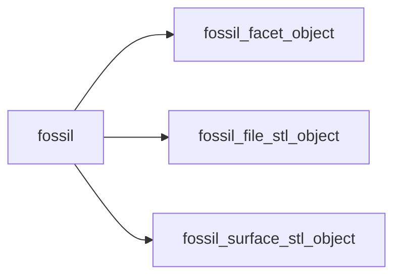

# fossil

> FOSSIL, FOrtran Stereo (si) Litography parser.

**Source**: `src/lib/fossil.f90`

**Dependencies**

```mermaid
graph LR
  fossil["fossil"] --> fossil_facet_object["fossil_facet_object"]
  fossil["fossil"] --> fossil_file_stl_object["fossil_file_stl_object"]
  fossil["fossil"] --> fossil_surface_stl_object["fossil_surface_stl_object"]
```
