# fossil_aabb_object

> FOSSIL, Axis-Aligned Bounding Box (AABB) class definition.

**Source**: `src/lib/fossil_aabb_object.f90`

**Dependencies**

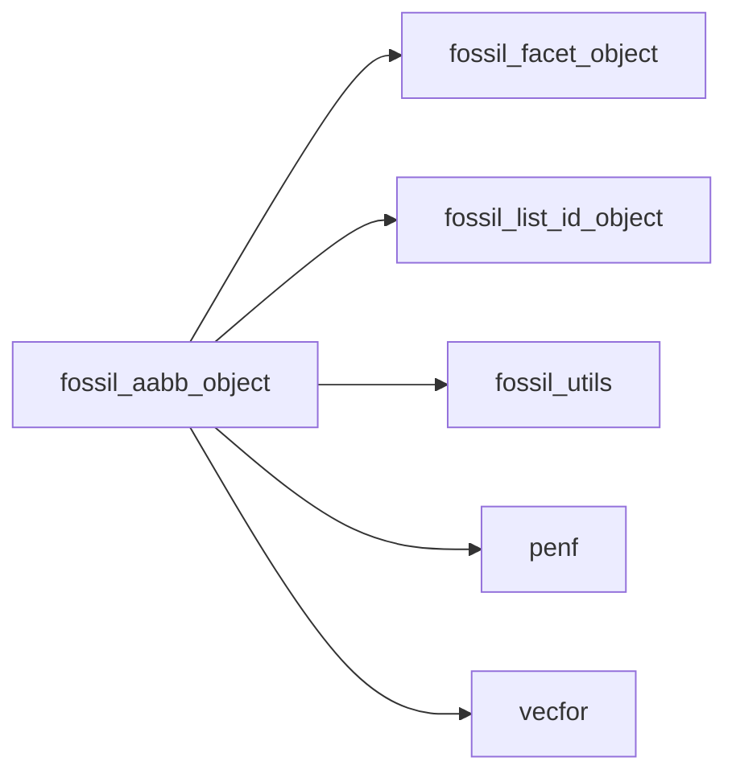

## Contents

- [aabb_object](#aabb-object)
- [add_facets](#add-facets)
- [compute_octants](#compute-octants)
- [compute_vertices_nearby](#compute-vertices-nearby)
- [destroy](#destroy)
- [get_aabb_facets](#get-aabb-facets)
- [initialize](#initialize)
- [save_geometry_tecplot_ascii](#save-geometry-tecplot-ascii)
- [save_facets_into_file_stl](#save-facets-into-file-stl)
- [translate](#translate)
- [union](#union)
- [update_extents](#update-extents)
- [aabb_assign_aabb](#aabb-assign-aabb)
- [compute_bb_from_facets](#compute-bb-from-facets)
- [closest_point](#closest-point)
- [distance](#distance)
- [distance_from_facets](#distance-from-facets)
- [do_ray_intersect](#do-ray-intersect)
- [has_facets](#has-facets)
- [is_inside](#is-inside)
- [median](#median)
- [ray_intersections_number](#ray-intersections-number)
- [vertex](#vertex)

## Derived Types

### aabb_object

FOSSIL Axis-Aligned Bounding Box (AABB) class.

#### Components

| Name | Type | Attributes | Description |
|------|------|------------|-------------|
| `bmin` | type([vector_R8P](/api/src/third_party/VecFor/src/lib/vecfor_R8P#vector-r8p)) |  | Minimum point of AABB. |
| `bmax` | type([vector_R8P](/api/src/third_party/VecFor/src/lib/vecfor_R8P#vector-r8p)) |  | Maximum point of AABB. |
| `facet_id` | type([list_id_object](/api/src/lib/fossil_list_id_object#list-id-object)) |  | List of facets IDs contained into AABB. |

#### Type-Bound Procedures

| Name | Attributes | Description |
|------|------------|-------------|
| `add_facets` | pass(self) | Add facets to AABB. |
| `closest_point` | pass(self) | Return closest point on AABB from point reference. |
| `compute_octants` | pass(self) | Compute AABB octants. |
| `compute_vertices_nearby` | pass(self) | Compute vertices nearby. |
| `destroy` | pass(self) | Destroy AABB. |
| `distance` | pass(self) | Return the (square) distance from point to AABB. |
| `distance_from_facets` | pass(self) | Return the (square) distance from point to AABB's facets. |
| `do_ray_intersect` | pass(self) | Return true if AABB is intersected by ray. |
| `get_aabb_facets` | pass(self) | Get AABB facets list. |
| `has_facets` | pass(self) | Return true if AABB has facets. |
| `initialize` | pass(self) | Initialize AABB. |
| `is_inside` | pass(self) | Return the true if point is inside ABB. |
| `median` | pass(self) | Return the median of AABB. |
| `ray_intersections_number` | pass(self) | Return ray intersections number. |
| `save_geometry_tecplot_ascii` | pass(self) | Save AABB geometry into Tecplot ascii file. |
| `save_facets_into_file_stl` | pass(self) | Save facets into file STL. |
| `translate` | pass(self) | Translate AABB by delta. |
| `union` | pass(self) | Make AABB the union of other AABBs. |
| `update_extents` | pass(self) | Update AABB bounding box extents. |
| `vertex` | pass(self) | Return AABB vertices. |
| `assignment(=)` |  | Overload `=`. |
| `aabb_assign_aabb` | pass(lhs) | Operator `=`. |

## Subroutines

### add_facets

Add facets to AABB.

 @note Previously stored facets list is lost.

 @note Facets added to AABB are removed to facets list that is also returned.

**Attributes**: pure

```fortran
subroutine add_facets(self, facet_id, facet, is_exclusive)
```

**Arguments**

| Name | Type | Intent | Attributes | Description |
|------|------|--------|------------|-------------|
| `self` | class([aabb_object](/api/src/lib/fossil_aabb_object#aabb-object)) | inout |  | AABB. |
| `facet_id` | type([list_id_object](/api/src/lib/fossil_list_id_object#list-id-object)) | inout |  | List of facets IDs. |
| `facet` | type([facet_object](/api/src/lib/fossil_facet_object#facet-object)) | in |  | Facets list. |
| `is_exclusive` | logical | in | optional | Sentinel to enable/disable exclusive addition. |

**Call graph**

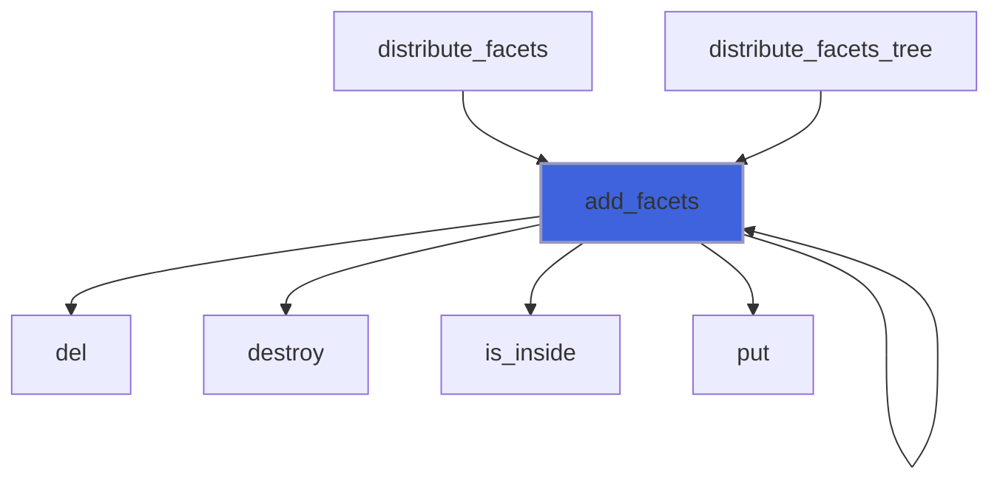

### compute_octants

Return AABB octants.

**Attributes**: pure

```fortran
subroutine compute_octants(self, octant)
```

**Arguments**

| Name | Type | Intent | Attributes | Description |
|------|------|--------|------------|-------------|
| `self` | class([aabb_object](/api/src/lib/fossil_aabb_object#aabb-object)) | in |  | AABB. |
| `octant` | type([aabb_object](/api/src/lib/fossil_aabb_object#aabb-object)) | out |  | AABB octants. |

**Call graph**

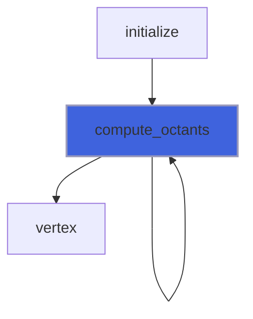

### compute_vertices_nearby

Compute vertices nearby.

**Attributes**: pure

```fortran
subroutine compute_vertices_nearby(self, facet, tolerance_to_be_identical, tolerance_to_be_nearby)
```

**Arguments**

| Name | Type | Intent | Attributes | Description |
|------|------|--------|------------|-------------|
| `self` | class([aabb_object](/api/src/lib/fossil_aabb_object#aabb-object)) | in |  | AABB. |
| `facet` | type([facet_object](/api/src/lib/fossil_facet_object#facet-object)) | inout |  | Facets list. |
| `tolerance_to_be_identical` | real(kind=[R8P](/api/src/third_party/PENF/src/lib/penf_global_parameters_variables)) | in |  | Tolerance to identify identical vertices. |
| `tolerance_to_be_nearby` | real(kind=[R8P](/api/src/third_party/PENF/src/lib/penf_global_parameters_variables)) | in |  | Tolerance to identify nearby vertices. |

**Call graph**

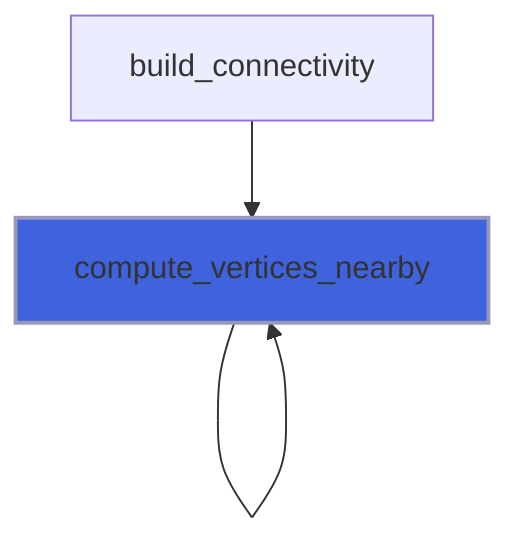

### destroy

Destroy AABB.

**Attributes**: elemental

```fortran
subroutine destroy(self)
```

**Arguments**

| Name | Type | Intent | Attributes | Description |
|------|------|--------|------------|-------------|
| `self` | class([aabb_object](/api/src/lib/fossil_aabb_object#aabb-object)) | inout |  | AABB. |

**Call graph**

```mermaid
flowchart TD
  aabb_node_assign_aabb_node["aabb_node_assign_aabb_node"] --> destroy["destroy"]
  aabb_tree_assign_aabb_tree["aabb_tree_assign_aabb_tree"] --> destroy["destroy"]
  add_facets["add_facets"] --> destroy["destroy"]
  allocate_facets["allocate_facets"] --> destroy["destroy"]
  compute_facets_disconnected["compute_facets_disconnected"] --> destroy["destroy"]
  destroy["destroy"] --> destroy["destroy"]
  destroy_connectivity["destroy_connectivity"] --> destroy["destroy"]
  distribute_facets["distribute_facets"] --> destroy["destroy"]
  distribute_facets_tree["distribute_facets_tree"] --> destroy["destroy"]
  initialize["initialize"] --> destroy["destroy"]
  initialize["initialize"] --> destroy["destroy"]
  initialize["initialize"] --> destroy["destroy"]
  initialize["initialize"] --> destroy["destroy"]
  initialize["initialize"] --> destroy["destroy"]
  initialize["initialize"] --> destroy["destroy"]
  merge_vertices["merge_vertices"] --> destroy["destroy"]
  surface_stl_assign_surface_stl["surface_stl_assign_surface_stl"] --> destroy["destroy"]
  union["union"] --> destroy["destroy"]
  style destroy fill:#3e63dd,stroke:#99b,stroke-width:2px
```

### get_aabb_facets

Get AABB facets list.

**Attributes**: pure

```fortran
subroutine get_aabb_facets(self, facet, aabb_facet)
```

**Arguments**

| Name | Type | Intent | Attributes | Description |
|------|------|--------|------------|-------------|
| `self` | class([aabb_object](/api/src/lib/fossil_aabb_object#aabb-object)) | in |  | AABB. |
| `facet` | type([facet_object](/api/src/lib/fossil_facet_object#facet-object)) | in |  | Whole facets list. |
| `aabb_facet` | type([facet_object](/api/src/lib/fossil_facet_object#facet-object)) | out | allocatable | AABB facets list. |

**Call graph**

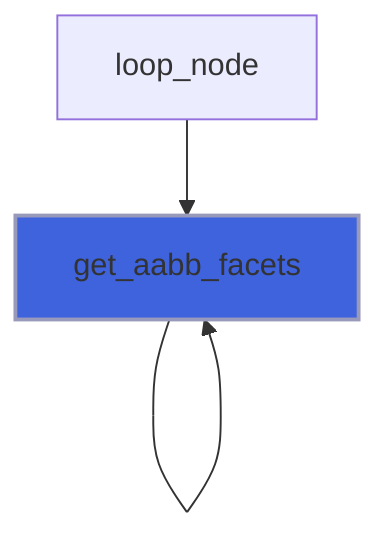

### initialize

Initialize AABB.

**Attributes**: pure

```fortran
subroutine initialize(self, facet, bmin, bmax)
```

**Arguments**

| Name | Type | Intent | Attributes | Description |
|------|------|--------|------------|-------------|
| `self` | class([aabb_object](/api/src/lib/fossil_aabb_object#aabb-object)) | inout |  | AABB. |
| `facet` | type([facet_object](/api/src/lib/fossil_facet_object#facet-object)) | in | optional | Facets list. |
| `bmin` | type([vector_R8P](/api/src/third_party/VecFor/src/lib/vecfor_R8P#vector-r8p)) | in | optional | Minimum point of AABB. |
| `bmax` | type([vector_R8P](/api/src/third_party/VecFor/src/lib/vecfor_R8P#vector-r8p)) | in | optional | Maximum point of AABB. |

**Call graph**

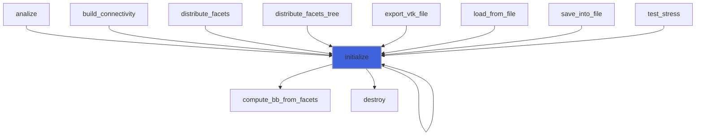

### save_geometry_tecplot_ascii

Save AABB geometry into Tecplot ascii file.

```fortran
subroutine save_geometry_tecplot_ascii(self, file_unit, aabb_name)
```

**Arguments**

| Name | Type | Intent | Attributes | Description |
|------|------|--------|------------|-------------|
| `self` | class([aabb_object](/api/src/lib/fossil_aabb_object#aabb-object)) | in |  | AABB. |
| `file_unit` | integer(kind=[I4P](/api/src/third_party/PENF/src/lib/penf_global_parameters_variables)) | in |  | File unit. |
| `aabb_name` | character(len=*) | in | optional | Name of AABB. |

**Call graph**

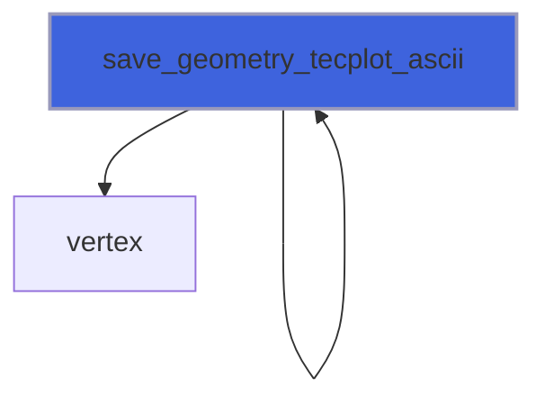

### save_facets_into_file_stl

Save facets into file STL.

```fortran
subroutine save_facets_into_file_stl(self, facet, file_name, is_ascii)
```

**Arguments**

| Name | Type | Intent | Attributes | Description |
|------|------|--------|------------|-------------|
| `self` | class([aabb_object](/api/src/lib/fossil_aabb_object#aabb-object)) | in |  | AABB. |
| `facet` | type([facet_object](/api/src/lib/fossil_facet_object#facet-object)) | in |  | Facets list. |
| `file_name` | character(len=*) | in |  | File name. |
| `is_ascii` | logical | in |  | Sentinel for file format. |

**Call graph**

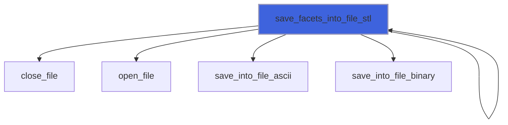

### translate

Translate AABB by delta.

**Attributes**: elemental

```fortran
subroutine translate(self, delta)
```

**Arguments**

| Name | Type | Intent | Attributes | Description |
|------|------|--------|------------|-------------|
| `self` | class([aabb_object](/api/src/lib/fossil_aabb_object#aabb-object)) | inout |  | AABB. |
| `delta` | type([vector_R8P](/api/src/third_party/VecFor/src/lib/vecfor_R8P#vector-r8p)) | in |  | Delta of translation. |

**Call graph**

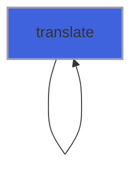

### union

Make AABB the union of other AABBs.

**Attributes**: pure

```fortran
subroutine union(self, other)
```

**Arguments**

| Name | Type | Intent | Attributes | Description |
|------|------|--------|------------|-------------|
| `self` | class([aabb_object](/api/src/lib/fossil_aabb_object#aabb-object)) | inout |  | AABB. |
| `other` | type([aabb_object](/api/src/lib/fossil_aabb_object#aabb-object)) | in |  | Other AABB. |

**Call graph**

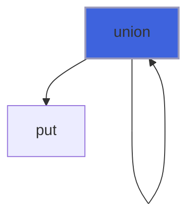

### update_extents

Update AABB bounding box extents.

**Attributes**: pure

```fortran
subroutine update_extents(self, facet)
```

**Arguments**

| Name | Type | Intent | Attributes | Description |
|------|------|--------|------------|-------------|
| `self` | class([aabb_object](/api/src/lib/fossil_aabb_object#aabb-object)) | inout |  | AABB. |
| `facet` | type([facet_object](/api/src/lib/fossil_facet_object#facet-object)) | in |  | Facets list. |

**Call graph**

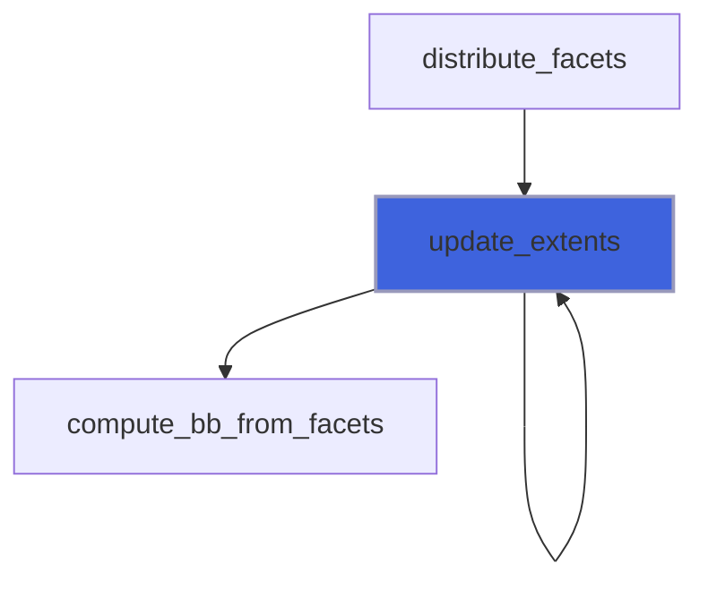

### aabb_assign_aabb

Operator `=`.

**Attributes**: pure

```fortran
subroutine aabb_assign_aabb(lhs, rhs)
```

**Arguments**

| Name | Type | Intent | Attributes | Description |
|------|------|--------|------------|-------------|
| `lhs` | class([aabb_object](/api/src/lib/fossil_aabb_object#aabb-object)) | inout |  | Left hand side. |
| `rhs` | type([aabb_object](/api/src/lib/fossil_aabb_object#aabb-object)) | in |  | Right hand side. |

### compute_bb_from_facets

Compute AABB extents (minimum and maximum bounding box) from facets list.

 @note Facets' metrix must be already computed.

**Attributes**: pure

```fortran
subroutine compute_bb_from_facets(facet, bmin, bmax)
```

**Arguments**

| Name | Type | Intent | Attributes | Description |
|------|------|--------|------------|-------------|
| `facet` | type([facet_object](/api/src/lib/fossil_facet_object#facet-object)) | in |  | Facets list. |
| `bmin` | type([vector_R8P](/api/src/third_party/VecFor/src/lib/vecfor_R8P#vector-r8p)) | inout |  | Minimum point of AABB. |
| `bmax` | type([vector_R8P](/api/src/third_party/VecFor/src/lib/vecfor_R8P#vector-r8p)) | inout |  | Maximum point of AABB. |

**Call graph**

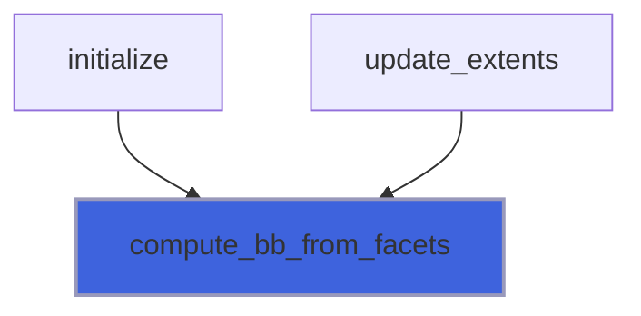

## Functions

### closest_point

Return closest point on (or in) AABB from point reference.

**Attributes**: pure

**Returns**: type([vector_R8P](/api/src/third_party/VecFor/src/lib/vecfor_R8P#vector-r8p))

```fortran
function closest_point(self, point) result(closest)
```

**Arguments**

| Name | Type | Intent | Attributes | Description |
|------|------|--------|------------|-------------|
| `self` | class([aabb_object](/api/src/lib/fossil_aabb_object#aabb-object)) | in |  | AABB. |
| `point` | type([vector_R8P](/api/src/third_party/VecFor/src/lib/vecfor_R8P#vector-r8p)) | in |  | Point reference. |

**Call graph**

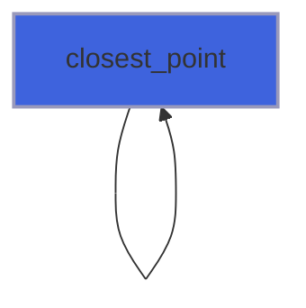

### distance

Return the (square) distance from point to AABB.

**Attributes**: pure

**Returns**: real(kind=[R8P](/api/src/third_party/PENF/src/lib/penf_global_parameters_variables))

```fortran
function distance(self, point)
```

**Arguments**

| Name | Type | Intent | Attributes | Description |
|------|------|--------|------------|-------------|
| `self` | class([aabb_object](/api/src/lib/fossil_aabb_object#aabb-object)) | in |  | AABB. |
| `point` | type([vector_R8P](/api/src/third_party/VecFor/src/lib/vecfor_R8P#vector-r8p)) | in |  | Point reference. |

**Call graph**

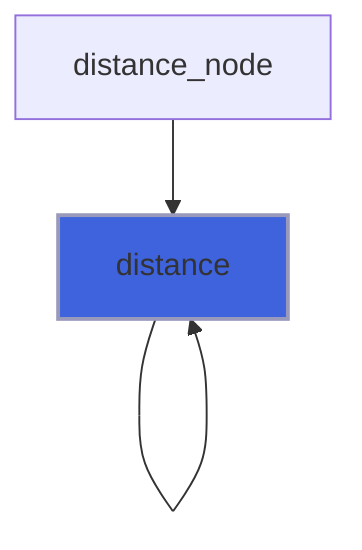

### distance_from_facets

Return the (square) distance from point to AABB's facets.

**Attributes**: pure

**Returns**: real(kind=[R8P](/api/src/third_party/PENF/src/lib/penf_global_parameters_variables))

```fortran
function distance_from_facets(self, facet, point) result(distance)
```

**Arguments**

| Name | Type | Intent | Attributes | Description |
|------|------|--------|------------|-------------|
| `self` | class([aabb_object](/api/src/lib/fossil_aabb_object#aabb-object)) | in |  | AABB. |
| `facet` | type([facet_object](/api/src/lib/fossil_facet_object#facet-object)) | in |  | Facets list. |
| `point` | type([vector_R8P](/api/src/third_party/VecFor/src/lib/vecfor_R8P#vector-r8p)) | in |  | Point reference. |

**Call graph**

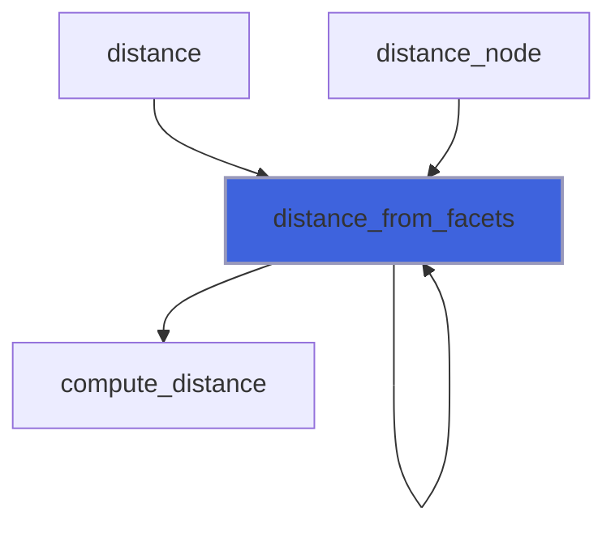

### do_ray_intersect

Return true if AABB is intersected by ray from origin and oriented as ray direction vector.

**Attributes**: pure

**Returns**: `logical`

```fortran
function do_ray_intersect(self, ray_origin, ray_direction) result(do_intersect)
```

**Arguments**

| Name | Type | Intent | Attributes | Description |
|------|------|--------|------------|-------------|
| `self` | class([aabb_object](/api/src/lib/fossil_aabb_object#aabb-object)) | in |  | AABB box. |
| `ray_origin` | type([vector_R8P](/api/src/third_party/VecFor/src/lib/vecfor_R8P#vector-r8p)) | in |  | Ray origin. |
| `ray_direction` | type([vector_R8P](/api/src/third_party/VecFor/src/lib/vecfor_R8P#vector-r8p)) | in |  | Ray direction. |

**Call graph**

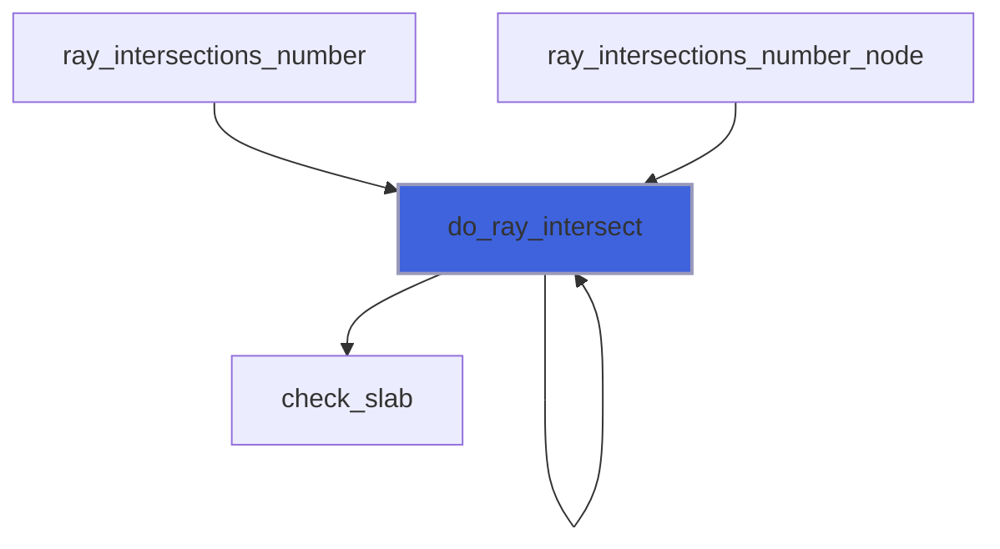

### has_facets

Return true if AABB has facets.

**Attributes**: pure

**Returns**: `logical`

```fortran
function has_facets(self)
```

**Arguments**

| Name | Type | Intent | Attributes | Description |
|------|------|--------|------------|-------------|
| `self` | class([aabb_object](/api/src/lib/fossil_aabb_object#aabb-object)) | in |  | AABB box. |

**Call graph**

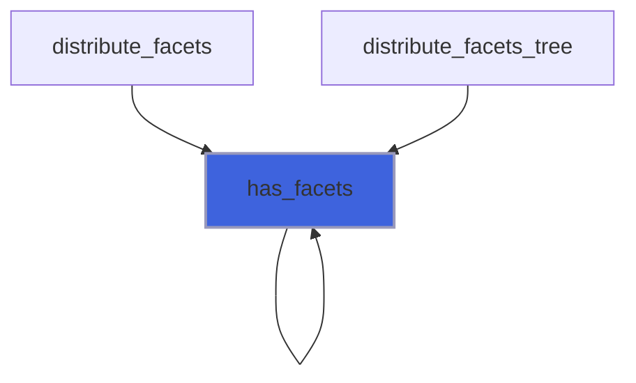

### is_inside

Return the true if point is inside ABB.

**Attributes**: pure

**Returns**: `logical`

```fortran
function is_inside(self, point)
```

**Arguments**

| Name | Type | Intent | Attributes | Description |
|------|------|--------|------------|-------------|
| `self` | class([aabb_object](/api/src/lib/fossil_aabb_object#aabb-object)) | in |  | AABB. |
| `point` | type([vector_R8P](/api/src/third_party/VecFor/src/lib/vecfor_R8P#vector-r8p)) | in |  | Point reference. |

**Call graph**

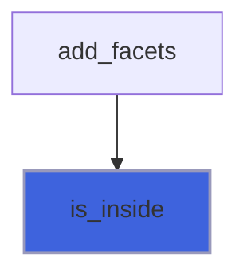

### median

Return the median of AABB.

**Attributes**: pure

**Returns**: real(kind=[R8P](/api/src/third_party/PENF/src/lib/penf_global_parameters_variables))

```fortran
function median(self)
```

**Arguments**

| Name | Type | Intent | Attributes | Description |
|------|------|--------|------------|-------------|
| `self` | class([aabb_object](/api/src/lib/fossil_aabb_object#aabb-object)) | in |  | AABB. |

**Call graph**

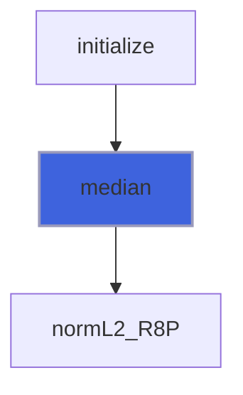

### ray_intersections_number

Return ray intersections number.

**Attributes**: pure

**Returns**: integer(kind=[I4P](/api/src/third_party/PENF/src/lib/penf_global_parameters_variables))

```fortran
function ray_intersections_number(self, facet, ray_origin, ray_direction) result(intersections_number)
```

**Arguments**

| Name | Type | Intent | Attributes | Description |
|------|------|--------|------------|-------------|
| `self` | class([aabb_object](/api/src/lib/fossil_aabb_object#aabb-object)) | in |  | AABB. |
| `facet` | type([facet_object](/api/src/lib/fossil_facet_object#facet-object)) | in |  | Facets list. |
| `ray_origin` | type([vector_R8P](/api/src/third_party/VecFor/src/lib/vecfor_R8P#vector-r8p)) | in |  | Ray origin. |
| `ray_direction` | type([vector_R8P](/api/src/third_party/VecFor/src/lib/vecfor_R8P#vector-r8p)) | in |  | Ray direction. |

**Call graph**

```mermaid
flowchart TD
  ray_intersections_number["ray_intersections_number"] --> ray_intersections_number["ray_intersections_number"]
  ray_intersections_number_node["ray_intersections_number_node"] --> ray_intersections_number["ray_intersections_number"]
  ray_intersections_number["ray_intersections_number"] --> do_ray_intersect["do_ray_intersect"]
  style ray_intersections_number fill:#3e63dd,stroke:#99b,stroke-width:2px
```

### vertex

Return AABB vertices.

**Attributes**: pure

**Returns**: type([vector_R8P](/api/src/third_party/VecFor/src/lib/vecfor_R8P#vector-r8p))

```fortran
function vertex(self)
```

**Arguments**

| Name | Type | Intent | Attributes | Description |
|------|------|--------|------------|-------------|
| `self` | class([aabb_object](/api/src/lib/fossil_aabb_object#aabb-object)) | in |  | AABB. |

**Call graph**

```mermaid
flowchart TD
  compute_octants["compute_octants"] --> vertex["vertex"]
  compute_octants["compute_octants"] --> vertex["vertex"]
  export_aabb_tecplot_ascii["export_aabb_tecplot_ascii"] --> vertex["vertex"]
  save_geometry_tecplot_ascii["save_geometry_tecplot_ascii"] --> vertex["vertex"]
  style vertex fill:#3e63dd,stroke:#99b,stroke-width:2px
```
