# fossil_aabb_tree_object

> FOSSIL, Axis-Aligned Bounding Box (AABB) tree class definition.

 @note The tree is assumed to be an **octree**.

**Source**: `src/lib/fossil_aabb_tree_object.f90`

**Dependencies**

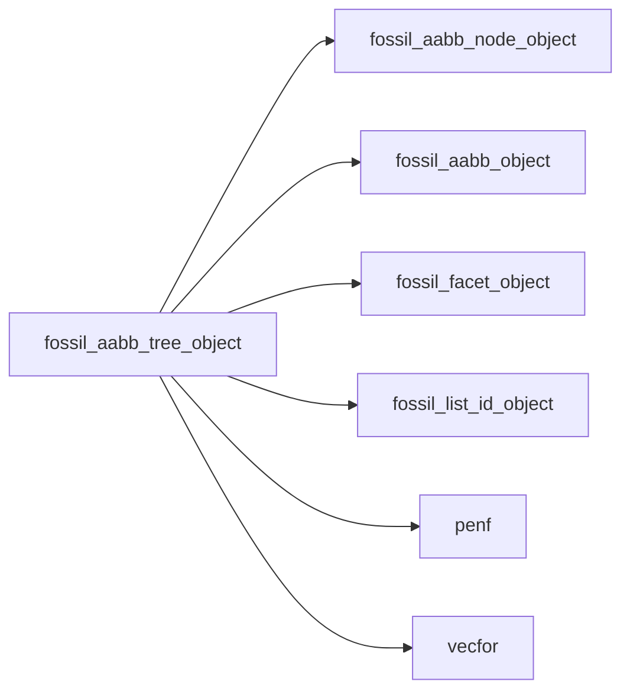

## Contents

- [ofsm](#ofsm)
- [aabb_tree_object](#aabb-tree-object)
- [compute_vertices_nearby](#compute-vertices-nearby)
- [destroy](#destroy)
- [distribute_facets](#distribute-facets)
- [distribute_facets_tree](#distribute-facets-tree)
- [initialize](#initialize)
- [save_geometry_tecplot_ascii](#save-geometry-tecplot-ascii)
- [translate](#translate)
- [aabb_tree_assign_aabb_tree](#aabb-tree-assign-aabb-tree)
- [next_location_code](#next-location-code)
- [distance](#distance)
- [distance_tree](#distance-tree)
- [has_children](#has-children)
- [loop_node](#loop-node)
- [ray_intersections_number](#ray-intersections-number)
- [distance_node](#distance-node)
- [ray_intersections_number_node](#ray-intersections-number-node)
- [first_child_node](#first-child-node)
- [first_node](#first-node)
- [last_node](#last-node)
- [level](#level)
- [local_id](#local-id)
- [location_code](#location-code)
- [global_id](#global-id)
- [nodes_number](#nodes-number)
- [nodes_number_at_level](#nodes-number-at-level)
- [parent_at_level](#parent-at-level)
- [parent_node](#parent-node)
- [siblings](#siblings)
- [str_location_code](#str-location-code)

## Variables

| Name | Type | Attributes | Description |
|------|------|------------|-------------|
| `TREE_RATIO` | integer(kind=[I4P](/api/src/third_party/PENF/src/lib/penf_global_parameters_variables)) | parameter | Tree refinement ratio, it is assumed to be an **octree**. |
| `octree_fsm` | type([ofsm](/api/src/lib/fossil_aabb_tree_object#ofsm)) |  |  |

## Derived Types

### ofsm

Octree Finite State Machine class for efficient searching of neiighbors.

#### Components

| Name | Type | Attributes | Description |
|------|------|------------|-------------|
| `octant` | integer(kind=[I4P](/api/src/third_party/PENF/src/lib/penf_global_parameters_variables)) |  | Octant ID, [1,2,3,4,5,6,7,8]. |
| `direction` | integer(kind=[I4P](/api/src/third_party/PENF/src/lib/penf_global_parameters_variables)) |  | Direction, 0=Halt, 1=X+, 2=X-, 3=Y+, 4=Y-, 5=Z+, 6=Z-. |

### aabb_tree_object

FOSSIL Axis-Aligned Bounding Box (AABB) tree class.

 @note The tree is assumed to be an **octree**.
 The octree uses a breath-leaf counting, with the following convention:

```

#### Components

| Name | Type | Attributes | Description |
|------|------|------------|-------------|
| `refinement_levels` | integer(kind=[I4P](/api/src/third_party/PENF/src/lib/penf_global_parameters_variables)) |  | +----+----+ |
| `nodes_number` | integer(kind=[I4P](/api/src/third_party/PENF/src/lib/penf_global_parameters_variables)) |  | Total number of tree nodes. |
| `node` | type([aabb_node_object](/api/src/lib/fossil_aabb_node_object#aabb-node-object)) | allocatable | AABB tree nodes [0:nodes_number-1]. |
| `is_initialized` | logical |  | Sentinel to check is AABB tree is initialized. |

#### Type-Bound Procedures

| Name | Attributes | Description |
|------|------------|-------------|
| `compute_vertices_nearby` | pass(self) | Compute vertices nearby. |
| `destroy` | pass(self) | Destroy AABB tree. |
| `distance` | pass(self) | Return the (minimum) distance from point to triangulated surface. |
| `distance_tree` | pass(self) | Return the (minimum) distance from point to triangulated surface. |
| `distribute_facets` | pass(self) | Distribute facets into AABB nodes. |
| `distribute_facets_tree` | pass(self) | Distribute facets into AABB nodes. |
| `has_children` | pass(self) | Return true if node has at least one child allocated. |
| `initialize` | pass(self) | Initialize AABB tree. |
| `loop_node` | pass(self) | Loop over all nodes. |
| `ray_intersections_number` | pass(self) | Return ray intersections number. |
| `save_geometry_tecplot_ascii` | pass(self) | Save AABB tree boxes geometry into Tecplot ascii file. |
| `translate` | pass(self) | Translate AABB tree by delta. |
| `assignment(=)` |  | Overload `=`. |
| `aabb_tree_assign_aabb_tree` | pass(lhs) | Operator `=`. |
| `distance_node` | pass(self) | Return the (minimum) distance from point to node AABB tree. |
| `ray_intersections_number_node` | pass(self) | Return ray intersections number into a node of AABB tree. |

## Subroutines

### compute_vertices_nearby

Compute vertices nearby.

**Attributes**: pure

```fortran
subroutine compute_vertices_nearby(self, facet, tolerance_to_be_identical, tolerance_to_be_nearby)
```

**Arguments**

| Name | Type | Intent | Attributes | Description |
|------|------|--------|------------|-------------|
| `self` | class([aabb_tree_object](/api/src/lib/fossil_aabb_tree_object#aabb-tree-object)) | in |  | AABB tree. |
| `facet` | type([facet_object](/api/src/lib/fossil_facet_object#facet-object)) | inout |  | Facets list. |
| `tolerance_to_be_identical` | real(kind=[R8P](/api/src/third_party/PENF/src/lib/penf_global_parameters_variables)) | in |  | Tolerance to identify identical vertices. |
| `tolerance_to_be_nearby` | real(kind=[R8P](/api/src/third_party/PENF/src/lib/penf_global_parameters_variables)) | in |  | Tolerance to identify nearby vertices. |

**Call graph**

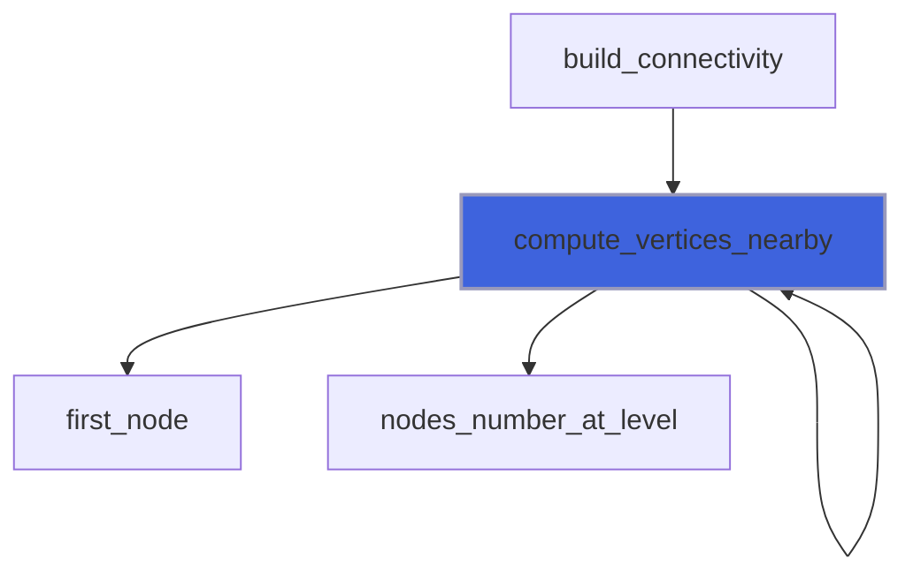

### destroy

Destroy AABB tree.

**Attributes**: elemental

```fortran
subroutine destroy(self)
```

**Arguments**

| Name | Type | Intent | Attributes | Description |
|------|------|--------|------------|-------------|
| `self` | class([aabb_tree_object](/api/src/lib/fossil_aabb_tree_object#aabb-tree-object)) | inout |  | AABB tree. |

**Call graph**

```mermaid
flowchart TD
  aabb_node_assign_aabb_node["aabb_node_assign_aabb_node"] --> destroy["destroy"]
  aabb_tree_assign_aabb_tree["aabb_tree_assign_aabb_tree"] --> destroy["destroy"]
  add_facets["add_facets"] --> destroy["destroy"]
  allocate_facets["allocate_facets"] --> destroy["destroy"]
  compute_facets_disconnected["compute_facets_disconnected"] --> destroy["destroy"]
  destroy["destroy"] --> destroy["destroy"]
  destroy_connectivity["destroy_connectivity"] --> destroy["destroy"]
  distribute_facets["distribute_facets"] --> destroy["destroy"]
  distribute_facets_tree["distribute_facets_tree"] --> destroy["destroy"]
  initialize["initialize"] --> destroy["destroy"]
  initialize["initialize"] --> destroy["destroy"]
  initialize["initialize"] --> destroy["destroy"]
  initialize["initialize"] --> destroy["destroy"]
  initialize["initialize"] --> destroy["destroy"]
  initialize["initialize"] --> destroy["destroy"]
  merge_vertices["merge_vertices"] --> destroy["destroy"]
  surface_stl_assign_surface_stl["surface_stl_assign_surface_stl"] --> destroy["destroy"]
  union["union"] --> destroy["destroy"]
  style destroy fill:#3e63dd,stroke:#99b,stroke-width:2px
```

### distribute_facets

Distribute facets into AABB nodes.

**Attributes**: pure

```fortran
subroutine distribute_facets(self, facet, is_exclusive, do_update_extents)
```

**Arguments**

| Name | Type | Intent | Attributes | Description |
|------|------|--------|------------|-------------|
| `self` | class([aabb_tree_object](/api/src/lib/fossil_aabb_tree_object#aabb-tree-object)) | inout |  | AABB tree. |
| `facet` | type([facet_object](/api/src/lib/fossil_facet_object#facet-object)) | in |  | Facets list. |
| `is_exclusive` | logical | in | optional | Sentinel to enable/disable exclusive addition. |
| `do_update_extents` | logical | in | optional | Sentinel to enable/disable AABB extents update. |

**Call graph**

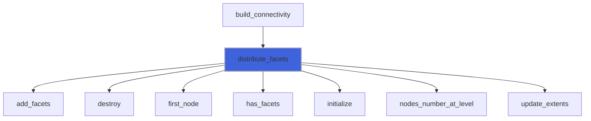

### distribute_facets_tree

Distribute facets into AABB nodes.

**Attributes**: pure

```fortran
subroutine distribute_facets_tree(self, facet)
```

**Arguments**

| Name | Type | Intent | Attributes | Description |
|------|------|--------|------------|-------------|
| `self` | class([aabb_tree_object](/api/src/lib/fossil_aabb_tree_object#aabb-tree-object)) | inout |  | AABB tree. |
| `facet` | type([facet_object](/api/src/lib/fossil_facet_object#facet-object)) | in |  | Facets list. |

**Call graph**

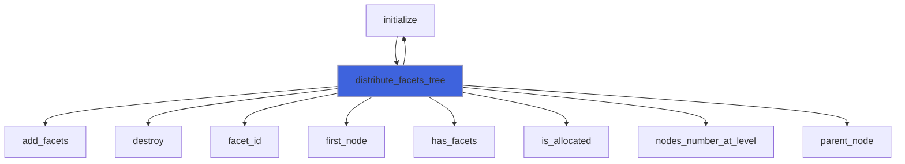

### initialize

Initialize AABB tree.

**Attributes**: pure

```fortran
subroutine initialize(self, refinement_levels, facet, largest_edge_len, bmin, bmax, do_facets_distribute, is_exclusive, do_update_extents)
```

**Arguments**

| Name | Type | Intent | Attributes | Description |
|------|------|--------|------------|-------------|
| `self` | class([aabb_tree_object](/api/src/lib/fossil_aabb_tree_object#aabb-tree-object)) | inout |  | AABB tree. |
| `refinement_levels` | integer(kind=[I4P](/api/src/third_party/PENF/src/lib/penf_global_parameters_variables)) | in | optional | AABB refinement levels. |
| `facet` | type([facet_object](/api/src/lib/fossil_facet_object#facet-object)) | in | optional | Facets list. |
| `largest_edge_len` | real(kind=[R8P](/api/src/third_party/PENF/src/lib/penf_global_parameters_variables)) | in | optional | Largest edge lenght. |
| `bmin` | type([vector_R8P](/api/src/third_party/VecFor/src/lib/vecfor_R8P#vector-r8p)) | in | optional | Minimum point of AABB. |
| `bmax` | type([vector_R8P](/api/src/third_party/VecFor/src/lib/vecfor_R8P#vector-r8p)) | in | optional | Maximum point of AABB. |
| `do_facets_distribute` | logical | in | optional | Sentinel to enable/disable facets distribution. |
| `is_exclusive` | logical | in | optional | Sentinel to enable/disable exclusive addition. |
| `do_update_extents` | logical | in | optional | Sentinel to enable/disable AABB extents update. |

**Call graph**

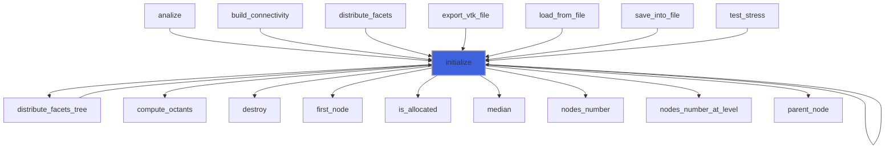

### save_geometry_tecplot_ascii

Save AABB tree boxes geometry into Tecplot ascii file.

```fortran
subroutine save_geometry_tecplot_ascii(self, file_name)
```

**Arguments**

| Name | Type | Intent | Attributes | Description |
|------|------|--------|------------|-------------|
| `self` | class([aabb_tree_object](/api/src/lib/fossil_aabb_tree_object#aabb-tree-object)) | in |  | AABB tree. |
| `file_name` | character(len=*) | in |  | File name. |

**Call graph**

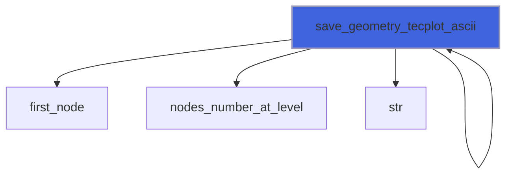

### translate

Translate AABB tree by delta.

**Attributes**: elemental

```fortran
subroutine translate(self, delta)
```

**Arguments**

| Name | Type | Intent | Attributes | Description |
|------|------|--------|------------|-------------|
| `self` | class([aabb_tree_object](/api/src/lib/fossil_aabb_tree_object#aabb-tree-object)) | inout |  | AABB. |
| `delta` | type([vector_R8P](/api/src/third_party/VecFor/src/lib/vecfor_R8P#vector-r8p)) | in |  | Delta of translation. |

**Call graph**

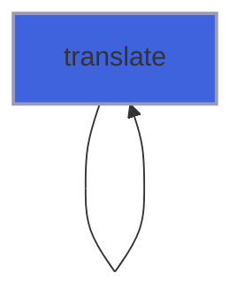

### aabb_tree_assign_aabb_tree

Operator `=`.

**Attributes**: pure

```fortran
subroutine aabb_tree_assign_aabb_tree(lhs, rhs)
```

**Arguments**

| Name | Type | Intent | Attributes | Description |
|------|------|--------|------------|-------------|
| `lhs` | class([aabb_tree_object](/api/src/lib/fossil_aabb_tree_object#aabb-tree-object)) | inout |  | Left hand side. |
| `rhs` | type([aabb_tree_object](/api/src/lib/fossil_aabb_tree_object#aabb-tree-object)) | in |  | Right hand side. |

**Call graph**

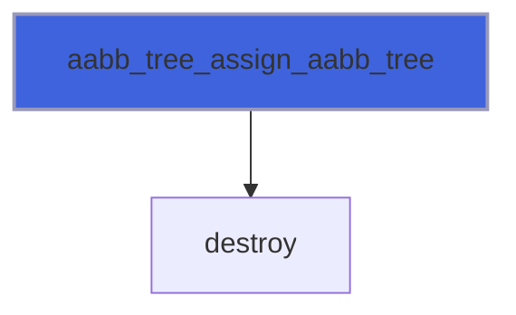

### next_location_code

Return the node next along a given direction.

**Attributes**: pure

```fortran
subroutine next_location_code(location_code, direction, next_code, next_direction)
```

**Arguments**

| Name | Type | Intent | Attributes | Description |
|------|------|--------|------------|-------------|
| `location_code` | integer(kind=[I4P](/api/src/third_party/PENF/src/lib/penf_global_parameters_variables)) | in |  | Location code queried. |
| `direction` | integer(kind=[I4P](/api/src/third_party/PENF/src/lib/penf_global_parameters_variables)) | in |  | Direction, 0=Halt, 1=X+, 2=X-, 3=Y+, 4=Y-, 5=Z+, 6=Z-. |
| `next_code` | integer(kind=[I4P](/api/src/third_party/PENF/src/lib/penf_global_parameters_variables)) | out | allocatable | Next location code of node along given direction. |
| `next_direction` | integer(kind=[I4P](/api/src/third_party/PENF/src/lib/penf_global_parameters_variables)) | out |  | Next direction. |

## Functions

### distance

Compute the (minimum) distance from a point to the triangulated surface.

**Attributes**: pure

**Returns**: real(kind=[R8P](/api/src/third_party/PENF/src/lib/penf_global_parameters_variables))

```fortran
function distance(self, facet, point)
```

**Arguments**

| Name | Type | Intent | Attributes | Description |
|------|------|--------|------------|-------------|
| `self` | class([aabb_tree_object](/api/src/lib/fossil_aabb_tree_object#aabb-tree-object)) | in |  | AABB tree. |
| `facet` | type([facet_object](/api/src/lib/fossil_facet_object#facet-object)) | in |  | Facets list. |
| `point` | type([vector_R8P](/api/src/third_party/VecFor/src/lib/vecfor_R8P#vector-r8p)) | in |  | Point coordinates. |

**Call graph**

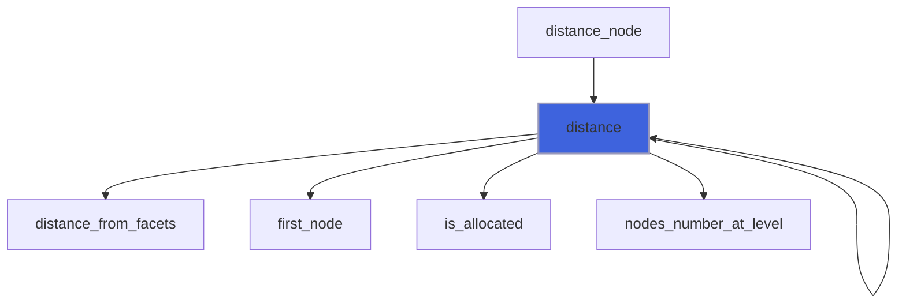

### distance_tree

Compute the (minimum) distance from a point to the triangulated surface.

**Returns**: real(kind=[R8P](/api/src/third_party/PENF/src/lib/penf_global_parameters_variables))

```fortran
function distance_tree(self, facet, point) result(distance)
```

**Arguments**

| Name | Type | Intent | Attributes | Description |
|------|------|--------|------------|-------------|
| `self` | class([aabb_tree_object](/api/src/lib/fossil_aabb_tree_object#aabb-tree-object)) | in |  | AABB tree. |
| `facet` | type([facet_object](/api/src/lib/fossil_facet_object#facet-object)) | in |  | Facets list. |
| `point` | type([vector_R8P](/api/src/third_party/VecFor/src/lib/vecfor_R8P#vector-r8p)) | in |  | Point coordinates. |

**Call graph**

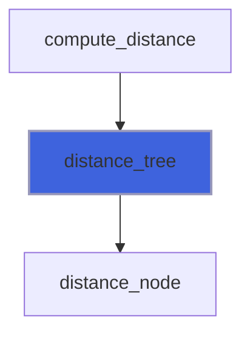

### has_children

Return true if node has at least one child allocated.

**Attributes**: pure

**Returns**: `logical`

```fortran
function has_children(self, node)
```

**Arguments**

| Name | Type | Intent | Attributes | Description |
|------|------|--------|------------|-------------|
| `self` | class([aabb_tree_object](/api/src/lib/fossil_aabb_tree_object#aabb-tree-object)) | in |  | AABB tree. |
| `node` | integer(kind=[I4P](/api/src/third_party/PENF/src/lib/penf_global_parameters_variables)) | in |  | Node queried. |

**Call graph**

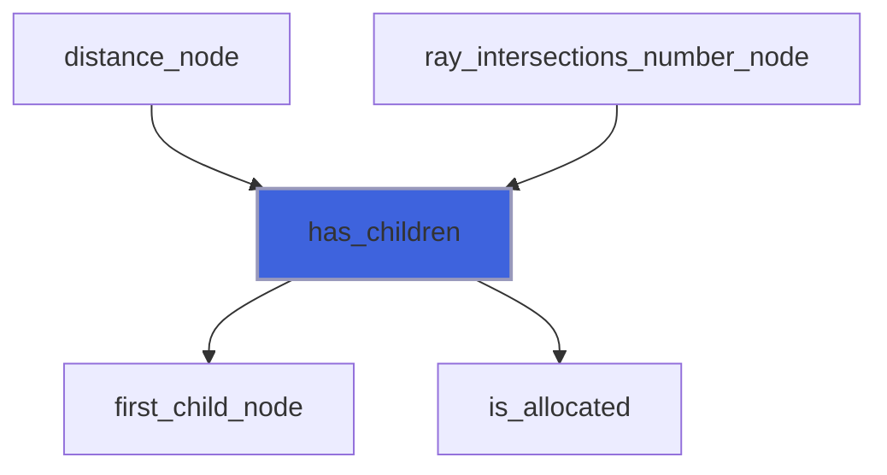

### loop_node

Loop over all nodes.

 @note Impure function: return data of each allocated node exploiting saved local counter.

**Returns**: `logical`

```fortran
function loop_node(self, facet, aabb_facet, b, l) result(again)
```

**Arguments**

| Name | Type | Intent | Attributes | Description |
|------|------|--------|------------|-------------|
| `self` | class([aabb_tree_object](/api/src/lib/fossil_aabb_tree_object#aabb-tree-object)) | in |  | AABB tree. |
| `facet` | type([facet_object](/api/src/lib/fossil_facet_object#facet-object)) | in | optional | Whole facets list. |
| `aabb_facet` | type([facet_object](/api/src/lib/fossil_facet_object#facet-object)) | out | allocatable, optional | AABB facets list. |
| `b` | integer(kind=[I4P](/api/src/third_party/PENF/src/lib/penf_global_parameters_variables)) | out | optional | Current AABB ID. |
| `l` | integer(kind=[I4P](/api/src/third_party/PENF/src/lib/penf_global_parameters_variables)) | out | optional | Current AABB level. |

**Call graph**

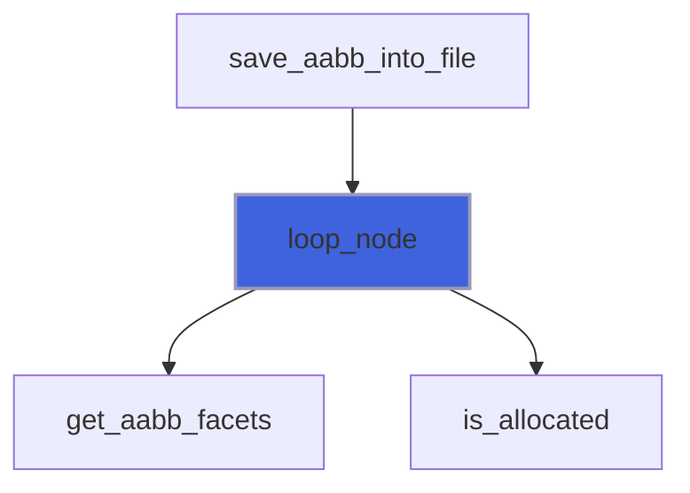

### ray_intersections_number

Return ray intersections number.

**Returns**: integer(kind=[I4P](/api/src/third_party/PENF/src/lib/penf_global_parameters_variables))

```fortran
function ray_intersections_number(self, facet, ray_origin, ray_direction) result(intersections_number)
```

**Arguments**

| Name | Type | Intent | Attributes | Description |
|------|------|--------|------------|-------------|
| `self` | class([aabb_tree_object](/api/src/lib/fossil_aabb_tree_object#aabb-tree-object)) | in |  | AABB tree. |
| `facet` | type([facet_object](/api/src/lib/fossil_facet_object#facet-object)) | in |  | Facets list. |
| `ray_origin` | type([vector_R8P](/api/src/third_party/VecFor/src/lib/vecfor_R8P#vector-r8p)) | in |  | Ray origin. |
| `ray_direction` | type([vector_R8P](/api/src/third_party/VecFor/src/lib/vecfor_R8P#vector-r8p)) | in |  | Ray direction. |

**Call graph**

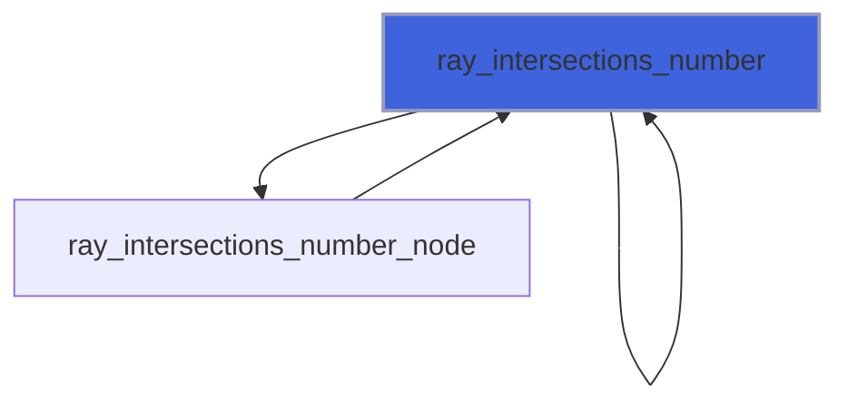

### distance_node

Return the (minimum) distance from a point to a node of AABB tree.

**Attributes**: recursive

**Returns**: real(kind=[R8P](/api/src/third_party/PENF/src/lib/penf_global_parameters_variables))

```fortran
function distance_node(self, n, facet, point) result(distance)
```

**Arguments**

| Name | Type | Intent | Attributes | Description |
|------|------|--------|------------|-------------|
| `self` | class([aabb_tree_object](/api/src/lib/fossil_aabb_tree_object#aabb-tree-object)) | in |  | AABB tree. |
| `n` | integer(kind=[I4P](/api/src/third_party/PENF/src/lib/penf_global_parameters_variables)) | in |  | Current AABB node. |
| `facet` | type([facet_object](/api/src/lib/fossil_facet_object#facet-object)) | in |  | Facets list. |
| `point` | type([vector_R8P](/api/src/third_party/VecFor/src/lib/vecfor_R8P#vector-r8p)) | in |  | Point coordinates. |

**Call graph**

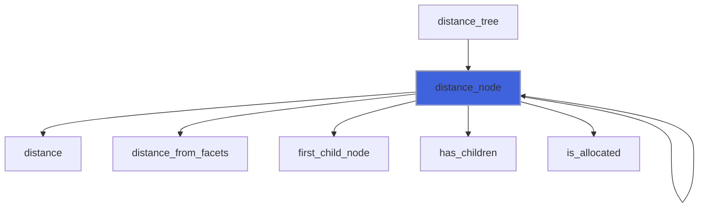

### ray_intersections_number_node

Return ray intersections number into a node of AABB tree.

**Attributes**: recursive

**Returns**: integer(kind=[I4P](/api/src/third_party/PENF/src/lib/penf_global_parameters_variables))

```fortran
function ray_intersections_number_node(self, n, facet, ray_origin, ray_direction) result(intersections_number)
```

**Arguments**

| Name | Type | Intent | Attributes | Description |
|------|------|--------|------------|-------------|
| `self` | class([aabb_tree_object](/api/src/lib/fossil_aabb_tree_object#aabb-tree-object)) | in |  | AABB tree. |
| `n` | integer(kind=[I4P](/api/src/third_party/PENF/src/lib/penf_global_parameters_variables)) | in |  | Current AABB node. |
| `facet` | type([facet_object](/api/src/lib/fossil_facet_object#facet-object)) | in |  | Facets list. |
| `ray_origin` | type([vector_R8P](/api/src/third_party/VecFor/src/lib/vecfor_R8P#vector-r8p)) | in |  | Ray origin. |
| `ray_direction` | type([vector_R8P](/api/src/third_party/VecFor/src/lib/vecfor_R8P#vector-r8p)) | in |  | Ray direction. |

**Call graph**

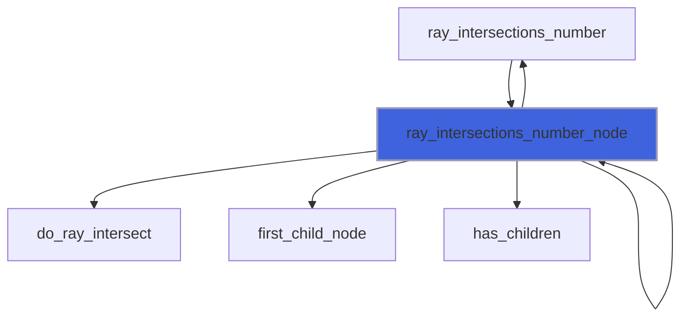

### first_child_node

Return first child tree node.

**Attributes**: pure

**Returns**: integer(kind=[I4P](/api/src/third_party/PENF/src/lib/penf_global_parameters_variables))

```fortran
function first_child_node(node)
```

**Arguments**

| Name | Type | Intent | Attributes | Description |
|------|------|--------|------------|-------------|
| `node` | integer(kind=[I4P](/api/src/third_party/PENF/src/lib/penf_global_parameters_variables)) | in |  | Node queried. |

**Call graph**

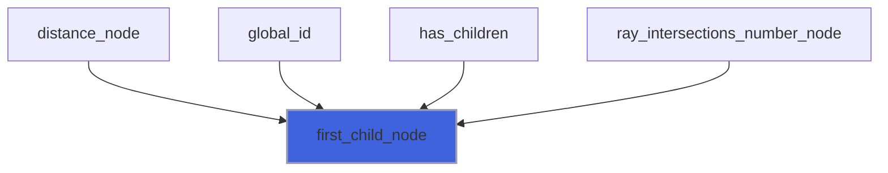

### first_node

Return first tree node at a given level.

**Attributes**: pure

**Returns**: integer(kind=[I4P](/api/src/third_party/PENF/src/lib/penf_global_parameters_variables))

```fortran
function first_node(level)
```

**Arguments**

| Name | Type | Intent | Attributes | Description |
|------|------|--------|------------|-------------|
| `level` | integer(kind=[I4P](/api/src/third_party/PENF/src/lib/penf_global_parameters_variables)) | in |  | Refinement level queried. |

**Call graph**

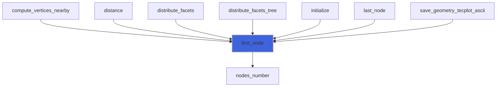

### last_node

Return last tree node at a given level.

**Attributes**: pure

**Returns**: integer(kind=[I4P](/api/src/third_party/PENF/src/lib/penf_global_parameters_variables))

```fortran
function last_node(level)
```

**Arguments**

| Name | Type | Intent | Attributes | Description |
|------|------|--------|------------|-------------|
| `level` | integer(kind=[I4P](/api/src/third_party/PENF/src/lib/penf_global_parameters_variables)) | in |  | Refinement level queried. |

**Call graph**

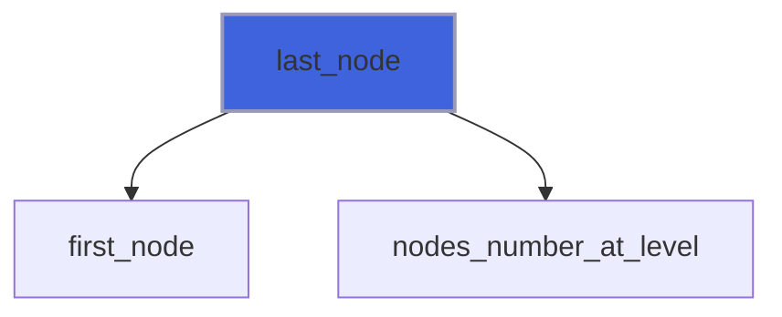

### level

Return level given a node id.

**Attributes**: pure

**Returns**: integer(kind=[I4P](/api/src/third_party/PENF/src/lib/penf_global_parameters_variables))

```fortran
function level(node)
```

**Arguments**

| Name | Type | Intent | Attributes | Description |
|------|------|--------|------------|-------------|
| `node` | integer(kind=[I4P](/api/src/third_party/PENF/src/lib/penf_global_parameters_variables)) | in |  | Node queried. |

### local_id

Return local ID of node.

**Attributes**: pure

**Returns**: integer(kind=[I4P](/api/src/third_party/PENF/src/lib/penf_global_parameters_variables))

```fortran
function local_id(node)
```

**Arguments**

| Name | Type | Intent | Attributes | Description |
|------|------|--------|------------|-------------|
| `node` | integer(kind=[I4P](/api/src/third_party/PENF/src/lib/penf_global_parameters_variables)) | in |  | Node queried. |

**Call graph**

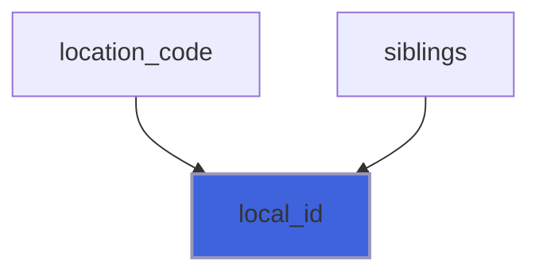

### location_code

Return location code of node.

**Attributes**: pure

**Returns**: integer(kind=[I4P](/api/src/third_party/PENF/src/lib/penf_global_parameters_variables))

```fortran
function location_code(node)
```

**Arguments**

| Name | Type | Intent | Attributes | Description |
|------|------|--------|------------|-------------|
| `node` | integer(kind=[I4P](/api/src/third_party/PENF/src/lib/penf_global_parameters_variables)) | in |  | Node queried. |

**Call graph**

```mermaid
flowchart TD
  location_code["location_code"] --> local_id["local_id"]
  location_code["location_code"] --> parent_node["parent_node"]
  style location_code fill:#3e63dd,stroke:#99b,stroke-width:2px
```

### global_id

Return node ID given a location code.

**Attributes**: pure

**Returns**: integer(kind=[I4P](/api/src/third_party/PENF/src/lib/penf_global_parameters_variables))

```fortran
function global_id(location_code) result(node)
```

**Arguments**

| Name | Type | Intent | Attributes | Description |
|------|------|--------|------------|-------------|
| `location_code` | integer(kind=[I4P](/api/src/third_party/PENF/src/lib/penf_global_parameters_variables)) | in |  | Location code. |

**Call graph**

```mermaid
flowchart TD
  global_id["global_id"] --> first_child_node["first_child_node"]
  style global_id fill:#3e63dd,stroke:#99b,stroke-width:2px
```

### nodes_number

Return total number of tree nodes given the total number refinement levels used.

**Attributes**: pure

**Returns**: integer(kind=[I4P](/api/src/third_party/PENF/src/lib/penf_global_parameters_variables))

```fortran
function nodes_number(refinement_levels)
```

**Arguments**

| Name | Type | Intent | Attributes | Description |
|------|------|--------|------------|-------------|
| `refinement_levels` | integer(kind=[I4P](/api/src/third_party/PENF/src/lib/penf_global_parameters_variables)) | in |  | Total number of refinement levels used. |

**Call graph**

```mermaid
flowchart TD
  first_node["first_node"] --> nodes_number["nodes_number"]
  initialize["initialize"] --> nodes_number["nodes_number"]
  nodes_number["nodes_number"] --> nodes_number_at_level["nodes_number_at_level"]
  style nodes_number fill:#3e63dd,stroke:#99b,stroke-width:2px
```

### nodes_number_at_level

Return number of tree nodes at a given level.

**Attributes**: pure

**Returns**: integer(kind=[I4P](/api/src/third_party/PENF/src/lib/penf_global_parameters_variables))

```fortran
function nodes_number_at_level(level) result(nodes_number)
```

**Arguments**

| Name | Type | Intent | Attributes | Description |
|------|------|--------|------------|-------------|
| `level` | integer(kind=[I4P](/api/src/third_party/PENF/src/lib/penf_global_parameters_variables)) | in |  | Refinement level queried. |

**Call graph**

```mermaid
flowchart TD
  compute_vertices_nearby["compute_vertices_nearby"] --> nodes_number_at_level["nodes_number_at_level"]
  distance["distance"] --> nodes_number_at_level["nodes_number_at_level"]
  distribute_facets["distribute_facets"] --> nodes_number_at_level["nodes_number_at_level"]
  distribute_facets_tree["distribute_facets_tree"] --> nodes_number_at_level["nodes_number_at_level"]
  initialize["initialize"] --> nodes_number_at_level["nodes_number_at_level"]
  last_node["last_node"] --> nodes_number_at_level["nodes_number_at_level"]
  nodes_number["nodes_number"] --> nodes_number_at_level["nodes_number_at_level"]
  save_geometry_tecplot_ascii["save_geometry_tecplot_ascii"] --> nodes_number_at_level["nodes_number_at_level"]
  style nodes_number_at_level fill:#3e63dd,stroke:#99b,stroke-width:2px
```

### parent_at_level

Return parent tree node at a given level.

**Attributes**: pure

**Returns**: integer(kind=[I4P](/api/src/third_party/PENF/src/lib/penf_global_parameters_variables))

```fortran
function parent_at_level(node, parent_level) result(parent)
```

**Arguments**

| Name | Type | Intent | Attributes | Description |
|------|------|--------|------------|-------------|
| `node` | integer(kind=[I4P](/api/src/third_party/PENF/src/lib/penf_global_parameters_variables)) | in |  | Node. |
| `parent_level` | integer(kind=[I4P](/api/src/third_party/PENF/src/lib/penf_global_parameters_variables)) | in |  | Level. |

### parent_node

Return parent tree node.

**Attributes**: pure

**Returns**: integer(kind=[I4P](/api/src/third_party/PENF/src/lib/penf_global_parameters_variables))

```fortran
function parent_node(node)
```

**Arguments**

| Name | Type | Intent | Attributes | Description |
|------|------|--------|------------|-------------|
| `node` | integer(kind=[I4P](/api/src/third_party/PENF/src/lib/penf_global_parameters_variables)) | in |  | Node queried. |

**Call graph**

```mermaid
flowchart TD
  distribute_facets_tree["distribute_facets_tree"] --> parent_node["parent_node"]
  initialize["initialize"] --> parent_node["parent_node"]
  location_code["location_code"] --> parent_node["parent_node"]
  style parent_node fill:#3e63dd,stroke:#99b,stroke-width:2px
```

### siblings

Return siblings of a given node.

**Attributes**: pure

**Returns**: integer(kind=[I4P](/api/src/third_party/PENF/src/lib/penf_global_parameters_variables))

```fortran
function siblings(node) result(sbs)
```

**Arguments**

| Name | Type | Intent | Attributes | Description |
|------|------|--------|------------|-------------|
| `node` | integer(kind=[I4P](/api/src/third_party/PENF/src/lib/penf_global_parameters_variables)) | in |  | Node queried. |

**Call graph**

```mermaid
flowchart TD
  siblings["siblings"] --> local_id["local_id"]
  style siblings fill:#3e63dd,stroke:#99b,stroke-width:2px
```

### str_location_code

Return string of location code of node.

**Attributes**: pure

**Returns**: `character(len=:)`

```fortran
function str_location_code(code)
```

**Arguments**

| Name | Type | Intent | Attributes | Description |
|------|------|--------|------------|-------------|
| `code` | integer(kind=[I4P](/api/src/third_party/PENF/src/lib/penf_global_parameters_variables)) | in |  | Node location code. |

**Call graph**

```mermaid
flowchart TD
  str_location_code["str_location_code"] --> str["str"]
  style str_location_code fill:#3e63dd,stroke:#99b,stroke-width:2px
```
