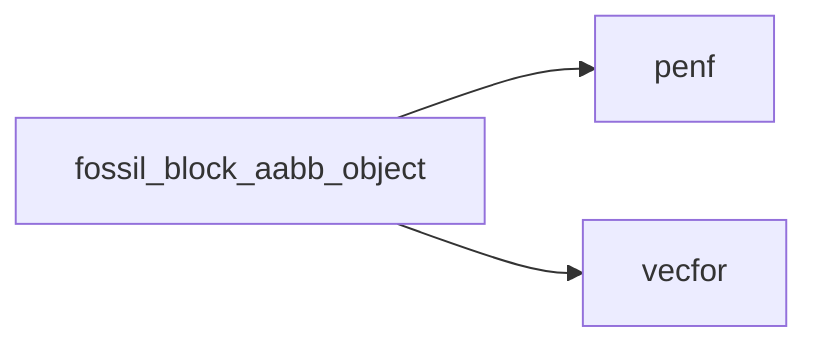
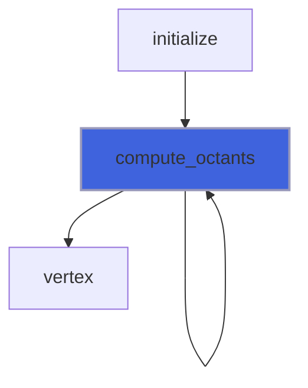
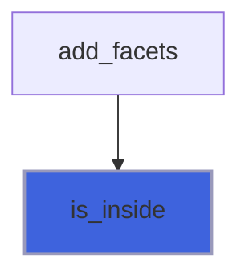
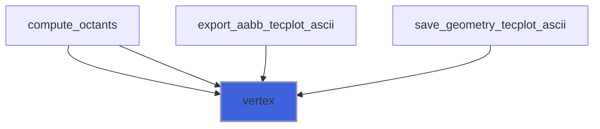

# fossil_block_aabb_object

> FOSSIL, Axis-Aligned Bounding Box (AABB) class definition for cartesian block.

**Source**: `src/lib/fossil_block_aabb_object.f90`

**Dependencies**



## Contents

- [aabb_object](#aabb-object)
- [compute_octants](#compute-octants)
- [aabb_assign_aabb](#aabb-assign-aabb)
- [is_inside](#is-inside)
- [vertex](#vertex)

## Derived Types

### aabb_object

AABB refinment class definition for cartesian block.

#### Components

| Name | Type | Attributes | Description |
|------|------|------------|-------------|
| `bmin` | type([vector_R8P](/api/src/third_party/VecFor/src/lib/vecfor_R8P#vector-r8p)) |  | Minimum point of AABB. |
| `bmax` | type([vector_R8P](/api/src/third_party/VecFor/src/lib/vecfor_R8P#vector-r8p)) |  | Maximum point of AABB. |

#### Type-Bound Procedures

| Name | Attributes | Description |
|------|------------|-------------|
| `compute_octants` | pass(self) | Compute AABB octants. |
| `is_inside` | pass(self) | Return the true if point is inside ABB. |
| `vertex` | pass(self) | Return AABB vertices. |
| `assignment(=)` |  | Overload `=`. |
| `aabb_assign_aabb` | pass(lhs) | Operator `=`. |

## Subroutines

### compute_octants

Return AABB octants.

**Attributes**: pure

```fortran
subroutine compute_octants(self, octant)
```

**Arguments**

| Name | Type | Intent | Attributes | Description |
|------|------|--------|------------|-------------|
| `self` | class([aabb_object](/api/src/lib/fossil_aabb_object#aabb-object)) | in |  | AABB. |
| `octant` | type([aabb_object](/api/src/lib/fossil_aabb_object#aabb-object)) | out |  | AABB octants. |

**Call graph**



### aabb_assign_aabb

Operator `=`.

**Attributes**: pure

```fortran
subroutine aabb_assign_aabb(lhs, rhs)
```

**Arguments**

| Name | Type | Intent | Attributes | Description |
|------|------|--------|------------|-------------|
| `lhs` | class([aabb_object](/api/src/lib/fossil_aabb_object#aabb-object)) | inout |  | Left hand side. |
| `rhs` | type([aabb_object](/api/src/lib/fossil_aabb_object#aabb-object)) | in |  | Right hand side. |

## Functions

### is_inside

Return the true if point is inside ABB.

**Attributes**: pure

**Returns**: `logical`

```fortran
function is_inside(self, point)
```

**Arguments**

| Name | Type | Intent | Attributes | Description |
|------|------|--------|------------|-------------|
| `self` | class([aabb_object](/api/src/lib/fossil_aabb_object#aabb-object)) | in |  | AABB. |
| `point` | type([vector_R8P](/api/src/third_party/VecFor/src/lib/vecfor_R8P#vector-r8p)) | in |  | Point reference. |

**Call graph**



### vertex

Return AABB vertices.

**Attributes**: pure

**Returns**: type([vector_R8P](/api/src/third_party/VecFor/src/lib/vecfor_R8P#vector-r8p))

```fortran
function vertex(self)
```

**Arguments**

| Name | Type | Intent | Attributes | Description |
|------|------|--------|------------|-------------|
| `self` | class([aabb_object](/api/src/lib/fossil_aabb_object#aabb-object)) | in |  | AABB. |

**Call graph**


