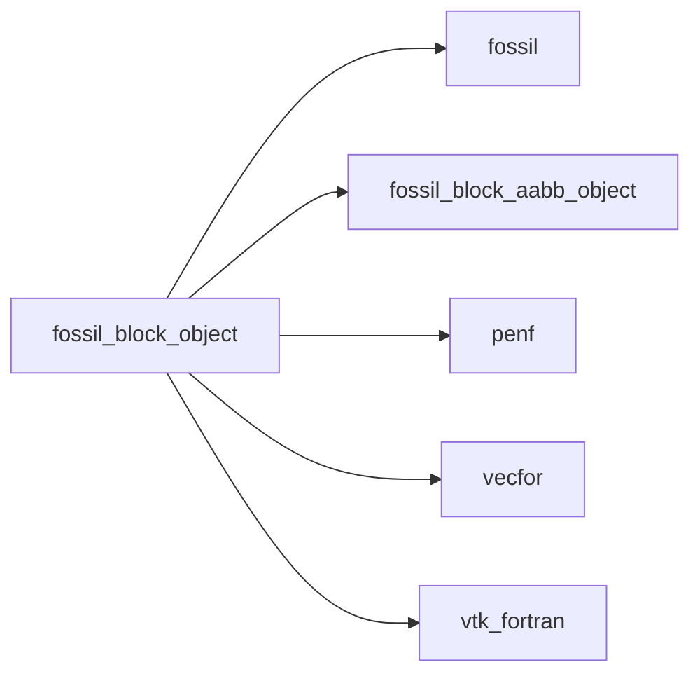
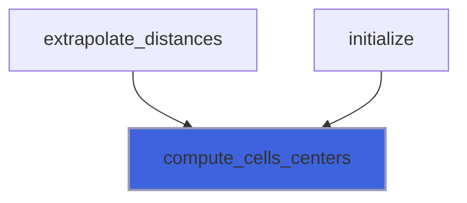
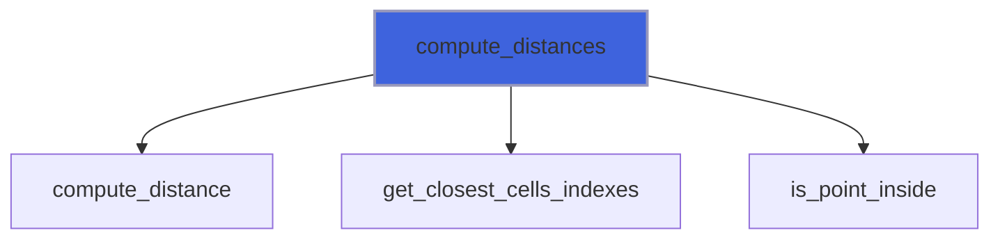
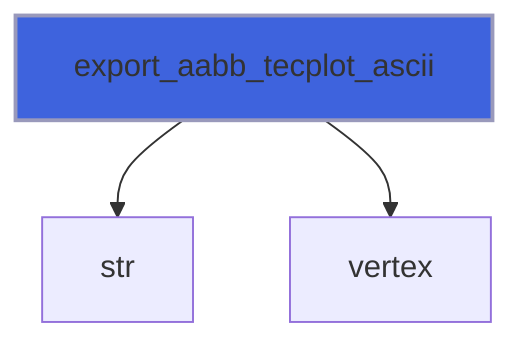
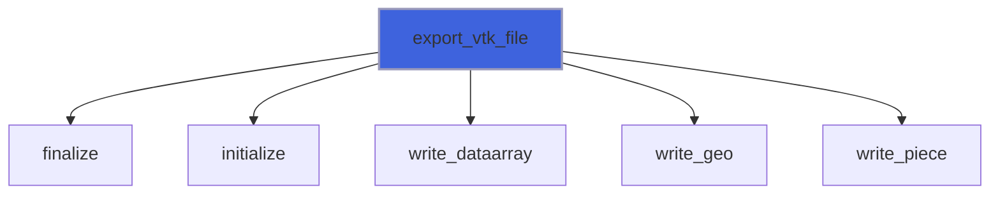
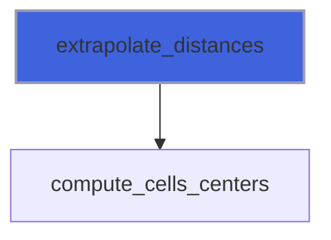
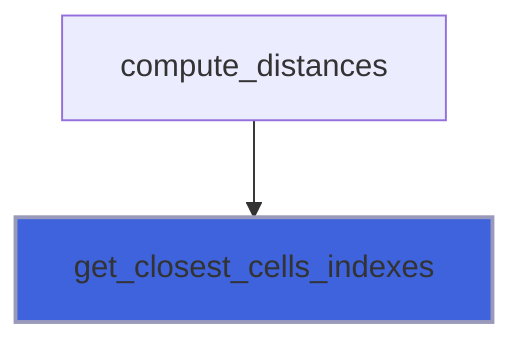
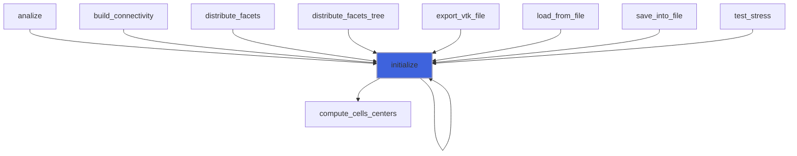

# fossil_block_object

> FOSSIL cartesian block class definition.

**Source**: `src/lib/fossil_block_object.f90`

**Dependencies**



## Contents

- [block_object](#block-object)
- [compute_cells_centers](#compute-cells-centers)
- [compute_distances](#compute-distances)
- [export_aabb_tecplot_ascii](#export-aabb-tecplot-ascii)
- [export_vtk_file](#export-vtk-file)
- [export_xall_files](#export-xall-files)
- [extrapolate_distances](#extrapolate-distances)
- [get_closest_cells_indexes](#get-closest-cells-indexes)
- [initialize](#initialize)
- [block_assign_block](#block-assign-block)

## Derived Types

### block_object

Cartesian block class definition.

#### Components

| Name | Type | Attributes | Description |
|------|------|------------|-------------|
| `bmin` | type([vector_R8P](/api/src/third_party/VecFor/src/lib/vecfor_R8P#vector-r8p)) |  | Bounding box extents. |
| `bmax` | type([vector_R8P](/api/src/third_party/VecFor/src/lib/vecfor_R8P#vector-r8p)) |  | Bounding box extents. |
| `ni` | integer(kind=[I4P](/api/src/third_party/PENF/src/lib/penf_global_parameters_variables)) |  | Grid dimensions where distance is computed exactly. |
| `nj` | integer(kind=[I4P](/api/src/third_party/PENF/src/lib/penf_global_parameters_variables)) |  | Grid dimensions where distance is computed exactly. |
| `nk` | integer(kind=[I4P](/api/src/third_party/PENF/src/lib/penf_global_parameters_variables)) |  | Grid dimensions where distance is computed exactly. |
| `gi` | integer(kind=[I4P](/api/src/third_party/PENF/src/lib/penf_global_parameters_variables)) |  | Frame around the grid where distance is computed exactly. |
| `gj` | integer(kind=[I4P](/api/src/third_party/PENF/src/lib/penf_global_parameters_variables)) |  | Frame around the grid where distance is computed exactly. |
| `gk` | integer(kind=[I4P](/api/src/third_party/PENF/src/lib/penf_global_parameters_variables)) |  | Frame around the grid where distance is computed exactly. |
| `ei` | integer(kind=[I4P](/api/src/third_party/PENF/src/lib/penf_global_parameters_variables)) |  | Extrapolation of the grid where distance is extraplated. |
| `ej` | integer(kind=[I4P](/api/src/third_party/PENF/src/lib/penf_global_parameters_variables)) |  | Extrapolation of the grid where distance is extraplated. |
| `ek` | integer(kind=[I4P](/api/src/third_party/PENF/src/lib/penf_global_parameters_variables)) |  | Extrapolation of the grid where distance is extraplated. |
| `Dx` | real(kind=[R8P](/api/src/third_party/PENF/src/lib/penf_global_parameters_variables)) |  | Space steps. |
| `Dy` | real(kind=[R8P](/api/src/third_party/PENF/src/lib/penf_global_parameters_variables)) |  | Space steps. |
| `Dz` | real(kind=[R8P](/api/src/third_party/PENF/src/lib/penf_global_parameters_variables)) |  | Space steps. |
| `refinement_levels` | integer(kind=[I4P](/api/src/third_party/PENF/src/lib/penf_global_parameters_variables)) |  | Total number of refinement levels used. |
| `Naabb` | integer(kind=[I4P](/api/src/third_party/PENF/src/lib/penf_global_parameters_variables)) |  | Number of AABB in each directions, 2**refinement_levels. |
| `aabb` | type([aabb_object](/api/src/lib/fossil_aabb_object#aabb-object)) | allocatable | AABB refinement blocks. |
| `nodes` | type([vector_R8P](/api/src/third_party/VecFor/src/lib/vecfor_R8P#vector-r8p)) | allocatable | Grid nodes. |
| `centers` | type([vector_R8P](/api/src/third_party/VecFor/src/lib/vecfor_R8P#vector-r8p)) | allocatable | Grid centers. |
| `distances` | real(kind=[R8P](/api/src/third_party/PENF/src/lib/penf_global_parameters_variables)) | allocatable | Distance of grid centers to STL surface. |

#### Type-Bound Procedures

| Name | Attributes | Description |
|------|------------|-------------|
| `compute_cells_centers` | pass(self) | Compute cells centers from nodes. |
| `compute_distances` | pass(self) | Compute distances of cells centers from Immersed Boundary. |
| `export_aabb_tecplot_ascii` | pass(self) | Export AABB boxes geometry into Tecplot ascii file. |
| `export_vtk_file` | pass(self) | Export block data into VTK file format. |
| `export_xall_files` | pass(self) | Export block data into XALL files format. |
| `extrapolate_distances` | pass(self) | Extrapolate the body-close distances in the body-far mesh. |
| `get_closest_cells_indexes` | pass(self) | Get the closest cells indexes in the mesh given a point. |
| `initialize` | pass(self) | Initialize block. |
| `assignment(=)` |  | Overload `=`. |
| `block_assign_block` | pass(lhs) | Operator `=`. |

## Subroutines

### compute_cells_centers

Compute cells centers from nodes.

**Attributes**: pure

```fortran
subroutine compute_cells_centers(self)
```

**Arguments**

| Name | Type | Intent | Attributes | Description |
|------|------|--------|------------|-------------|
| `self` | class([block_object](/api/src/lib/fossil_block_object#block-object)) | inout |  | Block. |

**Call graph**



### compute_distances

Compute distances of cells centers from Immersed Boundary.

```fortran
subroutine compute_distances(self, surface_stl, is_signed, sign_algorithm, invert_sign)
```

**Arguments**

| Name | Type | Intent | Attributes | Description |
|------|------|--------|------------|-------------|
| `self` | class([block_object](/api/src/lib/fossil_block_object#block-object)) | inout |  | Block. |
| `surface_stl` | type([surface_stl_object](/api/src/lib/fossil_surface_stl_object#surface-stl-object)) | in |  | STL surface. |
| `is_signed` | logical | in |  | Signed distance or not. |
| `sign_algorithm` | character(len=*) | in |  | Algorithm used for "point in polyhedron" test. |
| `invert_sign` | logical | in | optional | Invert sign of distances. |

**Call graph**



### export_aabb_tecplot_ascii

Export AABB boxes geometry into Tecplot ascii file.

```fortran
subroutine export_aabb_tecplot_ascii(self, file_name)
```

**Arguments**

| Name | Type | Intent | Attributes | Description |
|------|------|--------|------------|-------------|
| `self` | class([block_object](/api/src/lib/fossil_block_object#block-object)) | in |  | Block. |
| `file_name` | character(len=*) | in |  | File name. |

**Call graph**



### export_vtk_file

Export block data into VTK file format.

```fortran
subroutine export_vtk_file(self, file_name)
```

**Arguments**

| Name | Type | Intent | Attributes | Description |
|------|------|--------|------------|-------------|
| `self` | class([block_object](/api/src/lib/fossil_block_object#block-object)) | in |  | Block. |
| `file_name` | character(len=*) | in |  | File name. |

**Call graph**



### export_xall_files

Export block data into XALL files format.

```fortran
subroutine export_xall_files(self, basename)
```

**Arguments**

| Name | Type | Intent | Attributes | Description |
|------|------|--------|------------|-------------|
| `self` | class([block_object](/api/src/lib/fossil_block_object#block-object)) | in |  | Block. |
| `basename` | character(len=*) | in |  | Base files name. |

### extrapolate_distances

Extrapolate the body-close distances in the body-far mesh.

```fortran
subroutine extrapolate_distances(self)
```

**Arguments**

| Name | Type | Intent | Attributes | Description |
|------|------|--------|------------|-------------|
| `self` | class([block_object](/api/src/lib/fossil_block_object#block-object)) | inout |  | Block. |

**Call graph**



### get_closest_cells_indexes

Get the closest cells indexes in the mesh given a point.

```fortran
subroutine get_closest_cells_indexes(self, point, cindexes)
```

**Arguments**

| Name | Type | Intent | Attributes | Description |
|------|------|--------|------------|-------------|
| `self` | class([block_object](/api/src/lib/fossil_block_object#block-object)) | in |  | Block |
| `point` | type([vector_R8P](/api/src/third_party/VecFor/src/lib/vecfor_R8P#vector-r8p)) | in |  | Point coordinates. |
| `cindexes` | integer(kind=[I4P](/api/src/third_party/PENF/src/lib/penf_global_parameters_variables)) | out |  | Indexes (i,j,k) of the Nc closest cells. |

**Call graph**



### initialize

Initialize block.

**Attributes**: pure

```fortran
subroutine initialize(self, bmin, bmax, ni, nj, nk, gi, gj, gk, ei, ej, ek, refinement_levels)
```

**Arguments**

| Name | Type | Intent | Attributes | Description |
|------|------|--------|------------|-------------|
| `self` | class([block_object](/api/src/lib/fossil_block_object#block-object)) | inout |  | Block |
| `bmin` | type([vector_R8P](/api/src/third_party/VecFor/src/lib/vecfor_R8P#vector-r8p)) | in | optional | Bounding box extents. |
| `bmax` | type([vector_R8P](/api/src/third_party/VecFor/src/lib/vecfor_R8P#vector-r8p)) | in | optional | Bounding box extents. |
| `ni` | integer(kind=[I4P](/api/src/third_party/PENF/src/lib/penf_global_parameters_variables)) | in | optional | Grid dimensions where distance is computed exactly. |
| `nj` | integer(kind=[I4P](/api/src/third_party/PENF/src/lib/penf_global_parameters_variables)) | in | optional | Grid dimensions where distance is computed exactly. |
| `nk` | integer(kind=[I4P](/api/src/third_party/PENF/src/lib/penf_global_parameters_variables)) | in | optional | Grid dimensions where distance is computed exactly. |
| `gi` | integer(kind=[I4P](/api/src/third_party/PENF/src/lib/penf_global_parameters_variables)) | in | optional | Frame around the grid where distance is computed exactly. |
| `gj` | integer(kind=[I4P](/api/src/third_party/PENF/src/lib/penf_global_parameters_variables)) | in | optional | Frame around the grid where distance is computed exactly. |
| `gk` | integer(kind=[I4P](/api/src/third_party/PENF/src/lib/penf_global_parameters_variables)) | in | optional | Frame around the grid where distance is computed exactly. |
| `ei` | integer(kind=[I4P](/api/src/third_party/PENF/src/lib/penf_global_parameters_variables)) | in | optional | Extrapolation of the grid where distance is extraplated. |
| `ej` | integer(kind=[I4P](/api/src/third_party/PENF/src/lib/penf_global_parameters_variables)) | in | optional | Extrapolation of the grid where distance is extraplated. |
| `ek` | integer(kind=[I4P](/api/src/third_party/PENF/src/lib/penf_global_parameters_variables)) | in | optional | Extrapolation of the grid where distance is extraplated. |
| `refinement_levels` | integer(kind=[I4P](/api/src/third_party/PENF/src/lib/penf_global_parameters_variables)) | in | optional | Total number of refinement levels used. |

**Call graph**



### block_assign_block

Operator `=`.

**Attributes**: pure

```fortran
subroutine block_assign_block(lhs, rhs)
```

**Arguments**

| Name | Type | Intent | Attributes | Description |
|------|------|--------|------------|-------------|
| `lhs` | class([block_object](/api/src/lib/fossil_block_object#block-object)) | inout |  | Left hand side. |
| `rhs` | type([block_object](/api/src/lib/fossil_block_object#block-object)) | in |  | Right hand side. |
