# fossil_facet_object

> FOSSIL, facet class definition.

**Source**: `src/lib/fossil_facet_object.f90`

**Dependencies**

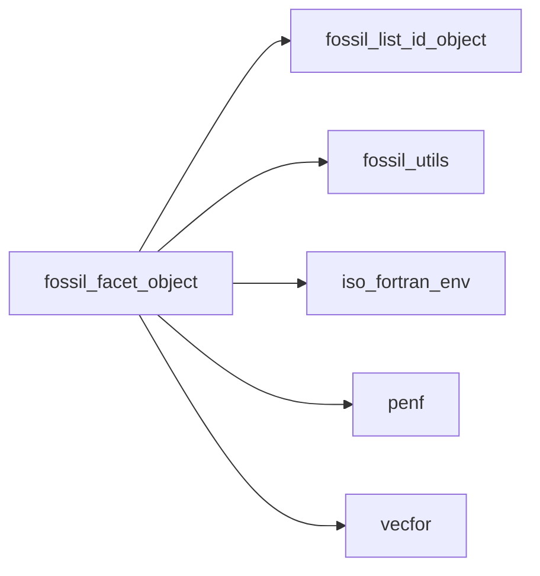

## Contents

- [facet_object](#facet-object)
- [load_from_file_interface](#load-from-file-interface)
- [save_into_file_interface](#save-into-file-interface)
- [compute_distance](#compute-distance)
- [compute_metrix](#compute-metrix)
- [compute_normal](#compute-normal)
- [compute_pseudo_normals](#compute-pseudo-normals)
- [compute_vertices_nearby](#compute-vertices-nearby)
- [connect_nearby_vertices](#connect-nearby-vertices)
- [destroy](#destroy)
- [destroy_connectivity](#destroy-connectivity)
- [initialize](#initialize)
- [load_from_file_ascii](#load-from-file-ascii)
- [load_from_file_binary](#load-from-file-binary)
- [make_normal_consistent](#make-normal-consistent)
- [resize](#resize)
- [reverse_normal](#reverse-normal)
- [save_into_file_ascii](#save-into-file-ascii)
- [save_into_file_binary](#save-into-file-binary)
- [translate](#translate)
- [update_connectivity](#update-connectivity)
- [flip_edge](#flip-edge)
- [mirror_by_normal](#mirror-by-normal)
- [mirror_by_matrix](#mirror-by-matrix)
- [rotate_by_axis_angle](#rotate-by-axis-angle)
- [rotate_by_matrix](#rotate-by-matrix)
- [edge_connection_in_other_ref](#edge-connection-in-other-ref)
- [facet_assign_facet](#facet-assign-facet)
- [merge_vertices](#merge-vertices)
- [put_in_list](#put-in-list)
- [centroid_part](#centroid-part)
- [check_normal](#check-normal)
- [do_ray_intersect](#do-ray-intersect)
- [largest_edge_len](#largest-edge-len)
- [smallest_edge_len](#smallest-edge-len)
- [solid_angle](#solid-angle)
- [tetrahedron_volume](#tetrahedron-volume)
- [vertex_angle](#vertex-angle)
- [vertex_global_id](#vertex-global-id)
- [face_id](#face-id)
- [vertex_local_id](#vertex-local-id)

## Derived Types

### facet_object

FOSSIL, facet class.

#### Components

| Name | Type | Attributes | Description |
|------|------|------------|-------------|
| `normal` | type([vector_R8P](/api/src/third_party/VecFor/src/lib/vecfor_R8P#vector-r8p)) |  | Facet (outward) normal (versor), `(v2-v1).cross.(v3-v1)`. |
| `vertex` | type([vector_R8P](/api/src/third_party/VecFor/src/lib/vecfor_R8P#vector-r8p)) |  | Facet vertices. |
| `centroid` | type([vector_R8P](/api/src/third_party/VecFor/src/lib/vecfor_R8P#vector-r8p)) |  | Facet's centroid. |
| `E12` | type([vector_R8P](/api/src/third_party/VecFor/src/lib/vecfor_R8P#vector-r8p)) |  | Edge 1-2, `V2-V1`. |
| `E13` | type([vector_R8P](/api/src/third_party/VecFor/src/lib/vecfor_R8P#vector-r8p)) |  | Edge 1-3, `V3-V1`. |
| `a` | real(kind=[R8P](/api/src/third_party/PENF/src/lib/penf_global_parameters_variables)) |  | `E12.dot.E12`. |
| `b` | real(kind=[R8P](/api/src/third_party/PENF/src/lib/penf_global_parameters_variables)) |  | `E12.dot.E13`. |
| `c` | real(kind=[R8P](/api/src/third_party/PENF/src/lib/penf_global_parameters_variables)) |  | `E13.dot.E13`. |
| `det` | real(kind=[R8P](/api/src/third_party/PENF/src/lib/penf_global_parameters_variables)) |  | `a*c - b*b`. |
| `d` | real(kind=[R8P](/api/src/third_party/PENF/src/lib/penf_global_parameters_variables)) |  | `normal.dot.vertex(1)` |
| `bb` | type([vector_R8P](/api/src/third_party/VecFor/src/lib/vecfor_R8P#vector-r8p)) |  | Axis-aligned bounding box (AABB), bb(1)=min, bb(2)=max. |
| `id` | integer(kind=[I4P](/api/src/third_party/PENF/src/lib/penf_global_parameters_variables)) |  | Facet global ID. |
| `fcon_edge_12` | integer(kind=[I4P](/api/src/third_party/PENF/src/lib/penf_global_parameters_variables)) |  | Connected face ID along edge 1-2. |
| `fcon_edge_23` | integer(kind=[I4P](/api/src/third_party/PENF/src/lib/penf_global_parameters_variables)) |  | Connected face ID along edge 2-3. |
| `fcon_edge_31` | integer(kind=[I4P](/api/src/third_party/PENF/src/lib/penf_global_parameters_variables)) |  | Connected face ID along edge 3-1. |
| `vertex_occurrence` | type([list_id_object](/api/src/lib/fossil_list_id_object#list-id-object)) |  | List of vertices "occurrencies", list of facets global ID containing them. |
| `vertex_nearby` | type([list_id_object](/api/src/lib/fossil_list_id_object#list-id-object)) |  | List of vertices "nearby", list of vertices global ID nearby them. |
| `edge_12_pnormal` | type([vector_R8P](/api/src/third_party/VecFor/src/lib/vecfor_R8P#vector-r8p)) |  | Edge 1-2 pseudo-normal. |
| `edge_23_pnormal` | type([vector_R8P](/api/src/third_party/VecFor/src/lib/vecfor_R8P#vector-r8p)) |  | Edge 2-3 pseudo-normal. |
| `edge_31_pnormal` | type([vector_R8P](/api/src/third_party/VecFor/src/lib/vecfor_R8P#vector-r8p)) |  | Edge 3-3 pseudo-normal. |
| `vertex_pnormal` | type([vector_R8P](/api/src/third_party/VecFor/src/lib/vecfor_R8P#vector-r8p)) |  | Vertices pseudo-normals. |

#### Type-Bound Procedures

| Name | Attributes | Description |
|------|------------|-------------|
| `centroid_part` | pass(self) | Return facet's part to build up STL centroid. |
| `check_normal` | pass(self) | Check normal consistency. |
| `compute_distance` | pass(self) | Compute the (unsigned, squared) distance from a point to facet. |
| `compute_metrix` | pass(self) | Compute local (plane) metrix. |
| `compute_normal` | pass(self) | Compute normal by means of vertices data. |
| `compute_pseudo_normals` | pass(self) | Compute pseudo normals. |
| `compute_vertices_nearby` | pass(self) | Compute vertices nearby comparing to ones of other facet. |
| `connect_nearby_vertices` | pass(self) | Connect nearby vertices of disconnected edges. |
| `destroy` | pass(self) | Destroy facet. |
| `destroy_connectivity` | pass(self) | Destroy facet connectivity. |
| `do_ray_intersect` | pass(self) | Return true if facet is intersected by a ray. |
| `initialize` | pass(self) | Initialize facet. |
| `largest_edge_len` | pass(self) | Return the largest edge length. |
| `load_from_file_ascii` | pass(self) | Load facet from ASCII file. |
| `load_from_file_binary` | pass(self) | Load facet from binary file. |
| `make_normal_consistent` | pass(self) | Make normal of other facet consistent with self. |
| `mirror` |  | Mirror facet. |
| `reverse_normal` | pass(self) | Reverse facet normal. |
| `resize` | pass(self) | Resize (scale) facet by x or y or z or vectorial factors. |
| `rotate` |  | Rotate facet. |
| `save_into_file_ascii` | pass(self) | Save facet into ASCII file. |
| `save_into_file_binary` | pass(self) | Save facet into binary file. |
| `smallest_edge_len` | pass(self) | Return the smallest edge length. |
| `solid_angle` | pass(self) | Return the (projected) solid angle of the facet with respect point. |
| `tetrahedron_volume` | pass(self) | Return the volume of tetrahedron built by facet and a given apex. |
| `translate` | pass(self) | Translate facet given vectorial delta. |
| `update_connectivity` | pass(self) | Update facet connectivity. |
| `vertex_angle` | pass(self) | Return the subtended angle of given vertex. |
| `vertex_global_id` | pass(self) | Return the vertex global id given the local one. |
| `assignment(=)` |  | Overload `=`. |
| `edge_connection_in_other_ref` | pass(self) | Return the edge of connection in the other reference. |
| `facet_assign_facet` | pass(lhs) | Operator `=`. |
| `flip_edge` | pass(self) | Flip facet edge. |
| `mirror_by_normal` | pass(self) | Mirror facet given normal of mirroring plane. |
| `mirror_by_matrix` | pass(self) | Mirror facet given matrix. |
| `rotate_by_axis_angle` | pass(self) | Rotate facet given axis and angle. |
| `rotate_by_matrix` | pass(self) | Rotate facet given matrix. |

## Interfaces

### load_from_file_interface

### load_from_file_interface

Load facet from file, generic interface.

```fortran
subroutine load_from_file_interface(self, file_unit)
```

**Arguments**

| Name | Type | Intent | Attributes | Description |
|------|------|--------|------------|-------------|
| `self` | class([facet_object](/api/src/lib/fossil_facet_object#facet-object)) | inout |  | Facet. |
| `file_unit` | integer(kind=[I4P](/api/src/third_party/PENF/src/lib/penf_global_parameters_variables)) | in |  | File unit. |

### save_into_file_interface

### save_into_file_interface

Save facet into file, generic interface.

```fortran
subroutine save_into_file_interface(self, file_unit)
```

**Arguments**

| Name | Type | Intent | Attributes | Description |
|------|------|--------|------------|-------------|
| `self` | class([facet_object](/api/src/lib/fossil_facet_object#facet-object)) | in |  | Facet. |
| `file_unit` | integer(kind=[I4P](/api/src/third_party/PENF/src/lib/penf_global_parameters_variables)) | in |  | File unit. |

## Subroutines

### compute_distance

Compute the (unsigned, squared) distance from a point to the facet surface.

 @note Facet's metrix must be already computed.

 @note Algorithm by David Eberly, Geometric Tools LLC, http://www.geometrictools.com.

**Attributes**: pure

```fortran
subroutine compute_distance(self, point, distance)
```

**Arguments**

| Name | Type | Intent | Attributes | Description |
|------|------|--------|------------|-------------|
| `self` | class([facet_object](/api/src/lib/fossil_facet_object#facet-object)) | in |  | Facet. |
| `point` | type([vector_R8P](/api/src/third_party/VecFor/src/lib/vecfor_R8P#vector-r8p)) | in |  | Point. |
| `distance` | real(kind=[R8P](/api/src/third_party/PENF/src/lib/penf_global_parameters_variables)) | out |  | Closest distance from point to the facet. |

**Call graph**

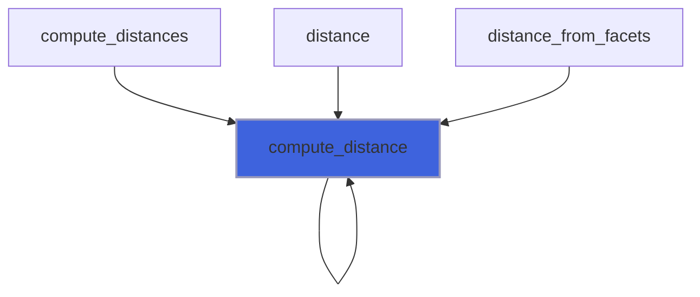

### compute_metrix

Compute local (plane) metrix.

**Attributes**: elemental

```fortran
subroutine compute_metrix(self)
```

**Arguments**

| Name | Type | Intent | Attributes | Description |
|------|------|--------|------------|-------------|
| `self` | class([facet_object](/api/src/lib/fossil_facet_object#facet-object)) | inout |  | Facet. |

**Call graph**

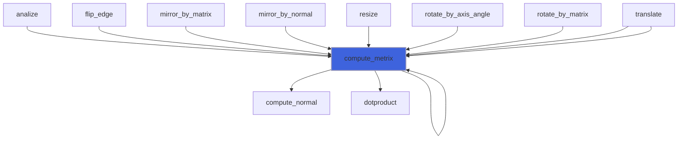

### compute_normal

Compute normal by means of vertices data.

```fortran
 type(facet_object) :: facet
 facet%vertex(1) = -0.231369_R4P * ex_R4P + 0.0226865_R4P * ey_R4P + 1._R4P * ez_R4P
 facet%vertex(2) = -0.227740_R4P * ex_R4P + 0.0245457_R4P * ey_R4P + 0._R4P * ez_R4P
 facet%vertex(2) = -0.235254_R4P * ex_R4P + 0.0201881_R4P * ey_R4P + 0._R4P * ez_R4P
 call facet%sanitize_normal
 print "(3(F3.1,1X))", facet%normal%x, facet%normal%y, facet%normal%z
```

**Attributes**: elemental

```fortran
subroutine compute_normal(self)
```

**Arguments**

| Name | Type | Intent | Attributes | Description |
|------|------|--------|------------|-------------|
| `self` | class([facet_object](/api/src/lib/fossil_facet_object#facet-object)) | inout |  | Facet. |

**Call graph**

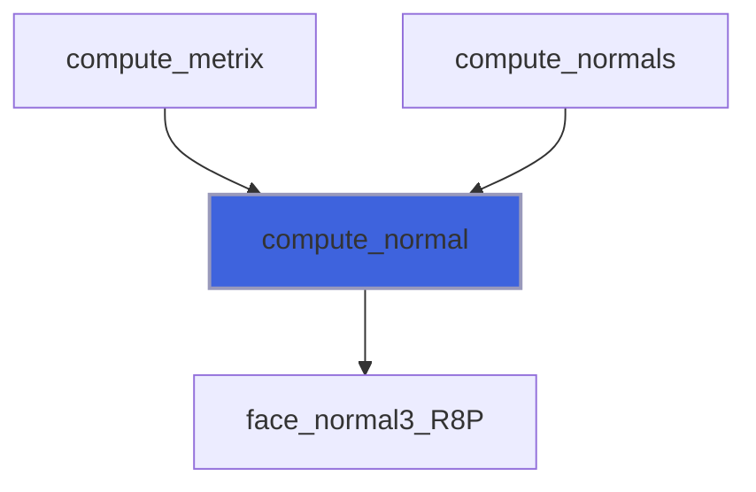

### compute_pseudo_normals

Compute pseudo normals.

 @note Connectivity must be already computed.

**Attributes**: pure

```fortran
subroutine compute_pseudo_normals(self, facet)
```

**Arguments**

| Name | Type | Intent | Attributes | Description |
|------|------|--------|------------|-------------|
| `self` | class([facet_object](/api/src/lib/fossil_facet_object#facet-object)) | inout |  | Facet. |
| `facet` | type([facet_object](/api/src/lib/fossil_facet_object#facet-object)) | in |  | Facets list. |

**Call graph**

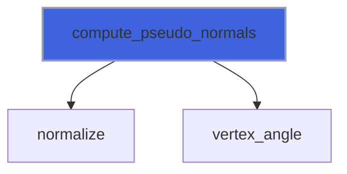

### compute_vertices_nearby

Compute vertices nearby comparing to ones of other facet.

**Attributes**: pure

```fortran
subroutine compute_vertices_nearby(self, other, tolerance_to_be_identical, tolerance_to_be_nearby)
```

**Arguments**

| Name | Type | Intent | Attributes | Description |
|------|------|--------|------------|-------------|
| `self` | class([facet_object](/api/src/lib/fossil_facet_object#facet-object)) | inout |  | Facet. |
| `other` | type([facet_object](/api/src/lib/fossil_facet_object#facet-object)) | inout |  | Other facet. |
| `tolerance_to_be_identical` | real(kind=[R8P](/api/src/third_party/PENF/src/lib/penf_global_parameters_variables)) | in |  | Tolerance to identify identical vertices. |
| `tolerance_to_be_nearby` | real(kind=[R8P](/api/src/third_party/PENF/src/lib/penf_global_parameters_variables)) | in |  | Tolerance to identify nearby vertices. |

**Call graph**

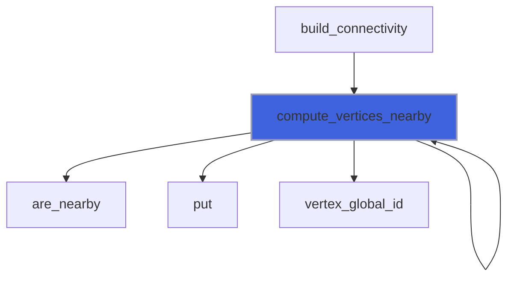

### connect_nearby_vertices

Connect nearby vertices of disconnected edges.

**Attributes**: pure

```fortran
subroutine connect_nearby_vertices(self, facet)
```

**Arguments**

| Name | Type | Intent | Attributes | Description |
|------|------|--------|------------|-------------|
| `self` | class([facet_object](/api/src/lib/fossil_facet_object#facet-object)) | inout |  | Facet. |
| `facet` | type([facet_object](/api/src/lib/fossil_facet_object#facet-object)) | inout |  | All facets in STL. |

**Call graph**

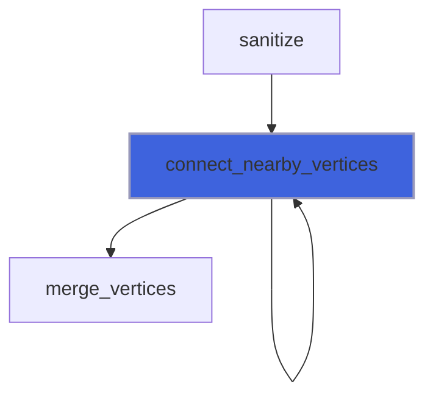

### destroy

Destroy facet.

**Attributes**: elemental

```fortran
subroutine destroy(self)
```

**Arguments**

| Name | Type | Intent | Attributes | Description |
|------|------|--------|------------|-------------|
| `self` | class([facet_object](/api/src/lib/fossil_facet_object#facet-object)) | inout |  | Facet. |

**Call graph**

```mermaid
flowchart TD
  aabb_node_assign_aabb_node["aabb_node_assign_aabb_node"] --> destroy["destroy"]
  aabb_tree_assign_aabb_tree["aabb_tree_assign_aabb_tree"] --> destroy["destroy"]
  add_facets["add_facets"] --> destroy["destroy"]
  allocate_facets["allocate_facets"] --> destroy["destroy"]
  compute_facets_disconnected["compute_facets_disconnected"] --> destroy["destroy"]
  destroy["destroy"] --> destroy["destroy"]
  destroy_connectivity["destroy_connectivity"] --> destroy["destroy"]
  distribute_facets["distribute_facets"] --> destroy["destroy"]
  distribute_facets_tree["distribute_facets_tree"] --> destroy["destroy"]
  initialize["initialize"] --> destroy["destroy"]
  initialize["initialize"] --> destroy["destroy"]
  initialize["initialize"] --> destroy["destroy"]
  initialize["initialize"] --> destroy["destroy"]
  initialize["initialize"] --> destroy["destroy"]
  initialize["initialize"] --> destroy["destroy"]
  merge_vertices["merge_vertices"] --> destroy["destroy"]
  surface_stl_assign_surface_stl["surface_stl_assign_surface_stl"] --> destroy["destroy"]
  union["union"] --> destroy["destroy"]
  style destroy fill:#3e63dd,stroke:#99b,stroke-width:2px
```

### destroy_connectivity

Destroy facet connectivity.

**Attributes**: elemental

```fortran
subroutine destroy_connectivity(self)
```

**Arguments**

| Name | Type | Intent | Attributes | Description |
|------|------|--------|------------|-------------|
| `self` | class([facet_object](/api/src/lib/fossil_facet_object#facet-object)) | inout |  | Facet. |

**Call graph**

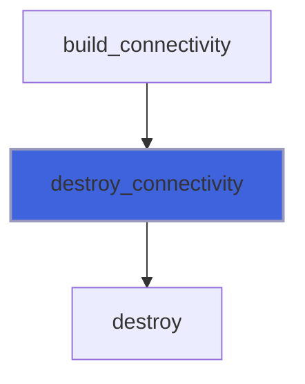

### initialize

Initialize facet.

**Attributes**: elemental

```fortran
subroutine initialize(self)
```

**Arguments**

| Name | Type | Intent | Attributes | Description |
|------|------|--------|------------|-------------|
| `self` | class([facet_object](/api/src/lib/fossil_facet_object#facet-object)) | inout |  | Facet. |

**Call graph**

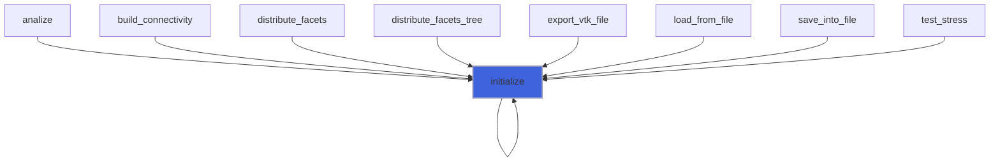

### load_from_file_ascii

Load facet from ASCII file.

```fortran
subroutine load_from_file_ascii(self, file_unit)
```

**Arguments**

| Name | Type | Intent | Attributes | Description |
|------|------|--------|------------|-------------|
| `self` | class([facet_object](/api/src/lib/fossil_facet_object#facet-object)) | inout |  | Facet. |
| `file_unit` | integer(kind=[I4P](/api/src/third_party/PENF/src/lib/penf_global_parameters_variables)) | in |  | File unit. |

**Call graph**

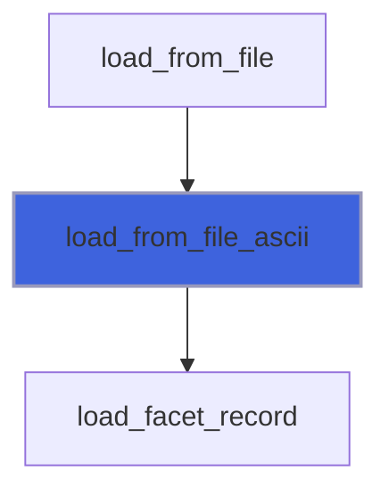

### load_from_file_binary

Load facet from binary file.

```fortran
subroutine load_from_file_binary(self, file_unit)
```

**Arguments**

| Name | Type | Intent | Attributes | Description |
|------|------|--------|------------|-------------|
| `self` | class([facet_object](/api/src/lib/fossil_facet_object#facet-object)) | inout |  | Facet. |
| `file_unit` | integer(kind=[I4P](/api/src/third_party/PENF/src/lib/penf_global_parameters_variables)) | in |  | File unit. |

**Call graph**

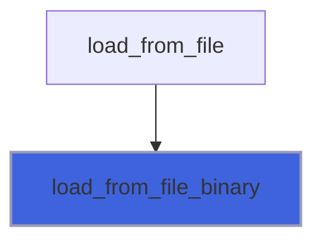

### make_normal_consistent

Make normal of other facet consistent with self.

**Attributes**: pure

```fortran
subroutine make_normal_consistent(self, edge_dir, other)
```

**Arguments**

| Name | Type | Intent | Attributes | Description |
|------|------|--------|------------|-------------|
| `self` | class([facet_object](/api/src/lib/fossil_facet_object#facet-object)) | in |  | Facet. |
| `edge_dir` | character(len=*) | in |  | Edge (in self numeration) along which other is connected. |
| `other` | type([facet_object](/api/src/lib/fossil_facet_object#facet-object)) | inout |  | Other facet to make consistent with self. |

**Call graph**

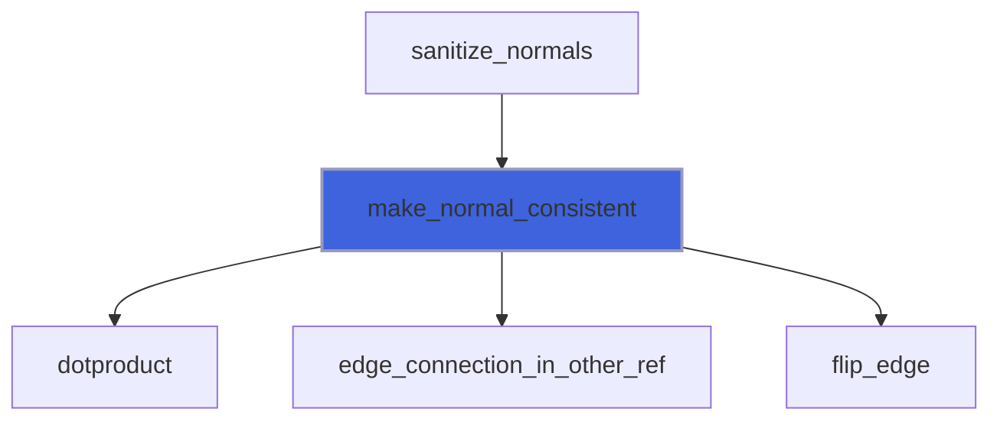

### resize

Resize (scale) facet by x or y or z or vectorial factors.

 @note The name `scale` has not been used, it been a Fortran built-in.

**Attributes**: elemental

```fortran
subroutine resize(self, factor, center)
```

**Arguments**

| Name | Type | Intent | Attributes | Description |
|------|------|--------|------------|-------------|
| `self` | class([facet_object](/api/src/lib/fossil_facet_object#facet-object)) | inout |  | Facet |
| `factor` | type([vector_R8P](/api/src/third_party/VecFor/src/lib/vecfor_R8P#vector-r8p)) | in |  | Vectorial factor. |
| `center` | type([vector_R8P](/api/src/third_party/VecFor/src/lib/vecfor_R8P#vector-r8p)) | in |  | Center of resize. |

**Call graph**

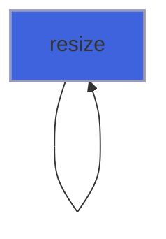

### reverse_normal

Reverse facet normal.

**Attributes**: elemental

```fortran
subroutine reverse_normal(self)
```

**Arguments**

| Name | Type | Intent | Attributes | Description |
|------|------|--------|------------|-------------|
| `self` | class([facet_object](/api/src/lib/fossil_facet_object#facet-object)) | inout |  | Facet. |

**Call graph**

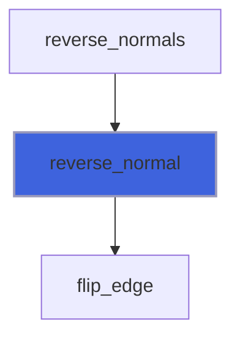

### save_into_file_ascii

Save facet into ASCII file.

```fortran
subroutine save_into_file_ascii(self, file_unit)
```

**Arguments**

| Name | Type | Intent | Attributes | Description |
|------|------|--------|------------|-------------|
| `self` | class([facet_object](/api/src/lib/fossil_facet_object#facet-object)) | in |  | Facet. |
| `file_unit` | integer(kind=[I4P](/api/src/third_party/PENF/src/lib/penf_global_parameters_variables)) | in |  | File unit. |

**Call graph**

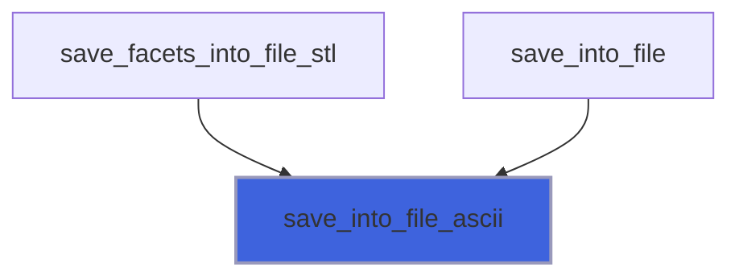

### save_into_file_binary

Save facet into binary file.

```fortran
subroutine save_into_file_binary(self, file_unit)
```

**Arguments**

| Name | Type | Intent | Attributes | Description |
|------|------|--------|------------|-------------|
| `self` | class([facet_object](/api/src/lib/fossil_facet_object#facet-object)) | in |  | Facet. |
| `file_unit` | integer(kind=[I4P](/api/src/third_party/PENF/src/lib/penf_global_parameters_variables)) | in |  | File unit. |

**Call graph**

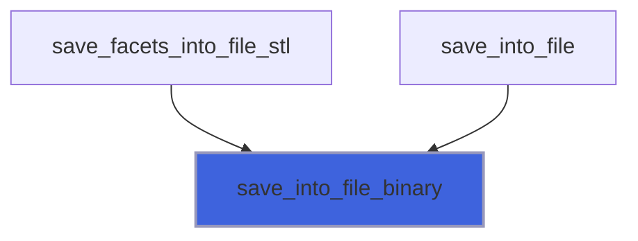

### translate

Translate facet given vectorial delta.

**Attributes**: elemental

```fortran
subroutine translate(self, delta, recompute_metrix)
```

**Arguments**

| Name | Type | Intent | Attributes | Description |
|------|------|--------|------------|-------------|
| `self` | class([facet_object](/api/src/lib/fossil_facet_object#facet-object)) | inout |  | Facet. |
| `delta` | type([vector_R8P](/api/src/third_party/VecFor/src/lib/vecfor_R8P#vector-r8p)) | in |  | Translation delta. |
| `recompute_metrix` | logical | in | optional | Sentinel to activate metrix recomputation. |

**Call graph**

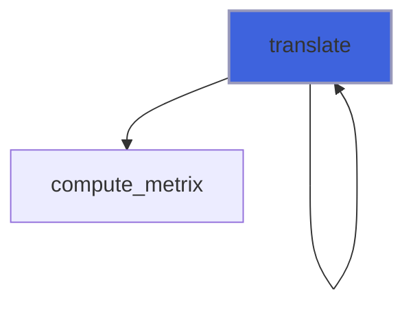

### update_connectivity

Update facet connectivity.

 @note Vertices occurrencies list must be already computed.

**Attributes**: pure

```fortran
subroutine update_connectivity(self)
```

**Arguments**

| Name | Type | Intent | Attributes | Description |
|------|------|--------|------------|-------------|
| `self` | class([facet_object](/api/src/lib/fossil_facet_object#facet-object)) | inout |  | Facet. |

**Call graph**

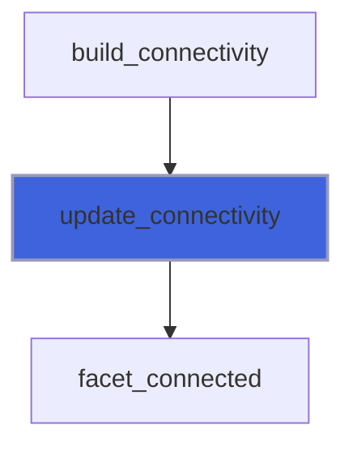

### flip_edge

Flip facet edge.

**Attributes**: pure

```fortran
subroutine flip_edge(self, edge_dir)
```

**Arguments**

| Name | Type | Intent | Attributes | Description |
|------|------|--------|------------|-------------|
| `self` | class([facet_object](/api/src/lib/fossil_facet_object#facet-object)) | inout |  | Facet. |
| `edge_dir` | character(len=*) | in |  | Edge to be flipped. |

**Call graph**

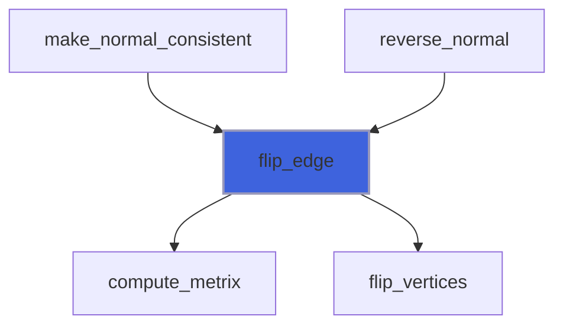

### mirror_by_normal

Mirror facet given normal of mirroring plane.

**Attributes**: pure

```fortran
subroutine mirror_by_normal(self, normal, recompute_metrix)
```

**Arguments**

| Name | Type | Intent | Attributes | Description |
|------|------|--------|------------|-------------|
| `self` | class([facet_object](/api/src/lib/fossil_facet_object#facet-object)) | inout |  | Facet. |
| `normal` | type([vector_R8P](/api/src/third_party/VecFor/src/lib/vecfor_R8P#vector-r8p)) | in |  | Normal of mirroring plane. |
| `recompute_metrix` | logical | in | optional | Sentinel to activate metrix recomputation. |

**Call graph**

```mermaid
flowchart TD
  mirror_by_normal["mirror_by_normal"] --> compute_metrix["compute_metrix"]
  mirror_by_normal["mirror_by_normal"] --> mirror_by_matrix["mirror_by_matrix"]
  mirror_by_normal["mirror_by_normal"] --> mirror_matrix_R8P["mirror_matrix_R8P"]
  style mirror_by_normal fill:#3e63dd,stroke:#99b,stroke-width:2px
```

### mirror_by_matrix

Mirror facet given matrix (of mirroring).

**Attributes**: pure

```fortran
subroutine mirror_by_matrix(self, matrix, recompute_metrix)
```

**Arguments**

| Name | Type | Intent | Attributes | Description |
|------|------|--------|------------|-------------|
| `self` | class([facet_object](/api/src/lib/fossil_facet_object#facet-object)) | inout |  | Facet. |
| `matrix` | real(kind=[R8P](/api/src/third_party/PENF/src/lib/penf_global_parameters_variables)) | in |  | Mirroring matrix. |
| `recompute_metrix` | logical | in | optional | Sentinel to activate metrix recomputation. |

**Call graph**

```mermaid
flowchart TD
  mirror_by_normal["mirror_by_normal"] --> mirror_by_matrix["mirror_by_matrix"]
  mirror_by_matrix["mirror_by_matrix"] --> compute_metrix["compute_metrix"]
  mirror_by_matrix["mirror_by_matrix"] --> mirror["mirror"]
  style mirror_by_matrix fill:#3e63dd,stroke:#99b,stroke-width:2px
```

### rotate_by_axis_angle

Rotate facet given axis and angle.

 Angle must be in radiants.

**Attributes**: pure

```fortran
subroutine rotate_by_axis_angle(self, axis, angle, recompute_metrix)
```

**Arguments**

| Name | Type | Intent | Attributes | Description |
|------|------|--------|------------|-------------|
| `self` | class([facet_object](/api/src/lib/fossil_facet_object#facet-object)) | inout |  | Facet. |
| `axis` | type([vector_R8P](/api/src/third_party/VecFor/src/lib/vecfor_R8P#vector-r8p)) | in |  | Axis of rotation. |
| `angle` | real(kind=[R8P](/api/src/third_party/PENF/src/lib/penf_global_parameters_variables)) | in |  | Angle of rotation. |
| `recompute_metrix` | logical | in | optional | Sentinel to activate metrix recomputation. |

**Call graph**

```mermaid
flowchart TD
  rotate_by_axis_angle["rotate_by_axis_angle"] --> compute_metrix["compute_metrix"]
  rotate_by_axis_angle["rotate_by_axis_angle"] --> rotate_by_matrix["rotate_by_matrix"]
  rotate_by_axis_angle["rotate_by_axis_angle"] --> rotation_matrix_R8P["rotation_matrix_R8P"]
  style rotate_by_axis_angle fill:#3e63dd,stroke:#99b,stroke-width:2px
```

### rotate_by_matrix

Rotate facet given matrix (of ratation).

**Attributes**: pure

```fortran
subroutine rotate_by_matrix(self, matrix, recompute_metrix)
```

**Arguments**

| Name | Type | Intent | Attributes | Description |
|------|------|--------|------------|-------------|
| `self` | class([facet_object](/api/src/lib/fossil_facet_object#facet-object)) | inout |  | Facet. |
| `matrix` | real(kind=[R8P](/api/src/third_party/PENF/src/lib/penf_global_parameters_variables)) | in |  | Rotation matrix. |
| `recompute_metrix` | logical | in | optional | Sentinel to activate metrix recomputation. |

**Call graph**

```mermaid
flowchart TD
  rotate_by_axis_angle["rotate_by_axis_angle"] --> rotate_by_matrix["rotate_by_matrix"]
  rotate_by_matrix["rotate_by_matrix"] --> compute_metrix["compute_metrix"]
  rotate_by_matrix["rotate_by_matrix"] --> rotate["rotate"]
  style rotate_by_matrix fill:#3e63dd,stroke:#99b,stroke-width:2px
```

### edge_connection_in_other_ref

Return the edge of connection in the other reference.

**Attributes**: pure

```fortran
subroutine edge_connection_in_other_ref(self, other, edge_dir, edge)
```

**Arguments**

| Name | Type | Intent | Attributes | Description |
|------|------|--------|------------|-------------|
| `self` | class([facet_object](/api/src/lib/fossil_facet_object#facet-object)) | in |  | Facet. |
| `other` | type([facet_object](/api/src/lib/fossil_facet_object#facet-object)) | in |  | Other facet. |
| `edge_dir` | character(len=*) | out |  | Edge (in other numeration) along which self is connected. |
| `edge` | type([vector_R8P](/api/src/third_party/VecFor/src/lib/vecfor_R8P#vector-r8p)) | out |  | Edge (in other numeration) along which self is connected. |

**Call graph**

```mermaid
flowchart TD
  make_normal_consistent["make_normal_consistent"] --> edge_connection_in_other_ref["edge_connection_in_other_ref"]
  style edge_connection_in_other_ref fill:#3e63dd,stroke:#99b,stroke-width:2px
```

### facet_assign_facet

Operator `=`.

**Attributes**: pure

```fortran
subroutine facet_assign_facet(lhs, rhs)
```

**Arguments**

| Name | Type | Intent | Attributes | Description |
|------|------|--------|------------|-------------|
| `lhs` | class([facet_object](/api/src/lib/fossil_facet_object#facet-object)) | inout |  | Left hand side. |
| `rhs` | type([facet_object](/api/src/lib/fossil_facet_object#facet-object)) | in |  | Right hand side. |

### merge_vertices

Merge nearby vertices.

**Attributes**: pure

```fortran
subroutine merge_vertices(vertex, facet, nearby)
```

**Arguments**

| Name | Type | Intent | Attributes | Description |
|------|------|--------|------------|-------------|
| `vertex` | type([vector_R8P](/api/src/third_party/VecFor/src/lib/vecfor_R8P#vector-r8p)) | inout |  | Reference vertex. |
| `facet` | type([facet_object](/api/src/lib/fossil_facet_object#facet-object)) | inout |  | All facets in STL. |
| `nearby` | type([list_id_object](/api/src/lib/fossil_list_id_object#list-id-object)) | inout |  | List of nearby vertices global ID. |

**Call graph**

```mermaid
flowchart TD
  connect_nearby_vertices["connect_nearby_vertices"] --> merge_vertices["merge_vertices"]
  merge_vertices["merge_vertices"] --> destroy["destroy"]
  merge_vertices["merge_vertices"] --> face_id["face_id"]
  merge_vertices["merge_vertices"] --> vertex_local_id["vertex_local_id"]
  style merge_vertices fill:#3e63dd,stroke:#99b,stroke-width:2px
```

### put_in_list

Put ID into a list.

**Attributes**: pure

```fortran
subroutine put_in_list(id, list)
```

**Arguments**

| Name | Type | Intent | Attributes | Description |
|------|------|--------|------------|-------------|
| `id` | integer(kind=[I4P](/api/src/third_party/PENF/src/lib/penf_global_parameters_variables)) | in |  | ID to insert. |
| `list` | integer(kind=[I4P](/api/src/third_party/PENF/src/lib/penf_global_parameters_variables)) | inout | allocatable | List. |

## Functions

### centroid_part

Return facet's part to build up STL centroid.

 @note Facet's normal should already computed/sanitized.

**Attributes**: pure

**Returns**: type([vector_R8P](/api/src/third_party/VecFor/src/lib/vecfor_R8P#vector-r8p))

```fortran
function centroid_part(self)
```

**Arguments**

| Name | Type | Intent | Attributes | Description |
|------|------|--------|------------|-------------|
| `self` | class([facet_object](/api/src/lib/fossil_facet_object#facet-object)) | in |  | Facet. |

**Call graph**

```mermaid
flowchart TD
  compute_centroid["compute_centroid"] --> centroid_part["centroid_part"]
  style centroid_part fill:#3e63dd,stroke:#99b,stroke-width:2px
```

### check_normal

Check normal consistency.

**Attributes**: elemental

**Returns**: `logical`

```fortran
function check_normal(self) result(is_consistent)
```

**Arguments**

| Name | Type | Intent | Attributes | Description |
|------|------|--------|------------|-------------|
| `self` | class([facet_object](/api/src/lib/fossil_facet_object#facet-object)) | in |  | Facet. |

**Call graph**

```mermaid
flowchart TD
  check_normal["check_normal"] --> face_normal3_R8P["face_normal3_R8P"]
  style check_normal fill:#3e63dd,stroke:#99b,stroke-width:2px
```

### do_ray_intersect

Return true if facet is intersected by ray from origin and oriented as ray direction vector.

 This based on Moller–Trumbore intersection algorithm.

 @note Facet's metrix must be already computed.

**Attributes**: pure

**Returns**: `logical`

```fortran
function do_ray_intersect(self, ray_origin, ray_direction) result(intersect)
```

**Arguments**

| Name | Type | Intent | Attributes | Description |
|------|------|--------|------------|-------------|
| `self` | class([facet_object](/api/src/lib/fossil_facet_object#facet-object)) | in |  | Facet. |
| `ray_origin` | type([vector_R8P](/api/src/third_party/VecFor/src/lib/vecfor_R8P#vector-r8p)) | in |  | Ray origin. |
| `ray_direction` | type([vector_R8P](/api/src/third_party/VecFor/src/lib/vecfor_R8P#vector-r8p)) | in |  | Ray direction. |

**Call graph**

```mermaid
flowchart TD
  do_ray_intersect["do_ray_intersect"] --> do_ray_intersect["do_ray_intersect"]
  ray_intersections_number["ray_intersections_number"] --> do_ray_intersect["do_ray_intersect"]
  ray_intersections_number_node["ray_intersections_number_node"] --> do_ray_intersect["do_ray_intersect"]
  do_ray_intersect["do_ray_intersect"] --> crossproduct["crossproduct"]
  do_ray_intersect["do_ray_intersect"] --> dotproduct["dotproduct"]
  style do_ray_intersect fill:#3e63dd,stroke:#99b,stroke-width:2px
```

### largest_edge_len

Return the largest edge length.

**Attributes**: pure

**Returns**: real(kind=[R8P](/api/src/third_party/PENF/src/lib/penf_global_parameters_variables))

```fortran
function largest_edge_len(self) result(largest)
```

**Arguments**

| Name | Type | Intent | Attributes | Description |
|------|------|--------|------------|-------------|
| `self` | class([facet_object](/api/src/lib/fossil_facet_object#facet-object)) | in |  | Facet. |

**Call graph**

```mermaid
flowchart TD
  analize["analize"] --> largest_edge_len["largest_edge_len"]
  largest_edge_len["largest_edge_len"] --> largest_edge_len["largest_edge_len"]
  largest_edge_len["largest_edge_len"] --> normL2_R8P["normL2_R8P"]
  style largest_edge_len fill:#3e63dd,stroke:#99b,stroke-width:2px
```

### smallest_edge_len

Return the smallest edge length.

**Attributes**: pure

**Returns**: real(kind=[R8P](/api/src/third_party/PENF/src/lib/penf_global_parameters_variables))

```fortran
function smallest_edge_len(self) result(smallest)
```

**Arguments**

| Name | Type | Intent | Attributes | Description |
|------|------|--------|------------|-------------|
| `self` | class([facet_object](/api/src/lib/fossil_facet_object#facet-object)) | in |  | Facet. |

**Call graph**

```mermaid
flowchart TD
  build_connectivity["build_connectivity"] --> smallest_edge_len["smallest_edge_len"]
  smallest_edge_len["smallest_edge_len"] --> smallest_edge_len["smallest_edge_len"]
  smallest_edge_len["smallest_edge_len"] --> normL2_R8P["normL2_R8P"]
  style smallest_edge_len fill:#3e63dd,stroke:#99b,stroke-width:2px
```

### solid_angle

Return the (projected) solid angle of the facet with respect the point.

**Attributes**: pure

**Returns**: real(kind=[R8P](/api/src/third_party/PENF/src/lib/penf_global_parameters_variables))

```fortran
function solid_angle(self, point)
```

**Arguments**

| Name | Type | Intent | Attributes | Description |
|------|------|--------|------------|-------------|
| `self` | class([facet_object](/api/src/lib/fossil_facet_object#facet-object)) | in |  | Facet. |
| `point` | type([vector_R8P](/api/src/third_party/VecFor/src/lib/vecfor_R8P#vector-r8p)) | in |  | Point. |

**Call graph**

```mermaid
flowchart TD
  is_point_inside_polyhedron_sa["is_point_inside_polyhedron_sa"] --> solid_angle["solid_angle"]
  solid_angle["solid_angle"] --> crossproduct["crossproduct"]
  solid_angle["solid_angle"] --> dotproduct["dotproduct"]
  solid_angle["solid_angle"] --> normL2["normL2"]
  style solid_angle fill:#3e63dd,stroke:#99b,stroke-width:2px
```

### tetrahedron_volume

Return the volume of tetrahedron built by facet and a given apex.

**Attributes**: pure

**Returns**: real(kind=[R8P](/api/src/third_party/PENF/src/lib/penf_global_parameters_variables))

```fortran
function tetrahedron_volume(self, apex) result(volume)
```

**Arguments**

| Name | Type | Intent | Attributes | Description |
|------|------|--------|------------|-------------|
| `self` | class([facet_object](/api/src/lib/fossil_facet_object#facet-object)) | in |  | Facet. |
| `apex` | type([vector_R8P](/api/src/third_party/VecFor/src/lib/vecfor_R8P#vector-r8p)) | in |  | Tetrahedron apex. |

**Call graph**

```mermaid
flowchart TD
  compute_volume["compute_volume"] --> tetrahedron_volume["tetrahedron_volume"]
  tetrahedron_volume["tetrahedron_volume"] --> angle_R8P["angle_R8P"]
  tetrahedron_volume["tetrahedron_volume"] --> distance_to_plane["distance_to_plane"]
  tetrahedron_volume["tetrahedron_volume"] --> normL2_R8P["normL2_R8P"]
  style tetrahedron_volume fill:#3e63dd,stroke:#99b,stroke-width:2px
```

### vertex_angle

Return the subtened angle of given vertex.

**Attributes**: pure

**Returns**: real(kind=[R8P](/api/src/third_party/PENF/src/lib/penf_global_parameters_variables))

```fortran
function vertex_angle(self, vertex_id)
```

**Arguments**

| Name | Type | Intent | Attributes | Description |
|------|------|--------|------------|-------------|
| `self` | class([facet_object](/api/src/lib/fossil_facet_object#facet-object)) | in |  | Facet. |
| `vertex_id` | integer(kind=[I4P](/api/src/third_party/PENF/src/lib/penf_global_parameters_variables)) | in |  | Local vertex id. |

**Call graph**

```mermaid
flowchart TD
  compute_pseudo_normals["compute_pseudo_normals"] --> vertex_angle["vertex_angle"]
  vertex_angle["vertex_angle"] --> angle["angle"]
  style vertex_angle fill:#3e63dd,stroke:#99b,stroke-width:2px
```

### vertex_global_id

Return the vertex global id given the local one.

**Attributes**: pure

**Returns**: integer(kind=[I4P](/api/src/third_party/PENF/src/lib/penf_global_parameters_variables))

```fortran
function vertex_global_id(self, vertex_id)
```

**Arguments**

| Name | Type | Intent | Attributes | Description |
|------|------|--------|------------|-------------|
| `self` | class([facet_object](/api/src/lib/fossil_facet_object#facet-object)) | in |  | Facet. |
| `vertex_id` | integer(kind=[I4P](/api/src/third_party/PENF/src/lib/penf_global_parameters_variables)) | in |  | Local vertex id. |

**Call graph**

```mermaid
flowchart TD
  compute_vertices_nearby["compute_vertices_nearby"] --> vertex_global_id["vertex_global_id"]
  style vertex_global_id fill:#3e63dd,stroke:#99b,stroke-width:2px
```

### face_id

Return the face id containing the given vertex global id.

**Attributes**: pure

**Returns**: integer(kind=[I4P](/api/src/third_party/PENF/src/lib/penf_global_parameters_variables))

```fortran
function face_id(vertex_global_id)
```

**Arguments**

| Name | Type | Intent | Attributes | Description |
|------|------|--------|------------|-------------|
| `vertex_global_id` | integer(kind=[I4P](/api/src/third_party/PENF/src/lib/penf_global_parameters_variables)) | in |  | Global vertex id. |

**Call graph**

```mermaid
flowchart TD
  merge_vertices["merge_vertices"] --> face_id["face_id"]
  style face_id fill:#3e63dd,stroke:#99b,stroke-width:2px
```

### vertex_local_id

Return the vertex global id given the local one.

**Attributes**: pure

**Returns**: integer(kind=[I4P](/api/src/third_party/PENF/src/lib/penf_global_parameters_variables))

```fortran
function vertex_local_id(face_id, vertex_global_id)
```

**Arguments**

| Name | Type | Intent | Attributes | Description |
|------|------|--------|------------|-------------|
| `face_id` | integer(kind=[I4P](/api/src/third_party/PENF/src/lib/penf_global_parameters_variables)) | in |  | Face id. |
| `vertex_global_id` | integer(kind=[I4P](/api/src/third_party/PENF/src/lib/penf_global_parameters_variables)) | in |  | Global vertex id. |

**Call graph**

```mermaid
flowchart TD
  merge_vertices["merge_vertices"] --> vertex_local_id["vertex_local_id"]
  style vertex_local_id fill:#3e63dd,stroke:#99b,stroke-width:2px
```
