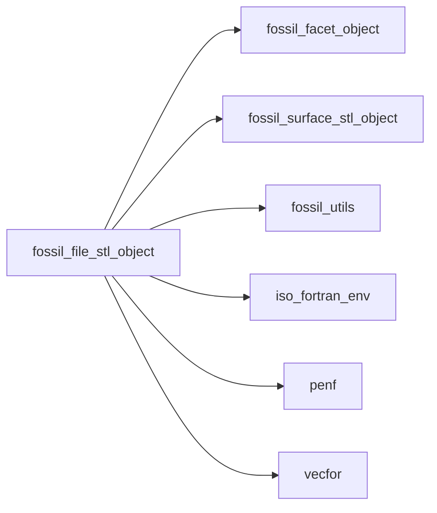
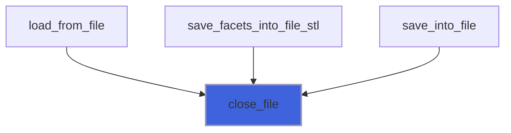
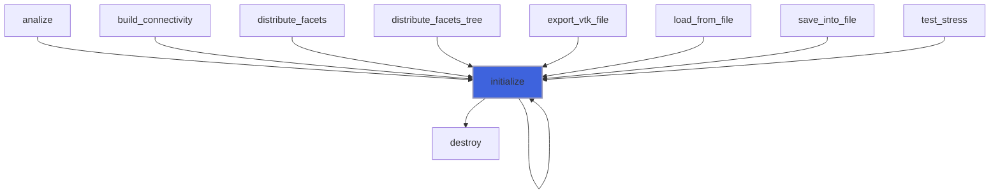
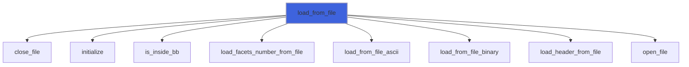
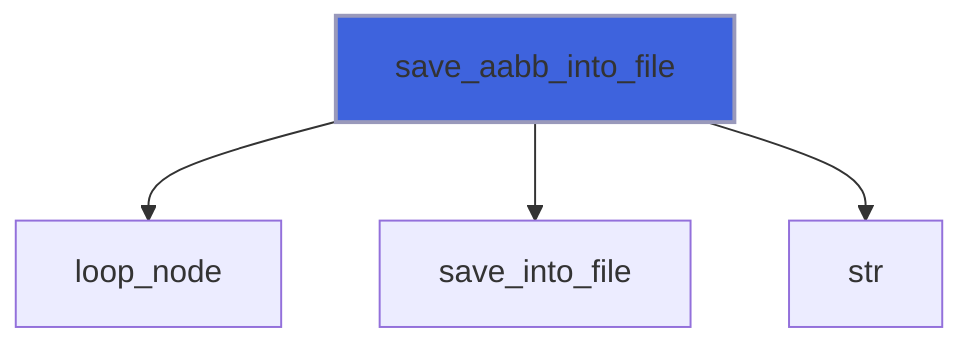
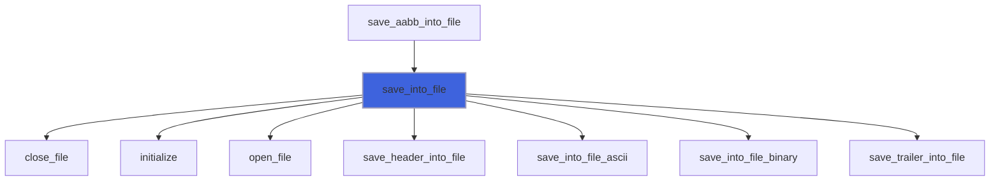
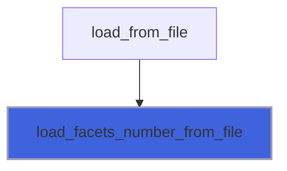
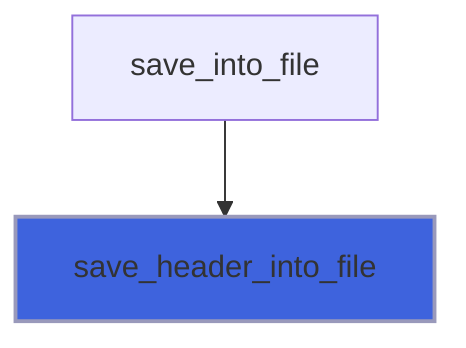
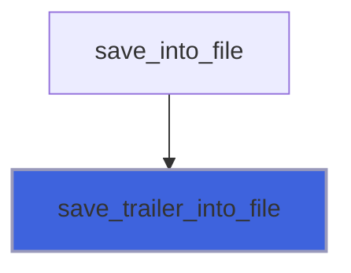

# fossil_file_stl_object

> FOSSIL,  STL file class definition.

**Source**: `src/lib/fossil_file_stl_object.f90`

**Dependencies**



## Contents

- [file_stl_object](#file-stl-object)
- [close_file](#close-file)
- [destroy](#destroy)
- [initialize](#initialize)
- [load_from_file](#load-from-file)
- [open_file](#open-file)
- [save_aabb_into_file](#save-aabb-into-file)
- [save_into_file](#save-into-file)
- [file_stl_assign_file_stl](#file-stl-assign-file-stl)
- [load_facets_number_from_file](#load-facets-number-from-file)
- [load_header_from_file](#load-header-from-file)
- [save_header_into_file](#save-header-into-file)
- [save_trailer_into_file](#save-trailer-into-file)
- [statistics](#statistics)

## Derived Types

### file_stl_object

FOSSIL STL file class.

#### Components

| Name | Type | Attributes | Description |
|------|------|------------|-------------|
| `file_name` | character(len=:) | allocatable | File name |
| `file_unit` | integer(kind=[I4P](/api/src/third_party/PENF/src/lib/penf_global_parameters_variables)) |  | File unit. |
| `header` | character(len=FRLEN) |  | File header. |
| `is_ascii` | logical |  | Sentinel to check if file is ASCII. |
| `is_open` | logical |  | Sentinel to check if file is open. |

#### Type-Bound Procedures

| Name | Attributes | Description |
|------|------------|-------------|
| `close_file` | pass(self) | Close file. |
| `destroy` | pass(self) | Destroy file. |
| `initialize` | pass(self) | Initialize file. |
| `load_from_file` | pass(self) | Load from file. |
| `open_file` | pass(self) | Open file, once initialized. |
| `save_aabb_into_file` | pass(self) | Save AABB into file. |
| `save_into_file` | pass(self) | Save into file. |
| `statistics` | pass(self) | Return STL statistics. |
| `assignment(=)` |  | Overload `=`. |
| `file_stl_assign_file_stl` | pass(lhs) | Operator `=`. |
| `load_facets_number_from_file` | pass(self) | Load facets number from file. |
| `load_header_from_file` | pass(self) | Load header from file. |
| `save_header_into_file` | pass(self) | Save header into file. |
| `save_trailer_into_file` | pass(self) | Save trailer into file. |

## Subroutines

### close_file

Close file.

```fortran
subroutine close_file(self)
```

**Arguments**

| Name | Type | Intent | Attributes | Description |
|------|------|--------|------------|-------------|
| `self` | class([file_stl_object](/api/src/lib/fossil_file_stl_object#file-stl-object)) | inout |  | File STL. |

**Call graph**



### destroy

Destroy file.

**Attributes**: elemental

```fortran
subroutine destroy(self)
```

**Arguments**

| Name | Type | Intent | Attributes | Description |
|------|------|--------|------------|-------------|
| `self` | class([file_stl_object](/api/src/lib/fossil_file_stl_object#file-stl-object)) | inout |  | File STL. |

**Call graph**



```mermaid
flowchart TD
  aabb_node_assign_aabb_node["aabb_node_assign_aabb_node"] --> destroy["destroy"]
  aabb_tree_assign_aabb_tree["aabb_tree_assign_aabb_tree"] --> destroy["destroy"]
  add_facets["add_facets"] --> destroy["destroy"]
  allocate_facets["allocate_facets"] --> destroy["destroy"]
  compute_facets_disconnected["compute_facets_disconnected"] --> destroy["destroy"]
  destroy["destroy"] --> destroy["destroy"]
  destroy_connectivity["destroy_connectivity"] --> destroy["destroy"]
  distribute_facets["distribute_facets"] --> destroy["destroy"]
  distribute_facets_tree["distribute_facets_tree"] --> destroy["destroy"]
  initialize["initialize"] --> destroy["destroy"]
  initialize["initialize"] --> destroy["destroy"]
  initialize["initialize"] --> destroy["destroy"]
  initialize["initialize"] --> destroy["destroy"]
  initialize["initialize"] --> destroy["destroy"]
  initialize["initialize"] --> destroy["destroy"]
  merge_vertices["merge_vertices"] --> destroy["destroy"]
  surface_stl_assign_surface_stl["surface_stl_assign_surface_stl"] --> destroy["destroy"]
  union["union"] --> destroy["destroy"]
  style destroy fill:#3e63dd,stroke:#99b,stroke-width:2px
```

### initialize

Initialize file.

**Attributes**: elemental

```fortran
subroutine initialize(self, skip_destroy, file_name, is_ascii)
```

**Arguments**

| Name | Type | Intent | Attributes | Description |
|------|------|--------|------------|-------------|
| `self` | class([file_stl_object](/api/src/lib/fossil_file_stl_object#file-stl-object)) | inout |  | File STL. |
| `skip_destroy` | logical | in | optional | Flag to skip destroy file. |
| `file_name` | character(len=*) | in | optional | File name. |
| `is_ascii` | logical | in | optional | Sentinel to check if file is ASCII. |

**Call graph**



### load_from_file

Load from file.

```fortran
subroutine load_from_file(self, facet, file_name, is_ascii, guess_format, clip_min, clip_max)
```

**Arguments**

| Name | Type | Intent | Attributes | Description |
|------|------|--------|------------|-------------|
| `self` | class([file_stl_object](/api/src/lib/fossil_file_stl_object#file-stl-object)) | inout |  | File STL. |
| `facet` | type([facet_object](/api/src/lib/fossil_facet_object#facet-object)) | out | allocatable | Surface facets. |
| `file_name` | character(len=*) | in | optional | File name. |
| `is_ascii` | logical | in | optional | Sentinel to check if file is ASCII. |
| `guess_format` | logical | in | optional | Try to guess format directly from file. |
| `clip_min` | type([vector_R8P](/api/src/third_party/VecFor/src/lib/vecfor_R8P#vector-r8p)) | in | optional | Clip bounding box extents. |
| `clip_max` | type([vector_R8P](/api/src/third_party/VecFor/src/lib/vecfor_R8P#vector-r8p)) | in | optional | Clip bounding box extents. |

**Call graph**



### open_file

Open file, once initialized.

```fortran
subroutine open_file(self, file_action, guess_format)
```

**Arguments**

| Name | Type | Intent | Attributes | Description |
|------|------|--------|------------|-------------|
| `self` | class([file_stl_object](/api/src/lib/fossil_file_stl_object#file-stl-object)) | inout |  | File STL. |
| `file_action` | character(len=*) | in |  | File action, "read" or "write". |
| `guess_format` | logical | in | optional | Sentinel to try to guess format directly from file. |

**Call graph**


### save_aabb_into_file

Save AABB into file.

```fortran
subroutine save_aabb_into_file(self, surface, base_file_name, is_ascii)
```

**Arguments**

| Name | Type | Intent | Attributes | Description |
|------|------|--------|------------|-------------|
| `self` | class([file_stl_object](/api/src/lib/fossil_file_stl_object#file-stl-object)) | inout |  | File STL. |
| `surface` | type([surface_stl_object](/api/src/lib/fossil_surface_stl_object#surface-stl-object)) | in |  | Surface STL. |
| `base_file_name` | character(len=*) | in | optional | Base file name. |
| `is_ascii` | logical | in | optional | Sentinel to check if file is ASCII. |

**Call graph**



### save_into_file

Save into file.

```fortran
subroutine save_into_file(self, facet, file_name, is_ascii)
```

**Arguments**

| Name | Type | Intent | Attributes | Description |
|------|------|--------|------------|-------------|
| `self` | class([file_stl_object](/api/src/lib/fossil_file_stl_object#file-stl-object)) | inout |  | File STL. |
| `facet` | type([facet_object](/api/src/lib/fossil_facet_object#facet-object)) | in |  | Surface facets. |
| `file_name` | character(len=*) | in | optional | File name. |
| `is_ascii` | logical | in | optional | Sentinel to check if file is ASCII. |

**Call graph**



### file_stl_assign_file_stl

Operator `=`.

**Attributes**: pure

```fortran
subroutine file_stl_assign_file_stl(lhs, rhs)
```

**Arguments**

| Name | Type | Intent | Attributes | Description |
|------|------|--------|------------|-------------|
| `lhs` | class([file_stl_object](/api/src/lib/fossil_file_stl_object#file-stl-object)) | inout |  | Left hand side. |
| `rhs` | type([file_stl_object](/api/src/lib/fossil_file_stl_object#file-stl-object)) | in |  | Right hand side. |

### load_facets_number_from_file

Load facets number from file.

 @note File is rewinded.

```fortran
subroutine load_facets_number_from_file(self, facets_number)
```

**Arguments**

| Name | Type | Intent | Attributes | Description |
|------|------|--------|------------|-------------|
| `self` | class([file_stl_object](/api/src/lib/fossil_file_stl_object#file-stl-object)) | inout |  | File STL. |
| `facets_number` | integer(kind=[I4P](/api/src/third_party/PENF/src/lib/penf_global_parameters_variables)) | out |  | Facets number. |

**Call graph**



### load_header_from_file

Load header from file.

```fortran
subroutine load_header_from_file(self)
```

**Arguments**

| Name | Type | Intent | Attributes | Description |
|------|------|--------|------------|-------------|
| `self` | class([file_stl_object](/api/src/lib/fossil_file_stl_object#file-stl-object)) | inout |  | File STL. |

**Call graph**


### save_header_into_file

Save header into file.

```fortran
subroutine save_header_into_file(self, facets_number)
```

**Arguments**

| Name | Type | Intent | Attributes | Description |
|------|------|--------|------------|-------------|
| `self` | class([file_stl_object](/api/src/lib/fossil_file_stl_object#file-stl-object)) | inout |  | File STL. |
| `facets_number` | integer(kind=[I4P](/api/src/third_party/PENF/src/lib/penf_global_parameters_variables)) | in |  | Facets number. |

**Call graph**



### save_trailer_into_file

Save trailer into file.

```fortran
subroutine save_trailer_into_file(self)
```

**Arguments**

| Name | Type | Intent | Attributes | Description |
|------|------|--------|------------|-------------|
| `self` | class([file_stl_object](/api/src/lib/fossil_file_stl_object#file-stl-object)) | inout |  | File STL. |

**Call graph**



## Functions

### statistics

Return STL statistics.

**Attributes**: pure

**Returns**: `character(len=:)`

```fortran
function statistics(self, prefix) result(stats)
```

**Arguments**

| Name | Type | Intent | Attributes | Description |
|------|------|--------|------------|-------------|
| `self` | class([file_stl_object](/api/src/lib/fossil_file_stl_object#file-stl-object)) | in |  | File STL. |
| `prefix` | character(len=*) | in | optional | Lines prefix. |
