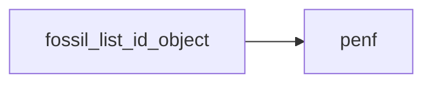
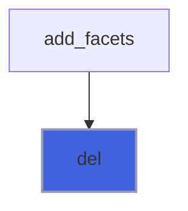
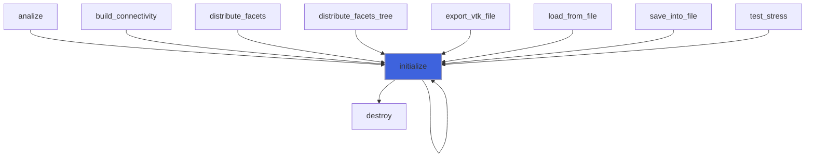
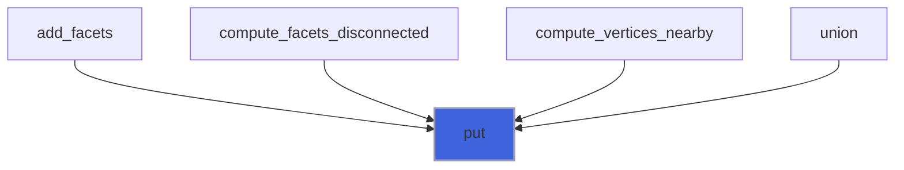

# fossil_list_id_object

> FOSSIL, list of IDs class definition.

**Source**: `src/lib/fossil_list_id_object.f90`

**Dependencies**



## Contents

- [list_id_object](#list-id-object)
- [del](#del)
- [destroy](#destroy)
- [initialize](#initialize)
- [put](#put)
- [list_id_assign_list_id](#list-id-assign-list-id)

## Derived Types

### list_id_object

FOSSIL, list of IDs class.

#### Components

| Name | Type | Attributes | Description |
|------|------|------------|-------------|
| `ids_number` | integer(kind=[I4P](/api/src/third_party/PENF/src/lib/penf_global_parameters_variables)) |  | Number of IDs. |
| `id` | integer(kind=[I4P](/api/src/third_party/PENF/src/lib/penf_global_parameters_variables)) | allocatable | IDs list. |

#### Type-Bound Procedures

| Name | Attributes | Description |
|------|------------|-------------|
| `del` | pass(self) | Delete ID from list. |
| `destroy` | pass(self) | Destroy list. |
| `initialize` | pass(self) | Initialize list. |
| `put` | pass(self) | Put ID in list. |
| `assignment(=)` |  | Overload `=`. |
| `list_id_assign_list_id` | pass(lhs) | Operator `=`. |

## Subroutines

### del

Delete ID from list.

**Attributes**: elemental

```fortran
subroutine del(self, id)
```

**Arguments**

| Name | Type | Intent | Attributes | Description |
|------|------|--------|------------|-------------|
| `self` | class([list_id_object](/api/src/lib/fossil_list_id_object#list-id-object)) | inout |  | List. |
| `id` | integer(kind=[I4P](/api/src/third_party/PENF/src/lib/penf_global_parameters_variables)) | in |  | Given ID. |

**Call graph**



### destroy

Destroy list.

**Attributes**: elemental

```fortran
subroutine destroy(self)
```

**Arguments**

| Name | Type | Intent | Attributes | Description |
|------|------|--------|------------|-------------|
| `self` | class([list_id_object](/api/src/lib/fossil_list_id_object#list-id-object)) | inout |  | List. |

**Call graph**



```mermaid
flowchart TD
  aabb_node_assign_aabb_node["aabb_node_assign_aabb_node"] --> destroy["destroy"]
  aabb_tree_assign_aabb_tree["aabb_tree_assign_aabb_tree"] --> destroy["destroy"]
  add_facets["add_facets"] --> destroy["destroy"]
  allocate_facets["allocate_facets"] --> destroy["destroy"]
  compute_facets_disconnected["compute_facets_disconnected"] --> destroy["destroy"]
  destroy["destroy"] --> destroy["destroy"]
  destroy_connectivity["destroy_connectivity"] --> destroy["destroy"]
  distribute_facets["distribute_facets"] --> destroy["destroy"]
  distribute_facets_tree["distribute_facets_tree"] --> destroy["destroy"]
  initialize["initialize"] --> destroy["destroy"]
  initialize["initialize"] --> destroy["destroy"]
  initialize["initialize"] --> destroy["destroy"]
  initialize["initialize"] --> destroy["destroy"]
  initialize["initialize"] --> destroy["destroy"]
  initialize["initialize"] --> destroy["destroy"]
  merge_vertices["merge_vertices"] --> destroy["destroy"]
  surface_stl_assign_surface_stl["surface_stl_assign_surface_stl"] --> destroy["destroy"]
  union["union"] --> destroy["destroy"]
  style destroy fill:#3e63dd,stroke:#99b,stroke-width:2px
```

### initialize

Initialize list.

**Attributes**: pure

```fortran
subroutine initialize(self, id)
```

**Arguments**

| Name | Type | Intent | Attributes | Description |
|------|------|--------|------------|-------------|
| `self` | class([list_id_object](/api/src/lib/fossil_list_id_object#list-id-object)) | inout |  | List. |
| `id` | integer(kind=[I4P](/api/src/third_party/PENF/src/lib/penf_global_parameters_variables)) | in | optional | IDs list. |

**Call graph**



### put

Put ID in list.

 ID is put in list only if it is not already present.

**Attributes**: elemental

```fortran
subroutine put(self, id)
```

**Arguments**

| Name | Type | Intent | Attributes | Description |
|------|------|--------|------------|-------------|
| `self` | class([list_id_object](/api/src/lib/fossil_list_id_object#list-id-object)) | inout |  | List. |
| `id` | integer(kind=[I4P](/api/src/third_party/PENF/src/lib/penf_global_parameters_variables)) | in |  | Given ID. |

**Call graph**



### list_id_assign_list_id

Operator `=`.

**Attributes**: pure

```fortran
subroutine list_id_assign_list_id(lhs, rhs)
```

**Arguments**

| Name | Type | Intent | Attributes | Description |
|------|------|--------|------------|-------------|
| `lhs` | class([list_id_object](/api/src/lib/fossil_list_id_object#list-id-object)) | inout |  | Left hand side. |
| `rhs` | type([list_id_object](/api/src/lib/fossil_list_id_object#list-id-object)) | in |  | Right hand side. |
