# fossil_surface_stl_object

> FOSSIL, STL surface class definition.

**Source**: `src/lib/fossil_surface_stl.f90`

**Dependencies**

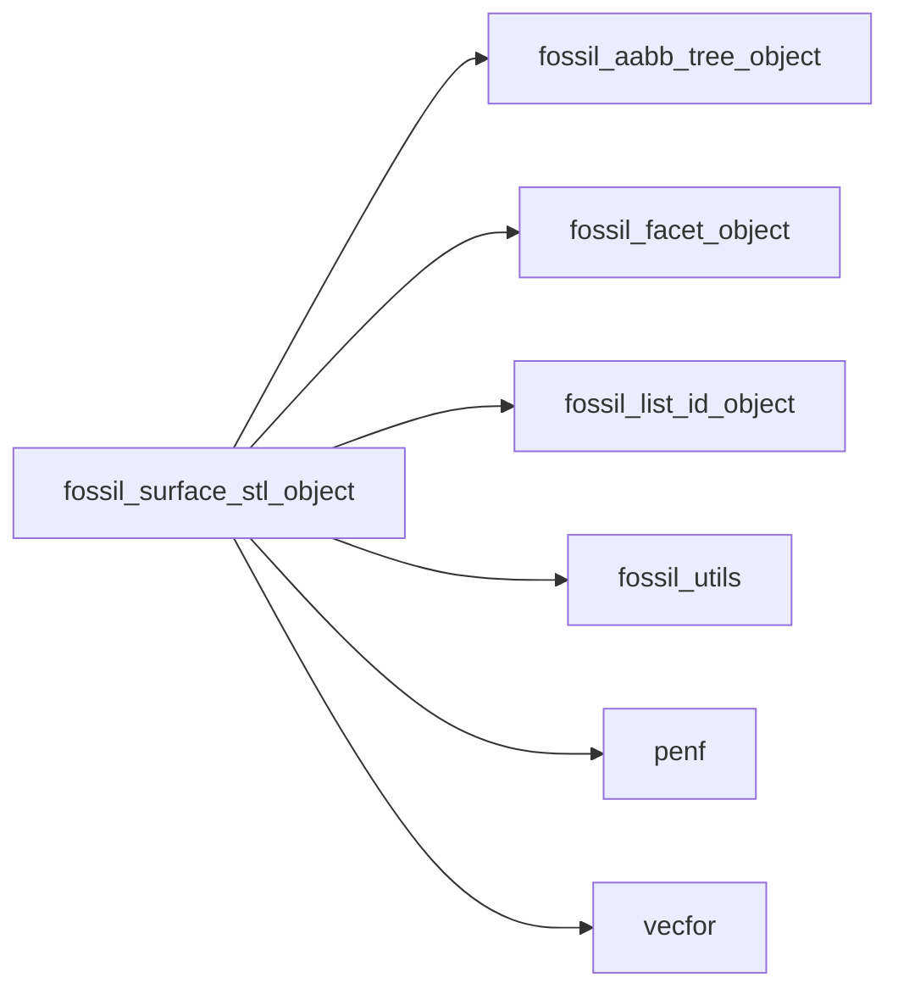

## Contents

- [surface_stl_object](#surface-stl-object)
- [allocate_facets](#allocate-facets)
- [analize](#analize)
- [build_connectivity](#build-connectivity)
- [clip](#clip)
- [compute_centroid](#compute-centroid)
- [compute_distance](#compute-distance)
- [compute_mesh_distance](#compute-mesh-distance)
- [compute_metrix](#compute-metrix)
- [compute_normals](#compute-normals)
- [compute_volume](#compute-volume)
- [connect_nearby_vertices](#connect-nearby-vertices)
- [destroy](#destroy)
- [initialize](#initialize)
- [merge_solids](#merge-solids)
- [resize](#resize)
- [reverse_normals](#reverse-normals)
- [sanitize](#sanitize)
- [sanitize_normals](#sanitize-normals)
- [translate](#translate)
- [surface_stl_assign_surface_stl](#surface-stl-assign-surface-stl)
- [compute_facets_disconnected](#compute-facets-disconnected)
- [mirror_by_normal](#mirror-by-normal)
- [mirror_by_matrix](#mirror-by-matrix)
- [rotate_by_axis_angle](#rotate-by-axis-angle)
- [rotate_by_matrix](#rotate-by-matrix)
- [set_facets_id](#set-facets-id)
- [distance](#distance)
- [is_point_inside](#is-point-inside)
- [is_point_inside_polyhedron_ri](#is-point-inside-polyhedron-ri)
- [is_point_inside_polyhedron_sa](#is-point-inside-polyhedron-sa)
- [largest_edge_len](#largest-edge-len)
- [smallest_edge_len](#smallest-edge-len)
- [statistics](#statistics)

## Derived Types

### surface_stl_object

FOSSIL STL surface class.

#### Components

| Name | Type | Attributes | Description |
|------|------|------------|-------------|
| `facets_number` | integer(kind=[I4P](/api/src/third_party/PENF/src/lib/penf_global_parameters_variables)) |  | Facets number. |
| `facet` | type([facet_object](/api/src/lib/fossil_facet_object#facet-object)) | allocatable | Facets. |
| `facet_1_de` | type([list_id_object](/api/src/lib/fossil_list_id_object#list-id-object)) |  | Facets with one disconnected edges. |
| `facet_2_de` | type([list_id_object](/api/src/lib/fossil_list_id_object#list-id-object)) |  | Facets with two disconnected edges. |
| `facet_3_de` | type([list_id_object](/api/src/lib/fossil_list_id_object#list-id-object)) |  | Facets with three disconnected edges. |
| `aabb` | type([aabb_tree_object](/api/src/lib/fossil_aabb_tree_object#aabb-tree-object)) |  | AABB tree. |
| `bmin` | type([vector_R8P](/api/src/third_party/VecFor/src/lib/vecfor_R8P#vector-r8p)) |  | Minimum point of STL. |
| `bmax` | type([vector_R8P](/api/src/third_party/VecFor/src/lib/vecfor_R8P#vector-r8p)) |  | Maximum point of STL. |
| `volume` | real(kind=[R8P](/api/src/third_party/PENF/src/lib/penf_global_parameters_variables)) |  | Volume bounded by STL surface. |
| `centroid` | type([vector_R8P](/api/src/third_party/VecFor/src/lib/vecfor_R8P#vector-r8p)) |  | Centroid of STL surface. |

#### Type-Bound Procedures

| Name | Attributes | Description |
|------|------------|-------------|
| `allocate_facets` | pass(self) | Allocate facets. |
| `analize` | pass(self) | Analize STL. |
| `build_connectivity` | pass(self) | Build facets connectivity. |
| `clip` | pass(self) | Clip triangulated surface given an AABB. |
| `compute_centroid` | pass(self) | Compute centroid of STL surface. |
| `compute_distance` | pass(self) | Compute the (minimum) distance returning also the closest point. |
| `compute_mesh_distance` | pass(self) | Compute the (minimum) distance in a given mesh. |
| `compute_metrix` | pass(self) | Compute facets metrix. |
| `compute_normals` | pass(self) | Compute facets normals by means of vertices data. |
| `compute_volume` | pass(self) | Compute volume bounded by STL surface. |
| `connect_nearby_vertices` | pass(self) | Connect nearby vertices of disconnected edges. |
| `destroy` | pass(self) | Destroy file. |
| `distance` | pass(self) | Return the (minimum) distance from point to triangulated surface. |
| `initialize` | pass(self) | Initialize file. |
| `is_point_inside` | pass(self) | Determinate if point is inside or not STL. |
| `is_point_inside_polyhedron_ri` | pass(self) | Determinate if point is inside or not STL facets by ray intersect. |
| `is_point_inside_polyhedron_sa` | pass(self) | Determinate if point is inside or not STL facets by solid angle. |
| `largest_edge_len` | pass(self) | Return the largest edge length. |
| `merge_solids` | pass(self) | Merge facets with ones of other STL file. |
| `mirror` |  | Mirror facets. |
| `reverse_normals` | pass(self) | Reverse facets normals. |
| `resize` | pass(self) | Resize (scale) facets by x or y or z or vectorial factors. |
| `rotate` |  | Rotate facets. |
| `sanitize` | pass(self) | Sanitize STL. |
| `sanitize_normals` | pass(self) | Sanitize facets normals, make them consistent. |
| `smallest_edge_len` | pass(self) | Return the smallest edge length. |
| `statistics` | pass(self) | Return STL statistics. |
| `translate` | pass(self) | Translate facet given vectorial delta. |
| `assignment(=)` |  | Overload `=`. |
| `surface_stl_assign_surface_stl` | pass(lhs) | Operator `=`. |
| `compute_facets_disconnected` | pass(self) | Compute facets with disconnected edges. |
| `mirror_by_normal` | pass(self) | Mirror facets given normal of mirroring plane. |
| `mirror_by_matrix` | pass(self) | Mirror facets given matrix. |
| `rotate_by_axis_angle` | pass(self) | Rotate facets given axis and angle. |
| `rotate_by_matrix` | pass(self) | Rotate facets given matrix. |
| `set_facets_id` | pass(self) | (Re)set facets ID. |

## Subroutines

### allocate_facets

Allocate facets.

 @note Facets previously allocated are lost.

**Attributes**: elemental

```fortran
subroutine allocate_facets(self, facets_number)
```

**Arguments**

| Name | Type | Intent | Attributes | Description |
|------|------|--------|------------|-------------|
| `self` | class([surface_stl_object](/api/src/lib/fossil_surface_stl_object#surface-stl-object)) | inout |  | File STL. |
| `facets_number` | integer(kind=[I4P](/api/src/third_party/PENF/src/lib/penf_global_parameters_variables)) | in |  | Facets number. |

**Call graph**

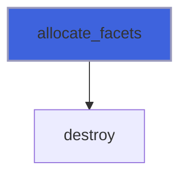

### analize

Analize STL.

 Buil connectivity, compute metrix, compute volume.

```fortran
subroutine analize(self, aabb_refinement_levels)
```

**Arguments**

| Name | Type | Intent | Attributes | Description |
|------|------|--------|------------|-------------|
| `self` | class([surface_stl_object](/api/src/lib/fossil_surface_stl_object#surface-stl-object)) | inout |  | File STL. |
| `aabb_refinement_levels` | integer(kind=[I4P](/api/src/third_party/PENF/src/lib/penf_global_parameters_variables)) | in | optional | AABB refinement levels. |

**Call graph**

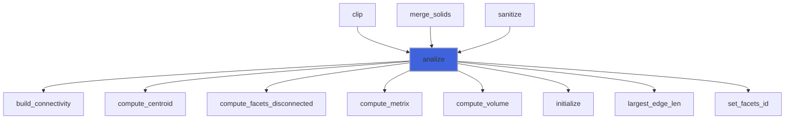

### build_connectivity

Build facets connectivity.

```fortran
subroutine build_connectivity(self)
```

**Arguments**

| Name | Type | Intent | Attributes | Description |
|------|------|--------|------------|-------------|
| `self` | class([surface_stl_object](/api/src/lib/fossil_surface_stl_object#surface-stl-object)) | inout |  | File STL. |

**Call graph**

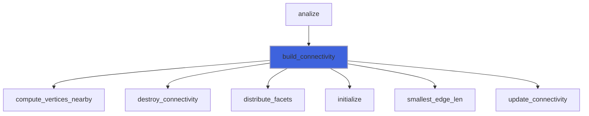

### clip

Clip triangulated surface given an AABB.

```fortran
subroutine clip(self, bmin, bmax, remainder)
```

**Arguments**

| Name | Type | Intent | Attributes | Description |
|------|------|--------|------------|-------------|
| `self` | class([surface_stl_object](/api/src/lib/fossil_surface_stl_object#surface-stl-object)) | inout |  | File STL. |
| `bmin` | type([vector_R8P](/api/src/third_party/VecFor/src/lib/vecfor_R8P#vector-r8p)) | in |  | Bounding box extents. |
| `bmax` | type([vector_R8P](/api/src/third_party/VecFor/src/lib/vecfor_R8P#vector-r8p)) | in |  | Bounding box extents. |
| `remainder` | type([surface_stl_object](/api/src/lib/fossil_surface_stl_object#surface-stl-object)) | out | optional | Remainder part of the triangulated surface. |

**Call graph**

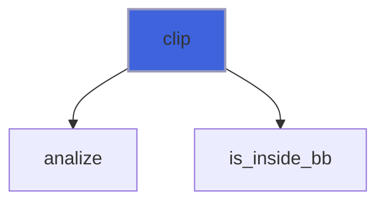

### compute_centroid

Compute centroid of STL surface.

 @note Metrix and volume must be already computed.

**Attributes**: pure

```fortran
subroutine compute_centroid(self)
```

**Arguments**

| Name | Type | Intent | Attributes | Description |
|------|------|--------|------------|-------------|
| `self` | class([surface_stl_object](/api/src/lib/fossil_surface_stl_object#surface-stl-object)) | inout |  | File STL. |

**Call graph**

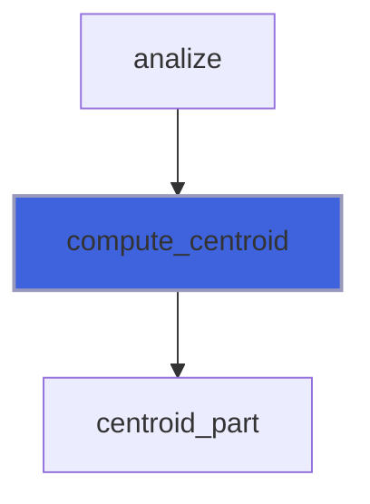

### compute_distance

Compute the (minimum) distance returning also the closest point.

```fortran
subroutine compute_distance(self, point, distance, is_signed, sign_algorithm, is_square_root, facet_index, edge_index, vertex_index)
```

**Arguments**

| Name | Type | Intent | Attributes | Description |
|------|------|--------|------------|-------------|
| `self` | class([surface_stl_object](/api/src/lib/fossil_surface_stl_object#surface-stl-object)) | in |  | File STL. |
| `point` | type([vector_R8P](/api/src/third_party/VecFor/src/lib/vecfor_R8P#vector-r8p)) | in |  | Point coordinates. |
| `distance` | real(kind=[R8P](/api/src/third_party/PENF/src/lib/penf_global_parameters_variables)) | out |  | Minimum distance. |
| `is_signed` | logical | in | optional | Sentinel to trigger signed distance. |
| `sign_algorithm` | character(len=*) | in | optional | Algorithm used for "point in polyhedron" test. |
| `is_square_root` | logical | in | optional | Sentinel to trigger square-root distance. |
| `facet_index` | integer(kind=[I4P](/api/src/third_party/PENF/src/lib/penf_global_parameters_variables)) | out | optional | Index of facet containing the closest point. |
| `edge_index` | integer(kind=[I4P](/api/src/third_party/PENF/src/lib/penf_global_parameters_variables)) | out | optional | Index of edge on facet containing the closest point. |
| `vertex_index` | integer(kind=[I4P](/api/src/third_party/PENF/src/lib/penf_global_parameters_variables)) | out | optional | Index of vertex on facet containing the closest point. |

**Call graph**

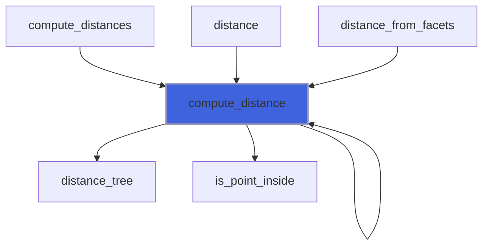

### compute_mesh_distance

Compute the (minimum) distance in a given mesh.

```fortran
subroutine compute_mesh_distance(self, mesh, distance, is_signed, sign_algorithm, is_square_root)
```

**Arguments**

| Name | Type | Intent | Attributes | Description |
|------|------|--------|------------|-------------|
| `self` | class([surface_stl_object](/api/src/lib/fossil_surface_stl_object#surface-stl-object)) | in |  | File STL. |
| `mesh` | type([vector_R8P](/api/src/third_party/VecFor/src/lib/vecfor_R8P#vector-r8p)) | in |  | Mesh coordinates [1:ni,1:nj,1:nk]. |
| `distance` | real(kind=[R8P](/api/src/third_party/PENF/src/lib/penf_global_parameters_variables)) | out |  | Minimum distance. |
| `is_signed` | logical | in | optional | Sentinel to trigger signed distance. |
| `sign_algorithm` | character(len=*) | in | optional | Algorithm used for "point in polyhedron" test. |
| `is_square_root` | logical | in | optional | Sentinel to trigger square-root distance. |

**Call graph**

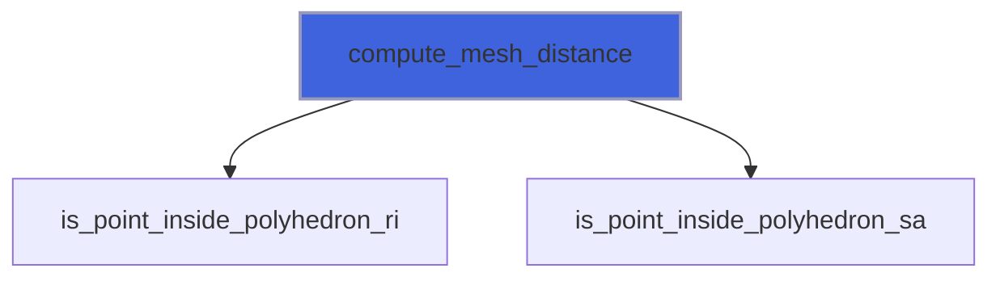

### compute_metrix

Compute facets metrix.

**Attributes**: pure

```fortran
subroutine compute_metrix(self)
```

**Arguments**

| Name | Type | Intent | Attributes | Description |
|------|------|--------|------------|-------------|
| `self` | class([surface_stl_object](/api/src/lib/fossil_surface_stl_object#surface-stl-object)) | inout |  | File STL. |

**Call graph**

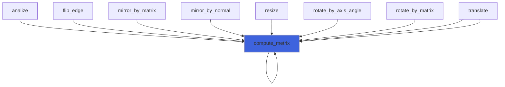

### compute_normals

Compute facets normals by means of vertices data.

**Attributes**: elemental

```fortran
subroutine compute_normals(self)
```

**Arguments**

| Name | Type | Intent | Attributes | Description |
|------|------|--------|------------|-------------|
| `self` | class([surface_stl_object](/api/src/lib/fossil_surface_stl_object#surface-stl-object)) | inout |  | File STL. |

**Call graph**

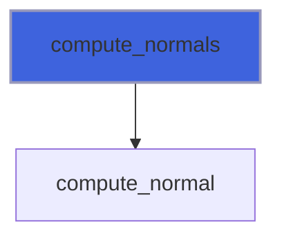

### compute_volume

Compute volume bounded by STL surface.

**Attributes**: elemental

```fortran
subroutine compute_volume(self)
```

**Arguments**

| Name | Type | Intent | Attributes | Description |
|------|------|--------|------------|-------------|
| `self` | class([surface_stl_object](/api/src/lib/fossil_surface_stl_object#surface-stl-object)) | inout |  | File STL. |

**Call graph**

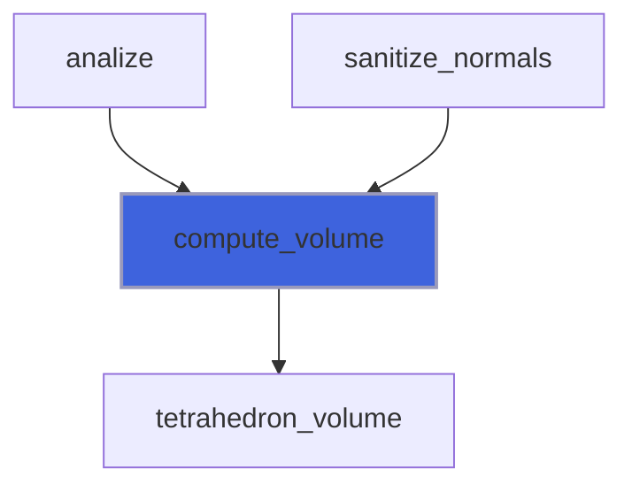

### connect_nearby_vertices

Connect nearby vertices of disconnected edges.

**Attributes**: pure

```fortran
subroutine connect_nearby_vertices(self)
```

**Arguments**

| Name | Type | Intent | Attributes | Description |
|------|------|--------|------------|-------------|
| `self` | class([surface_stl_object](/api/src/lib/fossil_surface_stl_object#surface-stl-object)) | inout |  | File STL. |

**Call graph**

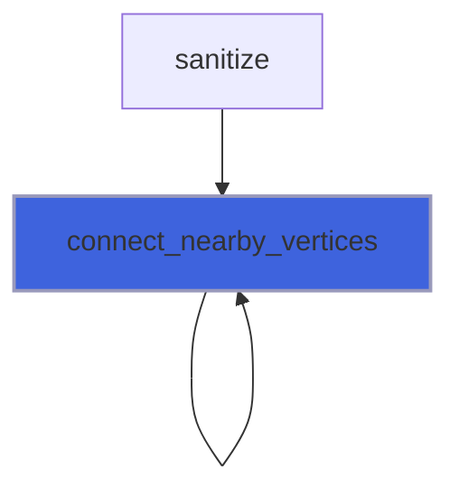

### destroy

Destroy file.

**Attributes**: elemental

```fortran
subroutine destroy(self)
```

**Arguments**

| Name | Type | Intent | Attributes | Description |
|------|------|--------|------------|-------------|
| `self` | class([surface_stl_object](/api/src/lib/fossil_surface_stl_object#surface-stl-object)) | inout |  | File STL. |

**Call graph**

```mermaid
flowchart TD
  aabb_node_assign_aabb_node["aabb_node_assign_aabb_node"] --> destroy["destroy"]
  aabb_tree_assign_aabb_tree["aabb_tree_assign_aabb_tree"] --> destroy["destroy"]
  add_facets["add_facets"] --> destroy["destroy"]
  allocate_facets["allocate_facets"] --> destroy["destroy"]
  compute_facets_disconnected["compute_facets_disconnected"] --> destroy["destroy"]
  destroy["destroy"] --> destroy["destroy"]
  destroy_connectivity["destroy_connectivity"] --> destroy["destroy"]
  distribute_facets["distribute_facets"] --> destroy["destroy"]
  distribute_facets_tree["distribute_facets_tree"] --> destroy["destroy"]
  initialize["initialize"] --> destroy["destroy"]
  initialize["initialize"] --> destroy["destroy"]
  initialize["initialize"] --> destroy["destroy"]
  initialize["initialize"] --> destroy["destroy"]
  initialize["initialize"] --> destroy["destroy"]
  initialize["initialize"] --> destroy["destroy"]
  merge_vertices["merge_vertices"] --> destroy["destroy"]
  surface_stl_assign_surface_stl["surface_stl_assign_surface_stl"] --> destroy["destroy"]
  union["union"] --> destroy["destroy"]
  style destroy fill:#3e63dd,stroke:#99b,stroke-width:2px
```

### initialize

Initialize file.

**Attributes**: elemental

```fortran
subroutine initialize(self, aabb_refinement_levels)
```

**Arguments**

| Name | Type | Intent | Attributes | Description |
|------|------|--------|------------|-------------|
| `self` | class([surface_stl_object](/api/src/lib/fossil_surface_stl_object#surface-stl-object)) | inout |  | File STL. |
| `aabb_refinement_levels` | integer(kind=[I4P](/api/src/third_party/PENF/src/lib/penf_global_parameters_variables)) | in | optional | AABB refinement levels. |

**Call graph**

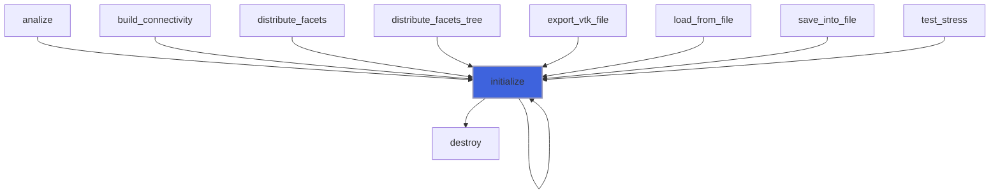

### merge_solids

Merge facets with ones of other STL file.

```fortran
subroutine merge_solids(self, other)
```

**Arguments**

| Name | Type | Intent | Attributes | Description |
|------|------|--------|------------|-------------|
| `self` | class([surface_stl_object](/api/src/lib/fossil_surface_stl_object#surface-stl-object)) | inout |  | File STL. |
| `other` | type([surface_stl_object](/api/src/lib/fossil_surface_stl_object#surface-stl-object)) | in |  | Other file STL. |

**Call graph**

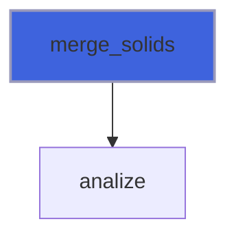

### resize

Resize (scale) facets by x or y or z or vectorial factors.

 @note The name `scale` has not been used, it been a Fortran built-in.

 @note If centroid must be used for center of resize it must be already computed.

**Attributes**: elemental

```fortran
subroutine resize(self, x, y, z, factor, respect_centroid, recompute_metrix)
```

**Arguments**

| Name | Type | Intent | Attributes | Description |
|------|------|--------|------------|-------------|
| `self` | class([surface_stl_object](/api/src/lib/fossil_surface_stl_object#surface-stl-object)) | inout |  | File STL. |
| `x` | real(kind=[R8P](/api/src/third_party/PENF/src/lib/penf_global_parameters_variables)) | in | optional | Factor along x axis. |
| `y` | real(kind=[R8P](/api/src/third_party/PENF/src/lib/penf_global_parameters_variables)) | in | optional | Factor along y axis. |
| `z` | real(kind=[R8P](/api/src/third_party/PENF/src/lib/penf_global_parameters_variables)) | in | optional | Factor along z axis. |
| `factor` | type([vector_R8P](/api/src/third_party/VecFor/src/lib/vecfor_R8P#vector-r8p)) | in | optional | Vectorial factor. |
| `respect_centroid` | logical | in | optional | Sentinel to activate centroid as resize center. |
| `recompute_metrix` | logical | in | optional | Sentinel to activate metrix recomputation. |

**Call graph**

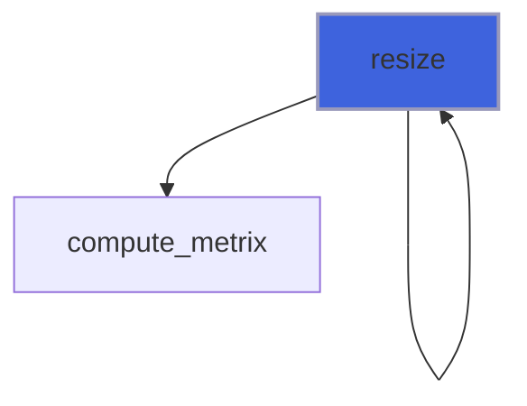

### reverse_normals

Reverse facets normals.

**Attributes**: elemental

```fortran
subroutine reverse_normals(self)
```

**Arguments**

| Name | Type | Intent | Attributes | Description |
|------|------|--------|------------|-------------|
| `self` | class([surface_stl_object](/api/src/lib/fossil_surface_stl_object#surface-stl-object)) | inout |  | File STL. |

**Call graph**

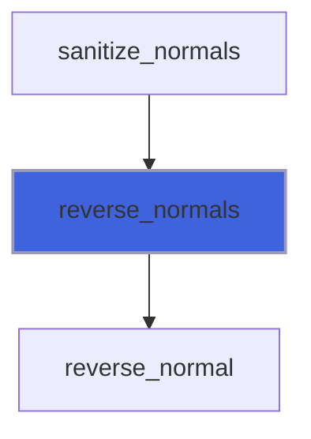

### sanitize

Sanitize STL.

```fortran
subroutine sanitize(self, do_analysis)
```

**Arguments**

| Name | Type | Intent | Attributes | Description |
|------|------|--------|------------|-------------|
| `self` | class([surface_stl_object](/api/src/lib/fossil_surface_stl_object#surface-stl-object)) | inout |  | File STL. |
| `do_analysis` | logical | in | optional | Sentil for performing a first analysis. |

**Call graph**

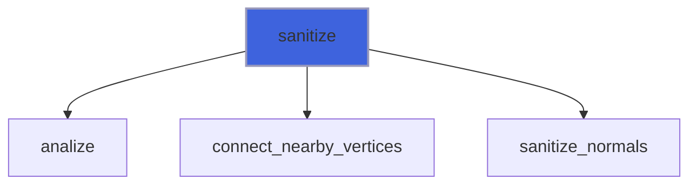

### sanitize_normals

Sanitize facets normals, make them consistent.

 @note Facets connectivity and normals must be already computed.

**Attributes**: pure

```fortran
subroutine sanitize_normals(self)
```

**Arguments**

| Name | Type | Intent | Attributes | Description |
|------|------|--------|------------|-------------|
| `self` | class([surface_stl_object](/api/src/lib/fossil_surface_stl_object#surface-stl-object)) | inout |  | File STL. |

**Call graph**

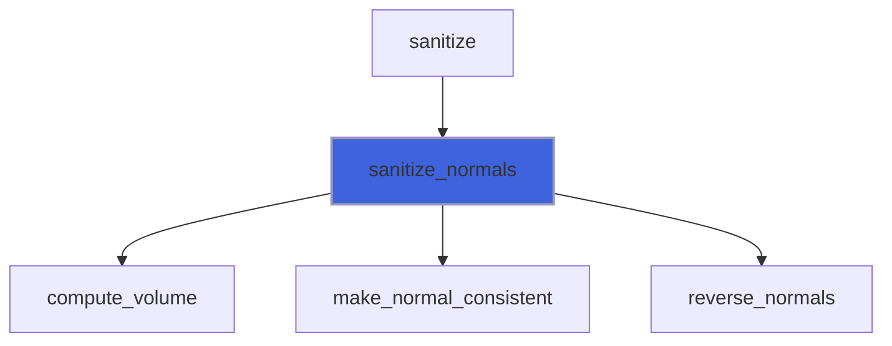

### translate

Translate facets x or y or z or vectorial delta increments.

**Attributes**: elemental

```fortran
subroutine translate(self, x, y, z, delta, recompute_metrix)
```

**Arguments**

| Name | Type | Intent | Attributes | Description |
|------|------|--------|------------|-------------|
| `self` | class([surface_stl_object](/api/src/lib/fossil_surface_stl_object#surface-stl-object)) | inout |  | File STL. |
| `x` | real(kind=[R8P](/api/src/third_party/PENF/src/lib/penf_global_parameters_variables)) | in | optional | Increment along x axis. |
| `y` | real(kind=[R8P](/api/src/third_party/PENF/src/lib/penf_global_parameters_variables)) | in | optional | Increment along y axis. |
| `z` | real(kind=[R8P](/api/src/third_party/PENF/src/lib/penf_global_parameters_variables)) | in | optional | Increment along z axis. |
| `delta` | type([vector_R8P](/api/src/third_party/VecFor/src/lib/vecfor_R8P#vector-r8p)) | in | optional | Vectorial increment. |
| `recompute_metrix` | logical | in | optional | Sentinel to activate metrix recomputation. |

**Call graph**

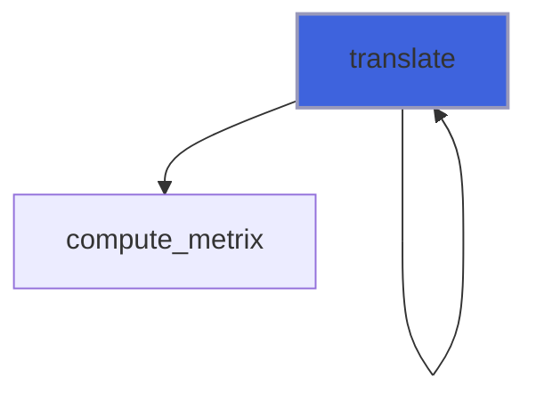

### surface_stl_assign_surface_stl

Operator `=`.

**Attributes**: pure

```fortran
subroutine surface_stl_assign_surface_stl(lhs, rhs)
```

**Arguments**

| Name | Type | Intent | Attributes | Description |
|------|------|--------|------------|-------------|
| `lhs` | class([surface_stl_object](/api/src/lib/fossil_surface_stl_object#surface-stl-object)) | inout |  | Left hand side. |
| `rhs` | type([surface_stl_object](/api/src/lib/fossil_surface_stl_object#surface-stl-object)) | in |  | Right hand side. |

**Call graph**

```mermaid
flowchart TD
  surface_stl_assign_surface_stl["surface_stl_assign_surface_stl"] --> destroy["destroy"]
  style surface_stl_assign_surface_stl fill:#3e63dd,stroke:#99b,stroke-width:2px
```

### compute_facets_disconnected

Compute facets with disconnected edges.

**Attributes**: pure

```fortran
subroutine compute_facets_disconnected(self)
```

**Arguments**

| Name | Type | Intent | Attributes | Description |
|------|------|--------|------------|-------------|
| `self` | class([surface_stl_object](/api/src/lib/fossil_surface_stl_object#surface-stl-object)) | inout |  | File STL. |

**Call graph**

```mermaid
flowchart TD
  analize["analize"] --> compute_facets_disconnected["compute_facets_disconnected"]
  compute_facets_disconnected["compute_facets_disconnected"] --> destroy["destroy"]
  compute_facets_disconnected["compute_facets_disconnected"] --> put["put"]
  style compute_facets_disconnected fill:#3e63dd,stroke:#99b,stroke-width:2px
```

### mirror_by_normal

Mirror facets given normal of mirroring plane.

**Attributes**: elemental

```fortran
subroutine mirror_by_normal(self, normal, recompute_metrix)
```

**Arguments**

| Name | Type | Intent | Attributes | Description |
|------|------|--------|------------|-------------|
| `self` | class([surface_stl_object](/api/src/lib/fossil_surface_stl_object#surface-stl-object)) | inout |  | File STL. |
| `normal` | type([vector_R8P](/api/src/third_party/VecFor/src/lib/vecfor_R8P#vector-r8p)) | in |  | Normal of mirroring plane. |
| `recompute_metrix` | logical | in | optional | Sentinel to activate metrix recomputation. |

**Call graph**

```mermaid
flowchart TD
  mirror_by_normal["mirror_by_normal"] --> mirror["mirror"]
  mirror_by_normal["mirror_by_normal"] --> mirror_matrix_R8P["mirror_matrix_R8P"]
  style mirror_by_normal fill:#3e63dd,stroke:#99b,stroke-width:2px
```

### mirror_by_matrix

Mirror facet given matrix (of mirroring).

**Attributes**: pure

```fortran
subroutine mirror_by_matrix(self, matrix, recompute_metrix)
```

**Arguments**

| Name | Type | Intent | Attributes | Description |
|------|------|--------|------------|-------------|
| `self` | class([surface_stl_object](/api/src/lib/fossil_surface_stl_object#surface-stl-object)) | inout |  | File STL. |
| `matrix` | real(kind=[R8P](/api/src/third_party/PENF/src/lib/penf_global_parameters_variables)) | in |  | Mirroring matrix. |
| `recompute_metrix` | logical | in | optional | Sentinel to activate metrix recomputation. |

**Call graph**

```mermaid
flowchart TD
  mirror_by_normal["mirror_by_normal"] --> mirror_by_matrix["mirror_by_matrix"]
  mirror_by_matrix["mirror_by_matrix"] --> mirror["mirror"]
  style mirror_by_matrix fill:#3e63dd,stroke:#99b,stroke-width:2px
```

### rotate_by_axis_angle

Rotate facets given axis and angle.

 Angle must be in radiants.

**Attributes**: elemental

```fortran
subroutine rotate_by_axis_angle(self, axis, angle, recompute_metrix)
```

**Arguments**

| Name | Type | Intent | Attributes | Description |
|------|------|--------|------------|-------------|
| `self` | class([surface_stl_object](/api/src/lib/fossil_surface_stl_object#surface-stl-object)) | inout |  | File STL. |
| `axis` | type([vector_R8P](/api/src/third_party/VecFor/src/lib/vecfor_R8P#vector-r8p)) | in |  | Axis of rotation. |
| `angle` | real(kind=[R8P](/api/src/third_party/PENF/src/lib/penf_global_parameters_variables)) | in |  | Angle of rotation. |
| `recompute_metrix` | logical | in | optional | Sentinel to activate metrix recomputation. |

**Call graph**

```mermaid
flowchart TD
  rotate_by_axis_angle["rotate_by_axis_angle"] --> rotate["rotate"]
  rotate_by_axis_angle["rotate_by_axis_angle"] --> rotation_matrix_R8P["rotation_matrix_R8P"]
  style rotate_by_axis_angle fill:#3e63dd,stroke:#99b,stroke-width:2px
```

### rotate_by_matrix

Rotate facet given matrix (of ratation).

**Attributes**: pure

```fortran
subroutine rotate_by_matrix(self, matrix, recompute_metrix)
```

**Arguments**

| Name | Type | Intent | Attributes | Description |
|------|------|--------|------------|-------------|
| `self` | class([surface_stl_object](/api/src/lib/fossil_surface_stl_object#surface-stl-object)) | inout |  | File STL. |
| `matrix` | real(kind=[R8P](/api/src/third_party/PENF/src/lib/penf_global_parameters_variables)) | in |  | Rotation matrix. |
| `recompute_metrix` | logical | in | optional | Sentinel to activate metrix recomputation. |

**Call graph**

```mermaid
flowchart TD
  rotate_by_axis_angle["rotate_by_axis_angle"] --> rotate_by_matrix["rotate_by_matrix"]
  rotate_by_matrix["rotate_by_matrix"] --> rotate["rotate"]
  style rotate_by_matrix fill:#3e63dd,stroke:#99b,stroke-width:2px
```

### set_facets_id

(Re)set facets ID.

**Attributes**: elemental

```fortran
subroutine set_facets_id(self)
```

**Arguments**

| Name | Type | Intent | Attributes | Description |
|------|------|--------|------------|-------------|
| `self` | class([surface_stl_object](/api/src/lib/fossil_surface_stl_object#surface-stl-object)) | inout |  | File STL. |

**Call graph**

```mermaid
flowchart TD
  analize["analize"] --> set_facets_id["set_facets_id"]
  style set_facets_id fill:#3e63dd,stroke:#99b,stroke-width:2px
```

## Functions

### distance

Return the (minimum) distance from a point to the triangulated surface.

 @note STL's metrix must be already computed.

**Returns**: real(kind=[R8P](/api/src/third_party/PENF/src/lib/penf_global_parameters_variables))

```fortran
function distance(self, point, is_signed, sign_algorithm, is_square_root)
```

**Arguments**

| Name | Type | Intent | Attributes | Description |
|------|------|--------|------------|-------------|
| `self` | class([surface_stl_object](/api/src/lib/fossil_surface_stl_object#surface-stl-object)) | in |  | File STL. |
| `point` | type([vector_R8P](/api/src/third_party/VecFor/src/lib/vecfor_R8P#vector-r8p)) | in |  | Point coordinates. |
| `is_signed` | logical | in | optional | Sentinel to trigger signed distance. |
| `sign_algorithm` | character(len=*) | in | optional | Algorithm used for "point in polyhedron" test. |
| `is_square_root` | logical | in | optional | Sentinel to trigger square-root distance. |

**Call graph**

```mermaid
flowchart TD
  distance["distance"] --> distance["distance"]
  distance["distance"] --> distance["distance"]
  distance_node["distance_node"] --> distance["distance"]
  distance["distance"] --> compute_distance["compute_distance"]
  style distance fill:#3e63dd,stroke:#99b,stroke-width:2px
```

### is_point_inside

Compute sign.

**Returns**: `logical`

```fortran
function is_point_inside(self, point, sign_algorithm) result(is_inside)
```

**Arguments**

| Name | Type | Intent | Attributes | Description |
|------|------|--------|------------|-------------|
| `self` | class([surface_stl_object](/api/src/lib/fossil_surface_stl_object#surface-stl-object)) | in |  | File STL. |
| `point` | type([vector_R8P](/api/src/third_party/VecFor/src/lib/vecfor_R8P#vector-r8p)) | in |  | Point coordinates. |
| `sign_algorithm` | character(len=*) | in | optional | Algorithm used for "point in polyhedron" test. |

**Call graph**

```mermaid
flowchart TD
  compute_distance["compute_distance"] --> is_point_inside["is_point_inside"]
  compute_distances["compute_distances"] --> is_point_inside["is_point_inside"]
  is_point_inside["is_point_inside"] --> is_point_inside_polyhedron_ri["is_point_inside_polyhedron_ri"]
  is_point_inside["is_point_inside"] --> is_point_inside_polyhedron_sa["is_point_inside_polyhedron_sa"]
  style is_point_inside fill:#3e63dd,stroke:#99b,stroke-width:2px
```

### is_point_inside_polyhedron_ri

Determinate is a point is inside or not to a polyhedron described by STL facets by means ray intersections count.

 @note STL's metrix must be already computed.

**Returns**: `logical`

```fortran
function is_point_inside_polyhedron_ri(self, point) result(is_inside)
```

**Arguments**

| Name | Type | Intent | Attributes | Description |
|------|------|--------|------------|-------------|
| `self` | class([surface_stl_object](/api/src/lib/fossil_surface_stl_object#surface-stl-object)) | in |  | File STL. |
| `point` | type([vector_R8P](/api/src/third_party/VecFor/src/lib/vecfor_R8P#vector-r8p)) | in |  | Point coordinates. |

**Call graph**

```mermaid
flowchart TD
  compute_mesh_distance["compute_mesh_distance"] --> is_point_inside_polyhedron_ri["is_point_inside_polyhedron_ri"]
  is_point_inside["is_point_inside"] --> is_point_inside_polyhedron_ri["is_point_inside_polyhedron_ri"]
  is_point_inside_polyhedron_ri["is_point_inside_polyhedron_ri"] --> is_inside_by_ray_intersect["is_inside_by_ray_intersect"]
  style is_point_inside_polyhedron_ri fill:#3e63dd,stroke:#99b,stroke-width:2px
```

### is_point_inside_polyhedron_sa

Determinate is a point is inside or not to a polyhedron described by STL facets by means of the solid angle criteria.

 @note STL's metrix must be already computed.

**Attributes**: pure

**Returns**: `logical`

```fortran
function is_point_inside_polyhedron_sa(self, point) result(is_inside)
```

**Arguments**

| Name | Type | Intent | Attributes | Description |
|------|------|--------|------------|-------------|
| `self` | class([surface_stl_object](/api/src/lib/fossil_surface_stl_object#surface-stl-object)) | in |  | File STL. |
| `point` | type([vector_R8P](/api/src/third_party/VecFor/src/lib/vecfor_R8P#vector-r8p)) | in |  | Point coordinates. |

**Call graph**

```mermaid
flowchart TD
  compute_mesh_distance["compute_mesh_distance"] --> is_point_inside_polyhedron_sa["is_point_inside_polyhedron_sa"]
  is_point_inside["is_point_inside"] --> is_point_inside_polyhedron_sa["is_point_inside_polyhedron_sa"]
  is_point_inside_polyhedron_sa["is_point_inside_polyhedron_sa"] --> solid_angle["solid_angle"]
  style is_point_inside_polyhedron_sa fill:#3e63dd,stroke:#99b,stroke-width:2px
```

### largest_edge_len

Return the largest edge length.

**Attributes**: pure

**Returns**: real(kind=[R8P](/api/src/third_party/PENF/src/lib/penf_global_parameters_variables))

```fortran
function largest_edge_len(self) result(largest)
```

**Arguments**

| Name | Type | Intent | Attributes | Description |
|------|------|--------|------------|-------------|
| `self` | class([surface_stl_object](/api/src/lib/fossil_surface_stl_object#surface-stl-object)) | in |  | File STL. |

**Call graph**

```mermaid
flowchart TD
  analize["analize"] --> largest_edge_len["largest_edge_len"]
  largest_edge_len["largest_edge_len"] --> largest_edge_len["largest_edge_len"]
  largest_edge_len["largest_edge_len"] --> largest_edge_len["largest_edge_len"]
  style largest_edge_len fill:#3e63dd,stroke:#99b,stroke-width:2px
```

### smallest_edge_len

Return the smallest edge length.

**Attributes**: pure

**Returns**: real(kind=[R8P](/api/src/third_party/PENF/src/lib/penf_global_parameters_variables))

```fortran
function smallest_edge_len(self) result(smallest)
```

**Arguments**

| Name | Type | Intent | Attributes | Description |
|------|------|--------|------------|-------------|
| `self` | class([surface_stl_object](/api/src/lib/fossil_surface_stl_object#surface-stl-object)) | in |  | File STL. |

**Call graph**

```mermaid
flowchart TD
  build_connectivity["build_connectivity"] --> smallest_edge_len["smallest_edge_len"]
  smallest_edge_len["smallest_edge_len"] --> smallest_edge_len["smallest_edge_len"]
  smallest_edge_len["smallest_edge_len"] --> smallest_edge_len["smallest_edge_len"]
  style smallest_edge_len fill:#3e63dd,stroke:#99b,stroke-width:2px
```

### statistics

Return STL statistics.

**Attributes**: pure

**Returns**: `character(len=:)`

```fortran
function statistics(self, prefix) result(stats)
```

**Arguments**

| Name | Type | Intent | Attributes | Description |
|------|------|--------|------------|-------------|
| `self` | class([surface_stl_object](/api/src/lib/fossil_surface_stl_object#surface-stl-object)) | in |  | File STL. |
| `prefix` | character(len=*) | in | optional | Lines prefix. |

**Call graph**

```mermaid
flowchart TD
  statistics["statistics"] --> str["str"]
  style statistics fill:#3e63dd,stroke:#99b,stroke-width:2px
```
