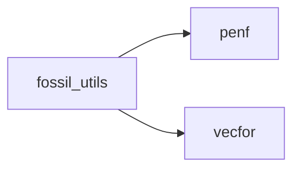
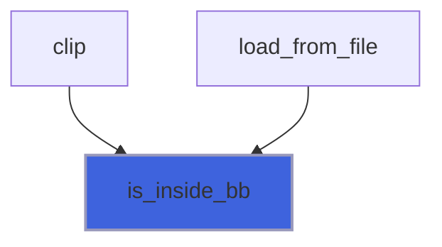

# fossil_utils

> FOSSIL, utils library.

**Source**: `src/lib/fossil_utils.f90`

**Dependencies**



## Contents

- [is_inside_bb](#is-inside-bb)

## Variables

| Name | Type | Attributes | Description |
|------|------|------------|-------------|
| `EPS` | real(kind=[R8P](/api/src/third_party/PENF/src/lib/penf_global_parameters_variables)) |  | Small EPSILON to avoid rund off errors. |
| `FRLEN` | integer(kind=[I4P](/api/src/third_party/PENF/src/lib/penf_global_parameters_variables)) | parameter | Maximum length of fossil STL label string. |
| `PI` | real(kind=[R8P](/api/src/third_party/PENF/src/lib/penf_global_parameters_variables)) | parameter | Pi greek. |

## Functions

### is_inside_bb

Return the true if point is inside AABB.

**Attributes**: pure

**Returns**: `logical`

```fortran
function is_inside_bb(bmin, bmax, point)
```

**Arguments**

| Name | Type | Intent | Attributes | Description |
|------|------|--------|------------|-------------|
| `bmin` | type([vector_R8P](/api/src/third_party/VecFor/src/lib/vecfor_R8P#vector-r8p)) | in |  | Bounding box extents. |
| `bmax` | type([vector_R8P](/api/src/third_party/VecFor/src/lib/vecfor_R8P#vector-r8p)) | in |  | Bounding box extents. |
| `point` | type([vector_R8P](/api/src/third_party/VecFor/src/lib/vecfor_R8P#vector-r8p)) | in |  | Point reference. |

**Call graph**


