# befor64

> BeFoR64, Base64 encoding/decoding library for FoRtran poor people.

**Source**: `src/third_party/BeFoR64/src/lib/befor64.F90`

**Dependencies**

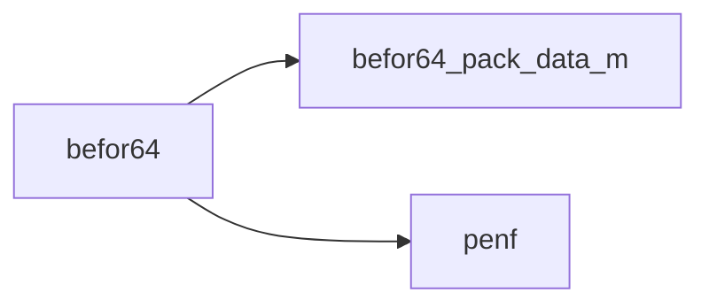

## Contents

- [b64_encode](#b64-encode)
- [b64_encode_up](#b64-encode-up)
- [b64_decode](#b64-decode)
- [b64_decode_up](#b64-decode-up)
- [b64_init](#b64-init)
- [encode_bits](#encode-bits)
- [decode_bits](#decode-bits)
- [b64_encode_up](#b64-encode-up)
- [b64_encode_up_a](#b64-encode-up-a)
- [b64_decode_up](#b64-decode-up)
- [b64_decode_up_a](#b64-decode-up-a)
- [b64_encode_R16](#b64-encode-r16)
- [b64_encode_R8](#b64-encode-r8)
- [b64_encode_R4](#b64-encode-r4)
- [b64_encode_I8](#b64-encode-i8)
- [b64_encode_I4](#b64-encode-i4)
- [b64_encode_I2](#b64-encode-i2)
- [b64_encode_I1](#b64-encode-i1)
- [b64_encode_string](#b64-encode-string)
- [b64_encode_R16_a](#b64-encode-r16-a)
- [b64_encode_R8_a](#b64-encode-r8-a)
- [b64_encode_R4_a](#b64-encode-r4-a)
- [b64_encode_I8_a](#b64-encode-i8-a)
- [b64_encode_I4_a](#b64-encode-i4-a)
- [b64_encode_I2_a](#b64-encode-i2-a)
- [b64_encode_I1_a](#b64-encode-i1-a)
- [b64_encode_string_a](#b64-encode-string-a)
- [b64_decode_R16](#b64-decode-r16)
- [b64_decode_R8](#b64-decode-r8)
- [b64_decode_R4](#b64-decode-r4)
- [b64_decode_I8](#b64-decode-i8)
- [b64_decode_I4](#b64-decode-i4)
- [b64_decode_I2](#b64-decode-i2)
- [b64_decode_I1](#b64-decode-i1)
- [b64_decode_string](#b64-decode-string)
- [b64_decode_R16_a](#b64-decode-r16-a)
- [b64_decode_R8_a](#b64-decode-r8-a)
- [b64_decode_R4_a](#b64-decode-r4-a)
- [b64_decode_I8_a](#b64-decode-i8-a)
- [b64_decode_I4_a](#b64-decode-i4-a)
- [b64_decode_I2_a](#b64-decode-i2-a)
- [b64_decode_I1_a](#b64-decode-i1-a)
- [b64_decode_string_a](#b64-decode-string-a)

## Variables

| Name | Type | Attributes | Description |
|------|------|------------|-------------|
| `is_b64_initialized` | logical |  | Flag for checking the initialization of the library. |
| `base64` | character(len=64) |  | Base64 alphabet. |

## Interfaces

### b64_encode

Encode numbers (integer and real) to base64.

 This is an interface for encoding integer and real numbers of any kinds into a base64 string. This interface can encode both
 scalar and array.

 @warning The encoded string is returned as varying length character string, `character(len=:), allocatable:: string`, thus the
 compiler must support such a Fortran (2003) feature.

 @note Before start to encode anything the library must be initialized. The procedure `b64_init` must be called at first. The
 global variable `is_b64_initialized` can be used to check the status of the initialization.

### Usage
 For a practical example see the `autotest` procedure.

#### Scalar encoding
```fortran
character(len=:), allocatable:: code64 ! base64 encoded string
...
call b64_encode(n=12._R8P,code=code64)
```

#### Array encoding
```fortran
character(len=:), allocatable:: code64 ! base64 encoded string
...
call b64_encode(n=[12_I4P,1_I4P],code=code64)
```

 @note If you want to encode heterogenous data (e.g. integer and real numbers), you must use the auxiliary `pack_data`
 procedure.

 @warning The encoding of array of strings is admitted only if each string of the array has the same length.

**Module procedures**: [`b64_encode_R8`](/api/src/third_party/BeFoR64/src/lib/befor64#b64-encode-r8), [`b64_encode_R8_a`](/api/src/third_party/BeFoR64/src/lib/befor64#b64-encode-r8-a), [`b64_encode_R4`](/api/src/third_party/BeFoR64/src/lib/befor64#b64-encode-r4), [`b64_encode_R4_a`](/api/src/third_party/BeFoR64/src/lib/befor64#b64-encode-r4-a), [`b64_encode_I8`](/api/src/third_party/BeFoR64/src/lib/befor64#b64-encode-i8), [`b64_encode_I8_a`](/api/src/third_party/BeFoR64/src/lib/befor64#b64-encode-i8-a), [`b64_encode_I4`](/api/src/third_party/BeFoR64/src/lib/befor64#b64-encode-i4), [`b64_encode_I4_a`](/api/src/third_party/BeFoR64/src/lib/befor64#b64-encode-i4-a), [`b64_encode_I2`](/api/src/third_party/BeFoR64/src/lib/befor64#b64-encode-i2), [`b64_encode_I2_a`](/api/src/third_party/BeFoR64/src/lib/befor64#b64-encode-i2-a), [`b64_encode_I1`](/api/src/third_party/BeFoR64/src/lib/befor64#b64-encode-i1), [`b64_encode_I1_a`](/api/src/third_party/BeFoR64/src/lib/befor64#b64-encode-i1-a), [`b64_encode_string`](/api/src/third_party/BeFoR64/src/lib/befor64#b64-encode-string), [`b64_encode_string_a`](/api/src/third_party/BeFoR64/src/lib/befor64#b64-encode-string-a)

### b64_encode_up

Encode unlimited polymorphic variable to base64.

 This is an interface for encoding both scalar and array.

 @warning The encoded string is returned as varying length character string, `character(len=:), allocatable:: string`, thus the
 compiler must support such a Fortran (2003) feature.

 @note Before start to encode anything the library must be initialized. The procedure `b64_init` must be called at first. The
 global variable `is_b64_initialized` can be used to check the status of the initialization.

### Usage
 For a practical example see the `autotest` procedure.

#### Scalar encoding
```fortran
character(len=:), allocatable:: code64 ! base64 encoded string
...
call b64_encode_up(up=12._R8P,code=code64)
```

#### Array encoding
```fortran
character(len=:), allocatable:: code64 ! base64 encoded string
...
call b64_encode_up(up=[12_I4P,1_I4P],code=code64)
```

 @note If you want to encode heterogenous data (e.g. integer and real numbers), you must use the auxiliary `pack_data`
 procedure.

 @warning The encoding of array of strings is admitted only if each string of the array has the same length.

**Module procedures**: [`b64_encode_up`](/api/src/third_party/BeFoR64/src/lib/befor64#b64-encode-up), [`b64_encode_up_a`](/api/src/third_party/BeFoR64/src/lib/befor64#b64-encode-up-a)

### b64_decode

Decode numbers (integer and real) from base64.

 This is an interface for decoding integer and real numbers of any kinds from a base64 string. This interface can decode both
 scalar and array.

 @note Before start to decode anything the library must be initialized. The procedure `b64_init` must be called at first. The
 global variable `is_b64_initialized` can be used to check the status of the initialization.

### Usage
 For a practical example see the `autotest` procedure.

#### Scalar decoding
```fortran
real(R8P):: decoded ! scalar to be decoded
...
call b64_decode(code='AAAAAAAA8D8=',n=decoded)
```

#### Array decoding
```fortran
integer(I8P):: decoded(1:4) ! array to be decoded
...
call b64_decode(code='FwAAAAAAAABEAQAAAAAAABBwhAEAAAAAAgAAAAAAAAA=',n=decoded)
```

 @note If you want to decode heterogenous data (e.g. integer and real numbers), you must use the auxiliary `pack_data`
 procedure.

 @warning The decoding of array of strings is admitted only if each string of the array has the same length.

**Module procedures**: [`b64_decode_R8`](/api/src/third_party/BeFoR64/src/lib/befor64#b64-decode-r8), [`b64_decode_R8_a`](/api/src/third_party/BeFoR64/src/lib/befor64#b64-decode-r8-a), [`b64_decode_R4`](/api/src/third_party/BeFoR64/src/lib/befor64#b64-decode-r4), [`b64_decode_R4_a`](/api/src/third_party/BeFoR64/src/lib/befor64#b64-decode-r4-a), [`b64_decode_I8`](/api/src/third_party/BeFoR64/src/lib/befor64#b64-decode-i8), [`b64_decode_I8_a`](/api/src/third_party/BeFoR64/src/lib/befor64#b64-decode-i8-a), [`b64_decode_I4`](/api/src/third_party/BeFoR64/src/lib/befor64#b64-decode-i4), [`b64_decode_I4_a`](/api/src/third_party/BeFoR64/src/lib/befor64#b64-decode-i4-a), [`b64_decode_I2`](/api/src/third_party/BeFoR64/src/lib/befor64#b64-decode-i2), [`b64_decode_I2_a`](/api/src/third_party/BeFoR64/src/lib/befor64#b64-decode-i2-a), [`b64_decode_I1`](/api/src/third_party/BeFoR64/src/lib/befor64#b64-decode-i1), [`b64_decode_I1_a`](/api/src/third_party/BeFoR64/src/lib/befor64#b64-decode-i1-a), [`b64_decode_string`](/api/src/third_party/BeFoR64/src/lib/befor64#b64-decode-string), [`b64_decode_string_a`](/api/src/third_party/BeFoR64/src/lib/befor64#b64-decode-string-a)

### b64_decode_up

Decode unlimited polymorphic variable from base64.

 This is an interface for decoding both scalar and array.

 @note Before start to decode anything the library must be initialized. The procedure `b64_init` must be called at first. The
 global variable `is_b64_initialized` can be used to check the status of the initialization.

### Usage
 For a practical example see the `autotest` procedure.

#### Scalar decoding
```fortran
real(R8P):: decoded ! scalar to be decoded
...
call b64_decode_up(code='AAAAAAAA8D8=',up=decoded)
```

#### Array decoding
```fortran
integer(I8P):: decoded(1:4) ! array to be decoded
...
call b64_decode_up(code='FwAAAAAAAABEAQAAAAAAABBwhAEAAAAAAgAAAAAAAAA=',up=decoded)
```

 @note If you want to decode heterogenous data (e.g. integer and real numbers), you must use the auxiliary `pack_data`
 procedure.

 @warning The decoding of array of strings is admitted only if each string of the array has the same length.

**Module procedures**: [`b64_decode_up`](/api/src/third_party/BeFoR64/src/lib/befor64#b64-decode-up), [`b64_decode_up_a`](/api/src/third_party/BeFoR64/src/lib/befor64#b64-decode-up-a)

## Subroutines

### b64_init

Initialize the BeFoR64 library.

 @note This procedure **must** be called before encoding/decoding anything!

```fortran
 use befor64
 call b64_init
 print "(L1)", is_b64_initialized
```

```fortran
subroutine b64_init()
```

**Call graph**

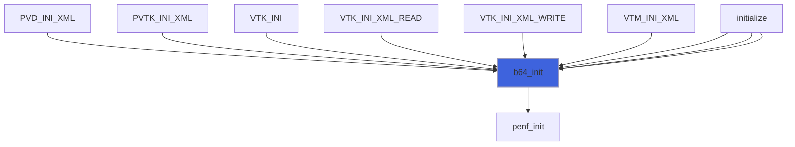

### encode_bits

Encode a bits stream (must be multiple of 24 bits) into base64 charcaters code (of length multiple of 4).

 The bits stream are encoded in chunks of 24 bits as the following example (in little endian order)
```
 +--first octet--+-second octet--+--third octet--+
 |7 6 5 4 3 2 1 0|7 6 5 4 3 2 1 0|7 6 5 4 3 2 1 0|
 +-----------+---+-------+-------+---+-----------+
 |5 4 3 2 1 0|5 4 3 2 1 0|5 4 3 2 1 0|5 4 3 2 1 0|
 +--1.index--+--2.index--+--3.index--+--4.index--+
```
 @note The 4 indexes are stored into 4 elements 8 bits array, thus 2 bits of each array element are not used.

 @note The number of paddings must be computed outside this procedure, into the calling scope.

 @warning This procedure is the backend of encoding, thus it must be never called outside the module.

**Attributes**: pure

```fortran
subroutine encode_bits(bits, padd, code)
```

**Arguments**

| Name | Type | Intent | Attributes | Description |
|------|------|--------|------------|-------------|
| `bits` | integer(kind=[I1P](/api/src/third_party/PENF/src/lib/penf_global_parameters_variables)) | in |  | Bits to be encoded. |
| `padd` | integer(kind=[I4P](/api/src/third_party/PENF/src/lib/penf_global_parameters_variables)) | in |  | Number of padding characters ('='). |
| `code` | character(len=*) | out |  | Characters code. |

**Call graph**


### decode_bits

Decode a base64 string into a sequence of bits stream.

 The base64 string must be parsed with a strike of 4 characters and converted into a 3 bytes stream. Considering the base64 code
 `QUJD` the decoding process must do
```
 +-b64 char--+-b64 char--+-b64 char--+-b64 char--+
 |      Q    |      U    |      J    |      D    |
 +-b64 index-+-b64 index-+-b64 index-+-b64 index-+
 !      16   |      20   |      9    |      3    |
 +-6 bits----+-6 bits----+-6 bits----+-6 bits----+
 |0 1 0 0 0 0|0 1 0 1 0 0|0 0 1 0 0 1|0 0 0 0 1 1|
 +-----------+---+-------+-------+---+-----------+
 |0 1 0 0 0 0 0 1|0 1 0 0 0 0 1 0|0 1 0 0 0 0 1 1|
 +-----8 bits----+-----8 bits----+-----8 bits----+
```
 @note The bits pattern is returned as a 1-byte element array, the dimension of witch must be computed outside this procedure.

 @warning This procedure is the backend of decoding, thus it must be never called outside the module.

**Attributes**: pure

```fortran
subroutine decode_bits(code, bits)
```

**Arguments**

| Name | Type | Intent | Attributes | Description |
|------|------|--------|------------|-------------|
| `code` | character(len=*) | in |  | Characters code. |
| `bits` | integer(kind=[I1P](/api/src/third_party/PENF/src/lib/penf_global_parameters_variables)) | out |  | Bits decoded. |

**Call graph**

```mermaid
flowchart TD
  b64_decode_I1["b64_decode_I1"] --> decode_bits["decode_bits"]
  b64_decode_I1_a["b64_decode_I1_a"] --> decode_bits["decode_bits"]
  b64_decode_I2["b64_decode_I2"] --> decode_bits["decode_bits"]
  b64_decode_I2_a["b64_decode_I2_a"] --> decode_bits["decode_bits"]
  b64_decode_I4["b64_decode_I4"] --> decode_bits["decode_bits"]
  b64_decode_I4_a["b64_decode_I4_a"] --> decode_bits["decode_bits"]
  b64_decode_I8["b64_decode_I8"] --> decode_bits["decode_bits"]
  b64_decode_I8_a["b64_decode_I8_a"] --> decode_bits["decode_bits"]
  b64_decode_R16["b64_decode_R16"] --> decode_bits["decode_bits"]
  b64_decode_R16_a["b64_decode_R16_a"] --> decode_bits["decode_bits"]
  b64_decode_R4["b64_decode_R4"] --> decode_bits["decode_bits"]
  b64_decode_R4_a["b64_decode_R4_a"] --> decode_bits["decode_bits"]
  b64_decode_R8["b64_decode_R8"] --> decode_bits["decode_bits"]
  b64_decode_R8_a["b64_decode_R8_a"] --> decode_bits["decode_bits"]
  b64_decode_string["b64_decode_string"] --> decode_bits["decode_bits"]
  b64_decode_string_a["b64_decode_string_a"] --> decode_bits["decode_bits"]
  style decode_bits fill:#3e63dd,stroke:#99b,stroke-width:2px
```

### b64_encode_up

Encode an unlimited polymorphic scalar to base64.

```fortran
 use befor64
 use penf
 character(len=:), allocatable :: code64
 call b64_encode_up(up=1._R8P, code=code64)
 print "(A)", code64
```

```fortran
subroutine b64_encode_up(up, code)
```

**Arguments**

| Name | Type | Intent | Attributes | Description |
|------|------|--------|------------|-------------|
| `up` | class(*) | in |  | Unlimited polymorphic variable to be encoded. |
| `code` | character(len=:) | out | allocatable | Encoded scalar. |

**Call graph**


### b64_encode_up_a

Encode an unlimited polymorphic array to base64.

```fortran
 use befor64
 use penf
 character(len=:), allocatable :: code64
 call b64_encode_up(up=[0._R4P,-32.12_R4P], code=code64)
 print "(A)", code64
```

**Attributes**: pure

```fortran
subroutine b64_encode_up_a(up, code)
```

**Arguments**

| Name | Type | Intent | Attributes | Description |
|------|------|--------|------------|-------------|
| `up` | class(*) | in |  | Unlimited polymorphic variable to be encoded. |
| `code` | character(len=:) | out | allocatable | Encoded array. |

**Call graph**

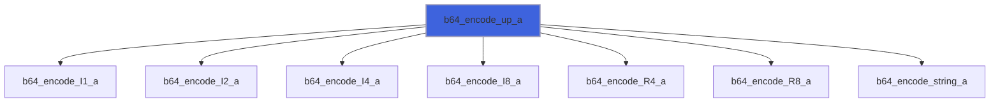

### b64_decode_up

Decode an unlimited polymorphic scalar from base64.

```fortran
 use befor64
 use penf
 integer(I4P) :: scalar_I4
 call b64_decode_up(code='5wcAAA==',up=scalar_I4)
 print "(L1)", scalar_I4==2023_I4P
```

```fortran
subroutine b64_decode_up(code, up)
```

**Arguments**

| Name | Type | Intent | Attributes | Description |
|------|------|--------|------------|-------------|
| `code` | character(len=*) | in |  | Encoded scalar. |
| `up` | class(*) | out |  | Unlimited polymorphic variable to be decoded. |

**Call graph**


### b64_decode_up_a

Decode an unlimited polymorphic array from base64.

```fortran
 use befor64
 use penf
 integer(I8P) :: array_I8(1:4)
 call b64_decode_up(code='FwAAAAAAAABEAQAAAAAAABBwhAEAAAAAAgAAAAAAAAA=', up=array_I8)
 print "(L1)", str(n=array_I8)==str(n=[23_I8P,324_I8P,25456656_I8P,2_I8P])
```

```fortran
subroutine b64_decode_up_a(code, up)
```

**Arguments**

| Name | Type | Intent | Attributes | Description |
|------|------|--------|------------|-------------|
| `code` | character(len=*) | in |  | Encoded array. |
| `up` | class(*) | out |  | Unlimited polymorphic variable to be decoded. |

**Call graph**

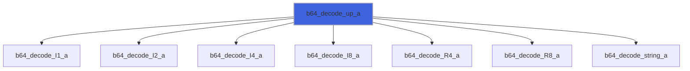

### b64_encode_R16

Encode scalar number to base64 (R16P).

```fortran
 use befor64
 use penf
 character(len=:), allocatable :: code64
 call b64_encode(n=134.231_R16P, code=code64)
 print "(A)", code64
```

**Attributes**: pure

```fortran
subroutine b64_encode_R16(n, code)
```

**Arguments**

| Name | Type | Intent | Attributes | Description |
|------|------|--------|------------|-------------|
| `n` | real(kind=[R16P](/api/src/third_party/PENF/src/lib/penf_global_parameters_variables)) | in |  | Number to be encoded. |
| `code` | character(len=:) | out | allocatable | Encoded scalar. |

**Call graph**

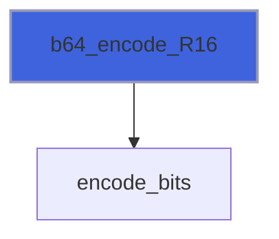

### b64_encode_R8

Encode scalar number to base64 (R8P).

```fortran
 use befor64
 use penf
 character(len=:), allocatable :: code64
 call b64_encode(n=1._R8P, code=code64)
 print "(A)", code64
```

**Attributes**: pure

```fortran
subroutine b64_encode_R8(n, code)
```

**Arguments**

| Name | Type | Intent | Attributes | Description |
|------|------|--------|------------|-------------|
| `n` | real(kind=[R8P](/api/src/third_party/PENF/src/lib/penf_global_parameters_variables)) | in |  | Number to be encoded. |
| `code` | character(len=:) | out | allocatable | Encoded scalar. |

**Call graph**


### b64_encode_R4

Encode scalar number to base64 (R4P).

```fortran
 use befor64
 use penf
 character(len=:), allocatable :: code64
 call b64_encode(n=0._R4P, code=code64)
 print "(A)", code64
```

**Attributes**: pure

```fortran
subroutine b64_encode_R4(n, code)
```

**Arguments**

| Name | Type | Intent | Attributes | Description |
|------|------|--------|------------|-------------|
| `n` | real(kind=[R4P](/api/src/third_party/PENF/src/lib/penf_global_parameters_variables)) | in |  | Number to be encoded. |
| `code` | character(len=:) | out | allocatable | Encoded scalar. |

**Call graph**

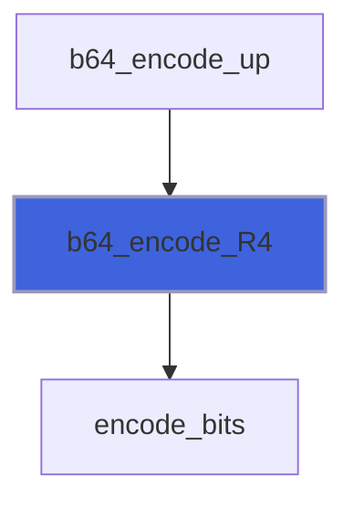

### b64_encode_I8

Encode scalar number to base64 (I8P).

```fortran
 use befor64
 use penf
 character(len=:), allocatable :: code64
 call b64_encode(n=23_I8P, code=code64)
 print "(A)", code64
```

**Attributes**: pure

```fortran
subroutine b64_encode_I8(n, code)
```

**Arguments**

| Name | Type | Intent | Attributes | Description |
|------|------|--------|------------|-------------|
| `n` | integer(kind=[I8P](/api/src/third_party/PENF/src/lib/penf_global_parameters_variables)) | in |  | Number to be encoded. |
| `code` | character(len=:) | out | allocatable | Encoded scalar. |

**Call graph**

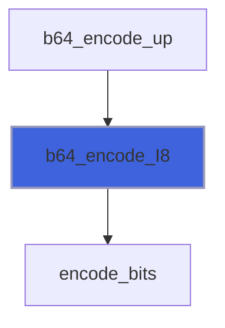

### b64_encode_I4

Encode scalar number to base64 (I4P).

```fortran
 use befor64
 use penf
 character(len=:), allocatable :: code64
 call b64_encode(n=2023_I4P, code=code64)
 print "(A)", code64
```

**Attributes**: pure

```fortran
subroutine b64_encode_I4(n, code)
```

**Arguments**

| Name | Type | Intent | Attributes | Description |
|------|------|--------|------------|-------------|
| `n` | integer(kind=[I4P](/api/src/third_party/PENF/src/lib/penf_global_parameters_variables)) | in |  | Number to be encoded. |
| `code` | character(len=:) | out | allocatable | Encoded scalar. |

**Call graph**


### b64_encode_I2

Encode scalar number to base64 (I2P).

```fortran
 use befor64
 use penf
 character(len=:), allocatable :: code64
 call b64_encode(n=-203_I2P, code=code64)
 print "(A)", code64
```

**Attributes**: pure

```fortran
subroutine b64_encode_I2(n, code)
```

**Arguments**

| Name | Type | Intent | Attributes | Description |
|------|------|--------|------------|-------------|
| `n` | integer(kind=[I2P](/api/src/third_party/PENF/src/lib/penf_global_parameters_variables)) | in |  | Number to be encoded. |
| `code` | character(len=:) | out | allocatable | Encoded scalar. |

**Call graph**


### b64_encode_I1

Encode scalar number to base64 (I1P).

```fortran
 use befor64
 use penf
 character(len=:), allocatable :: code64
 call b64_encode(n=120_I1P, code=code64)
 print "(A)", code64
```

**Attributes**: pure

```fortran
subroutine b64_encode_I1(n, code)
```

**Arguments**

| Name | Type | Intent | Attributes | Description |
|------|------|--------|------------|-------------|
| `n` | integer(kind=[I1P](/api/src/third_party/PENF/src/lib/penf_global_parameters_variables)) | in |  | Number to be encoded. |
| `code` | character(len=:) | out | allocatable | Encoded scalar. |

**Call graph**


### b64_encode_string

Encode scalar string to base64.

```fortran
 use befor64
 use penf
 character(len=:), allocatable :: code64
 call b64_encode(s='hello', code=code64)
 print "(A)", code64
```

**Attributes**: pure

```fortran
subroutine b64_encode_string(s, code)
```

**Arguments**

| Name | Type | Intent | Attributes | Description |
|------|------|--------|------------|-------------|
| `s` | character(len=*) | in |  | String to be encoded. |
| `code` | character(len=:) | out | allocatable | Encoded scalar. |

**Call graph**

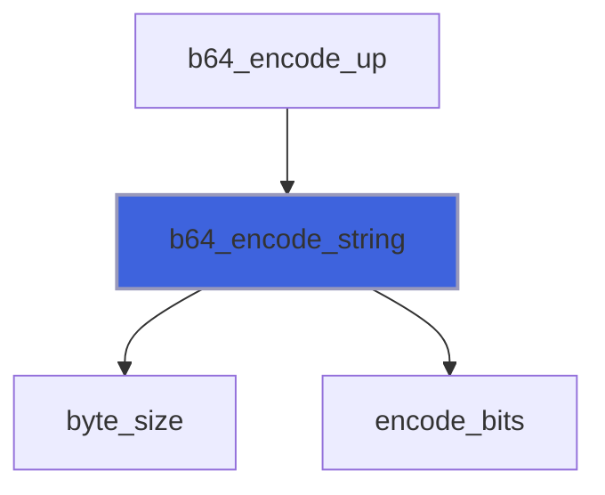

### b64_encode_R16_a

Encode array numbers to base64 (R16P).

```fortran
 use befor64
 use penf
 character(len=:), allocatable :: code64
 call b64_encode(n=[121._R16P,2.32_R16P], code=code64)
 print "(A)", code64
```

**Attributes**: pure

```fortran
subroutine b64_encode_R16_a(n, code)
```

**Arguments**

| Name | Type | Intent | Attributes | Description |
|------|------|--------|------------|-------------|
| `n` | real(kind=[R16P](/api/src/third_party/PENF/src/lib/penf_global_parameters_variables)) | in |  | Array of numbers to be encoded. |
| `code` | character(len=:) | out | allocatable | Encoded array. |

**Call graph**

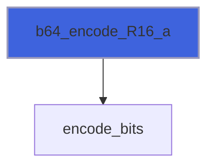

### b64_encode_R8_a

Encode array numbers to base64 (R8P).

```fortran
 use befor64
 use penf
 character(len=:), allocatable :: code64
 call b64_encode(n=[1._R8P,2._R8P], code=code64)
 print "(A)", code64
```

**Attributes**: pure

```fortran
subroutine b64_encode_R8_a(n, code)
```

**Arguments**

| Name | Type | Intent | Attributes | Description |
|------|------|--------|------------|-------------|
| `n` | real(kind=[R8P](/api/src/third_party/PENF/src/lib/penf_global_parameters_variables)) | in |  | Array of numbers to be encoded. |
| `code` | character(len=:) | out | allocatable | Encoded array. |

**Call graph**


### b64_encode_R4_a

Encode array numbers to base64 (R4P).

```fortran
 use befor64
 use penf
 character(len=:), allocatable :: code64
 call b64_encode(n=[0._R4P,-32.12_R4P], code=code64)
 print "(A)", code64
```

**Attributes**: pure

```fortran
subroutine b64_encode_R4_a(n, code)
```

**Arguments**

| Name | Type | Intent | Attributes | Description |
|------|------|--------|------------|-------------|
| `n` | real(kind=[R4P](/api/src/third_party/PENF/src/lib/penf_global_parameters_variables)) | in |  | Array of numbers to be encoded. |
| `code` | character(len=:) | out | allocatable | Encoded array. |

**Call graph**

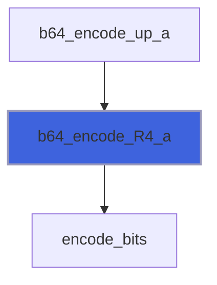

### b64_encode_I8_a

Encode array numbers to base64 (I8P).

```fortran
 use befor64
 use penf
 character(len=:), allocatable :: code64
 call b64_encode(n=[23_I8P,324_I8P,25456656_I8P,2_I8P], code=code64)
 print "(A)", code64
```

**Attributes**: pure

```fortran
subroutine b64_encode_I8_a(n, code)
```

**Arguments**

| Name | Type | Intent | Attributes | Description |
|------|------|--------|------------|-------------|
| `n` | integer(kind=[I8P](/api/src/third_party/PENF/src/lib/penf_global_parameters_variables)) | in |  | Array of numbers to be encoded. |
| `code` | character(len=:) | out | allocatable | Encoded array. |

**Call graph**

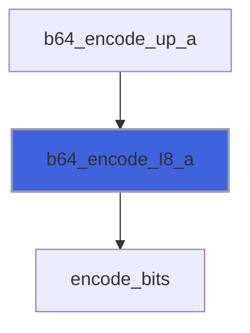

### b64_encode_I4_a

Encode array numbers to base64 (I4P).

```fortran
 use befor64
 use penf
 character(len=:), allocatable :: code64
 call b64_encode(n=[2023_I4P,-24_I4P], code=code64)
 print "(A)", code64
```

**Attributes**: pure

```fortran
subroutine b64_encode_I4_a(n, code)
```

**Arguments**

| Name | Type | Intent | Attributes | Description |
|------|------|--------|------------|-------------|
| `n` | integer(kind=[I4P](/api/src/third_party/PENF/src/lib/penf_global_parameters_variables)) | in |  | Array of numbers to be encoded. |
| `code` | character(len=:) | out | allocatable | Encoded array. |

**Call graph**

```mermaid
flowchart TD
  b64_encode_up_a["b64_encode_up_a"] --> b64_encode_I4_a["b64_encode_I4_a"]
  b64_encode_I4_a["b64_encode_I4_a"] --> encode_bits["encode_bits"]
  style b64_encode_I4_a fill:#3e63dd,stroke:#99b,stroke-width:2px
```

### b64_encode_I2_a

Encode array numbers to base64 (I2P).

```fortran
 use befor64
 use penf
 character(len=:), allocatable :: code64
 call b64_encode(n=[-203_I2P,-10_I2P], code=code64)
 print "(A)", code64
```

**Attributes**: pure

```fortran
subroutine b64_encode_I2_a(n, code)
```

**Arguments**

| Name | Type | Intent | Attributes | Description |
|------|------|--------|------------|-------------|
| `n` | integer(kind=[I2P](/api/src/third_party/PENF/src/lib/penf_global_parameters_variables)) | in |  | Array of numbers to be encoded. |
| `code` | character(len=:) | out | allocatable | Encoded array. |

**Call graph**

```mermaid
flowchart TD
  b64_encode_up_a["b64_encode_up_a"] --> b64_encode_I2_a["b64_encode_I2_a"]
  b64_encode_I2_a["b64_encode_I2_a"] --> encode_bits["encode_bits"]
  style b64_encode_I2_a fill:#3e63dd,stroke:#99b,stroke-width:2px
```

### b64_encode_I1_a

Encode array numbers to base64 (I1P).

```fortran
 use befor64
 use penf
 character(len=:), allocatable :: code64
 call b64_encode(n=[120_I1P,-1_I1P], code=code64)
 print "(A)", code64
```

**Attributes**: pure

```fortran
subroutine b64_encode_I1_a(n, code)
```

**Arguments**

| Name | Type | Intent | Attributes | Description |
|------|------|--------|------------|-------------|
| `n` | integer(kind=[I1P](/api/src/third_party/PENF/src/lib/penf_global_parameters_variables)) | in |  | Array of numbers to be encoded. |
| `code` | character(len=:) | out | allocatable | Encoded array. |

**Call graph**

```mermaid
flowchart TD
  b64_encode_up_a["b64_encode_up_a"] --> b64_encode_I1_a["b64_encode_I1_a"]
  b64_encode_I1_a["b64_encode_I1_a"] --> encode_bits["encode_bits"]
  style b64_encode_I1_a fill:#3e63dd,stroke:#99b,stroke-width:2px
```

### b64_encode_string_a

Encode array string to base64.

```fortran
 use befor64
 use penf
 character(len=:), allocatable :: code64
 call b64_encode(s=['hello','world'], code=code64)
 print "(A)", code64
```

**Attributes**: pure

```fortran
subroutine b64_encode_string_a(s, code)
```

**Arguments**

| Name | Type | Intent | Attributes | Description |
|------|------|--------|------------|-------------|
| `s` | character(len=*) | in |  | String to be encoded. |
| `code` | character(len=:) | out | allocatable | Encoded scalar. |

**Call graph**

```mermaid
flowchart TD
  b64_encode_up_a["b64_encode_up_a"] --> b64_encode_string_a["b64_encode_string_a"]
  b64_encode_string_a["b64_encode_string_a"] --> byte_size["byte_size"]
  b64_encode_string_a["b64_encode_string_a"] --> encode_bits["encode_bits"]
  style b64_encode_string_a fill:#3e63dd,stroke:#99b,stroke-width:2px
```

### b64_decode_R16

Decode a base64 code into a scalar number (R16P).

```fortran
 use befor64
 use penf
 real(R16P) :: scalar_R16
 call b64_decode(code='CKwcWmTHYEA=',n=scalar_R16)
 print "(L1)", scalar_R16==134.231_R16P
```

**Attributes**: elemental

```fortran
subroutine b64_decode_R16(code, n)
```

**Arguments**

| Name | Type | Intent | Attributes | Description |
|------|------|--------|------------|-------------|
| `code` | character(len=*) | in |  | Encoded scalar. |
| `n` | real(kind=[R16P](/api/src/third_party/PENF/src/lib/penf_global_parameters_variables)) | out |  | Number to be decoded. |

**Call graph**

```mermaid
flowchart TD
  b64_decode_R16["b64_decode_R16"] --> decode_bits["decode_bits"]
  style b64_decode_R16 fill:#3e63dd,stroke:#99b,stroke-width:2px
```

### b64_decode_R8

Decode a base64 code into a scalar number (R8P).

```fortran
 use befor64
 use penf
 real(R8P) :: scalar_R8
 call b64_decode(code='AAAAAAAA8D8=',n=scalar_R8)
 print "(L1)", scalar_R8==1._R8P
```

**Attributes**: elemental

```fortran
subroutine b64_decode_R8(code, n)
```

**Arguments**

| Name | Type | Intent | Attributes | Description |
|------|------|--------|------------|-------------|
| `code` | character(len=*) | in |  | Encoded scalar. |
| `n` | real(kind=[R8P](/api/src/third_party/PENF/src/lib/penf_global_parameters_variables)) | out |  | Number to be decoded. |

**Call graph**

```mermaid
flowchart TD
  b64_decode_up["b64_decode_up"] --> b64_decode_R8["b64_decode_R8"]
  b64_decode_R8["b64_decode_R8"] --> decode_bits["decode_bits"]
  style b64_decode_R8 fill:#3e63dd,stroke:#99b,stroke-width:2px
```

### b64_decode_R4

Decode a base64 code into a scalar number (R4P).

```fortran
 use befor64
 use penf
 real(R4P) :: scalar_R4
 call b64_decode(code='AAAAAA==',n=scalar_R4)
 print "(L1)", scalar_R4==0._R4P
```

**Attributes**: elemental

```fortran
subroutine b64_decode_R4(code, n)
```

**Arguments**

| Name | Type | Intent | Attributes | Description |
|------|------|--------|------------|-------------|
| `code` | character(len=*) | in |  | Encoded scalar. |
| `n` | real(kind=[R4P](/api/src/third_party/PENF/src/lib/penf_global_parameters_variables)) | out |  | Number to be decoded. |

**Call graph**

```mermaid
flowchart TD
  b64_decode_up["b64_decode_up"] --> b64_decode_R4["b64_decode_R4"]
  b64_decode_R4["b64_decode_R4"] --> decode_bits["decode_bits"]
  style b64_decode_R4 fill:#3e63dd,stroke:#99b,stroke-width:2px
```

### b64_decode_I8

Decode a base64 code into a scalar number (I8P).

```fortran
 use befor64
 use penf
 integer(I8P) :: scalar_I8
 call b64_decode(code='FwAAAAAAAAA=',n=scalar_I8)
 print "(L1)", scalar_I8==23_I8P
```

**Attributes**: elemental

```fortran
subroutine b64_decode_I8(code, n)
```

**Arguments**

| Name | Type | Intent | Attributes | Description |
|------|------|--------|------------|-------------|
| `code` | character(len=*) | in |  | Encoded scalar. |
| `n` | integer(kind=[I8P](/api/src/third_party/PENF/src/lib/penf_global_parameters_variables)) | out |  | Number to be decoded. |

**Call graph**

```mermaid
flowchart TD
  b64_decode_up["b64_decode_up"] --> b64_decode_I8["b64_decode_I8"]
  b64_decode_I8["b64_decode_I8"] --> decode_bits["decode_bits"]
  style b64_decode_I8 fill:#3e63dd,stroke:#99b,stroke-width:2px
```

### b64_decode_I4

Decode a base64 code into a scalar number (I4P).

```fortran
 use befor64
 use penf
 integer(I4P) :: scalar_I4
 call b64_decode(code='5wcAAA==',n=scalar_I4)
 print "(L1)", scalar_I4==2023_I4P
```

**Attributes**: elemental

```fortran
subroutine b64_decode_I4(code, n)
```

**Arguments**

| Name | Type | Intent | Attributes | Description |
|------|------|--------|------------|-------------|
| `code` | character(len=*) | in |  | Encoded scalar. |
| `n` | integer(kind=[I4P](/api/src/third_party/PENF/src/lib/penf_global_parameters_variables)) | out |  | Number to be decoded. |

**Call graph**

```mermaid
flowchart TD
  b64_decode_up["b64_decode_up"] --> b64_decode_I4["b64_decode_I4"]
  b64_decode_I4["b64_decode_I4"] --> decode_bits["decode_bits"]
  style b64_decode_I4 fill:#3e63dd,stroke:#99b,stroke-width:2px
```

### b64_decode_I2

Decode a base64 code into a scalar number (I2P).

```fortran
 use befor64
 use penf
 integer(I2P) :: scalar_I2
 call b64_decode(code='Nf8=',n=scalar_I2)
 print "(L1)", scalar_I2==-203_I2P
```

**Attributes**: elemental

```fortran
subroutine b64_decode_I2(code, n)
```

**Arguments**

| Name | Type | Intent | Attributes | Description |
|------|------|--------|------------|-------------|
| `code` | character(len=*) | in |  | Encoded scalar. |
| `n` | integer(kind=[I2P](/api/src/third_party/PENF/src/lib/penf_global_parameters_variables)) | out |  | Number to be decoded. |

**Call graph**

```mermaid
flowchart TD
  b64_decode_up["b64_decode_up"] --> b64_decode_I2["b64_decode_I2"]
  b64_decode_I2["b64_decode_I2"] --> decode_bits["decode_bits"]
  style b64_decode_I2 fill:#3e63dd,stroke:#99b,stroke-width:2px
```

### b64_decode_I1

Decode a base64 code into a scalar number (I1P).

```fortran
 use befor64
 use penf
 integer(I1P) :: scalar_I1
 call b64_decode(code='eA==',n=scalar_I1)
 print "(L1)", scalar_I1==120_I1P
```

**Attributes**: elemental

```fortran
subroutine b64_decode_I1(code, n)
```

**Arguments**

| Name | Type | Intent | Attributes | Description |
|------|------|--------|------------|-------------|
| `code` | character(len=*) | in |  | Encoded scalar. |
| `n` | integer(kind=[I1P](/api/src/third_party/PENF/src/lib/penf_global_parameters_variables)) | out |  | Number to be decoded. |

**Call graph**

```mermaid
flowchart TD
  b64_decode_up["b64_decode_up"] --> b64_decode_I1["b64_decode_I1"]
  b64_decode_I1["b64_decode_I1"] --> decode_bits["decode_bits"]
  style b64_decode_I1 fill:#3e63dd,stroke:#99b,stroke-width:2px
```

### b64_decode_string

Decode a base64 code into a scalar string.

```fortran
 use befor64
 use penf
 character(:), allocatable :: code64
 code64 = repeat(' ',5)
 call b64_decode(code='aGVsbG8=',s=code64)
 print "(L1)", code64=='hello'
```

**Attributes**: elemental

```fortran
subroutine b64_decode_string(code, s)
```

**Arguments**

| Name | Type | Intent | Attributes | Description |
|------|------|--------|------------|-------------|
| `code` | character(len=*) | in |  | Encoded scalar. |
| `s` | character(len=*) | out |  | String to be decoded. |

**Call graph**

```mermaid
flowchart TD
  b64_decode_up["b64_decode_up"] --> b64_decode_string["b64_decode_string"]
  b64_decode_string["b64_decode_string"] --> byte_size["byte_size"]
  b64_decode_string["b64_decode_string"] --> decode_bits["decode_bits"]
  style b64_decode_string fill:#3e63dd,stroke:#99b,stroke-width:2px
```

### b64_decode_R16_a

Decode a base64 code into an array numbers (R16P).

```fortran
 use befor64
 use penf
 real(R16P) :: array_R16(1:2)
 call b64_decode(code='AAAAAABAXkCPwvUoXI8CQA==',n=array_R16)
 print "(L1)", str(n=array_R16)==str(n=[121._R16P,2.32_R16P])
```

**Attributes**: pure

```fortran
subroutine b64_decode_R16_a(code, n)
```

**Arguments**

| Name | Type | Intent | Attributes | Description |
|------|------|--------|------------|-------------|
| `code` | character(len=*) | in |  | Encoded array. |
| `n` | real(kind=[R16P](/api/src/third_party/PENF/src/lib/penf_global_parameters_variables)) | out |  | Array of numbers to be decoded. |

**Call graph**

```mermaid
flowchart TD
  b64_decode_R16_a["b64_decode_R16_a"] --> decode_bits["decode_bits"]
  style b64_decode_R16_a fill:#3e63dd,stroke:#99b,stroke-width:2px
```

### b64_decode_R8_a

Decode a base64 code into an array numbers (R8P).

```fortran
 use befor64
 use penf
 real(R8P) :: array_R8(1:2)
 call b64_decode(code='AAAAAAAA8D8AAAAAAAAAQA==',n=array_R8)
 print "(L1)", str(n=array_R8)==str(n=[1._R8P,2._R8P])
```

**Attributes**: pure

```fortran
subroutine b64_decode_R8_a(code, n)
```

**Arguments**

| Name | Type | Intent | Attributes | Description |
|------|------|--------|------------|-------------|
| `code` | character(len=*) | in |  | Encoded array. |
| `n` | real(kind=[R8P](/api/src/third_party/PENF/src/lib/penf_global_parameters_variables)) | out |  | Array of numbers to be decoded. |

**Call graph**

```mermaid
flowchart TD
  b64_decode_up_a["b64_decode_up_a"] --> b64_decode_R8_a["b64_decode_R8_a"]
  b64_decode_R8_a["b64_decode_R8_a"] --> decode_bits["decode_bits"]
  style b64_decode_R8_a fill:#3e63dd,stroke:#99b,stroke-width:2px
```

### b64_decode_R4_a

Decode a base64 code into an array numbers (R4P).

```fortran
 use befor64
 use penf
 real(R4P) :: array_R4(1:2)
 call b64_decode(code='AAAAAOF6AMI=',n=array_R4)
 print "(L1)", str(n=array_R4)==str(n=[0._R4P,-32.12_R4P])
```

**Attributes**: pure

```fortran
subroutine b64_decode_R4_a(code, n)
```

**Arguments**

| Name | Type | Intent | Attributes | Description |
|------|------|--------|------------|-------------|
| `code` | character(len=*) | in |  | Encoded array. |
| `n` | real(kind=[R4P](/api/src/third_party/PENF/src/lib/penf_global_parameters_variables)) | out |  | Array of numbers to be decoded. |

**Call graph**

```mermaid
flowchart TD
  b64_decode_up_a["b64_decode_up_a"] --> b64_decode_R4_a["b64_decode_R4_a"]
  b64_decode_R4_a["b64_decode_R4_a"] --> decode_bits["decode_bits"]
  style b64_decode_R4_a fill:#3e63dd,stroke:#99b,stroke-width:2px
```

### b64_decode_I8_a

Decode a base64 code into an array numbers (I8P).

```fortran
 use befor64
 use penf
 integer(I8P) :: array_I8(1:4)
 call b64_decode(code='FwAAAAAAAABEAQAAAAAAABBwhAEAAAAAAgAAAAAAAAA=',n=array_I8)
 print "(L1)", str(n=array_I8)==str(n=[23_I8P,324_I8P,25456656_I8P,2_I8P])
```

**Attributes**: pure

```fortran
subroutine b64_decode_I8_a(code, n)
```

**Arguments**

| Name | Type | Intent | Attributes | Description |
|------|------|--------|------------|-------------|
| `code` | character(len=*) | in |  | Encoded array. |
| `n` | integer(kind=[I8P](/api/src/third_party/PENF/src/lib/penf_global_parameters_variables)) | out |  | Array of numbers to be decoded. |

**Call graph**

```mermaid
flowchart TD
  b64_decode_up_a["b64_decode_up_a"] --> b64_decode_I8_a["b64_decode_I8_a"]
  b64_decode_I8_a["b64_decode_I8_a"] --> decode_bits["decode_bits"]
  style b64_decode_I8_a fill:#3e63dd,stroke:#99b,stroke-width:2px
```

### b64_decode_I4_a

Decode a base64 code into an array numbers (I4P).

```fortran
 use befor64
 use penf
 integer(I4P) :: array_I4(1:2)
 call b64_decode(code='5wcAAOj///8=',n=array_I4)
 print "(L1)", str(n=array_I4)==str(n=[2023_I4P,-24_I4P])
```

**Attributes**: pure

```fortran
subroutine b64_decode_I4_a(code, n)
```

**Arguments**

| Name | Type | Intent | Attributes | Description |
|------|------|--------|------------|-------------|
| `code` | character(len=*) | in |  | Encoded array. |
| `n` | integer(kind=[I4P](/api/src/third_party/PENF/src/lib/penf_global_parameters_variables)) | out |  | Array of numbers to be decoded. |

**Call graph**

```mermaid
flowchart TD
  b64_decode_up_a["b64_decode_up_a"] --> b64_decode_I4_a["b64_decode_I4_a"]
  b64_decode_I4_a["b64_decode_I4_a"] --> decode_bits["decode_bits"]
  style b64_decode_I4_a fill:#3e63dd,stroke:#99b,stroke-width:2px
```

### b64_decode_I2_a

Decode a base64 code into an array numbers (I2P).

```fortran
 use befor64
 use penf
 integer(I2P) :: array_I2(1:2)
 call b64_decode(code='Nf/2/w==',n=array_I2)
 print "(L1)", str(n=array_I2)==str(n=[-203_I2P,-10_I2P])
```

**Attributes**: pure

```fortran
subroutine b64_decode_I2_a(code, n)
```

**Arguments**

| Name | Type | Intent | Attributes | Description |
|------|------|--------|------------|-------------|
| `code` | character(len=*) | in |  | Encoded array. |
| `n` | integer(kind=[I2P](/api/src/third_party/PENF/src/lib/penf_global_parameters_variables)) | out |  | Array of numbers to be decoded. |

**Call graph**

```mermaid
flowchart TD
  b64_decode_up_a["b64_decode_up_a"] --> b64_decode_I2_a["b64_decode_I2_a"]
  b64_decode_I2_a["b64_decode_I2_a"] --> decode_bits["decode_bits"]
  style b64_decode_I2_a fill:#3e63dd,stroke:#99b,stroke-width:2px
```

### b64_decode_I1_a

Decode a base64 code into an array numbers (I1P).

```fortran
 use befor64
 use penf
 integer(I1P) :: array_I1(1:2)
 call b64_decode(code='eP8=',n=array_I1)
 print "(L1)", str(n=array_I1)==str(n=[120_I1P,-1_I1P])
```

**Attributes**: pure

```fortran
subroutine b64_decode_I1_a(code, n)
```

**Arguments**

| Name | Type | Intent | Attributes | Description |
|------|------|--------|------------|-------------|
| `code` | character(len=*) | in |  | Encoded array. |
| `n` | integer(kind=[I1P](/api/src/third_party/PENF/src/lib/penf_global_parameters_variables)) | out |  | Array of numbers to be decoded. |

**Call graph**

```mermaid
flowchart TD
  b64_decode_up_a["b64_decode_up_a"] --> b64_decode_I1_a["b64_decode_I1_a"]
  b64_decode_I1_a["b64_decode_I1_a"] --> decode_bits["decode_bits"]
  style b64_decode_I1_a fill:#3e63dd,stroke:#99b,stroke-width:2px
```

### b64_decode_string_a

Decode a base64 code into an array of strings.

```fortran
 use befor64
 use penf
 character(5) :: array_s(1:2)
 call b64_decode(code='aGVsbG93b3JsZA==',s=array_s)
 print "(L1)", array_s(1)//array_s(2)=='helloworld'
```

**Attributes**: pure

```fortran
subroutine b64_decode_string_a(code, s)
```

**Arguments**

| Name | Type | Intent | Attributes | Description |
|------|------|--------|------------|-------------|
| `code` | character(len=*) | in |  | Encoded scalar. |
| `s` | character(len=*) | out |  | String to be decoded. |

**Call graph**

```mermaid
flowchart TD
  b64_decode_up_a["b64_decode_up_a"] --> b64_decode_string_a["b64_decode_string_a"]
  b64_decode_string_a["b64_decode_string_a"] --> byte_size["byte_size"]
  b64_decode_string_a["b64_decode_string_a"] --> decode_bits["decode_bits"]
  style b64_decode_string_a fill:#3e63dd,stroke:#99b,stroke-width:2px
```
