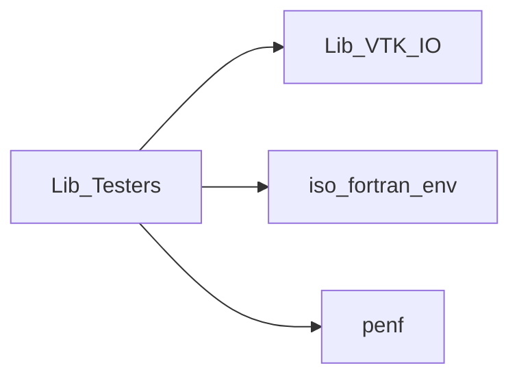
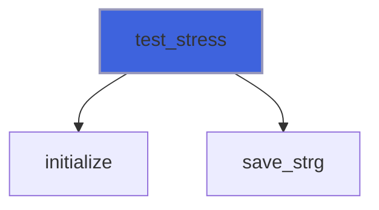
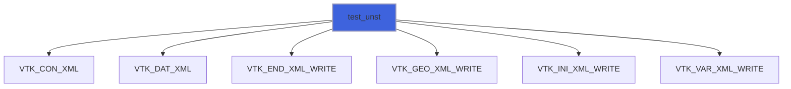
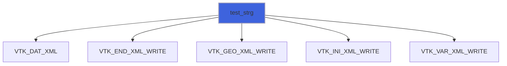
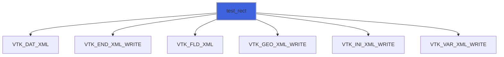
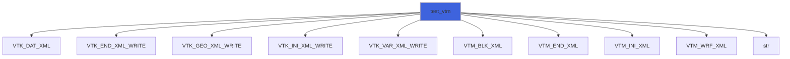

```mermaid
flowchart TD
  test_mpi["test_mpi"] --> PVTK_DAT_XML["PVTK_DAT_XML"]
  test_mpi["test_mpi"] --> PVTK_END_XML["PVTK_END_XML"]
  test_mpi["test_mpi"] --> PVTK_GEO_XML["PVTK_GEO_XML"]
  test_mpi["test_mpi"] --> PVTK_INI_XML["PVTK_INI_XML"]
  test_mpi["test_mpi"] --> PVTK_VAR_XML["PVTK_VAR_XML"]
  test_mpi["test_mpi"] --> VTK_DAT_XML["VTK_DAT_XML"]
  test_mpi["test_mpi"] --> VTK_END_XML_WRITE["VTK_END_XML_WRITE"]
  test_mpi["test_mpi"] --> VTK_GEO_XML_WRITE["VTK_GEO_XML_WRITE"]
  test_mpi["test_mpi"] --> VTK_INI_XML_WRITE["VTK_INI_XML_WRITE"]
  test_mpi["test_mpi"] --> VTK_VAR_XML_WRITE["VTK_VAR_XML_WRITE"]
  test_mpi["test_mpi"] --> str["str"]
  test_mpi["test_mpi"] --> strz["strz"]
  style test_mpi fill:#3e63dd,stroke:#99b,stroke-width:2px
```

# Lib_Testers

> Module library of procedures for testing Lib_VTK_IO and for providing practical examples.

**Source**: `src/third_party/VTKFortran/references/legacy/Test_Driver.f90`

**Dependencies**



## Contents

- [test_stress](#test-stress)
- [test_unst](#test-unst)
- [test_strg](#test-strg)
- [test_rect](#test-rect)
- [test_punst](#test-punst)
- [test_pstrg](#test-pstrg)
- [test_vtm](#test-vtm)
- [test_openmp](#test-openmp)
- [test_mpi](#test-mpi)

## Subroutines

### test_stress

Procedure for testing all functions.

 R4P and R8P mesh data, 1D and 3D arrays inputs, standard (X,Y,Z,... separated arrays) and
 packed API (X,Y,Z,... packed into a single array). All available formats are used. The StructuredGrid topology is used.
 @note This subroutine is designed not as an example rather than a comprehensive stress-tester for functions of any kind/rank.

```fortran
subroutine test_stress()
```

**Call graph**



### test_unst

Procedure for testing UnstructuredGrid functions.

```fortran
subroutine test_unst()
```

**Call graph**



### test_strg

Procedure for testing StructuredGrid functions.

```fortran
subroutine test_strg()
```

**Call graph**



### test_rect

Procedure for testing RectilinearGrid functions.

 @note This subroutine also shows the usage of FieldData functions that are useful for saving global auxiliary data, e.g. time,
 time step, ecc.

```fortran
subroutine test_rect()
```

**Call graph**



### test_punst

Procedure for testing parallel (partitioned) PStructuredGrid functions.

 @note Note that the two parts are completely independet.

```fortran
subroutine test_punst()
```

**Call graph**



```mermaid
flowchart TD
  test_punst["test_punst"] --> PVTK_DAT_XML["PVTK_DAT_XML"]
  test_punst["test_punst"] --> PVTK_END_XML["PVTK_END_XML"]
  test_punst["test_punst"] --> PVTK_GEO_XML["PVTK_GEO_XML"]
  test_punst["test_punst"] --> PVTK_INI_XML["PVTK_INI_XML"]
  test_punst["test_punst"] --> PVTK_VAR_XML["PVTK_VAR_XML"]
  test_punst["test_punst"] --> VTK_CON_XML["VTK_CON_XML"]
  test_punst["test_punst"] --> VTK_DAT_XML["VTK_DAT_XML"]
  test_punst["test_punst"] --> VTK_END_XML_WRITE["VTK_END_XML_WRITE"]
  test_punst["test_punst"] --> VTK_GEO_XML_WRITE["VTK_GEO_XML_WRITE"]
  test_punst["test_punst"] --> VTK_INI_XML_WRITE["VTK_INI_XML_WRITE"]
  test_punst["test_punst"] --> VTK_VAR_XML_WRITE["VTK_VAR_XML_WRITE"]
  style test_punst fill:#3e63dd,stroke:#99b,stroke-width:2px
```

### test_pstrg

Procedure for testing parallel (partitioned) PStructuredGrid functions.

 The mesh is a simple prism partitioned into two pieces along x direction at ordinate i=nx2_p(1).
```
 y ^
   |               ny2 +-----------------+--------------+
   |                   |                 |              |
   |                   |                 |              |
   |                   |                 |              |
   |                   |                 |              |
   o-------->      ny1 +-----------------+--------------+
            x         nx1               i=nx2_p(1)     nx2
```

```fortran
subroutine test_pstrg()
```

**Call graph**



```mermaid
flowchart TD
  test_pstrg["test_pstrg"] --> PVTK_DAT_XML["PVTK_DAT_XML"]
  test_pstrg["test_pstrg"] --> PVTK_END_XML["PVTK_END_XML"]
  test_pstrg["test_pstrg"] --> PVTK_GEO_XML["PVTK_GEO_XML"]
  test_pstrg["test_pstrg"] --> PVTK_INI_XML["PVTK_INI_XML"]
  test_pstrg["test_pstrg"] --> PVTK_VAR_XML["PVTK_VAR_XML"]
  test_pstrg["test_pstrg"] --> VTK_DAT_XML["VTK_DAT_XML"]
  test_pstrg["test_pstrg"] --> VTK_END_XML_WRITE["VTK_END_XML_WRITE"]
  test_pstrg["test_pstrg"] --> VTK_GEO_XML_WRITE["VTK_GEO_XML_WRITE"]
  test_pstrg["test_pstrg"] --> VTK_INI_XML_WRITE["VTK_INI_XML_WRITE"]
  test_pstrg["test_pstrg"] --> VTK_VAR_XML_WRITE["VTK_VAR_XML_WRITE"]
  test_pstrg["test_pstrg"] --> str["str"]
  style test_pstrg fill:#3e63dd,stroke:#99b,stroke-width:2px
```

### test_vtm

Procedure for testing multi-blocks VTM functions.

 There are 4 subset of data organized into 2 blocks. All the subsets are simple StructuredGrid prisms shifted along x direction.

```fortran
subroutine test_vtm()
```

**Call graph**



### test_openmp

Procedure for testing the libray in an OpenMP parallel framework.

 It is used for testing thread-safe capability and the
 library speedup into OpenMP parallel framework. The output is a parallel (partitioned) PStructuredGrid file.
 @note The whole grid is composed of blocks of 32x32x32 structured mesh. The total number of blocks/files, Nf_tot, is passed as
 argument. The whole grid is built up composing the blocks along the X axis with a regular shift as following:
```
 y ^
   |               ny2 +------------+------------+------------+------///////////-----+
   |                   |            |            |            |                      |
   |                   |            |            |            |                      |
   |                   |            |            |            |                      |
   |                   |            |            |            |                      |
   o-------->      ny1 +------------+------------+------------+------///////////-----+
            x         nx1          nx2    2*(nx2-nx+1)  3*(nx2-nx+1)          Nf_tot*(nx2-nx+1)
```
 @note When the total number of blocks/files, Nf_tot, is not an integral of the number of threads used, Nths, the last
 thread saves its own files (Nf_tot/Nths) plus the remainder blocks/files (mod(Nf_tot,Nths)). As a consequence the last
 thread could has different elapsed time and it could degrade the speedup. Therefore the subroutine prints to stdout the
 maximum and minimum elapsed time among the threads as well the average elapsed time in order to facilitate the assessing
 of the parallel scalability.

 @note It is important to note that the output files initialization and finalization must be done outside the parallel ambient.

 @note The array containing the files indexes could be shared among threads, but the counter of this array ('p' in this example)
 must be private.

```fortran
subroutine test_openmp(Nf_tot)
```

**Arguments**

| Name | Type | Intent | Attributes | Description |
|------|------|--------|------------|-------------|
| `Nf_tot` | integer(kind=[I4P](/api/src/third_party/PENF/src/lib/penf_global_parameters_variables)) | in |  | Total number of files saved. |

**Call graph**



```mermaid
flowchart TD
  test_openmp["test_openmp"] --> PVTK_DAT_XML["PVTK_DAT_XML"]
  test_openmp["test_openmp"] --> PVTK_END_XML["PVTK_END_XML"]
  test_openmp["test_openmp"] --> PVTK_GEO_XML["PVTK_GEO_XML"]
  test_openmp["test_openmp"] --> PVTK_INI_XML["PVTK_INI_XML"]
  test_openmp["test_openmp"] --> PVTK_VAR_XML["PVTK_VAR_XML"]
  test_openmp["test_openmp"] --> VTK_DAT_XML["VTK_DAT_XML"]
  test_openmp["test_openmp"] --> VTK_END_XML_WRITE["VTK_END_XML_WRITE"]
  test_openmp["test_openmp"] --> VTK_GEO_XML_WRITE["VTK_GEO_XML_WRITE"]
  test_openmp["test_openmp"] --> VTK_INI_XML_WRITE["VTK_INI_XML_WRITE"]
  test_openmp["test_openmp"] --> VTK_VAR_XML_WRITE["VTK_VAR_XML_WRITE"]
  test_openmp["test_openmp"] --> str["str"]
  test_openmp["test_openmp"] --> strz["strz"]
  style test_openmp fill:#3e63dd,stroke:#99b,stroke-width:2px
```

### test_mpi

Procedure for testing the library in an MPI parallel framework.

 It is used for testing the process-safe capability and the
 library speedup into MPI parallel framework.  The output is a parallel (partitioned) PStructuredGrid file.
 @note The whole grid is composed of blocks of 32x32x32 structured mesh. The total number of blocks/files, Nf_tot, is passed as
 argument. The whole grid is built up composing the blocks along the X axis with a regular shift as following:
```
 y ^
   |               ny2 +------------+------------+------------+------///////////-----+
   |                   |            |            |            |                      |
   |                   |            |            |            |                      |
   |                   |            |            |            |                      |
   |                   |            |            |            |                      |
   o-------->      ny1 +------------+------------+------------+------///////////-----+
            x         nx1          nx2    2*(nx2-nx+1)  3*(nx2-nx+1)          Nf_tot*(nx2-nx+1)
```
 @note When the total number of blocks/files, Nf_tot, is not an integral of the number of processes used, nproc, the last
 process saves its own files (Nf_tot/nproc) plus the remainder blocks/files (mod(Nf_tot,nproc)). As a consequence the last
 process could has different elapsed time and it could degrade the speedup. Therefore the subroutine prints to stdout the
 maximum and minimum elapsed time among the processes as well the average elapsed time in order to facilitate the assessing
 of the parallel scalability.

```fortran
subroutine test_mpi(Nf_tot)
```

**Arguments**

| Name | Type | Intent | Attributes | Description |
|------|------|--------|------------|-------------|
| `Nf_tot` | integer(kind=[I4P](/api/src/third_party/PENF/src/lib/penf_global_parameters_variables)) | in |  | Total number of files saved. |

**Call graph**


