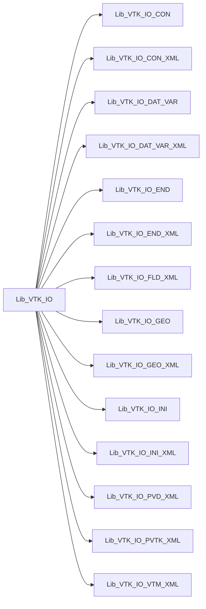

# Lib_VTK_IO

> Pure Fortran (2003+) library to write and read data conforming the VTK standard
{!README-Lib_VTK_IO.md!}

**Source**: `src/third_party/VTKFortran/references/legacy/Lib_VTK_IO.f90`

**Dependencies**

