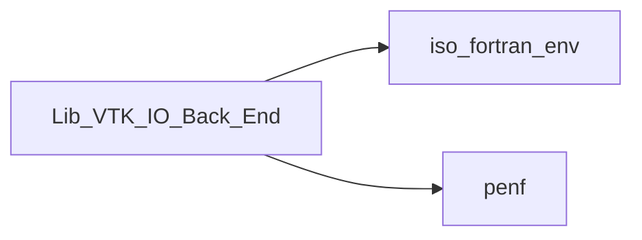
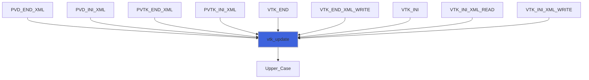
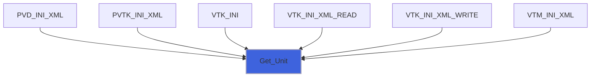
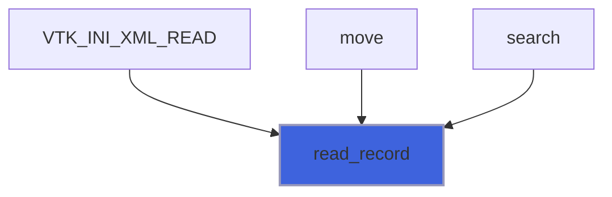

```mermaid
flowchart TD
  VTK_GEO_XML_RECT_R4_READ["VTK_GEO_XML_RECT_R4_READ"] --> search["search"]
  VTK_GEO_XML_RECT_R8_READ["VTK_GEO_XML_RECT_R8_READ"] --> search["search"]
  VTK_GEO_XML_STRG_1DAP_R4_READ["VTK_GEO_XML_STRG_1DAP_R4_READ"] --> search["search"]
  VTK_GEO_XML_STRG_1DAP_R8_READ["VTK_GEO_XML_STRG_1DAP_R8_READ"] --> search["search"]
  VTK_GEO_XML_STRG_1DA_R4_READ["VTK_GEO_XML_STRG_1DA_R4_READ"] --> search["search"]
  VTK_GEO_XML_STRG_1DA_R8_READ["VTK_GEO_XML_STRG_1DA_R8_READ"] --> search["search"]
  VTK_GEO_XML_STRG_3DAP_R4_READ["VTK_GEO_XML_STRG_3DAP_R4_READ"] --> search["search"]
  VTK_GEO_XML_STRG_3DAP_R8_READ["VTK_GEO_XML_STRG_3DAP_R8_READ"] --> search["search"]
  VTK_GEO_XML_STRG_3DA_R4_READ["VTK_GEO_XML_STRG_3DA_R4_READ"] --> search["search"]
  VTK_GEO_XML_STRG_3DA_R8_READ["VTK_GEO_XML_STRG_3DA_R8_READ"] --> search["search"]
  VTK_GEO_XML_UNST_PACK_R4_READ["VTK_GEO_XML_UNST_PACK_R4_READ"] --> search["search"]
  VTK_GEO_XML_UNST_PACK_R8_READ["VTK_GEO_XML_UNST_PACK_R8_READ"] --> search["search"]
  VTK_GEO_XML_UNST_R4_READ["VTK_GEO_XML_UNST_R4_READ"] --> search["search"]
  VTK_GEO_XML_UNST_R8_READ["VTK_GEO_XML_UNST_R8_READ"] --> search["search"]
  VTK_VAR_XML_HEADER_READ["VTK_VAR_XML_HEADER_READ"] --> search["search"]
  get_content["get_content"] --> search["search"]
  search["search"] --> Upper_Case["Upper_Case"]
  search["search"] --> adjustlt["adjustlt"]
  search["search"] --> get_char["get_char"]
  search["search"] --> read_record["read_record"]
  style search fill:#3e63dd,stroke:#99b,stroke-width:2px
```

# Lib_VTK_IO_Back_End

> Back-end module for Lib_VTK_IO.

**Source**: `src/third_party/VTKFortran/references/legacy/Lib_VTK_IO_Back_End.f90`

**Dependencies**



## Contents

- [Type_VTK_File](#type-vtk-file)
- [Type_VTM_File](#type-vtm-file)
- [byte_update](#byte-update)
- [vtk_update](#vtk-update)
- [get_int](#get-int)
- [get_char](#get-char)
- [Get_Unit](#get-unit)
- [Upper_Case](#upper-case)
- [adjustlt](#adjustlt)
- [read_record](#read-record)
- [move](#move)
- [search](#search)

## Variables

| Name | Type | Attributes | Description |
|------|------|------------|-------------|
| `maxlen` | integer(kind=[I4P](/api/src/third_party/PENF/src/lib/penf_global_parameters_variables)) | parameter | Max number of characters of static string. |
| `end_rec` | character(len=1) | parameter | End-character for binary-record finalize. |
| `ascii` | integer(kind=[I4P](/api/src/third_party/PENF/src/lib/penf_global_parameters_variables)) | parameter | Ascii-output-format parameter identifier. |
| `binary` | integer(kind=[I4P](/api/src/third_party/PENF/src/lib/penf_global_parameters_variables)) | parameter | Base64-output-format parameter identifier. |
| `raw` | integer(kind=[I4P](/api/src/third_party/PENF/src/lib/penf_global_parameters_variables)) | parameter | Raw-appended-binary-output-format parameter identifier. |
| `bin_app` | integer(kind=[I4P](/api/src/third_party/PENF/src/lib/penf_global_parameters_variables)) | parameter | Base64-appended-output-format parameter identifier. |
| `vtk` | type([Type_VTK_File](/api/src/third_party/VTKFortran/references/legacy/Lib_VTK_IO_Back_End#type-vtk-file)) | allocatable | Global data of VTK files [1:Nvtk]. |
| `Nvtk` | integer(kind=[I4P](/api/src/third_party/PENF/src/lib/penf_global_parameters_variables)) |  | Number of (concurrent) VTK files. |
| `f` | integer(kind=[I4P](/api/src/third_party/PENF/src/lib/penf_global_parameters_variables)) |  | Current VTK file index. |
| `vtm` | type([Type_VTM_File](/api/src/third_party/VTKFortran/references/legacy/Lib_VTK_IO_Back_End#type-vtm-file)) |  | Global data of VTM files. |

## Derived Types

### Type_VTK_File

Derived type for handling VTK files.

 @note The OOP encapsulation allows safe use of parallel paradigms.

#### Components

| Name | Type | Attributes | Description |
|------|------|------------|-------------|
| `f` | integer(kind=[I4P](/api/src/third_party/PENF/src/lib/penf_global_parameters_variables)) |  | Current output-format (initialized to ascii format). |
| `topology` | character(len=maxlen) |  | Mesh topology. |
| `u` | integer(kind=[I4P](/api/src/third_party/PENF/src/lib/penf_global_parameters_variables)) |  | Logical unit. |
| `ua` | integer(kind=[I4P](/api/src/third_party/PENF/src/lib/penf_global_parameters_variables)) |  | Logical unit for raw binary XML append file. |
| `N_Byte` | integer(kind=[I8P](/api/src/third_party/PENF/src/lib/penf_global_parameters_variables)) |  | Number of byte to be written/read. |
| `N_Byte` | integer(kind=[I4P](/api/src/third_party/PENF/src/lib/penf_global_parameters_variables)) |  | Number of byte to be written/read. |
| `ioffset` | integer(kind=[I8P](/api/src/third_party/PENF/src/lib/penf_global_parameters_variables)) |  | Offset pointer. |
| `indent` | integer(kind=[I4P](/api/src/third_party/PENF/src/lib/penf_global_parameters_variables)) |  | Indent pointer. |

#### Type-Bound Procedures

| Name | Attributes | Description |
|------|------------|-------------|
| `byte_update` |  | Procedure for updating N_Byte and ioffset pointer. |

### Type_VTM_File

Derived type for handling VTM files.

#### Components

| Name | Type | Attributes | Description |
|------|------|------------|-------------|
| `u` | integer(kind=[I4P](/api/src/third_party/PENF/src/lib/penf_global_parameters_variables)) |  | Logical unit. |
| `blk` | integer(kind=[I4P](/api/src/third_party/PENF/src/lib/penf_global_parameters_variables)) |  | Block indexes. |
| `indent` | integer(kind=[I4P](/api/src/third_party/PENF/src/lib/penf_global_parameters_variables)) |  | Indent pointer. |

## Subroutines

### byte_update

Subroutine for updating N_Byte and ioffset pointer.

**Attributes**: elemental

```fortran
subroutine byte_update(vtk, N_Byte)
```

**Arguments**

| Name | Type | Intent | Attributes | Description |
|------|------|--------|------------|-------------|
| `vtk` | class([Type_VTK_File](/api/src/third_party/VTKFortran/references/legacy/Lib_VTK_IO_Back_End#type-vtk-file)) | inout |  | Global data of VTK file. |
| `N_Byte` | integer(kind=[I8P](/api/src/third_party/PENF/src/lib/penf_global_parameters_variables)) | in |  | Number of bytes saved. |

**Call graph**


### vtk_update

Subroutine for updating (adding and removing elements into) vtk array.

**Attributes**: pure

```fortran
subroutine vtk_update(act, cf, Nvtk, vtk)
```

**Arguments**

| Name | Type | Intent | Attributes | Description |
|------|------|--------|------------|-------------|
| `act` | character(len=*) | in |  | Action: 'ADD' one more element, 'REMOVE' current element file. |
| `cf` | integer(kind=[I4P](/api/src/third_party/PENF/src/lib/penf_global_parameters_variables)) | inout |  | Current file index (for concurrent files IO). |
| `Nvtk` | integer(kind=[I4P](/api/src/third_party/PENF/src/lib/penf_global_parameters_variables)) | inout |  | Number of (concurrent) VTK files. |
| `vtk` | type([Type_VTK_File](/api/src/third_party/VTKFortran/references/legacy/Lib_VTK_IO_Back_End#type-vtk-file)) | inout | allocatable | VTK files data. |

**Call graph**



### get_int

Get integer value of attribute 'attrib' defined into buffer.

```fortran
subroutine get_int(case, E_IO, buffer, attrib, val)
```

**Arguments**

| Name | Type | Intent | Attributes | Description |
|------|------|--------|------------|-------------|
| `case` | character(len=*) | in | optional | Attribute string case. |
| `E_IO` | integer(kind=[I4P](/api/src/third_party/PENF/src/lib/penf_global_parameters_variables)) | out | optional | Error trapping flag. |
| `buffer` | character(len=*) | in |  | String where to search the attrib. |
| `attrib` | character(len=*) | in |  | XML attribute id. |
| `val` | integer(kind=[I4P](/api/src/third_party/PENF/src/lib/penf_global_parameters_variables)) | out |  | Returned integer value. |

**Call graph**



```mermaid
flowchart TD
  VTK_GEO_XML_RECT_R4_READ["VTK_GEO_XML_RECT_R4_READ"] --> get_int["get_int"]
  VTK_GEO_XML_RECT_R8_READ["VTK_GEO_XML_RECT_R8_READ"] --> get_int["get_int"]
  VTK_GEO_XML_STRG_1DAP_R4_READ["VTK_GEO_XML_STRG_1DAP_R4_READ"] --> get_int["get_int"]
  VTK_GEO_XML_STRG_1DAP_R8_READ["VTK_GEO_XML_STRG_1DAP_R8_READ"] --> get_int["get_int"]
  VTK_GEO_XML_STRG_1DA_R4_READ["VTK_GEO_XML_STRG_1DA_R4_READ"] --> get_int["get_int"]
  VTK_GEO_XML_STRG_1DA_R8_READ["VTK_GEO_XML_STRG_1DA_R8_READ"] --> get_int["get_int"]
  VTK_GEO_XML_STRG_3DAP_R4_READ["VTK_GEO_XML_STRG_3DAP_R4_READ"] --> get_int["get_int"]
  VTK_GEO_XML_STRG_3DAP_R8_READ["VTK_GEO_XML_STRG_3DAP_R8_READ"] --> get_int["get_int"]
  VTK_GEO_XML_STRG_3DA_R4_READ["VTK_GEO_XML_STRG_3DA_R4_READ"] --> get_int["get_int"]
  VTK_GEO_XML_STRG_3DA_R8_READ["VTK_GEO_XML_STRG_3DA_R8_READ"] --> get_int["get_int"]
  VTK_GEO_XML_UNST_PACK_R4_READ["VTK_GEO_XML_UNST_PACK_R4_READ"] --> get_int["get_int"]
  VTK_GEO_XML_UNST_PACK_R8_READ["VTK_GEO_XML_UNST_PACK_R8_READ"] --> get_int["get_int"]
  VTK_GEO_XML_UNST_R4_READ["VTK_GEO_XML_UNST_R4_READ"] --> get_int["get_int"]
  VTK_GEO_XML_UNST_R8_READ["VTK_GEO_XML_UNST_R8_READ"] --> get_int["get_int"]
  VTK_VAR_XML_HEADER_READ["VTK_VAR_XML_HEADER_READ"] --> get_int["get_int"]
  get_int["get_int"] --> Upper_Case["Upper_Case"]
  get_int["get_int"] --> adjustlt["adjustlt"]
  style get_int fill:#3e63dd,stroke:#99b,stroke-width:2px
```

### get_char

Get character value of attribute 'attrib' defined into buffer.

```fortran
subroutine get_char(case, E_IO, buffer, attrib, val)
```

**Arguments**

| Name | Type | Intent | Attributes | Description |
|------|------|--------|------------|-------------|
| `case` | character(len=*) | in | optional | Attribute string case. |
| `E_IO` | integer(kind=[I4P](/api/src/third_party/PENF/src/lib/penf_global_parameters_variables)) | out | optional | Error trapping flag. |
| `buffer` | character(len=*) | in |  | String where to search the attrib |
| `attrib` | character(len=*) | in |  | XML attribute id |
| `val` | character(len=:) | out | allocatable | Returned string value |

**Call graph**



```mermaid
flowchart TD
  VTK_GEO_XML_RECT_R4_READ["VTK_GEO_XML_RECT_R4_READ"] --> get_char["get_char"]
  VTK_GEO_XML_RECT_R8_READ["VTK_GEO_XML_RECT_R8_READ"] --> get_char["get_char"]
  VTK_GEO_XML_STRG_1DAP_R4_READ["VTK_GEO_XML_STRG_1DAP_R4_READ"] --> get_char["get_char"]
  VTK_GEO_XML_STRG_1DAP_R8_READ["VTK_GEO_XML_STRG_1DAP_R8_READ"] --> get_char["get_char"]
  VTK_GEO_XML_STRG_1DA_R4_READ["VTK_GEO_XML_STRG_1DA_R4_READ"] --> get_char["get_char"]
  VTK_GEO_XML_STRG_1DA_R8_READ["VTK_GEO_XML_STRG_1DA_R8_READ"] --> get_char["get_char"]
  VTK_GEO_XML_STRG_3DAP_R4_READ["VTK_GEO_XML_STRG_3DAP_R4_READ"] --> get_char["get_char"]
  VTK_GEO_XML_STRG_3DAP_R8_READ["VTK_GEO_XML_STRG_3DAP_R8_READ"] --> get_char["get_char"]
  VTK_GEO_XML_STRG_3DA_R4_READ["VTK_GEO_XML_STRG_3DA_R4_READ"] --> get_char["get_char"]
  VTK_GEO_XML_STRG_3DA_R8_READ["VTK_GEO_XML_STRG_3DA_R8_READ"] --> get_char["get_char"]
  VTK_GEO_XML_UNST_PACK_R4_READ["VTK_GEO_XML_UNST_PACK_R4_READ"] --> get_char["get_char"]
  VTK_GEO_XML_UNST_PACK_R8_READ["VTK_GEO_XML_UNST_PACK_R8_READ"] --> get_char["get_char"]
  VTK_GEO_XML_UNST_R4_READ["VTK_GEO_XML_UNST_R4_READ"] --> get_char["get_char"]
  VTK_GEO_XML_UNST_R8_READ["VTK_GEO_XML_UNST_R8_READ"] --> get_char["get_char"]
  VTK_INI_XML_READ["VTK_INI_XML_READ"] --> get_char["get_char"]
  VTK_VAR_XML_HEADER_READ["VTK_VAR_XML_HEADER_READ"] --> get_char["get_char"]
  search["search"] --> get_char["get_char"]
  get_char["get_char"] --> Upper_Case["Upper_Case"]
  get_char["get_char"] --> adjustlt["adjustlt"]
  style get_char fill:#3e63dd,stroke:#99b,stroke-width:2px
```

## Functions

### Get_Unit

Procedure for obtaining a free logic unit for safely opening a file.

 @note If no units are available, -1 is returned.

### On-the-fly usage
 The unit value is returned by the function and also by the optional argument *Free_Unit*. This allows the function to
 be used directly (on-the-fly) in an open statement like
```fortran
 open(unit=Get_Unit(myunit),...) ; read(myunit)...
```

**Returns**: `integer`

```fortran
function Get_Unit(Free_Unit) result(funit)
```

**Arguments**

| Name | Type | Intent | Attributes | Description |
|------|------|--------|------------|-------------|
| `Free_Unit` | integer | out | optional | Free logic unit. |

**Call graph**



### Upper_Case

Function for converting lower case characters of a string to upper case ones.

 The library uses this function in order to achieve case-insensitivty: all character variables used within the libary functions
 are pre-processed by Uppper_Case function before these variables are used. So the users can call the library functions without
 pay attention of the case of the keywords passed to the functions: calling the function VTK_INI with the string
 `E_IO = VTK_INI('Ascii',...)` is equivalent to `E_IO = VTK_INI('ASCII',...)`.

**Attributes**: elemental

**Returns**: `character(len=len)`

```fortran
function Upper_Case(string)
```

**Arguments**

| Name | Type | Intent | Attributes | Description |
|------|------|--------|------------|-------------|
| `string` | character(len=*) | in |  | String to be converted. |

**Call graph**


### adjustlt

Extend adjustl to remove tab characters (char(9)).

**Attributes**: elemental

**Returns**: `character(len=len)`

```fortran
function adjustlt(string) result(res)
```

**Arguments**

| Name | Type | Intent | Attributes | Description |
|------|------|--------|------------|-------------|
| `string` | character(len=*) | in |  | Input string. |

**Call graph**


### read_record

The read action stops when finding a EOR character (char(10))

**Returns**: integer(kind=[i4P](/api/src/third_party/PENF/src/lib/penf_global_parameters_variables))

```fortran
function read_record(from, cf, buffer) result(E_IO)
```

**Arguments**

| Name | Type | Intent | Attributes | Description |
|------|------|--------|------------|-------------|
| `from` | integer(kind=[I4P](/api/src/third_party/PENF/src/lib/penf_global_parameters_variables)) | in | optional | Offset. |
| `cf` | integer(kind=[I4P](/api/src/third_party/PENF/src/lib/penf_global_parameters_variables)) | in | optional | Current file index (for concurrent files IO). |
| `buffer` | character(len=:) | out | allocatable | String containing the next record. |

**Call graph**



### move

Advance in VTK file inside the mark 'inside', until find the mark 'to_find', 'repeat' times.

**Returns**: integer(kind=[I4P](/api/src/third_party/PENF/src/lib/penf_global_parameters_variables))

```fortran
function move(to_find, repeat, cf, upper, inside, buffer) result(E_IO)
```

**Arguments**

| Name | Type | Intent | Attributes | Description |
|------|------|--------|------------|-------------|
| `to_find` | character(len=*) | in | optional | Searched XML element. |
| `repeat` | integer | in | optional | Number of repetitions. |
| `cf` | integer(kind=[I4P](/api/src/third_party/PENF/src/lib/penf_global_parameters_variables)) | in | optional | Current file index (for concurrent files IO). |
| `upper` | logical | in | optional | True if return buffer in upper case. |
| `inside` | character(len=*) | in |  | XML element where to search 'to_find'. |
| `buffer` | character(len=:) | out | allocatable | String. |

**Call graph**



```mermaid
flowchart TD
  VTK_GEO_XML_RECT_R4_READ["VTK_GEO_XML_RECT_R4_READ"] --> move["move"]
  VTK_GEO_XML_RECT_R8_READ["VTK_GEO_XML_RECT_R8_READ"] --> move["move"]
  VTK_GEO_XML_STRG_1DAP_R4_READ["VTK_GEO_XML_STRG_1DAP_R4_READ"] --> move["move"]
  VTK_GEO_XML_STRG_1DAP_R8_READ["VTK_GEO_XML_STRG_1DAP_R8_READ"] --> move["move"]
  VTK_GEO_XML_STRG_1DA_R4_READ["VTK_GEO_XML_STRG_1DA_R4_READ"] --> move["move"]
  VTK_GEO_XML_STRG_1DA_R8_READ["VTK_GEO_XML_STRG_1DA_R8_READ"] --> move["move"]
  VTK_GEO_XML_STRG_3DAP_R4_READ["VTK_GEO_XML_STRG_3DAP_R4_READ"] --> move["move"]
  VTK_GEO_XML_STRG_3DAP_R8_READ["VTK_GEO_XML_STRG_3DAP_R8_READ"] --> move["move"]
  VTK_GEO_XML_STRG_3DA_R4_READ["VTK_GEO_XML_STRG_3DA_R4_READ"] --> move["move"]
  VTK_GEO_XML_STRG_3DA_R8_READ["VTK_GEO_XML_STRG_3DA_R8_READ"] --> move["move"]
  VTK_GEO_XML_UNST_PACK_R4_READ["VTK_GEO_XML_UNST_PACK_R4_READ"] --> move["move"]
  VTK_GEO_XML_UNST_PACK_R8_READ["VTK_GEO_XML_UNST_PACK_R8_READ"] --> move["move"]
  VTK_GEO_XML_UNST_R4_READ["VTK_GEO_XML_UNST_R4_READ"] --> move["move"]
  VTK_GEO_XML_UNST_R8_READ["VTK_GEO_XML_UNST_R8_READ"] --> move["move"]
  VTK_INI_XML_READ["VTK_INI_XML_READ"] --> move["move"]
  VTK_VAR_XML_HEADER_READ["VTK_VAR_XML_HEADER_READ"] --> move["move"]
  move["move"] --> Upper_Case["Upper_Case"]
  move["move"] --> adjustlt["adjustlt"]
  move["move"] --> read_record["read_record"]
  style move fill:#3e63dd,stroke:#99b,stroke-width:2px
```

### search

Search in VTK file from position 'pos' inside the mark 'inside', until find the mark 'to_find', eventually, having
 attribute 'with_attribute' matching the value 'of_value'.

**Returns**: integer(kind=[I4P](/api/src/third_party/PENF/src/lib/penf_global_parameters_variables))

```fortran
function search(cf, from, content, inside, to_find, with_attribute, of_value, buffer) result(E_IO)
```

**Arguments**

| Name | Type | Intent | Attributes | Description |
|------|------|--------|------------|-------------|
| `cf` | integer(kind=[I4P](/api/src/third_party/PENF/src/lib/penf_global_parameters_variables)) | in | optional | Current file index (for concurrent files IO). |
| `from` | integer(kind=[I4P](/api/src/third_party/PENF/src/lib/penf_global_parameters_variables)) | in | optional | Offset. Start point. |
| `content` | character(len=:) | out | allocatable, optional | String with the content inside 'to_find' element. |
| `inside` | character(len=*) | in |  | XML element where to search 'to_find'. |
| `to_find` | character(len=*) | in |  | Searched XML element. |
| `with_attribute` | character(len=*) | in |  | XML attribute id. |
| `of_value` | character(len=*) | in |  | Attribute value. |
| `buffer` | character(len=:) | inout | allocatable | String. |

**Call graph**


