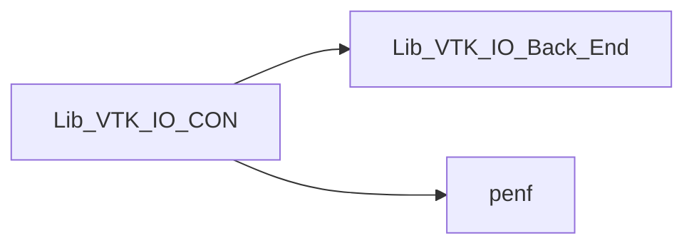

# Lib_VTK_IO_CON

> CON interface definition for Lib_VTK_IO.

**Source**: `src/third_party/VTKFortran/references/legacy/Lib_VTK_IO_CON.f90`

**Dependencies**



## Contents

- [VTK_CON](#vtk-con)

## Functions

### VTK_CON

Function for saving mesh connectivity.

 Function that **must** be used when unstructured grid is used, it saves the connectivity of the unstructured gird.
 @note The vector **connect** must follow the VTK-legacy standard. It is passed as *assumed-shape* array
 because its dimensions is related to the mesh dimensions in a complex way. Its dimensions can be calculated by the following
 equation: \(dc = NC + \sum\limits_{i = 1}^{NC} {nvertex_i }\)
 where \(dc\) is connectivity vector dimension and \(nvertex_i\) is the number of vertices of \(i^{th}\) cell. The VTK-
 legacy standard for the mesh connectivity is quite obscure at least at first sight. It is more simple analyzing an example.
 Suppose we have a mesh composed by 2 cells, one hexahedron (8 vertices) and one pyramid with square basis (5 vertices) and
 suppose that the basis of pyramid is constitute by a face of the hexahedron and so the two cells share 4 vertices.
 The above equation !> gives \(dc=2+8+5=15\). The connectivity vector for this mesh can be:

##### first cell
+ connect(1)  = 8 number of vertices of first cell
+ connect(2)  = 0 identification flag of \(1^\circ\) vertex of first cell
+ connect(3)  = 1 identification flag of \(2^\circ\) vertex of first cell
+ connect(4)  = 2 identification flag of \(3^\circ\) vertex of first cell
+ connect(5)  = 3 identification flag of \(4^\circ\) vertex of first cell
+ connect(6)  = 4 identification flag of \(5^\circ\) vertex of first cell
+ connect(7)  = 5 identification flag of \(6^\circ\) vertex of first cell
+ connect(8)  = 6 identification flag of \(7^\circ\) vertex of first cell
+ connect(9)  = 7 identification flag of \(8^\circ\) vertex of first cell

##### second cell
+ connect(10) = 5 number of vertices of first cell
+ connect(11) = 0 identification flag of \(1^\circ\) vertex of second cell
+ connect(12) = 1 identification flag of \(2^\circ\) vertex of second cell
+ connect(13) = 2 identification flag of \(3^\circ\) vertex of second cell
+ connect(14) = 3 identification flag of \(4^\circ\) vertex of second cell
+ connect(15) = 8 identification flag of \(5^\circ\) vertex of second cell

 Note that the first 4 identification flags of pyramid vertices as the same of the first 4 identification flags of
 the hexahedron because the two cells share this face. It is also important to note that the identification flags start
 form $0$ value: this is impose to the VTK standard. The function VTK_CON does not calculate the connectivity vector: it
 writes the connectivity vector conforming the VTK standard, but does not calculate it.
 The vector variable *cell\_type* must conform the VTK-legacy standard (see the file VTK-Standard at the
 Kitware homepage). It contains the *type* of each cells. For the above example this vector is:

##### first cell
 cell_type(1) = 12 hexahedron type of first cell

##### second cell
 cell_type(2) = 14 pyramid type of second cell

**Returns**: integer(kind=[I4P](/api/src/third_party/PENF/src/lib/penf_global_parameters_variables))

```fortran
function VTK_CON(NC, connect, cell_type, cf) result(E_IO)
```

**Arguments**

| Name | Type | Intent | Attributes | Description |
|------|------|--------|------------|-------------|
| `NC` | integer(kind=[I4P](/api/src/third_party/PENF/src/lib/penf_global_parameters_variables)) | in |  | Number of cells. |
| `connect` | integer(kind=[I4P](/api/src/third_party/PENF/src/lib/penf_global_parameters_variables)) | in |  | Mesh connectivity. |
| `cell_type` | integer(kind=[I4P](/api/src/third_party/PENF/src/lib/penf_global_parameters_variables)) | in |  | VTK cell type. |
| `cf` | integer(kind=[I4P](/api/src/third_party/PENF/src/lib/penf_global_parameters_variables)) | in | optional | Current file index (for concurrent files IO). |
