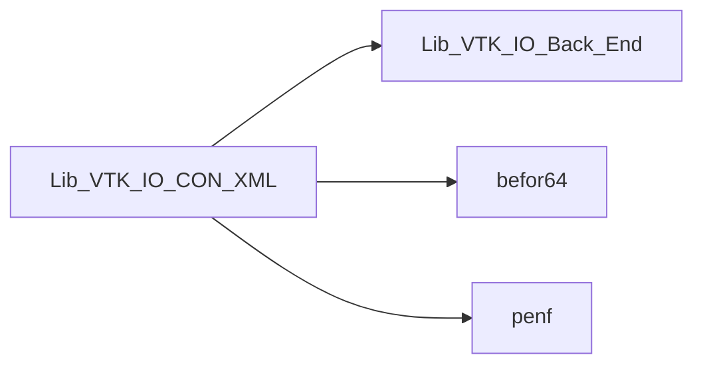
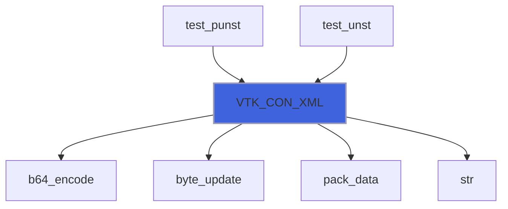

# Lib_VTK_IO_CON_XML

> CON_XML interface definition for Lib_VTK_IO.

**Source**: `src/third_party/VTKFortran/references/legacy/Lib_VTK_IO_CON_XML.f90`

**Dependencies**



## Contents

- [VTK_CON_XML](#vtk-con-xml)

## Functions

### VTK_CON_XML

Function for saving mesh connectivity.

 Function that **must** be used when unstructured grid is used, it saves the connectivity of the unstructured gird.
 @note The vector **connect** must follow the VTK-XML standard. It is passed as *assumed-shape array*
 because its dimensions is related to the mesh dimensions in a complex way. Its dimensions can be calculated by the following
 equation: \(dc = \sum\limits_{i = 1}^{NC} {nvertex_i }\).
 Note that this equation is different from the legacy one. The XML connectivity convention is quite different from the
 legacy standard.
 As an example suppose we have a mesh composed by 2 cells, one hexahedron (8 vertices) and one pyramid with
 square basis (5 vertices) and suppose that the basis of pyramid is constitute by a face of the hexahedron and so the two cells
 share 4 vertices. The above equation gives \(dc=8+5=13\). The connectivity vector for this mesh can be:

##### first cell
+ connect(1)  = 0 identification flag of \(1^\circ\) vertex of first cell
+ connect(2)  = 1 identification flag of \(2^\circ\) vertex of first cell
+ connect(3)  = 2 identification flag of \(3^\circ\) vertex of first cell
+ connect(4)  = 3 identification flag of \(4^\circ\) vertex of first cell
+ connect(5)  = 4 identification flag of \(5^\circ\) vertex of first cell
+ connect(6)  = 5 identification flag of \(6^\circ\) vertex of first cell
+ connect(7)  = 6 identification flag of \(7^\circ\) vertex of first cell
+ connect(8)  = 7 identification flag of \(8^\circ\) vertex of first cell

##### second cell
+ connect(9 ) = 0 identification flag of \(1^\circ\) vertex of second cell
+ connect(10) = 1 identification flag of \(2^\circ\) vertex of second cell
+ connect(11) = 2 identification flag of \(3^\circ\) vertex of second cell
+ connect(12) = 3 identification flag of \(4^\circ\) vertex of second cell
+ connect(13) = 8 identification flag of \(5^\circ\) vertex of second cell

 Therefore this connectivity vector convention is more simple than the legacy convention, now we must create also the
 *offset* vector that contains the data now missing in the *connect* vector. The offset
 vector for this mesh can be:

##### first cell
+ offset(1) = 8  => summ of nodes of \(1^\circ\) cell

##### second cell
+ offset(2) = 13 => summ of nodes of \(1^\circ\) and \(2^\circ\) cells

 The value of every cell-offset can be calculated by the following equation: \(offset_c=\sum\limits_{i=1}^{c}{nvertex_i}\)
 where \(offset_c\) is the value of \(c^{th}\) cell and \(nvertex_i\) is the number of vertices of \(i^{th}\) cell.
 The function VTK_CON_XML does not calculate the connectivity and offset vectors: it writes the connectivity and offset
 vectors conforming the VTK-XML standard, but does not calculate them.
 The vector variable *cell\_type* must conform the VTK-XML standard (see the file VTK-Standard at the
 Kitware homepage) that is the same of the legacy standard. It contains the
 *type* of each cells. For the above example this vector is:

##### first cell
+ cell\_type(1) = 12 hexahedron type of first cell

##### second cell
+ cell\_type(2) = 14 pyramid type of second cell

**Returns**: integer(kind=[I4P](/api/src/third_party/PENF/src/lib/penf_global_parameters_variables))

```fortran
function VTK_CON_XML(NC, connect, offset, cell_type, idx, cf) result(E_IO)
```

**Arguments**

| Name | Type | Intent | Attributes | Description |
|------|------|--------|------------|-------------|
| `NC` | integer(kind=[I4P](/api/src/third_party/PENF/src/lib/penf_global_parameters_variables)) | in |  | Number of cells. |
| `connect` | integer(kind=[I4P](/api/src/third_party/PENF/src/lib/penf_global_parameters_variables)) | in |  | Mesh connectivity. |
| `offset` | integer(kind=[I4P](/api/src/third_party/PENF/src/lib/penf_global_parameters_variables)) | in |  | Cell offset. |
| `cell_type` | integer(kind=[I1P](/api/src/third_party/PENF/src/lib/penf_global_parameters_variables)) | in |  | VTK cell type. |
| `idx` | integer(kind=[I1P](/api/src/third_party/PENF/src/lib/penf_global_parameters_variables)) | in | optional | Id offset to convert Fortran (first id 1) to C (first id 0) standards. |
| `cf` | integer(kind=[I4P](/api/src/third_party/PENF/src/lib/penf_global_parameters_variables)) | in | optional | Current file index (for concurrent files IO). |

**Call graph**


