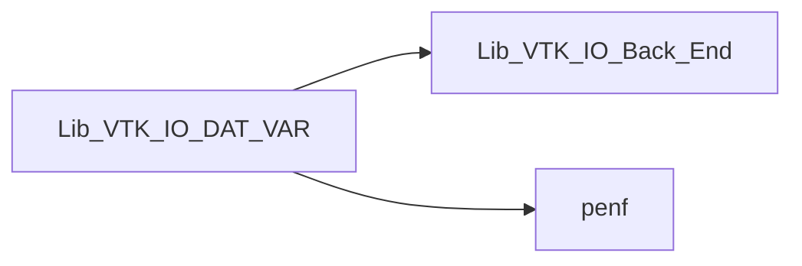
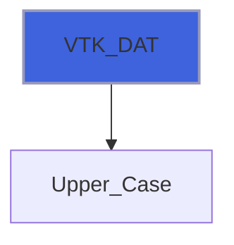
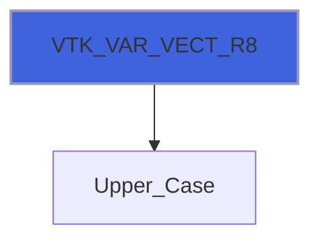

# Lib_VTK_IO_DAT_VAR

> DAT and VAR interface definitions for Lib_VTK_IO.

**Source**: `src/third_party/VTKFortran/references/legacy/Lib_VTK_IO_DAT_VAR.f90`

**Dependencies**



## Contents

- [VTK_VAR](#vtk-var)
- [VTK_DAT](#vtk-dat)
- [VTK_VAR_SCAL_R8](#vtk-var-scal-r8)
- [VTK_VAR_SCAL_R4](#vtk-var-scal-r4)
- [VTK_VAR_SCAL_I4](#vtk-var-scal-i4)
- [VTK_VAR_VECT_R8](#vtk-var-vect-r8)
- [VTK_VAR_VECT_R4](#vtk-var-vect-r4)
- [VTK_VAR_VECT_I4](#vtk-var-vect-i4)
- [VTK_VAR_TEXT_R8](#vtk-var-text-r8)
- [VTK_VAR_TEXT_R4](#vtk-var-text-r4)

## Interfaces

### VTK_VAR

Procedure for saving data variable(s) in VTK-legacy standard.

 VTK_VAR is an interface to 8 different functions, there are 3 functions for scalar variables, 3 functions for vectorial
 variables and 2 functions texture variables: scalar and vectorial data can be R8P, R4P and I4P data while texture variables can
 be only R8P or R4P. This function saves the data variables related to geometric mesh.
 @note The inputs that must be passed change depending on the data
 variables type.

### Examples of usage

#### Scalar data calling
```fortran
 integer(I4P):: NN
 real(R4P)::    var(1:NN)
 ...
 E_IO=VTK_VAR(NN,'Sca',var)
 ...
```

#### Vectorial data calling
```fortran
 integer(I4P):: NN
 real(R4P)::    varX(1:NN),varY(1:NN),varZ(1:NN)
 ...
 E_IO=VTK_VAR('vect',NN,'Vec',varX,varY,varZ)
 ...
```

**Module procedures**: [`VTK_VAR_SCAL_R8`](/api/src/third_party/VTKFortran/references/legacy/Lib_VTK_IO_DAT_VAR#vtk-var-scal-r8), [`VTK_VAR_SCAL_R4`](/api/src/third_party/VTKFortran/references/legacy/Lib_VTK_IO_DAT_VAR#vtk-var-scal-r4), [`VTK_VAR_SCAL_I4`](/api/src/third_party/VTKFortran/references/legacy/Lib_VTK_IO_DAT_VAR#vtk-var-scal-i4), [`VTK_VAR_VECT_R8`](/api/src/third_party/VTKFortran/references/legacy/Lib_VTK_IO_DAT_VAR#vtk-var-vect-r8), [`VTK_VAR_VECT_R4`](/api/src/third_party/VTKFortran/references/legacy/Lib_VTK_IO_DAT_VAR#vtk-var-vect-r4), [`VTK_VAR_VECT_I4`](/api/src/third_party/VTKFortran/references/legacy/Lib_VTK_IO_DAT_VAR#vtk-var-vect-i4), [`VTK_VAR_TEXT_R8`](/api/src/third_party/VTKFortran/references/legacy/Lib_VTK_IO_DAT_VAR#vtk-var-text-r8), [`VTK_VAR_TEXT_R4`](/api/src/third_party/VTKFortran/references/legacy/Lib_VTK_IO_DAT_VAR#vtk-var-text-r4)

## Functions

### VTK_DAT

Function for initializing/finalizing the saving of data associated to the mesh.

 Function that **must** be called before saving the data related to geometric mesh, this function initializes the
 saving of data variables indicating the *type* (node or cell centered) of variables that will be saved.
 @note A single file can contain both cell and node centered variables. In this case the VTK_DAT function must be
 called two times, before saving cell-centered variables and before saving node-centered variables.

### Examples of usage

#### Saving node data
```fortran
 E_IO=VTK_DAT_XML(50,'node')
```

#### Saving cell data
```fortran
 E_IO=VTK_DAT_XML(50,'cell')
```

**Returns**: integer(kind=[I4P](/api/src/third_party/PENF/src/lib/penf_global_parameters_variables))

```fortran
function VTK_DAT(NC_NN, var_location, cf) result(E_IO)
```

**Arguments**

| Name | Type | Intent | Attributes | Description |
|------|------|--------|------------|-------------|
| `NC_NN` | integer(kind=[I4P](/api/src/third_party/PENF/src/lib/penf_global_parameters_variables)) | in |  | Number of cells or nodes of field. |
| `var_location` | character(len=*) | in |  | Location of saving variables: cell for cell-centered, node for node-centered. |
| `cf` | integer(kind=[I4P](/api/src/third_party/PENF/src/lib/penf_global_parameters_variables)) | in | optional | Current file index (for concurrent files IO). |

**Call graph**



### VTK_VAR_SCAL_R8

Function for saving field of scalar variable (R8P).

**Returns**: integer(kind=[I4P](/api/src/third_party/PENF/src/lib/penf_global_parameters_variables))

```fortran
function VTK_VAR_SCAL_R8(NC_NN, varname, var, cf) result(E_IO)
```

**Arguments**

| Name | Type | Intent | Attributes | Description |
|------|------|--------|------------|-------------|
| `NC_NN` | integer(kind=[I4P](/api/src/third_party/PENF/src/lib/penf_global_parameters_variables)) | in |  | Number of nodes or cells. |
| `varname` | character(len=*) | in |  | Variable name. |
| `var` | real(kind=[R8P](/api/src/third_party/PENF/src/lib/penf_global_parameters_variables)) | in |  | Variable to be saved. |
| `cf` | integer(kind=[I4P](/api/src/third_party/PENF/src/lib/penf_global_parameters_variables)) | in | optional | Current file index (for concurrent files IO). |

### VTK_VAR_SCAL_R4

Function for saving field of scalar variable (R4P).

**Returns**: integer(kind=[I4P](/api/src/third_party/PENF/src/lib/penf_global_parameters_variables))

```fortran
function VTK_VAR_SCAL_R4(NC_NN, varname, var, cf) result(E_IO)
```

**Arguments**

| Name | Type | Intent | Attributes | Description |
|------|------|--------|------------|-------------|
| `NC_NN` | integer(kind=[I4P](/api/src/third_party/PENF/src/lib/penf_global_parameters_variables)) | in |  | Number of nodes or cells. |
| `varname` | character(len=*) | in |  | Variable name. |
| `var` | real(kind=[R4P](/api/src/third_party/PENF/src/lib/penf_global_parameters_variables)) | in |  | Variable to be saved. |
| `cf` | integer(kind=[I4P](/api/src/third_party/PENF/src/lib/penf_global_parameters_variables)) | in | optional | Current file index (for concurrent files IO). |

### VTK_VAR_SCAL_I4

Function for saving field of scalar variable (I4P).

**Returns**: integer(kind=[I4P](/api/src/third_party/PENF/src/lib/penf_global_parameters_variables))

```fortran
function VTK_VAR_SCAL_I4(NC_NN, varname, var, cf) result(E_IO)
```

**Arguments**

| Name | Type | Intent | Attributes | Description |
|------|------|--------|------------|-------------|
| `NC_NN` | integer(kind=[I4P](/api/src/third_party/PENF/src/lib/penf_global_parameters_variables)) | in |  | Number of nodes or cells. |
| `varname` | character(len=*) | in |  | Variable name. |
| `var` | integer(kind=[I4P](/api/src/third_party/PENF/src/lib/penf_global_parameters_variables)) | in |  | Variable to be saved. |
| `cf` | integer(kind=[I4P](/api/src/third_party/PENF/src/lib/penf_global_parameters_variables)) | in | optional | Current file index (for concurrent files IO). |

### VTK_VAR_VECT_R8

Function for saving field of vectorial variable (R8P).

**Returns**: integer(kind=[I4P](/api/src/third_party/PENF/src/lib/penf_global_parameters_variables))

```fortran
function VTK_VAR_VECT_R8(vec_type, NC_NN, varname, varX, varY, varZ, cf) result(E_IO)
```

**Arguments**

| Name | Type | Intent | Attributes | Description |
|------|------|--------|------------|-------------|
| `vec_type` | character(len=*) | in |  | Vector type: vect = generic vector , norm = normal vector. |
| `NC_NN` | integer(kind=[I4P](/api/src/third_party/PENF/src/lib/penf_global_parameters_variables)) | in |  | Number of nodes or cells. |
| `varname` | character(len=*) | in |  | Variable name. |
| `varX` | real(kind=[R8P](/api/src/third_party/PENF/src/lib/penf_global_parameters_variables)) | in |  | X component of vector. |
| `varY` | real(kind=[R8P](/api/src/third_party/PENF/src/lib/penf_global_parameters_variables)) | in |  | Y component of vector. |
| `varZ` | real(kind=[R8P](/api/src/third_party/PENF/src/lib/penf_global_parameters_variables)) | in |  | Z component of vector. |
| `cf` | integer(kind=[I4P](/api/src/third_party/PENF/src/lib/penf_global_parameters_variables)) | in | optional | Current file index (for concurrent files IO). |

**Call graph**



### VTK_VAR_VECT_R4

Function for saving field of vectorial variable (R4P).

**Returns**: integer(kind=[I4P](/api/src/third_party/PENF/src/lib/penf_global_parameters_variables))

```fortran
function VTK_VAR_VECT_R4(vec_type, NC_NN, varname, varX, varY, varZ, cf) result(E_IO)
```

**Arguments**

| Name | Type | Intent | Attributes | Description |
|------|------|--------|------------|-------------|
| `vec_type` | character(len=*) | in |  | Vector type: vect = generic vector , norm = normal vector. |
| `NC_NN` | integer(kind=[I4P](/api/src/third_party/PENF/src/lib/penf_global_parameters_variables)) | in |  | Number of nodes or cells. |
| `varname` | character(len=*) | in |  | Variable name. |
| `varX` | real(kind=[R4P](/api/src/third_party/PENF/src/lib/penf_global_parameters_variables)) | in |  | X component of vector. |
| `varY` | real(kind=[R4P](/api/src/third_party/PENF/src/lib/penf_global_parameters_variables)) | in |  | Y component of vector. |
| `varZ` | real(kind=[R4P](/api/src/third_party/PENF/src/lib/penf_global_parameters_variables)) | in |  | Z component of vector. |
| `cf` | integer(kind=[I4P](/api/src/third_party/PENF/src/lib/penf_global_parameters_variables)) | in | optional | Current file index (for concurrent files IO). |

**Call graph**


### VTK_VAR_VECT_I4

Function for saving field of vectorial variable (I4P).

**Returns**: integer(kind=[I4P](/api/src/third_party/PENF/src/lib/penf_global_parameters_variables))

```fortran
function VTK_VAR_VECT_I4(NC_NN, varname, varX, varY, varZ, cf) result(E_IO)
```

**Arguments**

| Name | Type | Intent | Attributes | Description |
|------|------|--------|------------|-------------|
| `NC_NN` | integer(kind=[I4P](/api/src/third_party/PENF/src/lib/penf_global_parameters_variables)) | in |  | Number of nodes or cells. |
| `varname` | character(len=*) | in |  | Variable name. |
| `varX` | integer(kind=[I4P](/api/src/third_party/PENF/src/lib/penf_global_parameters_variables)) | in |  | X component of vector. |
| `varY` | integer(kind=[I4P](/api/src/third_party/PENF/src/lib/penf_global_parameters_variables)) | in |  | Y component of vector. |
| `varZ` | integer(kind=[I4P](/api/src/third_party/PENF/src/lib/penf_global_parameters_variables)) | in |  | Z component of vector. |
| `cf` | integer(kind=[I4P](/api/src/third_party/PENF/src/lib/penf_global_parameters_variables)) | in | optional | Current file index (for concurrent files IO). |

### VTK_VAR_TEXT_R8

Function for saving texture variable (R8P).

**Returns**: integer(kind=[I4P](/api/src/third_party/PENF/src/lib/penf_global_parameters_variables))

```fortran
function VTK_VAR_TEXT_R8(NC_NN, dimm, varname, textCoo, cf) result(E_IO)
```

**Arguments**

| Name | Type | Intent | Attributes | Description |
|------|------|--------|------------|-------------|
| `NC_NN` | integer(kind=[I4P](/api/src/third_party/PENF/src/lib/penf_global_parameters_variables)) | in |  | Number of nodes or cells. |
| `dimm` | integer(kind=[I4P](/api/src/third_party/PENF/src/lib/penf_global_parameters_variables)) | in |  | Texture dimensions. |
| `varname` | character(len=*) | in |  | Variable name. |
| `textCoo` | real(kind=[R8P](/api/src/third_party/PENF/src/lib/penf_global_parameters_variables)) | in |  | Texture. |
| `cf` | integer(kind=[I4P](/api/src/third_party/PENF/src/lib/penf_global_parameters_variables)) | in | optional | Current file index (for concurrent files IO). |

### VTK_VAR_TEXT_R4

Function for saving texture variable (R4P).

**Returns**: integer(kind=[I4P](/api/src/third_party/PENF/src/lib/penf_global_parameters_variables))

```fortran
function VTK_VAR_TEXT_R4(NC_NN, dimm, varname, textCoo, cf) result(E_IO)
```

**Arguments**

| Name | Type | Intent | Attributes | Description |
|------|------|--------|------------|-------------|
| `NC_NN` | integer(kind=[I4P](/api/src/third_party/PENF/src/lib/penf_global_parameters_variables)) | in |  | Number of nodes or cells. |
| `dimm` | integer(kind=[I4P](/api/src/third_party/PENF/src/lib/penf_global_parameters_variables)) | in |  | Texture dimensions. |
| `varname` | character(len=*) | in |  | Variable name. |
| `textCoo` | real(kind=[R4P](/api/src/third_party/PENF/src/lib/penf_global_parameters_variables)) | in |  | Texture. |
| `cf` | integer(kind=[I4P](/api/src/third_party/PENF/src/lib/penf_global_parameters_variables)) | in | optional | Current file index (for concurrent files IO). |
