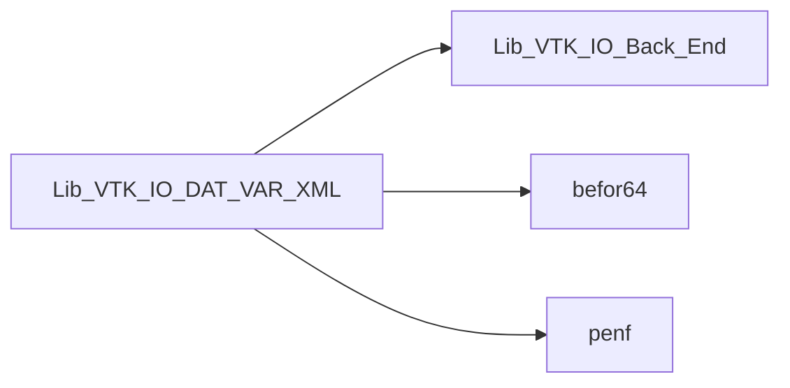
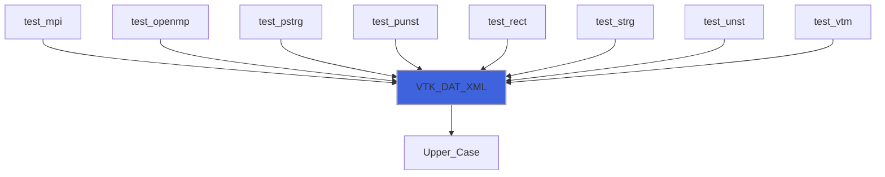
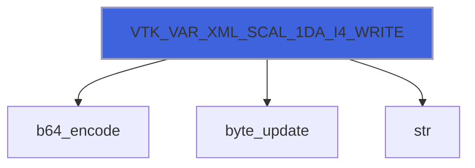
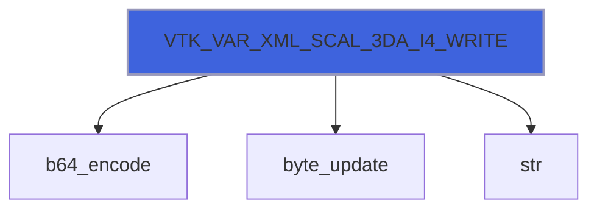
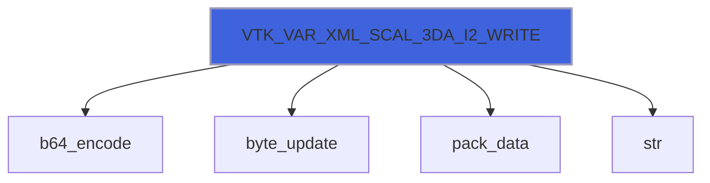
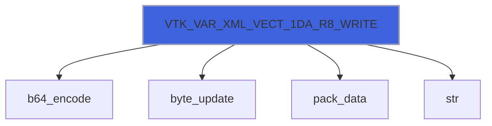

# Lib_VTK_IO_DAT_VAR_XML

> DAT_XML and VAR_XML interface definitions for Lib_VTK_IO.

**Source**: `src/third_party/VTKFortran/references/legacy/Lib_VTK_IO_DAT_VAR_XML.f90`

**Dependencies**



## Contents

- [VTK_VAR_XML_WRITE](#vtk-var-xml-write)
- [VTK_VAR_XML_READ](#vtk-var-xml-read)
- [VTK_DAT_XML](#vtk-dat-xml)
- [VTK_VAR_XML_SCAL_1DA_R8_WRITE](#vtk-var-xml-scal-1da-r8-write)
- [VTK_VAR_XML_SCAL_3DA_R8_WRITE](#vtk-var-xml-scal-3da-r8-write)
- [VTK_VAR_XML_SCAL_1DA_R4_WRITE](#vtk-var-xml-scal-1da-r4-write)
- [VTK_VAR_XML_SCAL_3DA_R4_WRITE](#vtk-var-xml-scal-3da-r4-write)
- [VTK_VAR_XML_SCAL_1DA_I8_WRITE](#vtk-var-xml-scal-1da-i8-write)
- [VTK_VAR_XML_SCAL_3DA_I8_WRITE](#vtk-var-xml-scal-3da-i8-write)
- [VTK_VAR_XML_SCAL_1DA_I4_WRITE](#vtk-var-xml-scal-1da-i4-write)
- [VTK_VAR_XML_SCAL_3DA_I4_WRITE](#vtk-var-xml-scal-3da-i4-write)
- [VTK_VAR_XML_SCAL_1DA_I2_WRITE](#vtk-var-xml-scal-1da-i2-write)
- [VTK_VAR_XML_SCAL_3DA_I2_WRITE](#vtk-var-xml-scal-3da-i2-write)
- [VTK_VAR_XML_SCAL_1DA_I1_WRITE](#vtk-var-xml-scal-1da-i1-write)
- [VTK_VAR_XML_SCAL_3DA_I1_WRITE](#vtk-var-xml-scal-3da-i1-write)
- [VTK_VAR_XML_VECT_1DA_R8_WRITE](#vtk-var-xml-vect-1da-r8-write)
- [VTK_VAR_XML_VECT_3DA_R8_WRITE](#vtk-var-xml-vect-3da-r8-write)
- [VTK_VAR_XML_VECT_1DA_R4_WRITE](#vtk-var-xml-vect-1da-r4-write)
- [VTK_VAR_XML_VECT_3DA_R4_WRITE](#vtk-var-xml-vect-3da-r4-write)
- [VTK_VAR_XML_VECT_1DA_I8_WRITE](#vtk-var-xml-vect-1da-i8-write)
- [VTK_VAR_XML_VECT_3DA_I8_WRITE](#vtk-var-xml-vect-3da-i8-write)
- [VTK_VAR_XML_VECT_1DA_I4_WRITE](#vtk-var-xml-vect-1da-i4-write)
- [VTK_VAR_XML_VECT_3DA_I4_WRITE](#vtk-var-xml-vect-3da-i4-write)
- [VTK_VAR_XML_VECT_1DA_I2_WRITE](#vtk-var-xml-vect-1da-i2-write)
- [VTK_VAR_XML_VECT_3DA_I2_WRITE](#vtk-var-xml-vect-3da-i2-write)
- [VTK_VAR_XML_VECT_1DA_I1_WRITE](#vtk-var-xml-vect-1da-i1-write)
- [VTK_VAR_XML_VECT_3DA_I1_WRITE](#vtk-var-xml-vect-3da-i1-write)
- [VTK_VAR_XML_LIST_1DA_R8_WRITE](#vtk-var-xml-list-1da-r8-write)
- [VTK_VAR_XML_LIST_3DA_R8_WRITE](#vtk-var-xml-list-3da-r8-write)
- [VTK_VAR_XML_LIST_1DA_R4_WRITE](#vtk-var-xml-list-1da-r4-write)
- [VTK_VAR_XML_LIST_3DA_R4_WRITE](#vtk-var-xml-list-3da-r4-write)
- [VTK_VAR_XML_LIST_1DA_I8_WRITE](#vtk-var-xml-list-1da-i8-write)
- [VTK_VAR_XML_LIST_3DA_I8_WRITE](#vtk-var-xml-list-3da-i8-write)
- [VTK_VAR_XML_LIST_1DA_I4_WRITE](#vtk-var-xml-list-1da-i4-write)
- [VTK_VAR_XML_LIST_3DA_I4_WRITE](#vtk-var-xml-list-3da-i4-write)
- [VTK_VAR_XML_LIST_1DA_I2_WRITE](#vtk-var-xml-list-1da-i2-write)
- [VTK_VAR_XML_LIST_3DA_I2_WRITE](#vtk-var-xml-list-3da-i2-write)
- [VTK_VAR_XML_LIST_1DA_I1_WRITE](#vtk-var-xml-list-1da-i1-write)
- [VTK_VAR_XML_LIST_3DA_I1_WRITE](#vtk-var-xml-list-3da-i1-write)
- [VTK_VAR_XML_HEADER_READ](#vtk-var-xml-header-read)
- [VTK_VAR_XML_SCAL_1DA_R8_READ](#vtk-var-xml-scal-1da-r8-read)
- [VTK_VAR_XML_SCAL_1DA_R4_READ](#vtk-var-xml-scal-1da-r4-read)
- [VTK_VAR_XML_SCAL_1DA_I8_READ](#vtk-var-xml-scal-1da-i8-read)
- [VTK_VAR_XML_SCAL_1DA_I4_READ](#vtk-var-xml-scal-1da-i4-read)
- [VTK_VAR_XML_SCAL_1DA_I2_READ](#vtk-var-xml-scal-1da-i2-read)
- [VTK_VAR_XML_SCAL_1DA_I1_READ](#vtk-var-xml-scal-1da-i1-read)
- [VTK_VAR_XML_VECT_1DA_R8_READ](#vtk-var-xml-vect-1da-r8-read)
- [VTK_VAR_XML_VECT_1DA_R4_READ](#vtk-var-xml-vect-1da-r4-read)
- [VTK_VAR_XML_VECT_1DA_I8_READ](#vtk-var-xml-vect-1da-i8-read)
- [VTK_VAR_XML_VECT_1DA_I4_READ](#vtk-var-xml-vect-1da-i4-read)
- [VTK_VAR_XML_VECT_1DA_I2_READ](#vtk-var-xml-vect-1da-i2-read)
- [VTK_VAR_XML_VECT_1DA_I1_READ](#vtk-var-xml-vect-1da-i1-read)
- [VTK_VAR_XML_LIST_1DA_R8_READ](#vtk-var-xml-list-1da-r8-read)
- [VTK_VAR_XML_LIST_1DA_R4_READ](#vtk-var-xml-list-1da-r4-read)
- [VTK_VAR_XML_LIST_1DA_I8_READ](#vtk-var-xml-list-1da-i8-read)
- [VTK_VAR_XML_LIST_1DA_I4_READ](#vtk-var-xml-list-1da-i4-read)
- [VTK_VAR_XML_LIST_1DA_I2_READ](#vtk-var-xml-list-1da-i2-read)
- [VTK_VAR_XML_LIST_1DA_I1_READ](#vtk-var-xml-list-1da-i1-read)
- [VTK_VAR_XML_SCAL_3DA_R8_READ](#vtk-var-xml-scal-3da-r8-read)
- [VTK_VAR_XML_SCAL_3DA_R4_READ](#vtk-var-xml-scal-3da-r4-read)
- [VTK_VAR_XML_SCAL_3DA_I8_READ](#vtk-var-xml-scal-3da-i8-read)
- [VTK_VAR_XML_SCAL_3DA_I4_READ](#vtk-var-xml-scal-3da-i4-read)
- [VTK_VAR_XML_SCAL_3DA_I2_READ](#vtk-var-xml-scal-3da-i2-read)
- [VTK_VAR_XML_SCAL_3DA_I1_READ](#vtk-var-xml-scal-3da-i1-read)
- [VTK_VAR_XML_VECT_3DA_R8_READ](#vtk-var-xml-vect-3da-r8-read)
- [VTK_VAR_XML_VECT_3DA_R4_READ](#vtk-var-xml-vect-3da-r4-read)
- [VTK_VAR_XML_VECT_3DA_I8_READ](#vtk-var-xml-vect-3da-i8-read)
- [VTK_VAR_XML_VECT_3DA_I4_READ](#vtk-var-xml-vect-3da-i4-read)
- [VTK_VAR_XML_VECT_3DA_I2_READ](#vtk-var-xml-vect-3da-i2-read)
- [VTK_VAR_XML_VECT_3DA_I1_READ](#vtk-var-xml-vect-3da-i1-read)
- [VTK_VAR_XML_LIST_3DA_R8_READ](#vtk-var-xml-list-3da-r8-read)
- [VTK_VAR_XML_LIST_3DA_R4_READ](#vtk-var-xml-list-3da-r4-read)
- [VTK_VAR_XML_LIST_3DA_I8_READ](#vtk-var-xml-list-3da-i8-read)
- [VTK_VAR_XML_LIST_3DA_I4_READ](#vtk-var-xml-list-3da-i4-read)
- [VTK_VAR_XML_LIST_3DA_I2_READ](#vtk-var-xml-list-3da-i2-read)
- [VTK_VAR_XML_LIST_3DA_I1_READ](#vtk-var-xml-list-3da-i1-read)

## Interfaces

### VTK_VAR_XML_WRITE

Save data variable(s) in VTK-XML standard.

 VTK_VAR_XML is an interface to 36 different functions, there are 6 functions for scalar variables, 6 functions for vectorial
 variables and 6 functions for 3D(or higher) vectorial variables: for all of types the precision can be R8P, R4P, I8P, I4P, I2P
 and I1P. This function saves the data variables related (cell-centered or node-centered) to geometric mesh.
 1D/3D-rank arrays and packed API for any kinds
 The inputs arrays can be passed as 1D-rank or 3D-rank and the vectorial variables can be component-separated (one for each of
 the 3 components) or packed into one multidimensional array:

- scalar input:
    - input is 1D-rank array: var[1:NC_NN];
    - input is 3D-rank array: var[nx1:nx2,ny1:ny2,nz1:nz2];
- vectorial inputs:
    - inputs are 1D-rank arrays: varX[1:NC_NN],varY[1:NC_NN],varZ[1:NC_NN];
    - inputs are 3D-rank arrays: varX[nx1:nx2,ny1:ny2,nz1:nz2],varY[nx1:nx2,ny1:ny2,nz1:nz2],varX[nx1:nx2,ny1:ny2,nz1:nz2];
- 3D(or higher) vectorial inputs:
    - input is 1D-rank (packed API): var[1:N_COL,1:NC_NN];
    - input is 3D-rank (packed API): var[1:N_COL,nx1:nx2,ny1:ny2,nz1:nz2].

 @note Note that the inputs that must be passed change depending on the data variables type.

### Examples of usage

#### Scalar data calling
```fortran
 integer(I4P):: NN
 real(R8P)::    var(1:NN)
 ...
 E_IO=VTK_VAR_XML(NN,'Sca',var)
 ...
```

#### Vectorial data calling
```fortran
 integer(I4P):: NN
 real(R8P)::    varX(1:NN),varY(1:NN),varZ(1:NN),
 ...
 E_IO=VTK_VAR_XML(NN,'Vec',varX,varY,varZ)
 ...
```

**Module procedures**: [`VTK_VAR_XML_SCAL_1DA_R8_WRITE`](/api/src/third_party/VTKFortran/references/legacy/Lib_VTK_IO_DAT_VAR_XML#vtk-var-xml-scal-1da-r8-write), [`VTK_VAR_XML_SCAL_3DA_R8_WRITE`](/api/src/third_party/VTKFortran/references/legacy/Lib_VTK_IO_DAT_VAR_XML#vtk-var-xml-scal-3da-r8-write), [`VTK_VAR_XML_SCAL_1DA_R4_WRITE`](/api/src/third_party/VTKFortran/references/legacy/Lib_VTK_IO_DAT_VAR_XML#vtk-var-xml-scal-1da-r4-write), [`VTK_VAR_XML_SCAL_3DA_R4_WRITE`](/api/src/third_party/VTKFortran/references/legacy/Lib_VTK_IO_DAT_VAR_XML#vtk-var-xml-scal-3da-r4-write), [`VTK_VAR_XML_SCAL_1DA_I8_WRITE`](/api/src/third_party/VTKFortran/references/legacy/Lib_VTK_IO_DAT_VAR_XML#vtk-var-xml-scal-1da-i8-write), [`VTK_VAR_XML_SCAL_3DA_I8_WRITE`](/api/src/third_party/VTKFortran/references/legacy/Lib_VTK_IO_DAT_VAR_XML#vtk-var-xml-scal-3da-i8-write), [`VTK_VAR_XML_SCAL_1DA_I4_WRITE`](/api/src/third_party/VTKFortran/references/legacy/Lib_VTK_IO_DAT_VAR_XML#vtk-var-xml-scal-1da-i4-write), [`VTK_VAR_XML_SCAL_3DA_I4_WRITE`](/api/src/third_party/VTKFortran/references/legacy/Lib_VTK_IO_DAT_VAR_XML#vtk-var-xml-scal-3da-i4-write), [`VTK_VAR_XML_SCAL_1DA_I2_WRITE`](/api/src/third_party/VTKFortran/references/legacy/Lib_VTK_IO_DAT_VAR_XML#vtk-var-xml-scal-1da-i2-write), [`VTK_VAR_XML_SCAL_3DA_I2_WRITE`](/api/src/third_party/VTKFortran/references/legacy/Lib_VTK_IO_DAT_VAR_XML#vtk-var-xml-scal-3da-i2-write), [`VTK_VAR_XML_SCAL_1DA_I1_WRITE`](/api/src/third_party/VTKFortran/references/legacy/Lib_VTK_IO_DAT_VAR_XML#vtk-var-xml-scal-1da-i1-write), [`VTK_VAR_XML_SCAL_3DA_I1_WRITE`](/api/src/third_party/VTKFortran/references/legacy/Lib_VTK_IO_DAT_VAR_XML#vtk-var-xml-scal-3da-i1-write), [`VTK_VAR_XML_VECT_1DA_R8_WRITE`](/api/src/third_party/VTKFortran/references/legacy/Lib_VTK_IO_DAT_VAR_XML#vtk-var-xml-vect-1da-r8-write), [`VTK_VAR_XML_VECT_3DA_R8_WRITE`](/api/src/third_party/VTKFortran/references/legacy/Lib_VTK_IO_DAT_VAR_XML#vtk-var-xml-vect-3da-r8-write), [`VTK_VAR_XML_VECT_1DA_R4_WRITE`](/api/src/third_party/VTKFortran/references/legacy/Lib_VTK_IO_DAT_VAR_XML#vtk-var-xml-vect-1da-r4-write), [`VTK_VAR_XML_VECT_3DA_R4_WRITE`](/api/src/third_party/VTKFortran/references/legacy/Lib_VTK_IO_DAT_VAR_XML#vtk-var-xml-vect-3da-r4-write), [`VTK_VAR_XML_VECT_1DA_I8_WRITE`](/api/src/third_party/VTKFortran/references/legacy/Lib_VTK_IO_DAT_VAR_XML#vtk-var-xml-vect-1da-i8-write), [`VTK_VAR_XML_VECT_3DA_I8_WRITE`](/api/src/third_party/VTKFortran/references/legacy/Lib_VTK_IO_DAT_VAR_XML#vtk-var-xml-vect-3da-i8-write), [`VTK_VAR_XML_VECT_1DA_I4_WRITE`](/api/src/third_party/VTKFortran/references/legacy/Lib_VTK_IO_DAT_VAR_XML#vtk-var-xml-vect-1da-i4-write), [`VTK_VAR_XML_VECT_3DA_I4_WRITE`](/api/src/third_party/VTKFortran/references/legacy/Lib_VTK_IO_DAT_VAR_XML#vtk-var-xml-vect-3da-i4-write), [`VTK_VAR_XML_VECT_1DA_I2_WRITE`](/api/src/third_party/VTKFortran/references/legacy/Lib_VTK_IO_DAT_VAR_XML#vtk-var-xml-vect-1da-i2-write), [`VTK_VAR_XML_VECT_3DA_I2_WRITE`](/api/src/third_party/VTKFortran/references/legacy/Lib_VTK_IO_DAT_VAR_XML#vtk-var-xml-vect-3da-i2-write), [`VTK_VAR_XML_VECT_1DA_I1_WRITE`](/api/src/third_party/VTKFortran/references/legacy/Lib_VTK_IO_DAT_VAR_XML#vtk-var-xml-vect-1da-i1-write), [`VTK_VAR_XML_VECT_3DA_I1_WRITE`](/api/src/third_party/VTKFortran/references/legacy/Lib_VTK_IO_DAT_VAR_XML#vtk-var-xml-vect-3da-i1-write), [`VTK_VAR_XML_LIST_1DA_R8_WRITE`](/api/src/third_party/VTKFortran/references/legacy/Lib_VTK_IO_DAT_VAR_XML#vtk-var-xml-list-1da-r8-write), [`VTK_VAR_XML_LIST_3DA_R8_WRITE`](/api/src/third_party/VTKFortran/references/legacy/Lib_VTK_IO_DAT_VAR_XML#vtk-var-xml-list-3da-r8-write), [`VTK_VAR_XML_LIST_1DA_R4_WRITE`](/api/src/third_party/VTKFortran/references/legacy/Lib_VTK_IO_DAT_VAR_XML#vtk-var-xml-list-1da-r4-write), [`VTK_VAR_XML_LIST_3DA_R4_WRITE`](/api/src/third_party/VTKFortran/references/legacy/Lib_VTK_IO_DAT_VAR_XML#vtk-var-xml-list-3da-r4-write), [`VTK_VAR_XML_LIST_1DA_I8_WRITE`](/api/src/third_party/VTKFortran/references/legacy/Lib_VTK_IO_DAT_VAR_XML#vtk-var-xml-list-1da-i8-write), [`VTK_VAR_XML_LIST_3DA_I8_WRITE`](/api/src/third_party/VTKFortran/references/legacy/Lib_VTK_IO_DAT_VAR_XML#vtk-var-xml-list-3da-i8-write), [`VTK_VAR_XML_LIST_1DA_I4_WRITE`](/api/src/third_party/VTKFortran/references/legacy/Lib_VTK_IO_DAT_VAR_XML#vtk-var-xml-list-1da-i4-write), [`VTK_VAR_XML_LIST_3DA_I4_WRITE`](/api/src/third_party/VTKFortran/references/legacy/Lib_VTK_IO_DAT_VAR_XML#vtk-var-xml-list-3da-i4-write), [`VTK_VAR_XML_LIST_1DA_I2_WRITE`](/api/src/third_party/VTKFortran/references/legacy/Lib_VTK_IO_DAT_VAR_XML#vtk-var-xml-list-1da-i2-write), [`VTK_VAR_XML_LIST_3DA_I2_WRITE`](/api/src/third_party/VTKFortran/references/legacy/Lib_VTK_IO_DAT_VAR_XML#vtk-var-xml-list-3da-i2-write), [`VTK_VAR_XML_LIST_1DA_I1_WRITE`](/api/src/third_party/VTKFortran/references/legacy/Lib_VTK_IO_DAT_VAR_XML#vtk-var-xml-list-1da-i1-write), [`VTK_VAR_XML_LIST_3DA_I1_WRITE`](/api/src/third_party/VTKFortran/references/legacy/Lib_VTK_IO_DAT_VAR_XML#vtk-var-xml-list-3da-i1-write)

### VTK_VAR_XML_READ

Load data variable(s) in VTK-XML standard.

 VTK_VAR_XML is an interface to 36 different functions, there are 6 functions for scalar variables, 6 functions for vectorial
 variables and 6 functions for 3D(or higher) vectorial variables: for all of types the precision can be R8P, R4P, I8P, I4P, I2P
 and I1P. This function saves the data variables related (cell-centered or node-centered) to geometric mesh.
 1D/3D-rank arrays and packed API for any kinds
 The output arrays can be passed as 1D-rank or 3D-rank and the vectorial variables can be component-separated (one for each of
 the 3 components) or packed into one multidimensional array:

- scalar output:
    - output is 1D-rank array: var[1:NC_NN];
    - output is 3D-rank array: var[nx1:nx2,ny1:ny2,nz1:nz2];
- vectorial output:
    - output are 1D-rank arrays: varX[1:NC_NN],varY[1:NC_NN],varZ[1:NC_NN];
    - output are 3D-rank arrays: varX[nx1:nx2,ny1:ny2,nz1:nz2],varY[nx1:nx2,ny1:ny2,nz1:nz2],varX[nx1:nx2,ny1:ny2,nz1:nz2];
- 3D(or higher) vectorial inputs:
    - output is 1D-rank (packed API): var[1:N_COL,1:NC_NN];
    - output is 3D-rank (packed API): var[1:N_COL,nx1:nx2,ny1:ny2,nz1:nz2].

 @note Note that the output that must be passed change depending on the data variables type.

**Module procedures**: [`VTK_VAR_XML_SCAL_1DA_R8_READ`](/api/src/third_party/VTKFortran/references/legacy/Lib_VTK_IO_DAT_VAR_XML#vtk-var-xml-scal-1da-r8-read), [`VTK_VAR_XML_SCAL_3DA_R8_READ`](/api/src/third_party/VTKFortran/references/legacy/Lib_VTK_IO_DAT_VAR_XML#vtk-var-xml-scal-3da-r8-read), [`VTK_VAR_XML_SCAL_1DA_R4_READ`](/api/src/third_party/VTKFortran/references/legacy/Lib_VTK_IO_DAT_VAR_XML#vtk-var-xml-scal-1da-r4-read), [`VTK_VAR_XML_SCAL_3DA_R4_READ`](/api/src/third_party/VTKFortran/references/legacy/Lib_VTK_IO_DAT_VAR_XML#vtk-var-xml-scal-3da-r4-read), [`VTK_VAR_XML_SCAL_1DA_I8_READ`](/api/src/third_party/VTKFortran/references/legacy/Lib_VTK_IO_DAT_VAR_XML#vtk-var-xml-scal-1da-i8-read), [`VTK_VAR_XML_SCAL_3DA_I8_READ`](/api/src/third_party/VTKFortran/references/legacy/Lib_VTK_IO_DAT_VAR_XML#vtk-var-xml-scal-3da-i8-read), [`VTK_VAR_XML_SCAL_1DA_I4_READ`](/api/src/third_party/VTKFortran/references/legacy/Lib_VTK_IO_DAT_VAR_XML#vtk-var-xml-scal-1da-i4-read), [`VTK_VAR_XML_SCAL_3DA_I4_READ`](/api/src/third_party/VTKFortran/references/legacy/Lib_VTK_IO_DAT_VAR_XML#vtk-var-xml-scal-3da-i4-read), [`VTK_VAR_XML_SCAL_1DA_I2_READ`](/api/src/third_party/VTKFortran/references/legacy/Lib_VTK_IO_DAT_VAR_XML#vtk-var-xml-scal-1da-i2-read), [`VTK_VAR_XML_SCAL_3DA_I2_READ`](/api/src/third_party/VTKFortran/references/legacy/Lib_VTK_IO_DAT_VAR_XML#vtk-var-xml-scal-3da-i2-read), [`VTK_VAR_XML_SCAL_1DA_I1_READ`](/api/src/third_party/VTKFortran/references/legacy/Lib_VTK_IO_DAT_VAR_XML#vtk-var-xml-scal-1da-i1-read), [`VTK_VAR_XML_SCAL_3DA_I1_READ`](/api/src/third_party/VTKFortran/references/legacy/Lib_VTK_IO_DAT_VAR_XML#vtk-var-xml-scal-3da-i1-read), [`VTK_VAR_XML_VECT_1DA_R8_READ`](/api/src/third_party/VTKFortran/references/legacy/Lib_VTK_IO_DAT_VAR_XML#vtk-var-xml-vect-1da-r8-read), [`VTK_VAR_XML_VECT_3DA_R8_READ`](/api/src/third_party/VTKFortran/references/legacy/Lib_VTK_IO_DAT_VAR_XML#vtk-var-xml-vect-3da-r8-read), [`VTK_VAR_XML_VECT_1DA_R4_READ`](/api/src/third_party/VTKFortran/references/legacy/Lib_VTK_IO_DAT_VAR_XML#vtk-var-xml-vect-1da-r4-read), [`VTK_VAR_XML_VECT_3DA_R4_READ`](/api/src/third_party/VTKFortran/references/legacy/Lib_VTK_IO_DAT_VAR_XML#vtk-var-xml-vect-3da-r4-read), [`VTK_VAR_XML_VECT_1DA_I8_READ`](/api/src/third_party/VTKFortran/references/legacy/Lib_VTK_IO_DAT_VAR_XML#vtk-var-xml-vect-1da-i8-read), [`VTK_VAR_XML_VECT_3DA_I8_READ`](/api/src/third_party/VTKFortran/references/legacy/Lib_VTK_IO_DAT_VAR_XML#vtk-var-xml-vect-3da-i8-read), [`VTK_VAR_XML_VECT_1DA_I4_READ`](/api/src/third_party/VTKFortran/references/legacy/Lib_VTK_IO_DAT_VAR_XML#vtk-var-xml-vect-1da-i4-read), [`VTK_VAR_XML_VECT_3DA_I4_READ`](/api/src/third_party/VTKFortran/references/legacy/Lib_VTK_IO_DAT_VAR_XML#vtk-var-xml-vect-3da-i4-read), [`VTK_VAR_XML_VECT_1DA_I2_READ`](/api/src/third_party/VTKFortran/references/legacy/Lib_VTK_IO_DAT_VAR_XML#vtk-var-xml-vect-1da-i2-read), [`VTK_VAR_XML_VECT_3DA_I2_READ`](/api/src/third_party/VTKFortran/references/legacy/Lib_VTK_IO_DAT_VAR_XML#vtk-var-xml-vect-3da-i2-read), [`VTK_VAR_XML_VECT_1DA_I1_READ`](/api/src/third_party/VTKFortran/references/legacy/Lib_VTK_IO_DAT_VAR_XML#vtk-var-xml-vect-1da-i1-read), [`VTK_VAR_XML_VECT_3DA_I1_READ`](/api/src/third_party/VTKFortran/references/legacy/Lib_VTK_IO_DAT_VAR_XML#vtk-var-xml-vect-3da-i1-read), [`VTK_VAR_XML_LIST_1DA_R8_READ`](/api/src/third_party/VTKFortran/references/legacy/Lib_VTK_IO_DAT_VAR_XML#vtk-var-xml-list-1da-r8-read), [`VTK_VAR_XML_LIST_3DA_R8_READ`](/api/src/third_party/VTKFortran/references/legacy/Lib_VTK_IO_DAT_VAR_XML#vtk-var-xml-list-3da-r8-read), [`VTK_VAR_XML_LIST_1DA_R4_READ`](/api/src/third_party/VTKFortran/references/legacy/Lib_VTK_IO_DAT_VAR_XML#vtk-var-xml-list-1da-r4-read), [`VTK_VAR_XML_LIST_3DA_R4_READ`](/api/src/third_party/VTKFortran/references/legacy/Lib_VTK_IO_DAT_VAR_XML#vtk-var-xml-list-3da-r4-read), [`VTK_VAR_XML_LIST_1DA_I8_READ`](/api/src/third_party/VTKFortran/references/legacy/Lib_VTK_IO_DAT_VAR_XML#vtk-var-xml-list-1da-i8-read), [`VTK_VAR_XML_LIST_3DA_I8_READ`](/api/src/third_party/VTKFortran/references/legacy/Lib_VTK_IO_DAT_VAR_XML#vtk-var-xml-list-3da-i8-read), [`VTK_VAR_XML_LIST_1DA_I4_READ`](/api/src/third_party/VTKFortran/references/legacy/Lib_VTK_IO_DAT_VAR_XML#vtk-var-xml-list-1da-i4-read), [`VTK_VAR_XML_LIST_3DA_I4_READ`](/api/src/third_party/VTKFortran/references/legacy/Lib_VTK_IO_DAT_VAR_XML#vtk-var-xml-list-3da-i4-read), [`VTK_VAR_XML_LIST_1DA_I2_READ`](/api/src/third_party/VTKFortran/references/legacy/Lib_VTK_IO_DAT_VAR_XML#vtk-var-xml-list-1da-i2-read), [`VTK_VAR_XML_LIST_3DA_I2_READ`](/api/src/third_party/VTKFortran/references/legacy/Lib_VTK_IO_DAT_VAR_XML#vtk-var-xml-list-3da-i2-read), [`VTK_VAR_XML_LIST_1DA_I1_READ`](/api/src/third_party/VTKFortran/references/legacy/Lib_VTK_IO_DAT_VAR_XML#vtk-var-xml-list-1da-i1-read), [`VTK_VAR_XML_LIST_3DA_I1_READ`](/api/src/third_party/VTKFortran/references/legacy/Lib_VTK_IO_DAT_VAR_XML#vtk-var-xml-list-3da-i1-read)

## Functions

### VTK_DAT_XML

Function for initializing/finalizing the saving of data associated to the mesh.

 Function that **must** be called before saving the data related to geometric mesh, this function initializes the
 saving of data variables indicating the *type* (node or cell centered) of variables that will be saved.
 @note A single file can contain both cell and node centered variables. In this case the VTK_DAT_XML function must be
 called two times, before saving cell-centered variables and before saving node-centered variables.

### Examples of usage

#### Opening node piece
```fortran
 E_IO=VTK_DAT_XML('node','OPeN')
```

#### Closing node piece
```fortran
 E_IO=VTK_DAT_XML('node','CLosE')
```

#### Opening cell piece
```fortran
 E_IO=VTK_DAT_XML('cell','OPEN')
```

#### Closing cell piece
```fortran
 E_IO=VTK_DAT_XML('cell','close')
```

**Returns**: integer(kind=[I4P](/api/src/third_party/PENF/src/lib/penf_global_parameters_variables))

```fortran
function VTK_DAT_XML(var_location, var_block_action, cf) result(E_IO)
```

**Arguments**

| Name | Type | Intent | Attributes | Description |
|------|------|--------|------------|-------------|
| `var_location` | character(len=*) | in |  | Location of saving variables: CELL or NODE centered. |
| `var_block_action` | character(len=*) | in |  | Variables block action: OPEN or CLOSE block. |
| `cf` | integer(kind=[I4P](/api/src/third_party/PENF/src/lib/penf_global_parameters_variables)) | in | optional | Current file index (for concurrent files IO). |

**Call graph**



### VTK_VAR_XML_SCAL_1DA_R8_WRITE

Function for saving field of scalar variable (R8P, 1D array).

**Returns**: integer(kind=[I4P](/api/src/third_party/PENF/src/lib/penf_global_parameters_variables))

```fortran
function VTK_VAR_XML_SCAL_1DA_R8_WRITE(NC_NN, varname, var, cf) result(E_IO)
```

**Arguments**

| Name | Type | Intent | Attributes | Description |
|------|------|--------|------------|-------------|
| `NC_NN` | integer(kind=[I4P](/api/src/third_party/PENF/src/lib/penf_global_parameters_variables)) | in |  | Number of cells or nodes. |
| `varname` | character(len=*) | in |  | Variable name. |
| `var` | real(kind=[R8P](/api/src/third_party/PENF/src/lib/penf_global_parameters_variables)) | in |  | Variable to be saved [1:NC_NN]. |
| `cf` | integer(kind=[I4P](/api/src/third_party/PENF/src/lib/penf_global_parameters_variables)) | in | optional | Current file index (for concurrent files IO). |

**Call graph**


### VTK_VAR_XML_SCAL_3DA_R8_WRITE

Function for saving field of scalar variable (R8P, 3D array).

**Returns**: integer(kind=[I4P](/api/src/third_party/PENF/src/lib/penf_global_parameters_variables))

```fortran
function VTK_VAR_XML_SCAL_3DA_R8_WRITE(NC_NN, varname, var, cf) result(E_IO)
```

**Arguments**

| Name | Type | Intent | Attributes | Description |
|------|------|--------|------------|-------------|
| `NC_NN` | integer(kind=[I4P](/api/src/third_party/PENF/src/lib/penf_global_parameters_variables)) | in |  | Number of cells or nodes. |
| `varname` | character(len=*) | in |  | Variable name. |
| `var` | real(kind=[R8P](/api/src/third_party/PENF/src/lib/penf_global_parameters_variables)) | in |  | Variable to be saved [1:Nx,1:Ny,1:Nz]. |
| `cf` | integer(kind=[I4P](/api/src/third_party/PENF/src/lib/penf_global_parameters_variables)) | in | optional | Current file index (for concurrent files IO). |

**Call graph**


### VTK_VAR_XML_SCAL_1DA_R4_WRITE

Function for saving field of scalar variable (R4P, 1D array).

**Returns**: integer(kind=[I4P](/api/src/third_party/PENF/src/lib/penf_global_parameters_variables))

```fortran
function VTK_VAR_XML_SCAL_1DA_R4_WRITE(NC_NN, varname, var, cf) result(E_IO)
```

**Arguments**

| Name | Type | Intent | Attributes | Description |
|------|------|--------|------------|-------------|
| `NC_NN` | integer(kind=[I4P](/api/src/third_party/PENF/src/lib/penf_global_parameters_variables)) | in |  | Number of cells or nodes. |
| `varname` | character(len=*) | in |  | Variable name. |
| `var` | real(kind=[R4P](/api/src/third_party/PENF/src/lib/penf_global_parameters_variables)) | in |  | Variable to be saved [1:NC_NN]. |
| `cf` | integer(kind=[I4P](/api/src/third_party/PENF/src/lib/penf_global_parameters_variables)) | in | optional | Current file index (for concurrent files IO). |

**Call graph**


### VTK_VAR_XML_SCAL_3DA_R4_WRITE

Function for saving field of scalar variable (R4P, 3D array).

**Returns**: integer(kind=[I4P](/api/src/third_party/PENF/src/lib/penf_global_parameters_variables))

```fortran
function VTK_VAR_XML_SCAL_3DA_R4_WRITE(NC_NN, varname, var, cf) result(E_IO)
```

**Arguments**

| Name | Type | Intent | Attributes | Description |
|------|------|--------|------------|-------------|
| `NC_NN` | integer(kind=[I4P](/api/src/third_party/PENF/src/lib/penf_global_parameters_variables)) | in |  | Number of cells or nodes. |
| `varname` | character(len=*) | in |  | Variable name. |
| `var` | real(kind=[R4P](/api/src/third_party/PENF/src/lib/penf_global_parameters_variables)) | in |  | Variable to be saved [1:Nx,1:Ny,1:Nz]. |
| `cf` | integer(kind=[I4P](/api/src/third_party/PENF/src/lib/penf_global_parameters_variables)) | in | optional | Current file index (for concurrent files IO). |

**Call graph**


### VTK_VAR_XML_SCAL_1DA_I8_WRITE

Function for saving field of scalar variable (I8P, 1D array).

**Returns**: integer(kind=[I4P](/api/src/third_party/PENF/src/lib/penf_global_parameters_variables))

```fortran
function VTK_VAR_XML_SCAL_1DA_I8_WRITE(NC_NN, varname, var, cf) result(E_IO)
```

**Arguments**

| Name | Type | Intent | Attributes | Description |
|------|------|--------|------------|-------------|
| `NC_NN` | integer(kind=[I4P](/api/src/third_party/PENF/src/lib/penf_global_parameters_variables)) | in |  | Number of cells or nodes. |
| `varname` | character(len=*) | in |  | Variable name. |
| `var` | integer(kind=[I8P](/api/src/third_party/PENF/src/lib/penf_global_parameters_variables)) | in |  | Variable to be saved [1:NC_NN]. |
| `cf` | integer(kind=[I4P](/api/src/third_party/PENF/src/lib/penf_global_parameters_variables)) | in | optional | Current file index (for concurrent files IO). |

**Call graph**


### VTK_VAR_XML_SCAL_3DA_I8_WRITE

Function for saving field of scalar variable (I8P, 3D array).

**Returns**: integer(kind=[I4P](/api/src/third_party/PENF/src/lib/penf_global_parameters_variables))

```fortran
function VTK_VAR_XML_SCAL_3DA_I8_WRITE(NC_NN, varname, var, cf) result(E_IO)
```

**Arguments**

| Name | Type | Intent | Attributes | Description |
|------|------|--------|------------|-------------|
| `NC_NN` | integer(kind=[I4P](/api/src/third_party/PENF/src/lib/penf_global_parameters_variables)) | in |  | Number of cells or nodes. |
| `varname` | character(len=*) | in |  | Variable name. |
| `var` | integer(kind=[I8P](/api/src/third_party/PENF/src/lib/penf_global_parameters_variables)) | in |  | Variable to be saved [1:Nx,1:Ny,1:Nz]. |
| `cf` | integer(kind=[I4P](/api/src/third_party/PENF/src/lib/penf_global_parameters_variables)) | in | optional | Current file index (for concurrent files IO). |

**Call graph**


### VTK_VAR_XML_SCAL_1DA_I4_WRITE

Function for saving field of scalar variable (I4P, 1D array).

**Returns**: integer(kind=[I4P](/api/src/third_party/PENF/src/lib/penf_global_parameters_variables))

```fortran
function VTK_VAR_XML_SCAL_1DA_I4_WRITE(NC_NN, varname, var, cf) result(E_IO)
```

**Arguments**

| Name | Type | Intent | Attributes | Description |
|------|------|--------|------------|-------------|
| `NC_NN` | integer(kind=[I4P](/api/src/third_party/PENF/src/lib/penf_global_parameters_variables)) | in |  | Number of cells or nodes. |
| `varname` | character(len=*) | in |  | Variable name. |
| `var` | integer(kind=[I4P](/api/src/third_party/PENF/src/lib/penf_global_parameters_variables)) | in |  | Variable to be saved [1:NC_NN]. |
| `cf` | integer(kind=[I4P](/api/src/third_party/PENF/src/lib/penf_global_parameters_variables)) | in | optional | Current file index (for concurrent files IO). |

**Call graph**



### VTK_VAR_XML_SCAL_3DA_I4_WRITE

Function for saving field of scalar variable (I4P, 3D array).

**Returns**: integer(kind=[I4P](/api/src/third_party/PENF/src/lib/penf_global_parameters_variables))

```fortran
function VTK_VAR_XML_SCAL_3DA_I4_WRITE(NC_NN, varname, var, cf) result(E_IO)
```

**Arguments**

| Name | Type | Intent | Attributes | Description |
|------|------|--------|------------|-------------|
| `NC_NN` | integer(kind=[I4P](/api/src/third_party/PENF/src/lib/penf_global_parameters_variables)) | in |  | Number of cells or nodes. |
| `varname` | character(len=*) | in |  | Variable name. |
| `var` | integer(kind=[I4P](/api/src/third_party/PENF/src/lib/penf_global_parameters_variables)) | in |  | Variable to be saved [1:Nx,1:Ny,1:Nz]. |
| `cf` | integer(kind=[I4P](/api/src/third_party/PENF/src/lib/penf_global_parameters_variables)) | in | optional | Current file index (for concurrent files IO). |

**Call graph**



### VTK_VAR_XML_SCAL_1DA_I2_WRITE

Function for saving field of scalar variable (I2P, 1D array).

**Returns**: integer(kind=[I4P](/api/src/third_party/PENF/src/lib/penf_global_parameters_variables))

```fortran
function VTK_VAR_XML_SCAL_1DA_I2_WRITE(NC_NN, varname, var, cf) result(E_IO)
```

**Arguments**

| Name | Type | Intent | Attributes | Description |
|------|------|--------|------------|-------------|
| `NC_NN` | integer(kind=[I4P](/api/src/third_party/PENF/src/lib/penf_global_parameters_variables)) | in |  | Number of cells or nodes. |
| `varname` | character(len=*) | in |  | Variable name. |
| `var` | integer(kind=[I2P](/api/src/third_party/PENF/src/lib/penf_global_parameters_variables)) | in |  | Variable to be saved [1:NC_NN]. |
| `cf` | integer(kind=[I4P](/api/src/third_party/PENF/src/lib/penf_global_parameters_variables)) | in | optional | Current file index (for concurrent files IO). |

**Call graph**


### VTK_VAR_XML_SCAL_3DA_I2_WRITE

Function for saving field of scalar variable (I2P, 3D array).

**Returns**: integer(kind=[I4P](/api/src/third_party/PENF/src/lib/penf_global_parameters_variables))

```fortran
function VTK_VAR_XML_SCAL_3DA_I2_WRITE(NC_NN, varname, var, cf) result(E_IO)
```

**Arguments**

| Name | Type | Intent | Attributes | Description |
|------|------|--------|------------|-------------|
| `NC_NN` | integer(kind=[I4P](/api/src/third_party/PENF/src/lib/penf_global_parameters_variables)) | in |  | Number of cells or nodes. |
| `varname` | character(len=*) | in |  | Variable name. |
| `var` | integer(kind=[I2P](/api/src/third_party/PENF/src/lib/penf_global_parameters_variables)) | in |  | Variable to be saved [1:Nx,1:Ny,1:Nz]. |
| `cf` | integer(kind=[I4P](/api/src/third_party/PENF/src/lib/penf_global_parameters_variables)) | in | optional | Current file index (for concurrent files IO). |

**Call graph**



### VTK_VAR_XML_SCAL_1DA_I1_WRITE

Function for saving field of scalar variable (I1P, 1D array).

**Returns**: integer(kind=[I4P](/api/src/third_party/PENF/src/lib/penf_global_parameters_variables))

```fortran
function VTK_VAR_XML_SCAL_1DA_I1_WRITE(NC_NN, varname, var, cf) result(E_IO)
```

**Arguments**

| Name | Type | Intent | Attributes | Description |
|------|------|--------|------------|-------------|
| `NC_NN` | integer(kind=[I4P](/api/src/third_party/PENF/src/lib/penf_global_parameters_variables)) | in |  | Number of cells or nodes. |
| `varname` | character(len=*) | in |  | Variable name. |
| `var` | integer(kind=[I1P](/api/src/third_party/PENF/src/lib/penf_global_parameters_variables)) | in |  | Variable to be saved [1:NC_NN]. |
| `cf` | integer(kind=[I4P](/api/src/third_party/PENF/src/lib/penf_global_parameters_variables)) | in | optional | Current file index (for concurrent files IO). |

**Call graph**


### VTK_VAR_XML_SCAL_3DA_I1_WRITE

Function for saving field of scalar variable (I1P, 3D array).

**Returns**: integer(kind=[I4P](/api/src/third_party/PENF/src/lib/penf_global_parameters_variables))

```fortran
function VTK_VAR_XML_SCAL_3DA_I1_WRITE(NC_NN, varname, var, cf) result(E_IO)
```

**Arguments**

| Name | Type | Intent | Attributes | Description |
|------|------|--------|------------|-------------|
| `NC_NN` | integer(kind=[I4P](/api/src/third_party/PENF/src/lib/penf_global_parameters_variables)) | in |  | Number of cells or nodes. |
| `varname` | character(len=*) | in |  | Variable name. |
| `var` | integer(kind=[I1P](/api/src/third_party/PENF/src/lib/penf_global_parameters_variables)) | in |  | Variable to be saved [1:Nx,1:ny,1:Nz]. |
| `cf` | integer(kind=[I4P](/api/src/third_party/PENF/src/lib/penf_global_parameters_variables)) | in | optional | Current file index (for concurrent files IO). |

**Call graph**


### VTK_VAR_XML_VECT_1DA_R8_WRITE

Function for saving field of vectorial variable (R8P, 1D arrays).

**Returns**: integer(kind=[I4P](/api/src/third_party/PENF/src/lib/penf_global_parameters_variables))

```fortran
function VTK_VAR_XML_VECT_1DA_R8_WRITE(NC_NN, varname, varX, varY, varZ, cf) result(E_IO)
```

**Arguments**

| Name | Type | Intent | Attributes | Description |
|------|------|--------|------------|-------------|
| `NC_NN` | integer(kind=[I4P](/api/src/third_party/PENF/src/lib/penf_global_parameters_variables)) | in |  | Number of cells or nodes. |
| `varname` | character(len=*) | in |  | Variable name. |
| `varX` | real(kind=[R8P](/api/src/third_party/PENF/src/lib/penf_global_parameters_variables)) | in |  | X component [1:NC_NN]. |
| `varY` | real(kind=[R8P](/api/src/third_party/PENF/src/lib/penf_global_parameters_variables)) | in |  | Y component [1:NC_NN]. |
| `varZ` | real(kind=[R8P](/api/src/third_party/PENF/src/lib/penf_global_parameters_variables)) | in |  | Z component [1:NC_NN]. |
| `cf` | integer(kind=[I4P](/api/src/third_party/PENF/src/lib/penf_global_parameters_variables)) | in | optional | Current file index (for concurrent files IO). |

**Call graph**



### VTK_VAR_XML_VECT_3DA_R8_WRITE

Function for saving field of vectorial variable (R8P, 3D arrays).

**Returns**: integer(kind=[I4P](/api/src/third_party/PENF/src/lib/penf_global_parameters_variables))

```fortran
function VTK_VAR_XML_VECT_3DA_R8_WRITE(NC_NN, varname, varX, varY, varZ, cf) result(E_IO)
```

**Arguments**

| Name | Type | Intent | Attributes | Description |
|------|------|--------|------------|-------------|
| `NC_NN` | integer(kind=[I4P](/api/src/third_party/PENF/src/lib/penf_global_parameters_variables)) | in |  | Number of cells or nodes. |
| `varname` | character(len=*) | in |  | Variable name. |
| `varX` | real(kind=[R8P](/api/src/third_party/PENF/src/lib/penf_global_parameters_variables)) | in |  | X component [1:Nx,1:Ny,1:Nz]. |
| `varY` | real(kind=[R8P](/api/src/third_party/PENF/src/lib/penf_global_parameters_variables)) | in |  | Y component [1:Nx,1:Ny,1:Nz]. |
| `varZ` | real(kind=[R8P](/api/src/third_party/PENF/src/lib/penf_global_parameters_variables)) | in |  | Z component [1:Nx,1:Ny,1:Nz]. |
| `cf` | integer(kind=[I4P](/api/src/third_party/PENF/src/lib/penf_global_parameters_variables)) | in | optional | Current file index (for concurrent files IO). |

**Call graph**


### VTK_VAR_XML_VECT_1DA_R4_WRITE

Function for saving field of vectorial variable (R4P, 1D arrays).

**Returns**: integer(kind=[I4P](/api/src/third_party/PENF/src/lib/penf_global_parameters_variables))

```fortran
function VTK_VAR_XML_VECT_1DA_R4_WRITE(NC_NN, varname, varX, varY, varZ, cf) result(E_IO)
```

**Arguments**

| Name | Type | Intent | Attributes | Description |
|------|------|--------|------------|-------------|
| `NC_NN` | integer(kind=[I4P](/api/src/third_party/PENF/src/lib/penf_global_parameters_variables)) | in |  | Number of cells or nodes. |
| `varname` | character(len=*) | in |  | Variable name. |
| `varX` | real(kind=[R4P](/api/src/third_party/PENF/src/lib/penf_global_parameters_variables)) | in |  | X component [1:NC_NN]. |
| `varY` | real(kind=[R4P](/api/src/third_party/PENF/src/lib/penf_global_parameters_variables)) | in |  | Y component [1:NC_NN]. |
| `varZ` | real(kind=[R4P](/api/src/third_party/PENF/src/lib/penf_global_parameters_variables)) | in |  | Z component [1:NC_NN]. |
| `cf` | integer(kind=[I4P](/api/src/third_party/PENF/src/lib/penf_global_parameters_variables)) | in | optional | Current file index (for concurrent files IO). |

**Call graph**


### VTK_VAR_XML_VECT_3DA_R4_WRITE

Function for saving field of vectorial variable (R4P, 3D arrays).

**Returns**: integer(kind=[I4P](/api/src/third_party/PENF/src/lib/penf_global_parameters_variables))

```fortran
function VTK_VAR_XML_VECT_3DA_R4_WRITE(NC_NN, varname, varX, varY, varZ, cf) result(E_IO)
```

**Arguments**

| Name | Type | Intent | Attributes | Description |
|------|------|--------|------------|-------------|
| `NC_NN` | integer(kind=[I4P](/api/src/third_party/PENF/src/lib/penf_global_parameters_variables)) | in |  | Number of cells or nodes. |
| `varname` | character(len=*) | in |  | Variable name. |
| `varX` | real(kind=[R4P](/api/src/third_party/PENF/src/lib/penf_global_parameters_variables)) | in |  | X component [1:Nx,1:Ny,1:Nz]. |
| `varY` | real(kind=[R4P](/api/src/third_party/PENF/src/lib/penf_global_parameters_variables)) | in |  | Y component [1:Nx,1:Ny,1:Nz]. |
| `varZ` | real(kind=[R4P](/api/src/third_party/PENF/src/lib/penf_global_parameters_variables)) | in |  | Z component [1:Nx,1:Ny,1:Nz]. |
| `cf` | integer(kind=[I4P](/api/src/third_party/PENF/src/lib/penf_global_parameters_variables)) | in | optional | Current file index (for concurrent files IO). |

**Call graph**


### VTK_VAR_XML_VECT_1DA_I8_WRITE

Function for saving field of vectorial variable (I8P, 1D arrays).

**Returns**: integer(kind=[I4P](/api/src/third_party/PENF/src/lib/penf_global_parameters_variables))

```fortran
function VTK_VAR_XML_VECT_1DA_I8_WRITE(NC_NN, varname, varX, varY, varZ, cf) result(E_IO)
```

**Arguments**

| Name | Type | Intent | Attributes | Description |
|------|------|--------|------------|-------------|
| `NC_NN` | integer(kind=[I4P](/api/src/third_party/PENF/src/lib/penf_global_parameters_variables)) | in |  | Number of cells or nodes. |
| `varname` | character(len=*) | in |  | Variable name. |
| `varX` | integer(kind=[I8P](/api/src/third_party/PENF/src/lib/penf_global_parameters_variables)) | in |  | X component [1:NC_NN]. |
| `varY` | integer(kind=[I8P](/api/src/third_party/PENF/src/lib/penf_global_parameters_variables)) | in |  | Y component [1:NC_NN]. |
| `varZ` | integer(kind=[I8P](/api/src/third_party/PENF/src/lib/penf_global_parameters_variables)) | in |  | Z component [1:NC_NN]. |
| `cf` | integer(kind=[I4P](/api/src/third_party/PENF/src/lib/penf_global_parameters_variables)) | in | optional | Current file index (for concurrent files IO). |

**Call graph**


### VTK_VAR_XML_VECT_3DA_I8_WRITE

Function for saving field of vectorial variable (I8P, 3D arrays).

**Returns**: integer(kind=[I4P](/api/src/third_party/PENF/src/lib/penf_global_parameters_variables))

```fortran
function VTK_VAR_XML_VECT_3DA_I8_WRITE(NC_NN, varname, varX, varY, varZ, cf) result(E_IO)
```

**Arguments**

| Name | Type | Intent | Attributes | Description |
|------|------|--------|------------|-------------|
| `NC_NN` | integer(kind=[I4P](/api/src/third_party/PENF/src/lib/penf_global_parameters_variables)) | in |  | Number of cells or nodes. |
| `varname` | character(len=*) | in |  | Variable name. |
| `varX` | integer(kind=[I8P](/api/src/third_party/PENF/src/lib/penf_global_parameters_variables)) | in |  | X component [1:Nx,1:Ny,1:Nz]. |
| `varY` | integer(kind=[I8P](/api/src/third_party/PENF/src/lib/penf_global_parameters_variables)) | in |  | Y component [1:Nx,1:Ny,1:Nz]. |
| `varZ` | integer(kind=[I8P](/api/src/third_party/PENF/src/lib/penf_global_parameters_variables)) | in |  | Z component [1:Nx,1:Ny,1:Nz]. |
| `cf` | integer(kind=[I4P](/api/src/third_party/PENF/src/lib/penf_global_parameters_variables)) | in | optional | Current file index (for concurrent files IO). |

**Call graph**


### VTK_VAR_XML_VECT_1DA_I4_WRITE

Function for saving field of vectorial variable (I4P, 1D arrays).

**Returns**: integer(kind=[I4P](/api/src/third_party/PENF/src/lib/penf_global_parameters_variables))

```fortran
function VTK_VAR_XML_VECT_1DA_I4_WRITE(NC_NN, varname, varX, varY, varZ, cf) result(E_IO)
```

**Arguments**

| Name | Type | Intent | Attributes | Description |
|------|------|--------|------------|-------------|
| `NC_NN` | integer(kind=[I4P](/api/src/third_party/PENF/src/lib/penf_global_parameters_variables)) | in |  | Number of cells or nodes. |
| `varname` | character(len=*) | in |  | Variable name. |
| `varX` | integer(kind=[I4P](/api/src/third_party/PENF/src/lib/penf_global_parameters_variables)) | in |  | X component [1:NC_NN]. |
| `varY` | integer(kind=[I4P](/api/src/third_party/PENF/src/lib/penf_global_parameters_variables)) | in |  | Y component [1:NC_NN]. |
| `varZ` | integer(kind=[I4P](/api/src/third_party/PENF/src/lib/penf_global_parameters_variables)) | in |  | Z component [1:NC_NN]. |
| `cf` | integer(kind=[I4P](/api/src/third_party/PENF/src/lib/penf_global_parameters_variables)) | in | optional | Current file index (for concurrent files IO). |

**Call graph**

```mermaid
flowchart TD
  VTK_VAR_XML_VECT_1DA_I4_WRITE["VTK_VAR_XML_VECT_1DA_I4_WRITE"] --> b64_encode["b64_encode"]
  VTK_VAR_XML_VECT_1DA_I4_WRITE["VTK_VAR_XML_VECT_1DA_I4_WRITE"] --> byte_update["byte_update"]
  VTK_VAR_XML_VECT_1DA_I4_WRITE["VTK_VAR_XML_VECT_1DA_I4_WRITE"] --> str["str"]
  style VTK_VAR_XML_VECT_1DA_I4_WRITE fill:#3e63dd,stroke:#99b,stroke-width:2px
```

### VTK_VAR_XML_VECT_3DA_I4_WRITE

Function for saving field of vectorial variable (I4P, 3D arrays).

**Returns**: integer(kind=[I4P](/api/src/third_party/PENF/src/lib/penf_global_parameters_variables))

```fortran
function VTK_VAR_XML_VECT_3DA_I4_WRITE(NC_NN, varname, varX, varY, varZ, cf) result(E_IO)
```

**Arguments**

| Name | Type | Intent | Attributes | Description |
|------|------|--------|------------|-------------|
| `NC_NN` | integer(kind=[I4P](/api/src/third_party/PENF/src/lib/penf_global_parameters_variables)) | in |  | Number of cells or nodes. |
| `varname` | character(len=*) | in |  | Variable name. |
| `varX` | integer(kind=[I4P](/api/src/third_party/PENF/src/lib/penf_global_parameters_variables)) | in |  | X component [1:Nx,1:Ny,1:Nz]. |
| `varY` | integer(kind=[I4P](/api/src/third_party/PENF/src/lib/penf_global_parameters_variables)) | in |  | Y component [1:Nx,1:Ny,1:Nz]. |
| `varZ` | integer(kind=[I4P](/api/src/third_party/PENF/src/lib/penf_global_parameters_variables)) | in |  | Z component [1:Nx,1:Ny,1:Nz]. |
| `cf` | integer(kind=[I4P](/api/src/third_party/PENF/src/lib/penf_global_parameters_variables)) | in | optional | Current file index (for concurrent files IO). |

**Call graph**

```mermaid
flowchart TD
  VTK_VAR_XML_VECT_3DA_I4_WRITE["VTK_VAR_XML_VECT_3DA_I4_WRITE"] --> b64_encode["b64_encode"]
  VTK_VAR_XML_VECT_3DA_I4_WRITE["VTK_VAR_XML_VECT_3DA_I4_WRITE"] --> byte_update["byte_update"]
  VTK_VAR_XML_VECT_3DA_I4_WRITE["VTK_VAR_XML_VECT_3DA_I4_WRITE"] --> str["str"]
  style VTK_VAR_XML_VECT_3DA_I4_WRITE fill:#3e63dd,stroke:#99b,stroke-width:2px
```

### VTK_VAR_XML_VECT_1DA_I2_WRITE

Function for saving field of vectorial variable (I2P, 1D arrays).

**Returns**: integer(kind=[I4P](/api/src/third_party/PENF/src/lib/penf_global_parameters_variables))

```fortran
function VTK_VAR_XML_VECT_1DA_I2_WRITE(NC_NN, varname, varX, varY, varZ, cf) result(E_IO)
```

**Arguments**

| Name | Type | Intent | Attributes | Description |
|------|------|--------|------------|-------------|
| `NC_NN` | integer(kind=[I4P](/api/src/third_party/PENF/src/lib/penf_global_parameters_variables)) | in |  | Number of cells or nodes. |
| `varname` | character(len=*) | in |  | Variable name. |
| `varX` | integer(kind=[I2P](/api/src/third_party/PENF/src/lib/penf_global_parameters_variables)) | in |  | X component [1:NC_NN]. |
| `varY` | integer(kind=[I2P](/api/src/third_party/PENF/src/lib/penf_global_parameters_variables)) | in |  | Y component [1:NC_NN]. |
| `varZ` | integer(kind=[I2P](/api/src/third_party/PENF/src/lib/penf_global_parameters_variables)) | in |  | Z component [1:NC_NN]. |
| `cf` | integer(kind=[I4P](/api/src/third_party/PENF/src/lib/penf_global_parameters_variables)) | in | optional | Current file index (for concurrent files IO). |

**Call graph**

```mermaid
flowchart TD
  VTK_VAR_XML_VECT_1DA_I2_WRITE["VTK_VAR_XML_VECT_1DA_I2_WRITE"] --> b64_encode["b64_encode"]
  VTK_VAR_XML_VECT_1DA_I2_WRITE["VTK_VAR_XML_VECT_1DA_I2_WRITE"] --> byte_update["byte_update"]
  VTK_VAR_XML_VECT_1DA_I2_WRITE["VTK_VAR_XML_VECT_1DA_I2_WRITE"] --> pack_data["pack_data"]
  VTK_VAR_XML_VECT_1DA_I2_WRITE["VTK_VAR_XML_VECT_1DA_I2_WRITE"] --> str["str"]
  style VTK_VAR_XML_VECT_1DA_I2_WRITE fill:#3e63dd,stroke:#99b,stroke-width:2px
```

### VTK_VAR_XML_VECT_3DA_I2_WRITE

Function for saving field of vectorial variable (I2P, 3D arrays).

**Returns**: integer(kind=[I4P](/api/src/third_party/PENF/src/lib/penf_global_parameters_variables))

```fortran
function VTK_VAR_XML_VECT_3DA_I2_WRITE(NC_NN, varname, varX, varY, varZ, cf) result(E_IO)
```

**Arguments**

| Name | Type | Intent | Attributes | Description |
|------|------|--------|------------|-------------|
| `NC_NN` | integer(kind=[I4P](/api/src/third_party/PENF/src/lib/penf_global_parameters_variables)) | in |  | Number of cells or nodes. |
| `varname` | character(len=*) | in |  | Variable name. |
| `varX` | integer(kind=[I2P](/api/src/third_party/PENF/src/lib/penf_global_parameters_variables)) | in |  | X component [1:Nx,1:Ny,1:Nz]. |
| `varY` | integer(kind=[I2P](/api/src/third_party/PENF/src/lib/penf_global_parameters_variables)) | in |  | Y component [1:Nx,1:Ny,1:Nz]. |
| `varZ` | integer(kind=[I2P](/api/src/third_party/PENF/src/lib/penf_global_parameters_variables)) | in |  | Z component [1:Nx,1:Ny,1:Nz]. |
| `cf` | integer(kind=[I4P](/api/src/third_party/PENF/src/lib/penf_global_parameters_variables)) | in | optional | Current file index (for concurrent files IO). |

**Call graph**

```mermaid
flowchart TD
  VTK_VAR_XML_VECT_3DA_I2_WRITE["VTK_VAR_XML_VECT_3DA_I2_WRITE"] --> b64_encode["b64_encode"]
  VTK_VAR_XML_VECT_3DA_I2_WRITE["VTK_VAR_XML_VECT_3DA_I2_WRITE"] --> byte_update["byte_update"]
  VTK_VAR_XML_VECT_3DA_I2_WRITE["VTK_VAR_XML_VECT_3DA_I2_WRITE"] --> pack_data["pack_data"]
  VTK_VAR_XML_VECT_3DA_I2_WRITE["VTK_VAR_XML_VECT_3DA_I2_WRITE"] --> str["str"]
  style VTK_VAR_XML_VECT_3DA_I2_WRITE fill:#3e63dd,stroke:#99b,stroke-width:2px
```

### VTK_VAR_XML_VECT_1DA_I1_WRITE

Function for saving field of vectorial variable (I1P, 1D arrays).

**Returns**: integer(kind=[I4P](/api/src/third_party/PENF/src/lib/penf_global_parameters_variables))

```fortran
function VTK_VAR_XML_VECT_1DA_I1_WRITE(NC_NN, varname, varX, varY, varZ, cf) result(E_IO)
```

**Arguments**

| Name | Type | Intent | Attributes | Description |
|------|------|--------|------------|-------------|
| `NC_NN` | integer(kind=[I4P](/api/src/third_party/PENF/src/lib/penf_global_parameters_variables)) | in |  | Number of cells or nodes. |
| `varname` | character(len=*) | in |  | Variable name. |
| `varX` | integer(kind=[I1P](/api/src/third_party/PENF/src/lib/penf_global_parameters_variables)) | in |  | X component [1:NC_NN]. |
| `varY` | integer(kind=[I1P](/api/src/third_party/PENF/src/lib/penf_global_parameters_variables)) | in |  | Y component [1:NC_NN]. |
| `varZ` | integer(kind=[I1P](/api/src/third_party/PENF/src/lib/penf_global_parameters_variables)) | in |  | Z component [1:NC_NN]. |
| `cf` | integer(kind=[I4P](/api/src/third_party/PENF/src/lib/penf_global_parameters_variables)) | in | optional | Current file index (for concurrent files IO). |

**Call graph**

```mermaid
flowchart TD
  VTK_VAR_XML_VECT_1DA_I1_WRITE["VTK_VAR_XML_VECT_1DA_I1_WRITE"] --> b64_encode["b64_encode"]
  VTK_VAR_XML_VECT_1DA_I1_WRITE["VTK_VAR_XML_VECT_1DA_I1_WRITE"] --> byte_update["byte_update"]
  VTK_VAR_XML_VECT_1DA_I1_WRITE["VTK_VAR_XML_VECT_1DA_I1_WRITE"] --> pack_data["pack_data"]
  VTK_VAR_XML_VECT_1DA_I1_WRITE["VTK_VAR_XML_VECT_1DA_I1_WRITE"] --> str["str"]
  style VTK_VAR_XML_VECT_1DA_I1_WRITE fill:#3e63dd,stroke:#99b,stroke-width:2px
```

### VTK_VAR_XML_VECT_3DA_I1_WRITE

Function for saving field of vectorial variable (I1P, 3D arrays).

**Returns**: integer(kind=[I4P](/api/src/third_party/PENF/src/lib/penf_global_parameters_variables))

```fortran
function VTK_VAR_XML_VECT_3DA_I1_WRITE(NC_NN, varname, varX, varY, varZ, cf) result(E_IO)
```

**Arguments**

| Name | Type | Intent | Attributes | Description |
|------|------|--------|------------|-------------|
| `NC_NN` | integer(kind=[I4P](/api/src/third_party/PENF/src/lib/penf_global_parameters_variables)) | in |  | Number of cells or nodes. |
| `varname` | character(len=*) | in |  | Variable name. |
| `varX` | integer(kind=[I1P](/api/src/third_party/PENF/src/lib/penf_global_parameters_variables)) | in |  | X component [1:Nx,1:Ny,1:Nz]. |
| `varY` | integer(kind=[I1P](/api/src/third_party/PENF/src/lib/penf_global_parameters_variables)) | in |  | Y component [1:Nx,1:Ny,1:Nz]. |
| `varZ` | integer(kind=[I1P](/api/src/third_party/PENF/src/lib/penf_global_parameters_variables)) | in |  | Z component [1:Nx,1:Ny,1:Nz]. |
| `cf` | integer(kind=[I4P](/api/src/third_party/PENF/src/lib/penf_global_parameters_variables)) | in | optional | Current file index (for concurrent files IO). |

**Call graph**

```mermaid
flowchart TD
  VTK_VAR_XML_VECT_3DA_I1_WRITE["VTK_VAR_XML_VECT_3DA_I1_WRITE"] --> b64_encode["b64_encode"]
  VTK_VAR_XML_VECT_3DA_I1_WRITE["VTK_VAR_XML_VECT_3DA_I1_WRITE"] --> byte_update["byte_update"]
  VTK_VAR_XML_VECT_3DA_I1_WRITE["VTK_VAR_XML_VECT_3DA_I1_WRITE"] --> pack_data["pack_data"]
  VTK_VAR_XML_VECT_3DA_I1_WRITE["VTK_VAR_XML_VECT_3DA_I1_WRITE"] --> str["str"]
  style VTK_VAR_XML_VECT_3DA_I1_WRITE fill:#3e63dd,stroke:#99b,stroke-width:2px
```

### VTK_VAR_XML_LIST_1DA_R8_WRITE

Function for saving field of list variable (R8P, 1D array).

**Returns**: integer(kind=[I4P](/api/src/third_party/PENF/src/lib/penf_global_parameters_variables))

```fortran
function VTK_VAR_XML_LIST_1DA_R8_WRITE(NC_NN, N_COL, varname, var, cf) result(E_IO)
```

**Arguments**

| Name | Type | Intent | Attributes | Description |
|------|------|--------|------------|-------------|
| `NC_NN` | integer(kind=[I4P](/api/src/third_party/PENF/src/lib/penf_global_parameters_variables)) | in |  | Number of cells or nodes. |
| `N_COL` | integer(kind=[I4P](/api/src/third_party/PENF/src/lib/penf_global_parameters_variables)) | in |  | Number of columns. |
| `varname` | character(len=*) | in |  | Variable name. |
| `var` | real(kind=[R8P](/api/src/third_party/PENF/src/lib/penf_global_parameters_variables)) | in |  | Components [1:N_COL,1:NC_NN]. |
| `cf` | integer(kind=[I4P](/api/src/third_party/PENF/src/lib/penf_global_parameters_variables)) | in | optional | Current file index (for concurrent files IO). |

**Call graph**

```mermaid
flowchart TD
  VTK_VAR_XML_LIST_1DA_R8_WRITE["VTK_VAR_XML_LIST_1DA_R8_WRITE"] --> b64_encode["b64_encode"]
  VTK_VAR_XML_LIST_1DA_R8_WRITE["VTK_VAR_XML_LIST_1DA_R8_WRITE"] --> byte_update["byte_update"]
  VTK_VAR_XML_LIST_1DA_R8_WRITE["VTK_VAR_XML_LIST_1DA_R8_WRITE"] --> pack_data["pack_data"]
  VTK_VAR_XML_LIST_1DA_R8_WRITE["VTK_VAR_XML_LIST_1DA_R8_WRITE"] --> str["str"]
  style VTK_VAR_XML_LIST_1DA_R8_WRITE fill:#3e63dd,stroke:#99b,stroke-width:2px
```

### VTK_VAR_XML_LIST_3DA_R8_WRITE

Function for saving field of list variable (R8P, 3D array).

**Returns**: integer(kind=[I4P](/api/src/third_party/PENF/src/lib/penf_global_parameters_variables))

```fortran
function VTK_VAR_XML_LIST_3DA_R8_WRITE(NC_NN, N_COL, varname, var, cf) result(E_IO)
```

**Arguments**

| Name | Type | Intent | Attributes | Description |
|------|------|--------|------------|-------------|
| `NC_NN` | integer(kind=[I4P](/api/src/third_party/PENF/src/lib/penf_global_parameters_variables)) | in |  | Number of cells or nodes. |
| `N_COL` | integer(kind=[I4P](/api/src/third_party/PENF/src/lib/penf_global_parameters_variables)) | in |  | Number of columns. |
| `varname` | character(len=*) | in |  | Variable name. |
| `var` | real(kind=[R8P](/api/src/third_party/PENF/src/lib/penf_global_parameters_variables)) | in |  | Components [1:N_COL,1:Nx,1:Ny,1:Nz]. |
| `cf` | integer(kind=[I4P](/api/src/third_party/PENF/src/lib/penf_global_parameters_variables)) | in | optional | Current file index (for concurrent files IO). |

**Call graph**

```mermaid
flowchart TD
  VTK_VAR_XML_LIST_3DA_R8_WRITE["VTK_VAR_XML_LIST_3DA_R8_WRITE"] --> b64_encode["b64_encode"]
  VTK_VAR_XML_LIST_3DA_R8_WRITE["VTK_VAR_XML_LIST_3DA_R8_WRITE"] --> byte_update["byte_update"]
  VTK_VAR_XML_LIST_3DA_R8_WRITE["VTK_VAR_XML_LIST_3DA_R8_WRITE"] --> pack_data["pack_data"]
  VTK_VAR_XML_LIST_3DA_R8_WRITE["VTK_VAR_XML_LIST_3DA_R8_WRITE"] --> str["str"]
  style VTK_VAR_XML_LIST_3DA_R8_WRITE fill:#3e63dd,stroke:#99b,stroke-width:2px
```

### VTK_VAR_XML_LIST_1DA_R4_WRITE

Function for saving field of list variable (R4P, 1D array).

**Returns**: integer(kind=[I4P](/api/src/third_party/PENF/src/lib/penf_global_parameters_variables))

```fortran
function VTK_VAR_XML_LIST_1DA_R4_WRITE(NC_NN, N_COL, varname, var, cf) result(E_IO)
```

**Arguments**

| Name | Type | Intent | Attributes | Description |
|------|------|--------|------------|-------------|
| `NC_NN` | integer(kind=[I4P](/api/src/third_party/PENF/src/lib/penf_global_parameters_variables)) | in |  | Number of cells or nodes. |
| `N_COL` | integer(kind=[I4P](/api/src/third_party/PENF/src/lib/penf_global_parameters_variables)) | in |  | Number of columns. |
| `varname` | character(len=*) | in |  | Variable name. |
| `var` | real(kind=[R4P](/api/src/third_party/PENF/src/lib/penf_global_parameters_variables)) | in |  | Components [1:N_COL,1:NC_NN]. |
| `cf` | integer(kind=[I4P](/api/src/third_party/PENF/src/lib/penf_global_parameters_variables)) | in | optional | Current file index (for concurrent files IO). |

**Call graph**

```mermaid
flowchart TD
  VTK_VAR_XML_LIST_1DA_R4_WRITE["VTK_VAR_XML_LIST_1DA_R4_WRITE"] --> b64_encode["b64_encode"]
  VTK_VAR_XML_LIST_1DA_R4_WRITE["VTK_VAR_XML_LIST_1DA_R4_WRITE"] --> byte_update["byte_update"]
  VTK_VAR_XML_LIST_1DA_R4_WRITE["VTK_VAR_XML_LIST_1DA_R4_WRITE"] --> pack_data["pack_data"]
  VTK_VAR_XML_LIST_1DA_R4_WRITE["VTK_VAR_XML_LIST_1DA_R4_WRITE"] --> str["str"]
  style VTK_VAR_XML_LIST_1DA_R4_WRITE fill:#3e63dd,stroke:#99b,stroke-width:2px
```

### VTK_VAR_XML_LIST_3DA_R4_WRITE

Function for saving field of list variable (R4P, 3D array).

**Returns**: integer(kind=[I4P](/api/src/third_party/PENF/src/lib/penf_global_parameters_variables))

```fortran
function VTK_VAR_XML_LIST_3DA_R4_WRITE(NC_NN, N_COL, varname, var, cf) result(E_IO)
```

**Arguments**

| Name | Type | Intent | Attributes | Description |
|------|------|--------|------------|-------------|
| `NC_NN` | integer(kind=[I4P](/api/src/third_party/PENF/src/lib/penf_global_parameters_variables)) | in |  | Number of cells or nodes. |
| `N_COL` | integer(kind=[I4P](/api/src/third_party/PENF/src/lib/penf_global_parameters_variables)) | in |  | Number of columns. |
| `varname` | character(len=*) | in |  | Variable name. |
| `var` | real(kind=[R4P](/api/src/third_party/PENF/src/lib/penf_global_parameters_variables)) | in |  | Components [1:N_COL,1:Nx,1:Ny,1:Nz]. |
| `cf` | integer(kind=[I4P](/api/src/third_party/PENF/src/lib/penf_global_parameters_variables)) | in | optional | Current file index (for concurrent files IO). |

**Call graph**

```mermaid
flowchart TD
  VTK_VAR_XML_LIST_3DA_R4_WRITE["VTK_VAR_XML_LIST_3DA_R4_WRITE"] --> b64_encode["b64_encode"]
  VTK_VAR_XML_LIST_3DA_R4_WRITE["VTK_VAR_XML_LIST_3DA_R4_WRITE"] --> byte_update["byte_update"]
  VTK_VAR_XML_LIST_3DA_R4_WRITE["VTK_VAR_XML_LIST_3DA_R4_WRITE"] --> pack_data["pack_data"]
  VTK_VAR_XML_LIST_3DA_R4_WRITE["VTK_VAR_XML_LIST_3DA_R4_WRITE"] --> str["str"]
  style VTK_VAR_XML_LIST_3DA_R4_WRITE fill:#3e63dd,stroke:#99b,stroke-width:2px
```

### VTK_VAR_XML_LIST_1DA_I8_WRITE

Function for saving field of list variable (I8P, 1D array).

**Returns**: integer(kind=[I4P](/api/src/third_party/PENF/src/lib/penf_global_parameters_variables))

```fortran
function VTK_VAR_XML_LIST_1DA_I8_WRITE(NC_NN, N_COL, varname, var, cf) result(E_IO)
```

**Arguments**

| Name | Type | Intent | Attributes | Description |
|------|------|--------|------------|-------------|
| `NC_NN` | integer(kind=[I4P](/api/src/third_party/PENF/src/lib/penf_global_parameters_variables)) | in |  | Number of cells or nodes. |
| `N_COL` | integer(kind=[I4P](/api/src/third_party/PENF/src/lib/penf_global_parameters_variables)) | in |  | Number of columns. |
| `varname` | character(len=*) | in |  | Variable name. |
| `var` | integer(kind=[I8P](/api/src/third_party/PENF/src/lib/penf_global_parameters_variables)) | in |  | Components [1:N_COL,1:NC_NN]. |
| `cf` | integer(kind=[I4P](/api/src/third_party/PENF/src/lib/penf_global_parameters_variables)) | in | optional | Current file index (for concurrent files IO). |

**Call graph**

```mermaid
flowchart TD
  VTK_VAR_XML_LIST_1DA_I8_WRITE["VTK_VAR_XML_LIST_1DA_I8_WRITE"] --> b64_encode["b64_encode"]
  VTK_VAR_XML_LIST_1DA_I8_WRITE["VTK_VAR_XML_LIST_1DA_I8_WRITE"] --> byte_update["byte_update"]
  VTK_VAR_XML_LIST_1DA_I8_WRITE["VTK_VAR_XML_LIST_1DA_I8_WRITE"] --> pack_data["pack_data"]
  VTK_VAR_XML_LIST_1DA_I8_WRITE["VTK_VAR_XML_LIST_1DA_I8_WRITE"] --> str["str"]
  style VTK_VAR_XML_LIST_1DA_I8_WRITE fill:#3e63dd,stroke:#99b,stroke-width:2px
```

### VTK_VAR_XML_LIST_3DA_I8_WRITE

Function for saving field of list variable (I8P, 3D array).

**Returns**: integer(kind=[I4P](/api/src/third_party/PENF/src/lib/penf_global_parameters_variables))

```fortran
function VTK_VAR_XML_LIST_3DA_I8_WRITE(NC_NN, N_COL, varname, var, cf) result(E_IO)
```

**Arguments**

| Name | Type | Intent | Attributes | Description |
|------|------|--------|------------|-------------|
| `NC_NN` | integer(kind=[I4P](/api/src/third_party/PENF/src/lib/penf_global_parameters_variables)) | in |  | Number of cells or nodes. |
| `N_COL` | integer(kind=[I4P](/api/src/third_party/PENF/src/lib/penf_global_parameters_variables)) | in |  | Number of columns. |
| `varname` | character(len=*) | in |  | Variable name. |
| `var` | integer(kind=[I8P](/api/src/third_party/PENF/src/lib/penf_global_parameters_variables)) | in |  | Components [1:N_COL,1:Nx,1:Ny,1:Nz]. |
| `cf` | integer(kind=[I4P](/api/src/third_party/PENF/src/lib/penf_global_parameters_variables)) | in | optional | Current file index (for concurrent files IO). |

**Call graph**

```mermaid
flowchart TD
  VTK_VAR_XML_LIST_3DA_I8_WRITE["VTK_VAR_XML_LIST_3DA_I8_WRITE"] --> b64_encode["b64_encode"]
  VTK_VAR_XML_LIST_3DA_I8_WRITE["VTK_VAR_XML_LIST_3DA_I8_WRITE"] --> byte_update["byte_update"]
  VTK_VAR_XML_LIST_3DA_I8_WRITE["VTK_VAR_XML_LIST_3DA_I8_WRITE"] --> pack_data["pack_data"]
  VTK_VAR_XML_LIST_3DA_I8_WRITE["VTK_VAR_XML_LIST_3DA_I8_WRITE"] --> str["str"]
  style VTK_VAR_XML_LIST_3DA_I8_WRITE fill:#3e63dd,stroke:#99b,stroke-width:2px
```

### VTK_VAR_XML_LIST_1DA_I4_WRITE

Function for saving field of list variable (I4P, 1D array).

**Returns**: integer(kind=[I4P](/api/src/third_party/PENF/src/lib/penf_global_parameters_variables))

```fortran
function VTK_VAR_XML_LIST_1DA_I4_WRITE(NC_NN, N_COL, varname, var, cf) result(E_IO)
```

**Arguments**

| Name | Type | Intent | Attributes | Description |
|------|------|--------|------------|-------------|
| `NC_NN` | integer(kind=[I4P](/api/src/third_party/PENF/src/lib/penf_global_parameters_variables)) | in |  | Number of cells or nodes. |
| `N_COL` | integer(kind=[I4P](/api/src/third_party/PENF/src/lib/penf_global_parameters_variables)) | in |  | Number of columns. |
| `varname` | character(len=*) | in |  | Variable name. |
| `var` | integer(kind=[I4P](/api/src/third_party/PENF/src/lib/penf_global_parameters_variables)) | in |  | Components [1:N_COL,1:NC_NN]. |
| `cf` | integer(kind=[I4P](/api/src/third_party/PENF/src/lib/penf_global_parameters_variables)) | in | optional | Current file index (for concurrent files IO). |

**Call graph**

```mermaid
flowchart TD
  VTK_VAR_XML_LIST_1DA_I4_WRITE["VTK_VAR_XML_LIST_1DA_I4_WRITE"] --> b64_encode["b64_encode"]
  VTK_VAR_XML_LIST_1DA_I4_WRITE["VTK_VAR_XML_LIST_1DA_I4_WRITE"] --> byte_update["byte_update"]
  VTK_VAR_XML_LIST_1DA_I4_WRITE["VTK_VAR_XML_LIST_1DA_I4_WRITE"] --> str["str"]
  style VTK_VAR_XML_LIST_1DA_I4_WRITE fill:#3e63dd,stroke:#99b,stroke-width:2px
```

### VTK_VAR_XML_LIST_3DA_I4_WRITE

Function for saving field of list variable (I4P, 3D array).

**Returns**: integer(kind=[I4P](/api/src/third_party/PENF/src/lib/penf_global_parameters_variables))

```fortran
function VTK_VAR_XML_LIST_3DA_I4_WRITE(NC_NN, N_COL, varname, var, cf) result(E_IO)
```

**Arguments**

| Name | Type | Intent | Attributes | Description |
|------|------|--------|------------|-------------|
| `NC_NN` | integer(kind=[I4P](/api/src/third_party/PENF/src/lib/penf_global_parameters_variables)) | in |  | Number of cells or nodes. |
| `N_COL` | integer(kind=[I4P](/api/src/third_party/PENF/src/lib/penf_global_parameters_variables)) | in |  | Number of columns. |
| `varname` | character(len=*) | in |  | Variable name. |
| `var` | integer(kind=[I4P](/api/src/third_party/PENF/src/lib/penf_global_parameters_variables)) | in |  | Components [1:N_COL,1:Nx,1:Ny,1:Nz]. |
| `cf` | integer(kind=[I4P](/api/src/third_party/PENF/src/lib/penf_global_parameters_variables)) | in | optional | Current file index (for concurrent files IO). |

**Call graph**

```mermaid
flowchart TD
  VTK_VAR_XML_LIST_3DA_I4_WRITE["VTK_VAR_XML_LIST_3DA_I4_WRITE"] --> b64_encode["b64_encode"]
  VTK_VAR_XML_LIST_3DA_I4_WRITE["VTK_VAR_XML_LIST_3DA_I4_WRITE"] --> byte_update["byte_update"]
  VTK_VAR_XML_LIST_3DA_I4_WRITE["VTK_VAR_XML_LIST_3DA_I4_WRITE"] --> str["str"]
  style VTK_VAR_XML_LIST_3DA_I4_WRITE fill:#3e63dd,stroke:#99b,stroke-width:2px
```

### VTK_VAR_XML_LIST_1DA_I2_WRITE

Function for saving field of list variable (I2P, 1D array).

**Returns**: integer(kind=[I4P](/api/src/third_party/PENF/src/lib/penf_global_parameters_variables))

```fortran
function VTK_VAR_XML_LIST_1DA_I2_WRITE(NC_NN, N_COL, varname, var, cf) result(E_IO)
```

**Arguments**

| Name | Type | Intent | Attributes | Description |
|------|------|--------|------------|-------------|
| `NC_NN` | integer(kind=[I4P](/api/src/third_party/PENF/src/lib/penf_global_parameters_variables)) | in |  | Number of cells or nodes. |
| `N_COL` | integer(kind=[I4P](/api/src/third_party/PENF/src/lib/penf_global_parameters_variables)) | in |  | Number of columns. |
| `varname` | character(len=*) | in |  | Variable name. |
| `var` | integer(kind=[I2P](/api/src/third_party/PENF/src/lib/penf_global_parameters_variables)) | in |  | Components [1:N_COL,1:NC_NN]. |
| `cf` | integer(kind=[I4P](/api/src/third_party/PENF/src/lib/penf_global_parameters_variables)) | in | optional | Current file index (for concurrent files IO). |

**Call graph**

```mermaid
flowchart TD
  VTK_VAR_XML_LIST_1DA_I2_WRITE["VTK_VAR_XML_LIST_1DA_I2_WRITE"] --> b64_encode["b64_encode"]
  VTK_VAR_XML_LIST_1DA_I2_WRITE["VTK_VAR_XML_LIST_1DA_I2_WRITE"] --> byte_update["byte_update"]
  VTK_VAR_XML_LIST_1DA_I2_WRITE["VTK_VAR_XML_LIST_1DA_I2_WRITE"] --> pack_data["pack_data"]
  VTK_VAR_XML_LIST_1DA_I2_WRITE["VTK_VAR_XML_LIST_1DA_I2_WRITE"] --> str["str"]
  style VTK_VAR_XML_LIST_1DA_I2_WRITE fill:#3e63dd,stroke:#99b,stroke-width:2px
```

### VTK_VAR_XML_LIST_3DA_I2_WRITE

Function for saving field of list variable (I2P, 3D array).

**Returns**: integer(kind=[I4P](/api/src/third_party/PENF/src/lib/penf_global_parameters_variables))

```fortran
function VTK_VAR_XML_LIST_3DA_I2_WRITE(NC_NN, N_COL, varname, var, cf) result(E_IO)
```

**Arguments**

| Name | Type | Intent | Attributes | Description |
|------|------|--------|------------|-------------|
| `NC_NN` | integer(kind=[I4P](/api/src/third_party/PENF/src/lib/penf_global_parameters_variables)) | in |  | Number of cells or nodes. |
| `N_COL` | integer(kind=[I4P](/api/src/third_party/PENF/src/lib/penf_global_parameters_variables)) | in |  | Number of columns. |
| `varname` | character(len=*) | in |  | Variable name. |
| `var` | integer(kind=[I2P](/api/src/third_party/PENF/src/lib/penf_global_parameters_variables)) | in |  | Components [1:N_COL,1:Nx,1:Ny,1:Nz]. |
| `cf` | integer(kind=[I4P](/api/src/third_party/PENF/src/lib/penf_global_parameters_variables)) | in | optional | Current file index (for concurrent files IO). |

**Call graph**

```mermaid
flowchart TD
  VTK_VAR_XML_LIST_3DA_I2_WRITE["VTK_VAR_XML_LIST_3DA_I2_WRITE"] --> b64_encode["b64_encode"]
  VTK_VAR_XML_LIST_3DA_I2_WRITE["VTK_VAR_XML_LIST_3DA_I2_WRITE"] --> byte_update["byte_update"]
  VTK_VAR_XML_LIST_3DA_I2_WRITE["VTK_VAR_XML_LIST_3DA_I2_WRITE"] --> pack_data["pack_data"]
  VTK_VAR_XML_LIST_3DA_I2_WRITE["VTK_VAR_XML_LIST_3DA_I2_WRITE"] --> str["str"]
  style VTK_VAR_XML_LIST_3DA_I2_WRITE fill:#3e63dd,stroke:#99b,stroke-width:2px
```

### VTK_VAR_XML_LIST_1DA_I1_WRITE

Function for saving field of list variable (I1P, 1D array).

**Returns**: integer(kind=[I4P](/api/src/third_party/PENF/src/lib/penf_global_parameters_variables))

```fortran
function VTK_VAR_XML_LIST_1DA_I1_WRITE(NC_NN, N_COL, varname, var, cf) result(E_IO)
```

**Arguments**

| Name | Type | Intent | Attributes | Description |
|------|------|--------|------------|-------------|
| `NC_NN` | integer(kind=[I4P](/api/src/third_party/PENF/src/lib/penf_global_parameters_variables)) | in |  | Number of cells or nodes. |
| `N_COL` | integer(kind=[I4P](/api/src/third_party/PENF/src/lib/penf_global_parameters_variables)) | in |  | Number of columns. |
| `varname` | character(len=*) | in |  | Variable name. |
| `var` | integer(kind=[I1P](/api/src/third_party/PENF/src/lib/penf_global_parameters_variables)) | in |  | Components [1:N_COL,1:NC_NN]. |
| `cf` | integer(kind=[I4P](/api/src/third_party/PENF/src/lib/penf_global_parameters_variables)) | in | optional | Current file index (for concurrent files IO). |

**Call graph**

```mermaid
flowchart TD
  VTK_VAR_XML_LIST_1DA_I1_WRITE["VTK_VAR_XML_LIST_1DA_I1_WRITE"] --> b64_encode["b64_encode"]
  VTK_VAR_XML_LIST_1DA_I1_WRITE["VTK_VAR_XML_LIST_1DA_I1_WRITE"] --> byte_update["byte_update"]
  VTK_VAR_XML_LIST_1DA_I1_WRITE["VTK_VAR_XML_LIST_1DA_I1_WRITE"] --> pack_data["pack_data"]
  VTK_VAR_XML_LIST_1DA_I1_WRITE["VTK_VAR_XML_LIST_1DA_I1_WRITE"] --> str["str"]
  style VTK_VAR_XML_LIST_1DA_I1_WRITE fill:#3e63dd,stroke:#99b,stroke-width:2px
```

### VTK_VAR_XML_LIST_3DA_I1_WRITE

Function for saving field of list variable (I1P, 3D array).

**Returns**: integer(kind=[I4P](/api/src/third_party/PENF/src/lib/penf_global_parameters_variables))

```fortran
function VTK_VAR_XML_LIST_3DA_I1_WRITE(NC_NN, N_COL, varname, var, cf) result(E_IO)
```

**Arguments**

| Name | Type | Intent | Attributes | Description |
|------|------|--------|------------|-------------|
| `NC_NN` | integer(kind=[I4P](/api/src/third_party/PENF/src/lib/penf_global_parameters_variables)) | in |  | Number of cells or nodes. |
| `N_COL` | integer(kind=[I4P](/api/src/third_party/PENF/src/lib/penf_global_parameters_variables)) | in |  | Number of columns. |
| `varname` | character(len=*) | in |  | Variable name. |
| `var` | integer(kind=[I1P](/api/src/third_party/PENF/src/lib/penf_global_parameters_variables)) | in |  | Components [1:N_COL,1:Nx,1:Ny,1:Nz]. |
| `cf` | integer(kind=[I4P](/api/src/third_party/PENF/src/lib/penf_global_parameters_variables)) | in | optional | Current file index (for concurrent files IO). |

**Call graph**

```mermaid
flowchart TD
  VTK_VAR_XML_LIST_3DA_I1_WRITE["VTK_VAR_XML_LIST_3DA_I1_WRITE"] --> b64_encode["b64_encode"]
  VTK_VAR_XML_LIST_3DA_I1_WRITE["VTK_VAR_XML_LIST_3DA_I1_WRITE"] --> byte_update["byte_update"]
  VTK_VAR_XML_LIST_3DA_I1_WRITE["VTK_VAR_XML_LIST_3DA_I1_WRITE"] --> pack_data["pack_data"]
  VTK_VAR_XML_LIST_3DA_I1_WRITE["VTK_VAR_XML_LIST_3DA_I1_WRITE"] --> str["str"]
  style VTK_VAR_XML_LIST_3DA_I1_WRITE fill:#3e63dd,stroke:#99b,stroke-width:2px
```

### VTK_VAR_XML_HEADER_READ

Function for reading field header information

**Returns**: integer(kind=[I4P](/api/src/third_party/PENF/src/lib/penf_global_parameters_variables))

```fortran
function VTK_VAR_XML_HEADER_READ(var_loc, varname, NC_NN, NCOMP, nx1, nx2, ny1, ny2, nz1, nz2, fmt, type, data, offs, npiece, cf) result(E_IO)
```

**Arguments**

| Name | Type | Intent | Attributes | Description |
|------|------|--------|------------|-------------|
| `var_loc` | character(len=*) | in |  | location of variables: CELL for cell-centered, NODE for node-centered |
| `varname` | character(len=*) | in |  | variable name |
| `NC_NN` | integer(kind=[I4P](/api/src/third_party/PENF/src/lib/penf_global_parameters_variables)) | out |  | number of cells or nodes |
| `NCOMP` | integer(kind=[I4P](/api/src/third_party/PENF/src/lib/penf_global_parameters_variables)) | out |  | number of components |
| `nx1` | integer(kind=[I4P](/api/src/third_party/PENF/src/lib/penf_global_parameters_variables)) | out | optional | Initial node of x axis. |
| `nx2` | integer(kind=[I4P](/api/src/third_party/PENF/src/lib/penf_global_parameters_variables)) | out | optional | Final node of x axis. |
| `ny1` | integer(kind=[I4P](/api/src/third_party/PENF/src/lib/penf_global_parameters_variables)) | out | optional | Initial node of y axis. |
| `ny2` | integer(kind=[I4P](/api/src/third_party/PENF/src/lib/penf_global_parameters_variables)) | out | optional | Final node of y axis. |
| `nz1` | integer(kind=[I4P](/api/src/third_party/PENF/src/lib/penf_global_parameters_variables)) | out | optional | Initial node of z axis. |
| `nz2` | integer(kind=[I4P](/api/src/third_party/PENF/src/lib/penf_global_parameters_variables)) | out | optional | Final node of z axis. |
| `fmt` | character(len=:) | out | allocatable | VTK data format |
| `type` | character(len=:) | out | allocatable | VTK data type |
| `data` | character(len=:) | out | allocatable, optional | VTK data type |
| `offs` | integer(kind=[I4P](/api/src/third_party/PENF/src/lib/penf_global_parameters_variables)) | out | optional | Raw data offset. |
| `npiece` | integer(kind=[I4P](/api/src/third_party/PENF/src/lib/penf_global_parameters_variables)) | in | optional |  |
| `cf` | integer(kind=[I4P](/api/src/third_party/PENF/src/lib/penf_global_parameters_variables)) | in | optional | Current file index (for concurrent files IO). |

**Call graph**

```mermaid
flowchart TD
  VTK_VAR_XML_LIST_1DA_I1_READ["VTK_VAR_XML_LIST_1DA_I1_READ"] --> VTK_VAR_XML_HEADER_READ["VTK_VAR_XML_HEADER_READ"]
  VTK_VAR_XML_LIST_1DA_I2_READ["VTK_VAR_XML_LIST_1DA_I2_READ"] --> VTK_VAR_XML_HEADER_READ["VTK_VAR_XML_HEADER_READ"]
  VTK_VAR_XML_LIST_1DA_I4_READ["VTK_VAR_XML_LIST_1DA_I4_READ"] --> VTK_VAR_XML_HEADER_READ["VTK_VAR_XML_HEADER_READ"]
  VTK_VAR_XML_LIST_1DA_I8_READ["VTK_VAR_XML_LIST_1DA_I8_READ"] --> VTK_VAR_XML_HEADER_READ["VTK_VAR_XML_HEADER_READ"]
  VTK_VAR_XML_LIST_1DA_R4_READ["VTK_VAR_XML_LIST_1DA_R4_READ"] --> VTK_VAR_XML_HEADER_READ["VTK_VAR_XML_HEADER_READ"]
  VTK_VAR_XML_LIST_1DA_R8_READ["VTK_VAR_XML_LIST_1DA_R8_READ"] --> VTK_VAR_XML_HEADER_READ["VTK_VAR_XML_HEADER_READ"]
  VTK_VAR_XML_LIST_3DA_I1_READ["VTK_VAR_XML_LIST_3DA_I1_READ"] --> VTK_VAR_XML_HEADER_READ["VTK_VAR_XML_HEADER_READ"]
  VTK_VAR_XML_LIST_3DA_I2_READ["VTK_VAR_XML_LIST_3DA_I2_READ"] --> VTK_VAR_XML_HEADER_READ["VTK_VAR_XML_HEADER_READ"]
  VTK_VAR_XML_LIST_3DA_I4_READ["VTK_VAR_XML_LIST_3DA_I4_READ"] --> VTK_VAR_XML_HEADER_READ["VTK_VAR_XML_HEADER_READ"]
  VTK_VAR_XML_LIST_3DA_I8_READ["VTK_VAR_XML_LIST_3DA_I8_READ"] --> VTK_VAR_XML_HEADER_READ["VTK_VAR_XML_HEADER_READ"]
  VTK_VAR_XML_LIST_3DA_R4_READ["VTK_VAR_XML_LIST_3DA_R4_READ"] --> VTK_VAR_XML_HEADER_READ["VTK_VAR_XML_HEADER_READ"]
  VTK_VAR_XML_LIST_3DA_R8_READ["VTK_VAR_XML_LIST_3DA_R8_READ"] --> VTK_VAR_XML_HEADER_READ["VTK_VAR_XML_HEADER_READ"]
  VTK_VAR_XML_SCAL_1DA_I1_READ["VTK_VAR_XML_SCAL_1DA_I1_READ"] --> VTK_VAR_XML_HEADER_READ["VTK_VAR_XML_HEADER_READ"]
  VTK_VAR_XML_SCAL_1DA_I2_READ["VTK_VAR_XML_SCAL_1DA_I2_READ"] --> VTK_VAR_XML_HEADER_READ["VTK_VAR_XML_HEADER_READ"]
  VTK_VAR_XML_SCAL_1DA_I4_READ["VTK_VAR_XML_SCAL_1DA_I4_READ"] --> VTK_VAR_XML_HEADER_READ["VTK_VAR_XML_HEADER_READ"]
  VTK_VAR_XML_SCAL_1DA_I8_READ["VTK_VAR_XML_SCAL_1DA_I8_READ"] --> VTK_VAR_XML_HEADER_READ["VTK_VAR_XML_HEADER_READ"]
  VTK_VAR_XML_SCAL_1DA_R4_READ["VTK_VAR_XML_SCAL_1DA_R4_READ"] --> VTK_VAR_XML_HEADER_READ["VTK_VAR_XML_HEADER_READ"]
  VTK_VAR_XML_SCAL_1DA_R8_READ["VTK_VAR_XML_SCAL_1DA_R8_READ"] --> VTK_VAR_XML_HEADER_READ["VTK_VAR_XML_HEADER_READ"]
  VTK_VAR_XML_SCAL_3DA_I1_READ["VTK_VAR_XML_SCAL_3DA_I1_READ"] --> VTK_VAR_XML_HEADER_READ["VTK_VAR_XML_HEADER_READ"]
  VTK_VAR_XML_SCAL_3DA_I2_READ["VTK_VAR_XML_SCAL_3DA_I2_READ"] --> VTK_VAR_XML_HEADER_READ["VTK_VAR_XML_HEADER_READ"]
  VTK_VAR_XML_SCAL_3DA_I4_READ["VTK_VAR_XML_SCAL_3DA_I4_READ"] --> VTK_VAR_XML_HEADER_READ["VTK_VAR_XML_HEADER_READ"]
  VTK_VAR_XML_SCAL_3DA_I8_READ["VTK_VAR_XML_SCAL_3DA_I8_READ"] --> VTK_VAR_XML_HEADER_READ["VTK_VAR_XML_HEADER_READ"]
  VTK_VAR_XML_SCAL_3DA_R4_READ["VTK_VAR_XML_SCAL_3DA_R4_READ"] --> VTK_VAR_XML_HEADER_READ["VTK_VAR_XML_HEADER_READ"]
  VTK_VAR_XML_SCAL_3DA_R8_READ["VTK_VAR_XML_SCAL_3DA_R8_READ"] --> VTK_VAR_XML_HEADER_READ["VTK_VAR_XML_HEADER_READ"]
  VTK_VAR_XML_VECT_1DA_I1_READ["VTK_VAR_XML_VECT_1DA_I1_READ"] --> VTK_VAR_XML_HEADER_READ["VTK_VAR_XML_HEADER_READ"]
  VTK_VAR_XML_VECT_1DA_I2_READ["VTK_VAR_XML_VECT_1DA_I2_READ"] --> VTK_VAR_XML_HEADER_READ["VTK_VAR_XML_HEADER_READ"]
  VTK_VAR_XML_VECT_1DA_I4_READ["VTK_VAR_XML_VECT_1DA_I4_READ"] --> VTK_VAR_XML_HEADER_READ["VTK_VAR_XML_HEADER_READ"]
  VTK_VAR_XML_VECT_1DA_I8_READ["VTK_VAR_XML_VECT_1DA_I8_READ"] --> VTK_VAR_XML_HEADER_READ["VTK_VAR_XML_HEADER_READ"]
  VTK_VAR_XML_VECT_1DA_R4_READ["VTK_VAR_XML_VECT_1DA_R4_READ"] --> VTK_VAR_XML_HEADER_READ["VTK_VAR_XML_HEADER_READ"]
  VTK_VAR_XML_VECT_1DA_R8_READ["VTK_VAR_XML_VECT_1DA_R8_READ"] --> VTK_VAR_XML_HEADER_READ["VTK_VAR_XML_HEADER_READ"]
  VTK_VAR_XML_VECT_3DA_I1_READ["VTK_VAR_XML_VECT_3DA_I1_READ"] --> VTK_VAR_XML_HEADER_READ["VTK_VAR_XML_HEADER_READ"]
  VTK_VAR_XML_VECT_3DA_I2_READ["VTK_VAR_XML_VECT_3DA_I2_READ"] --> VTK_VAR_XML_HEADER_READ["VTK_VAR_XML_HEADER_READ"]
  VTK_VAR_XML_VECT_3DA_I4_READ["VTK_VAR_XML_VECT_3DA_I4_READ"] --> VTK_VAR_XML_HEADER_READ["VTK_VAR_XML_HEADER_READ"]
  VTK_VAR_XML_VECT_3DA_I8_READ["VTK_VAR_XML_VECT_3DA_I8_READ"] --> VTK_VAR_XML_HEADER_READ["VTK_VAR_XML_HEADER_READ"]
  VTK_VAR_XML_VECT_3DA_R4_READ["VTK_VAR_XML_VECT_3DA_R4_READ"] --> VTK_VAR_XML_HEADER_READ["VTK_VAR_XML_HEADER_READ"]
  VTK_VAR_XML_VECT_3DA_R8_READ["VTK_VAR_XML_VECT_3DA_R8_READ"] --> VTK_VAR_XML_HEADER_READ["VTK_VAR_XML_HEADER_READ"]
  VTK_VAR_XML_HEADER_READ["VTK_VAR_XML_HEADER_READ"] --> Upper_Case["Upper_Case"]
  VTK_VAR_XML_HEADER_READ["VTK_VAR_XML_HEADER_READ"] --> get_char["get_char"]
  VTK_VAR_XML_HEADER_READ["VTK_VAR_XML_HEADER_READ"] --> get_int["get_int"]
  VTK_VAR_XML_HEADER_READ["VTK_VAR_XML_HEADER_READ"] --> move["move"]
  VTK_VAR_XML_HEADER_READ["VTK_VAR_XML_HEADER_READ"] --> search["search"]
  style VTK_VAR_XML_HEADER_READ fill:#3e63dd,stroke:#99b,stroke-width:2px
```

### VTK_VAR_XML_SCAL_1DA_R8_READ

Function for reading field of scalar variable (R8P, 1D array).

**Returns**: integer(kind=[I4P](/api/src/third_party/PENF/src/lib/penf_global_parameters_variables))

```fortran
function VTK_VAR_XML_SCAL_1DA_R8_READ(var_location, varname, NC_NN, NCOMP, var, npiece, cf) result(E_IO)
```

**Arguments**

| Name | Type | Intent | Attributes | Description |
|------|------|--------|------------|-------------|
| `var_location` | character(len=*) | in |  | location of variables: CELL for cell-centered, NODE for node-centered |
| `varname` | character(len=*) | in |  | variable name |
| `NC_NN` | integer(kind=[I4P](/api/src/third_party/PENF/src/lib/penf_global_parameters_variables)) | out |  | number of cells or nodes |
| `NCOMP` | integer(kind=[I4P](/api/src/third_party/PENF/src/lib/penf_global_parameters_variables)) | out |  | number of components |
| `var` | real(kind=[R8P](/api/src/third_party/PENF/src/lib/penf_global_parameters_variables)) | out | allocatable | variable to be saved |
| `npiece` | integer(kind=[I4P](/api/src/third_party/PENF/src/lib/penf_global_parameters_variables)) | in | optional | Number of the piece to read (by default: 1) |
| `cf` | integer(kind=[I4P](/api/src/third_party/PENF/src/lib/penf_global_parameters_variables)) | in | optional | Current file index (for concurrent files IO). |

**Call graph**

```mermaid
flowchart TD
  VTK_VAR_XML_SCAL_1DA_R8_READ["VTK_VAR_XML_SCAL_1DA_R8_READ"] --> Upper_Case["Upper_Case"]
  VTK_VAR_XML_SCAL_1DA_R8_READ["VTK_VAR_XML_SCAL_1DA_R8_READ"] --> VTK_VAR_XML_HEADER_READ["VTK_VAR_XML_HEADER_READ"]
  VTK_VAR_XML_SCAL_1DA_R8_READ["VTK_VAR_XML_SCAL_1DA_R8_READ"] --> adjustlt["adjustlt"]
  VTK_VAR_XML_SCAL_1DA_R8_READ["VTK_VAR_XML_SCAL_1DA_R8_READ"] --> b64_decode["b64_decode"]
  style VTK_VAR_XML_SCAL_1DA_R8_READ fill:#3e63dd,stroke:#99b,stroke-width:2px
```

### VTK_VAR_XML_SCAL_1DA_R4_READ

Function for reading field of scalar variable (R4P, 1D array).

**Returns**: integer(kind=[I4P](/api/src/third_party/PENF/src/lib/penf_global_parameters_variables))

```fortran
function VTK_VAR_XML_SCAL_1DA_R4_READ(var_location, varname, NC_NN, NCOMP, var, npiece, cf) result(E_IO)
```

**Arguments**

| Name | Type | Intent | Attributes | Description |
|------|------|--------|------------|-------------|
| `var_location` | character(len=*) | in |  | location of variables: CELL for cell-centered, NODE for node-centered |
| `varname` | character(len=*) | in |  | variable name |
| `NC_NN` | integer(kind=[I4P](/api/src/third_party/PENF/src/lib/penf_global_parameters_variables)) | out |  | number of cells or nodes |
| `NCOMP` | integer(kind=[I4P](/api/src/third_party/PENF/src/lib/penf_global_parameters_variables)) | out |  | number of components |
| `var` | real(kind=[R4P](/api/src/third_party/PENF/src/lib/penf_global_parameters_variables)) | out | allocatable | variable to be saved |
| `npiece` | integer(kind=[I4P](/api/src/third_party/PENF/src/lib/penf_global_parameters_variables)) | in | optional | Number of the piece to read (by default: 1) |
| `cf` | integer(kind=[I4P](/api/src/third_party/PENF/src/lib/penf_global_parameters_variables)) | in | optional | Current file index (for concurrent files IO). |

**Call graph**

```mermaid
flowchart TD
  VTK_VAR_XML_SCAL_1DA_R4_READ["VTK_VAR_XML_SCAL_1DA_R4_READ"] --> Upper_Case["Upper_Case"]
  VTK_VAR_XML_SCAL_1DA_R4_READ["VTK_VAR_XML_SCAL_1DA_R4_READ"] --> VTK_VAR_XML_HEADER_READ["VTK_VAR_XML_HEADER_READ"]
  VTK_VAR_XML_SCAL_1DA_R4_READ["VTK_VAR_XML_SCAL_1DA_R4_READ"] --> adjustlt["adjustlt"]
  VTK_VAR_XML_SCAL_1DA_R4_READ["VTK_VAR_XML_SCAL_1DA_R4_READ"] --> b64_decode["b64_decode"]
  style VTK_VAR_XML_SCAL_1DA_R4_READ fill:#3e63dd,stroke:#99b,stroke-width:2px
```

### VTK_VAR_XML_SCAL_1DA_I8_READ

Function for reading field of scalar variable (I4P, 1D array).

**Returns**: integer(kind=[I4P](/api/src/third_party/PENF/src/lib/penf_global_parameters_variables))

```fortran
function VTK_VAR_XML_SCAL_1DA_I8_READ(var_location, varname, NC_NN, NCOMP, var, npiece, cf) result(E_IO)
```

**Arguments**

| Name | Type | Intent | Attributes | Description |
|------|------|--------|------------|-------------|
| `var_location` | character(len=*) | in |  | location of variables: CELL for cell-centered, NODE for node-centered |
| `varname` | character(len=*) | in |  | variable name |
| `NC_NN` | integer(kind=[I4P](/api/src/third_party/PENF/src/lib/penf_global_parameters_variables)) | out |  | number of cells or nodes |
| `NCOMP` | integer(kind=[I4P](/api/src/third_party/PENF/src/lib/penf_global_parameters_variables)) | out |  | number of components |
| `var` | integer(kind=[I8P](/api/src/third_party/PENF/src/lib/penf_global_parameters_variables)) | out | allocatable | variable to be saved |
| `npiece` | integer(kind=[I4P](/api/src/third_party/PENF/src/lib/penf_global_parameters_variables)) | in | optional | Number of the piece to read (by default: 1) |
| `cf` | integer(kind=[I4P](/api/src/third_party/PENF/src/lib/penf_global_parameters_variables)) | in | optional | Current file index (for concurrent files IO). |

**Call graph**

```mermaid
flowchart TD
  VTK_VAR_XML_SCAL_1DA_I8_READ["VTK_VAR_XML_SCAL_1DA_I8_READ"] --> Upper_Case["Upper_Case"]
  VTK_VAR_XML_SCAL_1DA_I8_READ["VTK_VAR_XML_SCAL_1DA_I8_READ"] --> VTK_VAR_XML_HEADER_READ["VTK_VAR_XML_HEADER_READ"]
  VTK_VAR_XML_SCAL_1DA_I8_READ["VTK_VAR_XML_SCAL_1DA_I8_READ"] --> adjustlt["adjustlt"]
  VTK_VAR_XML_SCAL_1DA_I8_READ["VTK_VAR_XML_SCAL_1DA_I8_READ"] --> b64_decode["b64_decode"]
  style VTK_VAR_XML_SCAL_1DA_I8_READ fill:#3e63dd,stroke:#99b,stroke-width:2px
```

### VTK_VAR_XML_SCAL_1DA_I4_READ

Function for reading field of scalar variable (I4P, 1D array).

**Returns**: integer(kind=[I4P](/api/src/third_party/PENF/src/lib/penf_global_parameters_variables))

```fortran
function VTK_VAR_XML_SCAL_1DA_I4_READ(var_location, varname, NC_NN, NCOMP, var, npiece, cf) result(E_IO)
```

**Arguments**

| Name | Type | Intent | Attributes | Description |
|------|------|--------|------------|-------------|
| `var_location` | character(len=*) | in |  | location of variables: CELL for cell-centered, NODE for node-centered |
| `varname` | character(len=*) | in |  | variable name |
| `NC_NN` | integer(kind=[I4P](/api/src/third_party/PENF/src/lib/penf_global_parameters_variables)) | out |  | number of cells or nodes |
| `NCOMP` | integer(kind=[I4P](/api/src/third_party/PENF/src/lib/penf_global_parameters_variables)) | out |  | number of components |
| `var` | integer(kind=[I4P](/api/src/third_party/PENF/src/lib/penf_global_parameters_variables)) | out | allocatable | variable to be saved |
| `npiece` | integer(kind=[I4P](/api/src/third_party/PENF/src/lib/penf_global_parameters_variables)) | in | optional | Number of the piece to read (by default: 1) |
| `cf` | integer(kind=[I4P](/api/src/third_party/PENF/src/lib/penf_global_parameters_variables)) | in | optional | Current file index (for concurrent files IO). |

**Call graph**

```mermaid
flowchart TD
  VTK_VAR_XML_SCAL_1DA_I4_READ["VTK_VAR_XML_SCAL_1DA_I4_READ"] --> Upper_Case["Upper_Case"]
  VTK_VAR_XML_SCAL_1DA_I4_READ["VTK_VAR_XML_SCAL_1DA_I4_READ"] --> VTK_VAR_XML_HEADER_READ["VTK_VAR_XML_HEADER_READ"]
  VTK_VAR_XML_SCAL_1DA_I4_READ["VTK_VAR_XML_SCAL_1DA_I4_READ"] --> adjustlt["adjustlt"]
  VTK_VAR_XML_SCAL_1DA_I4_READ["VTK_VAR_XML_SCAL_1DA_I4_READ"] --> b64_decode["b64_decode"]
  style VTK_VAR_XML_SCAL_1DA_I4_READ fill:#3e63dd,stroke:#99b,stroke-width:2px
```

### VTK_VAR_XML_SCAL_1DA_I2_READ

Function for reading field of scalar variable (I2P, 1D array).

**Returns**: integer(kind=[I4P](/api/src/third_party/PENF/src/lib/penf_global_parameters_variables))

```fortran
function VTK_VAR_XML_SCAL_1DA_I2_READ(var_location, varname, NC_NN, NCOMP, var, npiece, cf) result(E_IO)
```

**Arguments**

| Name | Type | Intent | Attributes | Description |
|------|------|--------|------------|-------------|
| `var_location` | character(len=*) | in |  | location of variables: CELL for cell-centered, NODE for node-centered |
| `varname` | character(len=*) | in |  | variable name |
| `NC_NN` | integer(kind=[I4P](/api/src/third_party/PENF/src/lib/penf_global_parameters_variables)) | out |  | number of cells or nodes |
| `NCOMP` | integer(kind=[I4P](/api/src/third_party/PENF/src/lib/penf_global_parameters_variables)) | out |  | number of components |
| `var` | integer(kind=[I2P](/api/src/third_party/PENF/src/lib/penf_global_parameters_variables)) | out | allocatable | variable to be saved |
| `npiece` | integer(kind=[I4P](/api/src/third_party/PENF/src/lib/penf_global_parameters_variables)) | in | optional | Number of the piece to read (by default: 1) |
| `cf` | integer(kind=[I4P](/api/src/third_party/PENF/src/lib/penf_global_parameters_variables)) | in | optional | Current file index (for concurrent files IO). |

**Call graph**

```mermaid
flowchart TD
  VTK_VAR_XML_SCAL_1DA_I2_READ["VTK_VAR_XML_SCAL_1DA_I2_READ"] --> Upper_Case["Upper_Case"]
  VTK_VAR_XML_SCAL_1DA_I2_READ["VTK_VAR_XML_SCAL_1DA_I2_READ"] --> VTK_VAR_XML_HEADER_READ["VTK_VAR_XML_HEADER_READ"]
  VTK_VAR_XML_SCAL_1DA_I2_READ["VTK_VAR_XML_SCAL_1DA_I2_READ"] --> adjustlt["adjustlt"]
  VTK_VAR_XML_SCAL_1DA_I2_READ["VTK_VAR_XML_SCAL_1DA_I2_READ"] --> b64_decode["b64_decode"]
  style VTK_VAR_XML_SCAL_1DA_I2_READ fill:#3e63dd,stroke:#99b,stroke-width:2px
```

### VTK_VAR_XML_SCAL_1DA_I1_READ

Function for reading field of scalar variable (I1P, 1D array).

**Returns**: integer(kind=[I4P](/api/src/third_party/PENF/src/lib/penf_global_parameters_variables))

```fortran
function VTK_VAR_XML_SCAL_1DA_I1_READ(var_location, varname, NC_NN, NCOMP, var, npiece, cf) result(E_IO)
```

**Arguments**

| Name | Type | Intent | Attributes | Description |
|------|------|--------|------------|-------------|
| `var_location` | character(len=*) | in |  | location of variables: CELL for cell-centered, NODE for node-centered |
| `varname` | character(len=*) | in |  | variable name |
| `NC_NN` | integer(kind=[I4P](/api/src/third_party/PENF/src/lib/penf_global_parameters_variables)) | out |  | number of cells or nodes |
| `NCOMP` | integer(kind=[I4P](/api/src/third_party/PENF/src/lib/penf_global_parameters_variables)) | out |  | number of components |
| `var` | integer(kind=[I1P](/api/src/third_party/PENF/src/lib/penf_global_parameters_variables)) | out | allocatable | variable to be saved |
| `npiece` | integer(kind=[I4P](/api/src/third_party/PENF/src/lib/penf_global_parameters_variables)) | in | optional | Number of the piece to read (by default: 1) |
| `cf` | integer(kind=[I4P](/api/src/third_party/PENF/src/lib/penf_global_parameters_variables)) | in | optional | Current file index (for concurrent files IO). |

**Call graph**

```mermaid
flowchart TD
  VTK_VAR_XML_SCAL_1DA_I1_READ["VTK_VAR_XML_SCAL_1DA_I1_READ"] --> Upper_Case["Upper_Case"]
  VTK_VAR_XML_SCAL_1DA_I1_READ["VTK_VAR_XML_SCAL_1DA_I1_READ"] --> VTK_VAR_XML_HEADER_READ["VTK_VAR_XML_HEADER_READ"]
  VTK_VAR_XML_SCAL_1DA_I1_READ["VTK_VAR_XML_SCAL_1DA_I1_READ"] --> adjustlt["adjustlt"]
  VTK_VAR_XML_SCAL_1DA_I1_READ["VTK_VAR_XML_SCAL_1DA_I1_READ"] --> b64_decode["b64_decode"]
  style VTK_VAR_XML_SCAL_1DA_I1_READ fill:#3e63dd,stroke:#99b,stroke-width:2px
```

### VTK_VAR_XML_VECT_1DA_R8_READ

Function for reading field of vectorial variable (R8P, 1D array).

**Returns**: integer(kind=[I4P](/api/src/third_party/PENF/src/lib/penf_global_parameters_variables))

```fortran
function VTK_VAR_XML_VECT_1DA_R8_READ(var_location, varname, NC_NN, NCOMP, varX, varY, varz, npiece, cf) result(E_IO)
```

**Arguments**

| Name | Type | Intent | Attributes | Description |
|------|------|--------|------------|-------------|
| `var_location` | character(len=*) | in |  | location of variables: CELL for cell-centered, NODE for node-centered |
| `varname` | character(len=*) | in |  | variable name |
| `NC_NN` | integer(kind=[I4P](/api/src/third_party/PENF/src/lib/penf_global_parameters_variables)) | out |  | number of cells or nodes |
| `NCOMP` | integer(kind=[I4P](/api/src/third_party/PENF/src/lib/penf_global_parameters_variables)) | out |  | number of components |
| `varX` | real(kind=[R8P](/api/src/third_party/PENF/src/lib/penf_global_parameters_variables)) | out | allocatable | variable to be saved [1:NN_NC] |
| `varY` | real(kind=[R8P](/api/src/third_party/PENF/src/lib/penf_global_parameters_variables)) | out | allocatable | variable to be saved [1:NN_NC] |
| `varz` | real(kind=[R8P](/api/src/third_party/PENF/src/lib/penf_global_parameters_variables)) | out | allocatable | variable to be saved [1:NN_NC] |
| `npiece` | integer(kind=[I4P](/api/src/third_party/PENF/src/lib/penf_global_parameters_variables)) | in | optional | Number of the piece to read (by default: 1) |
| `cf` | integer(kind=[I4P](/api/src/third_party/PENF/src/lib/penf_global_parameters_variables)) | in | optional | Current file index (for concurrent files IO). |

**Call graph**

```mermaid
flowchart TD
  VTK_VAR_XML_VECT_1DA_R8_READ["VTK_VAR_XML_VECT_1DA_R8_READ"] --> Upper_Case["Upper_Case"]
  VTK_VAR_XML_VECT_1DA_R8_READ["VTK_VAR_XML_VECT_1DA_R8_READ"] --> VTK_VAR_XML_HEADER_READ["VTK_VAR_XML_HEADER_READ"]
  VTK_VAR_XML_VECT_1DA_R8_READ["VTK_VAR_XML_VECT_1DA_R8_READ"] --> adjustlt["adjustlt"]
  VTK_VAR_XML_VECT_1DA_R8_READ["VTK_VAR_XML_VECT_1DA_R8_READ"] --> b64_decode["b64_decode"]
  style VTK_VAR_XML_VECT_1DA_R8_READ fill:#3e63dd,stroke:#99b,stroke-width:2px
```

### VTK_VAR_XML_VECT_1DA_R4_READ

Function for reading field of vectorial variable (R4P, 1D array).

**Returns**: integer(kind=[I4P](/api/src/third_party/PENF/src/lib/penf_global_parameters_variables))

```fortran
function VTK_VAR_XML_VECT_1DA_R4_READ(var_location, varname, NC_NN, NCOMP, varX, varY, varz, npiece, cf) result(E_IO)
```

**Arguments**

| Name | Type | Intent | Attributes | Description |
|------|------|--------|------------|-------------|
| `var_location` | character(len=*) | in |  | location of variables: CELL for cell-centered, NODE for node-centered |
| `varname` | character(len=*) | in |  | variable name |
| `NC_NN` | integer(kind=[I4P](/api/src/third_party/PENF/src/lib/penf_global_parameters_variables)) | out |  | number of cells or nodes |
| `NCOMP` | integer(kind=[I4P](/api/src/third_party/PENF/src/lib/penf_global_parameters_variables)) | out |  | number of components |
| `varX` | real(kind=[R4P](/api/src/third_party/PENF/src/lib/penf_global_parameters_variables)) | out | allocatable | variable to be saved [1:NN_NC] |
| `varY` | real(kind=[R4P](/api/src/third_party/PENF/src/lib/penf_global_parameters_variables)) | out | allocatable | variable to be saved [1:NN_NC] |
| `varz` | real(kind=[R4P](/api/src/third_party/PENF/src/lib/penf_global_parameters_variables)) | out | allocatable | variable to be saved [1:NN_NC] |
| `npiece` | integer(kind=[I4P](/api/src/third_party/PENF/src/lib/penf_global_parameters_variables)) | in | optional | Number of the piece to read (by default: 1) |
| `cf` | integer(kind=[I4P](/api/src/third_party/PENF/src/lib/penf_global_parameters_variables)) | in | optional | Current file index (for concurrent files IO). |

**Call graph**

```mermaid
flowchart TD
  VTK_VAR_XML_VECT_1DA_R4_READ["VTK_VAR_XML_VECT_1DA_R4_READ"] --> Upper_Case["Upper_Case"]
  VTK_VAR_XML_VECT_1DA_R4_READ["VTK_VAR_XML_VECT_1DA_R4_READ"] --> VTK_VAR_XML_HEADER_READ["VTK_VAR_XML_HEADER_READ"]
  VTK_VAR_XML_VECT_1DA_R4_READ["VTK_VAR_XML_VECT_1DA_R4_READ"] --> adjustlt["adjustlt"]
  VTK_VAR_XML_VECT_1DA_R4_READ["VTK_VAR_XML_VECT_1DA_R4_READ"] --> b64_decode["b64_decode"]
  style VTK_VAR_XML_VECT_1DA_R4_READ fill:#3e63dd,stroke:#99b,stroke-width:2px
```

### VTK_VAR_XML_VECT_1DA_I8_READ

Function for reading field of vectorial variable (I4P, 1D array).

**Returns**: integer(kind=[I4P](/api/src/third_party/PENF/src/lib/penf_global_parameters_variables))

```fortran
function VTK_VAR_XML_VECT_1DA_I8_READ(var_location, varname, NC_NN, NCOMP, varX, varY, varz, npiece, cf) result(E_IO)
```

**Arguments**

| Name | Type | Intent | Attributes | Description |
|------|------|--------|------------|-------------|
| `var_location` | character(len=*) | in |  | location of variables: CELL for cell-centered, NODE for node-centered |
| `varname` | character(len=*) | in |  | variable name |
| `NC_NN` | integer(kind=[I4P](/api/src/third_party/PENF/src/lib/penf_global_parameters_variables)) | out |  | number of cells or nodes |
| `NCOMP` | integer(kind=[I4P](/api/src/third_party/PENF/src/lib/penf_global_parameters_variables)) | out |  | number of components |
| `varX` | integer(kind=[I8P](/api/src/third_party/PENF/src/lib/penf_global_parameters_variables)) | out | allocatable | variable to be saved [1:NN_NC] |
| `varY` | integer(kind=[I8P](/api/src/third_party/PENF/src/lib/penf_global_parameters_variables)) | out | allocatable | variable to be saved [1:NN_NC] |
| `varz` | integer(kind=[I8P](/api/src/third_party/PENF/src/lib/penf_global_parameters_variables)) | out | allocatable | variable to be saved [1:NN_NC] |
| `npiece` | integer(kind=[I4P](/api/src/third_party/PENF/src/lib/penf_global_parameters_variables)) | in | optional | Number of the piece to read (by default: 1) |
| `cf` | integer(kind=[I4P](/api/src/third_party/PENF/src/lib/penf_global_parameters_variables)) | in | optional | Current file index (for concurrent files IO). |

**Call graph**

```mermaid
flowchart TD
  VTK_VAR_XML_VECT_1DA_I8_READ["VTK_VAR_XML_VECT_1DA_I8_READ"] --> Upper_Case["Upper_Case"]
  VTK_VAR_XML_VECT_1DA_I8_READ["VTK_VAR_XML_VECT_1DA_I8_READ"] --> VTK_VAR_XML_HEADER_READ["VTK_VAR_XML_HEADER_READ"]
  VTK_VAR_XML_VECT_1DA_I8_READ["VTK_VAR_XML_VECT_1DA_I8_READ"] --> adjustlt["adjustlt"]
  VTK_VAR_XML_VECT_1DA_I8_READ["VTK_VAR_XML_VECT_1DA_I8_READ"] --> b64_decode["b64_decode"]
  style VTK_VAR_XML_VECT_1DA_I8_READ fill:#3e63dd,stroke:#99b,stroke-width:2px
```

### VTK_VAR_XML_VECT_1DA_I4_READ

Function for reading field of vectorial variable (I4P, 1D array).

**Returns**: integer(kind=[I4P](/api/src/third_party/PENF/src/lib/penf_global_parameters_variables))

```fortran
function VTK_VAR_XML_VECT_1DA_I4_READ(var_location, varname, NC_NN, NCOMP, varX, varY, varz, npiece, cf) result(E_IO)
```

**Arguments**

| Name | Type | Intent | Attributes | Description |
|------|------|--------|------------|-------------|
| `var_location` | character(len=*) | in |  | location of variables: CELL for cell-centered, NODE for node-centered |
| `varname` | character(len=*) | in |  | variable name |
| `NC_NN` | integer(kind=[I4P](/api/src/third_party/PENF/src/lib/penf_global_parameters_variables)) | out |  | number of cells or nodes |
| `NCOMP` | integer(kind=[I4P](/api/src/third_party/PENF/src/lib/penf_global_parameters_variables)) | out |  | number of components |
| `varX` | integer(kind=[I4P](/api/src/third_party/PENF/src/lib/penf_global_parameters_variables)) | out | allocatable | variable to be saved [1:NN_NC] |
| `varY` | integer(kind=[I4P](/api/src/third_party/PENF/src/lib/penf_global_parameters_variables)) | out | allocatable | variable to be saved [1:NN_NC] |
| `varz` | integer(kind=[I4P](/api/src/third_party/PENF/src/lib/penf_global_parameters_variables)) | out | allocatable | variable to be saved [1:NN_NC] |
| `npiece` | integer(kind=[I4P](/api/src/third_party/PENF/src/lib/penf_global_parameters_variables)) | in | optional | Number of the piece to read (by default: 1) |
| `cf` | integer(kind=[I4P](/api/src/third_party/PENF/src/lib/penf_global_parameters_variables)) | in | optional | Current file index (for concurrent files IO). |

**Call graph**

```mermaid
flowchart TD
  VTK_VAR_XML_VECT_1DA_I4_READ["VTK_VAR_XML_VECT_1DA_I4_READ"] --> Upper_Case["Upper_Case"]
  VTK_VAR_XML_VECT_1DA_I4_READ["VTK_VAR_XML_VECT_1DA_I4_READ"] --> VTK_VAR_XML_HEADER_READ["VTK_VAR_XML_HEADER_READ"]
  VTK_VAR_XML_VECT_1DA_I4_READ["VTK_VAR_XML_VECT_1DA_I4_READ"] --> adjustlt["adjustlt"]
  VTK_VAR_XML_VECT_1DA_I4_READ["VTK_VAR_XML_VECT_1DA_I4_READ"] --> b64_decode["b64_decode"]
  style VTK_VAR_XML_VECT_1DA_I4_READ fill:#3e63dd,stroke:#99b,stroke-width:2px
```

### VTK_VAR_XML_VECT_1DA_I2_READ

Function for reading field of vectorial variable (I2P, 1D array).

**Returns**: integer(kind=[I4P](/api/src/third_party/PENF/src/lib/penf_global_parameters_variables))

```fortran
function VTK_VAR_XML_VECT_1DA_I2_READ(var_location, varname, NC_NN, NCOMP, varX, varY, varZ, npiece, cf) result(E_IO)
```

**Arguments**

| Name | Type | Intent | Attributes | Description |
|------|------|--------|------------|-------------|
| `var_location` | character(len=*) | in |  | location of variables: CELL for cell-centered, NODE for node-centered |
| `varname` | character(len=*) | in |  | variable name |
| `NC_NN` | integer(kind=[I4P](/api/src/third_party/PENF/src/lib/penf_global_parameters_variables)) | out |  | number of cells or nodes |
| `NCOMP` | integer(kind=[I4P](/api/src/third_party/PENF/src/lib/penf_global_parameters_variables)) | out |  | number of components |
| `varX` | integer(kind=[I2P](/api/src/third_party/PENF/src/lib/penf_global_parameters_variables)) | out | allocatable | variable to be saved [1:NN_NC] |
| `varY` | integer(kind=[I2P](/api/src/third_party/PENF/src/lib/penf_global_parameters_variables)) | out | allocatable | variable to be saved [1:NN_NC] |
| `varZ` | integer(kind=[I2P](/api/src/third_party/PENF/src/lib/penf_global_parameters_variables)) | out | allocatable | variable to be saved [1:NN_NC] |
| `npiece` | integer(kind=[I4P](/api/src/third_party/PENF/src/lib/penf_global_parameters_variables)) | in | optional | Number of the piece to read (by default: 1) |
| `cf` | integer(kind=[I4P](/api/src/third_party/PENF/src/lib/penf_global_parameters_variables)) | in | optional | Current file index (for concurrent files IO). |

**Call graph**

```mermaid
flowchart TD
  VTK_VAR_XML_VECT_1DA_I2_READ["VTK_VAR_XML_VECT_1DA_I2_READ"] --> Upper_Case["Upper_Case"]
  VTK_VAR_XML_VECT_1DA_I2_READ["VTK_VAR_XML_VECT_1DA_I2_READ"] --> VTK_VAR_XML_HEADER_READ["VTK_VAR_XML_HEADER_READ"]
  VTK_VAR_XML_VECT_1DA_I2_READ["VTK_VAR_XML_VECT_1DA_I2_READ"] --> adjustlt["adjustlt"]
  VTK_VAR_XML_VECT_1DA_I2_READ["VTK_VAR_XML_VECT_1DA_I2_READ"] --> b64_decode["b64_decode"]
  style VTK_VAR_XML_VECT_1DA_I2_READ fill:#3e63dd,stroke:#99b,stroke-width:2px
```

### VTK_VAR_XML_VECT_1DA_I1_READ

Function for reading field of vectorial variable (I1P, 1D array).

**Returns**: integer(kind=[I4P](/api/src/third_party/PENF/src/lib/penf_global_parameters_variables))

```fortran
function VTK_VAR_XML_VECT_1DA_I1_READ(var_location, varname, NC_NN, NCOMP, varX, varY, varZ, npiece, cf) result(E_IO)
```

**Arguments**

| Name | Type | Intent | Attributes | Description |
|------|------|--------|------------|-------------|
| `var_location` | character(len=*) | in |  | location of variables: CELL for cell-centered, NODE for node-centered |
| `varname` | character(len=*) | in |  | variable name |
| `NC_NN` | integer(kind=[I4P](/api/src/third_party/PENF/src/lib/penf_global_parameters_variables)) | out |  | number of cells or nodes |
| `NCOMP` | integer(kind=[I4P](/api/src/third_party/PENF/src/lib/penf_global_parameters_variables)) | out |  | number of components |
| `varX` | integer(kind=[I1P](/api/src/third_party/PENF/src/lib/penf_global_parameters_variables)) | out | allocatable | variable to be saved [1:NN_NC] |
| `varY` | integer(kind=[I1P](/api/src/third_party/PENF/src/lib/penf_global_parameters_variables)) | out | allocatable | variable to be saved [1:NN_NC] |
| `varZ` | integer(kind=[I1P](/api/src/third_party/PENF/src/lib/penf_global_parameters_variables)) | out | allocatable | variable to be saved [1:NN_NC] |
| `npiece` | integer(kind=[I4P](/api/src/third_party/PENF/src/lib/penf_global_parameters_variables)) | in | optional | Number of the piece to read (by default: 1) |
| `cf` | integer(kind=[I4P](/api/src/third_party/PENF/src/lib/penf_global_parameters_variables)) | in | optional | Current file index (for concurrent files IO). |

**Call graph**

```mermaid
flowchart TD
  VTK_VAR_XML_VECT_1DA_I1_READ["VTK_VAR_XML_VECT_1DA_I1_READ"] --> Upper_Case["Upper_Case"]
  VTK_VAR_XML_VECT_1DA_I1_READ["VTK_VAR_XML_VECT_1DA_I1_READ"] --> VTK_VAR_XML_HEADER_READ["VTK_VAR_XML_HEADER_READ"]
  VTK_VAR_XML_VECT_1DA_I1_READ["VTK_VAR_XML_VECT_1DA_I1_READ"] --> adjustlt["adjustlt"]
  VTK_VAR_XML_VECT_1DA_I1_READ["VTK_VAR_XML_VECT_1DA_I1_READ"] --> b64_decode["b64_decode"]
  style VTK_VAR_XML_VECT_1DA_I1_READ fill:#3e63dd,stroke:#99b,stroke-width:2px
```

### VTK_VAR_XML_LIST_1DA_R8_READ

Function for reading field of scalar variable (R8P, 1D array).

**Returns**: integer(kind=[I4P](/api/src/third_party/PENF/src/lib/penf_global_parameters_variables))

```fortran
function VTK_VAR_XML_LIST_1DA_R8_READ(var_location, varname, NC_NN, NCOMP, var, npiece, cf) result(E_IO)
```

**Arguments**

| Name | Type | Intent | Attributes | Description |
|------|------|--------|------------|-------------|
| `var_location` | character(len=*) | in |  | location of variables: CELL for cell-centered, NODE for node-centered |
| `varname` | character(len=*) | in |  | variable name |
| `NC_NN` | integer(kind=[I4P](/api/src/third_party/PENF/src/lib/penf_global_parameters_variables)) | out |  | number of cells or nodes |
| `NCOMP` | integer(kind=[I4P](/api/src/third_party/PENF/src/lib/penf_global_parameters_variables)) | out |  | number of components |
| `var` | real(kind=[R8P](/api/src/third_party/PENF/src/lib/penf_global_parameters_variables)) | out | allocatable | variable to be saved |
| `npiece` | integer(kind=[I4P](/api/src/third_party/PENF/src/lib/penf_global_parameters_variables)) | in | optional | Number of the piece to read (by default: 1) |
| `cf` | integer(kind=[I4P](/api/src/third_party/PENF/src/lib/penf_global_parameters_variables)) | in | optional | Current file index (for concurrent files IO). |

**Call graph**

```mermaid
flowchart TD
  VTK_VAR_XML_LIST_1DA_R8_READ["VTK_VAR_XML_LIST_1DA_R8_READ"] --> Upper_Case["Upper_Case"]
  VTK_VAR_XML_LIST_1DA_R8_READ["VTK_VAR_XML_LIST_1DA_R8_READ"] --> VTK_VAR_XML_HEADER_READ["VTK_VAR_XML_HEADER_READ"]
  VTK_VAR_XML_LIST_1DA_R8_READ["VTK_VAR_XML_LIST_1DA_R8_READ"] --> adjustlt["adjustlt"]
  VTK_VAR_XML_LIST_1DA_R8_READ["VTK_VAR_XML_LIST_1DA_R8_READ"] --> b64_decode["b64_decode"]
  style VTK_VAR_XML_LIST_1DA_R8_READ fill:#3e63dd,stroke:#99b,stroke-width:2px
```

### VTK_VAR_XML_LIST_1DA_R4_READ

Function for reading field of scalar variable (R4P, 1D array).

**Returns**: integer(kind=[I4P](/api/src/third_party/PENF/src/lib/penf_global_parameters_variables))

```fortran
function VTK_VAR_XML_LIST_1DA_R4_READ(var_location, varname, NC_NN, NCOMP, var, npiece, cf) result(E_IO)
```

**Arguments**

| Name | Type | Intent | Attributes | Description |
|------|------|--------|------------|-------------|
| `var_location` | character(len=*) | in |  | location of variables: CELL for cell-centered, NODE for node-centered |
| `varname` | character(len=*) | in |  | variable name |
| `NC_NN` | integer(kind=[I4P](/api/src/third_party/PENF/src/lib/penf_global_parameters_variables)) | out |  | number of cells or nodes |
| `NCOMP` | integer(kind=[I4P](/api/src/third_party/PENF/src/lib/penf_global_parameters_variables)) | out |  | number of components |
| `var` | real(kind=[R4P](/api/src/third_party/PENF/src/lib/penf_global_parameters_variables)) | out | allocatable | variable to be saved |
| `npiece` | integer(kind=[I4P](/api/src/third_party/PENF/src/lib/penf_global_parameters_variables)) | in | optional | Number of the piece to read (by default: 1) |
| `cf` | integer(kind=[I4P](/api/src/third_party/PENF/src/lib/penf_global_parameters_variables)) | in | optional | Current file index (for concurrent files IO). |

**Call graph**

```mermaid
flowchart TD
  VTK_VAR_XML_LIST_1DA_R4_READ["VTK_VAR_XML_LIST_1DA_R4_READ"] --> Upper_Case["Upper_Case"]
  VTK_VAR_XML_LIST_1DA_R4_READ["VTK_VAR_XML_LIST_1DA_R4_READ"] --> VTK_VAR_XML_HEADER_READ["VTK_VAR_XML_HEADER_READ"]
  VTK_VAR_XML_LIST_1DA_R4_READ["VTK_VAR_XML_LIST_1DA_R4_READ"] --> adjustlt["adjustlt"]
  VTK_VAR_XML_LIST_1DA_R4_READ["VTK_VAR_XML_LIST_1DA_R4_READ"] --> b64_decode["b64_decode"]
  style VTK_VAR_XML_LIST_1DA_R4_READ fill:#3e63dd,stroke:#99b,stroke-width:2px
```

### VTK_VAR_XML_LIST_1DA_I8_READ

Function for reading field of scalar variable (I8P, 1D array).

**Returns**: integer(kind=[I4P](/api/src/third_party/PENF/src/lib/penf_global_parameters_variables))

```fortran
function VTK_VAR_XML_LIST_1DA_I8_READ(var_location, varname, NC_NN, NCOMP, var, npiece, cf) result(E_IO)
```

**Arguments**

| Name | Type | Intent | Attributes | Description |
|------|------|--------|------------|-------------|
| `var_location` | character(len=*) | in |  | location of variables: CELL for cell-centered, NODE for node-centered |
| `varname` | character(len=*) | in |  | variable name |
| `NC_NN` | integer(kind=[I4P](/api/src/third_party/PENF/src/lib/penf_global_parameters_variables)) | out |  | number of cells or nodes |
| `NCOMP` | integer(kind=[I4P](/api/src/third_party/PENF/src/lib/penf_global_parameters_variables)) | out |  | number of components |
| `var` | integer(kind=[I8P](/api/src/third_party/PENF/src/lib/penf_global_parameters_variables)) | out | allocatable | variable to be saved |
| `npiece` | integer(kind=[I4P](/api/src/third_party/PENF/src/lib/penf_global_parameters_variables)) | in | optional | Number of the piece to read (by default: 1) |
| `cf` | integer(kind=[I4P](/api/src/third_party/PENF/src/lib/penf_global_parameters_variables)) | in | optional | Current file index (for concurrent files IO). |

**Call graph**

```mermaid
flowchart TD
  VTK_VAR_XML_LIST_1DA_I8_READ["VTK_VAR_XML_LIST_1DA_I8_READ"] --> Upper_Case["Upper_Case"]
  VTK_VAR_XML_LIST_1DA_I8_READ["VTK_VAR_XML_LIST_1DA_I8_READ"] --> VTK_VAR_XML_HEADER_READ["VTK_VAR_XML_HEADER_READ"]
  VTK_VAR_XML_LIST_1DA_I8_READ["VTK_VAR_XML_LIST_1DA_I8_READ"] --> adjustlt["adjustlt"]
  VTK_VAR_XML_LIST_1DA_I8_READ["VTK_VAR_XML_LIST_1DA_I8_READ"] --> b64_decode["b64_decode"]
  style VTK_VAR_XML_LIST_1DA_I8_READ fill:#3e63dd,stroke:#99b,stroke-width:2px
```

### VTK_VAR_XML_LIST_1DA_I4_READ

Function for reading field of scalar variable (I4P, 1D array).

**Returns**: integer(kind=[I4P](/api/src/third_party/PENF/src/lib/penf_global_parameters_variables))

```fortran
function VTK_VAR_XML_LIST_1DA_I4_READ(var_location, varname, NC_NN, NCOMP, var, npiece, cf) result(E_IO)
```

**Arguments**

| Name | Type | Intent | Attributes | Description |
|------|------|--------|------------|-------------|
| `var_location` | character(len=*) | in |  | location of variables: CELL for cell-centered, NODE for node-centered |
| `varname` | character(len=*) | in |  | variable name |
| `NC_NN` | integer(kind=[I4P](/api/src/third_party/PENF/src/lib/penf_global_parameters_variables)) | out |  | number of cells or nodes |
| `NCOMP` | integer(kind=[I4P](/api/src/third_party/PENF/src/lib/penf_global_parameters_variables)) | out |  | number of components |
| `var` | integer(kind=[I4P](/api/src/third_party/PENF/src/lib/penf_global_parameters_variables)) | out | allocatable | variable to be saved |
| `npiece` | integer(kind=[I4P](/api/src/third_party/PENF/src/lib/penf_global_parameters_variables)) | in | optional | Number of the piece to read (by default: 1) |
| `cf` | integer(kind=[I4P](/api/src/third_party/PENF/src/lib/penf_global_parameters_variables)) | in | optional | Current file index (for concurrent files IO). |

**Call graph**

```mermaid
flowchart TD
  VTK_VAR_XML_LIST_1DA_I4_READ["VTK_VAR_XML_LIST_1DA_I4_READ"] --> Upper_Case["Upper_Case"]
  VTK_VAR_XML_LIST_1DA_I4_READ["VTK_VAR_XML_LIST_1DA_I4_READ"] --> VTK_VAR_XML_HEADER_READ["VTK_VAR_XML_HEADER_READ"]
  VTK_VAR_XML_LIST_1DA_I4_READ["VTK_VAR_XML_LIST_1DA_I4_READ"] --> adjustlt["adjustlt"]
  VTK_VAR_XML_LIST_1DA_I4_READ["VTK_VAR_XML_LIST_1DA_I4_READ"] --> b64_decode["b64_decode"]
  style VTK_VAR_XML_LIST_1DA_I4_READ fill:#3e63dd,stroke:#99b,stroke-width:2px
```

### VTK_VAR_XML_LIST_1DA_I2_READ

Function for reading field of scalar variable (I2P, 1D array).

**Returns**: integer(kind=[I4P](/api/src/third_party/PENF/src/lib/penf_global_parameters_variables))

```fortran
function VTK_VAR_XML_LIST_1DA_I2_READ(var_location, varname, NC_NN, NCOMP, var, npiece, cf) result(E_IO)
```

**Arguments**

| Name | Type | Intent | Attributes | Description |
|------|------|--------|------------|-------------|
| `var_location` | character(len=*) | in |  | location of variables: CELL for cell-centered, NODE for node-centered |
| `varname` | character(len=*) | in |  | variable name |
| `NC_NN` | integer(kind=[I4P](/api/src/third_party/PENF/src/lib/penf_global_parameters_variables)) | out |  | number of cells or nodes |
| `NCOMP` | integer(kind=[I4P](/api/src/third_party/PENF/src/lib/penf_global_parameters_variables)) | out |  | number of components |
| `var` | integer(kind=[I2P](/api/src/third_party/PENF/src/lib/penf_global_parameters_variables)) | out | allocatable | variable to be saved |
| `npiece` | integer(kind=[I4P](/api/src/third_party/PENF/src/lib/penf_global_parameters_variables)) | in | optional | Number of the piece to read (by default: 1) |
| `cf` | integer(kind=[I4P](/api/src/third_party/PENF/src/lib/penf_global_parameters_variables)) | in | optional | Current file index (for concurrent files IO). |

**Call graph**

```mermaid
flowchart TD
  VTK_VAR_XML_LIST_1DA_I2_READ["VTK_VAR_XML_LIST_1DA_I2_READ"] --> Upper_Case["Upper_Case"]
  VTK_VAR_XML_LIST_1DA_I2_READ["VTK_VAR_XML_LIST_1DA_I2_READ"] --> VTK_VAR_XML_HEADER_READ["VTK_VAR_XML_HEADER_READ"]
  VTK_VAR_XML_LIST_1DA_I2_READ["VTK_VAR_XML_LIST_1DA_I2_READ"] --> adjustlt["adjustlt"]
  VTK_VAR_XML_LIST_1DA_I2_READ["VTK_VAR_XML_LIST_1DA_I2_READ"] --> b64_decode["b64_decode"]
  style VTK_VAR_XML_LIST_1DA_I2_READ fill:#3e63dd,stroke:#99b,stroke-width:2px
```

### VTK_VAR_XML_LIST_1DA_I1_READ

Function for reading field of scalar variable (I1P, 1D array).

**Returns**: integer(kind=[I4P](/api/src/third_party/PENF/src/lib/penf_global_parameters_variables))

```fortran
function VTK_VAR_XML_LIST_1DA_I1_READ(var_location, varname, NC_NN, NCOMP, var, npiece, cf) result(E_IO)
```

**Arguments**

| Name | Type | Intent | Attributes | Description |
|------|------|--------|------------|-------------|
| `var_location` | character(len=*) | in |  | location of variables: CELL for cell-centered, NODE for node-centered |
| `varname` | character(len=*) | in |  | variable name |
| `NC_NN` | integer(kind=[I4P](/api/src/third_party/PENF/src/lib/penf_global_parameters_variables)) | out |  | number of cells or nodes |
| `NCOMP` | integer(kind=[I4P](/api/src/third_party/PENF/src/lib/penf_global_parameters_variables)) | out |  | number of components |
| `var` | integer(kind=[I1P](/api/src/third_party/PENF/src/lib/penf_global_parameters_variables)) | out | allocatable | variable to be saved |
| `npiece` | integer(kind=[I4P](/api/src/third_party/PENF/src/lib/penf_global_parameters_variables)) | in | optional | Number of the piece to read (by default: 1) |
| `cf` | integer(kind=[I4P](/api/src/third_party/PENF/src/lib/penf_global_parameters_variables)) | in | optional | Current file index (for concurrent files IO). |

**Call graph**

```mermaid
flowchart TD
  VTK_VAR_XML_LIST_1DA_I1_READ["VTK_VAR_XML_LIST_1DA_I1_READ"] --> Upper_Case["Upper_Case"]
  VTK_VAR_XML_LIST_1DA_I1_READ["VTK_VAR_XML_LIST_1DA_I1_READ"] --> VTK_VAR_XML_HEADER_READ["VTK_VAR_XML_HEADER_READ"]
  VTK_VAR_XML_LIST_1DA_I1_READ["VTK_VAR_XML_LIST_1DA_I1_READ"] --> adjustlt["adjustlt"]
  VTK_VAR_XML_LIST_1DA_I1_READ["VTK_VAR_XML_LIST_1DA_I1_READ"] --> b64_decode["b64_decode"]
  style VTK_VAR_XML_LIST_1DA_I1_READ fill:#3e63dd,stroke:#99b,stroke-width:2px
```

### VTK_VAR_XML_SCAL_3DA_R8_READ

Function for reading field of scalar variable (R8P, 1D array).

**Returns**: integer(kind=[I4P](/api/src/third_party/PENF/src/lib/penf_global_parameters_variables))

```fortran
function VTK_VAR_XML_SCAL_3DA_R8_READ(var_location, varname, NC_NN, NCOMP, var, npiece, cf) result(E_IO)
```

**Arguments**

| Name | Type | Intent | Attributes | Description |
|------|------|--------|------------|-------------|
| `var_location` | character(len=*) | in |  | location of variables: CELL for cell-centered, NODE for node-centered |
| `varname` | character(len=*) | in |  | variable name |
| `NC_NN` | integer(kind=[I4P](/api/src/third_party/PENF/src/lib/penf_global_parameters_variables)) | out |  | number of cells or nodes |
| `NCOMP` | integer(kind=[I4P](/api/src/third_party/PENF/src/lib/penf_global_parameters_variables)) | out |  | number of components |
| `var` | real(kind=[R8P](/api/src/third_party/PENF/src/lib/penf_global_parameters_variables)) | out | allocatable | variable to be saved |
| `npiece` | integer(kind=[I4P](/api/src/third_party/PENF/src/lib/penf_global_parameters_variables)) | in | optional | Number of the piece to read (by default: 1) |
| `cf` | integer(kind=[I4P](/api/src/third_party/PENF/src/lib/penf_global_parameters_variables)) | in | optional | Current file index (for concurrent files IO). |

**Call graph**

```mermaid
flowchart TD
  VTK_VAR_XML_SCAL_3DA_R8_READ["VTK_VAR_XML_SCAL_3DA_R8_READ"] --> Upper_Case["Upper_Case"]
  VTK_VAR_XML_SCAL_3DA_R8_READ["VTK_VAR_XML_SCAL_3DA_R8_READ"] --> VTK_VAR_XML_HEADER_READ["VTK_VAR_XML_HEADER_READ"]
  VTK_VAR_XML_SCAL_3DA_R8_READ["VTK_VAR_XML_SCAL_3DA_R8_READ"] --> adjustlt["adjustlt"]
  VTK_VAR_XML_SCAL_3DA_R8_READ["VTK_VAR_XML_SCAL_3DA_R8_READ"] --> b64_decode["b64_decode"]
  style VTK_VAR_XML_SCAL_3DA_R8_READ fill:#3e63dd,stroke:#99b,stroke-width:2px
```

### VTK_VAR_XML_SCAL_3DA_R4_READ

Function for reading field of scalar variable (R4P, 1D array).

**Returns**: integer(kind=[I4P](/api/src/third_party/PENF/src/lib/penf_global_parameters_variables))

```fortran
function VTK_VAR_XML_SCAL_3DA_R4_READ(var_location, varname, NC_NN, NCOMP, var, npiece, cf) result(E_IO)
```

**Arguments**

| Name | Type | Intent | Attributes | Description |
|------|------|--------|------------|-------------|
| `var_location` | character(len=*) | in |  | location of variables: CELL for cell-centered, NODE for node-centered |
| `varname` | character(len=*) | in |  | variable name |
| `NC_NN` | integer(kind=[I4P](/api/src/third_party/PENF/src/lib/penf_global_parameters_variables)) | out |  | number of cells or nodes |
| `NCOMP` | integer(kind=[I4P](/api/src/third_party/PENF/src/lib/penf_global_parameters_variables)) | out |  | number of components |
| `var` | real(kind=[R4P](/api/src/third_party/PENF/src/lib/penf_global_parameters_variables)) | out | allocatable | variable to be saved |
| `npiece` | integer(kind=[I4P](/api/src/third_party/PENF/src/lib/penf_global_parameters_variables)) | in | optional | Number of the piece to read (by default: 1) |
| `cf` | integer(kind=[I4P](/api/src/third_party/PENF/src/lib/penf_global_parameters_variables)) | in | optional | Current file index (for concurrent files IO). |

**Call graph**

```mermaid
flowchart TD
  VTK_VAR_XML_SCAL_3DA_R4_READ["VTK_VAR_XML_SCAL_3DA_R4_READ"] --> Upper_Case["Upper_Case"]
  VTK_VAR_XML_SCAL_3DA_R4_READ["VTK_VAR_XML_SCAL_3DA_R4_READ"] --> VTK_VAR_XML_HEADER_READ["VTK_VAR_XML_HEADER_READ"]
  VTK_VAR_XML_SCAL_3DA_R4_READ["VTK_VAR_XML_SCAL_3DA_R4_READ"] --> adjustlt["adjustlt"]
  VTK_VAR_XML_SCAL_3DA_R4_READ["VTK_VAR_XML_SCAL_3DA_R4_READ"] --> b64_decode["b64_decode"]
  style VTK_VAR_XML_SCAL_3DA_R4_READ fill:#3e63dd,stroke:#99b,stroke-width:2px
```

### VTK_VAR_XML_SCAL_3DA_I8_READ

Function for reading field of scalar variable (I8P, 1D array).

**Returns**: integer(kind=[I4P](/api/src/third_party/PENF/src/lib/penf_global_parameters_variables))

```fortran
function VTK_VAR_XML_SCAL_3DA_I8_READ(var_location, varname, NC_NN, NCOMP, var, npiece, cf) result(E_IO)
```

**Arguments**

| Name | Type | Intent | Attributes | Description |
|------|------|--------|------------|-------------|
| `var_location` | character(len=*) | in |  | location of variables: CELL for cell-centered, NODE for node-centered |
| `varname` | character(len=*) | in |  | variable name |
| `NC_NN` | integer(kind=[I4P](/api/src/third_party/PENF/src/lib/penf_global_parameters_variables)) | out |  | number of cells or nodes |
| `NCOMP` | integer(kind=[I4P](/api/src/third_party/PENF/src/lib/penf_global_parameters_variables)) | out |  | number of components |
| `var` | integer(kind=[I8P](/api/src/third_party/PENF/src/lib/penf_global_parameters_variables)) | out | allocatable | variable to be saved |
| `npiece` | integer(kind=[I4P](/api/src/third_party/PENF/src/lib/penf_global_parameters_variables)) | in | optional | Number of the piece to read (by default: 1) |
| `cf` | integer(kind=[I4P](/api/src/third_party/PENF/src/lib/penf_global_parameters_variables)) | in | optional | Current file index (for concurrent files IO). |

**Call graph**

```mermaid
flowchart TD
  VTK_VAR_XML_SCAL_3DA_I8_READ["VTK_VAR_XML_SCAL_3DA_I8_READ"] --> Upper_Case["Upper_Case"]
  VTK_VAR_XML_SCAL_3DA_I8_READ["VTK_VAR_XML_SCAL_3DA_I8_READ"] --> VTK_VAR_XML_HEADER_READ["VTK_VAR_XML_HEADER_READ"]
  VTK_VAR_XML_SCAL_3DA_I8_READ["VTK_VAR_XML_SCAL_3DA_I8_READ"] --> adjustlt["adjustlt"]
  VTK_VAR_XML_SCAL_3DA_I8_READ["VTK_VAR_XML_SCAL_3DA_I8_READ"] --> b64_decode["b64_decode"]
  style VTK_VAR_XML_SCAL_3DA_I8_READ fill:#3e63dd,stroke:#99b,stroke-width:2px
```

### VTK_VAR_XML_SCAL_3DA_I4_READ

Function for reading field of scalar variable (I4P, 1D array).

**Returns**: integer(kind=[I4P](/api/src/third_party/PENF/src/lib/penf_global_parameters_variables))

```fortran
function VTK_VAR_XML_SCAL_3DA_I4_READ(var_location, varname, NC_NN, NCOMP, var, npiece, cf) result(E_IO)
```

**Arguments**

| Name | Type | Intent | Attributes | Description |
|------|------|--------|------------|-------------|
| `var_location` | character(len=*) | in |  | location of variables: CELL for cell-centered, NODE for node-centered |
| `varname` | character(len=*) | in |  | variable name |
| `NC_NN` | integer(kind=[I4P](/api/src/third_party/PENF/src/lib/penf_global_parameters_variables)) | out |  | number of cells or nodes |
| `NCOMP` | integer(kind=[I4P](/api/src/third_party/PENF/src/lib/penf_global_parameters_variables)) | out |  | number of components |
| `var` | integer(kind=[I4P](/api/src/third_party/PENF/src/lib/penf_global_parameters_variables)) | out | allocatable | variable to be saved |
| `npiece` | integer(kind=[I4P](/api/src/third_party/PENF/src/lib/penf_global_parameters_variables)) | in | optional | Number of the piece to read (by default: 1) |
| `cf` | integer(kind=[I4P](/api/src/third_party/PENF/src/lib/penf_global_parameters_variables)) | in | optional | Current file index (for concurrent files IO). |

**Call graph**

```mermaid
flowchart TD
  VTK_VAR_XML_SCAL_3DA_I4_READ["VTK_VAR_XML_SCAL_3DA_I4_READ"] --> Upper_Case["Upper_Case"]
  VTK_VAR_XML_SCAL_3DA_I4_READ["VTK_VAR_XML_SCAL_3DA_I4_READ"] --> VTK_VAR_XML_HEADER_READ["VTK_VAR_XML_HEADER_READ"]
  VTK_VAR_XML_SCAL_3DA_I4_READ["VTK_VAR_XML_SCAL_3DA_I4_READ"] --> adjustlt["adjustlt"]
  VTK_VAR_XML_SCAL_3DA_I4_READ["VTK_VAR_XML_SCAL_3DA_I4_READ"] --> b64_decode["b64_decode"]
  style VTK_VAR_XML_SCAL_3DA_I4_READ fill:#3e63dd,stroke:#99b,stroke-width:2px
```

### VTK_VAR_XML_SCAL_3DA_I2_READ

Function for reading field of scalar variable (I2P, 1D array).

**Returns**: integer(kind=[I4P](/api/src/third_party/PENF/src/lib/penf_global_parameters_variables))

```fortran
function VTK_VAR_XML_SCAL_3DA_I2_READ(var_location, varname, NC_NN, NCOMP, var, npiece, cf) result(E_IO)
```

**Arguments**

| Name | Type | Intent | Attributes | Description |
|------|------|--------|------------|-------------|
| `var_location` | character(len=*) | in |  | location of variables: CELL for cell-centered, NODE for node-centered |
| `varname` | character(len=*) | in |  | variable name |
| `NC_NN` | integer(kind=[I4P](/api/src/third_party/PENF/src/lib/penf_global_parameters_variables)) | out |  | number of cells or nodes |
| `NCOMP` | integer(kind=[I4P](/api/src/third_party/PENF/src/lib/penf_global_parameters_variables)) | out |  | number of components |
| `var` | integer(kind=[I2P](/api/src/third_party/PENF/src/lib/penf_global_parameters_variables)) | out | allocatable | variable to be saved |
| `npiece` | integer(kind=[I4P](/api/src/third_party/PENF/src/lib/penf_global_parameters_variables)) | in | optional | Number of the piece to read (by default: 1) |
| `cf` | integer(kind=[I4P](/api/src/third_party/PENF/src/lib/penf_global_parameters_variables)) | in | optional | Current file index (for concurrent files IO). |

**Call graph**

```mermaid
flowchart TD
  VTK_VAR_XML_SCAL_3DA_I2_READ["VTK_VAR_XML_SCAL_3DA_I2_READ"] --> Upper_Case["Upper_Case"]
  VTK_VAR_XML_SCAL_3DA_I2_READ["VTK_VAR_XML_SCAL_3DA_I2_READ"] --> VTK_VAR_XML_HEADER_READ["VTK_VAR_XML_HEADER_READ"]
  VTK_VAR_XML_SCAL_3DA_I2_READ["VTK_VAR_XML_SCAL_3DA_I2_READ"] --> adjustlt["adjustlt"]
  VTK_VAR_XML_SCAL_3DA_I2_READ["VTK_VAR_XML_SCAL_3DA_I2_READ"] --> b64_decode["b64_decode"]
  style VTK_VAR_XML_SCAL_3DA_I2_READ fill:#3e63dd,stroke:#99b,stroke-width:2px
```

### VTK_VAR_XML_SCAL_3DA_I1_READ

Function for reading field of scalar variable (I1P, 1D array).

**Returns**: integer(kind=[I4P](/api/src/third_party/PENF/src/lib/penf_global_parameters_variables))

```fortran
function VTK_VAR_XML_SCAL_3DA_I1_READ(var_location, varname, NC_NN, NCOMP, var, npiece, cf) result(E_IO)
```

**Arguments**

| Name | Type | Intent | Attributes | Description |
|------|------|--------|------------|-------------|
| `var_location` | character(len=*) | in |  | location of variables: CELL for cell-centered, NODE for node-centered |
| `varname` | character(len=*) | in |  | variable name |
| `NC_NN` | integer(kind=[I4P](/api/src/third_party/PENF/src/lib/penf_global_parameters_variables)) | out |  | number of cells or nodes |
| `NCOMP` | integer(kind=[I4P](/api/src/third_party/PENF/src/lib/penf_global_parameters_variables)) | out |  | number of components |
| `var` | integer(kind=[I1P](/api/src/third_party/PENF/src/lib/penf_global_parameters_variables)) | out | allocatable | variable to be saved |
| `npiece` | integer(kind=[I4P](/api/src/third_party/PENF/src/lib/penf_global_parameters_variables)) | in | optional | Number of the piece to read (by default: 1) |
| `cf` | integer(kind=[I4P](/api/src/third_party/PENF/src/lib/penf_global_parameters_variables)) | in | optional | Current file index (for concurrent files IO). |

**Call graph**

```mermaid
flowchart TD
  VTK_VAR_XML_SCAL_3DA_I1_READ["VTK_VAR_XML_SCAL_3DA_I1_READ"] --> Upper_Case["Upper_Case"]
  VTK_VAR_XML_SCAL_3DA_I1_READ["VTK_VAR_XML_SCAL_3DA_I1_READ"] --> VTK_VAR_XML_HEADER_READ["VTK_VAR_XML_HEADER_READ"]
  VTK_VAR_XML_SCAL_3DA_I1_READ["VTK_VAR_XML_SCAL_3DA_I1_READ"] --> adjustlt["adjustlt"]
  VTK_VAR_XML_SCAL_3DA_I1_READ["VTK_VAR_XML_SCAL_3DA_I1_READ"] --> b64_decode["b64_decode"]
  style VTK_VAR_XML_SCAL_3DA_I1_READ fill:#3e63dd,stroke:#99b,stroke-width:2px
```

### VTK_VAR_XML_VECT_3DA_R8_READ

Function for reading field of scalar variable (R8P, 1D array).

**Returns**: integer(kind=[I4P](/api/src/third_party/PENF/src/lib/penf_global_parameters_variables))

```fortran
function VTK_VAR_XML_VECT_3DA_R8_READ(var_location, varname, NC_NN, NCOMP, varX, varY, varZ, npiece, cf) result(E_IO)
```

**Arguments**

| Name | Type | Intent | Attributes | Description |
|------|------|--------|------------|-------------|
| `var_location` | character(len=*) | in |  | location of variables: CELL for cell-centered, NODE for node-centered |
| `varname` | character(len=*) | in |  | variable name |
| `NC_NN` | integer(kind=[I4P](/api/src/third_party/PENF/src/lib/penf_global_parameters_variables)) | out |  | number of cells or nodes |
| `NCOMP` | integer(kind=[I4P](/api/src/third_party/PENF/src/lib/penf_global_parameters_variables)) | out |  | number of components |
| `varX` | real(kind=[R8P](/api/src/third_party/PENF/src/lib/penf_global_parameters_variables)) | out | allocatable | variable to be saved |
| `varY` | real(kind=[R8P](/api/src/third_party/PENF/src/lib/penf_global_parameters_variables)) | out | allocatable | variable to be saved |
| `varZ` | real(kind=[R8P](/api/src/third_party/PENF/src/lib/penf_global_parameters_variables)) | out | allocatable | variable to be saved |
| `npiece` | integer(kind=[I4P](/api/src/third_party/PENF/src/lib/penf_global_parameters_variables)) | in | optional | Number of the piece to read (by default: 1) |
| `cf` | integer(kind=[I4P](/api/src/third_party/PENF/src/lib/penf_global_parameters_variables)) | in | optional | Current file index (for concurrent files IO). |

**Call graph**

```mermaid
flowchart TD
  VTK_VAR_XML_VECT_3DA_R8_READ["VTK_VAR_XML_VECT_3DA_R8_READ"] --> Upper_Case["Upper_Case"]
  VTK_VAR_XML_VECT_3DA_R8_READ["VTK_VAR_XML_VECT_3DA_R8_READ"] --> VTK_VAR_XML_HEADER_READ["VTK_VAR_XML_HEADER_READ"]
  VTK_VAR_XML_VECT_3DA_R8_READ["VTK_VAR_XML_VECT_3DA_R8_READ"] --> adjustlt["adjustlt"]
  VTK_VAR_XML_VECT_3DA_R8_READ["VTK_VAR_XML_VECT_3DA_R8_READ"] --> b64_decode["b64_decode"]
  style VTK_VAR_XML_VECT_3DA_R8_READ fill:#3e63dd,stroke:#99b,stroke-width:2px
```

### VTK_VAR_XML_VECT_3DA_R4_READ

Function for reading field of scalar variable (R4P, 1D array).

**Returns**: integer(kind=[I4P](/api/src/third_party/PENF/src/lib/penf_global_parameters_variables))

```fortran
function VTK_VAR_XML_VECT_3DA_R4_READ(var_location, varname, NC_NN, NCOMP, varX, varY, varZ, npiece, cf) result(E_IO)
```

**Arguments**

| Name | Type | Intent | Attributes | Description |
|------|------|--------|------------|-------------|
| `var_location` | character(len=*) | in |  | location of variables: CELL for cell-centered, NODE for node-centered |
| `varname` | character(len=*) | in |  | variable name |
| `NC_NN` | integer(kind=[I4P](/api/src/third_party/PENF/src/lib/penf_global_parameters_variables)) | out |  | number of cells or nodes |
| `NCOMP` | integer(kind=[I4P](/api/src/third_party/PENF/src/lib/penf_global_parameters_variables)) | out |  | number of components |
| `varX` | real(kind=[R4P](/api/src/third_party/PENF/src/lib/penf_global_parameters_variables)) | out | allocatable | variable to be saved |
| `varY` | real(kind=[R4P](/api/src/third_party/PENF/src/lib/penf_global_parameters_variables)) | out | allocatable | variable to be saved |
| `varZ` | real(kind=[R4P](/api/src/third_party/PENF/src/lib/penf_global_parameters_variables)) | out | allocatable | variable to be saved |
| `npiece` | integer(kind=[I4P](/api/src/third_party/PENF/src/lib/penf_global_parameters_variables)) | in | optional | Number of the piece to read (by default: 1) |
| `cf` | integer(kind=[I4P](/api/src/third_party/PENF/src/lib/penf_global_parameters_variables)) | in | optional | Current file index (for concurrent files IO). |

**Call graph**

```mermaid
flowchart TD
  VTK_VAR_XML_VECT_3DA_R4_READ["VTK_VAR_XML_VECT_3DA_R4_READ"] --> Upper_Case["Upper_Case"]
  VTK_VAR_XML_VECT_3DA_R4_READ["VTK_VAR_XML_VECT_3DA_R4_READ"] --> VTK_VAR_XML_HEADER_READ["VTK_VAR_XML_HEADER_READ"]
  VTK_VAR_XML_VECT_3DA_R4_READ["VTK_VAR_XML_VECT_3DA_R4_READ"] --> adjustlt["adjustlt"]
  VTK_VAR_XML_VECT_3DA_R4_READ["VTK_VAR_XML_VECT_3DA_R4_READ"] --> b64_decode["b64_decode"]
  style VTK_VAR_XML_VECT_3DA_R4_READ fill:#3e63dd,stroke:#99b,stroke-width:2px
```

### VTK_VAR_XML_VECT_3DA_I8_READ

Function for reading field of scalar variable (I8P, 1D array).

**Returns**: integer(kind=[I4P](/api/src/third_party/PENF/src/lib/penf_global_parameters_variables))

```fortran
function VTK_VAR_XML_VECT_3DA_I8_READ(var_location, varname, NC_NN, NCOMP, varX, varY, varZ, npiece, cf) result(E_IO)
```

**Arguments**

| Name | Type | Intent | Attributes | Description |
|------|------|--------|------------|-------------|
| `var_location` | character(len=*) | in |  | location of variables: CELL for cell-centered, NODE for node-centered |
| `varname` | character(len=*) | in |  | variable name |
| `NC_NN` | integer(kind=[I4P](/api/src/third_party/PENF/src/lib/penf_global_parameters_variables)) | out |  | number of cells or nodes |
| `NCOMP` | integer(kind=[I4P](/api/src/third_party/PENF/src/lib/penf_global_parameters_variables)) | out |  | number of components |
| `varX` | integer(kind=[I8P](/api/src/third_party/PENF/src/lib/penf_global_parameters_variables)) | out | allocatable | variable to be saved |
| `varY` | integer(kind=[I8P](/api/src/third_party/PENF/src/lib/penf_global_parameters_variables)) | out | allocatable | variable to be saved |
| `varZ` | integer(kind=[I8P](/api/src/third_party/PENF/src/lib/penf_global_parameters_variables)) | out | allocatable | variable to be saved |
| `npiece` | integer(kind=[I4P](/api/src/third_party/PENF/src/lib/penf_global_parameters_variables)) | in | optional | Number of the piece to read (by default: 1) |
| `cf` | integer(kind=[I4P](/api/src/third_party/PENF/src/lib/penf_global_parameters_variables)) | in | optional | Current file index (for concurrent files IO). |

**Call graph**

```mermaid
flowchart TD
  VTK_VAR_XML_VECT_3DA_I8_READ["VTK_VAR_XML_VECT_3DA_I8_READ"] --> Upper_Case["Upper_Case"]
  VTK_VAR_XML_VECT_3DA_I8_READ["VTK_VAR_XML_VECT_3DA_I8_READ"] --> VTK_VAR_XML_HEADER_READ["VTK_VAR_XML_HEADER_READ"]
  VTK_VAR_XML_VECT_3DA_I8_READ["VTK_VAR_XML_VECT_3DA_I8_READ"] --> adjustlt["adjustlt"]
  VTK_VAR_XML_VECT_3DA_I8_READ["VTK_VAR_XML_VECT_3DA_I8_READ"] --> b64_decode["b64_decode"]
  style VTK_VAR_XML_VECT_3DA_I8_READ fill:#3e63dd,stroke:#99b,stroke-width:2px
```

### VTK_VAR_XML_VECT_3DA_I4_READ

Function for reading field of scalar variable (I4P, 1D array).

**Returns**: integer(kind=[I4P](/api/src/third_party/PENF/src/lib/penf_global_parameters_variables))

```fortran
function VTK_VAR_XML_VECT_3DA_I4_READ(var_location, varname, NC_NN, NCOMP, varX, varY, varZ, npiece, cf) result(E_IO)
```

**Arguments**

| Name | Type | Intent | Attributes | Description |
|------|------|--------|------------|-------------|
| `var_location` | character(len=*) | in |  | location of variables: CELL for cell-centered, NODE for node-centered |
| `varname` | character(len=*) | in |  | variable name |
| `NC_NN` | integer(kind=[I4P](/api/src/third_party/PENF/src/lib/penf_global_parameters_variables)) | out |  | number of cells or nodes |
| `NCOMP` | integer(kind=[I4P](/api/src/third_party/PENF/src/lib/penf_global_parameters_variables)) | out |  | number of components |
| `varX` | integer(kind=[I4P](/api/src/third_party/PENF/src/lib/penf_global_parameters_variables)) | out | allocatable | variable to be saved |
| `varY` | integer(kind=[I4P](/api/src/third_party/PENF/src/lib/penf_global_parameters_variables)) | out | allocatable | variable to be saved |
| `varZ` | integer(kind=[I4P](/api/src/third_party/PENF/src/lib/penf_global_parameters_variables)) | out | allocatable | variable to be saved |
| `npiece` | integer(kind=[I4P](/api/src/third_party/PENF/src/lib/penf_global_parameters_variables)) | in | optional | Number of the piece to read (by default: 1) |
| `cf` | integer(kind=[I4P](/api/src/third_party/PENF/src/lib/penf_global_parameters_variables)) | in | optional | Current file index (for concurrent files IO). |

**Call graph**

```mermaid
flowchart TD
  VTK_VAR_XML_VECT_3DA_I4_READ["VTK_VAR_XML_VECT_3DA_I4_READ"] --> Upper_Case["Upper_Case"]
  VTK_VAR_XML_VECT_3DA_I4_READ["VTK_VAR_XML_VECT_3DA_I4_READ"] --> VTK_VAR_XML_HEADER_READ["VTK_VAR_XML_HEADER_READ"]
  VTK_VAR_XML_VECT_3DA_I4_READ["VTK_VAR_XML_VECT_3DA_I4_READ"] --> adjustlt["adjustlt"]
  VTK_VAR_XML_VECT_3DA_I4_READ["VTK_VAR_XML_VECT_3DA_I4_READ"] --> b64_decode["b64_decode"]
  style VTK_VAR_XML_VECT_3DA_I4_READ fill:#3e63dd,stroke:#99b,stroke-width:2px
```

### VTK_VAR_XML_VECT_3DA_I2_READ

Function for reading field of scalar variable (I2P, 1D array).

**Returns**: integer(kind=[I4P](/api/src/third_party/PENF/src/lib/penf_global_parameters_variables))

```fortran
function VTK_VAR_XML_VECT_3DA_I2_READ(var_location, varname, NC_NN, NCOMP, varX, varY, varZ, npiece, cf) result(E_IO)
```

**Arguments**

| Name | Type | Intent | Attributes | Description |
|------|------|--------|------------|-------------|
| `var_location` | character(len=*) | in |  | location of variables: CELL for cell-centered, NODE for node-centered |
| `varname` | character(len=*) | in |  | variable name |
| `NC_NN` | integer(kind=[I4P](/api/src/third_party/PENF/src/lib/penf_global_parameters_variables)) | out |  | number of cells or nodes |
| `NCOMP` | integer(kind=[I4P](/api/src/third_party/PENF/src/lib/penf_global_parameters_variables)) | out |  | number of components |
| `varX` | integer(kind=[I2P](/api/src/third_party/PENF/src/lib/penf_global_parameters_variables)) | out | allocatable | variable to be saved |
| `varY` | integer(kind=[I2P](/api/src/third_party/PENF/src/lib/penf_global_parameters_variables)) | out | allocatable | variable to be saved |
| `varZ` | integer(kind=[I2P](/api/src/third_party/PENF/src/lib/penf_global_parameters_variables)) | out | allocatable | variable to be saved |
| `npiece` | integer(kind=[I4P](/api/src/third_party/PENF/src/lib/penf_global_parameters_variables)) | in | optional | Number of the piece to read (by default: 1) |
| `cf` | integer(kind=[I4P](/api/src/third_party/PENF/src/lib/penf_global_parameters_variables)) | in | optional | Current file index (for concurrent files IO). |

**Call graph**

```mermaid
flowchart TD
  VTK_VAR_XML_VECT_3DA_I2_READ["VTK_VAR_XML_VECT_3DA_I2_READ"] --> Upper_Case["Upper_Case"]
  VTK_VAR_XML_VECT_3DA_I2_READ["VTK_VAR_XML_VECT_3DA_I2_READ"] --> VTK_VAR_XML_HEADER_READ["VTK_VAR_XML_HEADER_READ"]
  VTK_VAR_XML_VECT_3DA_I2_READ["VTK_VAR_XML_VECT_3DA_I2_READ"] --> adjustlt["adjustlt"]
  VTK_VAR_XML_VECT_3DA_I2_READ["VTK_VAR_XML_VECT_3DA_I2_READ"] --> b64_decode["b64_decode"]
  style VTK_VAR_XML_VECT_3DA_I2_READ fill:#3e63dd,stroke:#99b,stroke-width:2px
```

### VTK_VAR_XML_VECT_3DA_I1_READ

Function for reading field of scalar variable (I1P, 1D array).

**Returns**: integer(kind=[I4P](/api/src/third_party/PENF/src/lib/penf_global_parameters_variables))

```fortran
function VTK_VAR_XML_VECT_3DA_I1_READ(var_location, varname, NC_NN, NCOMP, varX, varY, varZ, npiece, cf) result(E_IO)
```

**Arguments**

| Name | Type | Intent | Attributes | Description |
|------|------|--------|------------|-------------|
| `var_location` | character(len=*) | in |  | location of variables: CELL for cell-centered, NODE for node-centered |
| `varname` | character(len=*) | in |  | variable name |
| `NC_NN` | integer(kind=[I4P](/api/src/third_party/PENF/src/lib/penf_global_parameters_variables)) | out |  | number of cells or nodes |
| `NCOMP` | integer(kind=[I4P](/api/src/third_party/PENF/src/lib/penf_global_parameters_variables)) | out |  | number of components |
| `varX` | integer(kind=[I1P](/api/src/third_party/PENF/src/lib/penf_global_parameters_variables)) | out | allocatable | variable to be saved |
| `varY` | integer(kind=[I1P](/api/src/third_party/PENF/src/lib/penf_global_parameters_variables)) | out | allocatable | variable to be saved |
| `varZ` | integer(kind=[I1P](/api/src/third_party/PENF/src/lib/penf_global_parameters_variables)) | out | allocatable | variable to be saved |
| `npiece` | integer(kind=[I4P](/api/src/third_party/PENF/src/lib/penf_global_parameters_variables)) | in | optional | Number of the piece to read (by default: 1) |
| `cf` | integer(kind=[I4P](/api/src/third_party/PENF/src/lib/penf_global_parameters_variables)) | in | optional | Current file index (for concurrent files IO). |

**Call graph**

```mermaid
flowchart TD
  VTK_VAR_XML_VECT_3DA_I1_READ["VTK_VAR_XML_VECT_3DA_I1_READ"] --> Upper_Case["Upper_Case"]
  VTK_VAR_XML_VECT_3DA_I1_READ["VTK_VAR_XML_VECT_3DA_I1_READ"] --> VTK_VAR_XML_HEADER_READ["VTK_VAR_XML_HEADER_READ"]
  VTK_VAR_XML_VECT_3DA_I1_READ["VTK_VAR_XML_VECT_3DA_I1_READ"] --> adjustlt["adjustlt"]
  VTK_VAR_XML_VECT_3DA_I1_READ["VTK_VAR_XML_VECT_3DA_I1_READ"] --> b64_decode["b64_decode"]
  style VTK_VAR_XML_VECT_3DA_I1_READ fill:#3e63dd,stroke:#99b,stroke-width:2px
```

### VTK_VAR_XML_LIST_3DA_R8_READ

Function for reading field of scalar variable (R8P, 1D array).

**Returns**: integer(kind=[I4P](/api/src/third_party/PENF/src/lib/penf_global_parameters_variables))

```fortran
function VTK_VAR_XML_LIST_3DA_R8_READ(var_location, varname, NC_NN, NCOMP, var, npiece, cf) result(E_IO)
```

**Arguments**

| Name | Type | Intent | Attributes | Description |
|------|------|--------|------------|-------------|
| `var_location` | character(len=*) | in |  | location of variables: CELL for cell-centered, NODE for node-centered |
| `varname` | character(len=*) | in |  | variable name |
| `NC_NN` | integer(kind=[I4P](/api/src/third_party/PENF/src/lib/penf_global_parameters_variables)) | out |  | number of cells or nodes |
| `NCOMP` | integer(kind=[I4P](/api/src/third_party/PENF/src/lib/penf_global_parameters_variables)) | out |  | number of components |
| `var` | real(kind=[R8P](/api/src/third_party/PENF/src/lib/penf_global_parameters_variables)) | out | allocatable | variable to be saved |
| `npiece` | integer(kind=[I4P](/api/src/third_party/PENF/src/lib/penf_global_parameters_variables)) | in | optional | Number of the piece to read (by default: 1) |
| `cf` | integer(kind=[I4P](/api/src/third_party/PENF/src/lib/penf_global_parameters_variables)) | in | optional | Current file index (for concurrent files IO). |

**Call graph**

```mermaid
flowchart TD
  VTK_VAR_XML_LIST_3DA_R8_READ["VTK_VAR_XML_LIST_3DA_R8_READ"] --> Upper_Case["Upper_Case"]
  VTK_VAR_XML_LIST_3DA_R8_READ["VTK_VAR_XML_LIST_3DA_R8_READ"] --> VTK_VAR_XML_HEADER_READ["VTK_VAR_XML_HEADER_READ"]
  VTK_VAR_XML_LIST_3DA_R8_READ["VTK_VAR_XML_LIST_3DA_R8_READ"] --> adjustlt["adjustlt"]
  VTK_VAR_XML_LIST_3DA_R8_READ["VTK_VAR_XML_LIST_3DA_R8_READ"] --> b64_decode["b64_decode"]
  style VTK_VAR_XML_LIST_3DA_R8_READ fill:#3e63dd,stroke:#99b,stroke-width:2px
```

### VTK_VAR_XML_LIST_3DA_R4_READ

Function for reading field of scalar variable (R4P, 1D array).

**Returns**: integer(kind=[I4P](/api/src/third_party/PENF/src/lib/penf_global_parameters_variables))

```fortran
function VTK_VAR_XML_LIST_3DA_R4_READ(var_location, varname, NC_NN, NCOMP, var, npiece, cf) result(E_IO)
```

**Arguments**

| Name | Type | Intent | Attributes | Description |
|------|------|--------|------------|-------------|
| `var_location` | character(len=*) | in |  | location of variables: CELL for cell-centered, NODE for node-centered |
| `varname` | character(len=*) | in |  | variable name |
| `NC_NN` | integer(kind=[I4P](/api/src/third_party/PENF/src/lib/penf_global_parameters_variables)) | out |  | number of cells or nodes |
| `NCOMP` | integer(kind=[I4P](/api/src/third_party/PENF/src/lib/penf_global_parameters_variables)) | out |  | number of components |
| `var` | real(kind=[R4P](/api/src/third_party/PENF/src/lib/penf_global_parameters_variables)) | out | allocatable | variable to be saved |
| `npiece` | integer(kind=[I4P](/api/src/third_party/PENF/src/lib/penf_global_parameters_variables)) | in | optional | Number of the piece to read (by default: 1) |
| `cf` | integer(kind=[I4P](/api/src/third_party/PENF/src/lib/penf_global_parameters_variables)) | in | optional | Current file index (for concurrent files IO). |

**Call graph**

```mermaid
flowchart TD
  VTK_VAR_XML_LIST_3DA_R4_READ["VTK_VAR_XML_LIST_3DA_R4_READ"] --> Upper_Case["Upper_Case"]
  VTK_VAR_XML_LIST_3DA_R4_READ["VTK_VAR_XML_LIST_3DA_R4_READ"] --> VTK_VAR_XML_HEADER_READ["VTK_VAR_XML_HEADER_READ"]
  VTK_VAR_XML_LIST_3DA_R4_READ["VTK_VAR_XML_LIST_3DA_R4_READ"] --> adjustlt["adjustlt"]
  VTK_VAR_XML_LIST_3DA_R4_READ["VTK_VAR_XML_LIST_3DA_R4_READ"] --> b64_decode["b64_decode"]
  style VTK_VAR_XML_LIST_3DA_R4_READ fill:#3e63dd,stroke:#99b,stroke-width:2px
```

### VTK_VAR_XML_LIST_3DA_I8_READ

Function for reading field of scalar variable (I8P, 1D array).

**Returns**: integer(kind=[I4P](/api/src/third_party/PENF/src/lib/penf_global_parameters_variables))

```fortran
function VTK_VAR_XML_LIST_3DA_I8_READ(var_location, varname, NC_NN, NCOMP, var, npiece, cf) result(E_IO)
```

**Arguments**

| Name | Type | Intent | Attributes | Description |
|------|------|--------|------------|-------------|
| `var_location` | character(len=*) | in |  | location of variables: CELL for cell-centered, NODE for node-centered |
| `varname` | character(len=*) | in |  | variable name |
| `NC_NN` | integer(kind=[I4P](/api/src/third_party/PENF/src/lib/penf_global_parameters_variables)) | out |  | number of cells or nodes |
| `NCOMP` | integer(kind=[I4P](/api/src/third_party/PENF/src/lib/penf_global_parameters_variables)) | out |  | number of components |
| `var` | integer(kind=[I8P](/api/src/third_party/PENF/src/lib/penf_global_parameters_variables)) | out | allocatable | variable to be saved |
| `npiece` | integer(kind=[I4P](/api/src/third_party/PENF/src/lib/penf_global_parameters_variables)) | in | optional | Number of the piece to read (by default: 1) |
| `cf` | integer(kind=[I4P](/api/src/third_party/PENF/src/lib/penf_global_parameters_variables)) | in | optional | Current file index (for concurrent files IO). |

**Call graph**

```mermaid
flowchart TD
  VTK_VAR_XML_LIST_3DA_I8_READ["VTK_VAR_XML_LIST_3DA_I8_READ"] --> Upper_Case["Upper_Case"]
  VTK_VAR_XML_LIST_3DA_I8_READ["VTK_VAR_XML_LIST_3DA_I8_READ"] --> VTK_VAR_XML_HEADER_READ["VTK_VAR_XML_HEADER_READ"]
  VTK_VAR_XML_LIST_3DA_I8_READ["VTK_VAR_XML_LIST_3DA_I8_READ"] --> adjustlt["adjustlt"]
  VTK_VAR_XML_LIST_3DA_I8_READ["VTK_VAR_XML_LIST_3DA_I8_READ"] --> b64_decode["b64_decode"]
  style VTK_VAR_XML_LIST_3DA_I8_READ fill:#3e63dd,stroke:#99b,stroke-width:2px
```

### VTK_VAR_XML_LIST_3DA_I4_READ

Function for reading field of scalar variable (I4P, 1D array).

**Returns**: integer(kind=[I4P](/api/src/third_party/PENF/src/lib/penf_global_parameters_variables))

```fortran
function VTK_VAR_XML_LIST_3DA_I4_READ(var_location, varname, NC_NN, NCOMP, var, npiece, cf) result(E_IO)
```

**Arguments**

| Name | Type | Intent | Attributes | Description |
|------|------|--------|------------|-------------|
| `var_location` | character(len=*) | in |  | location of variables: CELL for cell-centered, NODE for node-centered |
| `varname` | character(len=*) | in |  | variable name |
| `NC_NN` | integer(kind=[I4P](/api/src/third_party/PENF/src/lib/penf_global_parameters_variables)) | out |  | number of cells or nodes |
| `NCOMP` | integer(kind=[I4P](/api/src/third_party/PENF/src/lib/penf_global_parameters_variables)) | out |  | number of components |
| `var` | integer(kind=[I4P](/api/src/third_party/PENF/src/lib/penf_global_parameters_variables)) | out | allocatable | variable to be saved |
| `npiece` | integer(kind=[I4P](/api/src/third_party/PENF/src/lib/penf_global_parameters_variables)) | in | optional | Number of the piece to read (by default: 1) |
| `cf` | integer(kind=[I4P](/api/src/third_party/PENF/src/lib/penf_global_parameters_variables)) | in | optional | Current file index (for concurrent files IO). |

**Call graph**

```mermaid
flowchart TD
  VTK_VAR_XML_LIST_3DA_I4_READ["VTK_VAR_XML_LIST_3DA_I4_READ"] --> Upper_Case["Upper_Case"]
  VTK_VAR_XML_LIST_3DA_I4_READ["VTK_VAR_XML_LIST_3DA_I4_READ"] --> VTK_VAR_XML_HEADER_READ["VTK_VAR_XML_HEADER_READ"]
  VTK_VAR_XML_LIST_3DA_I4_READ["VTK_VAR_XML_LIST_3DA_I4_READ"] --> adjustlt["adjustlt"]
  VTK_VAR_XML_LIST_3DA_I4_READ["VTK_VAR_XML_LIST_3DA_I4_READ"] --> b64_decode["b64_decode"]
  style VTK_VAR_XML_LIST_3DA_I4_READ fill:#3e63dd,stroke:#99b,stroke-width:2px
```

### VTK_VAR_XML_LIST_3DA_I2_READ

Function for reading field of scalar variable (I2P, 1D array).

**Returns**: integer(kind=[I4P](/api/src/third_party/PENF/src/lib/penf_global_parameters_variables))

```fortran
function VTK_VAR_XML_LIST_3DA_I2_READ(var_location, varname, NC_NN, NCOMP, var, npiece, cf) result(E_IO)
```

**Arguments**

| Name | Type | Intent | Attributes | Description |
|------|------|--------|------------|-------------|
| `var_location` | character(len=*) | in |  | location of variables: CELL for cell-centered, NODE for node-centered |
| `varname` | character(len=*) | in |  | variable name |
| `NC_NN` | integer(kind=[I4P](/api/src/third_party/PENF/src/lib/penf_global_parameters_variables)) | out |  | number of cells or nodes |
| `NCOMP` | integer(kind=[I4P](/api/src/third_party/PENF/src/lib/penf_global_parameters_variables)) | out |  | number of components |
| `var` | integer(kind=[I2P](/api/src/third_party/PENF/src/lib/penf_global_parameters_variables)) | out | allocatable | variable to be saved |
| `npiece` | integer(kind=[I4P](/api/src/third_party/PENF/src/lib/penf_global_parameters_variables)) | in | optional | Number of the piece to read (by default: 1) |
| `cf` | integer(kind=[I4P](/api/src/third_party/PENF/src/lib/penf_global_parameters_variables)) | in | optional | Current file index (for concurrent files IO). |

**Call graph**

```mermaid
flowchart TD
  VTK_VAR_XML_LIST_3DA_I2_READ["VTK_VAR_XML_LIST_3DA_I2_READ"] --> Upper_Case["Upper_Case"]
  VTK_VAR_XML_LIST_3DA_I2_READ["VTK_VAR_XML_LIST_3DA_I2_READ"] --> VTK_VAR_XML_HEADER_READ["VTK_VAR_XML_HEADER_READ"]
  VTK_VAR_XML_LIST_3DA_I2_READ["VTK_VAR_XML_LIST_3DA_I2_READ"] --> adjustlt["adjustlt"]
  VTK_VAR_XML_LIST_3DA_I2_READ["VTK_VAR_XML_LIST_3DA_I2_READ"] --> b64_decode["b64_decode"]
  style VTK_VAR_XML_LIST_3DA_I2_READ fill:#3e63dd,stroke:#99b,stroke-width:2px
```

### VTK_VAR_XML_LIST_3DA_I1_READ

Function for reading field of scalar variable (I1P, 1D array).

**Returns**: integer(kind=[I4P](/api/src/third_party/PENF/src/lib/penf_global_parameters_variables))

```fortran
function VTK_VAR_XML_LIST_3DA_I1_READ(var_location, varname, NC_NN, NCOMP, var, npiece, cf) result(E_IO)
```

**Arguments**

| Name | Type | Intent | Attributes | Description |
|------|------|--------|------------|-------------|
| `var_location` | character(len=*) | in |  | location of variables: CELL for cell-centered, NODE for node-centered |
| `varname` | character(len=*) | in |  | variable name |
| `NC_NN` | integer(kind=[I4P](/api/src/third_party/PENF/src/lib/penf_global_parameters_variables)) | out |  | number of cells or nodes |
| `NCOMP` | integer(kind=[I4P](/api/src/third_party/PENF/src/lib/penf_global_parameters_variables)) | out |  | number of components |
| `var` | integer(kind=[I1P](/api/src/third_party/PENF/src/lib/penf_global_parameters_variables)) | out | allocatable | variable to be saved |
| `npiece` | integer(kind=[I4P](/api/src/third_party/PENF/src/lib/penf_global_parameters_variables)) | in | optional | Number of the piece to read (by default: 1) |
| `cf` | integer(kind=[I4P](/api/src/third_party/PENF/src/lib/penf_global_parameters_variables)) | in | optional | Current file index (for concurrent files IO). |

**Call graph**

```mermaid
flowchart TD
  VTK_VAR_XML_LIST_3DA_I1_READ["VTK_VAR_XML_LIST_3DA_I1_READ"] --> Upper_Case["Upper_Case"]
  VTK_VAR_XML_LIST_3DA_I1_READ["VTK_VAR_XML_LIST_3DA_I1_READ"] --> VTK_VAR_XML_HEADER_READ["VTK_VAR_XML_HEADER_READ"]
  VTK_VAR_XML_LIST_3DA_I1_READ["VTK_VAR_XML_LIST_3DA_I1_READ"] --> adjustlt["adjustlt"]
  VTK_VAR_XML_LIST_3DA_I1_READ["VTK_VAR_XML_LIST_3DA_I1_READ"] --> b64_decode["b64_decode"]
  style VTK_VAR_XML_LIST_3DA_I1_READ fill:#3e63dd,stroke:#99b,stroke-width:2px
```
