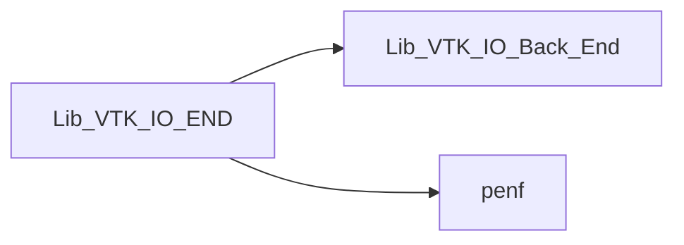
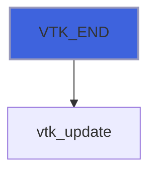

# Lib_VTK_IO_END

> END interface definition for Lib_VTK_IO.

**Source**: `src/third_party/VTKFortran/references/legacy/Lib_VTK_IO_END.f90`

**Dependencies**



## Contents

- [VTK_END](#vtk-end)

## Functions

### VTK_END

Function for finalizing the VTK-XML file.

### Usage
```fortran
 E_IO = VTK_END()
```

**Returns**: integer(kind=[I4P](/api/src/third_party/PENF/src/lib/penf_global_parameters_variables))

```fortran
function VTK_END(cf) result(E_IO)
```

**Arguments**

| Name | Type | Intent | Attributes | Description |
|------|------|--------|------------|-------------|
| `cf` | integer(kind=[I4P](/api/src/third_party/PENF/src/lib/penf_global_parameters_variables)) | inout | optional | Current file index (for concurrent files IO). |

**Call graph**


