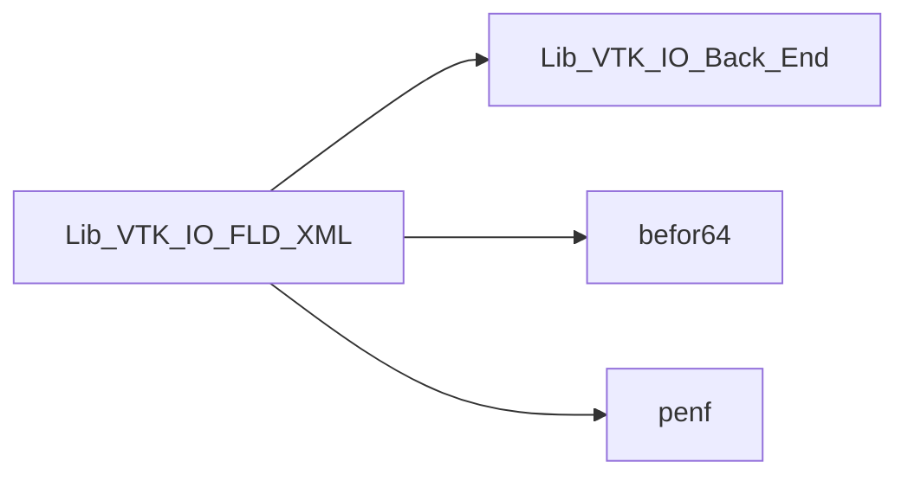
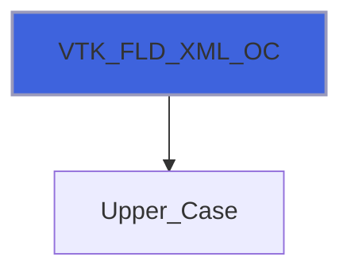
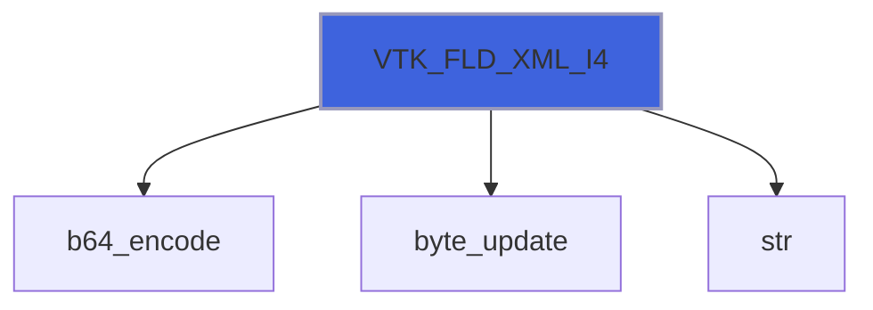
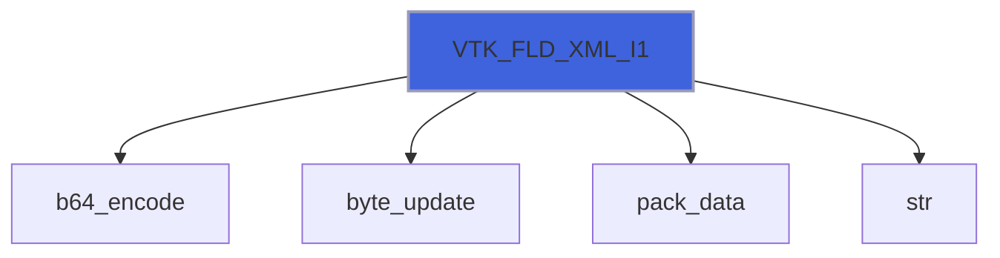

# Lib_VTK_IO_FLD_XML

> FLD_XML interface definition for Lib_VTK_IO.

**Source**: `src/third_party/VTKFortran/references/legacy/Lib_VTK_IO_FLD_XML.f90`

**Dependencies**



## Contents

- [VTK_FLD_XML](#vtk-fld-xml)
- [VTK_FLD_XML_OC](#vtk-fld-xml-oc)
- [VTK_FLD_XML_R8](#vtk-fld-xml-r8)
- [VTK_FLD_XML_R4](#vtk-fld-xml-r4)
- [VTK_FLD_XML_I8](#vtk-fld-xml-i8)
- [VTK_FLD_XML_I4](#vtk-fld-xml-i4)
- [VTK_FLD_XML_I2](#vtk-fld-xml-i2)
- [VTK_FLD_XML_I1](#vtk-fld-xml-i1)

## Interfaces

### VTK_FLD_XML

Procedure for saving field data (global auxiliary data, eg time, step number, dataset name, etc).

 VTK_FLD_XML is an interface to 7 different functions, there are 2 functions for real field data, 4 functions for integer one
 and one function for open and close field data tag.
 VTK_FLD_XML must be called after VTK_INI_XML and before VTK_GEO_XML. It must always called three times at least:

 1. for opening the FieldData tag;
 2. for saving at least one FieldData entry;
 3. for closing the FieldData tag.

 Example of usage:

```fortran
...
real(R8P)::    time
integer(I4P):: step
...
E_IO=VTK_FLD_XML(fld_action='open')
E_IO=VTK_FLD_XML(fld=time,fname='TIME')
E_IO=VTK_FLD_XML(fld=step,fname='CYCLE')
E_IO=VTK_FLD_XML(fld_action='close')
...
```

**Module procedures**: [`VTK_FLD_XML_OC`](/api/src/third_party/VTKFortran/references/legacy/Lib_VTK_IO_FLD_XML#vtk-fld-xml-oc), [`VTK_FLD_XML_R8`](/api/src/third_party/VTKFortran/references/legacy/Lib_VTK_IO_FLD_XML#vtk-fld-xml-r8), [`VTK_FLD_XML_R4`](/api/src/third_party/VTKFortran/references/legacy/Lib_VTK_IO_FLD_XML#vtk-fld-xml-r4), [`VTK_FLD_XML_I8`](/api/src/third_party/VTKFortran/references/legacy/Lib_VTK_IO_FLD_XML#vtk-fld-xml-i8), [`VTK_FLD_XML_I4`](/api/src/third_party/VTKFortran/references/legacy/Lib_VTK_IO_FLD_XML#vtk-fld-xml-i4), [`VTK_FLD_XML_I2`](/api/src/third_party/VTKFortran/references/legacy/Lib_VTK_IO_FLD_XML#vtk-fld-xml-i2), [`VTK_FLD_XML_I1`](/api/src/third_party/VTKFortran/references/legacy/Lib_VTK_IO_FLD_XML#vtk-fld-xml-i1)

## Functions

### VTK_FLD_XML_OC

Function for open/close field data tag.

**Returns**: integer(kind=[I4P](/api/src/third_party/PENF/src/lib/penf_global_parameters_variables))

```fortran
function VTK_FLD_XML_OC(fld_action, cf) result(E_IO)
```

**Arguments**

| Name | Type | Intent | Attributes | Description |
|------|------|--------|------------|-------------|
| `fld_action` | character(len=*) | in |  | Field data tag action: OPEN or CLOSE tag. |
| `cf` | integer(kind=[I4P](/api/src/third_party/PENF/src/lib/penf_global_parameters_variables)) | in | optional | Current file index (for concurrent files IO). |

**Call graph**



### VTK_FLD_XML_R8

Function for saving field data (global auxiliary data, e.g. time, step number, data set name...) (R8P).

**Returns**: integer(kind=[I4P](/api/src/third_party/PENF/src/lib/penf_global_parameters_variables))

```fortran
function VTK_FLD_XML_R8(fld, fname, cf) result(E_IO)
```

**Arguments**

| Name | Type | Intent | Attributes | Description |
|------|------|--------|------------|-------------|
| `fld` | real(kind=[R8P](/api/src/third_party/PENF/src/lib/penf_global_parameters_variables)) | in |  | Field data value. |
| `fname` | character(len=*) | in |  | Field data name. |
| `cf` | integer(kind=[I4P](/api/src/third_party/PENF/src/lib/penf_global_parameters_variables)) | in | optional | Current file index (for concurrent files IO). |

**Call graph**


### VTK_FLD_XML_R4

Function for saving field data (global auxiliary data, e.g. time, step number, data set name...) (R4P).

**Returns**: integer(kind=[I4P](/api/src/third_party/PENF/src/lib/penf_global_parameters_variables))

```fortran
function VTK_FLD_XML_R4(fld, fname, cf) result(E_IO)
```

**Arguments**

| Name | Type | Intent | Attributes | Description |
|------|------|--------|------------|-------------|
| `fld` | real(kind=[R4P](/api/src/third_party/PENF/src/lib/penf_global_parameters_variables)) | in |  | Field data value. |
| `fname` | character(len=*) | in |  | Field data name. |
| `cf` | integer(kind=[I4P](/api/src/third_party/PENF/src/lib/penf_global_parameters_variables)) | in | optional | Current file index (for concurrent files IO). |

**Call graph**


### VTK_FLD_XML_I8

Function for saving field data (global auxiliary data, e.g. time, step number, data set name...) (I8P).

**Returns**: integer(kind=[I4P](/api/src/third_party/PENF/src/lib/penf_global_parameters_variables))

```fortran
function VTK_FLD_XML_I8(fld, fname, cf) result(E_IO)
```

**Arguments**

| Name | Type | Intent | Attributes | Description |
|------|------|--------|------------|-------------|
| `fld` | integer(kind=[I8P](/api/src/third_party/PENF/src/lib/penf_global_parameters_variables)) | in |  | Field data value. |
| `fname` | character(len=*) | in |  | Field data name. |
| `cf` | integer(kind=[I4P](/api/src/third_party/PENF/src/lib/penf_global_parameters_variables)) | in | optional | Current file index (for concurrent files IO). |

**Call graph**


### VTK_FLD_XML_I4

Function for saving field data (global auxiliary data, e.g. time, step number, data set name...) (I4P).

**Returns**: integer(kind=[I4P](/api/src/third_party/PENF/src/lib/penf_global_parameters_variables))

```fortran
function VTK_FLD_XML_I4(fld, fname, cf) result(E_IO)
```

**Arguments**

| Name | Type | Intent | Attributes | Description |
|------|------|--------|------------|-------------|
| `fld` | integer(kind=[I4P](/api/src/third_party/PENF/src/lib/penf_global_parameters_variables)) | in |  | Field data value. |
| `fname` | character(len=*) | in |  | Field data name. |
| `cf` | integer(kind=[I4P](/api/src/third_party/PENF/src/lib/penf_global_parameters_variables)) | in | optional | Current file index (for concurrent files IO). |

**Call graph**



### VTK_FLD_XML_I2

Function for saving field data (global auxiliary data, e.g. time, step number, data set name...) (I2P).

**Returns**: integer(kind=[I4P](/api/src/third_party/PENF/src/lib/penf_global_parameters_variables))

```fortran
function VTK_FLD_XML_I2(fld, fname, cf) result(E_IO)
```

**Arguments**

| Name | Type | Intent | Attributes | Description |
|------|------|--------|------------|-------------|
| `fld` | integer(kind=[I2P](/api/src/third_party/PENF/src/lib/penf_global_parameters_variables)) | in |  | Field data value. |
| `fname` | character(len=*) | in |  | Field data name. |
| `cf` | integer(kind=[I4P](/api/src/third_party/PENF/src/lib/penf_global_parameters_variables)) | in | optional | Current file index (for concurrent files IO). |

**Call graph**


### VTK_FLD_XML_I1

Function for saving field data (global auxiliary data, e.g. time, step number, data set name...) (I1P).

**Returns**: integer(kind=[I4P](/api/src/third_party/PENF/src/lib/penf_global_parameters_variables))

```fortran
function VTK_FLD_XML_I1(fld, fname, cf) result(E_IO)
```

**Arguments**

| Name | Type | Intent | Attributes | Description |
|------|------|--------|------------|-------------|
| `fld` | integer(kind=[I1P](/api/src/third_party/PENF/src/lib/penf_global_parameters_variables)) | in |  | Field data value. |
| `fname` | character(len=*) | in |  | Field data name. |
| `cf` | integer(kind=[I4P](/api/src/third_party/PENF/src/lib/penf_global_parameters_variables)) | in | optional | Current file index (for concurrent files IO). |

**Call graph**


