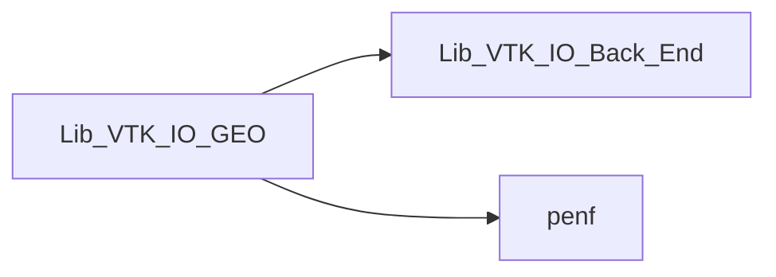
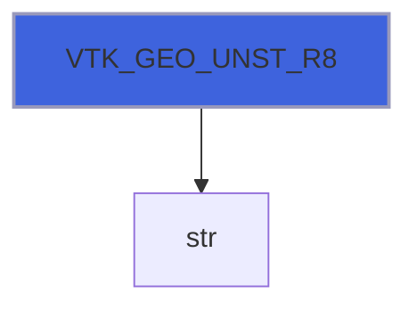
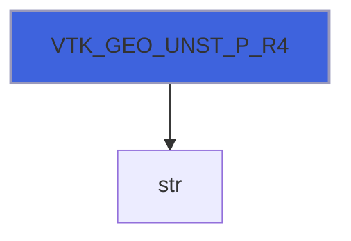

# Lib_VTK_IO_GEO

> GEO interface definition for Lib_VTK_IO.

**Source**: `src/third_party/VTKFortran/references/legacy/Lib_VTK_IO_GEO.f90`

**Dependencies**



## Contents

- [VTK_GEO](#vtk-geo)
- [VTK_GEO_STRP_R8](#vtk-geo-strp-r8)
- [VTK_GEO_STRP_R4](#vtk-geo-strp-r4)
- [VTK_GEO_STRG_1DA_R8](#vtk-geo-strg-1da-r8)
- [VTK_GEO_STRG_1DAP_R8](#vtk-geo-strg-1dap-r8)
- [VTK_GEO_STRG_3DA_R8](#vtk-geo-strg-3da-r8)
- [VTK_GEO_STRG_3DAP_R8](#vtk-geo-strg-3dap-r8)
- [VTK_GEO_STRG_1DA_R4](#vtk-geo-strg-1da-r4)
- [VTK_GEO_STRG_1DAP_R4](#vtk-geo-strg-1dap-r4)
- [VTK_GEO_STRG_3DA_R4](#vtk-geo-strg-3da-r4)
- [VTK_GEO_STRG_3DAP_R4](#vtk-geo-strg-3dap-r4)
- [VTK_GEO_RECT_R8](#vtk-geo-rect-r8)
- [VTK_GEO_RECT_R4](#vtk-geo-rect-r4)
- [VTK_GEO_UNST_R8](#vtk-geo-unst-r8)
- [VTK_GEO_UNST_P_R8](#vtk-geo-unst-p-r8)
- [VTK_GEO_UNST_R4](#vtk-geo-unst-r4)
- [VTK_GEO_UNST_P_R4](#vtk-geo-unst-p-r4)

## Interfaces

### VTK_GEO

Procedure for saving mesh with different topologies in VTK-legacy standard.

 VTK_GEO is an interface to 16 different functions, there are 2 functions for each of 4 different topologies actually supported:
 one function for mesh coordinates with R8P precision and one for mesh coordinates with R4P precision.

 @note This function must be called after VTK_INI. It saves the mesh geometry. The inputs that must be passed change depending
 on the topologies chosen. Not all VTK topologies have been implemented (*polydata* topologies are absent).

### Examples of usage

#### Structured points calling
```fortran
 integer(I4P):: Nx,Ny,Nz
 real(I8P)::    X0,Y0,Z0,Dx,Dy,Dz
 ...
 E_IO=VTK_GEO(Nx,Ny,Nz,X0,Y0,Z0,Dx,Dy,Dz)
 ...
```

#### Structured grid calling
```fortran
 integer(I4P):: Nx,Ny,Nz,Nnodes
 real(R8P)::    X(1:Nnodes),Y(1:Nnodes),Z(1:Nnodes)
 ...
 E_IO=VTK_GEO(Nx,Ny,Nz,Nnodes,X,Y,Z)
 ...
```

#### Rectilinear grid calling
```fortran
 integer(I4P):: Nx,Ny,Nz
 real(R8P)::    X(1:Nx),Y(1:Ny),Z(1:Nz)
 ...
 E_IO=VTK_GEO(Nx,Ny,Nz,X,Y,Z)
 ...
```

#### Unstructured grid calling
```fortran
 integer(I4P):: NN
 real(R4P)::    X(1:NN),Y(1:NN),Z(1:NN)
 ...
 E_IO=VTK_GEO(NN,X,Y,Z)
 ...
```

**Module procedures**: [`VTK_GEO_UNST_R8`](/api/src/third_party/VTKFortran/references/legacy/Lib_VTK_IO_GEO#vtk-geo-unst-r8), [`VTK_GEO_UNST_P_R8`](/api/src/third_party/VTKFortran/references/legacy/Lib_VTK_IO_GEO#vtk-geo-unst-p-r8), [`VTK_GEO_UNST_R4`](/api/src/third_party/VTKFortran/references/legacy/Lib_VTK_IO_GEO#vtk-geo-unst-r4), [`VTK_GEO_UNST_P_R4`](/api/src/third_party/VTKFortran/references/legacy/Lib_VTK_IO_GEO#vtk-geo-unst-p-r4), [`VTK_GEO_STRP_R8`](/api/src/third_party/VTKFortran/references/legacy/Lib_VTK_IO_GEO#vtk-geo-strp-r8), [`VTK_GEO_STRP_R4`](/api/src/third_party/VTKFortran/references/legacy/Lib_VTK_IO_GEO#vtk-geo-strp-r4), [`VTK_GEO_STRG_1DA_R8`](/api/src/third_party/VTKFortran/references/legacy/Lib_VTK_IO_GEO#vtk-geo-strg-1da-r8), [`VTK_GEO_STRG_3DA_R8`](/api/src/third_party/VTKFortran/references/legacy/Lib_VTK_IO_GEO#vtk-geo-strg-3da-r8), [`VTK_GEO_STRG_1DAP_R8`](/api/src/third_party/VTKFortran/references/legacy/Lib_VTK_IO_GEO#vtk-geo-strg-1dap-r8), [`VTK_GEO_STRG_3DAP_R8`](/api/src/third_party/VTKFortran/references/legacy/Lib_VTK_IO_GEO#vtk-geo-strg-3dap-r8), [`VTK_GEO_STRG_1DA_R4`](/api/src/third_party/VTKFortran/references/legacy/Lib_VTK_IO_GEO#vtk-geo-strg-1da-r4), [`VTK_GEO_STRG_3DA_R4`](/api/src/third_party/VTKFortran/references/legacy/Lib_VTK_IO_GEO#vtk-geo-strg-3da-r4), [`VTK_GEO_STRG_1DAP_R4`](/api/src/third_party/VTKFortran/references/legacy/Lib_VTK_IO_GEO#vtk-geo-strg-1dap-r4), [`VTK_GEO_STRG_3DAP_R4`](/api/src/third_party/VTKFortran/references/legacy/Lib_VTK_IO_GEO#vtk-geo-strg-3dap-r4), [`VTK_GEO_RECT_R8`](/api/src/third_party/VTKFortran/references/legacy/Lib_VTK_IO_GEO#vtk-geo-rect-r8), [`VTK_GEO_RECT_R4`](/api/src/third_party/VTKFortran/references/legacy/Lib_VTK_IO_GEO#vtk-geo-rect-r4)

## Functions

### VTK_GEO_STRP_R8

Function for saving mesh with STRUCTURED_POINTS topology (R8P).

**Returns**: integer(kind=[I4P](/api/src/third_party/PENF/src/lib/penf_global_parameters_variables))

```fortran
function VTK_GEO_STRP_R8(Nx, Ny, Nz, X0, Y0, Z0, Dx, Dy, Dz, cf) result(E_IO)
```

**Arguments**

| Name | Type | Intent | Attributes | Description |
|------|------|--------|------------|-------------|
| `Nx` | integer(kind=[I4P](/api/src/third_party/PENF/src/lib/penf_global_parameters_variables)) | in |  | Number of nodes in x direction. |
| `Ny` | integer(kind=[I4P](/api/src/third_party/PENF/src/lib/penf_global_parameters_variables)) | in |  | Number of nodes in y direction. |
| `Nz` | integer(kind=[I4P](/api/src/third_party/PENF/src/lib/penf_global_parameters_variables)) | in |  | Number of nodes in z direction. |
| `X0` | real(kind=[R8P](/api/src/third_party/PENF/src/lib/penf_global_parameters_variables)) | in |  | X coordinate of origin. |
| `Y0` | real(kind=[R8P](/api/src/third_party/PENF/src/lib/penf_global_parameters_variables)) | in |  | Y coordinate of origin. |
| `Z0` | real(kind=[R8P](/api/src/third_party/PENF/src/lib/penf_global_parameters_variables)) | in |  | Z coordinate of origin. |
| `Dx` | real(kind=[R8P](/api/src/third_party/PENF/src/lib/penf_global_parameters_variables)) | in |  | Space step in x direction. |
| `Dy` | real(kind=[R8P](/api/src/third_party/PENF/src/lib/penf_global_parameters_variables)) | in |  | Space step in y direction. |
| `Dz` | real(kind=[R8P](/api/src/third_party/PENF/src/lib/penf_global_parameters_variables)) | in |  | Space step in z direction. |
| `cf` | integer(kind=[I4P](/api/src/third_party/PENF/src/lib/penf_global_parameters_variables)) | in | optional | Current file index (for concurrent files IO). |

**Call graph**


### VTK_GEO_STRP_R4

Function for saving mesh with STRUCTURED_POINTS topology (R4P).

**Returns**: integer(kind=[I4P](/api/src/third_party/PENF/src/lib/penf_global_parameters_variables))

```fortran
function VTK_GEO_STRP_R4(Nx, Ny, Nz, X0, Y0, Z0, Dx, Dy, Dz, cf) result(E_IO)
```

**Arguments**

| Name | Type | Intent | Attributes | Description |
|------|------|--------|------------|-------------|
| `Nx` | integer(kind=[I4P](/api/src/third_party/PENF/src/lib/penf_global_parameters_variables)) | in |  | Number of nodes in x direction. |
| `Ny` | integer(kind=[I4P](/api/src/third_party/PENF/src/lib/penf_global_parameters_variables)) | in |  | Number of nodes in y direction. |
| `Nz` | integer(kind=[I4P](/api/src/third_party/PENF/src/lib/penf_global_parameters_variables)) | in |  | Number of nodes in z direction. |
| `X0` | real(kind=[R4P](/api/src/third_party/PENF/src/lib/penf_global_parameters_variables)) | in |  | X coordinate of origin. |
| `Y0` | real(kind=[R4P](/api/src/third_party/PENF/src/lib/penf_global_parameters_variables)) | in |  | Y coordinate of origin. |
| `Z0` | real(kind=[R4P](/api/src/third_party/PENF/src/lib/penf_global_parameters_variables)) | in |  | Z coordinate of origin. |
| `Dx` | real(kind=[R4P](/api/src/third_party/PENF/src/lib/penf_global_parameters_variables)) | in |  | Space step in x direction. |
| `Dy` | real(kind=[R4P](/api/src/third_party/PENF/src/lib/penf_global_parameters_variables)) | in |  | Space step in y direction. |
| `Dz` | real(kind=[R4P](/api/src/third_party/PENF/src/lib/penf_global_parameters_variables)) | in |  | Space step in z direction. |
| `cf` | integer(kind=[I4P](/api/src/third_party/PENF/src/lib/penf_global_parameters_variables)) | in | optional | Current file index (for concurrent files IO). |

**Call graph**


### VTK_GEO_STRG_1DA_R8

Function for saving mesh with STRUCTURED_GRID topology (R8P, 1D arrays).

**Returns**: integer(kind=[I4P](/api/src/third_party/PENF/src/lib/penf_global_parameters_variables))

```fortran
function VTK_GEO_STRG_1DA_R8(Nx, Ny, Nz, NN, X, Y, Z, cf) result(E_IO)
```

**Arguments**

| Name | Type | Intent | Attributes | Description |
|------|------|--------|------------|-------------|
| `Nx` | integer(kind=[I4P](/api/src/third_party/PENF/src/lib/penf_global_parameters_variables)) | in |  | Number of nodes in x direction. |
| `Ny` | integer(kind=[I4P](/api/src/third_party/PENF/src/lib/penf_global_parameters_variables)) | in |  | Number of nodes in y direction. |
| `Nz` | integer(kind=[I4P](/api/src/third_party/PENF/src/lib/penf_global_parameters_variables)) | in |  | Number of nodes in z direction. |
| `NN` | integer(kind=[I4P](/api/src/third_party/PENF/src/lib/penf_global_parameters_variables)) | in |  | Number of all nodes. |
| `X` | real(kind=[R8P](/api/src/third_party/PENF/src/lib/penf_global_parameters_variables)) | in |  | X coordinates [1:NN]. |
| `Y` | real(kind=[R8P](/api/src/third_party/PENF/src/lib/penf_global_parameters_variables)) | in |  | Y coordinates [1:NN]. |
| `Z` | real(kind=[R8P](/api/src/third_party/PENF/src/lib/penf_global_parameters_variables)) | in |  | Z coordinates [1:NN]. |
| `cf` | integer(kind=[I4P](/api/src/third_party/PENF/src/lib/penf_global_parameters_variables)) | in | optional | Current file index (for concurrent files IO). |

**Call graph**


### VTK_GEO_STRG_1DAP_R8

Function for saving mesh with STRUCTURED_GRID topology (R8P, 1D arrays, packed API).

**Returns**: integer(kind=[I4P](/api/src/third_party/PENF/src/lib/penf_global_parameters_variables))

```fortran
function VTK_GEO_STRG_1DAP_R8(Nx, Ny, Nz, NN, XYZ, cf) result(E_IO)
```

**Arguments**

| Name | Type | Intent | Attributes | Description |
|------|------|--------|------------|-------------|
| `Nx` | integer(kind=[I4P](/api/src/third_party/PENF/src/lib/penf_global_parameters_variables)) | in |  | Number of nodes in x direction. |
| `Ny` | integer(kind=[I4P](/api/src/third_party/PENF/src/lib/penf_global_parameters_variables)) | in |  | Number of nodes in y direction. |
| `Nz` | integer(kind=[I4P](/api/src/third_party/PENF/src/lib/penf_global_parameters_variables)) | in |  | Number of nodes in z direction. |
| `NN` | integer(kind=[I4P](/api/src/third_party/PENF/src/lib/penf_global_parameters_variables)) | in |  | Number of all nodes. |
| `XYZ` | real(kind=[R8P](/api/src/third_party/PENF/src/lib/penf_global_parameters_variables)) | in |  | X, Y and Z coordinates [1:3,1:NN]. |
| `cf` | integer(kind=[I4P](/api/src/third_party/PENF/src/lib/penf_global_parameters_variables)) | in | optional | Current file index (for concurrent files IO). |

**Call graph**


### VTK_GEO_STRG_3DA_R8

Function for saving mesh with STRUCTURED_GRID topology (R8P, 3D arrays).

**Returns**: integer(kind=[I4P](/api/src/third_party/PENF/src/lib/penf_global_parameters_variables))

```fortran
function VTK_GEO_STRG_3DA_R8(Nx, Ny, Nz, NN, X, Y, Z, cf) result(E_IO)
```

**Arguments**

| Name | Type | Intent | Attributes | Description |
|------|------|--------|------------|-------------|
| `Nx` | integer(kind=[I4P](/api/src/third_party/PENF/src/lib/penf_global_parameters_variables)) | in |  | Number of nodes in x direction. |
| `Ny` | integer(kind=[I4P](/api/src/third_party/PENF/src/lib/penf_global_parameters_variables)) | in |  | Number of nodes in y direction. |
| `Nz` | integer(kind=[I4P](/api/src/third_party/PENF/src/lib/penf_global_parameters_variables)) | in |  | Number of nodes in z direction. |
| `NN` | integer(kind=[I4P](/api/src/third_party/PENF/src/lib/penf_global_parameters_variables)) | in |  | Number of all nodes. |
| `X` | real(kind=[R8P](/api/src/third_party/PENF/src/lib/penf_global_parameters_variables)) | in |  | X coordinates [1:Nx,1:Ny,1:Nz]. |
| `Y` | real(kind=[R8P](/api/src/third_party/PENF/src/lib/penf_global_parameters_variables)) | in |  | Y coordinates [1:Nx,1:Ny,1:Nz]. |
| `Z` | real(kind=[R8P](/api/src/third_party/PENF/src/lib/penf_global_parameters_variables)) | in |  | Z coordinates [1:Nx,1:Ny,1:Nz]. |
| `cf` | integer(kind=[I4P](/api/src/third_party/PENF/src/lib/penf_global_parameters_variables)) | in | optional | Current file index (for concurrent files IO). |

**Call graph**


### VTK_GEO_STRG_3DAP_R8

Function for saving mesh with STRUCTURED_GRID topology (R8P, 3D arrays, packed API).

**Returns**: integer(kind=[I4P](/api/src/third_party/PENF/src/lib/penf_global_parameters_variables))

```fortran
function VTK_GEO_STRG_3DAP_R8(Nx, Ny, Nz, NN, XYZ, cf) result(E_IO)
```

**Arguments**

| Name | Type | Intent | Attributes | Description |
|------|------|--------|------------|-------------|
| `Nx` | integer(kind=[I4P](/api/src/third_party/PENF/src/lib/penf_global_parameters_variables)) | in |  | Number of nodes in x direction. |
| `Ny` | integer(kind=[I4P](/api/src/third_party/PENF/src/lib/penf_global_parameters_variables)) | in |  | Number of nodes in y direction. |
| `Nz` | integer(kind=[I4P](/api/src/third_party/PENF/src/lib/penf_global_parameters_variables)) | in |  | Number of nodes in z direction. |
| `NN` | integer(kind=[I4P](/api/src/third_party/PENF/src/lib/penf_global_parameters_variables)) | in |  | Number of all nodes. |
| `XYZ` | real(kind=[R8P](/api/src/third_party/PENF/src/lib/penf_global_parameters_variables)) | in |  | X, Y and Z coordinates [1:3,1:Nx,1:Ny,1:Nz]. |
| `cf` | integer(kind=[I4P](/api/src/third_party/PENF/src/lib/penf_global_parameters_variables)) | in | optional | Current file index (for concurrent files IO). |

**Call graph**


### VTK_GEO_STRG_1DA_R4

Function for saving mesh with STRUCTURED_GRID topology (R4P, 1D arrays).

**Returns**: integer(kind=[I4P](/api/src/third_party/PENF/src/lib/penf_global_parameters_variables))

```fortran
function VTK_GEO_STRG_1DA_R4(Nx, Ny, Nz, NN, X, Y, Z, cf) result(E_IO)
```

**Arguments**

| Name | Type | Intent | Attributes | Description |
|------|------|--------|------------|-------------|
| `Nx` | integer(kind=[I4P](/api/src/third_party/PENF/src/lib/penf_global_parameters_variables)) | in |  | Number of nodes in x direction. |
| `Ny` | integer(kind=[I4P](/api/src/third_party/PENF/src/lib/penf_global_parameters_variables)) | in |  | Number of nodes in y direction. |
| `Nz` | integer(kind=[I4P](/api/src/third_party/PENF/src/lib/penf_global_parameters_variables)) | in |  | Number of nodes in z direction. |
| `NN` | integer(kind=[I4P](/api/src/third_party/PENF/src/lib/penf_global_parameters_variables)) | in |  | Number of all nodes. |
| `X` | real(kind=[R4P](/api/src/third_party/PENF/src/lib/penf_global_parameters_variables)) | in |  | X coordinates [1:NN]. |
| `Y` | real(kind=[R4P](/api/src/third_party/PENF/src/lib/penf_global_parameters_variables)) | in |  | Y coordinates [1:NN]. |
| `Z` | real(kind=[R4P](/api/src/third_party/PENF/src/lib/penf_global_parameters_variables)) | in |  | Z coordinates [1:NN]. |
| `cf` | integer(kind=[I4P](/api/src/third_party/PENF/src/lib/penf_global_parameters_variables)) | in | optional | Current file index (for concurrent files IO). |

**Call graph**


### VTK_GEO_STRG_1DAP_R4

Function for saving mesh with STRUCTURED_GRID topology (R4P, 1D arrays, packed API).

**Returns**: integer(kind=[I4P](/api/src/third_party/PENF/src/lib/penf_global_parameters_variables))

```fortran
function VTK_GEO_STRG_1DAP_R4(Nx, Ny, Nz, NN, XYZ, cf) result(E_IO)
```

**Arguments**

| Name | Type | Intent | Attributes | Description |
|------|------|--------|------------|-------------|
| `Nx` | integer(kind=[I4P](/api/src/third_party/PENF/src/lib/penf_global_parameters_variables)) | in |  | Number of nodes in x direction. |
| `Ny` | integer(kind=[I4P](/api/src/third_party/PENF/src/lib/penf_global_parameters_variables)) | in |  | Number of nodes in y direction. |
| `Nz` | integer(kind=[I4P](/api/src/third_party/PENF/src/lib/penf_global_parameters_variables)) | in |  | Number of nodes in z direction. |
| `NN` | integer(kind=[I4P](/api/src/third_party/PENF/src/lib/penf_global_parameters_variables)) | in |  | Number of all nodes. |
| `XYZ` | real(kind=[R4P](/api/src/third_party/PENF/src/lib/penf_global_parameters_variables)) | in |  | X, Y and Z coordinates [1:3,1:NN]. |
| `cf` | integer(kind=[I4P](/api/src/third_party/PENF/src/lib/penf_global_parameters_variables)) | in | optional | Current file index (for concurrent files IO). |

**Call graph**


### VTK_GEO_STRG_3DA_R4

Function for saving mesh with STRUCTURED_GRID topology (R4P, 3D arrays).

**Returns**: integer(kind=[I4P](/api/src/third_party/PENF/src/lib/penf_global_parameters_variables))

```fortran
function VTK_GEO_STRG_3DA_R4(Nx, Ny, Nz, NN, X, Y, Z, cf) result(E_IO)
```

**Arguments**

| Name | Type | Intent | Attributes | Description |
|------|------|--------|------------|-------------|
| `Nx` | integer(kind=[I4P](/api/src/third_party/PENF/src/lib/penf_global_parameters_variables)) | in |  | Number of nodes in x direction. |
| `Ny` | integer(kind=[I4P](/api/src/third_party/PENF/src/lib/penf_global_parameters_variables)) | in |  | Number of nodes in y direction. |
| `Nz` | integer(kind=[I4P](/api/src/third_party/PENF/src/lib/penf_global_parameters_variables)) | in |  | Number of nodes in z direction. |
| `NN` | integer(kind=[I4P](/api/src/third_party/PENF/src/lib/penf_global_parameters_variables)) | in |  | Number of all nodes. |
| `X` | real(kind=[R4P](/api/src/third_party/PENF/src/lib/penf_global_parameters_variables)) | in |  | X coordinates [1:Nx,1:Ny,1:Nz]. |
| `Y` | real(kind=[R4P](/api/src/third_party/PENF/src/lib/penf_global_parameters_variables)) | in |  | Y coordinates [1:Nx,1:Ny,1:Nz]. |
| `Z` | real(kind=[R4P](/api/src/third_party/PENF/src/lib/penf_global_parameters_variables)) | in |  | Z coordinates [1:Nx,1:Ny,1:Nz]. |
| `cf` | integer(kind=[I4P](/api/src/third_party/PENF/src/lib/penf_global_parameters_variables)) | in | optional | Current file index (for concurrent files IO). |

**Call graph**


### VTK_GEO_STRG_3DAP_R4

Function for saving mesh with STRUCTURED_GRID topology (R4P, 3D arrays, packed API).

**Returns**: integer(kind=[I4P](/api/src/third_party/PENF/src/lib/penf_global_parameters_variables))

```fortran
function VTK_GEO_STRG_3DAP_R4(Nx, Ny, Nz, NN, XYZ, cf) result(E_IO)
```

**Arguments**

| Name | Type | Intent | Attributes | Description |
|------|------|--------|------------|-------------|
| `Nx` | integer(kind=[I4P](/api/src/third_party/PENF/src/lib/penf_global_parameters_variables)) | in |  | Number of nodes in x direction. |
| `Ny` | integer(kind=[I4P](/api/src/third_party/PENF/src/lib/penf_global_parameters_variables)) | in |  | Number of nodes in y direction. |
| `Nz` | integer(kind=[I4P](/api/src/third_party/PENF/src/lib/penf_global_parameters_variables)) | in |  | Number of nodes in z direction. |
| `NN` | integer(kind=[I4P](/api/src/third_party/PENF/src/lib/penf_global_parameters_variables)) | in |  | Number of all nodes. |
| `XYZ` | real(kind=[R4P](/api/src/third_party/PENF/src/lib/penf_global_parameters_variables)) | in |  | X, Y and Z coordinates [1:3,1:Nx,1:Ny,1:Nz]. |
| `cf` | integer(kind=[I4P](/api/src/third_party/PENF/src/lib/penf_global_parameters_variables)) | in | optional | Current file index (for concurrent files IO). |

**Call graph**


### VTK_GEO_RECT_R8

Function for saving mesh with RECTILINEAR_GRID topology (R8P).

**Returns**: integer(kind=[I4P](/api/src/third_party/PENF/src/lib/penf_global_parameters_variables))

```fortran
function VTK_GEO_RECT_R8(Nx, Ny, Nz, X, Y, Z, cf) result(E_IO)
```

**Arguments**

| Name | Type | Intent | Attributes | Description |
|------|------|--------|------------|-------------|
| `Nx` | integer(kind=[I4P](/api/src/third_party/PENF/src/lib/penf_global_parameters_variables)) | in |  | Number of nodes in x direction. |
| `Ny` | integer(kind=[I4P](/api/src/third_party/PENF/src/lib/penf_global_parameters_variables)) | in |  | Number of nodes in y direction. |
| `Nz` | integer(kind=[I4P](/api/src/third_party/PENF/src/lib/penf_global_parameters_variables)) | in |  | Number of nodes in z direction. |
| `X` | real(kind=[R8P](/api/src/third_party/PENF/src/lib/penf_global_parameters_variables)) | in |  | X coordinates. |
| `Y` | real(kind=[R8P](/api/src/third_party/PENF/src/lib/penf_global_parameters_variables)) | in |  | Y coordinates. |
| `Z` | real(kind=[R8P](/api/src/third_party/PENF/src/lib/penf_global_parameters_variables)) | in |  | Z coordinates. |
| `cf` | integer(kind=[I4P](/api/src/third_party/PENF/src/lib/penf_global_parameters_variables)) | in | optional | Current file index (for concurrent files IO). |

**Call graph**


### VTK_GEO_RECT_R4

Function for saving mesh with RECTILINEAR_GRID topology (R4P).

**Returns**: integer(kind=[I4P](/api/src/third_party/PENF/src/lib/penf_global_parameters_variables))

```fortran
function VTK_GEO_RECT_R4(Nx, Ny, Nz, X, Y, Z, cf) result(E_IO)
```

**Arguments**

| Name | Type | Intent | Attributes | Description |
|------|------|--------|------------|-------------|
| `Nx` | integer(kind=[I4P](/api/src/third_party/PENF/src/lib/penf_global_parameters_variables)) | in |  | Number of nodes in x direction. |
| `Ny` | integer(kind=[I4P](/api/src/third_party/PENF/src/lib/penf_global_parameters_variables)) | in |  | Number of nodes in y direction. |
| `Nz` | integer(kind=[I4P](/api/src/third_party/PENF/src/lib/penf_global_parameters_variables)) | in |  | Number of nodes in z direction. |
| `X` | real(kind=[R4P](/api/src/third_party/PENF/src/lib/penf_global_parameters_variables)) | in |  | X coordinates. |
| `Y` | real(kind=[R4P](/api/src/third_party/PENF/src/lib/penf_global_parameters_variables)) | in |  | Y coordinates. |
| `Z` | real(kind=[R4P](/api/src/third_party/PENF/src/lib/penf_global_parameters_variables)) | in |  | Z coordinates. |
| `cf` | integer(kind=[I4P](/api/src/third_party/PENF/src/lib/penf_global_parameters_variables)) | in | optional | Current file index (for concurrent files IO). |

**Call graph**


### VTK_GEO_UNST_R8

Function for saving mesh with UNSTRUCTURED_GRID topology (R8P).

**Returns**: integer(kind=[I4P](/api/src/third_party/PENF/src/lib/penf_global_parameters_variables))

```fortran
function VTK_GEO_UNST_R8(NN, X, Y, Z, cf) result(E_IO)
```

**Arguments**

| Name | Type | Intent | Attributes | Description |
|------|------|--------|------------|-------------|
| `NN` | integer(kind=[I4P](/api/src/third_party/PENF/src/lib/penf_global_parameters_variables)) | in |  | Number of nodes. |
| `X` | real(kind=[R8P](/api/src/third_party/PENF/src/lib/penf_global_parameters_variables)) | in |  | X coordinates of all nodes [1:NN]. |
| `Y` | real(kind=[R8P](/api/src/third_party/PENF/src/lib/penf_global_parameters_variables)) | in |  | Y coordinates of all nodes [1:NN]. |
| `Z` | real(kind=[R8P](/api/src/third_party/PENF/src/lib/penf_global_parameters_variables)) | in |  | Z coordinates of all nodes [1:NN]. |
| `cf` | integer(kind=[I4P](/api/src/third_party/PENF/src/lib/penf_global_parameters_variables)) | in | optional | Current file index (for concurrent files IO). |

**Call graph**



### VTK_GEO_UNST_P_R8

Function for saving mesh with UNSTRUCTURED_GRID topology (R8P, packed API).

**Returns**: integer(kind=[I4P](/api/src/third_party/PENF/src/lib/penf_global_parameters_variables))

```fortran
function VTK_GEO_UNST_P_R8(NN, XYZ, cf) result(E_IO)
```

**Arguments**

| Name | Type | Intent | Attributes | Description |
|------|------|--------|------------|-------------|
| `NN` | integer(kind=[I4P](/api/src/third_party/PENF/src/lib/penf_global_parameters_variables)) | in |  | Number of nodes. |
| `XYZ` | real(kind=[R8P](/api/src/third_party/PENF/src/lib/penf_global_parameters_variables)) | in |  | X, Y and Z coordinates of all nodes [1:3,1:NN]. |
| `cf` | integer(kind=[I4P](/api/src/third_party/PENF/src/lib/penf_global_parameters_variables)) | in | optional | Current file index (for concurrent files IO). |

**Call graph**


### VTK_GEO_UNST_R4

Function for saving mesh with UNSTRUCTURED_GRID topology (R4P).

**Returns**: integer(kind=[I4P](/api/src/third_party/PENF/src/lib/penf_global_parameters_variables))

```fortran
function VTK_GEO_UNST_R4(NN, X, Y, Z, cf) result(E_IO)
```

**Arguments**

| Name | Type | Intent | Attributes | Description |
|------|------|--------|------------|-------------|
| `NN` | integer(kind=[I4P](/api/src/third_party/PENF/src/lib/penf_global_parameters_variables)) | in |  | number of nodes. |
| `X` | real(kind=[R4P](/api/src/third_party/PENF/src/lib/penf_global_parameters_variables)) | in |  | X coordinates of all nodes [1:NN]. |
| `Y` | real(kind=[R4P](/api/src/third_party/PENF/src/lib/penf_global_parameters_variables)) | in |  | Y coordinates of all nodes [1:NN]. |
| `Z` | real(kind=[R4P](/api/src/third_party/PENF/src/lib/penf_global_parameters_variables)) | in |  | Z coordinates of all nodes [1:NN]. |
| `cf` | integer(kind=[I4P](/api/src/third_party/PENF/src/lib/penf_global_parameters_variables)) | in | optional | Current file index (for concurrent files IO). |

**Call graph**


### VTK_GEO_UNST_P_R4

Function for saving mesh with UNSTRUCTURED_GRID topology (R4P, packed API).

**Returns**: integer(kind=[I4P](/api/src/third_party/PENF/src/lib/penf_global_parameters_variables))

```fortran
function VTK_GEO_UNST_P_R4(NN, XYZ, cf) result(E_IO)
```

**Arguments**

| Name | Type | Intent | Attributes | Description |
|------|------|--------|------------|-------------|
| `NN` | integer(kind=[I4P](/api/src/third_party/PENF/src/lib/penf_global_parameters_variables)) | in |  | number of nodes. |
| `XYZ` | real(kind=[R4P](/api/src/third_party/PENF/src/lib/penf_global_parameters_variables)) | in |  | X, Y and Z coordinates of all nodes [1:3,1:NN]. |
| `cf` | integer(kind=[I4P](/api/src/third_party/PENF/src/lib/penf_global_parameters_variables)) | in | optional | Current file index (for concurrent files IO). |

**Call graph**


