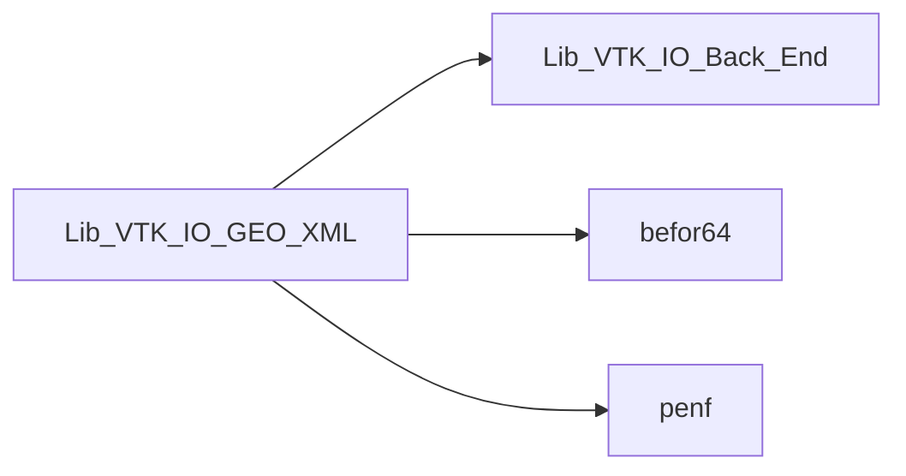
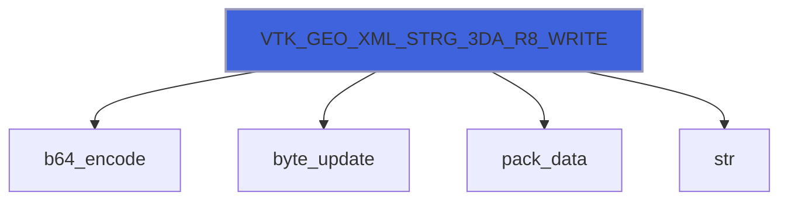
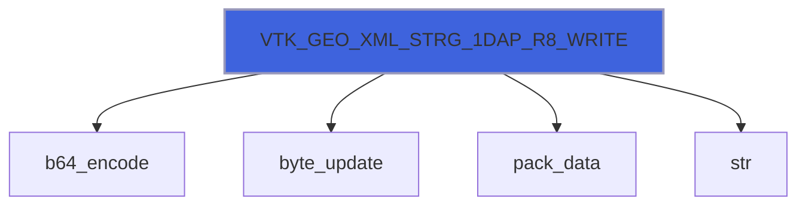
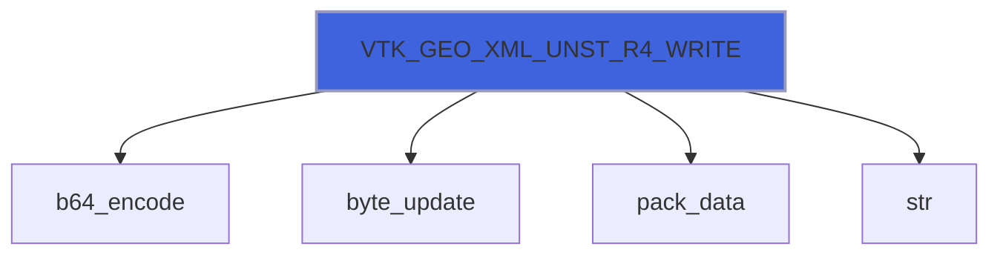
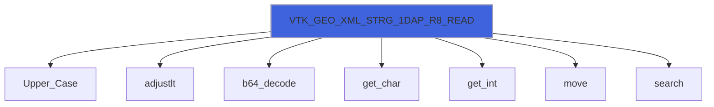

# Lib_VTK_IO_GEO_XML

> GEO_XML interface definition for Lib_VTK_IO.

**Source**: `src/third_party/VTKFortran/references/legacy/Lib_VTK_IO_GEO_XML.f90`

**Dependencies**



## Contents

- [VTK_GEO_XML_WRITE](#vtk-geo-xml-write)
- [VTK_GEO_XML_READ](#vtk-geo-xml-read)
- [VTK_GEO_XML_STRG_1DA_R8_WRITE](#vtk-geo-xml-strg-1da-r8-write)
- [VTK_GEO_XML_STRG_3DA_R8_WRITE](#vtk-geo-xml-strg-3da-r8-write)
- [VTK_GEO_XML_STRG_1DAP_R8_WRITE](#vtk-geo-xml-strg-1dap-r8-write)
- [VTK_GEO_XML_STRG_3DAP_R8_WRITE](#vtk-geo-xml-strg-3dap-r8-write)
- [VTK_GEO_XML_STRG_1DA_R4_WRITE](#vtk-geo-xml-strg-1da-r4-write)
- [VTK_GEO_XML_STRG_3DA_R4_WRITE](#vtk-geo-xml-strg-3da-r4-write)
- [VTK_GEO_XML_STRG_1DAP_R4_WRITE](#vtk-geo-xml-strg-1dap-r4-write)
- [VTK_GEO_XML_STRG_3DAP_R4_WRITE](#vtk-geo-xml-strg-3dap-r4-write)
- [VTK_GEO_XML_RECT_R8_WRITE](#vtk-geo-xml-rect-r8-write)
- [VTK_GEO_XML_RECT_R4_WRITE](#vtk-geo-xml-rect-r4-write)
- [VTK_GEO_XML_UNST_R8_WRITE](#vtk-geo-xml-unst-r8-write)
- [VTK_GEO_XML_UNST_PACK_R8_WRITE](#vtk-geo-xml-unst-pack-r8-write)
- [VTK_GEO_XML_UNST_R4_WRITE](#vtk-geo-xml-unst-r4-write)
- [VTK_GEO_XML_UNST_PACK_R4_WRITE](#vtk-geo-xml-unst-pack-r4-write)
- [VTK_GEO_XML_CLOSEP_WRITE](#vtk-geo-xml-closep-write)
- [VTK_GEO_XML_STRG_1DA_R8_READ](#vtk-geo-xml-strg-1da-r8-read)
- [VTK_GEO_XML_STRG_3DA_R8_READ](#vtk-geo-xml-strg-3da-r8-read)
- [VTK_GEO_XML_STRG_1DAP_R8_READ](#vtk-geo-xml-strg-1dap-r8-read)
- [VTK_GEO_XML_STRG_3DAP_R8_READ](#vtk-geo-xml-strg-3dap-r8-read)
- [VTK_GEO_XML_STRG_1DA_R4_READ](#vtk-geo-xml-strg-1da-r4-read)
- [VTK_GEO_XML_STRG_3DA_R4_READ](#vtk-geo-xml-strg-3da-r4-read)
- [VTK_GEO_XML_STRG_1DAP_R4_READ](#vtk-geo-xml-strg-1dap-r4-read)
- [VTK_GEO_XML_STRG_3DAP_R4_READ](#vtk-geo-xml-strg-3dap-r4-read)
- [VTK_GEO_XML_RECT_R8_READ](#vtk-geo-xml-rect-r8-read)
- [VTK_GEO_XML_RECT_R4_READ](#vtk-geo-xml-rect-r4-read)
- [VTK_GEO_XML_UNST_R8_READ](#vtk-geo-xml-unst-r8-read)
- [VTK_GEO_XML_UNST_PACK_R8_READ](#vtk-geo-xml-unst-pack-r8-read)
- [VTK_GEO_XML_UNST_R4_READ](#vtk-geo-xml-unst-r4-read)
- [VTK_GEO_XML_UNST_PACK_R4_READ](#vtk-geo-xml-unst-pack-r4-read)

## Interfaces

### VTK_GEO_XML_WRITE

Export (write) mesh with different topologies in VTK-XML standard.

 VTK_GEO_XML is an interface to 15 different functions; there are 2 functions for each of 3 topologies supported and a function
 for closing XML pieces: one function for mesh coordinates with R8P precision and one for mesh coordinates with R4P precision.
 1D/3D-rank arrays and packed API for any kinds

- For StructuredGrid there are 4 functions for each real kinds:
    - inputs are 1D-rank arrays: X[1:NN],Y[1:NN],Z[1:NN];
    - inputs are 3D-rank arrays: X[nx1:nx2,ny1:ny2,nz1:nz2],Y[nx1:nx2,ny1:ny2,nz1:nz2],Z[nx1:nx2,ny1:ny2,nz1:nz2];
    - input is 1D-rank array (packed API): XYZ[1:3,1:NN];
    - input is 3D-rank array (packed API): XYZ[1:3,nx1:nx2,ny1:ny2,nz1:nz2].
- For UnStructuredGrid there are 2 functions for each real kinds:
    - inputs are 1D arrays: X[1:NN],Y[1:NN],Z[1:NN];
    - input is 1D array (packed API): XYZ[1:3,1:NN].

 VTK_GEO_XML must be called after VTK_INI_XML. It saves the mesh geometry. The inputs that must be passed
 change depending on the topologies chosen. Not all VTK topologies have been implemented (*polydata* topologies are absent).

 @note The XML standard is more powerful than legacy. XML file can contain more than 1 mesh with its
 associated variables. Thus there is the necessity to close each *pieces* that compose the data-set saved in the
 XML file. The VTK_GEO_XML called in the *close piece* format is used just to close the
 current piece before saving another piece or closing the file.

### Examples of usage

#### Structured grid calling
```fortran
 integer(I4P):: nx1,nx2,ny1,ny2,nz1,nz2,NN
 real(R8P)::    X(1:NN),Y(1:NN),Z(1:NN)
 ...
 E_IO=VTK_GEO_XML(nx1,nx2,ny1,ny2,nz1,nz2,Nn,X,Y,Z)
```

#### Rectilinear grid calling
```fortran
 integer(I4P):: nx1,nx2,ny1,ny2,nz1,nz2
 real(R8P)::    X(nx1:nx2),Y(ny1:ny2),Z(nz1:nz2)
 ...
 E_IO=VTK_GEO_XML(nx1,nx2,ny1,ny2,nz1,nz2,X,Y,Z)
```

#### Unstructured grid calling
```fortran
 integer(I4P):: Nn,Nc
 real(R8P)::    X(1:Nn),Y(1:Nn),Z(1:Nn)
 ...
 E_IO=VTK_GEO_XML(Nn,Nc,X,Y,Z)
```

#### Closing piece calling
```fortran
 E_IO=VTK_GEO_XML()
```

**Module procedures**: [`VTK_GEO_XML_STRG_1DA_R8_WRITE`](/api/src/third_party/VTKFortran/references/legacy/Lib_VTK_IO_GEO_XML#vtk-geo-xml-strg-1da-r8-write), [`VTK_GEO_XML_STRG_3DA_R8_WRITE`](/api/src/third_party/VTKFortran/references/legacy/Lib_VTK_IO_GEO_XML#vtk-geo-xml-strg-3da-r8-write), [`VTK_GEO_XML_STRG_1DAP_R8_WRITE`](/api/src/third_party/VTKFortran/references/legacy/Lib_VTK_IO_GEO_XML#vtk-geo-xml-strg-1dap-r8-write), [`VTK_GEO_XML_STRG_3DAP_R8_WRITE`](/api/src/third_party/VTKFortran/references/legacy/Lib_VTK_IO_GEO_XML#vtk-geo-xml-strg-3dap-r8-write), [`VTK_GEO_XML_STRG_1DA_R4_WRITE`](/api/src/third_party/VTKFortran/references/legacy/Lib_VTK_IO_GEO_XML#vtk-geo-xml-strg-1da-r4-write), [`VTK_GEO_XML_STRG_3DA_R4_WRITE`](/api/src/third_party/VTKFortran/references/legacy/Lib_VTK_IO_GEO_XML#vtk-geo-xml-strg-3da-r4-write), [`VTK_GEO_XML_STRG_1DAP_R4_WRITE`](/api/src/third_party/VTKFortran/references/legacy/Lib_VTK_IO_GEO_XML#vtk-geo-xml-strg-1dap-r4-write), [`VTK_GEO_XML_STRG_3DAP_R4_WRITE`](/api/src/third_party/VTKFortran/references/legacy/Lib_VTK_IO_GEO_XML#vtk-geo-xml-strg-3dap-r4-write), [`VTK_GEO_XML_RECT_R8_WRITE`](/api/src/third_party/VTKFortran/references/legacy/Lib_VTK_IO_GEO_XML#vtk-geo-xml-rect-r8-write), [`VTK_GEO_XML_RECT_R4_WRITE`](/api/src/third_party/VTKFortran/references/legacy/Lib_VTK_IO_GEO_XML#vtk-geo-xml-rect-r4-write), [`VTK_GEO_XML_UNST_R8_WRITE`](/api/src/third_party/VTKFortran/references/legacy/Lib_VTK_IO_GEO_XML#vtk-geo-xml-unst-r8-write), [`VTK_GEO_XML_UNST_PACK_R4_WRITE`](/api/src/third_party/VTKFortran/references/legacy/Lib_VTK_IO_GEO_XML#vtk-geo-xml-unst-pack-r4-write), [`VTK_GEO_XML_UNST_R4_WRITE`](/api/src/third_party/VTKFortran/references/legacy/Lib_VTK_IO_GEO_XML#vtk-geo-xml-unst-r4-write), [`VTK_GEO_XML_UNST_PACK_R8_WRITE`](/api/src/third_party/VTKFortran/references/legacy/Lib_VTK_IO_GEO_XML#vtk-geo-xml-unst-pack-r8-write), [`VTK_GEO_XML_CLOSEP_WRITE`](/api/src/third_party/VTKFortran/references/legacy/Lib_VTK_IO_GEO_XML#vtk-geo-xml-closep-write)

### VTK_GEO_XML_READ

Import (read) mesh with different topologies in VTK-XML standard.

 VTK_GEO_XML_READ is an interface to 14 different functions; there are 2 functions for each of 3 topologies supported and a
 function for closing XML pieces: one function for mesh coordinates with R8P (Ok!) precision and one for mesh coordinates with
 R4P (Not tested!) precision. 1D/3D-rank arrays and packed API for ascii and raw data, binary is not implemented yet!

- For StructuredGrid there are 4 functions for each real kinds:
    - inputs are 1D-rank arrays: X[1:NN],Y[1:NN],Z[1:NN]; (Not tested!)
    - inputs are 3D-rank arrays: X[nx1:nx2,ny1:ny2,nz1:nz2],Y[nx1:nx2,ny1:ny2,nz1:nz2],Z[nx1:nx2,ny1:ny2,nz1:nz2]; (Not tested!)
    - input is 1D-rank array (packed API): XYZ[1:3,1:NN]; (Not tested!)
    - input is 3D-rank array (packed API): XYZ[1:3,nx1:nx2,ny1:ny2,nz1:nz2]. (Not tested!)
- For UnStructuredGrid there are 2 functions for each real kinds:
    - inputs are 1D arrays: X[1:NN],Y[1:NN],Z[1:NN]; (Ok!)
    - input is 1D array (packed API): XYZ[1:3,1:NN]. (Not tested!)

 VTK_GEO_XML_READ must be called after VTK_INI_XML_READ. It reads the mesh geometry. The inputs that must be passed
 change depending on the topologies chosen. Not all VTK topologies have been implemented (*polydata* topologies are absent).

 @note The XML standard is more powerful than legacy. XML file can contain more than 1 mesh with its
 associated variables. Thus there is the necessity to close each *pieces* that compose the data-set saved in the
 XML file. The VTK_GEO_XML_READ uses the *close piece* format is used just to close the
 current piece before saving another piece or closing the file.

### Examples of usage

**Module procedures**: [`VTK_GEO_XML_STRG_1DA_R8_READ`](/api/src/third_party/VTKFortran/references/legacy/Lib_VTK_IO_GEO_XML#vtk-geo-xml-strg-1da-r8-read), [`VTK_GEO_XML_STRG_3DA_R8_READ`](/api/src/third_party/VTKFortran/references/legacy/Lib_VTK_IO_GEO_XML#vtk-geo-xml-strg-3da-r8-read), [`VTK_GEO_XML_STRG_1DAP_R8_READ`](/api/src/third_party/VTKFortran/references/legacy/Lib_VTK_IO_GEO_XML#vtk-geo-xml-strg-1dap-r8-read), [`VTK_GEO_XML_STRG_3DAP_R8_READ`](/api/src/third_party/VTKFortran/references/legacy/Lib_VTK_IO_GEO_XML#vtk-geo-xml-strg-3dap-r8-read), [`VTK_GEO_XML_STRG_1DA_R4_READ`](/api/src/third_party/VTKFortran/references/legacy/Lib_VTK_IO_GEO_XML#vtk-geo-xml-strg-1da-r4-read), [`VTK_GEO_XML_STRG_3DA_R4_READ`](/api/src/third_party/VTKFortran/references/legacy/Lib_VTK_IO_GEO_XML#vtk-geo-xml-strg-3da-r4-read), [`VTK_GEO_XML_STRG_1DAP_R4_READ`](/api/src/third_party/VTKFortran/references/legacy/Lib_VTK_IO_GEO_XML#vtk-geo-xml-strg-1dap-r4-read), [`VTK_GEO_XML_STRG_3DAP_R4_READ`](/api/src/third_party/VTKFortran/references/legacy/Lib_VTK_IO_GEO_XML#vtk-geo-xml-strg-3dap-r4-read), [`VTK_GEO_XML_RECT_R8_READ`](/api/src/third_party/VTKFortran/references/legacy/Lib_VTK_IO_GEO_XML#vtk-geo-xml-rect-r8-read), [`VTK_GEO_XML_RECT_R4_READ`](/api/src/third_party/VTKFortran/references/legacy/Lib_VTK_IO_GEO_XML#vtk-geo-xml-rect-r4-read), [`VTK_GEO_XML_UNST_R8_READ`](/api/src/third_party/VTKFortran/references/legacy/Lib_VTK_IO_GEO_XML#vtk-geo-xml-unst-r8-read), [`VTK_GEO_XML_UNST_PACK_R4_READ`](/api/src/third_party/VTKFortran/references/legacy/Lib_VTK_IO_GEO_XML#vtk-geo-xml-unst-pack-r4-read), [`VTK_GEO_XML_UNST_R4_READ`](/api/src/third_party/VTKFortran/references/legacy/Lib_VTK_IO_GEO_XML#vtk-geo-xml-unst-r4-read), [`VTK_GEO_XML_UNST_PACK_R8_READ`](/api/src/third_party/VTKFortran/references/legacy/Lib_VTK_IO_GEO_XML#vtk-geo-xml-unst-pack-r8-read)

## Functions

### VTK_GEO_XML_STRG_1DA_R8_WRITE

Function for saving mesh with \b StructuredGrid topology (R8P, 1D Arrays).

**Returns**: integer(kind=[I4P](/api/src/third_party/PENF/src/lib/penf_global_parameters_variables))

```fortran
function VTK_GEO_XML_STRG_1DA_R8_WRITE(nx1, nx2, ny1, ny2, nz1, nz2, NN, X, Y, Z, cf) result(E_IO)
```

**Arguments**

| Name | Type | Intent | Attributes | Description |
|------|------|--------|------------|-------------|
| `nx1` | integer(kind=[I4P](/api/src/third_party/PENF/src/lib/penf_global_parameters_variables)) | in |  | Initial node of x axis. |
| `nx2` | integer(kind=[I4P](/api/src/third_party/PENF/src/lib/penf_global_parameters_variables)) | in |  | Final node of x axis. |
| `ny1` | integer(kind=[I4P](/api/src/third_party/PENF/src/lib/penf_global_parameters_variables)) | in |  | Initial node of y axis. |
| `ny2` | integer(kind=[I4P](/api/src/third_party/PENF/src/lib/penf_global_parameters_variables)) | in |  | Final node of y axis. |
| `nz1` | integer(kind=[I4P](/api/src/third_party/PENF/src/lib/penf_global_parameters_variables)) | in |  | Initial node of z axis. |
| `nz2` | integer(kind=[I4P](/api/src/third_party/PENF/src/lib/penf_global_parameters_variables)) | in |  | Final node of z axis. |
| `NN` | integer(kind=[I4P](/api/src/third_party/PENF/src/lib/penf_global_parameters_variables)) | in |  | Number of all nodes. |
| `X` | real(kind=[R8P](/api/src/third_party/PENF/src/lib/penf_global_parameters_variables)) | in |  | X coordinates [1:NN]. |
| `Y` | real(kind=[R8P](/api/src/third_party/PENF/src/lib/penf_global_parameters_variables)) | in |  | Y coordinates [1:NN]. |
| `Z` | real(kind=[R8P](/api/src/third_party/PENF/src/lib/penf_global_parameters_variables)) | in |  | Z coordinates [1:NN]. |
| `cf` | integer(kind=[I4P](/api/src/third_party/PENF/src/lib/penf_global_parameters_variables)) | in | optional | Current file index (for concurrent files IO). |

**Call graph**


### VTK_GEO_XML_STRG_3DA_R8_WRITE

Function for saving mesh with \b StructuredGrid topology (R8P, 3D Arrays).

**Returns**: integer(kind=[I4P](/api/src/third_party/PENF/src/lib/penf_global_parameters_variables))

```fortran
function VTK_GEO_XML_STRG_3DA_R8_WRITE(nx1, nx2, ny1, ny2, nz1, nz2, NN, X, Y, Z, cf) result(E_IO)
```

**Arguments**

| Name | Type | Intent | Attributes | Description |
|------|------|--------|------------|-------------|
| `nx1` | integer(kind=[I4P](/api/src/third_party/PENF/src/lib/penf_global_parameters_variables)) | in |  | Initial node of x axis. |
| `nx2` | integer(kind=[I4P](/api/src/third_party/PENF/src/lib/penf_global_parameters_variables)) | in |  | Final node of x axis. |
| `ny1` | integer(kind=[I4P](/api/src/third_party/PENF/src/lib/penf_global_parameters_variables)) | in |  | Initial node of y axis. |
| `ny2` | integer(kind=[I4P](/api/src/third_party/PENF/src/lib/penf_global_parameters_variables)) | in |  | Final node of y axis. |
| `nz1` | integer(kind=[I4P](/api/src/third_party/PENF/src/lib/penf_global_parameters_variables)) | in |  | Initial node of z axis. |
| `nz2` | integer(kind=[I4P](/api/src/third_party/PENF/src/lib/penf_global_parameters_variables)) | in |  | Final node of z axis. |
| `NN` | integer(kind=[I4P](/api/src/third_party/PENF/src/lib/penf_global_parameters_variables)) | in |  | Number of all nodes. |
| `X` | real(kind=[R8P](/api/src/third_party/PENF/src/lib/penf_global_parameters_variables)) | in |  | X coordinates [nx1:nx2,ny1:ny2,nz1:nz2]. |
| `Y` | real(kind=[R8P](/api/src/third_party/PENF/src/lib/penf_global_parameters_variables)) | in |  | Y coordinates [nx1:nx2,ny1:ny2,nz1:nz2]. |
| `Z` | real(kind=[R8P](/api/src/third_party/PENF/src/lib/penf_global_parameters_variables)) | in |  | Z coordinates [nx1:nx2,ny1:ny2,nz1:nz2]. |
| `cf` | integer(kind=[I4P](/api/src/third_party/PENF/src/lib/penf_global_parameters_variables)) | in | optional | Current file index (for concurrent files IO). |

**Call graph**



### VTK_GEO_XML_STRG_1DAP_R8_WRITE

Function for saving mesh with \b StructuredGrid topology (R8P, 1D Arrays, packed API).

**Returns**: integer(kind=[I4P](/api/src/third_party/PENF/src/lib/penf_global_parameters_variables))

```fortran
function VTK_GEO_XML_STRG_1DAP_R8_WRITE(nx1, nx2, ny1, ny2, nz1, nz2, NN, XYZ, cf) result(E_IO)
```

**Arguments**

| Name | Type | Intent | Attributes | Description |
|------|------|--------|------------|-------------|
| `nx1` | integer(kind=[I4P](/api/src/third_party/PENF/src/lib/penf_global_parameters_variables)) | in |  | Initial node of x axis. |
| `nx2` | integer(kind=[I4P](/api/src/third_party/PENF/src/lib/penf_global_parameters_variables)) | in |  | Final node of x axis. |
| `ny1` | integer(kind=[I4P](/api/src/third_party/PENF/src/lib/penf_global_parameters_variables)) | in |  | Initial node of y axis. |
| `ny2` | integer(kind=[I4P](/api/src/third_party/PENF/src/lib/penf_global_parameters_variables)) | in |  | Final node of y axis. |
| `nz1` | integer(kind=[I4P](/api/src/third_party/PENF/src/lib/penf_global_parameters_variables)) | in |  | Initial node of z axis. |
| `nz2` | integer(kind=[I4P](/api/src/third_party/PENF/src/lib/penf_global_parameters_variables)) | in |  | Final node of z axis. |
| `NN` | integer(kind=[I4P](/api/src/third_party/PENF/src/lib/penf_global_parameters_variables)) | in |  | Number of all nodes. |
| `XYZ` | real(kind=[R8P](/api/src/third_party/PENF/src/lib/penf_global_parameters_variables)) | in |  | X, Y, Z coordinates (packed API) [1:3,1:NN]. |
| `cf` | integer(kind=[I4P](/api/src/third_party/PENF/src/lib/penf_global_parameters_variables)) | in | optional | Current file index (for concurrent files IO). |

**Call graph**



### VTK_GEO_XML_STRG_3DAP_R8_WRITE

Function for saving mesh with \b StructuredGrid topology (R8P, 3D Arrays, packed API).

**Returns**: integer(kind=[I4P](/api/src/third_party/PENF/src/lib/penf_global_parameters_variables))

```fortran
function VTK_GEO_XML_STRG_3DAP_R8_WRITE(nx1, nx2, ny1, ny2, nz1, nz2, NN, XYZ, cf) result(E_IO)
```

**Arguments**

| Name | Type | Intent | Attributes | Description |
|------|------|--------|------------|-------------|
| `nx1` | integer(kind=[I4P](/api/src/third_party/PENF/src/lib/penf_global_parameters_variables)) | in |  | Initial node of x axis. |
| `nx2` | integer(kind=[I4P](/api/src/third_party/PENF/src/lib/penf_global_parameters_variables)) | in |  | Final node of x axis. |
| `ny1` | integer(kind=[I4P](/api/src/third_party/PENF/src/lib/penf_global_parameters_variables)) | in |  | Initial node of y axis. |
| `ny2` | integer(kind=[I4P](/api/src/third_party/PENF/src/lib/penf_global_parameters_variables)) | in |  | Final node of y axis. |
| `nz1` | integer(kind=[I4P](/api/src/third_party/PENF/src/lib/penf_global_parameters_variables)) | in |  | Initial node of z axis. |
| `nz2` | integer(kind=[I4P](/api/src/third_party/PENF/src/lib/penf_global_parameters_variables)) | in |  | Final node of z axis. |
| `NN` | integer(kind=[I4P](/api/src/third_party/PENF/src/lib/penf_global_parameters_variables)) | in |  | Number of all nodes. |
| `XYZ` | real(kind=[R8P](/api/src/third_party/PENF/src/lib/penf_global_parameters_variables)) | in |  | X, Y, Z coordinates (packed API). |
| `cf` | integer(kind=[I4P](/api/src/third_party/PENF/src/lib/penf_global_parameters_variables)) | in | optional | Current file index (for concurrent files IO). |

**Call graph**


### VTK_GEO_XML_STRG_1DA_R4_WRITE

Function for saving mesh with \b StructuredGrid topology (R4P, 1D Arrays).

**Returns**: integer(kind=[I4P](/api/src/third_party/PENF/src/lib/penf_global_parameters_variables))

```fortran
function VTK_GEO_XML_STRG_1DA_R4_WRITE(nx1, nx2, ny1, ny2, nz1, nz2, NN, X, Y, Z, cf) result(E_IO)
```

**Arguments**

| Name | Type | Intent | Attributes | Description |
|------|------|--------|------------|-------------|
| `nx1` | integer(kind=[I4P](/api/src/third_party/PENF/src/lib/penf_global_parameters_variables)) | in |  | Initial node of x axis. |
| `nx2` | integer(kind=[I4P](/api/src/third_party/PENF/src/lib/penf_global_parameters_variables)) | in |  | Final node of x axis. |
| `ny1` | integer(kind=[I4P](/api/src/third_party/PENF/src/lib/penf_global_parameters_variables)) | in |  | Initial node of y axis. |
| `ny2` | integer(kind=[I4P](/api/src/third_party/PENF/src/lib/penf_global_parameters_variables)) | in |  | Final node of y axis. |
| `nz1` | integer(kind=[I4P](/api/src/third_party/PENF/src/lib/penf_global_parameters_variables)) | in |  | Initial node of z axis. |
| `nz2` | integer(kind=[I4P](/api/src/third_party/PENF/src/lib/penf_global_parameters_variables)) | in |  | Final node of z axis. |
| `NN` | integer(kind=[I4P](/api/src/third_party/PENF/src/lib/penf_global_parameters_variables)) | in |  | Number of all nodes. |
| `X` | real(kind=[R4P](/api/src/third_party/PENF/src/lib/penf_global_parameters_variables)) | in |  | X coordinates [1:NN]. |
| `Y` | real(kind=[R4P](/api/src/third_party/PENF/src/lib/penf_global_parameters_variables)) | in |  | Y coordinates [1:NN]. |
| `Z` | real(kind=[R4P](/api/src/third_party/PENF/src/lib/penf_global_parameters_variables)) | in |  | Z coordinates [1:NN]. |
| `cf` | integer(kind=[I4P](/api/src/third_party/PENF/src/lib/penf_global_parameters_variables)) | in | optional | Current file index (for concurrent files IO). |

**Call graph**


### VTK_GEO_XML_STRG_3DA_R4_WRITE

Function for saving mesh with \b StructuredGrid topology (R4P, 3D Arrays).

**Returns**: integer(kind=[I4P](/api/src/third_party/PENF/src/lib/penf_global_parameters_variables))

```fortran
function VTK_GEO_XML_STRG_3DA_R4_WRITE(nx1, nx2, ny1, ny2, nz1, nz2, NN, X, Y, Z, cf) result(E_IO)
```

**Arguments**

| Name | Type | Intent | Attributes | Description |
|------|------|--------|------------|-------------|
| `nx1` | integer(kind=[I4P](/api/src/third_party/PENF/src/lib/penf_global_parameters_variables)) | in |  | Initial node of x axis. |
| `nx2` | integer(kind=[I4P](/api/src/third_party/PENF/src/lib/penf_global_parameters_variables)) | in |  | Final node of x axis. |
| `ny1` | integer(kind=[I4P](/api/src/third_party/PENF/src/lib/penf_global_parameters_variables)) | in |  | Initial node of y axis. |
| `ny2` | integer(kind=[I4P](/api/src/third_party/PENF/src/lib/penf_global_parameters_variables)) | in |  | Final node of y axis. |
| `nz1` | integer(kind=[I4P](/api/src/third_party/PENF/src/lib/penf_global_parameters_variables)) | in |  | Initial node of z axis. |
| `nz2` | integer(kind=[I4P](/api/src/third_party/PENF/src/lib/penf_global_parameters_variables)) | in |  | Final node of z axis. |
| `NN` | integer(kind=[I4P](/api/src/third_party/PENF/src/lib/penf_global_parameters_variables)) | in |  | Number of all nodes. |
| `X` | real(kind=[R4P](/api/src/third_party/PENF/src/lib/penf_global_parameters_variables)) | in |  | X coordinates [nx1:nx2,ny1:ny2,nz1:nz2]. |
| `Y` | real(kind=[R4P](/api/src/third_party/PENF/src/lib/penf_global_parameters_variables)) | in |  | Y coordinates [nx1:nx2,ny1:ny2,nz1:nz2]. |
| `Z` | real(kind=[R4P](/api/src/third_party/PENF/src/lib/penf_global_parameters_variables)) | in |  | Z coordinates [nx1:nx2,ny1:ny2,nz1:nz2]. |
| `cf` | integer(kind=[I4P](/api/src/third_party/PENF/src/lib/penf_global_parameters_variables)) | in | optional | Current file index (for concurrent files IO). |

**Call graph**


### VTK_GEO_XML_STRG_1DAP_R4_WRITE

Function for saving mesh with \b StructuredGrid topology (R4P, 1D Arrays, packed API).

**Returns**: integer(kind=[I4P](/api/src/third_party/PENF/src/lib/penf_global_parameters_variables))

```fortran
function VTK_GEO_XML_STRG_1DAP_R4_WRITE(nx1, nx2, ny1, ny2, nz1, nz2, NN, XYZ, cf) result(E_IO)
```

**Arguments**

| Name | Type | Intent | Attributes | Description |
|------|------|--------|------------|-------------|
| `nx1` | integer(kind=[I4P](/api/src/third_party/PENF/src/lib/penf_global_parameters_variables)) | in |  | Initial node of x axis. |
| `nx2` | integer(kind=[I4P](/api/src/third_party/PENF/src/lib/penf_global_parameters_variables)) | in |  | Final node of x axis. |
| `ny1` | integer(kind=[I4P](/api/src/third_party/PENF/src/lib/penf_global_parameters_variables)) | in |  | Initial node of y axis. |
| `ny2` | integer(kind=[I4P](/api/src/third_party/PENF/src/lib/penf_global_parameters_variables)) | in |  | Final node of y axis. |
| `nz1` | integer(kind=[I4P](/api/src/third_party/PENF/src/lib/penf_global_parameters_variables)) | in |  | Initial node of z axis. |
| `nz2` | integer(kind=[I4P](/api/src/third_party/PENF/src/lib/penf_global_parameters_variables)) | in |  | Final node of z axis. |
| `NN` | integer(kind=[I4P](/api/src/third_party/PENF/src/lib/penf_global_parameters_variables)) | in |  | Number of all nodes. |
| `XYZ` | real(kind=[R4P](/api/src/third_party/PENF/src/lib/penf_global_parameters_variables)) | in |  | X, Y, Z coordinates (packed API) [1:3,1:NN]. |
| `cf` | integer(kind=[I4P](/api/src/third_party/PENF/src/lib/penf_global_parameters_variables)) | in | optional | Current file index (for concurrent files IO). |

**Call graph**


### VTK_GEO_XML_STRG_3DAP_R4_WRITE

Function for saving mesh with \b StructuredGrid topology (R4P, 3D Arrays, packed API).

**Returns**: integer(kind=[I4P](/api/src/third_party/PENF/src/lib/penf_global_parameters_variables))

```fortran
function VTK_GEO_XML_STRG_3DAP_R4_WRITE(nx1, nx2, ny1, ny2, nz1, nz2, NN, XYZ, cf) result(E_IO)
```

**Arguments**

| Name | Type | Intent | Attributes | Description |
|------|------|--------|------------|-------------|
| `nx1` | integer(kind=[I4P](/api/src/third_party/PENF/src/lib/penf_global_parameters_variables)) | in |  | Initial node of x axis. |
| `nx2` | integer(kind=[I4P](/api/src/third_party/PENF/src/lib/penf_global_parameters_variables)) | in |  | Final node of x axis. |
| `ny1` | integer(kind=[I4P](/api/src/third_party/PENF/src/lib/penf_global_parameters_variables)) | in |  | Initial node of y axis. |
| `ny2` | integer(kind=[I4P](/api/src/third_party/PENF/src/lib/penf_global_parameters_variables)) | in |  | Final node of y axis. |
| `nz1` | integer(kind=[I4P](/api/src/third_party/PENF/src/lib/penf_global_parameters_variables)) | in |  | Initial node of z axis. |
| `nz2` | integer(kind=[I4P](/api/src/third_party/PENF/src/lib/penf_global_parameters_variables)) | in |  | Final node of z axis. |
| `NN` | integer(kind=[I4P](/api/src/third_party/PENF/src/lib/penf_global_parameters_variables)) | in |  | Number of all nodes. |
| `XYZ` | real(kind=[R4P](/api/src/third_party/PENF/src/lib/penf_global_parameters_variables)) | in |  | X, Y, Z coordinates (packed API) [1:3,nx1:nx2,ny1:ny2,nz1:nz2]. |
| `cf` | integer(kind=[I4P](/api/src/third_party/PENF/src/lib/penf_global_parameters_variables)) | in | optional | Current file index (for concurrent files IO). |

**Call graph**


### VTK_GEO_XML_RECT_R8_WRITE

Function for saving mesh with \b RectilinearGrid topology (R8P).

**Returns**: integer(kind=[I4P](/api/src/third_party/PENF/src/lib/penf_global_parameters_variables))

```fortran
function VTK_GEO_XML_RECT_R8_WRITE(nx1, nx2, ny1, ny2, nz1, nz2, X, Y, Z, cf) result(E_IO)
```

**Arguments**

| Name | Type | Intent | Attributes | Description |
|------|------|--------|------------|-------------|
| `nx1` | integer(kind=[I4P](/api/src/third_party/PENF/src/lib/penf_global_parameters_variables)) | in |  | Initial node of x axis. |
| `nx2` | integer(kind=[I4P](/api/src/third_party/PENF/src/lib/penf_global_parameters_variables)) | in |  | Final node of x axis. |
| `ny1` | integer(kind=[I4P](/api/src/third_party/PENF/src/lib/penf_global_parameters_variables)) | in |  | Initial node of y axis. |
| `ny2` | integer(kind=[I4P](/api/src/third_party/PENF/src/lib/penf_global_parameters_variables)) | in |  | Final node of y axis. |
| `nz1` | integer(kind=[I4P](/api/src/third_party/PENF/src/lib/penf_global_parameters_variables)) | in |  | Initial node of z axis. |
| `nz2` | integer(kind=[I4P](/api/src/third_party/PENF/src/lib/penf_global_parameters_variables)) | in |  | Final node of z axis. |
| `X` | real(kind=[R8P](/api/src/third_party/PENF/src/lib/penf_global_parameters_variables)) | in |  | X coordinates. |
| `Y` | real(kind=[R8P](/api/src/third_party/PENF/src/lib/penf_global_parameters_variables)) | in |  | Y coordinates. |
| `Z` | real(kind=[R8P](/api/src/third_party/PENF/src/lib/penf_global_parameters_variables)) | in |  | Z coordinates. |
| `cf` | integer(kind=[I4P](/api/src/third_party/PENF/src/lib/penf_global_parameters_variables)) | in | optional | Current file index (for concurrent files IO). |

**Call graph**


### VTK_GEO_XML_RECT_R4_WRITE

Function for saving mesh with \b RectilinearGrid topology (R4P).

**Returns**: integer(kind=[I4P](/api/src/third_party/PENF/src/lib/penf_global_parameters_variables))

```fortran
function VTK_GEO_XML_RECT_R4_WRITE(nx1, nx2, ny1, ny2, nz1, nz2, X, Y, Z, cf) result(E_IO)
```

**Arguments**

| Name | Type | Intent | Attributes | Description |
|------|------|--------|------------|-------------|
| `nx1` | integer(kind=[I4P](/api/src/third_party/PENF/src/lib/penf_global_parameters_variables)) | in |  | Initial node of x axis. |
| `nx2` | integer(kind=[I4P](/api/src/third_party/PENF/src/lib/penf_global_parameters_variables)) | in |  | Final node of x axis. |
| `ny1` | integer(kind=[I4P](/api/src/third_party/PENF/src/lib/penf_global_parameters_variables)) | in |  | Initial node of y axis. |
| `ny2` | integer(kind=[I4P](/api/src/third_party/PENF/src/lib/penf_global_parameters_variables)) | in |  | Final node of y axis. |
| `nz1` | integer(kind=[I4P](/api/src/third_party/PENF/src/lib/penf_global_parameters_variables)) | in |  | Initial node of z axis. |
| `nz2` | integer(kind=[I4P](/api/src/third_party/PENF/src/lib/penf_global_parameters_variables)) | in |  | Final node of z axis. |
| `X` | real(kind=[R4P](/api/src/third_party/PENF/src/lib/penf_global_parameters_variables)) | in |  | X coordinates. |
| `Y` | real(kind=[R4P](/api/src/third_party/PENF/src/lib/penf_global_parameters_variables)) | in |  | Y coordinates. |
| `Z` | real(kind=[R4P](/api/src/third_party/PENF/src/lib/penf_global_parameters_variables)) | in |  | Z coordinates. |
| `cf` | integer(kind=[I4P](/api/src/third_party/PENF/src/lib/penf_global_parameters_variables)) | in | optional | Current file index (for concurrent files IO). |

**Call graph**


### VTK_GEO_XML_UNST_R8_WRITE

Function for saving mesh with \b UnstructuredGrid topology (R8P).

**Returns**: integer(kind=[I4P](/api/src/third_party/PENF/src/lib/penf_global_parameters_variables))

```fortran
function VTK_GEO_XML_UNST_R8_WRITE(NN, NC, X, Y, Z, cf) result(E_IO)
```

**Arguments**

| Name | Type | Intent | Attributes | Description |
|------|------|--------|------------|-------------|
| `NN` | integer(kind=[I4P](/api/src/third_party/PENF/src/lib/penf_global_parameters_variables)) | in |  | Number of nodes. |
| `NC` | integer(kind=[I4P](/api/src/third_party/PENF/src/lib/penf_global_parameters_variables)) | in |  | Number of cells. |
| `X` | real(kind=[R8P](/api/src/third_party/PENF/src/lib/penf_global_parameters_variables)) | in |  | X coordinates. |
| `Y` | real(kind=[R8P](/api/src/third_party/PENF/src/lib/penf_global_parameters_variables)) | in |  | Y coordinates. |
| `Z` | real(kind=[R8P](/api/src/third_party/PENF/src/lib/penf_global_parameters_variables)) | in |  | Z coordinates. |
| `cf` | integer(kind=[I4P](/api/src/third_party/PENF/src/lib/penf_global_parameters_variables)) | in | optional | Current file index (for concurrent files IO). |

**Call graph**


### VTK_GEO_XML_UNST_PACK_R8_WRITE

Function for saving mesh with \b UnstructuredGrid topology (R8P, packed API).

**Returns**: integer(kind=[I4P](/api/src/third_party/PENF/src/lib/penf_global_parameters_variables))

```fortran
function VTK_GEO_XML_UNST_PACK_R8_WRITE(NN, NC, XYZ, cf) result(E_IO)
```

**Arguments**

| Name | Type | Intent | Attributes | Description |
|------|------|--------|------------|-------------|
| `NN` | integer(kind=[I4P](/api/src/third_party/PENF/src/lib/penf_global_parameters_variables)) | in |  | Number of nodes. |
| `NC` | integer(kind=[I4P](/api/src/third_party/PENF/src/lib/penf_global_parameters_variables)) | in |  | Number of cells. |
| `XYZ` | real(kind=[R8P](/api/src/third_party/PENF/src/lib/penf_global_parameters_variables)) | in |  | X, Y, Z coordinates (packed API). |
| `cf` | integer(kind=[I4P](/api/src/third_party/PENF/src/lib/penf_global_parameters_variables)) | in | optional | Current file index (for concurrent files IO). |

**Call graph**


### VTK_GEO_XML_UNST_R4_WRITE

Function for saving mesh with \b UnstructuredGrid topology (R4P).

**Returns**: integer(kind=[I4P](/api/src/third_party/PENF/src/lib/penf_global_parameters_variables))

```fortran
function VTK_GEO_XML_UNST_R4_WRITE(NN, NC, X, Y, Z, cf) result(E_IO)
```

**Arguments**

| Name | Type | Intent | Attributes | Description |
|------|------|--------|------------|-------------|
| `NN` | integer(kind=[I4P](/api/src/third_party/PENF/src/lib/penf_global_parameters_variables)) | in |  | Number of nodes. |
| `NC` | integer(kind=[I4P](/api/src/third_party/PENF/src/lib/penf_global_parameters_variables)) | in |  | Number of cells. |
| `X` | real(kind=[R4P](/api/src/third_party/PENF/src/lib/penf_global_parameters_variables)) | in |  | X coordinates. |
| `Y` | real(kind=[R4P](/api/src/third_party/PENF/src/lib/penf_global_parameters_variables)) | in |  | Y coordinates. |
| `Z` | real(kind=[R4P](/api/src/third_party/PENF/src/lib/penf_global_parameters_variables)) | in |  | Z coordinates. |
| `cf` | integer(kind=[I4P](/api/src/third_party/PENF/src/lib/penf_global_parameters_variables)) | in | optional | Current file index (for concurrent files IO). |

**Call graph**



### VTK_GEO_XML_UNST_PACK_R4_WRITE

Function for saving mesh with \b UnstructuredGrid topology (R4P, packed API).

**Returns**: integer(kind=[I4P](/api/src/third_party/PENF/src/lib/penf_global_parameters_variables))

```fortran
function VTK_GEO_XML_UNST_PACK_R4_WRITE(NN, NC, XYZ, cf) result(E_IO)
```

**Arguments**

| Name | Type | Intent | Attributes | Description |
|------|------|--------|------------|-------------|
| `NN` | integer(kind=[I4P](/api/src/third_party/PENF/src/lib/penf_global_parameters_variables)) | in |  | Number of nodes. |
| `NC` | integer(kind=[I4P](/api/src/third_party/PENF/src/lib/penf_global_parameters_variables)) | in |  | Number of cells. |
| `XYZ` | real(kind=[R4P](/api/src/third_party/PENF/src/lib/penf_global_parameters_variables)) | in |  | X, Y, Z coordinates (packed API). |
| `cf` | integer(kind=[I4P](/api/src/third_party/PENF/src/lib/penf_global_parameters_variables)) | in | optional | Current file index (for concurrent files IO). |

**Call graph**


### VTK_GEO_XML_CLOSEP_WRITE

Function for closing mesh block data.

**Returns**: integer(kind=[I4P](/api/src/third_party/PENF/src/lib/penf_global_parameters_variables))

```fortran
function VTK_GEO_XML_CLOSEP_WRITE(cf) result(E_IO)
```

**Arguments**

| Name | Type | Intent | Attributes | Description |
|------|------|--------|------------|-------------|
| `cf` | integer(kind=[I4P](/api/src/third_party/PENF/src/lib/penf_global_parameters_variables)) | in | optional | Current file index (for concurrent files IO). |

### VTK_GEO_XML_STRG_1DA_R8_READ

Function for reading mesh with \b UnstructuredGrid topology (R8P).

**Returns**: integer(kind=[I4P](/api/src/third_party/PENF/src/lib/penf_global_parameters_variables))

```fortran
function VTK_GEO_XML_STRG_1DA_R8_READ(nx1, nx2, ny1, ny2, nz1, nz2, NN, X, Y, Z, npiece, cf) result(E_IO)
```

**Arguments**

| Name | Type | Intent | Attributes | Description |
|------|------|--------|------------|-------------|
| `nx1` | integer(kind=[I4P](/api/src/third_party/PENF/src/lib/penf_global_parameters_variables)) | out |  | Initial node of x axis. |
| `nx2` | integer(kind=[I4P](/api/src/third_party/PENF/src/lib/penf_global_parameters_variables)) | out |  | Final node of x axis. |
| `ny1` | integer(kind=[I4P](/api/src/third_party/PENF/src/lib/penf_global_parameters_variables)) | out |  | Initial node of y axis. |
| `ny2` | integer(kind=[I4P](/api/src/third_party/PENF/src/lib/penf_global_parameters_variables)) | out |  | Final node of y axis. |
| `nz1` | integer(kind=[I4P](/api/src/third_party/PENF/src/lib/penf_global_parameters_variables)) | out |  | Initial node of z axis. |
| `nz2` | integer(kind=[I4P](/api/src/third_party/PENF/src/lib/penf_global_parameters_variables)) | out |  | Final node of z axis. |
| `NN` | integer(kind=[I4P](/api/src/third_party/PENF/src/lib/penf_global_parameters_variables)) | out |  | Number of nodes |
| `X` | real(kind=[R8P](/api/src/third_party/PENF/src/lib/penf_global_parameters_variables)) | out | allocatable | x coordinates |
| `Y` | real(kind=[R8P](/api/src/third_party/PENF/src/lib/penf_global_parameters_variables)) | out | allocatable | y coordinates |
| `Z` | real(kind=[R8P](/api/src/third_party/PENF/src/lib/penf_global_parameters_variables)) | out | allocatable | z coordinates |
| `npiece` | integer(kind=[I4P](/api/src/third_party/PENF/src/lib/penf_global_parameters_variables)) | in | optional | Number of the piece to read (by default: 1) |
| `cf` | integer(kind=[I4P](/api/src/third_party/PENF/src/lib/penf_global_parameters_variables)) | in | optional | Current file index (for concurrent files IO). |

**Call graph**


### VTK_GEO_XML_STRG_3DA_R8_READ

Function for reading mesh with \b UnstructuredGrid topology (R8P).

**Returns**: integer(kind=[I4P](/api/src/third_party/PENF/src/lib/penf_global_parameters_variables))

```fortran
function VTK_GEO_XML_STRG_3DA_R8_READ(nx1, nx2, ny1, ny2, nz1, nz2, NN, X, Y, Z, npiece, cf) result(E_IO)
```

**Arguments**

| Name | Type | Intent | Attributes | Description |
|------|------|--------|------------|-------------|
| `nx1` | integer(kind=[I4P](/api/src/third_party/PENF/src/lib/penf_global_parameters_variables)) | out |  | Initial node of x axis. |
| `nx2` | integer(kind=[I4P](/api/src/third_party/PENF/src/lib/penf_global_parameters_variables)) | out |  | Final node of x axis. |
| `ny1` | integer(kind=[I4P](/api/src/third_party/PENF/src/lib/penf_global_parameters_variables)) | out |  | Initial node of y axis. |
| `ny2` | integer(kind=[I4P](/api/src/third_party/PENF/src/lib/penf_global_parameters_variables)) | out |  | Final node of y axis. |
| `nz1` | integer(kind=[I4P](/api/src/third_party/PENF/src/lib/penf_global_parameters_variables)) | out |  | Initial node of z axis. |
| `nz2` | integer(kind=[I4P](/api/src/third_party/PENF/src/lib/penf_global_parameters_variables)) | out |  | Final node of z axis. |
| `NN` | integer(kind=[I4P](/api/src/third_party/PENF/src/lib/penf_global_parameters_variables)) | out |  | Number of nodes |
| `X` | real(kind=[R8P](/api/src/third_party/PENF/src/lib/penf_global_parameters_variables)) | out | allocatable | x coordinates |
| `Y` | real(kind=[R8P](/api/src/third_party/PENF/src/lib/penf_global_parameters_variables)) | out | allocatable | y coordinates |
| `Z` | real(kind=[R8P](/api/src/third_party/PENF/src/lib/penf_global_parameters_variables)) | out | allocatable | z coordinates |
| `npiece` | integer(kind=[I4P](/api/src/third_party/PENF/src/lib/penf_global_parameters_variables)) | in | optional | Number of the piece to read (by default: 1) |
| `cf` | integer(kind=[I4P](/api/src/third_party/PENF/src/lib/penf_global_parameters_variables)) | in | optional | Current file index (for concurrent files IO). |

**Call graph**


### VTK_GEO_XML_STRG_1DAP_R8_READ

Function for reading mesh with \b UnstructuredGrid topology (R8P).

**Returns**: integer(kind=[I4P](/api/src/third_party/PENF/src/lib/penf_global_parameters_variables))

```fortran
function VTK_GEO_XML_STRG_1DAP_R8_READ(nx1, nx2, ny1, ny2, nz1, nz2, NN, XYZ, npiece, cf) result(E_IO)
```

**Arguments**

| Name | Type | Intent | Attributes | Description |
|------|------|--------|------------|-------------|
| `nx1` | integer(kind=[I4P](/api/src/third_party/PENF/src/lib/penf_global_parameters_variables)) | out |  | Initial node of x axis. |
| `nx2` | integer(kind=[I4P](/api/src/third_party/PENF/src/lib/penf_global_parameters_variables)) | out |  | Final node of x axis. |
| `ny1` | integer(kind=[I4P](/api/src/third_party/PENF/src/lib/penf_global_parameters_variables)) | out |  | Initial node of y axis. |
| `ny2` | integer(kind=[I4P](/api/src/third_party/PENF/src/lib/penf_global_parameters_variables)) | out |  | Final node of y axis. |
| `nz1` | integer(kind=[I4P](/api/src/third_party/PENF/src/lib/penf_global_parameters_variables)) | out |  | Initial node of z axis. |
| `nz2` | integer(kind=[I4P](/api/src/third_party/PENF/src/lib/penf_global_parameters_variables)) | out |  | Final node of z axis. |
| `NN` | integer(kind=[I4P](/api/src/third_party/PENF/src/lib/penf_global_parameters_variables)) | out |  | Number of nodes |
| `XYZ` | real(kind=[R8P](/api/src/third_party/PENF/src/lib/penf_global_parameters_variables)) | out | allocatable | x coordinates |
| `npiece` | integer(kind=[I4P](/api/src/third_party/PENF/src/lib/penf_global_parameters_variables)) | in | optional | Number of the piece to read (by default: 1) |
| `cf` | integer(kind=[I4P](/api/src/third_party/PENF/src/lib/penf_global_parameters_variables)) | in | optional | Current file index (for concurrent files IO). |

**Call graph**



### VTK_GEO_XML_STRG_3DAP_R8_READ

Function for reading mesh with \b UnstructuredGrid topology (R8P).

**Returns**: integer(kind=[I4P](/api/src/third_party/PENF/src/lib/penf_global_parameters_variables))

```fortran
function VTK_GEO_XML_STRG_3DAP_R8_READ(nx1, nx2, ny1, ny2, nz1, nz2, NN, XYZ, npiece, cf) result(E_IO)
```

**Arguments**

| Name | Type | Intent | Attributes | Description |
|------|------|--------|------------|-------------|
| `nx1` | integer(kind=[I4P](/api/src/third_party/PENF/src/lib/penf_global_parameters_variables)) | out |  | Initial node of x axis. |
| `nx2` | integer(kind=[I4P](/api/src/third_party/PENF/src/lib/penf_global_parameters_variables)) | out |  | Final node of x axis. |
| `ny1` | integer(kind=[I4P](/api/src/third_party/PENF/src/lib/penf_global_parameters_variables)) | out |  | Initial node of y axis. |
| `ny2` | integer(kind=[I4P](/api/src/third_party/PENF/src/lib/penf_global_parameters_variables)) | out |  | Final node of y axis. |
| `nz1` | integer(kind=[I4P](/api/src/third_party/PENF/src/lib/penf_global_parameters_variables)) | out |  | Initial node of z axis. |
| `nz2` | integer(kind=[I4P](/api/src/third_party/PENF/src/lib/penf_global_parameters_variables)) | out |  | Final node of z axis. |
| `NN` | integer(kind=[I4P](/api/src/third_party/PENF/src/lib/penf_global_parameters_variables)) | out |  | Number of nodes |
| `XYZ` | real(kind=[R8P](/api/src/third_party/PENF/src/lib/penf_global_parameters_variables)) | out | allocatable | x coordinates |
| `npiece` | integer(kind=[I4P](/api/src/third_party/PENF/src/lib/penf_global_parameters_variables)) | in | optional | Number of the piece to read (by default: 1) |
| `cf` | integer(kind=[I4P](/api/src/third_party/PENF/src/lib/penf_global_parameters_variables)) | in | optional | Current file index (for concurrent files IO). |

**Call graph**


### VTK_GEO_XML_STRG_1DA_R4_READ

Function for reading mesh with \b UnstructuredGrid topology (R8P).

**Returns**: integer(kind=[I4P](/api/src/third_party/PENF/src/lib/penf_global_parameters_variables))

```fortran
function VTK_GEO_XML_STRG_1DA_R4_READ(nx1, nx2, ny1, ny2, nz1, nz2, NN, X, Y, Z, npiece, cf) result(E_IO)
```

**Arguments**

| Name | Type | Intent | Attributes | Description |
|------|------|--------|------------|-------------|
| `nx1` | integer(kind=[I4P](/api/src/third_party/PENF/src/lib/penf_global_parameters_variables)) | out |  | Initial node of x axis. |
| `nx2` | integer(kind=[I4P](/api/src/third_party/PENF/src/lib/penf_global_parameters_variables)) | out |  | Final node of x axis. |
| `ny1` | integer(kind=[I4P](/api/src/third_party/PENF/src/lib/penf_global_parameters_variables)) | out |  | Initial node of y axis. |
| `ny2` | integer(kind=[I4P](/api/src/third_party/PENF/src/lib/penf_global_parameters_variables)) | out |  | Final node of y axis. |
| `nz1` | integer(kind=[I4P](/api/src/third_party/PENF/src/lib/penf_global_parameters_variables)) | out |  | Initial node of z axis. |
| `nz2` | integer(kind=[I4P](/api/src/third_party/PENF/src/lib/penf_global_parameters_variables)) | out |  | Final node of z axis. |
| `NN` | integer(kind=[I4P](/api/src/third_party/PENF/src/lib/penf_global_parameters_variables)) | out |  | Number of nodes |
| `X` | real(kind=[R4P](/api/src/third_party/PENF/src/lib/penf_global_parameters_variables)) | out | allocatable | x coordinates |
| `Y` | real(kind=[R4P](/api/src/third_party/PENF/src/lib/penf_global_parameters_variables)) | out | allocatable | y coordinates |
| `Z` | real(kind=[R4P](/api/src/third_party/PENF/src/lib/penf_global_parameters_variables)) | out | allocatable | z coordinates |
| `npiece` | integer(kind=[I4P](/api/src/third_party/PENF/src/lib/penf_global_parameters_variables)) | in | optional | Number of the piece to read (by default: 1) |
| `cf` | integer(kind=[I4P](/api/src/third_party/PENF/src/lib/penf_global_parameters_variables)) | in | optional | Current file index (for concurrent files IO). |

**Call graph**


### VTK_GEO_XML_STRG_3DA_R4_READ

Function for reading mesh with \b UnstructuredGrid topology (R8P).

**Returns**: integer(kind=[I4P](/api/src/third_party/PENF/src/lib/penf_global_parameters_variables))

```fortran
function VTK_GEO_XML_STRG_3DA_R4_READ(nx1, nx2, ny1, ny2, nz1, nz2, NN, X, Y, Z, npiece, cf) result(E_IO)
```

**Arguments**

| Name | Type | Intent | Attributes | Description |
|------|------|--------|------------|-------------|
| `nx1` | integer(kind=[I4P](/api/src/third_party/PENF/src/lib/penf_global_parameters_variables)) | out |  | Initial node of x axis. |
| `nx2` | integer(kind=[I4P](/api/src/third_party/PENF/src/lib/penf_global_parameters_variables)) | out |  | Final node of x axis. |
| `ny1` | integer(kind=[I4P](/api/src/third_party/PENF/src/lib/penf_global_parameters_variables)) | out |  | Initial node of y axis. |
| `ny2` | integer(kind=[I4P](/api/src/third_party/PENF/src/lib/penf_global_parameters_variables)) | out |  | Final node of y axis. |
| `nz1` | integer(kind=[I4P](/api/src/third_party/PENF/src/lib/penf_global_parameters_variables)) | out |  | Initial node of z axis. |
| `nz2` | integer(kind=[I4P](/api/src/third_party/PENF/src/lib/penf_global_parameters_variables)) | out |  | Final node of z axis. |
| `NN` | integer(kind=[I4P](/api/src/third_party/PENF/src/lib/penf_global_parameters_variables)) | out |  | Number of nodes |
| `X` | real(kind=[R4P](/api/src/third_party/PENF/src/lib/penf_global_parameters_variables)) | out | allocatable | x coordinates |
| `Y` | real(kind=[R4P](/api/src/third_party/PENF/src/lib/penf_global_parameters_variables)) | out | allocatable | y coordinates |
| `Z` | real(kind=[R4P](/api/src/third_party/PENF/src/lib/penf_global_parameters_variables)) | out | allocatable | z coordinates |
| `npiece` | integer(kind=[I4P](/api/src/third_party/PENF/src/lib/penf_global_parameters_variables)) | in | optional | Number of the piece to read (by default: 1) |
| `cf` | integer(kind=[I4P](/api/src/third_party/PENF/src/lib/penf_global_parameters_variables)) | in | optional | Current file index (for concurrent files IO). |

**Call graph**

```mermaid
flowchart TD
  VTK_GEO_XML_STRG_3DA_R4_READ["VTK_GEO_XML_STRG_3DA_R4_READ"] --> Upper_Case["Upper_Case"]
  VTK_GEO_XML_STRG_3DA_R4_READ["VTK_GEO_XML_STRG_3DA_R4_READ"] --> adjustlt["adjustlt"]
  VTK_GEO_XML_STRG_3DA_R4_READ["VTK_GEO_XML_STRG_3DA_R4_READ"] --> b64_decode["b64_decode"]
  VTK_GEO_XML_STRG_3DA_R4_READ["VTK_GEO_XML_STRG_3DA_R4_READ"] --> get_char["get_char"]
  VTK_GEO_XML_STRG_3DA_R4_READ["VTK_GEO_XML_STRG_3DA_R4_READ"] --> get_int["get_int"]
  VTK_GEO_XML_STRG_3DA_R4_READ["VTK_GEO_XML_STRG_3DA_R4_READ"] --> move["move"]
  VTK_GEO_XML_STRG_3DA_R4_READ["VTK_GEO_XML_STRG_3DA_R4_READ"] --> search["search"]
  style VTK_GEO_XML_STRG_3DA_R4_READ fill:#3e63dd,stroke:#99b,stroke-width:2px
```

### VTK_GEO_XML_STRG_1DAP_R4_READ

Function for reading mesh with \b UnstructuredGrid topology (R8P).

**Returns**: integer(kind=[I4P](/api/src/third_party/PENF/src/lib/penf_global_parameters_variables))

```fortran
function VTK_GEO_XML_STRG_1DAP_R4_READ(nx1, nx2, ny1, ny2, nz1, nz2, NN, XYZ, npiece, cf) result(E_IO)
```

**Arguments**

| Name | Type | Intent | Attributes | Description |
|------|------|--------|------------|-------------|
| `nx1` | integer(kind=[I4P](/api/src/third_party/PENF/src/lib/penf_global_parameters_variables)) | out |  | Initial node of x axis. |
| `nx2` | integer(kind=[I4P](/api/src/third_party/PENF/src/lib/penf_global_parameters_variables)) | out |  | Final node of x axis. |
| `ny1` | integer(kind=[I4P](/api/src/third_party/PENF/src/lib/penf_global_parameters_variables)) | out |  | Initial node of y axis. |
| `ny2` | integer(kind=[I4P](/api/src/third_party/PENF/src/lib/penf_global_parameters_variables)) | out |  | Final node of y axis. |
| `nz1` | integer(kind=[I4P](/api/src/third_party/PENF/src/lib/penf_global_parameters_variables)) | out |  | Initial node of z axis. |
| `nz2` | integer(kind=[I4P](/api/src/third_party/PENF/src/lib/penf_global_parameters_variables)) | out |  | Final node of z axis. |
| `NN` | integer(kind=[I4P](/api/src/third_party/PENF/src/lib/penf_global_parameters_variables)) | out |  | Number of nodes |
| `XYZ` | real(kind=[R4P](/api/src/third_party/PENF/src/lib/penf_global_parameters_variables)) | out | allocatable | x coordinates |
| `npiece` | integer(kind=[I4P](/api/src/third_party/PENF/src/lib/penf_global_parameters_variables)) | in | optional | Number of the piece to read (by default: 1) |
| `cf` | integer(kind=[I4P](/api/src/third_party/PENF/src/lib/penf_global_parameters_variables)) | in | optional | Current file index (for concurrent files IO). |

**Call graph**

```mermaid
flowchart TD
  VTK_GEO_XML_STRG_1DAP_R4_READ["VTK_GEO_XML_STRG_1DAP_R4_READ"] --> Upper_Case["Upper_Case"]
  VTK_GEO_XML_STRG_1DAP_R4_READ["VTK_GEO_XML_STRG_1DAP_R4_READ"] --> adjustlt["adjustlt"]
  VTK_GEO_XML_STRG_1DAP_R4_READ["VTK_GEO_XML_STRG_1DAP_R4_READ"] --> b64_decode["b64_decode"]
  VTK_GEO_XML_STRG_1DAP_R4_READ["VTK_GEO_XML_STRG_1DAP_R4_READ"] --> get_char["get_char"]
  VTK_GEO_XML_STRG_1DAP_R4_READ["VTK_GEO_XML_STRG_1DAP_R4_READ"] --> get_int["get_int"]
  VTK_GEO_XML_STRG_1DAP_R4_READ["VTK_GEO_XML_STRG_1DAP_R4_READ"] --> move["move"]
  VTK_GEO_XML_STRG_1DAP_R4_READ["VTK_GEO_XML_STRG_1DAP_R4_READ"] --> search["search"]
  style VTK_GEO_XML_STRG_1DAP_R4_READ fill:#3e63dd,stroke:#99b,stroke-width:2px
```

### VTK_GEO_XML_STRG_3DAP_R4_READ

Function for reading mesh with \b UnstructuredGrid topology (R8P).

**Returns**: integer(kind=[I4P](/api/src/third_party/PENF/src/lib/penf_global_parameters_variables))

```fortran
function VTK_GEO_XML_STRG_3DAP_R4_READ(nx1, nx2, ny1, ny2, nz1, nz2, NN, XYZ, npiece, cf) result(E_IO)
```

**Arguments**

| Name | Type | Intent | Attributes | Description |
|------|------|--------|------------|-------------|
| `nx1` | integer(kind=[I4P](/api/src/third_party/PENF/src/lib/penf_global_parameters_variables)) | out |  | Initial node of x axis. |
| `nx2` | integer(kind=[I4P](/api/src/third_party/PENF/src/lib/penf_global_parameters_variables)) | out |  | Final node of x axis. |
| `ny1` | integer(kind=[I4P](/api/src/third_party/PENF/src/lib/penf_global_parameters_variables)) | out |  | Initial node of y axis. |
| `ny2` | integer(kind=[I4P](/api/src/third_party/PENF/src/lib/penf_global_parameters_variables)) | out |  | Final node of y axis. |
| `nz1` | integer(kind=[I4P](/api/src/third_party/PENF/src/lib/penf_global_parameters_variables)) | out |  | Initial node of z axis. |
| `nz2` | integer(kind=[I4P](/api/src/third_party/PENF/src/lib/penf_global_parameters_variables)) | out |  | Final node of z axis. |
| `NN` | integer(kind=[I4P](/api/src/third_party/PENF/src/lib/penf_global_parameters_variables)) | out |  | Number of nodes |
| `XYZ` | real(kind=[R4P](/api/src/third_party/PENF/src/lib/penf_global_parameters_variables)) | out | allocatable | x coordinates |
| `npiece` | integer(kind=[I4P](/api/src/third_party/PENF/src/lib/penf_global_parameters_variables)) | in | optional | Number of the piece to read (by default: 1) |
| `cf` | integer(kind=[I4P](/api/src/third_party/PENF/src/lib/penf_global_parameters_variables)) | in | optional | Current file index (for concurrent files IO). |

**Call graph**

```mermaid
flowchart TD
  VTK_GEO_XML_STRG_3DAP_R4_READ["VTK_GEO_XML_STRG_3DAP_R4_READ"] --> Upper_Case["Upper_Case"]
  VTK_GEO_XML_STRG_3DAP_R4_READ["VTK_GEO_XML_STRG_3DAP_R4_READ"] --> adjustlt["adjustlt"]
  VTK_GEO_XML_STRG_3DAP_R4_READ["VTK_GEO_XML_STRG_3DAP_R4_READ"] --> b64_decode["b64_decode"]
  VTK_GEO_XML_STRG_3DAP_R4_READ["VTK_GEO_XML_STRG_3DAP_R4_READ"] --> get_char["get_char"]
  VTK_GEO_XML_STRG_3DAP_R4_READ["VTK_GEO_XML_STRG_3DAP_R4_READ"] --> get_int["get_int"]
  VTK_GEO_XML_STRG_3DAP_R4_READ["VTK_GEO_XML_STRG_3DAP_R4_READ"] --> move["move"]
  VTK_GEO_XML_STRG_3DAP_R4_READ["VTK_GEO_XML_STRG_3DAP_R4_READ"] --> search["search"]
  style VTK_GEO_XML_STRG_3DAP_R4_READ fill:#3e63dd,stroke:#99b,stroke-width:2px
```

### VTK_GEO_XML_RECT_R8_READ

Function for reading mesh with \b UnstructuredGrid topology (R8P).

**Returns**: integer(kind=[I4P](/api/src/third_party/PENF/src/lib/penf_global_parameters_variables))

```fortran
function VTK_GEO_XML_RECT_R8_READ(nx1, nx2, ny1, ny2, nz1, nz2, X, Y, Z, npiece, cf) result(E_IO)
```

**Arguments**

| Name | Type | Intent | Attributes | Description |
|------|------|--------|------------|-------------|
| `nx1` | integer(kind=[I4P](/api/src/third_party/PENF/src/lib/penf_global_parameters_variables)) | out |  | Initial node of x axis. |
| `nx2` | integer(kind=[I4P](/api/src/third_party/PENF/src/lib/penf_global_parameters_variables)) | out |  | Final node of x axis. |
| `ny1` | integer(kind=[I4P](/api/src/third_party/PENF/src/lib/penf_global_parameters_variables)) | out |  | Initial node of y axis. |
| `ny2` | integer(kind=[I4P](/api/src/third_party/PENF/src/lib/penf_global_parameters_variables)) | out |  | Final node of y axis. |
| `nz1` | integer(kind=[I4P](/api/src/third_party/PENF/src/lib/penf_global_parameters_variables)) | out |  | Initial node of z axis. |
| `nz2` | integer(kind=[I4P](/api/src/third_party/PENF/src/lib/penf_global_parameters_variables)) | out |  | Final node of z axis. |
| `X` | real(kind=[R8P](/api/src/third_party/PENF/src/lib/penf_global_parameters_variables)) | out | allocatable | x coordinates |
| `Y` | real(kind=[R8P](/api/src/third_party/PENF/src/lib/penf_global_parameters_variables)) | out | allocatable | y coordinates |
| `Z` | real(kind=[R8P](/api/src/third_party/PENF/src/lib/penf_global_parameters_variables)) | out | allocatable | z coordinates |
| `npiece` | integer(kind=[I4P](/api/src/third_party/PENF/src/lib/penf_global_parameters_variables)) | in | optional | Number of the piece to read (by default: 1) |
| `cf` | integer(kind=[I4P](/api/src/third_party/PENF/src/lib/penf_global_parameters_variables)) | in | optional | Current file index (for concurrent files IO). |

**Call graph**

```mermaid
flowchart TD
  VTK_GEO_XML_RECT_R8_READ["VTK_GEO_XML_RECT_R8_READ"] --> Upper_Case["Upper_Case"]
  VTK_GEO_XML_RECT_R8_READ["VTK_GEO_XML_RECT_R8_READ"] --> adjustlt["adjustlt"]
  VTK_GEO_XML_RECT_R8_READ["VTK_GEO_XML_RECT_R8_READ"] --> b64_decode["b64_decode"]
  VTK_GEO_XML_RECT_R8_READ["VTK_GEO_XML_RECT_R8_READ"] --> get_char["get_char"]
  VTK_GEO_XML_RECT_R8_READ["VTK_GEO_XML_RECT_R8_READ"] --> get_int["get_int"]
  VTK_GEO_XML_RECT_R8_READ["VTK_GEO_XML_RECT_R8_READ"] --> move["move"]
  VTK_GEO_XML_RECT_R8_READ["VTK_GEO_XML_RECT_R8_READ"] --> search["search"]
  style VTK_GEO_XML_RECT_R8_READ fill:#3e63dd,stroke:#99b,stroke-width:2px
```

### VTK_GEO_XML_RECT_R4_READ

Function for reading mesh with \b UnstructuredGrid topology (R8P).

**Returns**: integer(kind=[I4P](/api/src/third_party/PENF/src/lib/penf_global_parameters_variables))

```fortran
function VTK_GEO_XML_RECT_R4_READ(nx1, nx2, ny1, ny2, nz1, nz2, X, Y, Z, npiece, cf) result(E_IO)
```

**Arguments**

| Name | Type | Intent | Attributes | Description |
|------|------|--------|------------|-------------|
| `nx1` | integer(kind=[I4P](/api/src/third_party/PENF/src/lib/penf_global_parameters_variables)) | out |  | Initial node of x axis. |
| `nx2` | integer(kind=[I4P](/api/src/third_party/PENF/src/lib/penf_global_parameters_variables)) | out |  | Final node of x axis. |
| `ny1` | integer(kind=[I4P](/api/src/third_party/PENF/src/lib/penf_global_parameters_variables)) | out |  | Initial node of y axis. |
| `ny2` | integer(kind=[I4P](/api/src/third_party/PENF/src/lib/penf_global_parameters_variables)) | out |  | Final node of y axis. |
| `nz1` | integer(kind=[I4P](/api/src/third_party/PENF/src/lib/penf_global_parameters_variables)) | out |  | Initial node of z axis. |
| `nz2` | integer(kind=[I4P](/api/src/third_party/PENF/src/lib/penf_global_parameters_variables)) | out |  | Final node of z axis. |
| `X` | real(kind=[R4P](/api/src/third_party/PENF/src/lib/penf_global_parameters_variables)) | out | allocatable | x coordinates |
| `Y` | real(kind=[R4P](/api/src/third_party/PENF/src/lib/penf_global_parameters_variables)) | out | allocatable | y coordinates |
| `Z` | real(kind=[R4P](/api/src/third_party/PENF/src/lib/penf_global_parameters_variables)) | out | allocatable | z coordinates |
| `npiece` | integer(kind=[I4P](/api/src/third_party/PENF/src/lib/penf_global_parameters_variables)) | in | optional | Number of the piece to read (by default: 1) |
| `cf` | integer(kind=[I4P](/api/src/third_party/PENF/src/lib/penf_global_parameters_variables)) | in | optional | Current file index (for concurrent files IO). |

**Call graph**

```mermaid
flowchart TD
  VTK_GEO_XML_RECT_R4_READ["VTK_GEO_XML_RECT_R4_READ"] --> Upper_Case["Upper_Case"]
  VTK_GEO_XML_RECT_R4_READ["VTK_GEO_XML_RECT_R4_READ"] --> adjustlt["adjustlt"]
  VTK_GEO_XML_RECT_R4_READ["VTK_GEO_XML_RECT_R4_READ"] --> b64_decode["b64_decode"]
  VTK_GEO_XML_RECT_R4_READ["VTK_GEO_XML_RECT_R4_READ"] --> get_char["get_char"]
  VTK_GEO_XML_RECT_R4_READ["VTK_GEO_XML_RECT_R4_READ"] --> get_int["get_int"]
  VTK_GEO_XML_RECT_R4_READ["VTK_GEO_XML_RECT_R4_READ"] --> move["move"]
  VTK_GEO_XML_RECT_R4_READ["VTK_GEO_XML_RECT_R4_READ"] --> search["search"]
  style VTK_GEO_XML_RECT_R4_READ fill:#3e63dd,stroke:#99b,stroke-width:2px
```

### VTK_GEO_XML_UNST_R8_READ

Function for reading mesh with \b UnstructuredGrid topology (R8P).

**Returns**: integer(kind=[I4P](/api/src/third_party/PENF/src/lib/penf_global_parameters_variables))

```fortran
function VTK_GEO_XML_UNST_R8_READ(NN, NC, X, Y, Z, npiece, cf) result(E_IO)
```

**Arguments**

| Name | Type | Intent | Attributes | Description |
|------|------|--------|------------|-------------|
| `NN` | integer(kind=[I4P](/api/src/third_party/PENF/src/lib/penf_global_parameters_variables)) | out |  | number of nodes |
| `NC` | integer(kind=[I4P](/api/src/third_party/PENF/src/lib/penf_global_parameters_variables)) | out |  | number of cells |
| `X` | real(kind=[R8P](/api/src/third_party/PENF/src/lib/penf_global_parameters_variables)) | out | allocatable | x coordinates |
| `Y` | real(kind=[R8P](/api/src/third_party/PENF/src/lib/penf_global_parameters_variables)) | out | allocatable | y coordinates |
| `Z` | real(kind=[R8P](/api/src/third_party/PENF/src/lib/penf_global_parameters_variables)) | out | allocatable | z coordinates |
| `npiece` | integer(kind=[I4P](/api/src/third_party/PENF/src/lib/penf_global_parameters_variables)) | in | optional | Number of the piece to read (by default: 1) |
| `cf` | integer(kind=[I4P](/api/src/third_party/PENF/src/lib/penf_global_parameters_variables)) | in | optional | Current file index (for concurrent files IO). |

**Call graph**

```mermaid
flowchart TD
  VTK_GEO_XML_UNST_R8_READ["VTK_GEO_XML_UNST_R8_READ"] --> Upper_Case["Upper_Case"]
  VTK_GEO_XML_UNST_R8_READ["VTK_GEO_XML_UNST_R8_READ"] --> adjustlt["adjustlt"]
  VTK_GEO_XML_UNST_R8_READ["VTK_GEO_XML_UNST_R8_READ"] --> b64_decode["b64_decode"]
  VTK_GEO_XML_UNST_R8_READ["VTK_GEO_XML_UNST_R8_READ"] --> get_char["get_char"]
  VTK_GEO_XML_UNST_R8_READ["VTK_GEO_XML_UNST_R8_READ"] --> get_int["get_int"]
  VTK_GEO_XML_UNST_R8_READ["VTK_GEO_XML_UNST_R8_READ"] --> move["move"]
  VTK_GEO_XML_UNST_R8_READ["VTK_GEO_XML_UNST_R8_READ"] --> search["search"]
  style VTK_GEO_XML_UNST_R8_READ fill:#3e63dd,stroke:#99b,stroke-width:2px
```

### VTK_GEO_XML_UNST_PACK_R8_READ

Function for reading mesh with \b UnstructuredGrid topology (R8P).

**Returns**: integer(kind=[I4P](/api/src/third_party/PENF/src/lib/penf_global_parameters_variables))

```fortran
function VTK_GEO_XML_UNST_PACK_R8_READ(NN, NC, XYZ, npiece, cf) result(E_IO)
```

**Arguments**

| Name | Type | Intent | Attributes | Description |
|------|------|--------|------------|-------------|
| `NN` | integer(kind=[I4P](/api/src/third_party/PENF/src/lib/penf_global_parameters_variables)) | out |  | number of nodes |
| `NC` | integer(kind=[I4P](/api/src/third_party/PENF/src/lib/penf_global_parameters_variables)) | out |  | number of cells |
| `XYZ` | real(kind=[R8P](/api/src/third_party/PENF/src/lib/penf_global_parameters_variables)) | out | allocatable | Coordinates |
| `npiece` | integer(kind=[I4P](/api/src/third_party/PENF/src/lib/penf_global_parameters_variables)) | in | optional | Number of the piece to read (by default: 1) |
| `cf` | integer(kind=[I4P](/api/src/third_party/PENF/src/lib/penf_global_parameters_variables)) | in | optional | Current file index (for concurrent files IO). |

**Call graph**

```mermaid
flowchart TD
  VTK_GEO_XML_UNST_PACK_R8_READ["VTK_GEO_XML_UNST_PACK_R8_READ"] --> Upper_Case["Upper_Case"]
  VTK_GEO_XML_UNST_PACK_R8_READ["VTK_GEO_XML_UNST_PACK_R8_READ"] --> adjustlt["adjustlt"]
  VTK_GEO_XML_UNST_PACK_R8_READ["VTK_GEO_XML_UNST_PACK_R8_READ"] --> b64_decode["b64_decode"]
  VTK_GEO_XML_UNST_PACK_R8_READ["VTK_GEO_XML_UNST_PACK_R8_READ"] --> get_char["get_char"]
  VTK_GEO_XML_UNST_PACK_R8_READ["VTK_GEO_XML_UNST_PACK_R8_READ"] --> get_int["get_int"]
  VTK_GEO_XML_UNST_PACK_R8_READ["VTK_GEO_XML_UNST_PACK_R8_READ"] --> move["move"]
  VTK_GEO_XML_UNST_PACK_R8_READ["VTK_GEO_XML_UNST_PACK_R8_READ"] --> search["search"]
  style VTK_GEO_XML_UNST_PACK_R8_READ fill:#3e63dd,stroke:#99b,stroke-width:2px
```

### VTK_GEO_XML_UNST_R4_READ

Function for reading mesh with \b UnstructuredGrid topology (R8P).

**Returns**: integer(kind=[I4P](/api/src/third_party/PENF/src/lib/penf_global_parameters_variables))

```fortran
function VTK_GEO_XML_UNST_R4_READ(NN, NC, X, Y, Z, npiece, cf) result(E_IO)
```

**Arguments**

| Name | Type | Intent | Attributes | Description |
|------|------|--------|------------|-------------|
| `NN` | integer(kind=[I4P](/api/src/third_party/PENF/src/lib/penf_global_parameters_variables)) | out |  | number of nodes |
| `NC` | integer(kind=[I4P](/api/src/third_party/PENF/src/lib/penf_global_parameters_variables)) | out |  | number of cells |
| `X` | real(kind=[R4P](/api/src/third_party/PENF/src/lib/penf_global_parameters_variables)) | out | allocatable | x coordinates |
| `Y` | real(kind=[R4P](/api/src/third_party/PENF/src/lib/penf_global_parameters_variables)) | out | allocatable | y coordinates |
| `Z` | real(kind=[R4P](/api/src/third_party/PENF/src/lib/penf_global_parameters_variables)) | out | allocatable | z coordinates |
| `npiece` | integer(kind=[I4P](/api/src/third_party/PENF/src/lib/penf_global_parameters_variables)) | in | optional | Number of the piece to read (by default: 1) |
| `cf` | integer(kind=[I4P](/api/src/third_party/PENF/src/lib/penf_global_parameters_variables)) | in | optional | Current file index (for concurrent files IO). |

**Call graph**

```mermaid
flowchart TD
  VTK_GEO_XML_UNST_R4_READ["VTK_GEO_XML_UNST_R4_READ"] --> Upper_Case["Upper_Case"]
  VTK_GEO_XML_UNST_R4_READ["VTK_GEO_XML_UNST_R4_READ"] --> adjustlt["adjustlt"]
  VTK_GEO_XML_UNST_R4_READ["VTK_GEO_XML_UNST_R4_READ"] --> b64_decode["b64_decode"]
  VTK_GEO_XML_UNST_R4_READ["VTK_GEO_XML_UNST_R4_READ"] --> get_char["get_char"]
  VTK_GEO_XML_UNST_R4_READ["VTK_GEO_XML_UNST_R4_READ"] --> get_int["get_int"]
  VTK_GEO_XML_UNST_R4_READ["VTK_GEO_XML_UNST_R4_READ"] --> move["move"]
  VTK_GEO_XML_UNST_R4_READ["VTK_GEO_XML_UNST_R4_READ"] --> search["search"]
  style VTK_GEO_XML_UNST_R4_READ fill:#3e63dd,stroke:#99b,stroke-width:2px
```

### VTK_GEO_XML_UNST_PACK_R4_READ

Function for reading mesh with \b UnstructuredGrid topology (R8P).

**Returns**: integer(kind=[I4P](/api/src/third_party/PENF/src/lib/penf_global_parameters_variables))

```fortran
function VTK_GEO_XML_UNST_PACK_R4_READ(NN, NC, XYZ, npiece, cf) result(E_IO)
```

**Arguments**

| Name | Type | Intent | Attributes | Description |
|------|------|--------|------------|-------------|
| `NN` | integer(kind=[I4P](/api/src/third_party/PENF/src/lib/penf_global_parameters_variables)) | out |  | number of nodes |
| `NC` | integer(kind=[I4P](/api/src/third_party/PENF/src/lib/penf_global_parameters_variables)) | out |  | number of cells |
| `XYZ` | real(kind=[R4P](/api/src/third_party/PENF/src/lib/penf_global_parameters_variables)) | out | allocatable | Coordinates |
| `npiece` | integer(kind=[I4P](/api/src/third_party/PENF/src/lib/penf_global_parameters_variables)) | in | optional | Number of the piece to read (by default: 1) |
| `cf` | integer(kind=[I4P](/api/src/third_party/PENF/src/lib/penf_global_parameters_variables)) | in | optional | Current file index (for concurrent files IO). |

**Call graph**

```mermaid
flowchart TD
  VTK_GEO_XML_UNST_PACK_R4_READ["VTK_GEO_XML_UNST_PACK_R4_READ"] --> Upper_Case["Upper_Case"]
  VTK_GEO_XML_UNST_PACK_R4_READ["VTK_GEO_XML_UNST_PACK_R4_READ"] --> adjustlt["adjustlt"]
  VTK_GEO_XML_UNST_PACK_R4_READ["VTK_GEO_XML_UNST_PACK_R4_READ"] --> b64_decode["b64_decode"]
  VTK_GEO_XML_UNST_PACK_R4_READ["VTK_GEO_XML_UNST_PACK_R4_READ"] --> get_char["get_char"]
  VTK_GEO_XML_UNST_PACK_R4_READ["VTK_GEO_XML_UNST_PACK_R4_READ"] --> get_int["get_int"]
  VTK_GEO_XML_UNST_PACK_R4_READ["VTK_GEO_XML_UNST_PACK_R4_READ"] --> move["move"]
  VTK_GEO_XML_UNST_PACK_R4_READ["VTK_GEO_XML_UNST_PACK_R4_READ"] --> search["search"]
  style VTK_GEO_XML_UNST_PACK_R4_READ fill:#3e63dd,stroke:#99b,stroke-width:2px
```
