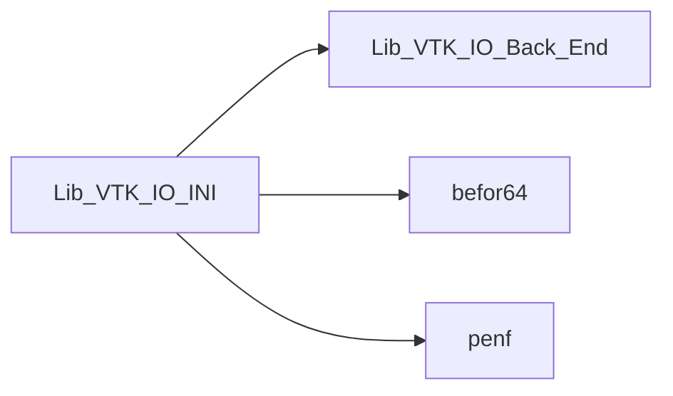
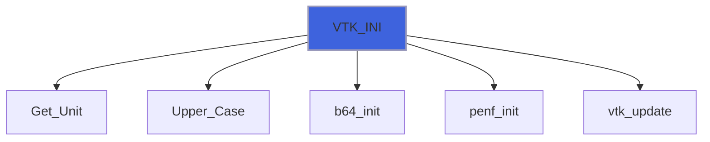

# Lib_VTK_IO_INI

> INI interface definition for Lib_VTK_IO.

**Source**: `src/third_party/VTKFortran/references/legacy/Lib_VTK_IO_INI.f90`

**Dependencies**



## Contents

- [VTK_INI](#vtk-ini)

## Functions

### VTK_INI

Function for initializing VTK-legacy file.

 @note This function must be the first to be called.

### Usage
```fortran
 E_IO=VTK_INI('Binary','example.vtk','VTK legacy file','UNSTRUCTURED_GRID')
```

**Returns**: integer(kind=[I4P](/api/src/third_party/PENF/src/lib/penf_global_parameters_variables))

```fortran
function VTK_INI(fformat, filename, title, mesh_topology, cf) result(E_IO)
```

**Arguments**

| Name | Type | Intent | Attributes | Description |
|------|------|--------|------------|-------------|
| `fformat` | character(len=*) | in |  | Output format: ASCII or RAW. |
| `filename` | character(len=*) | in |  | Name of file. |
| `title` | character(len=*) | in |  | Title. |
| `mesh_topology` | character(len=*) | in |  | Mesh topology. |
| `cf` | integer(kind=[I4P](/api/src/third_party/PENF/src/lib/penf_global_parameters_variables)) | out | optional | Current file index (for concurrent files IO). |

**Call graph**


