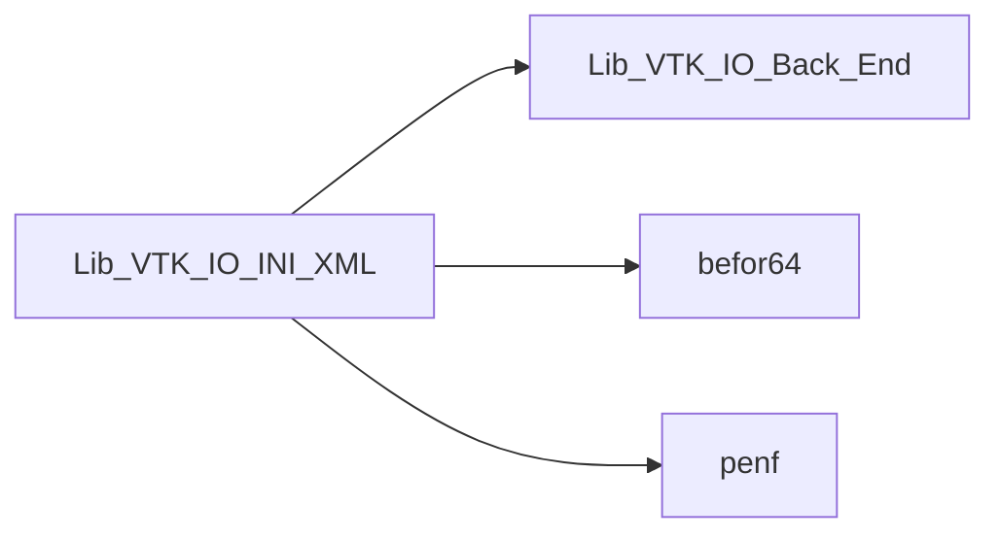
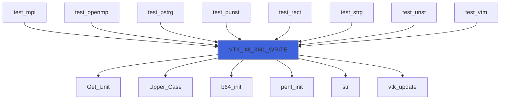
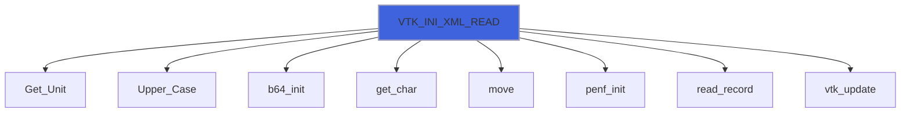

# Lib_VTK_IO_INI_XML

> INI_XML interface definition for Lib_VTK_IO.

**Source**: `src/third_party/VTKFortran/references/legacy/Lib_VTK_IO_INI_XML.f90`

**Dependencies**



## Contents

- [VTK_INI_XML_WRITE](#vtk-ini-xml-write)
- [VTK_INI_XML_READ](#vtk-ini-xml-read)

## Functions

### VTK_INI_XML_WRITE

Procedure for initializing VTK-XML file (exporter).

 The XML standard is more powerful than legacy one. It is flexible but on the other hand is (but not so more using this library
 ...) complex than legacy standard. The output of XML functions is a well-formated valid XML file, at least for the
 ascii, binary and binary appended formats (in the raw-binary format the library uses raw-binary-appended format that is not a
 valid XML file).
 Note that the XML functions have the same name of legacy functions with the suffix *XML*.
 @note This function must be the first to be called.

 Supported output formats are (the passed specifier value is case insensitive):
- ASCII: data are saved in ASCII format;
- BINARY: data are saved in base64 encoded format;
- RAW: data are saved in raw-binary format in the appended tag of the XML file;
- BINARY-APPENDED: data are saved in base64 encoded format in the appended tag of the XML file.
 Supported topologies are:
- RectilinearGrid;
- StructuredGrid;
- UnstructuredGrid.
### Example of usage
```fortran
 integer(I4P):: nx1,nx2,ny1,ny2,nz1,nz2
 ...
 E_IO = VTK_INI_XML('BINARY','XML_RECT_BINARY.vtr','RectilinearGrid',nx1=nx1,nx2=nx2,ny1=ny1,ny2=ny2,nz1=nz1,nz2=nz2)
 ...
```
 Note that the file extension is necessary in the file name. The XML standard has different extensions for each
 different topologies (e.g. *vtr* for rectilinear topology). See the VTK-standard file for more information.

**Returns**: integer(kind=[I4P](/api/src/third_party/PENF/src/lib/penf_global_parameters_variables))

```fortran
function VTK_INI_XML_WRITE(fformat, filename, mesh_topology, nx1, nx2, ny1, ny2, nz1, nz2, cf) result(E_IO)
```

**Arguments**

| Name | Type | Intent | Attributes | Description |
|------|------|--------|------------|-------------|
| `fformat` | character(len=*) | in |  | File format: ASCII, BINARY, RAW or BINARY-APPENDED. |
| `filename` | character(len=*) | in |  | File name. |
| `mesh_topology` | character(len=*) | in |  | Mesh topology. |
| `nx1` | integer(kind=[I4P](/api/src/third_party/PENF/src/lib/penf_global_parameters_variables)) | in | optional | Initial node of x axis. |
| `nx2` | integer(kind=[I4P](/api/src/third_party/PENF/src/lib/penf_global_parameters_variables)) | in | optional | Final node of x axis. |
| `ny1` | integer(kind=[I4P](/api/src/third_party/PENF/src/lib/penf_global_parameters_variables)) | in | optional | Initial node of y axis. |
| `ny2` | integer(kind=[I4P](/api/src/third_party/PENF/src/lib/penf_global_parameters_variables)) | in | optional | Final node of y axis. |
| `nz1` | integer(kind=[I4P](/api/src/third_party/PENF/src/lib/penf_global_parameters_variables)) | in | optional | Initial node of z axis. |
| `nz2` | integer(kind=[I4P](/api/src/third_party/PENF/src/lib/penf_global_parameters_variables)) | in | optional | Final node of z axis. |
| `cf` | integer(kind=[I4P](/api/src/third_party/PENF/src/lib/penf_global_parameters_variables)) | out | optional | Current file index (for concurrent files IO). |

**Call graph**



### VTK_INI_XML_READ

Procedure for initializing VTK-XML file (importer).

 Supported input formats are (the passed specifier value is case insensitive):
- ASCII: data are saved in ASCII format; (Not implemented!)
- BINARY: data are saved in base64 encoded format; (Not tested!)
- RAW: data are saved in raw-binary format in the appended tag of the XML file; (Not implemented!)
- BINARY-APPENDED: data are saved in base64 encoded format in the appended tag of the XML file. (Not implemented!)
 Supported topologies are:
- RectilinearGrid; (Not tested!)
- StructuredGrid; (Not tested!)
- UnstructuredGrid. (Not tested!)
### Example of usage
```fortran
 integer(I4P):: nx1,nx2,ny1,ny2,nz1,nz2
 ...
 E_IO = VTK_INI_XML_READ('BINARY','XML_RECT_BINARY.vtr','RectilinearGrid',nx1=nx1,nx2=nx2,ny1=ny1,ny2=ny2,nz1=nz1,nz2=nz2,cf=rf)
 ...
```
 Note that the file extension is necessary in the file name. The XML standard has different extensions for each
 different topologies (e.g. *vtr* for rectilinear topology). See the VTK-standard file for more information.

**Returns**: integer(kind=[I4P](/api/src/third_party/PENF/src/lib/penf_global_parameters_variables))

```fortran
function VTK_INI_XML_READ(fformat, filename, mesh_topology, npieces, nx1, nx2, ny1, ny2, nz1, nz2, cf) result(E_IO)
```

**Arguments**

| Name | Type | Intent | Attributes | Description |
|------|------|--------|------------|-------------|
| `fformat` | character(len=*) | in |  | File format: ASCII,  BINARY or RAW |
| `filename` | character(len=*) | in |  | File name |
| `mesh_topology` | character(len=*) | in |  | Mesh topology |
| `npieces` | integer(kind=[I4P](/api/src/third_party/PENF/src/lib/penf_global_parameters_variables)) | out | optional | Number of pieces stored in the file |
| `nx1` | integer(kind=[I4P](/api/src/third_party/PENF/src/lib/penf_global_parameters_variables)) | out | optional | Initial node of x axis. |
| `nx2` | integer(kind=[I4P](/api/src/third_party/PENF/src/lib/penf_global_parameters_variables)) | out | optional | Final node of x axis. |
| `ny1` | integer(kind=[I4P](/api/src/third_party/PENF/src/lib/penf_global_parameters_variables)) | out | optional | Initial node of y axis. |
| `ny2` | integer(kind=[I4P](/api/src/third_party/PENF/src/lib/penf_global_parameters_variables)) | out | optional | Final node of y axis. |
| `nz1` | integer(kind=[I4P](/api/src/third_party/PENF/src/lib/penf_global_parameters_variables)) | out | optional | Initial node of z axis. |
| `nz2` | integer(kind=[I4P](/api/src/third_party/PENF/src/lib/penf_global_parameters_variables)) | out | optional | Final node of z axis. |
| `cf` | integer(kind=[I4P](/api/src/third_party/PENF/src/lib/penf_global_parameters_variables)) | out | optional | Current file index (for concurrent files IO). |

**Call graph**


