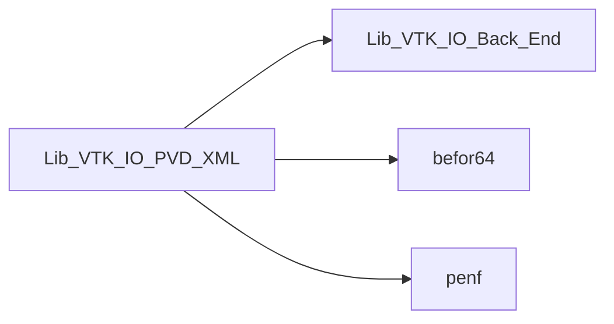
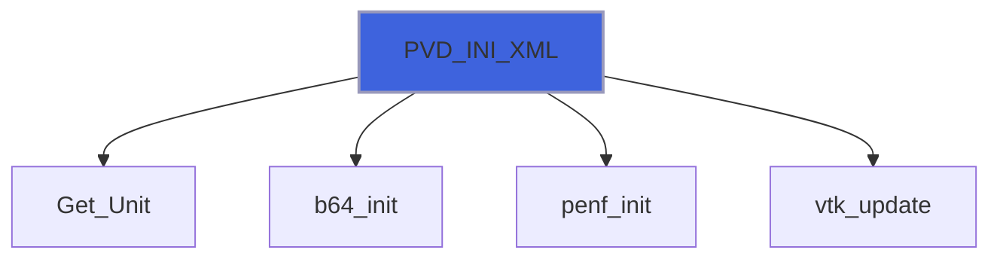
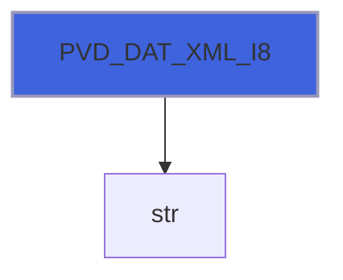
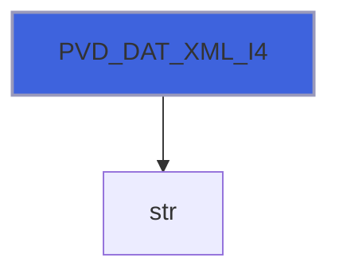
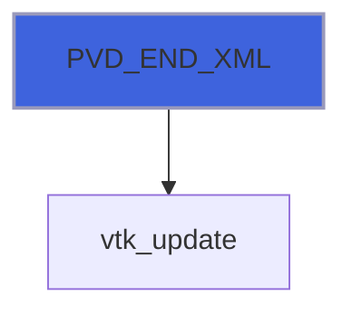

# Lib_VTK_IO_PVD_XML

> PVD_XML interface definitions for Lib_VTK_IO.

**Source**: `src/third_party/VTKFortran/references/legacy/Lib_VTK_IO_PVD_XML.f90`

**Dependencies**



## Contents

- [PVD_DAT_XML](#pvd-dat-xml)
- [PVD_INI_XML](#pvd-ini-xml)
- [PVD_DAT_XML_R8](#pvd-dat-xml-r8)
- [PVD_DAT_XML_R4](#pvd-dat-xml-r4)
- [PVD_DAT_XML_I8](#pvd-dat-xml-i8)
- [PVD_DAT_XML_I4](#pvd-dat-xml-i4)
- [PVD_DAT_XML_I2](#pvd-dat-xml-i2)
- [PVD_DAT_XML_I1](#pvd-dat-xml-i1)
- [PVD_END_XML](#pvd-end-xml)

## Interfaces

### PVD_DAT_XML

Procedure for saving data variable(s) in VTK-XML standard.

 PVD_DAT_XML is an interface to 6 different functions, depending on the datatype of the timestep

### Examples of usage

#### Calling PVD_DAT_XML
```fortran
 integer(I4P):: timestep
 ...
 E_IO=PVD_DAT_XML('file.vtu,timestep)
 ...
```

**Module procedures**: [`PVD_DAT_XML_R8`](/api/src/third_party/VTKFortran/references/legacy/Lib_VTK_IO_PVD_XML#pvd-dat-xml-r8), [`PVD_DAT_XML_R4`](/api/src/third_party/VTKFortran/references/legacy/Lib_VTK_IO_PVD_XML#pvd-dat-xml-r4), [`PVD_DAT_XML_I8`](/api/src/third_party/VTKFortran/references/legacy/Lib_VTK_IO_PVD_XML#pvd-dat-xml-i8), [`PVD_DAT_XML_I4`](/api/src/third_party/VTKFortran/references/legacy/Lib_VTK_IO_PVD_XML#pvd-dat-xml-i4), [`PVD_DAT_XML_I2`](/api/src/third_party/VTKFortran/references/legacy/Lib_VTK_IO_PVD_XML#pvd-dat-xml-i2), [`PVD_DAT_XML_I1`](/api/src/third_party/VTKFortran/references/legacy/Lib_VTK_IO_PVD_XML#pvd-dat-xml-i1)

## Functions

### PVD_INI_XML

Function for initializing a PVD-XML file.

**Returns**: integer(kind=[I4P](/api/src/third_party/PENF/src/lib/penf_global_parameters_variables))

```fortran
function PVD_INI_XML(filename, cf) result(E_IO)
```

**Arguments**

| Name | Type | Intent | Attributes | Description |
|------|------|--------|------------|-------------|
| `filename` | character(len=*) | in |  | File name. |
| `cf` | integer(kind=[I4P](/api/src/third_party/PENF/src/lib/penf_global_parameters_variables)) | out | optional | Current file index (for concurrent files IO). |

**Call graph**



### PVD_DAT_XML_R8

Function for saving of PVD data associated to the sequence of VTK files

**Returns**: integer(kind=[I4P](/api/src/third_party/PENF/src/lib/penf_global_parameters_variables))

```fortran
function PVD_DAT_XML_R8(filename, timestep, part, cf) result(E_IO)
```

**Arguments**

| Name | Type | Intent | Attributes | Description |
|------|------|--------|------------|-------------|
| `filename` | character(len=*) | in |  | Location of saving variables: CELL or NODE centered. |
| `timestep` | real(kind=[R8P](/api/src/third_party/PENF/src/lib/penf_global_parameters_variables)) | in |  | Timestep index |
| `part` | integer(kind=[I4P](/api/src/third_party/PENF/src/lib/penf_global_parameters_variables)) | in | optional | Part index |
| `cf` | integer(kind=[I4P](/api/src/third_party/PENF/src/lib/penf_global_parameters_variables)) | in | optional | Current file index (for concurrent files IO). |

**Call graph**


### PVD_DAT_XML_R4

Function for saving of PVD data associated to the sequence of VTK files

**Returns**: integer(kind=[I4P](/api/src/third_party/PENF/src/lib/penf_global_parameters_variables))

```fortran
function PVD_DAT_XML_R4(filename, timestep, part, cf) result(E_IO)
```

**Arguments**

| Name | Type | Intent | Attributes | Description |
|------|------|--------|------------|-------------|
| `filename` | character(len=*) | in |  | Location of saving variables: CELL or NODE centered. |
| `timestep` | real(kind=[R4P](/api/src/third_party/PENF/src/lib/penf_global_parameters_variables)) | in |  | Timestep index |
| `part` | integer(kind=[I4P](/api/src/third_party/PENF/src/lib/penf_global_parameters_variables)) | in | optional | Part index |
| `cf` | integer(kind=[I4P](/api/src/third_party/PENF/src/lib/penf_global_parameters_variables)) | in | optional | Current file index (for concurrent files IO). |

**Call graph**


### PVD_DAT_XML_I8

Function for saving of PVD data associated to the sequence of VTK files

**Returns**: integer(kind=[I4P](/api/src/third_party/PENF/src/lib/penf_global_parameters_variables))

```fortran
function PVD_DAT_XML_I8(filename, timestep, part, cf) result(E_IO)
```

**Arguments**

| Name | Type | Intent | Attributes | Description |
|------|------|--------|------------|-------------|
| `filename` | character(len=*) | in |  | Location of saving variables: CELL or NODE centered. |
| `timestep` | integer(kind=[I8P](/api/src/third_party/PENF/src/lib/penf_global_parameters_variables)) | in |  | Timestep index |
| `part` | integer(kind=[I4P](/api/src/third_party/PENF/src/lib/penf_global_parameters_variables)) | in | optional | Part index |
| `cf` | integer(kind=[I4P](/api/src/third_party/PENF/src/lib/penf_global_parameters_variables)) | in | optional | Current file index (for concurrent files IO). |

**Call graph**



### PVD_DAT_XML_I4

Function for saving of PVD data associated to the sequence of VTK files

**Returns**: integer(kind=[I4P](/api/src/third_party/PENF/src/lib/penf_global_parameters_variables))

```fortran
function PVD_DAT_XML_I4(filename, timestep, part, cf) result(E_IO)
```

**Arguments**

| Name | Type | Intent | Attributes | Description |
|------|------|--------|------------|-------------|
| `filename` | character(len=*) | in |  | Location of saving variables: CELL or NODE centered. |
| `timestep` | integer(kind=[I4P](/api/src/third_party/PENF/src/lib/penf_global_parameters_variables)) | in |  | Timestep index |
| `part` | integer(kind=[I4P](/api/src/third_party/PENF/src/lib/penf_global_parameters_variables)) | in | optional | Part index |
| `cf` | integer(kind=[I4P](/api/src/third_party/PENF/src/lib/penf_global_parameters_variables)) | in | optional | Current file index (for concurrent files IO). |

**Call graph**



### PVD_DAT_XML_I2

Function for saving of PVD data associated to the sequence of VTK files

**Returns**: integer(kind=[I4P](/api/src/third_party/PENF/src/lib/penf_global_parameters_variables))

```fortran
function PVD_DAT_XML_I2(filename, timestep, part, cf) result(E_IO)
```

**Arguments**

| Name | Type | Intent | Attributes | Description |
|------|------|--------|------------|-------------|
| `filename` | character(len=*) | in |  | Location of saving variables: CELL or NODE centered. |
| `timestep` | integer(kind=[I2P](/api/src/third_party/PENF/src/lib/penf_global_parameters_variables)) | in |  | Timestep index |
| `part` | integer(kind=[I4P](/api/src/third_party/PENF/src/lib/penf_global_parameters_variables)) | in | optional | Part index |
| `cf` | integer(kind=[I4P](/api/src/third_party/PENF/src/lib/penf_global_parameters_variables)) | in | optional | Current file index (for concurrent files IO). |

**Call graph**


### PVD_DAT_XML_I1

Function for saving of PVD data associated to the sequence of VTK files

**Returns**: integer(kind=[I4P](/api/src/third_party/PENF/src/lib/penf_global_parameters_variables))

```fortran
function PVD_DAT_XML_I1(filename, timestep, part, cf) result(E_IO)
```

**Arguments**

| Name | Type | Intent | Attributes | Description |
|------|------|--------|------------|-------------|
| `filename` | character(len=*) | in |  | Location of saving variables: CELL or NODE centered. |
| `timestep` | integer(kind=[I1P](/api/src/third_party/PENF/src/lib/penf_global_parameters_variables)) | in |  | Timestep index |
| `part` | integer(kind=[I4P](/api/src/third_party/PENF/src/lib/penf_global_parameters_variables)) | in | optional | Part index |
| `cf` | integer(kind=[I4P](/api/src/third_party/PENF/src/lib/penf_global_parameters_variables)) | in | optional | Current file index (for concurrent files IO). |

**Call graph**


### PVD_END_XML

Function for finalizing the PVD-XML file.

**Returns**: integer(kind=[I4P](/api/src/third_party/PENF/src/lib/penf_global_parameters_variables))

```fortran
function PVD_END_XML(cf) result(E_IO)
```

**Arguments**

| Name | Type | Intent | Attributes | Description |
|------|------|--------|------------|-------------|
| `cf` | integer(kind=[I4P](/api/src/third_party/PENF/src/lib/penf_global_parameters_variables)) | inout | optional | Current file index (for concurrent files IO). |

**Call graph**


