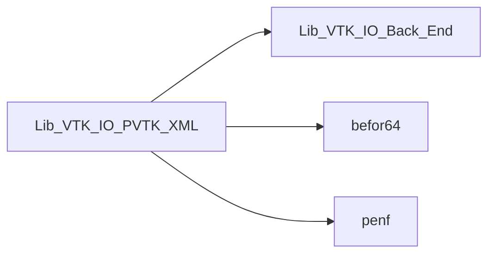
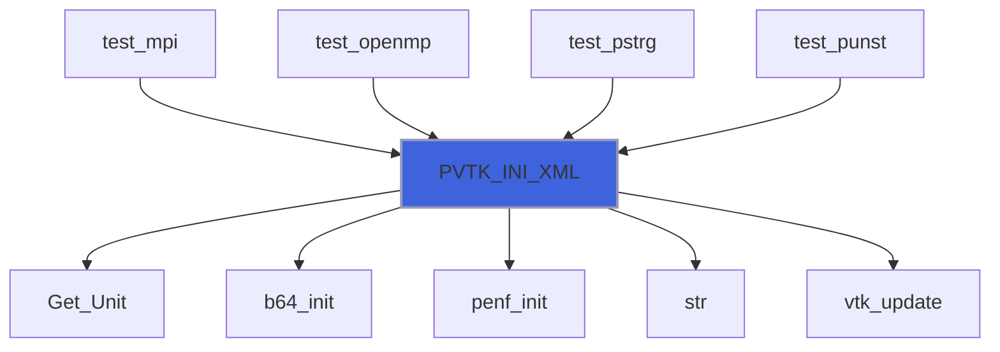
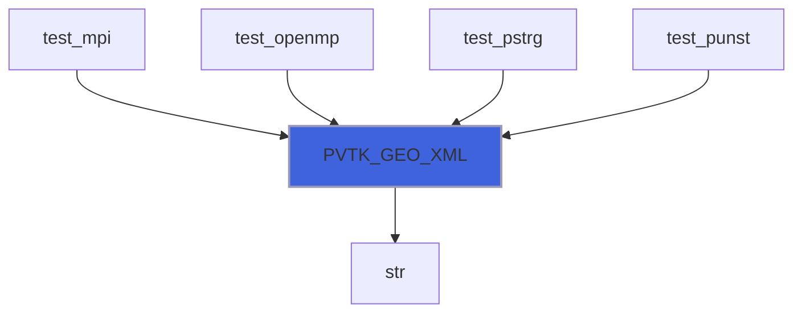
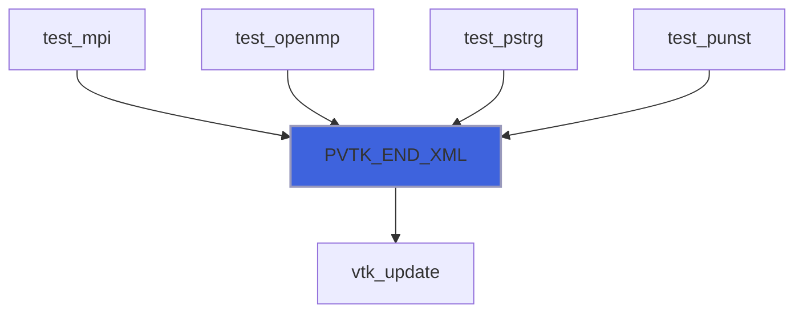

# Lib_VTK_IO_PVTK_XML

> PVTK_XML interface definitions for Lib_VTK_IO.

**Source**: `src/third_party/VTKFortran/references/legacy/Lib_VTK_IO_PVTK_XML.f90`

**Dependencies**



## Contents

- [PVTK_INI_XML](#pvtk-ini-xml)
- [PVTK_GEO_XML](#pvtk-geo-xml)
- [PVTK_DAT_XML](#pvtk-dat-xml)
- [PVTK_VAR_XML](#pvtk-var-xml)
- [PVTK_END_XML](#pvtk-end-xml)

## Functions

### PVTK_INI_XML

Function for initializing parallel (partitioned) VTK-XML file.

**Returns**: integer(kind=[I4P](/api/src/third_party/PENF/src/lib/penf_global_parameters_variables))

```fortran
function PVTK_INI_XML(filename, mesh_topology, tp, cf, nx1, nx2, ny1, ny2, nz1, nz2) result(E_IO)
```

**Arguments**

| Name | Type | Intent | Attributes | Description |
|------|------|--------|------------|-------------|
| `filename` | character(len=*) | in |  | File name. |
| `mesh_topology` | character(len=*) | in |  | Mesh topology. |
| `tp` | character(len=*) | in |  | Type of geometry representation (Float32, Float64, ecc). |
| `cf` | integer(kind=[I4P](/api/src/third_party/PENF/src/lib/penf_global_parameters_variables)) | out | optional | Current file index (for concurrent files IO). |
| `nx1` | integer(kind=[I4P](/api/src/third_party/PENF/src/lib/penf_global_parameters_variables)) | in | optional | Initial node of x axis. |
| `nx2` | integer(kind=[I4P](/api/src/third_party/PENF/src/lib/penf_global_parameters_variables)) | in | optional | Final node of x axis. |
| `ny1` | integer(kind=[I4P](/api/src/third_party/PENF/src/lib/penf_global_parameters_variables)) | in | optional | Initial node of y axis. |
| `ny2` | integer(kind=[I4P](/api/src/third_party/PENF/src/lib/penf_global_parameters_variables)) | in | optional | Final node of y axis. |
| `nz1` | integer(kind=[I4P](/api/src/third_party/PENF/src/lib/penf_global_parameters_variables)) | in | optional | Initial node of z axis. |
| `nz2` | integer(kind=[I4P](/api/src/third_party/PENF/src/lib/penf_global_parameters_variables)) | in | optional | Final node of z axis. |

**Call graph**



### PVTK_GEO_XML

Function for saving piece geometry source for parallel (partitioned) VTK-XML file.

**Returns**: integer(kind=[I4P](/api/src/third_party/PENF/src/lib/penf_global_parameters_variables))

```fortran
function PVTK_GEO_XML(source, cf, nx1, nx2, ny1, ny2, nz1, nz2) result(E_IO)
```

**Arguments**

| Name | Type | Intent | Attributes | Description |
|------|------|--------|------------|-------------|
| `source` | character(len=*) | in |  | Source file name containing the piece data. |
| `cf` | integer(kind=[I4P](/api/src/third_party/PENF/src/lib/penf_global_parameters_variables)) | in | optional | Current file index (for concurrent files IO). |
| `nx1` | integer(kind=[I4P](/api/src/third_party/PENF/src/lib/penf_global_parameters_variables)) | in | optional | Initial node of x axis. |
| `nx2` | integer(kind=[I4P](/api/src/third_party/PENF/src/lib/penf_global_parameters_variables)) | in | optional | Final node of x axis. |
| `ny1` | integer(kind=[I4P](/api/src/third_party/PENF/src/lib/penf_global_parameters_variables)) | in | optional | Initial node of y axis. |
| `ny2` | integer(kind=[I4P](/api/src/third_party/PENF/src/lib/penf_global_parameters_variables)) | in | optional | Final node of y axis. |
| `nz1` | integer(kind=[I4P](/api/src/third_party/PENF/src/lib/penf_global_parameters_variables)) | in | optional | Initial node of z axis. |
| `nz2` | integer(kind=[I4P](/api/src/third_party/PENF/src/lib/penf_global_parameters_variables)) | in | optional | Final node of z axis. |

**Call graph**



### PVTK_DAT_XML

Function for initializing/finalizing the saving of data associated to the mesh.

 Function that **must** be called before saving the data related to geometric mesh, this function initializes the
 saving of data variables indicating the *type* (node or cell centered) of variables that will be saved.

**Returns**: integer(kind=[I4P](/api/src/third_party/PENF/src/lib/penf_global_parameters_variables))

```fortran
function PVTK_DAT_XML(var_location, var_block_action, cf) result(E_IO)
```

**Arguments**

| Name | Type | Intent | Attributes | Description |
|------|------|--------|------------|-------------|
| `var_location` | character(len=*) | in |  | Location of saving variables: CELL or NODE centered. |
| `var_block_action` | character(len=*) | in |  | Variables block action: OPEN or CLOSE block. |
| `cf` | integer(kind=[I4P](/api/src/third_party/PENF/src/lib/penf_global_parameters_variables)) | in | optional | Current file index (for concurrent files IO). |

**Call graph**


### PVTK_VAR_XML

Function for saving variable associated to nodes or cells geometry.

**Returns**: integer(kind=[I4P](/api/src/third_party/PENF/src/lib/penf_global_parameters_variables))

```fortran
function PVTK_VAR_XML(varname, tp, cf, Nc) result(E_IO)
```

**Arguments**

| Name | Type | Intent | Attributes | Description |
|------|------|--------|------------|-------------|
| `varname` | character(len=*) | in |  | Variable name. |
| `tp` | character(len=*) | in |  | Type of data representation (Float32, Float64, ecc). |
| `cf` | integer(kind=[I4P](/api/src/third_party/PENF/src/lib/penf_global_parameters_variables)) | in | optional | Current file index (for concurrent files IO). |
| `Nc` | integer(kind=[I4P](/api/src/third_party/PENF/src/lib/penf_global_parameters_variables)) | in | optional | Number of components of variable. |

**Call graph**


### PVTK_END_XML

Function for finalizing the parallel (partitioned) VTK-XML file.

**Returns**: integer(kind=[I4P](/api/src/third_party/PENF/src/lib/penf_global_parameters_variables))

```fortran
function PVTK_END_XML(cf) result(E_IO)
```

**Arguments**

| Name | Type | Intent | Attributes | Description |
|------|------|--------|------------|-------------|
| `cf` | integer(kind=[I4P](/api/src/third_party/PENF/src/lib/penf_global_parameters_variables)) | inout | optional | Current file index (for concurrent files IO). |

**Call graph**


