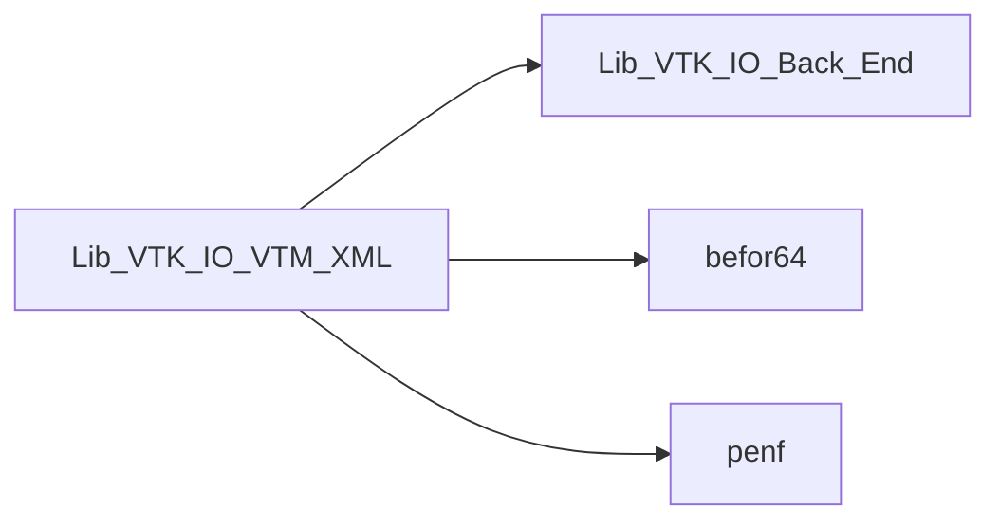
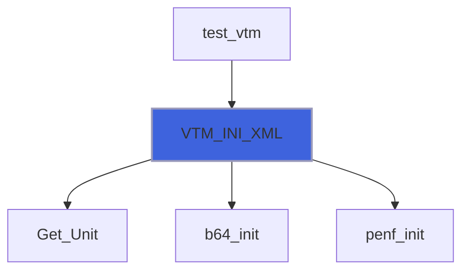
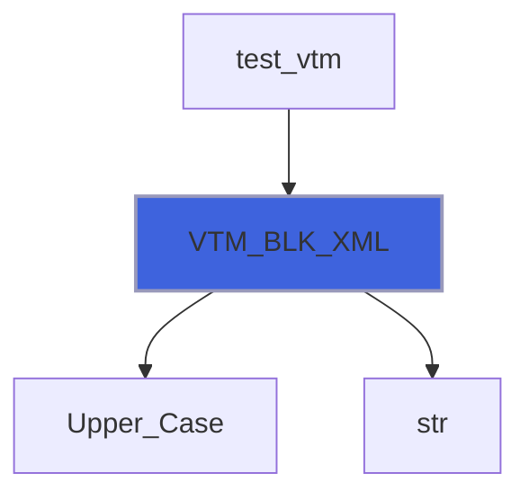
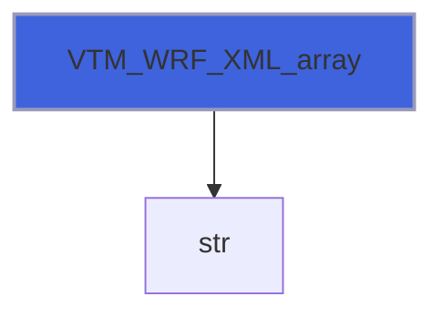
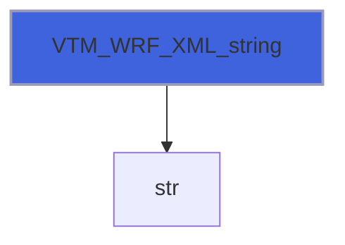
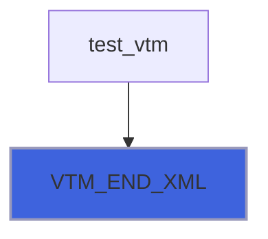

# Lib_VTK_IO_VTM_XML

> VTM_XML interface definitions for Lib_VTK_IO.

**Source**: `src/third_party/VTKFortran/references/legacy/Lib_VTK_IO_VTM_XML.f90`

**Dependencies**



## Contents

- [VTM_WRF_XML](#vtm-wrf-xml)
- [VTM_INI_XML](#vtm-ini-xml)
- [VTM_BLK_XML](#vtm-blk-xml)
- [VTM_WRF_XML_array](#vtm-wrf-xml-array)
- [VTM_WRF_XML_string](#vtm-wrf-xml-string)
- [VTM_END_XML](#vtm-end-xml)

## Interfaces

### VTM_WRF_XML

Procedure for saving the list of VTK-XML wrapped files by a mutliblock VTM file.

 VTK_WRF_XML is an interface to 2 different functions, one for files list passed as an array and one for files list passed
 a single string. If a single string is used, the delimiter of each file can be customized, while the default values is '&'.
### Examples of usage

#### Example with array files list: 3 files block with default delimiter
```fortran
 E_IO = VTK_WRF_XML(flist=['file_1.vts','file_2.vts','file_3.vtu'])
```
#### Example with single string files list: 3 files block with default delimiter
```fortran
 E_IO = VTK_WRF_XML(flist='file_1.vts&file_2.vts&file_3.vtu')
```
#### Example with single string files list: 2 files block with custom delimiter (!!)
```fortran
 E_IO = VTK_WRF_XML(flist='file_1.vts!!file_2.vts',delimiter='!!')
```

**Module procedures**: [`VTM_WRF_XML_array`](/api/src/third_party/VTKFortran/references/legacy/Lib_VTK_IO_VTM_XML#vtm-wrf-xml-array), [`VTM_WRF_XML_string`](/api/src/third_party/VTKFortran/references/legacy/Lib_VTK_IO_VTM_XML#vtm-wrf-xml-string)

## Functions

### VTM_INI_XML

Function for initializing a VTM (VTK Multiblocks) XML file that is a wrapper to a set of VTK-XML files.

**Returns**: integer(kind=[I4P](/api/src/third_party/PENF/src/lib/penf_global_parameters_variables))

```fortran
function VTM_INI_XML(filename) result(E_IO)
```

**Arguments**

| Name | Type | Intent | Attributes | Description |
|------|------|--------|------------|-------------|
| `filename` | character(len=*) | in |  | File name of output VTM file. |

**Call graph**



### VTM_BLK_XML

Function for opening or closing a block level of a VTM file.

**Returns**: integer(kind=[I4P](/api/src/third_party/PENF/src/lib/penf_global_parameters_variables))

```fortran
function VTM_BLK_XML(block_action, name) result(E_IO)
```

**Arguments**

| Name | Type | Intent | Attributes | Description |
|------|------|--------|------------|-------------|
| `block_action` | character(len=*) | in |  | Block action: OPEN or CLOSE block. |
| `name` | character(len=*) | in | optional | Block name. |

**Call graph**



### VTM_WRF_XML_array

Function for saving the list of VTK-XML wrapped files by the actual block of the mutliblock VTM file.

 @note the list is passed as an array.

#### Example of usage: 3 files blocks
```fortran
 E_IO = VTK_WRF_XML(flist=['file_1.vts','file_2.vts','file_3.vtu'])
```

#### Example of usage: 3 files blocks with custom name
```fortran
 E_IO = VTK_WRF_XML(flist=['file_1.vts','file_2.vts','file_3.vtu'],&
                    nlist=['block-bar','block-foo','block-baz'])
```

**Returns**: integer(kind=[I4P](/api/src/third_party/PENF/src/lib/penf_global_parameters_variables))

```fortran
function VTM_WRF_XML_array(nlist, flist) result(E_IO)
```

**Arguments**

| Name | Type | Intent | Attributes | Description |
|------|------|--------|------------|-------------|
| `nlist` | character(len=*) | in | optional | List names attributed to wrapped files. |
| `flist` | character(len=*) | in |  | List of VTK-XML wrapped files. |

**Call graph**



### VTM_WRF_XML_string

Function for saving the list of VTK-XML wrapped files by the actual block of the mutliblock VTM file.

 @note the list is passed as a single string. The delimiter of each file can be customized: default value is "&". For supporting
 compiler with not varying string support the maximum delimiter length is fixed to 50.

### Examples of usage

#### Example: 3 files block with default delimiter
```fortran
 E_IO = VTK_WRF_XML(flist='file_1.vts&file_2.vts&file_3.vtu')
```

#### Example: 3 files block with custom name
```fortran
 E_IO = VTK_WRF_XML(flist='file_1.vts&file_2.vts&file_3.vtu',&
                    nlist='foo&bar&baz')
```

#### Example: 2 files block with custom delimiter (!!)
```fortran
 E_IO = VTK_WRF_XML(flist='file_1.vts!!file_2.vts',delimiter='!!')
```

**Returns**: integer(kind=[I4P](/api/src/third_party/PENF/src/lib/penf_global_parameters_variables))

```fortran
function VTM_WRF_XML_string(delimiter, nlist, flist) result(E_IO)
```

**Arguments**

| Name | Type | Intent | Attributes | Description |
|------|------|--------|------------|-------------|
| `delimiter` | character(len=*) | in | optional | Delimiter of files into files list string. |
| `nlist` | character(len=*) | in | optional | List names attributed to wrapped files. |
| `flist` | character(len=*) | in |  | List of VTK-XML wrapped files. |

**Call graph**



### VTM_END_XML

Function for finalizing the VTM-XML file.

**Returns**: integer(kind=[I4P](/api/src/third_party/PENF/src/lib/penf_global_parameters_variables))

```fortran
function VTM_END_XML() result(E_IO)
```

**Call graph**


