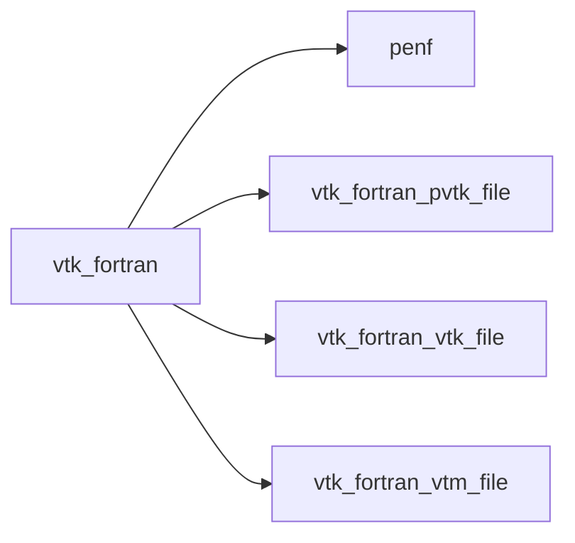

# vtk_fortran

> VTK_Fortran, pure Fortran (2003+) library to parse and emitt VTK files.

**Source**: `src/third_party/VTKFortran/src/lib/vtk_fortran.f90`

**Dependencies**



## Contents

- [write_xml_volatile](#write-xml-volatile)

## Functions

### write_xml_volatile

Write the volatile file into a real file.
 This is what a master process should do into a parallel scenario where it being the only process allowed to access to
 filesystem: slave processes create XML volatile file econded into a characters string and master process collects and writes
 them by means of `write_xml_volatile`.

**Returns**: integer(kind=[I4P](/api/src/third_party/PENF/src/lib/penf_global_parameters_variables))

```fortran
function write_xml_volatile(xml_volatile, filename) result(error)
```

**Arguments**

| Name | Type | Intent | Attributes | Description |
|------|------|--------|------------|-------------|
| `xml_volatile` | character(len=*) | in |  | XML volatile file. |
| `filename` | character(len=*) | in |  | XML file name. |
