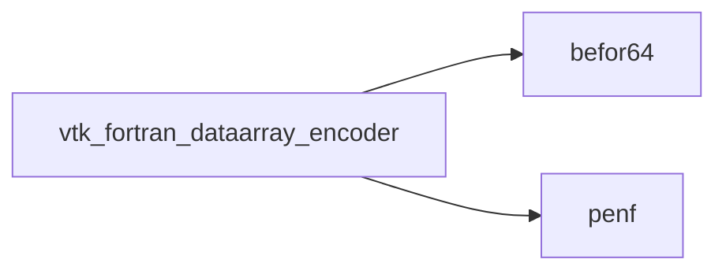
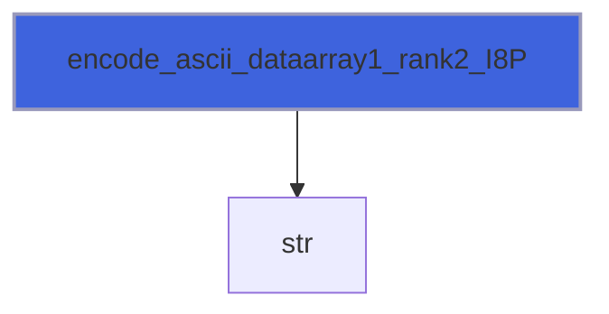

# vtk_fortran_dataarray_encoder

> VTK file XMl writer, ascii local.
 ascii encoder
 binary encoder

**Source**: `src/third_party/VTKFortran/src/lib/vtk_fortran_dataarray_encoder.f90`

**Dependencies**



## Contents

- [encode_ascii_dataarray](#encode-ascii-dataarray)
- [encode_binary_dataarray](#encode-binary-dataarray)
- [encode_ascii_dataarray1_rank1_R16P](#encode-ascii-dataarray1-rank1-r16p)
- [encode_ascii_dataarray1_rank1_R8P](#encode-ascii-dataarray1-rank1-r8p)
- [encode_ascii_dataarray1_rank1_R4P](#encode-ascii-dataarray1-rank1-r4p)
- [encode_ascii_dataarray1_rank1_I8P](#encode-ascii-dataarray1-rank1-i8p)
- [encode_ascii_dataarray1_rank1_I4P](#encode-ascii-dataarray1-rank1-i4p)
- [encode_ascii_dataarray1_rank1_I2P](#encode-ascii-dataarray1-rank1-i2p)
- [encode_ascii_dataarray1_rank1_I1P](#encode-ascii-dataarray1-rank1-i1p)
- [encode_ascii_dataarray1_rank2_R16P](#encode-ascii-dataarray1-rank2-r16p)
- [encode_ascii_dataarray1_rank2_R8P](#encode-ascii-dataarray1-rank2-r8p)
- [encode_ascii_dataarray1_rank2_R4P](#encode-ascii-dataarray1-rank2-r4p)
- [encode_ascii_dataarray1_rank2_I8P](#encode-ascii-dataarray1-rank2-i8p)
- [encode_ascii_dataarray1_rank2_I4P](#encode-ascii-dataarray1-rank2-i4p)
- [encode_ascii_dataarray1_rank2_I2P](#encode-ascii-dataarray1-rank2-i2p)
- [encode_ascii_dataarray1_rank2_I1P](#encode-ascii-dataarray1-rank2-i1p)
- [encode_ascii_dataarray1_rank3_R16P](#encode-ascii-dataarray1-rank3-r16p)
- [encode_ascii_dataarray1_rank3_R8P](#encode-ascii-dataarray1-rank3-r8p)
- [encode_ascii_dataarray1_rank3_R4P](#encode-ascii-dataarray1-rank3-r4p)
- [encode_ascii_dataarray1_rank3_I8P](#encode-ascii-dataarray1-rank3-i8p)
- [encode_ascii_dataarray1_rank3_I4P](#encode-ascii-dataarray1-rank3-i4p)
- [encode_ascii_dataarray1_rank3_I2P](#encode-ascii-dataarray1-rank3-i2p)
- [encode_ascii_dataarray1_rank3_I1P](#encode-ascii-dataarray1-rank3-i1p)
- [encode_ascii_dataarray1_rank4_R16P](#encode-ascii-dataarray1-rank4-r16p)
- [encode_ascii_dataarray1_rank4_R8P](#encode-ascii-dataarray1-rank4-r8p)
- [encode_ascii_dataarray1_rank4_R4P](#encode-ascii-dataarray1-rank4-r4p)
- [encode_ascii_dataarray1_rank4_I8P](#encode-ascii-dataarray1-rank4-i8p)
- [encode_ascii_dataarray1_rank4_I4P](#encode-ascii-dataarray1-rank4-i4p)
- [encode_ascii_dataarray1_rank4_I2P](#encode-ascii-dataarray1-rank4-i2p)
- [encode_ascii_dataarray1_rank4_I1P](#encode-ascii-dataarray1-rank4-i1p)
- [encode_ascii_dataarray3_rank1_R16P](#encode-ascii-dataarray3-rank1-r16p)
- [encode_ascii_dataarray3_rank1_R8P](#encode-ascii-dataarray3-rank1-r8p)
- [encode_ascii_dataarray3_rank1_R4P](#encode-ascii-dataarray3-rank1-r4p)
- [encode_ascii_dataarray3_rank1_I8P](#encode-ascii-dataarray3-rank1-i8p)
- [encode_ascii_dataarray3_rank1_I4P](#encode-ascii-dataarray3-rank1-i4p)
- [encode_ascii_dataarray3_rank1_I2P](#encode-ascii-dataarray3-rank1-i2p)
- [encode_ascii_dataarray3_rank1_I1P](#encode-ascii-dataarray3-rank1-i1p)
- [encode_ascii_dataarray3_rank3_R16P](#encode-ascii-dataarray3-rank3-r16p)
- [encode_ascii_dataarray3_rank3_R8P](#encode-ascii-dataarray3-rank3-r8p)
- [encode_ascii_dataarray3_rank3_R4P](#encode-ascii-dataarray3-rank3-r4p)
- [encode_ascii_dataarray3_rank3_I8P](#encode-ascii-dataarray3-rank3-i8p)
- [encode_ascii_dataarray3_rank3_I4P](#encode-ascii-dataarray3-rank3-i4p)
- [encode_ascii_dataarray3_rank3_I2P](#encode-ascii-dataarray3-rank3-i2p)
- [encode_ascii_dataarray3_rank3_I1P](#encode-ascii-dataarray3-rank3-i1p)
- [encode_ascii_dataarray6_rank1_R16P](#encode-ascii-dataarray6-rank1-r16p)
- [encode_ascii_dataarray6_rank1_R8P](#encode-ascii-dataarray6-rank1-r8p)
- [encode_ascii_dataarray6_rank1_R4P](#encode-ascii-dataarray6-rank1-r4p)
- [encode_ascii_dataarray6_rank1_I8P](#encode-ascii-dataarray6-rank1-i8p)
- [encode_ascii_dataarray6_rank1_I4P](#encode-ascii-dataarray6-rank1-i4p)
- [encode_ascii_dataarray6_rank1_I2P](#encode-ascii-dataarray6-rank1-i2p)
- [encode_ascii_dataarray6_rank1_I1P](#encode-ascii-dataarray6-rank1-i1p)
- [encode_ascii_dataarray6_rank3_R16P](#encode-ascii-dataarray6-rank3-r16p)
- [encode_ascii_dataarray6_rank3_R8P](#encode-ascii-dataarray6-rank3-r8p)
- [encode_ascii_dataarray6_rank3_R4P](#encode-ascii-dataarray6-rank3-r4p)
- [encode_ascii_dataarray6_rank3_I8P](#encode-ascii-dataarray6-rank3-i8p)
- [encode_ascii_dataarray6_rank3_I4P](#encode-ascii-dataarray6-rank3-i4p)
- [encode_ascii_dataarray6_rank3_I2P](#encode-ascii-dataarray6-rank3-i2p)
- [encode_ascii_dataarray6_rank3_I1P](#encode-ascii-dataarray6-rank3-i1p)
- [encode_binary_dataarray1_rank1_R8P](#encode-binary-dataarray1-rank1-r8p)
- [encode_binary_dataarray1_rank1_R4P](#encode-binary-dataarray1-rank1-r4p)
- [encode_binary_dataarray1_rank1_I8P](#encode-binary-dataarray1-rank1-i8p)
- [encode_binary_dataarray1_rank1_I4P](#encode-binary-dataarray1-rank1-i4p)
- [encode_binary_dataarray1_rank1_I2P](#encode-binary-dataarray1-rank1-i2p)
- [encode_binary_dataarray1_rank1_I1P](#encode-binary-dataarray1-rank1-i1p)
- [encode_binary_dataarray1_rank2_R8P](#encode-binary-dataarray1-rank2-r8p)
- [encode_binary_dataarray1_rank2_R4P](#encode-binary-dataarray1-rank2-r4p)
- [encode_binary_dataarray1_rank2_I8P](#encode-binary-dataarray1-rank2-i8p)
- [encode_binary_dataarray1_rank2_I4P](#encode-binary-dataarray1-rank2-i4p)
- [encode_binary_dataarray1_rank2_I2P](#encode-binary-dataarray1-rank2-i2p)
- [encode_binary_dataarray1_rank2_I1P](#encode-binary-dataarray1-rank2-i1p)
- [encode_binary_dataarray1_rank3_R8P](#encode-binary-dataarray1-rank3-r8p)
- [encode_binary_dataarray1_rank3_R4P](#encode-binary-dataarray1-rank3-r4p)
- [encode_binary_dataarray1_rank3_I8P](#encode-binary-dataarray1-rank3-i8p)
- [encode_binary_dataarray1_rank3_I4P](#encode-binary-dataarray1-rank3-i4p)
- [encode_binary_dataarray1_rank3_I2P](#encode-binary-dataarray1-rank3-i2p)
- [encode_binary_dataarray1_rank3_I1P](#encode-binary-dataarray1-rank3-i1p)
- [encode_binary_dataarray1_rank4_R8P](#encode-binary-dataarray1-rank4-r8p)
- [encode_binary_dataarray1_rank4_R4P](#encode-binary-dataarray1-rank4-r4p)
- [encode_binary_dataarray1_rank4_I8P](#encode-binary-dataarray1-rank4-i8p)
- [encode_binary_dataarray1_rank4_I4P](#encode-binary-dataarray1-rank4-i4p)
- [encode_binary_dataarray1_rank4_I2P](#encode-binary-dataarray1-rank4-i2p)
- [encode_binary_dataarray1_rank4_I1P](#encode-binary-dataarray1-rank4-i1p)
- [encode_binary_dataarray3_rank1_R8P](#encode-binary-dataarray3-rank1-r8p)
- [encode_binary_dataarray3_rank1_R4P](#encode-binary-dataarray3-rank1-r4p)
- [encode_binary_dataarray3_rank1_I8P](#encode-binary-dataarray3-rank1-i8p)
- [encode_binary_dataarray3_rank1_I4P](#encode-binary-dataarray3-rank1-i4p)
- [encode_binary_dataarray3_rank1_I2P](#encode-binary-dataarray3-rank1-i2p)
- [encode_binary_dataarray3_rank1_I1P](#encode-binary-dataarray3-rank1-i1p)
- [encode_binary_dataarray3_rank3_R8P](#encode-binary-dataarray3-rank3-r8p)
- [encode_binary_dataarray3_rank3_R4P](#encode-binary-dataarray3-rank3-r4p)
- [encode_binary_dataarray3_rank3_I8P](#encode-binary-dataarray3-rank3-i8p)
- [encode_binary_dataarray3_rank3_I4P](#encode-binary-dataarray3-rank3-i4p)
- [encode_binary_dataarray3_rank3_I2P](#encode-binary-dataarray3-rank3-i2p)
- [encode_binary_dataarray3_rank3_I1P](#encode-binary-dataarray3-rank3-i1p)
- [encode_binary_dataarray6_rank1_R8P](#encode-binary-dataarray6-rank1-r8p)
- [encode_binary_dataarray6_rank1_R4P](#encode-binary-dataarray6-rank1-r4p)
- [encode_binary_dataarray6_rank1_I8P](#encode-binary-dataarray6-rank1-i8p)
- [encode_binary_dataarray6_rank1_I4P](#encode-binary-dataarray6-rank1-i4p)
- [encode_binary_dataarray6_rank1_I2P](#encode-binary-dataarray6-rank1-i2p)
- [encode_binary_dataarray6_rank1_I1P](#encode-binary-dataarray6-rank1-i1p)
- [encode_binary_dataarray6_rank3_R8P](#encode-binary-dataarray6-rank3-r8p)
- [encode_binary_dataarray6_rank3_R4P](#encode-binary-dataarray6-rank3-r4p)
- [encode_binary_dataarray6_rank3_I8P](#encode-binary-dataarray6-rank3-i8p)
- [encode_binary_dataarray6_rank3_I4P](#encode-binary-dataarray6-rank3-i4p)
- [encode_binary_dataarray6_rank3_I2P](#encode-binary-dataarray6-rank3-i2p)
- [encode_binary_dataarray6_rank3_I1P](#encode-binary-dataarray6-rank3-i1p)

## Interfaces

### encode_ascii_dataarray

Ascii DataArray encoder.

**Module procedures**: [`encode_ascii_dataarray1_rank1_R8P`](/api/src/third_party/VTKFortran/src/lib/vtk_fortran_dataarray_encoder#encode-ascii-dataarray1-rank1-r8p), [`encode_ascii_dataarray1_rank1_R4P`](/api/src/third_party/VTKFortran/src/lib/vtk_fortran_dataarray_encoder#encode-ascii-dataarray1-rank1-r4p), [`encode_ascii_dataarray1_rank1_I8P`](/api/src/third_party/VTKFortran/src/lib/vtk_fortran_dataarray_encoder#encode-ascii-dataarray1-rank1-i8p), [`encode_ascii_dataarray1_rank1_I4P`](/api/src/third_party/VTKFortran/src/lib/vtk_fortran_dataarray_encoder#encode-ascii-dataarray1-rank1-i4p), [`encode_ascii_dataarray1_rank1_I2P`](/api/src/third_party/VTKFortran/src/lib/vtk_fortran_dataarray_encoder#encode-ascii-dataarray1-rank1-i2p), [`encode_ascii_dataarray1_rank1_I1P`](/api/src/third_party/VTKFortran/src/lib/vtk_fortran_dataarray_encoder#encode-ascii-dataarray1-rank1-i1p), [`encode_ascii_dataarray1_rank2_R8P`](/api/src/third_party/VTKFortran/src/lib/vtk_fortran_dataarray_encoder#encode-ascii-dataarray1-rank2-r8p), [`encode_ascii_dataarray1_rank2_R4P`](/api/src/third_party/VTKFortran/src/lib/vtk_fortran_dataarray_encoder#encode-ascii-dataarray1-rank2-r4p), [`encode_ascii_dataarray1_rank2_I8P`](/api/src/third_party/VTKFortran/src/lib/vtk_fortran_dataarray_encoder#encode-ascii-dataarray1-rank2-i8p), [`encode_ascii_dataarray1_rank2_I4P`](/api/src/third_party/VTKFortran/src/lib/vtk_fortran_dataarray_encoder#encode-ascii-dataarray1-rank2-i4p), [`encode_ascii_dataarray1_rank2_I2P`](/api/src/third_party/VTKFortran/src/lib/vtk_fortran_dataarray_encoder#encode-ascii-dataarray1-rank2-i2p), [`encode_ascii_dataarray1_rank2_I1P`](/api/src/third_party/VTKFortran/src/lib/vtk_fortran_dataarray_encoder#encode-ascii-dataarray1-rank2-i1p), [`encode_ascii_dataarray1_rank3_R8P`](/api/src/third_party/VTKFortran/src/lib/vtk_fortran_dataarray_encoder#encode-ascii-dataarray1-rank3-r8p), [`encode_ascii_dataarray1_rank3_R4P`](/api/src/third_party/VTKFortran/src/lib/vtk_fortran_dataarray_encoder#encode-ascii-dataarray1-rank3-r4p), [`encode_ascii_dataarray1_rank3_I8P`](/api/src/third_party/VTKFortran/src/lib/vtk_fortran_dataarray_encoder#encode-ascii-dataarray1-rank3-i8p), [`encode_ascii_dataarray1_rank3_I4P`](/api/src/third_party/VTKFortran/src/lib/vtk_fortran_dataarray_encoder#encode-ascii-dataarray1-rank3-i4p), [`encode_ascii_dataarray1_rank3_I2P`](/api/src/third_party/VTKFortran/src/lib/vtk_fortran_dataarray_encoder#encode-ascii-dataarray1-rank3-i2p), [`encode_ascii_dataarray1_rank3_I1P`](/api/src/third_party/VTKFortran/src/lib/vtk_fortran_dataarray_encoder#encode-ascii-dataarray1-rank3-i1p), [`encode_ascii_dataarray1_rank4_R8P`](/api/src/third_party/VTKFortran/src/lib/vtk_fortran_dataarray_encoder#encode-ascii-dataarray1-rank4-r8p), [`encode_ascii_dataarray1_rank4_R4P`](/api/src/third_party/VTKFortran/src/lib/vtk_fortran_dataarray_encoder#encode-ascii-dataarray1-rank4-r4p), [`encode_ascii_dataarray1_rank4_I8P`](/api/src/third_party/VTKFortran/src/lib/vtk_fortran_dataarray_encoder#encode-ascii-dataarray1-rank4-i8p), [`encode_ascii_dataarray1_rank4_I4P`](/api/src/third_party/VTKFortran/src/lib/vtk_fortran_dataarray_encoder#encode-ascii-dataarray1-rank4-i4p), [`encode_ascii_dataarray1_rank4_I2P`](/api/src/third_party/VTKFortran/src/lib/vtk_fortran_dataarray_encoder#encode-ascii-dataarray1-rank4-i2p), [`encode_ascii_dataarray1_rank4_I1P`](/api/src/third_party/VTKFortran/src/lib/vtk_fortran_dataarray_encoder#encode-ascii-dataarray1-rank4-i1p), [`encode_ascii_dataarray3_rank1_R8P`](/api/src/third_party/VTKFortran/src/lib/vtk_fortran_dataarray_encoder#encode-ascii-dataarray3-rank1-r8p), [`encode_ascii_dataarray3_rank1_R4P`](/api/src/third_party/VTKFortran/src/lib/vtk_fortran_dataarray_encoder#encode-ascii-dataarray3-rank1-r4p), [`encode_ascii_dataarray3_rank1_I8P`](/api/src/third_party/VTKFortran/src/lib/vtk_fortran_dataarray_encoder#encode-ascii-dataarray3-rank1-i8p), [`encode_ascii_dataarray3_rank1_I4P`](/api/src/third_party/VTKFortran/src/lib/vtk_fortran_dataarray_encoder#encode-ascii-dataarray3-rank1-i4p), [`encode_ascii_dataarray3_rank1_I2P`](/api/src/third_party/VTKFortran/src/lib/vtk_fortran_dataarray_encoder#encode-ascii-dataarray3-rank1-i2p), [`encode_ascii_dataarray3_rank1_I1P`](/api/src/third_party/VTKFortran/src/lib/vtk_fortran_dataarray_encoder#encode-ascii-dataarray3-rank1-i1p), [`encode_ascii_dataarray3_rank3_R8P`](/api/src/third_party/VTKFortran/src/lib/vtk_fortran_dataarray_encoder#encode-ascii-dataarray3-rank3-r8p), [`encode_ascii_dataarray3_rank3_R4P`](/api/src/third_party/VTKFortran/src/lib/vtk_fortran_dataarray_encoder#encode-ascii-dataarray3-rank3-r4p), [`encode_ascii_dataarray3_rank3_I8P`](/api/src/third_party/VTKFortran/src/lib/vtk_fortran_dataarray_encoder#encode-ascii-dataarray3-rank3-i8p), [`encode_ascii_dataarray3_rank3_I4P`](/api/src/third_party/VTKFortran/src/lib/vtk_fortran_dataarray_encoder#encode-ascii-dataarray3-rank3-i4p), [`encode_ascii_dataarray3_rank3_I2P`](/api/src/third_party/VTKFortran/src/lib/vtk_fortran_dataarray_encoder#encode-ascii-dataarray3-rank3-i2p), [`encode_ascii_dataarray3_rank3_I1P`](/api/src/third_party/VTKFortran/src/lib/vtk_fortran_dataarray_encoder#encode-ascii-dataarray3-rank3-i1p), [`encode_ascii_dataarray6_rank1_R8P`](/api/src/third_party/VTKFortran/src/lib/vtk_fortran_dataarray_encoder#encode-ascii-dataarray6-rank1-r8p), [`encode_ascii_dataarray6_rank1_R4P`](/api/src/third_party/VTKFortran/src/lib/vtk_fortran_dataarray_encoder#encode-ascii-dataarray6-rank1-r4p), [`encode_ascii_dataarray6_rank1_I8P`](/api/src/third_party/VTKFortran/src/lib/vtk_fortran_dataarray_encoder#encode-ascii-dataarray6-rank1-i8p), [`encode_ascii_dataarray6_rank1_I4P`](/api/src/third_party/VTKFortran/src/lib/vtk_fortran_dataarray_encoder#encode-ascii-dataarray6-rank1-i4p), [`encode_ascii_dataarray6_rank1_I2P`](/api/src/third_party/VTKFortran/src/lib/vtk_fortran_dataarray_encoder#encode-ascii-dataarray6-rank1-i2p), [`encode_ascii_dataarray6_rank1_I1P`](/api/src/third_party/VTKFortran/src/lib/vtk_fortran_dataarray_encoder#encode-ascii-dataarray6-rank1-i1p), [`encode_ascii_dataarray6_rank3_R8P`](/api/src/third_party/VTKFortran/src/lib/vtk_fortran_dataarray_encoder#encode-ascii-dataarray6-rank3-r8p), [`encode_ascii_dataarray6_rank3_R4P`](/api/src/third_party/VTKFortran/src/lib/vtk_fortran_dataarray_encoder#encode-ascii-dataarray6-rank3-r4p), [`encode_ascii_dataarray6_rank3_I8P`](/api/src/third_party/VTKFortran/src/lib/vtk_fortran_dataarray_encoder#encode-ascii-dataarray6-rank3-i8p), [`encode_ascii_dataarray6_rank3_I4P`](/api/src/third_party/VTKFortran/src/lib/vtk_fortran_dataarray_encoder#encode-ascii-dataarray6-rank3-i4p), [`encode_ascii_dataarray6_rank3_I2P`](/api/src/third_party/VTKFortran/src/lib/vtk_fortran_dataarray_encoder#encode-ascii-dataarray6-rank3-i2p), [`encode_ascii_dataarray6_rank3_I1P`](/api/src/third_party/VTKFortran/src/lib/vtk_fortran_dataarray_encoder#encode-ascii-dataarray6-rank3-i1p)

### encode_binary_dataarray

Binary (base64) DataArray encoder.

**Module procedures**: [`encode_binary_dataarray1_rank1_R8P`](/api/src/third_party/VTKFortran/src/lib/vtk_fortran_dataarray_encoder#encode-binary-dataarray1-rank1-r8p), [`encode_binary_dataarray1_rank1_R4P`](/api/src/third_party/VTKFortran/src/lib/vtk_fortran_dataarray_encoder#encode-binary-dataarray1-rank1-r4p), [`encode_binary_dataarray1_rank1_I8P`](/api/src/third_party/VTKFortran/src/lib/vtk_fortran_dataarray_encoder#encode-binary-dataarray1-rank1-i8p), [`encode_binary_dataarray1_rank1_I4P`](/api/src/third_party/VTKFortran/src/lib/vtk_fortran_dataarray_encoder#encode-binary-dataarray1-rank1-i4p), [`encode_binary_dataarray1_rank1_I2P`](/api/src/third_party/VTKFortran/src/lib/vtk_fortran_dataarray_encoder#encode-binary-dataarray1-rank1-i2p), [`encode_binary_dataarray1_rank1_I1P`](/api/src/third_party/VTKFortran/src/lib/vtk_fortran_dataarray_encoder#encode-binary-dataarray1-rank1-i1p), [`encode_binary_dataarray1_rank2_R8P`](/api/src/third_party/VTKFortran/src/lib/vtk_fortran_dataarray_encoder#encode-binary-dataarray1-rank2-r8p), [`encode_binary_dataarray1_rank2_R4P`](/api/src/third_party/VTKFortran/src/lib/vtk_fortran_dataarray_encoder#encode-binary-dataarray1-rank2-r4p), [`encode_binary_dataarray1_rank2_I8P`](/api/src/third_party/VTKFortran/src/lib/vtk_fortran_dataarray_encoder#encode-binary-dataarray1-rank2-i8p), [`encode_binary_dataarray1_rank2_I4P`](/api/src/third_party/VTKFortran/src/lib/vtk_fortran_dataarray_encoder#encode-binary-dataarray1-rank2-i4p), [`encode_binary_dataarray1_rank2_I2P`](/api/src/third_party/VTKFortran/src/lib/vtk_fortran_dataarray_encoder#encode-binary-dataarray1-rank2-i2p), [`encode_binary_dataarray1_rank2_I1P`](/api/src/third_party/VTKFortran/src/lib/vtk_fortran_dataarray_encoder#encode-binary-dataarray1-rank2-i1p), [`encode_binary_dataarray1_rank3_R8P`](/api/src/third_party/VTKFortran/src/lib/vtk_fortran_dataarray_encoder#encode-binary-dataarray1-rank3-r8p), [`encode_binary_dataarray1_rank3_R4P`](/api/src/third_party/VTKFortran/src/lib/vtk_fortran_dataarray_encoder#encode-binary-dataarray1-rank3-r4p), [`encode_binary_dataarray1_rank3_I8P`](/api/src/third_party/VTKFortran/src/lib/vtk_fortran_dataarray_encoder#encode-binary-dataarray1-rank3-i8p), [`encode_binary_dataarray1_rank3_I4P`](/api/src/third_party/VTKFortran/src/lib/vtk_fortran_dataarray_encoder#encode-binary-dataarray1-rank3-i4p), [`encode_binary_dataarray1_rank3_I2P`](/api/src/third_party/VTKFortran/src/lib/vtk_fortran_dataarray_encoder#encode-binary-dataarray1-rank3-i2p), [`encode_binary_dataarray1_rank3_I1P`](/api/src/third_party/VTKFortran/src/lib/vtk_fortran_dataarray_encoder#encode-binary-dataarray1-rank3-i1p), [`encode_binary_dataarray1_rank4_R8P`](/api/src/third_party/VTKFortran/src/lib/vtk_fortran_dataarray_encoder#encode-binary-dataarray1-rank4-r8p), [`encode_binary_dataarray1_rank4_R4P`](/api/src/third_party/VTKFortran/src/lib/vtk_fortran_dataarray_encoder#encode-binary-dataarray1-rank4-r4p), [`encode_binary_dataarray1_rank4_I8P`](/api/src/third_party/VTKFortran/src/lib/vtk_fortran_dataarray_encoder#encode-binary-dataarray1-rank4-i8p), [`encode_binary_dataarray1_rank4_I4P`](/api/src/third_party/VTKFortran/src/lib/vtk_fortran_dataarray_encoder#encode-binary-dataarray1-rank4-i4p), [`encode_binary_dataarray1_rank4_I2P`](/api/src/third_party/VTKFortran/src/lib/vtk_fortran_dataarray_encoder#encode-binary-dataarray1-rank4-i2p), [`encode_binary_dataarray1_rank4_I1P`](/api/src/third_party/VTKFortran/src/lib/vtk_fortran_dataarray_encoder#encode-binary-dataarray1-rank4-i1p), [`encode_binary_dataarray3_rank1_R8P`](/api/src/third_party/VTKFortran/src/lib/vtk_fortran_dataarray_encoder#encode-binary-dataarray3-rank1-r8p), [`encode_binary_dataarray3_rank1_R4P`](/api/src/third_party/VTKFortran/src/lib/vtk_fortran_dataarray_encoder#encode-binary-dataarray3-rank1-r4p), [`encode_binary_dataarray3_rank1_I8P`](/api/src/third_party/VTKFortran/src/lib/vtk_fortran_dataarray_encoder#encode-binary-dataarray3-rank1-i8p), [`encode_binary_dataarray3_rank1_I4P`](/api/src/third_party/VTKFortran/src/lib/vtk_fortran_dataarray_encoder#encode-binary-dataarray3-rank1-i4p), [`encode_binary_dataarray3_rank1_I2P`](/api/src/third_party/VTKFortran/src/lib/vtk_fortran_dataarray_encoder#encode-binary-dataarray3-rank1-i2p), [`encode_binary_dataarray3_rank1_I1P`](/api/src/third_party/VTKFortran/src/lib/vtk_fortran_dataarray_encoder#encode-binary-dataarray3-rank1-i1p), [`encode_binary_dataarray3_rank3_R8P`](/api/src/third_party/VTKFortran/src/lib/vtk_fortran_dataarray_encoder#encode-binary-dataarray3-rank3-r8p), [`encode_binary_dataarray3_rank3_R4P`](/api/src/third_party/VTKFortran/src/lib/vtk_fortran_dataarray_encoder#encode-binary-dataarray3-rank3-r4p), [`encode_binary_dataarray3_rank3_I8P`](/api/src/third_party/VTKFortran/src/lib/vtk_fortran_dataarray_encoder#encode-binary-dataarray3-rank3-i8p), [`encode_binary_dataarray3_rank3_I4P`](/api/src/third_party/VTKFortran/src/lib/vtk_fortran_dataarray_encoder#encode-binary-dataarray3-rank3-i4p), [`encode_binary_dataarray3_rank3_I2P`](/api/src/third_party/VTKFortran/src/lib/vtk_fortran_dataarray_encoder#encode-binary-dataarray3-rank3-i2p), [`encode_binary_dataarray3_rank3_I1P`](/api/src/third_party/VTKFortran/src/lib/vtk_fortran_dataarray_encoder#encode-binary-dataarray3-rank3-i1p), [`encode_binary_dataarray6_rank1_R8P`](/api/src/third_party/VTKFortran/src/lib/vtk_fortran_dataarray_encoder#encode-binary-dataarray6-rank1-r8p), [`encode_binary_dataarray6_rank1_R4P`](/api/src/third_party/VTKFortran/src/lib/vtk_fortran_dataarray_encoder#encode-binary-dataarray6-rank1-r4p), [`encode_binary_dataarray6_rank1_I8P`](/api/src/third_party/VTKFortran/src/lib/vtk_fortran_dataarray_encoder#encode-binary-dataarray6-rank1-i8p), [`encode_binary_dataarray6_rank1_I4P`](/api/src/third_party/VTKFortran/src/lib/vtk_fortran_dataarray_encoder#encode-binary-dataarray6-rank1-i4p), [`encode_binary_dataarray6_rank1_I2P`](/api/src/third_party/VTKFortran/src/lib/vtk_fortran_dataarray_encoder#encode-binary-dataarray6-rank1-i2p), [`encode_binary_dataarray6_rank1_I1P`](/api/src/third_party/VTKFortran/src/lib/vtk_fortran_dataarray_encoder#encode-binary-dataarray6-rank1-i1p), [`encode_binary_dataarray6_rank3_R8P`](/api/src/third_party/VTKFortran/src/lib/vtk_fortran_dataarray_encoder#encode-binary-dataarray6-rank3-r8p), [`encode_binary_dataarray6_rank3_R4P`](/api/src/third_party/VTKFortran/src/lib/vtk_fortran_dataarray_encoder#encode-binary-dataarray6-rank3-r4p), [`encode_binary_dataarray6_rank3_I8P`](/api/src/third_party/VTKFortran/src/lib/vtk_fortran_dataarray_encoder#encode-binary-dataarray6-rank3-i8p), [`encode_binary_dataarray6_rank3_I4P`](/api/src/third_party/VTKFortran/src/lib/vtk_fortran_dataarray_encoder#encode-binary-dataarray6-rank3-i4p), [`encode_binary_dataarray6_rank3_I2P`](/api/src/third_party/VTKFortran/src/lib/vtk_fortran_dataarray_encoder#encode-binary-dataarray6-rank3-i2p), [`encode_binary_dataarray6_rank3_I1P`](/api/src/third_party/VTKFortran/src/lib/vtk_fortran_dataarray_encoder#encode-binary-dataarray6-rank3-i1p)

## Functions

### encode_ascii_dataarray1_rank1_R16P

Encode (Base64) a dataarray with 1 components of rank 1 (R8P).

**Returns**: `character(len=:)`

```fortran
function encode_ascii_dataarray1_rank1_R16P(x) result(code)
```

**Arguments**

| Name | Type | Intent | Attributes | Description |
|------|------|--------|------------|-------------|
| `x` | real(kind=[R16P](/api/src/third_party/PENF/src/lib/penf_global_parameters_variables)) | in |  | Data variable. |

**Call graph**


### encode_ascii_dataarray1_rank1_R8P

Encode (Base64) a dataarray with 1 components of rank 1 (R8P).

**Returns**: `character(len=:)`

```fortran
function encode_ascii_dataarray1_rank1_R8P(x) result(code)
```

**Arguments**

| Name | Type | Intent | Attributes | Description |
|------|------|--------|------------|-------------|
| `x` | real(kind=[R8P](/api/src/third_party/PENF/src/lib/penf_global_parameters_variables)) | in |  | Data variable. |

**Call graph**


### encode_ascii_dataarray1_rank1_R4P

Encode (Base64) a dataarray with 1 components of rank 1 (R4P).

**Returns**: `character(len=:)`

```fortran
function encode_ascii_dataarray1_rank1_R4P(x) result(code)
```

**Arguments**

| Name | Type | Intent | Attributes | Description |
|------|------|--------|------------|-------------|
| `x` | real(kind=[R4P](/api/src/third_party/PENF/src/lib/penf_global_parameters_variables)) | in |  | Data variable. |

**Call graph**


### encode_ascii_dataarray1_rank1_I8P

Encode (Base64) a dataarray with 1 components of rank 1 (I8P).

**Returns**: `character(len=:)`

```fortran
function encode_ascii_dataarray1_rank1_I8P(x) result(code)
```

**Arguments**

| Name | Type | Intent | Attributes | Description |
|------|------|--------|------------|-------------|
| `x` | integer(kind=[I8P](/api/src/third_party/PENF/src/lib/penf_global_parameters_variables)) | in |  | Data variable. |

**Call graph**


### encode_ascii_dataarray1_rank1_I4P

Encode (Base64) a dataarray with 1 components of rank 1 (I4P).

**Returns**: `character(len=:)`

```fortran
function encode_ascii_dataarray1_rank1_I4P(x) result(code)
```

**Arguments**

| Name | Type | Intent | Attributes | Description |
|------|------|--------|------------|-------------|
| `x` | integer(kind=[I4P](/api/src/third_party/PENF/src/lib/penf_global_parameters_variables)) | in |  | Data variable. |

**Call graph**


### encode_ascii_dataarray1_rank1_I2P

Encode (Base64) a dataarray with 1 components of rank 1 (I2P).

**Returns**: `character(len=:)`

```fortran
function encode_ascii_dataarray1_rank1_I2P(x) result(code)
```

**Arguments**

| Name | Type | Intent | Attributes | Description |
|------|------|--------|------------|-------------|
| `x` | integer(kind=[I2P](/api/src/third_party/PENF/src/lib/penf_global_parameters_variables)) | in |  | Data variable. |

**Call graph**


### encode_ascii_dataarray1_rank1_I1P

Encode (Base64) a dataarray with 1 components of rank 1 (I1P).

**Returns**: `character(len=:)`

```fortran
function encode_ascii_dataarray1_rank1_I1P(x) result(code)
```

**Arguments**

| Name | Type | Intent | Attributes | Description |
|------|------|--------|------------|-------------|
| `x` | integer(kind=[I1P](/api/src/third_party/PENF/src/lib/penf_global_parameters_variables)) | in |  | Data variable. |

**Call graph**


### encode_ascii_dataarray1_rank2_R16P

Encode (Base64) a dataarray with 1 components of rank 2 (R16P).

**Returns**: `character(len=:)`

```fortran
function encode_ascii_dataarray1_rank2_R16P(x) result(code)
```

**Arguments**

| Name | Type | Intent | Attributes | Description |
|------|------|--------|------------|-------------|
| `x` | real(kind=[R16P](/api/src/third_party/PENF/src/lib/penf_global_parameters_variables)) | in |  | Data variable |

**Call graph**


### encode_ascii_dataarray1_rank2_R8P

Encode (Base64) a dataarray with 1 components of rank 2 (R8P).

**Returns**: `character(len=:)`

```fortran
function encode_ascii_dataarray1_rank2_R8P(x) result(code)
```

**Arguments**

| Name | Type | Intent | Attributes | Description |
|------|------|--------|------------|-------------|
| `x` | real(kind=[R8P](/api/src/third_party/PENF/src/lib/penf_global_parameters_variables)) | in |  | Data variable |

**Call graph**


### encode_ascii_dataarray1_rank2_R4P

Encode (Base64) a dataarray with 1 components of rank 2 (R4P).

**Returns**: `character(len=:)`

```fortran
function encode_ascii_dataarray1_rank2_R4P(x) result(code)
```

**Arguments**

| Name | Type | Intent | Attributes | Description |
|------|------|--------|------------|-------------|
| `x` | real(kind=[R4P](/api/src/third_party/PENF/src/lib/penf_global_parameters_variables)) | in |  | Data variable |

**Call graph**


### encode_ascii_dataarray1_rank2_I8P

Encode (Base64) a dataarray with 1 components of rank 2 (I8P).

**Returns**: `character(len=:)`

```fortran
function encode_ascii_dataarray1_rank2_I8P(x) result(code)
```

**Arguments**

| Name | Type | Intent | Attributes | Description |
|------|------|--------|------------|-------------|
| `x` | integer(kind=[I8P](/api/src/third_party/PENF/src/lib/penf_global_parameters_variables)) | in |  | Data variable |

**Call graph**



### encode_ascii_dataarray1_rank2_I4P

Encode (Base64) a dataarray with 1 components of rank 2 (I4P).

**Returns**: `character(len=:)`

```fortran
function encode_ascii_dataarray1_rank2_I4P(x) result(code)
```

**Arguments**

| Name | Type | Intent | Attributes | Description |
|------|------|--------|------------|-------------|
| `x` | integer(kind=[I4P](/api/src/third_party/PENF/src/lib/penf_global_parameters_variables)) | in |  | Data variable |

**Call graph**


### encode_ascii_dataarray1_rank2_I2P

Encode (Base64) a dataarray with 1 components of rank 2 (I2P).

**Returns**: `character(len=:)`

```fortran
function encode_ascii_dataarray1_rank2_I2P(x) result(code)
```

**Arguments**

| Name | Type | Intent | Attributes | Description |
|------|------|--------|------------|-------------|
| `x` | integer(kind=[I2P](/api/src/third_party/PENF/src/lib/penf_global_parameters_variables)) | in |  | Data variable |

**Call graph**


### encode_ascii_dataarray1_rank2_I1P

Encode (Base64) a dataarray with 1 components of rank 2 (I2P).

**Returns**: `character(len=:)`

```fortran
function encode_ascii_dataarray1_rank2_I1P(x) result(code)
```

**Arguments**

| Name | Type | Intent | Attributes | Description |
|------|------|--------|------------|-------------|
| `x` | integer(kind=[I1P](/api/src/third_party/PENF/src/lib/penf_global_parameters_variables)) | in |  | Data variable |

**Call graph**


### encode_ascii_dataarray1_rank3_R16P

Encode (Base64) a dataarray with 1 components of rank 3 (R16P).

**Returns**: `character(len=:)`

```fortran
function encode_ascii_dataarray1_rank3_R16P(x) result(code)
```

**Arguments**

| Name | Type | Intent | Attributes | Description |
|------|------|--------|------------|-------------|
| `x` | real(kind=[R16P](/api/src/third_party/PENF/src/lib/penf_global_parameters_variables)) | in |  | Data variable |

**Call graph**


### encode_ascii_dataarray1_rank3_R8P

Encode (Base64) a dataarray with 1 components of rank 3 (R8P).

**Returns**: `character(len=:)`

```fortran
function encode_ascii_dataarray1_rank3_R8P(x) result(code)
```

**Arguments**

| Name | Type | Intent | Attributes | Description |
|------|------|--------|------------|-------------|
| `x` | real(kind=[R8P](/api/src/third_party/PENF/src/lib/penf_global_parameters_variables)) | in |  | Data variable |

**Call graph**


### encode_ascii_dataarray1_rank3_R4P

Encode (Base64) a dataarray with 1 components of rank 3 (R4P).

**Returns**: `character(len=:)`

```fortran
function encode_ascii_dataarray1_rank3_R4P(x) result(code)
```

**Arguments**

| Name | Type | Intent | Attributes | Description |
|------|------|--------|------------|-------------|
| `x` | real(kind=[R4P](/api/src/third_party/PENF/src/lib/penf_global_parameters_variables)) | in |  | Data variable |

**Call graph**


### encode_ascii_dataarray1_rank3_I8P

Encode (Base64) a dataarray with 1 components of rank 3 (I8P).

**Returns**: `character(len=:)`

```fortran
function encode_ascii_dataarray1_rank3_I8P(x) result(code)
```

**Arguments**

| Name | Type | Intent | Attributes | Description |
|------|------|--------|------------|-------------|
| `x` | integer(kind=[I8P](/api/src/third_party/PENF/src/lib/penf_global_parameters_variables)) | in |  | Data variable |

**Call graph**


### encode_ascii_dataarray1_rank3_I4P

Encode (Base64) a dataarray with 1 components of rank 3 (I4P).

**Returns**: `character(len=:)`

```fortran
function encode_ascii_dataarray1_rank3_I4P(x) result(code)
```

**Arguments**

| Name | Type | Intent | Attributes | Description |
|------|------|--------|------------|-------------|
| `x` | integer(kind=[I4P](/api/src/third_party/PENF/src/lib/penf_global_parameters_variables)) | in |  | Data variable |

**Call graph**


### encode_ascii_dataarray1_rank3_I2P

Encode (Base64) a dataarray with 1 components of rank 3 (I2P).

**Returns**: `character(len=:)`

```fortran
function encode_ascii_dataarray1_rank3_I2P(x) result(code)
```

**Arguments**

| Name | Type | Intent | Attributes | Description |
|------|------|--------|------------|-------------|
| `x` | integer(kind=[I2P](/api/src/third_party/PENF/src/lib/penf_global_parameters_variables)) | in |  | Data variable |

**Call graph**

```mermaid
flowchart TD
  encode_ascii_dataarray1_rank3_I2P["encode_ascii_dataarray1_rank3_I2P"] --> str["str"]
  style encode_ascii_dataarray1_rank3_I2P fill:#3e63dd,stroke:#99b,stroke-width:2px
```

### encode_ascii_dataarray1_rank3_I1P

Encode (Base64) a dataarray with 1 components of rank 3 (I1P).

**Returns**: `character(len=:)`

```fortran
function encode_ascii_dataarray1_rank3_I1P(x) result(code)
```

**Arguments**

| Name | Type | Intent | Attributes | Description |
|------|------|--------|------------|-------------|
| `x` | integer(kind=[I1P](/api/src/third_party/PENF/src/lib/penf_global_parameters_variables)) | in |  | Data variable |

**Call graph**

```mermaid
flowchart TD
  encode_ascii_dataarray1_rank3_I1P["encode_ascii_dataarray1_rank3_I1P"] --> str["str"]
  style encode_ascii_dataarray1_rank3_I1P fill:#3e63dd,stroke:#99b,stroke-width:2px
```

### encode_ascii_dataarray1_rank4_R16P

Encode (Base64) a dataarray with 1 components of rank 4 (R16P).

**Returns**: `character(len=:)`

```fortran
function encode_ascii_dataarray1_rank4_R16P(x) result(code)
```

**Arguments**

| Name | Type | Intent | Attributes | Description |
|------|------|--------|------------|-------------|
| `x` | real(kind=[R16P](/api/src/third_party/PENF/src/lib/penf_global_parameters_variables)) | in |  | Data variable. |

**Call graph**

```mermaid
flowchart TD
  encode_ascii_dataarray1_rank4_R16P["encode_ascii_dataarray1_rank4_R16P"] --> str["str"]
  style encode_ascii_dataarray1_rank4_R16P fill:#3e63dd,stroke:#99b,stroke-width:2px
```

### encode_ascii_dataarray1_rank4_R8P

Encode (Base64) a dataarray with 1 components of rank 4 (R8P).

**Returns**: `character(len=:)`

```fortran
function encode_ascii_dataarray1_rank4_R8P(x) result(code)
```

**Arguments**

| Name | Type | Intent | Attributes | Description |
|------|------|--------|------------|-------------|
| `x` | real(kind=[R8P](/api/src/third_party/PENF/src/lib/penf_global_parameters_variables)) | in |  | Data variable. |

**Call graph**

```mermaid
flowchart TD
  encode_ascii_dataarray1_rank4_R8P["encode_ascii_dataarray1_rank4_R8P"] --> str["str"]
  style encode_ascii_dataarray1_rank4_R8P fill:#3e63dd,stroke:#99b,stroke-width:2px
```

### encode_ascii_dataarray1_rank4_R4P

Encode (Base64) a dataarray with 1 components of rank 4 (R4P).

**Returns**: `character(len=:)`

```fortran
function encode_ascii_dataarray1_rank4_R4P(x) result(code)
```

**Arguments**

| Name | Type | Intent | Attributes | Description |
|------|------|--------|------------|-------------|
| `x` | real(kind=[R4P](/api/src/third_party/PENF/src/lib/penf_global_parameters_variables)) | in |  | Data variable. |

**Call graph**

```mermaid
flowchart TD
  encode_ascii_dataarray1_rank4_R4P["encode_ascii_dataarray1_rank4_R4P"] --> str["str"]
  style encode_ascii_dataarray1_rank4_R4P fill:#3e63dd,stroke:#99b,stroke-width:2px
```

### encode_ascii_dataarray1_rank4_I8P

Encode (Base64) a dataarray with 1 components of rank 4 (I8P).

**Returns**: `character(len=:)`

```fortran
function encode_ascii_dataarray1_rank4_I8P(x) result(code)
```

**Arguments**

| Name | Type | Intent | Attributes | Description |
|------|------|--------|------------|-------------|
| `x` | integer(kind=[I8P](/api/src/third_party/PENF/src/lib/penf_global_parameters_variables)) | in |  | Data variable. |

**Call graph**

```mermaid
flowchart TD
  encode_ascii_dataarray1_rank4_I8P["encode_ascii_dataarray1_rank4_I8P"] --> str["str"]
  style encode_ascii_dataarray1_rank4_I8P fill:#3e63dd,stroke:#99b,stroke-width:2px
```

### encode_ascii_dataarray1_rank4_I4P

Encode (Base64) a dataarray with 1 components of rank 4 (I4P).

**Returns**: `character(len=:)`

```fortran
function encode_ascii_dataarray1_rank4_I4P(x) result(code)
```

**Arguments**

| Name | Type | Intent | Attributes | Description |
|------|------|--------|------------|-------------|
| `x` | integer(kind=[I4P](/api/src/third_party/PENF/src/lib/penf_global_parameters_variables)) | in |  | Data variable. |

**Call graph**

```mermaid
flowchart TD
  encode_ascii_dataarray1_rank4_I4P["encode_ascii_dataarray1_rank4_I4P"] --> str["str"]
  style encode_ascii_dataarray1_rank4_I4P fill:#3e63dd,stroke:#99b,stroke-width:2px
```

### encode_ascii_dataarray1_rank4_I2P

Encode (Base64) a dataarray with 1 components of rank 4 (I2P).

**Returns**: `character(len=:)`

```fortran
function encode_ascii_dataarray1_rank4_I2P(x) result(code)
```

**Arguments**

| Name | Type | Intent | Attributes | Description |
|------|------|--------|------------|-------------|
| `x` | integer(kind=[I2P](/api/src/third_party/PENF/src/lib/penf_global_parameters_variables)) | in |  | Data variable. |

**Call graph**

```mermaid
flowchart TD
  encode_ascii_dataarray1_rank4_I2P["encode_ascii_dataarray1_rank4_I2P"] --> str["str"]
  style encode_ascii_dataarray1_rank4_I2P fill:#3e63dd,stroke:#99b,stroke-width:2px
```

### encode_ascii_dataarray1_rank4_I1P

Encode (Base64) a dataarray with 1 components of rank 4 (I1P).

**Returns**: `character(len=:)`

```fortran
function encode_ascii_dataarray1_rank4_I1P(x) result(code)
```

**Arguments**

| Name | Type | Intent | Attributes | Description |
|------|------|--------|------------|-------------|
| `x` | integer(kind=[I1P](/api/src/third_party/PENF/src/lib/penf_global_parameters_variables)) | in |  | Data variable. |

**Call graph**

```mermaid
flowchart TD
  encode_ascii_dataarray1_rank4_I1P["encode_ascii_dataarray1_rank4_I1P"] --> str["str"]
  style encode_ascii_dataarray1_rank4_I1P fill:#3e63dd,stroke:#99b,stroke-width:2px
```

### encode_ascii_dataarray3_rank1_R16P

Encode (Base64) a dataarray with 3 components of rank 1 (R16P).

**Returns**: `character(len=:)`

```fortran
function encode_ascii_dataarray3_rank1_R16P(x, y, z) result(code)
```

**Arguments**

| Name | Type | Intent | Attributes | Description |
|------|------|--------|------------|-------------|
| `x` | real(kind=[R16P](/api/src/third_party/PENF/src/lib/penf_global_parameters_variables)) | in |  | X component. |
| `y` | real(kind=[R16P](/api/src/third_party/PENF/src/lib/penf_global_parameters_variables)) | in |  | Y component. |
| `z` | real(kind=[R16P](/api/src/third_party/PENF/src/lib/penf_global_parameters_variables)) | in |  | Z component. |

**Call graph**

```mermaid
flowchart TD
  encode_ascii_dataarray3_rank1_R16P["encode_ascii_dataarray3_rank1_R16P"] --> str["str"]
  style encode_ascii_dataarray3_rank1_R16P fill:#3e63dd,stroke:#99b,stroke-width:2px
```

### encode_ascii_dataarray3_rank1_R8P

Encode (Base64) a dataarray with 3 components of rank 1 (R8P).

**Returns**: `character(len=:)`

```fortran
function encode_ascii_dataarray3_rank1_R8P(x, y, z) result(code)
```

**Arguments**

| Name | Type | Intent | Attributes | Description |
|------|------|--------|------------|-------------|
| `x` | real(kind=[R8P](/api/src/third_party/PENF/src/lib/penf_global_parameters_variables)) | in |  | X component. |
| `y` | real(kind=[R8P](/api/src/third_party/PENF/src/lib/penf_global_parameters_variables)) | in |  | Y component. |
| `z` | real(kind=[R8P](/api/src/third_party/PENF/src/lib/penf_global_parameters_variables)) | in |  | Z component. |

**Call graph**

```mermaid
flowchart TD
  encode_ascii_dataarray3_rank1_R8P["encode_ascii_dataarray3_rank1_R8P"] --> str["str"]
  style encode_ascii_dataarray3_rank1_R8P fill:#3e63dd,stroke:#99b,stroke-width:2px
```

### encode_ascii_dataarray3_rank1_R4P

Encode (Base64) a dataarray with 3 components of rank 1 (R4P).

**Returns**: `character(len=:)`

```fortran
function encode_ascii_dataarray3_rank1_R4P(x, y, z) result(code)
```

**Arguments**

| Name | Type | Intent | Attributes | Description |
|------|------|--------|------------|-------------|
| `x` | real(kind=[R4P](/api/src/third_party/PENF/src/lib/penf_global_parameters_variables)) | in |  | X component. |
| `y` | real(kind=[R4P](/api/src/third_party/PENF/src/lib/penf_global_parameters_variables)) | in |  | Y component. |
| `z` | real(kind=[R4P](/api/src/third_party/PENF/src/lib/penf_global_parameters_variables)) | in |  | Z component. |

**Call graph**

```mermaid
flowchart TD
  encode_ascii_dataarray3_rank1_R4P["encode_ascii_dataarray3_rank1_R4P"] --> str["str"]
  style encode_ascii_dataarray3_rank1_R4P fill:#3e63dd,stroke:#99b,stroke-width:2px
```

### encode_ascii_dataarray3_rank1_I8P

Encode (Base64) a dataarray with 3 components of rank 1 (I8P).

**Returns**: `character(len=:)`

```fortran
function encode_ascii_dataarray3_rank1_I8P(x, y, z) result(code)
```

**Arguments**

| Name | Type | Intent | Attributes | Description |
|------|------|--------|------------|-------------|
| `x` | integer(kind=[I8P](/api/src/third_party/PENF/src/lib/penf_global_parameters_variables)) | in |  | X component. |
| `y` | integer(kind=[I8P](/api/src/third_party/PENF/src/lib/penf_global_parameters_variables)) | in |  | Y component. |
| `z` | integer(kind=[I8P](/api/src/third_party/PENF/src/lib/penf_global_parameters_variables)) | in |  | Z component. |

**Call graph**

```mermaid
flowchart TD
  encode_ascii_dataarray3_rank1_I8P["encode_ascii_dataarray3_rank1_I8P"] --> str["str"]
  style encode_ascii_dataarray3_rank1_I8P fill:#3e63dd,stroke:#99b,stroke-width:2px
```

### encode_ascii_dataarray3_rank1_I4P

Encode (Base64) a dataarray with 3 components of rank 1 (I4P).

**Returns**: `character(len=:)`

```fortran
function encode_ascii_dataarray3_rank1_I4P(x, y, z) result(code)
```

**Arguments**

| Name | Type | Intent | Attributes | Description |
|------|------|--------|------------|-------------|
| `x` | integer(kind=[I4P](/api/src/third_party/PENF/src/lib/penf_global_parameters_variables)) | in |  | X component. |
| `y` | integer(kind=[I4P](/api/src/third_party/PENF/src/lib/penf_global_parameters_variables)) | in |  | Y component. |
| `z` | integer(kind=[I4P](/api/src/third_party/PENF/src/lib/penf_global_parameters_variables)) | in |  | Z component. |

**Call graph**

```mermaid
flowchart TD
  encode_ascii_dataarray3_rank1_I4P["encode_ascii_dataarray3_rank1_I4P"] --> str["str"]
  style encode_ascii_dataarray3_rank1_I4P fill:#3e63dd,stroke:#99b,stroke-width:2px
```

### encode_ascii_dataarray3_rank1_I2P

Encode (Base64) a dataarray with 3 components of rank 1 (I2P).

**Returns**: `character(len=:)`

```fortran
function encode_ascii_dataarray3_rank1_I2P(x, y, z) result(code)
```

**Arguments**

| Name | Type | Intent | Attributes | Description |
|------|------|--------|------------|-------------|
| `x` | integer(kind=[I2P](/api/src/third_party/PENF/src/lib/penf_global_parameters_variables)) | in |  | X component. |
| `y` | integer(kind=[I2P](/api/src/third_party/PENF/src/lib/penf_global_parameters_variables)) | in |  | Y component. |
| `z` | integer(kind=[I2P](/api/src/third_party/PENF/src/lib/penf_global_parameters_variables)) | in |  | Z component. |

**Call graph**

```mermaid
flowchart TD
  encode_ascii_dataarray3_rank1_I2P["encode_ascii_dataarray3_rank1_I2P"] --> str["str"]
  style encode_ascii_dataarray3_rank1_I2P fill:#3e63dd,stroke:#99b,stroke-width:2px
```

### encode_ascii_dataarray3_rank1_I1P

Encode (Base64) a dataarray with 3 components of rank 1 (I1P).

**Returns**: `character(len=:)`

```fortran
function encode_ascii_dataarray3_rank1_I1P(x, y, z) result(code)
```

**Arguments**

| Name | Type | Intent | Attributes | Description |
|------|------|--------|------------|-------------|
| `x` | integer(kind=[I1P](/api/src/third_party/PENF/src/lib/penf_global_parameters_variables)) | in |  | X component. |
| `y` | integer(kind=[I1P](/api/src/third_party/PENF/src/lib/penf_global_parameters_variables)) | in |  | Y component. |
| `z` | integer(kind=[I1P](/api/src/third_party/PENF/src/lib/penf_global_parameters_variables)) | in |  | Z component. |

**Call graph**

```mermaid
flowchart TD
  encode_ascii_dataarray3_rank1_I1P["encode_ascii_dataarray3_rank1_I1P"] --> str["str"]
  style encode_ascii_dataarray3_rank1_I1P fill:#3e63dd,stroke:#99b,stroke-width:2px
```

### encode_ascii_dataarray3_rank3_R16P

Encode (Base64) a dataarray with 3 components of rank 3 (R8P).

**Returns**: `character(len=:)`

```fortran
function encode_ascii_dataarray3_rank3_R16P(x, y, z) result(code)
```

**Arguments**

| Name | Type | Intent | Attributes | Description |
|------|------|--------|------------|-------------|
| `x` | real(kind=[R16P](/api/src/third_party/PENF/src/lib/penf_global_parameters_variables)) | in |  | X component. |
| `y` | real(kind=[R16P](/api/src/third_party/PENF/src/lib/penf_global_parameters_variables)) | in |  | Y component. |
| `z` | real(kind=[R16P](/api/src/third_party/PENF/src/lib/penf_global_parameters_variables)) | in |  | Z component. |

**Call graph**

```mermaid
flowchart TD
  encode_ascii_dataarray3_rank3_R16P["encode_ascii_dataarray3_rank3_R16P"] --> str["str"]
  style encode_ascii_dataarray3_rank3_R16P fill:#3e63dd,stroke:#99b,stroke-width:2px
```

### encode_ascii_dataarray3_rank3_R8P

Encode (Base64) a dataarray with 3 components of rank 3 (R8P).

**Returns**: `character(len=:)`

```fortran
function encode_ascii_dataarray3_rank3_R8P(x, y, z) result(code)
```

**Arguments**

| Name | Type | Intent | Attributes | Description |
|------|------|--------|------------|-------------|
| `x` | real(kind=[R8P](/api/src/third_party/PENF/src/lib/penf_global_parameters_variables)) | in |  | X component. |
| `y` | real(kind=[R8P](/api/src/third_party/PENF/src/lib/penf_global_parameters_variables)) | in |  | Y component. |
| `z` | real(kind=[R8P](/api/src/third_party/PENF/src/lib/penf_global_parameters_variables)) | in |  | Z component. |

**Call graph**

```mermaid
flowchart TD
  encode_ascii_dataarray3_rank3_R8P["encode_ascii_dataarray3_rank3_R8P"] --> str["str"]
  style encode_ascii_dataarray3_rank3_R8P fill:#3e63dd,stroke:#99b,stroke-width:2px
```

### encode_ascii_dataarray3_rank3_R4P

Encode (Base64) a dataarray with 3 components of rank 3 (R4P).

**Returns**: `character(len=:)`

```fortran
function encode_ascii_dataarray3_rank3_R4P(x, y, z) result(code)
```

**Arguments**

| Name | Type | Intent | Attributes | Description |
|------|------|--------|------------|-------------|
| `x` | real(kind=[R4P](/api/src/third_party/PENF/src/lib/penf_global_parameters_variables)) | in |  | X component. |
| `y` | real(kind=[R4P](/api/src/third_party/PENF/src/lib/penf_global_parameters_variables)) | in |  | Y component. |
| `z` | real(kind=[R4P](/api/src/third_party/PENF/src/lib/penf_global_parameters_variables)) | in |  | Z component. |

**Call graph**

```mermaid
flowchart TD
  encode_ascii_dataarray3_rank3_R4P["encode_ascii_dataarray3_rank3_R4P"] --> str["str"]
  style encode_ascii_dataarray3_rank3_R4P fill:#3e63dd,stroke:#99b,stroke-width:2px
```

### encode_ascii_dataarray3_rank3_I8P

Encode (Base64) a dataarray with 3 components of rank 3 (I8P).

**Returns**: `character(len=:)`

```fortran
function encode_ascii_dataarray3_rank3_I8P(x, y, z) result(code)
```

**Arguments**

| Name | Type | Intent | Attributes | Description |
|------|------|--------|------------|-------------|
| `x` | integer(kind=[I8P](/api/src/third_party/PENF/src/lib/penf_global_parameters_variables)) | in |  | X component. |
| `y` | integer(kind=[I8P](/api/src/third_party/PENF/src/lib/penf_global_parameters_variables)) | in |  | Y component. |
| `z` | integer(kind=[I8P](/api/src/third_party/PENF/src/lib/penf_global_parameters_variables)) | in |  | Z component. |

**Call graph**

```mermaid
flowchart TD
  encode_ascii_dataarray3_rank3_I8P["encode_ascii_dataarray3_rank3_I8P"] --> str["str"]
  style encode_ascii_dataarray3_rank3_I8P fill:#3e63dd,stroke:#99b,stroke-width:2px
```

### encode_ascii_dataarray3_rank3_I4P

Encode (Base64) a dataarray with 3 components of rank 3 (I4P).

**Returns**: `character(len=:)`

```fortran
function encode_ascii_dataarray3_rank3_I4P(x, y, z) result(code)
```

**Arguments**

| Name | Type | Intent | Attributes | Description |
|------|------|--------|------------|-------------|
| `x` | integer(kind=[I4P](/api/src/third_party/PENF/src/lib/penf_global_parameters_variables)) | in |  | X component. |
| `y` | integer(kind=[I4P](/api/src/third_party/PENF/src/lib/penf_global_parameters_variables)) | in |  | Y component. |
| `z` | integer(kind=[I4P](/api/src/third_party/PENF/src/lib/penf_global_parameters_variables)) | in |  | Z component. |

**Call graph**

```mermaid
flowchart TD
  encode_ascii_dataarray3_rank3_I4P["encode_ascii_dataarray3_rank3_I4P"] --> str["str"]
  style encode_ascii_dataarray3_rank3_I4P fill:#3e63dd,stroke:#99b,stroke-width:2px
```

### encode_ascii_dataarray3_rank3_I2P

Encode (Base64) a dataarray with 3 components of rank 3 (I2P).

**Returns**: `character(len=:)`

```fortran
function encode_ascii_dataarray3_rank3_I2P(x, y, z) result(code)
```

**Arguments**

| Name | Type | Intent | Attributes | Description |
|------|------|--------|------------|-------------|
| `x` | integer(kind=[I2P](/api/src/third_party/PENF/src/lib/penf_global_parameters_variables)) | in |  | X component. |
| `y` | integer(kind=[I2P](/api/src/third_party/PENF/src/lib/penf_global_parameters_variables)) | in |  | Y component. |
| `z` | integer(kind=[I2P](/api/src/third_party/PENF/src/lib/penf_global_parameters_variables)) | in |  | Z component. |

**Call graph**

```mermaid
flowchart TD
  encode_ascii_dataarray3_rank3_I2P["encode_ascii_dataarray3_rank3_I2P"] --> str["str"]
  style encode_ascii_dataarray3_rank3_I2P fill:#3e63dd,stroke:#99b,stroke-width:2px
```

### encode_ascii_dataarray3_rank3_I1P

Encode (Base64) a dataarray with 3 components of rank 3 (I1P).

**Returns**: `character(len=:)`

```fortran
function encode_ascii_dataarray3_rank3_I1P(x, y, z) result(code)
```

**Arguments**

| Name | Type | Intent | Attributes | Description |
|------|------|--------|------------|-------------|
| `x` | integer(kind=[I1P](/api/src/third_party/PENF/src/lib/penf_global_parameters_variables)) | in |  | X component. |
| `y` | integer(kind=[I1P](/api/src/third_party/PENF/src/lib/penf_global_parameters_variables)) | in |  | Y component. |
| `z` | integer(kind=[I1P](/api/src/third_party/PENF/src/lib/penf_global_parameters_variables)) | in |  | Z component. |

**Call graph**

```mermaid
flowchart TD
  encode_ascii_dataarray3_rank3_I1P["encode_ascii_dataarray3_rank3_I1P"] --> str["str"]
  style encode_ascii_dataarray3_rank3_I1P fill:#3e63dd,stroke:#99b,stroke-width:2px
```

### encode_ascii_dataarray6_rank1_R16P

Encode (Base64) a dataarray with 6 components of rank 1 (R16P).

**Returns**: `character(len=:)`

```fortran
function encode_ascii_dataarray6_rank1_R16P(u, v, w, x, y, z) result(code)
```

**Arguments**

| Name | Type | Intent | Attributes | Description |
|------|------|--------|------------|-------------|
| `u` | real(kind=[R16P](/api/src/third_party/PENF/src/lib/penf_global_parameters_variables)) | in |  | U component. |
| `v` | real(kind=[R16P](/api/src/third_party/PENF/src/lib/penf_global_parameters_variables)) | in |  | V component. |
| `w` | real(kind=[R16P](/api/src/third_party/PENF/src/lib/penf_global_parameters_variables)) | in |  | W component. |
| `x` | real(kind=[R16P](/api/src/third_party/PENF/src/lib/penf_global_parameters_variables)) | in |  | X component. |
| `y` | real(kind=[R16P](/api/src/third_party/PENF/src/lib/penf_global_parameters_variables)) | in |  | Y component. |
| `z` | real(kind=[R16P](/api/src/third_party/PENF/src/lib/penf_global_parameters_variables)) | in |  | Z component. |

**Call graph**

```mermaid
flowchart TD
  encode_ascii_dataarray6_rank1_R16P["encode_ascii_dataarray6_rank1_R16P"] --> str["str"]
  style encode_ascii_dataarray6_rank1_R16P fill:#3e63dd,stroke:#99b,stroke-width:2px
```

### encode_ascii_dataarray6_rank1_R8P

Encode (Base64) a dataarray with 6 components of rank 1 (R8P).

**Returns**: `character(len=:)`

```fortran
function encode_ascii_dataarray6_rank1_R8P(u, v, w, x, y, z) result(code)
```

**Arguments**

| Name | Type | Intent | Attributes | Description |
|------|------|--------|------------|-------------|
| `u` | real(kind=[R8P](/api/src/third_party/PENF/src/lib/penf_global_parameters_variables)) | in |  | U component. |
| `v` | real(kind=[R8P](/api/src/third_party/PENF/src/lib/penf_global_parameters_variables)) | in |  | V component. |
| `w` | real(kind=[R8P](/api/src/third_party/PENF/src/lib/penf_global_parameters_variables)) | in |  | W component. |
| `x` | real(kind=[R8P](/api/src/third_party/PENF/src/lib/penf_global_parameters_variables)) | in |  | X component. |
| `y` | real(kind=[R8P](/api/src/third_party/PENF/src/lib/penf_global_parameters_variables)) | in |  | Y component. |
| `z` | real(kind=[R8P](/api/src/third_party/PENF/src/lib/penf_global_parameters_variables)) | in |  | Z component. |

**Call graph**

```mermaid
flowchart TD
  encode_ascii_dataarray6_rank1_R8P["encode_ascii_dataarray6_rank1_R8P"] --> str["str"]
  style encode_ascii_dataarray6_rank1_R8P fill:#3e63dd,stroke:#99b,stroke-width:2px
```

### encode_ascii_dataarray6_rank1_R4P

Encode (Base64) a dataarray with 6 components of rank 1 (R4P).

**Returns**: `character(len=:)`

```fortran
function encode_ascii_dataarray6_rank1_R4P(u, v, w, x, y, z) result(code)
```

**Arguments**

| Name | Type | Intent | Attributes | Description |
|------|------|--------|------------|-------------|
| `u` | real(kind=[R4P](/api/src/third_party/PENF/src/lib/penf_global_parameters_variables)) | in |  | U component. |
| `v` | real(kind=[R4P](/api/src/third_party/PENF/src/lib/penf_global_parameters_variables)) | in |  | V component. |
| `w` | real(kind=[R4P](/api/src/third_party/PENF/src/lib/penf_global_parameters_variables)) | in |  | W component. |
| `x` | real(kind=[R4P](/api/src/third_party/PENF/src/lib/penf_global_parameters_variables)) | in |  | X component. |
| `y` | real(kind=[R4P](/api/src/third_party/PENF/src/lib/penf_global_parameters_variables)) | in |  | Y component. |
| `z` | real(kind=[R4P](/api/src/third_party/PENF/src/lib/penf_global_parameters_variables)) | in |  | Z component. |

**Call graph**

```mermaid
flowchart TD
  encode_ascii_dataarray6_rank1_R4P["encode_ascii_dataarray6_rank1_R4P"] --> str["str"]
  style encode_ascii_dataarray6_rank1_R4P fill:#3e63dd,stroke:#99b,stroke-width:2px
```

### encode_ascii_dataarray6_rank1_I8P

Encode (Base64) a dataarray with 6 components of rank 1 (I8P).

**Returns**: `character(len=:)`

```fortran
function encode_ascii_dataarray6_rank1_I8P(u, v, w, x, y, z) result(code)
```

**Arguments**

| Name | Type | Intent | Attributes | Description |
|------|------|--------|------------|-------------|
| `u` | integer(kind=[I8P](/api/src/third_party/PENF/src/lib/penf_global_parameters_variables)) | in |  | U component. |
| `v` | integer(kind=[I8P](/api/src/third_party/PENF/src/lib/penf_global_parameters_variables)) | in |  | V component. |
| `w` | integer(kind=[I8P](/api/src/third_party/PENF/src/lib/penf_global_parameters_variables)) | in |  | W component. |
| `x` | integer(kind=[I8P](/api/src/third_party/PENF/src/lib/penf_global_parameters_variables)) | in |  | X component. |
| `y` | integer(kind=[I8P](/api/src/third_party/PENF/src/lib/penf_global_parameters_variables)) | in |  | Y component. |
| `z` | integer(kind=[I8P](/api/src/third_party/PENF/src/lib/penf_global_parameters_variables)) | in |  | Z component. |

**Call graph**

```mermaid
flowchart TD
  encode_ascii_dataarray6_rank1_I8P["encode_ascii_dataarray6_rank1_I8P"] --> str["str"]
  style encode_ascii_dataarray6_rank1_I8P fill:#3e63dd,stroke:#99b,stroke-width:2px
```

### encode_ascii_dataarray6_rank1_I4P

Encode (Base64) a dataarray with 6 components of rank 1 (I4P).

**Returns**: `character(len=:)`

```fortran
function encode_ascii_dataarray6_rank1_I4P(u, v, w, x, y, z) result(code)
```

**Arguments**

| Name | Type | Intent | Attributes | Description |
|------|------|--------|------------|-------------|
| `u` | integer(kind=[I4P](/api/src/third_party/PENF/src/lib/penf_global_parameters_variables)) | in |  | U component. |
| `v` | integer(kind=[I4P](/api/src/third_party/PENF/src/lib/penf_global_parameters_variables)) | in |  | V component. |
| `w` | integer(kind=[I4P](/api/src/third_party/PENF/src/lib/penf_global_parameters_variables)) | in |  | W component. |
| `x` | integer(kind=[I4P](/api/src/third_party/PENF/src/lib/penf_global_parameters_variables)) | in |  | X component. |
| `y` | integer(kind=[I4P](/api/src/third_party/PENF/src/lib/penf_global_parameters_variables)) | in |  | Y component. |
| `z` | integer(kind=[I4P](/api/src/third_party/PENF/src/lib/penf_global_parameters_variables)) | in |  | Z component. |

**Call graph**

```mermaid
flowchart TD
  encode_ascii_dataarray6_rank1_I4P["encode_ascii_dataarray6_rank1_I4P"] --> str["str"]
  style encode_ascii_dataarray6_rank1_I4P fill:#3e63dd,stroke:#99b,stroke-width:2px
```

### encode_ascii_dataarray6_rank1_I2P

Encode (Base64) a dataarray with 6 components of rank 1 (I2P).

**Returns**: `character(len=:)`

```fortran
function encode_ascii_dataarray6_rank1_I2P(u, v, w, x, y, z) result(code)
```

**Arguments**

| Name | Type | Intent | Attributes | Description |
|------|------|--------|------------|-------------|
| `u` | integer(kind=[I2P](/api/src/third_party/PENF/src/lib/penf_global_parameters_variables)) | in |  | U component. |
| `v` | integer(kind=[I2P](/api/src/third_party/PENF/src/lib/penf_global_parameters_variables)) | in |  | V component. |
| `w` | integer(kind=[I2P](/api/src/third_party/PENF/src/lib/penf_global_parameters_variables)) | in |  | W component. |
| `x` | integer(kind=[I2P](/api/src/third_party/PENF/src/lib/penf_global_parameters_variables)) | in |  | X component. |
| `y` | integer(kind=[I2P](/api/src/third_party/PENF/src/lib/penf_global_parameters_variables)) | in |  | Y component. |
| `z` | integer(kind=[I2P](/api/src/third_party/PENF/src/lib/penf_global_parameters_variables)) | in |  | Z component. |

**Call graph**

```mermaid
flowchart TD
  encode_ascii_dataarray6_rank1_I2P["encode_ascii_dataarray6_rank1_I2P"] --> str["str"]
  style encode_ascii_dataarray6_rank1_I2P fill:#3e63dd,stroke:#99b,stroke-width:2px
```

### encode_ascii_dataarray6_rank1_I1P

Encode (Base64) a dataarray with 6 components of rank 1 (I1P).

**Returns**: `character(len=:)`

```fortran
function encode_ascii_dataarray6_rank1_I1P(u, v, w, x, y, z) result(code)
```

**Arguments**

| Name | Type | Intent | Attributes | Description |
|------|------|--------|------------|-------------|
| `u` | integer(kind=[I1P](/api/src/third_party/PENF/src/lib/penf_global_parameters_variables)) | in |  | U component. |
| `v` | integer(kind=[I1P](/api/src/third_party/PENF/src/lib/penf_global_parameters_variables)) | in |  | V component. |
| `w` | integer(kind=[I1P](/api/src/third_party/PENF/src/lib/penf_global_parameters_variables)) | in |  | W component. |
| `x` | integer(kind=[I1P](/api/src/third_party/PENF/src/lib/penf_global_parameters_variables)) | in |  | X component. |
| `y` | integer(kind=[I1P](/api/src/third_party/PENF/src/lib/penf_global_parameters_variables)) | in |  | Y component. |
| `z` | integer(kind=[I1P](/api/src/third_party/PENF/src/lib/penf_global_parameters_variables)) | in |  | Z component. |

**Call graph**

```mermaid
flowchart TD
  encode_ascii_dataarray6_rank1_I1P["encode_ascii_dataarray6_rank1_I1P"] --> str["str"]
  style encode_ascii_dataarray6_rank1_I1P fill:#3e63dd,stroke:#99b,stroke-width:2px
```

### encode_ascii_dataarray6_rank3_R16P

Encode (Base64) a dataarray with 6 components of rank 3 (R8P).

**Returns**: `character(len=:)`

```fortran
function encode_ascii_dataarray6_rank3_R16P(u, v, w, x, y, z) result(code)
```

**Arguments**

| Name | Type | Intent | Attributes | Description |
|------|------|--------|------------|-------------|
| `u` | real(kind=[R16P](/api/src/third_party/PENF/src/lib/penf_global_parameters_variables)) | in |  | U component. |
| `v` | real(kind=[R16P](/api/src/third_party/PENF/src/lib/penf_global_parameters_variables)) | in |  | V component. |
| `w` | real(kind=[R16P](/api/src/third_party/PENF/src/lib/penf_global_parameters_variables)) | in |  | W component. |
| `x` | real(kind=[R16P](/api/src/third_party/PENF/src/lib/penf_global_parameters_variables)) | in |  | X component. |
| `y` | real(kind=[R16P](/api/src/third_party/PENF/src/lib/penf_global_parameters_variables)) | in |  | Y component. |
| `z` | real(kind=[R16P](/api/src/third_party/PENF/src/lib/penf_global_parameters_variables)) | in |  | Z component. |

**Call graph**

```mermaid
flowchart TD
  encode_ascii_dataarray6_rank3_R16P["encode_ascii_dataarray6_rank3_R16P"] --> str["str"]
  style encode_ascii_dataarray6_rank3_R16P fill:#3e63dd,stroke:#99b,stroke-width:2px
```

### encode_ascii_dataarray6_rank3_R8P

Encode (Base64) a dataarray with 6 components of rank 3 (R8P).

**Returns**: `character(len=:)`

```fortran
function encode_ascii_dataarray6_rank3_R8P(u, v, w, x, y, z) result(code)
```

**Arguments**

| Name | Type | Intent | Attributes | Description |
|------|------|--------|------------|-------------|
| `u` | real(kind=[R8P](/api/src/third_party/PENF/src/lib/penf_global_parameters_variables)) | in |  | U component. |
| `v` | real(kind=[R8P](/api/src/third_party/PENF/src/lib/penf_global_parameters_variables)) | in |  | V component. |
| `w` | real(kind=[R8P](/api/src/third_party/PENF/src/lib/penf_global_parameters_variables)) | in |  | W component. |
| `x` | real(kind=[R8P](/api/src/third_party/PENF/src/lib/penf_global_parameters_variables)) | in |  | X component. |
| `y` | real(kind=[R8P](/api/src/third_party/PENF/src/lib/penf_global_parameters_variables)) | in |  | Y component. |
| `z` | real(kind=[R8P](/api/src/third_party/PENF/src/lib/penf_global_parameters_variables)) | in |  | Z component. |

**Call graph**

```mermaid
flowchart TD
  encode_ascii_dataarray6_rank3_R8P["encode_ascii_dataarray6_rank3_R8P"] --> str["str"]
  style encode_ascii_dataarray6_rank3_R8P fill:#3e63dd,stroke:#99b,stroke-width:2px
```

### encode_ascii_dataarray6_rank3_R4P

Encode (Base64) a dataarray with 3 components of rank 3 (R4P).

**Returns**: `character(len=:)`

```fortran
function encode_ascii_dataarray6_rank3_R4P(u, v, w, x, y, z) result(code)
```

**Arguments**

| Name | Type | Intent | Attributes | Description |
|------|------|--------|------------|-------------|
| `u` | real(kind=[R4P](/api/src/third_party/PENF/src/lib/penf_global_parameters_variables)) | in |  | U component. |
| `v` | real(kind=[R4P](/api/src/third_party/PENF/src/lib/penf_global_parameters_variables)) | in |  | V component. |
| `w` | real(kind=[R4P](/api/src/third_party/PENF/src/lib/penf_global_parameters_variables)) | in |  | W component. |
| `x` | real(kind=[R4P](/api/src/third_party/PENF/src/lib/penf_global_parameters_variables)) | in |  | X component. |
| `y` | real(kind=[R4P](/api/src/third_party/PENF/src/lib/penf_global_parameters_variables)) | in |  | Y component. |
| `z` | real(kind=[R4P](/api/src/third_party/PENF/src/lib/penf_global_parameters_variables)) | in |  | Z component. |

**Call graph**

```mermaid
flowchart TD
  encode_ascii_dataarray6_rank3_R4P["encode_ascii_dataarray6_rank3_R4P"] --> str["str"]
  style encode_ascii_dataarray6_rank3_R4P fill:#3e63dd,stroke:#99b,stroke-width:2px
```

### encode_ascii_dataarray6_rank3_I8P

Encode (Base64) a dataarray with 6 components of rank 3 (I8P).

**Returns**: `character(len=:)`

```fortran
function encode_ascii_dataarray6_rank3_I8P(u, v, w, x, y, z) result(code)
```

**Arguments**

| Name | Type | Intent | Attributes | Description |
|------|------|--------|------------|-------------|
| `u` | integer(kind=[I8P](/api/src/third_party/PENF/src/lib/penf_global_parameters_variables)) | in |  | U component. |
| `v` | integer(kind=[I8P](/api/src/third_party/PENF/src/lib/penf_global_parameters_variables)) | in |  | V component. |
| `w` | integer(kind=[I8P](/api/src/third_party/PENF/src/lib/penf_global_parameters_variables)) | in |  | W component. |
| `x` | integer(kind=[I8P](/api/src/third_party/PENF/src/lib/penf_global_parameters_variables)) | in |  | X component. |
| `y` | integer(kind=[I8P](/api/src/third_party/PENF/src/lib/penf_global_parameters_variables)) | in |  | Y component. |
| `z` | integer(kind=[I8P](/api/src/third_party/PENF/src/lib/penf_global_parameters_variables)) | in |  | Z component. |

**Call graph**

```mermaid
flowchart TD
  encode_ascii_dataarray6_rank3_I8P["encode_ascii_dataarray6_rank3_I8P"] --> str["str"]
  style encode_ascii_dataarray6_rank3_I8P fill:#3e63dd,stroke:#99b,stroke-width:2px
```

### encode_ascii_dataarray6_rank3_I4P

Encode (Base64) a dataarray with 6 components of rank 3 (I4P).

**Returns**: `character(len=:)`

```fortran
function encode_ascii_dataarray6_rank3_I4P(u, v, w, x, y, z) result(code)
```

**Arguments**

| Name | Type | Intent | Attributes | Description |
|------|------|--------|------------|-------------|
| `u` | integer(kind=[I4P](/api/src/third_party/PENF/src/lib/penf_global_parameters_variables)) | in |  | U component. |
| `v` | integer(kind=[I4P](/api/src/third_party/PENF/src/lib/penf_global_parameters_variables)) | in |  | V component. |
| `w` | integer(kind=[I4P](/api/src/third_party/PENF/src/lib/penf_global_parameters_variables)) | in |  | W component. |
| `x` | integer(kind=[I4P](/api/src/third_party/PENF/src/lib/penf_global_parameters_variables)) | in |  | X component. |
| `y` | integer(kind=[I4P](/api/src/third_party/PENF/src/lib/penf_global_parameters_variables)) | in |  | Y component. |
| `z` | integer(kind=[I4P](/api/src/third_party/PENF/src/lib/penf_global_parameters_variables)) | in |  | Z component. |

**Call graph**

```mermaid
flowchart TD
  encode_ascii_dataarray6_rank3_I4P["encode_ascii_dataarray6_rank3_I4P"] --> str["str"]
  style encode_ascii_dataarray6_rank3_I4P fill:#3e63dd,stroke:#99b,stroke-width:2px
```

### encode_ascii_dataarray6_rank3_I2P

Encode (Base64) a dataarray with 6 components of rank 3 (I2P).

**Returns**: `character(len=:)`

```fortran
function encode_ascii_dataarray6_rank3_I2P(u, v, w, x, y, z) result(code)
```

**Arguments**

| Name | Type | Intent | Attributes | Description |
|------|------|--------|------------|-------------|
| `u` | integer(kind=[I2P](/api/src/third_party/PENF/src/lib/penf_global_parameters_variables)) | in |  | U component. |
| `v` | integer(kind=[I2P](/api/src/third_party/PENF/src/lib/penf_global_parameters_variables)) | in |  | V component. |
| `w` | integer(kind=[I2P](/api/src/third_party/PENF/src/lib/penf_global_parameters_variables)) | in |  | W component. |
| `x` | integer(kind=[I2P](/api/src/third_party/PENF/src/lib/penf_global_parameters_variables)) | in |  | X component. |
| `y` | integer(kind=[I2P](/api/src/third_party/PENF/src/lib/penf_global_parameters_variables)) | in |  | Y component. |
| `z` | integer(kind=[I2P](/api/src/third_party/PENF/src/lib/penf_global_parameters_variables)) | in |  | Z component. |

**Call graph**

```mermaid
flowchart TD
  encode_ascii_dataarray6_rank3_I2P["encode_ascii_dataarray6_rank3_I2P"] --> str["str"]
  style encode_ascii_dataarray6_rank3_I2P fill:#3e63dd,stroke:#99b,stroke-width:2px
```

### encode_ascii_dataarray6_rank3_I1P

Encode (Base64) a dataarray with 6 components of rank 3 (I1P).

**Returns**: `character(len=:)`

```fortran
function encode_ascii_dataarray6_rank3_I1P(u, v, w, x, y, z) result(code)
```

**Arguments**

| Name | Type | Intent | Attributes | Description |
|------|------|--------|------------|-------------|
| `u` | integer(kind=[I1P](/api/src/third_party/PENF/src/lib/penf_global_parameters_variables)) | in |  | U component. |
| `v` | integer(kind=[I1P](/api/src/third_party/PENF/src/lib/penf_global_parameters_variables)) | in |  | V component. |
| `w` | integer(kind=[I1P](/api/src/third_party/PENF/src/lib/penf_global_parameters_variables)) | in |  | W component. |
| `x` | integer(kind=[I1P](/api/src/third_party/PENF/src/lib/penf_global_parameters_variables)) | in |  | X component. |
| `y` | integer(kind=[I1P](/api/src/third_party/PENF/src/lib/penf_global_parameters_variables)) | in |  | Y component. |
| `z` | integer(kind=[I1P](/api/src/third_party/PENF/src/lib/penf_global_parameters_variables)) | in |  | Z component. |

**Call graph**

```mermaid
flowchart TD
  encode_ascii_dataarray6_rank3_I1P["encode_ascii_dataarray6_rank3_I1P"] --> str["str"]
  style encode_ascii_dataarray6_rank3_I1P fill:#3e63dd,stroke:#99b,stroke-width:2px
```

### encode_binary_dataarray1_rank1_R8P

Encode (Base64) a dataarray with 1 components of rank 1 (R8P).

**Returns**: `character(len=:)`

```fortran
function encode_binary_dataarray1_rank1_R8P(x) result(code)
```

**Arguments**

| Name | Type | Intent | Attributes | Description |
|------|------|--------|------------|-------------|
| `x` | real(kind=[R8P](/api/src/third_party/PENF/src/lib/penf_global_parameters_variables)) | in |  | Data variable. |

**Call graph**

```mermaid
flowchart TD
  encode_binary_dataarray1_rank1_R8P["encode_binary_dataarray1_rank1_R8P"] --> b64_encode["b64_encode"]
  encode_binary_dataarray1_rank1_R8P["encode_binary_dataarray1_rank1_R8P"] --> pack_data["pack_data"]
  style encode_binary_dataarray1_rank1_R8P fill:#3e63dd,stroke:#99b,stroke-width:2px
```

### encode_binary_dataarray1_rank1_R4P

Encode (Base64) a dataarray with 1 components of rank 1 (R4P).

**Returns**: `character(len=:)`

```fortran
function encode_binary_dataarray1_rank1_R4P(x) result(code)
```

**Arguments**

| Name | Type | Intent | Attributes | Description |
|------|------|--------|------------|-------------|
| `x` | real(kind=[R4P](/api/src/third_party/PENF/src/lib/penf_global_parameters_variables)) | in |  | Data variable. |

**Call graph**

```mermaid
flowchart TD
  encode_binary_dataarray1_rank1_R4P["encode_binary_dataarray1_rank1_R4P"] --> b64_encode["b64_encode"]
  encode_binary_dataarray1_rank1_R4P["encode_binary_dataarray1_rank1_R4P"] --> pack_data["pack_data"]
  style encode_binary_dataarray1_rank1_R4P fill:#3e63dd,stroke:#99b,stroke-width:2px
```

### encode_binary_dataarray1_rank1_I8P

Encode (Base64) a dataarray with 1 components of rank 1 (I8P).

**Returns**: `character(len=:)`

```fortran
function encode_binary_dataarray1_rank1_I8P(x) result(code)
```

**Arguments**

| Name | Type | Intent | Attributes | Description |
|------|------|--------|------------|-------------|
| `x` | integer(kind=[I8P](/api/src/third_party/PENF/src/lib/penf_global_parameters_variables)) | in |  | Data variable. |

**Call graph**

```mermaid
flowchart TD
  encode_binary_dataarray1_rank1_I8P["encode_binary_dataarray1_rank1_I8P"] --> b64_encode["b64_encode"]
  encode_binary_dataarray1_rank1_I8P["encode_binary_dataarray1_rank1_I8P"] --> pack_data["pack_data"]
  style encode_binary_dataarray1_rank1_I8P fill:#3e63dd,stroke:#99b,stroke-width:2px
```

### encode_binary_dataarray1_rank1_I4P

Encode (Base64) a dataarray with 1 components of rank 1 (I4P).

**Returns**: `character(len=:)`

```fortran
function encode_binary_dataarray1_rank1_I4P(x) result(code)
```

**Arguments**

| Name | Type | Intent | Attributes | Description |
|------|------|--------|------------|-------------|
| `x` | integer(kind=[I4P](/api/src/third_party/PENF/src/lib/penf_global_parameters_variables)) | in |  | Data variable. |

**Call graph**

```mermaid
flowchart TD
  encode_binary_dataarray1_rank1_I4P["encode_binary_dataarray1_rank1_I4P"] --> b64_encode["b64_encode"]
  style encode_binary_dataarray1_rank1_I4P fill:#3e63dd,stroke:#99b,stroke-width:2px
```

### encode_binary_dataarray1_rank1_I2P

Encode (Base64) a dataarray with 1 components of rank 1 (I2P).

**Returns**: `character(len=:)`

```fortran
function encode_binary_dataarray1_rank1_I2P(x) result(code)
```

**Arguments**

| Name | Type | Intent | Attributes | Description |
|------|------|--------|------------|-------------|
| `x` | integer(kind=[I2P](/api/src/third_party/PENF/src/lib/penf_global_parameters_variables)) | in |  | Data variable. |

**Call graph**

```mermaid
flowchart TD
  encode_binary_dataarray1_rank1_I2P["encode_binary_dataarray1_rank1_I2P"] --> b64_encode["b64_encode"]
  encode_binary_dataarray1_rank1_I2P["encode_binary_dataarray1_rank1_I2P"] --> pack_data["pack_data"]
  style encode_binary_dataarray1_rank1_I2P fill:#3e63dd,stroke:#99b,stroke-width:2px
```

### encode_binary_dataarray1_rank1_I1P

Encode (Base64) a dataarray with 1 components of rank 1 (I1P).

**Returns**: `character(len=:)`

```fortran
function encode_binary_dataarray1_rank1_I1P(x) result(code)
```

**Arguments**

| Name | Type | Intent | Attributes | Description |
|------|------|--------|------------|-------------|
| `x` | integer(kind=[I1P](/api/src/third_party/PENF/src/lib/penf_global_parameters_variables)) | in |  | Data variable. |

**Call graph**

```mermaid
flowchart TD
  encode_binary_dataarray1_rank1_I1P["encode_binary_dataarray1_rank1_I1P"] --> b64_encode["b64_encode"]
  encode_binary_dataarray1_rank1_I1P["encode_binary_dataarray1_rank1_I1P"] --> pack_data["pack_data"]
  style encode_binary_dataarray1_rank1_I1P fill:#3e63dd,stroke:#99b,stroke-width:2px
```

### encode_binary_dataarray1_rank2_R8P

Encode (Base64) a dataarray with 1 components of rank 2 (R8P).

**Returns**: `character(len=:)`

```fortran
function encode_binary_dataarray1_rank2_R8P(x) result(code)
```

**Arguments**

| Name | Type | Intent | Attributes | Description |
|------|------|--------|------------|-------------|
| `x` | real(kind=[R8P](/api/src/third_party/PENF/src/lib/penf_global_parameters_variables)) | in |  | Data variable |

**Call graph**

```mermaid
flowchart TD
  encode_binary_dataarray1_rank2_R8P["encode_binary_dataarray1_rank2_R8P"] --> b64_encode["b64_encode"]
  encode_binary_dataarray1_rank2_R8P["encode_binary_dataarray1_rank2_R8P"] --> pack_data["pack_data"]
  style encode_binary_dataarray1_rank2_R8P fill:#3e63dd,stroke:#99b,stroke-width:2px
```

### encode_binary_dataarray1_rank2_R4P

Encode (Base64) a dataarray with 1 components of rank 2 (R4P).

**Returns**: `character(len=:)`

```fortran
function encode_binary_dataarray1_rank2_R4P(x) result(code)
```

**Arguments**

| Name | Type | Intent | Attributes | Description |
|------|------|--------|------------|-------------|
| `x` | real(kind=[R4P](/api/src/third_party/PENF/src/lib/penf_global_parameters_variables)) | in |  | Data variable |

**Call graph**

```mermaid
flowchart TD
  encode_binary_dataarray1_rank2_R4P["encode_binary_dataarray1_rank2_R4P"] --> b64_encode["b64_encode"]
  encode_binary_dataarray1_rank2_R4P["encode_binary_dataarray1_rank2_R4P"] --> pack_data["pack_data"]
  style encode_binary_dataarray1_rank2_R4P fill:#3e63dd,stroke:#99b,stroke-width:2px
```

### encode_binary_dataarray1_rank2_I8P

Encode (Base64) a dataarray with 1 components of rank 2 (I8P).

**Returns**: `character(len=:)`

```fortran
function encode_binary_dataarray1_rank2_I8P(x) result(code)
```

**Arguments**

| Name | Type | Intent | Attributes | Description |
|------|------|--------|------------|-------------|
| `x` | integer(kind=[I8P](/api/src/third_party/PENF/src/lib/penf_global_parameters_variables)) | in |  | Data variable |

**Call graph**

```mermaid
flowchart TD
  encode_binary_dataarray1_rank2_I8P["encode_binary_dataarray1_rank2_I8P"] --> b64_encode["b64_encode"]
  encode_binary_dataarray1_rank2_I8P["encode_binary_dataarray1_rank2_I8P"] --> pack_data["pack_data"]
  style encode_binary_dataarray1_rank2_I8P fill:#3e63dd,stroke:#99b,stroke-width:2px
```

### encode_binary_dataarray1_rank2_I4P

Encode (Base64) a dataarray with 1 components of rank 2 (I4P).

**Returns**: `character(len=:)`

```fortran
function encode_binary_dataarray1_rank2_I4P(x) result(code)
```

**Arguments**

| Name | Type | Intent | Attributes | Description |
|------|------|--------|------------|-------------|
| `x` | integer(kind=[I4P](/api/src/third_party/PENF/src/lib/penf_global_parameters_variables)) | in |  | Data variable |

**Call graph**

```mermaid
flowchart TD
  encode_binary_dataarray1_rank2_I4P["encode_binary_dataarray1_rank2_I4P"] --> b64_encode["b64_encode"]
  style encode_binary_dataarray1_rank2_I4P fill:#3e63dd,stroke:#99b,stroke-width:2px
```

### encode_binary_dataarray1_rank2_I2P

Encode (Base64) a dataarray with 1 components of rank 2 (I2P).

**Returns**: `character(len=:)`

```fortran
function encode_binary_dataarray1_rank2_I2P(x) result(code)
```

**Arguments**

| Name | Type | Intent | Attributes | Description |
|------|------|--------|------------|-------------|
| `x` | integer(kind=[I2P](/api/src/third_party/PENF/src/lib/penf_global_parameters_variables)) | in |  | Data variable |

**Call graph**

```mermaid
flowchart TD
  encode_binary_dataarray1_rank2_I2P["encode_binary_dataarray1_rank2_I2P"] --> b64_encode["b64_encode"]
  encode_binary_dataarray1_rank2_I2P["encode_binary_dataarray1_rank2_I2P"] --> pack_data["pack_data"]
  style encode_binary_dataarray1_rank2_I2P fill:#3e63dd,stroke:#99b,stroke-width:2px
```

### encode_binary_dataarray1_rank2_I1P

Encode (Base64) a dataarray with 1 components of rank 2 (I1P).

**Returns**: `character(len=:)`

```fortran
function encode_binary_dataarray1_rank2_I1P(x) result(code)
```

**Arguments**

| Name | Type | Intent | Attributes | Description |
|------|------|--------|------------|-------------|
| `x` | integer(kind=[I1P](/api/src/third_party/PENF/src/lib/penf_global_parameters_variables)) | in |  | Data variable |

**Call graph**

```mermaid
flowchart TD
  encode_binary_dataarray1_rank2_I1P["encode_binary_dataarray1_rank2_I1P"] --> b64_encode["b64_encode"]
  encode_binary_dataarray1_rank2_I1P["encode_binary_dataarray1_rank2_I1P"] --> pack_data["pack_data"]
  style encode_binary_dataarray1_rank2_I1P fill:#3e63dd,stroke:#99b,stroke-width:2px
```

### encode_binary_dataarray1_rank3_R8P

Encode (Base64) a dataarray with 1 components of rank 3 (R8P).

**Returns**: `character(len=:)`

```fortran
function encode_binary_dataarray1_rank3_R8P(x) result(code)
```

**Arguments**

| Name | Type | Intent | Attributes | Description |
|------|------|--------|------------|-------------|
| `x` | real(kind=[R8P](/api/src/third_party/PENF/src/lib/penf_global_parameters_variables)) | in |  | Data variable |

**Call graph**

```mermaid
flowchart TD
  encode_binary_dataarray1_rank3_R8P["encode_binary_dataarray1_rank3_R8P"] --> b64_encode["b64_encode"]
  encode_binary_dataarray1_rank3_R8P["encode_binary_dataarray1_rank3_R8P"] --> pack_data["pack_data"]
  style encode_binary_dataarray1_rank3_R8P fill:#3e63dd,stroke:#99b,stroke-width:2px
```

### encode_binary_dataarray1_rank3_R4P

Encode (Base64) a dataarray with 1 components of rank 3 (R4P).

**Returns**: `character(len=:)`

```fortran
function encode_binary_dataarray1_rank3_R4P(x) result(code)
```

**Arguments**

| Name | Type | Intent | Attributes | Description |
|------|------|--------|------------|-------------|
| `x` | real(kind=[R4P](/api/src/third_party/PENF/src/lib/penf_global_parameters_variables)) | in |  | Data variable |

**Call graph**

```mermaid
flowchart TD
  encode_binary_dataarray1_rank3_R4P["encode_binary_dataarray1_rank3_R4P"] --> b64_encode["b64_encode"]
  encode_binary_dataarray1_rank3_R4P["encode_binary_dataarray1_rank3_R4P"] --> pack_data["pack_data"]
  style encode_binary_dataarray1_rank3_R4P fill:#3e63dd,stroke:#99b,stroke-width:2px
```

### encode_binary_dataarray1_rank3_I8P

Encode (Base64) a dataarray with 1 components of rank 3 (I8P).

**Returns**: `character(len=:)`

```fortran
function encode_binary_dataarray1_rank3_I8P(x) result(code)
```

**Arguments**

| Name | Type | Intent | Attributes | Description |
|------|------|--------|------------|-------------|
| `x` | integer(kind=[I8P](/api/src/third_party/PENF/src/lib/penf_global_parameters_variables)) | in |  | Data variable |

**Call graph**

```mermaid
flowchart TD
  encode_binary_dataarray1_rank3_I8P["encode_binary_dataarray1_rank3_I8P"] --> b64_encode["b64_encode"]
  encode_binary_dataarray1_rank3_I8P["encode_binary_dataarray1_rank3_I8P"] --> pack_data["pack_data"]
  style encode_binary_dataarray1_rank3_I8P fill:#3e63dd,stroke:#99b,stroke-width:2px
```

### encode_binary_dataarray1_rank3_I4P

Encode (Base64) a dataarray with 1 components of rank 3 (I4P).

**Returns**: `character(len=:)`

```fortran
function encode_binary_dataarray1_rank3_I4P(x) result(code)
```

**Arguments**

| Name | Type | Intent | Attributes | Description |
|------|------|--------|------------|-------------|
| `x` | integer(kind=[I4P](/api/src/third_party/PENF/src/lib/penf_global_parameters_variables)) | in |  | Data variable |

**Call graph**

```mermaid
flowchart TD
  encode_binary_dataarray1_rank3_I4P["encode_binary_dataarray1_rank3_I4P"] --> b64_encode["b64_encode"]
  style encode_binary_dataarray1_rank3_I4P fill:#3e63dd,stroke:#99b,stroke-width:2px
```

### encode_binary_dataarray1_rank3_I2P

Encode (Base64) a dataarray with 1 components of rank 3 (I2P).

**Returns**: `character(len=:)`

```fortran
function encode_binary_dataarray1_rank3_I2P(x) result(code)
```

**Arguments**

| Name | Type | Intent | Attributes | Description |
|------|------|--------|------------|-------------|
| `x` | integer(kind=[I2P](/api/src/third_party/PENF/src/lib/penf_global_parameters_variables)) | in |  | Data variable |

**Call graph**

```mermaid
flowchart TD
  encode_binary_dataarray1_rank3_I2P["encode_binary_dataarray1_rank3_I2P"] --> b64_encode["b64_encode"]
  encode_binary_dataarray1_rank3_I2P["encode_binary_dataarray1_rank3_I2P"] --> pack_data["pack_data"]
  style encode_binary_dataarray1_rank3_I2P fill:#3e63dd,stroke:#99b,stroke-width:2px
```

### encode_binary_dataarray1_rank3_I1P

Encode (Base64) a dataarray with 1 components of rank 3 (I1P).

**Returns**: `character(len=:)`

```fortran
function encode_binary_dataarray1_rank3_I1P(x) result(code)
```

**Arguments**

| Name | Type | Intent | Attributes | Description |
|------|------|--------|------------|-------------|
| `x` | integer(kind=[I1P](/api/src/third_party/PENF/src/lib/penf_global_parameters_variables)) | in |  | Data variable |

**Call graph**

```mermaid
flowchart TD
  encode_binary_dataarray1_rank3_I1P["encode_binary_dataarray1_rank3_I1P"] --> b64_encode["b64_encode"]
  encode_binary_dataarray1_rank3_I1P["encode_binary_dataarray1_rank3_I1P"] --> pack_data["pack_data"]
  style encode_binary_dataarray1_rank3_I1P fill:#3e63dd,stroke:#99b,stroke-width:2px
```

### encode_binary_dataarray1_rank4_R8P

Encode (Base64) a dataarray with 1 components of rank 4 (R8P).

**Returns**: `character(len=:)`

```fortran
function encode_binary_dataarray1_rank4_R8P(x) result(code)
```

**Arguments**

| Name | Type | Intent | Attributes | Description |
|------|------|--------|------------|-------------|
| `x` | real(kind=[R8P](/api/src/third_party/PENF/src/lib/penf_global_parameters_variables)) | in |  | Data variable. |

**Call graph**

```mermaid
flowchart TD
  encode_binary_dataarray1_rank4_R8P["encode_binary_dataarray1_rank4_R8P"] --> b64_encode["b64_encode"]
  encode_binary_dataarray1_rank4_R8P["encode_binary_dataarray1_rank4_R8P"] --> pack_data["pack_data"]
  style encode_binary_dataarray1_rank4_R8P fill:#3e63dd,stroke:#99b,stroke-width:2px
```

### encode_binary_dataarray1_rank4_R4P

Encode (Base64) a dataarray with 1 components of rank 4 (R4P).

**Returns**: `character(len=:)`

```fortran
function encode_binary_dataarray1_rank4_R4P(x) result(code)
```

**Arguments**

| Name | Type | Intent | Attributes | Description |
|------|------|--------|------------|-------------|
| `x` | real(kind=[R4P](/api/src/third_party/PENF/src/lib/penf_global_parameters_variables)) | in |  | Data variable. |

**Call graph**

```mermaid
flowchart TD
  encode_binary_dataarray1_rank4_R4P["encode_binary_dataarray1_rank4_R4P"] --> b64_encode["b64_encode"]
  encode_binary_dataarray1_rank4_R4P["encode_binary_dataarray1_rank4_R4P"] --> pack_data["pack_data"]
  style encode_binary_dataarray1_rank4_R4P fill:#3e63dd,stroke:#99b,stroke-width:2px
```

### encode_binary_dataarray1_rank4_I8P

Encode (Base64) a dataarray with 1 components of rank 4 (I8P).

**Returns**: `character(len=:)`

```fortran
function encode_binary_dataarray1_rank4_I8P(x) result(code)
```

**Arguments**

| Name | Type | Intent | Attributes | Description |
|------|------|--------|------------|-------------|
| `x` | integer(kind=[I8P](/api/src/third_party/PENF/src/lib/penf_global_parameters_variables)) | in |  | Data variable. |

**Call graph**

```mermaid
flowchart TD
  encode_binary_dataarray1_rank4_I8P["encode_binary_dataarray1_rank4_I8P"] --> b64_encode["b64_encode"]
  encode_binary_dataarray1_rank4_I8P["encode_binary_dataarray1_rank4_I8P"] --> pack_data["pack_data"]
  style encode_binary_dataarray1_rank4_I8P fill:#3e63dd,stroke:#99b,stroke-width:2px
```

### encode_binary_dataarray1_rank4_I4P

Encode (Base64) a dataarray with 1 components of rank 4 (I4P).

**Returns**: `character(len=:)`

```fortran
function encode_binary_dataarray1_rank4_I4P(x) result(code)
```

**Arguments**

| Name | Type | Intent | Attributes | Description |
|------|------|--------|------------|-------------|
| `x` | integer(kind=[I4P](/api/src/third_party/PENF/src/lib/penf_global_parameters_variables)) | in |  | Data variable. |

**Call graph**

```mermaid
flowchart TD
  encode_binary_dataarray1_rank4_I4P["encode_binary_dataarray1_rank4_I4P"] --> b64_encode["b64_encode"]
  style encode_binary_dataarray1_rank4_I4P fill:#3e63dd,stroke:#99b,stroke-width:2px
```

### encode_binary_dataarray1_rank4_I2P

Encode (Base64) a dataarray with 1 components of rank 4 (I2P).

**Returns**: `character(len=:)`

```fortran
function encode_binary_dataarray1_rank4_I2P(x) result(code)
```

**Arguments**

| Name | Type | Intent | Attributes | Description |
|------|------|--------|------------|-------------|
| `x` | integer(kind=[I2P](/api/src/third_party/PENF/src/lib/penf_global_parameters_variables)) | in |  | Data variable. |

**Call graph**

```mermaid
flowchart TD
  encode_binary_dataarray1_rank4_I2P["encode_binary_dataarray1_rank4_I2P"] --> b64_encode["b64_encode"]
  encode_binary_dataarray1_rank4_I2P["encode_binary_dataarray1_rank4_I2P"] --> pack_data["pack_data"]
  style encode_binary_dataarray1_rank4_I2P fill:#3e63dd,stroke:#99b,stroke-width:2px
```

### encode_binary_dataarray1_rank4_I1P

Encode (Base64) a dataarray with 1 components of rank 4 (I1P).

**Returns**: `character(len=:)`

```fortran
function encode_binary_dataarray1_rank4_I1P(x) result(code)
```

**Arguments**

| Name | Type | Intent | Attributes | Description |
|------|------|--------|------------|-------------|
| `x` | integer(kind=[I1P](/api/src/third_party/PENF/src/lib/penf_global_parameters_variables)) | in |  | Data variable. |

**Call graph**

```mermaid
flowchart TD
  encode_binary_dataarray1_rank4_I1P["encode_binary_dataarray1_rank4_I1P"] --> b64_encode["b64_encode"]
  encode_binary_dataarray1_rank4_I1P["encode_binary_dataarray1_rank4_I1P"] --> pack_data["pack_data"]
  style encode_binary_dataarray1_rank4_I1P fill:#3e63dd,stroke:#99b,stroke-width:2px
```

### encode_binary_dataarray3_rank1_R8P

Encode (Base64) a dataarray with 3 components of rank 1 (R8P).

**Returns**: `character(len=:)`

```fortran
function encode_binary_dataarray3_rank1_R8P(x, y, z) result(code)
```

**Arguments**

| Name | Type | Intent | Attributes | Description |
|------|------|--------|------------|-------------|
| `x` | real(kind=[R8P](/api/src/third_party/PENF/src/lib/penf_global_parameters_variables)) | in |  | X component. |
| `y` | real(kind=[R8P](/api/src/third_party/PENF/src/lib/penf_global_parameters_variables)) | in |  | Y component. |
| `z` | real(kind=[R8P](/api/src/third_party/PENF/src/lib/penf_global_parameters_variables)) | in |  | Z component. |

**Call graph**

```mermaid
flowchart TD
  encode_binary_dataarray3_rank1_R8P["encode_binary_dataarray3_rank1_R8P"] --> b64_encode["b64_encode"]
  encode_binary_dataarray3_rank1_R8P["encode_binary_dataarray3_rank1_R8P"] --> pack_data["pack_data"]
  style encode_binary_dataarray3_rank1_R8P fill:#3e63dd,stroke:#99b,stroke-width:2px
```

### encode_binary_dataarray3_rank1_R4P

Encode (Base64) a dataarray with 3 components of rank 1 (R4P).

**Returns**: `character(len=:)`

```fortran
function encode_binary_dataarray3_rank1_R4P(x, y, z) result(code)
```

**Arguments**

| Name | Type | Intent | Attributes | Description |
|------|------|--------|------------|-------------|
| `x` | real(kind=[R4P](/api/src/third_party/PENF/src/lib/penf_global_parameters_variables)) | in |  | X component. |
| `y` | real(kind=[R4P](/api/src/third_party/PENF/src/lib/penf_global_parameters_variables)) | in |  | Y component. |
| `z` | real(kind=[R4P](/api/src/third_party/PENF/src/lib/penf_global_parameters_variables)) | in |  | Z component. |

**Call graph**

```mermaid
flowchart TD
  encode_binary_dataarray3_rank1_R4P["encode_binary_dataarray3_rank1_R4P"] --> b64_encode["b64_encode"]
  encode_binary_dataarray3_rank1_R4P["encode_binary_dataarray3_rank1_R4P"] --> pack_data["pack_data"]
  style encode_binary_dataarray3_rank1_R4P fill:#3e63dd,stroke:#99b,stroke-width:2px
```

### encode_binary_dataarray3_rank1_I8P

Encode (Base64) a dataarray with 3 components of rank 1 (I8P).

**Returns**: `character(len=:)`

```fortran
function encode_binary_dataarray3_rank1_I8P(x, y, z) result(code)
```

**Arguments**

| Name | Type | Intent | Attributes | Description |
|------|------|--------|------------|-------------|
| `x` | integer(kind=[I8P](/api/src/third_party/PENF/src/lib/penf_global_parameters_variables)) | in |  | X component. |
| `y` | integer(kind=[I8P](/api/src/third_party/PENF/src/lib/penf_global_parameters_variables)) | in |  | Y component. |
| `z` | integer(kind=[I8P](/api/src/third_party/PENF/src/lib/penf_global_parameters_variables)) | in |  | Z component. |

**Call graph**

```mermaid
flowchart TD
  encode_binary_dataarray3_rank1_I8P["encode_binary_dataarray3_rank1_I8P"] --> b64_encode["b64_encode"]
  encode_binary_dataarray3_rank1_I8P["encode_binary_dataarray3_rank1_I8P"] --> pack_data["pack_data"]
  style encode_binary_dataarray3_rank1_I8P fill:#3e63dd,stroke:#99b,stroke-width:2px
```

### encode_binary_dataarray3_rank1_I4P

Encode (Base64) a dataarray with 3 components of rank 1 (I4P).

**Returns**: `character(len=:)`

```fortran
function encode_binary_dataarray3_rank1_I4P(x, y, z) result(code)
```

**Arguments**

| Name | Type | Intent | Attributes | Description |
|------|------|--------|------------|-------------|
| `x` | integer(kind=[I4P](/api/src/third_party/PENF/src/lib/penf_global_parameters_variables)) | in |  | X component. |
| `y` | integer(kind=[I4P](/api/src/third_party/PENF/src/lib/penf_global_parameters_variables)) | in |  | Y component. |
| `z` | integer(kind=[I4P](/api/src/third_party/PENF/src/lib/penf_global_parameters_variables)) | in |  | Z component. |

**Call graph**

```mermaid
flowchart TD
  encode_binary_dataarray3_rank1_I4P["encode_binary_dataarray3_rank1_I4P"] --> b64_encode["b64_encode"]
  style encode_binary_dataarray3_rank1_I4P fill:#3e63dd,stroke:#99b,stroke-width:2px
```

### encode_binary_dataarray3_rank1_I2P

Encode (Base64) a dataarray with 3 components of rank 1 (I2P).

**Returns**: `character(len=:)`

```fortran
function encode_binary_dataarray3_rank1_I2P(x, y, z) result(code)
```

**Arguments**

| Name | Type | Intent | Attributes | Description |
|------|------|--------|------------|-------------|
| `x` | integer(kind=[I2P](/api/src/third_party/PENF/src/lib/penf_global_parameters_variables)) | in |  | X component. |
| `y` | integer(kind=[I2P](/api/src/third_party/PENF/src/lib/penf_global_parameters_variables)) | in |  | Y component. |
| `z` | integer(kind=[I2P](/api/src/third_party/PENF/src/lib/penf_global_parameters_variables)) | in |  | Z component. |

**Call graph**

```mermaid
flowchart TD
  encode_binary_dataarray3_rank1_I2P["encode_binary_dataarray3_rank1_I2P"] --> b64_encode["b64_encode"]
  encode_binary_dataarray3_rank1_I2P["encode_binary_dataarray3_rank1_I2P"] --> pack_data["pack_data"]
  style encode_binary_dataarray3_rank1_I2P fill:#3e63dd,stroke:#99b,stroke-width:2px
```

### encode_binary_dataarray3_rank1_I1P

Encode (Base64) a dataarray with 3 components of rank 1 (I1P).

**Returns**: `character(len=:)`

```fortran
function encode_binary_dataarray3_rank1_I1P(x, y, z) result(code)
```

**Arguments**

| Name | Type | Intent | Attributes | Description |
|------|------|--------|------------|-------------|
| `x` | integer(kind=[I1P](/api/src/third_party/PENF/src/lib/penf_global_parameters_variables)) | in |  | X component. |
| `y` | integer(kind=[I1P](/api/src/third_party/PENF/src/lib/penf_global_parameters_variables)) | in |  | Y component. |
| `z` | integer(kind=[I1P](/api/src/third_party/PENF/src/lib/penf_global_parameters_variables)) | in |  | Z component. |

**Call graph**

```mermaid
flowchart TD
  encode_binary_dataarray3_rank1_I1P["encode_binary_dataarray3_rank1_I1P"] --> b64_encode["b64_encode"]
  encode_binary_dataarray3_rank1_I1P["encode_binary_dataarray3_rank1_I1P"] --> pack_data["pack_data"]
  style encode_binary_dataarray3_rank1_I1P fill:#3e63dd,stroke:#99b,stroke-width:2px
```

### encode_binary_dataarray3_rank3_R8P

Encode (Base64) a dataarray with 3 components of rank 3 (R8P).

**Returns**: `character(len=:)`

```fortran
function encode_binary_dataarray3_rank3_R8P(x, y, z) result(code)
```

**Arguments**

| Name | Type | Intent | Attributes | Description |
|------|------|--------|------------|-------------|
| `x` | real(kind=[R8P](/api/src/third_party/PENF/src/lib/penf_global_parameters_variables)) | in |  | X component. |
| `y` | real(kind=[R8P](/api/src/third_party/PENF/src/lib/penf_global_parameters_variables)) | in |  | Y component. |
| `z` | real(kind=[R8P](/api/src/third_party/PENF/src/lib/penf_global_parameters_variables)) | in |  | Z component. |

**Call graph**

```mermaid
flowchart TD
  encode_binary_dataarray3_rank3_R8P["encode_binary_dataarray3_rank3_R8P"] --> b64_encode["b64_encode"]
  encode_binary_dataarray3_rank3_R8P["encode_binary_dataarray3_rank3_R8P"] --> pack_data["pack_data"]
  style encode_binary_dataarray3_rank3_R8P fill:#3e63dd,stroke:#99b,stroke-width:2px
```

### encode_binary_dataarray3_rank3_R4P

Encode (Base64) a dataarray with 3 components of rank 3 (R4P).

**Returns**: `character(len=:)`

```fortran
function encode_binary_dataarray3_rank3_R4P(x, y, z) result(code)
```

**Arguments**

| Name | Type | Intent | Attributes | Description |
|------|------|--------|------------|-------------|
| `x` | real(kind=[R4P](/api/src/third_party/PENF/src/lib/penf_global_parameters_variables)) | in |  | X component. |
| `y` | real(kind=[R4P](/api/src/third_party/PENF/src/lib/penf_global_parameters_variables)) | in |  | Y component. |
| `z` | real(kind=[R4P](/api/src/third_party/PENF/src/lib/penf_global_parameters_variables)) | in |  | Z component. |

**Call graph**

```mermaid
flowchart TD
  encode_binary_dataarray3_rank3_R4P["encode_binary_dataarray3_rank3_R4P"] --> b64_encode["b64_encode"]
  encode_binary_dataarray3_rank3_R4P["encode_binary_dataarray3_rank3_R4P"] --> pack_data["pack_data"]
  style encode_binary_dataarray3_rank3_R4P fill:#3e63dd,stroke:#99b,stroke-width:2px
```

### encode_binary_dataarray3_rank3_I8P

Encode (Base64) a dataarray with 3 components of rank 3 (I8P).

**Returns**: `character(len=:)`

```fortran
function encode_binary_dataarray3_rank3_I8P(x, y, z) result(code)
```

**Arguments**

| Name | Type | Intent | Attributes | Description |
|------|------|--------|------------|-------------|
| `x` | integer(kind=[I8P](/api/src/third_party/PENF/src/lib/penf_global_parameters_variables)) | in |  | X component. |
| `y` | integer(kind=[I8P](/api/src/third_party/PENF/src/lib/penf_global_parameters_variables)) | in |  | Y component. |
| `z` | integer(kind=[I8P](/api/src/third_party/PENF/src/lib/penf_global_parameters_variables)) | in |  | Z component. |

**Call graph**

```mermaid
flowchart TD
  encode_binary_dataarray3_rank3_I8P["encode_binary_dataarray3_rank3_I8P"] --> b64_encode["b64_encode"]
  encode_binary_dataarray3_rank3_I8P["encode_binary_dataarray3_rank3_I8P"] --> pack_data["pack_data"]
  style encode_binary_dataarray3_rank3_I8P fill:#3e63dd,stroke:#99b,stroke-width:2px
```

### encode_binary_dataarray3_rank3_I4P

Encode (Base64) a dataarray with 3 components of rank 3 (I4P).

**Returns**: `character(len=:)`

```fortran
function encode_binary_dataarray3_rank3_I4P(x, y, z) result(code)
```

**Arguments**

| Name | Type | Intent | Attributes | Description |
|------|------|--------|------------|-------------|
| `x` | integer(kind=[I4P](/api/src/third_party/PENF/src/lib/penf_global_parameters_variables)) | in |  | X component. |
| `y` | integer(kind=[I4P](/api/src/third_party/PENF/src/lib/penf_global_parameters_variables)) | in |  | Y component. |
| `z` | integer(kind=[I4P](/api/src/third_party/PENF/src/lib/penf_global_parameters_variables)) | in |  | Z component. |

**Call graph**

```mermaid
flowchart TD
  encode_binary_dataarray3_rank3_I4P["encode_binary_dataarray3_rank3_I4P"] --> b64_encode["b64_encode"]
  style encode_binary_dataarray3_rank3_I4P fill:#3e63dd,stroke:#99b,stroke-width:2px
```

### encode_binary_dataarray3_rank3_I2P

Encode (Base64) a dataarray with 3 components of rank 3 (I2P).

**Returns**: `character(len=:)`

```fortran
function encode_binary_dataarray3_rank3_I2P(x, y, z) result(code)
```

**Arguments**

| Name | Type | Intent | Attributes | Description |
|------|------|--------|------------|-------------|
| `x` | integer(kind=[I2P](/api/src/third_party/PENF/src/lib/penf_global_parameters_variables)) | in |  | X component. |
| `y` | integer(kind=[I2P](/api/src/third_party/PENF/src/lib/penf_global_parameters_variables)) | in |  | Y component. |
| `z` | integer(kind=[I2P](/api/src/third_party/PENF/src/lib/penf_global_parameters_variables)) | in |  | Z component. |

**Call graph**

```mermaid
flowchart TD
  encode_binary_dataarray3_rank3_I2P["encode_binary_dataarray3_rank3_I2P"] --> b64_encode["b64_encode"]
  encode_binary_dataarray3_rank3_I2P["encode_binary_dataarray3_rank3_I2P"] --> pack_data["pack_data"]
  style encode_binary_dataarray3_rank3_I2P fill:#3e63dd,stroke:#99b,stroke-width:2px
```

### encode_binary_dataarray3_rank3_I1P

Encode (Base64) a dataarray with 3 components of rank 3 (I1P).

**Returns**: `character(len=:)`

```fortran
function encode_binary_dataarray3_rank3_I1P(x, y, z) result(code)
```

**Arguments**

| Name | Type | Intent | Attributes | Description |
|------|------|--------|------------|-------------|
| `x` | integer(kind=[I1P](/api/src/third_party/PENF/src/lib/penf_global_parameters_variables)) | in |  | X component. |
| `y` | integer(kind=[I1P](/api/src/third_party/PENF/src/lib/penf_global_parameters_variables)) | in |  | Y component. |
| `z` | integer(kind=[I1P](/api/src/third_party/PENF/src/lib/penf_global_parameters_variables)) | in |  | Z component. |

**Call graph**

```mermaid
flowchart TD
  encode_binary_dataarray3_rank3_I1P["encode_binary_dataarray3_rank3_I1P"] --> b64_encode["b64_encode"]
  encode_binary_dataarray3_rank3_I1P["encode_binary_dataarray3_rank3_I1P"] --> pack_data["pack_data"]
  style encode_binary_dataarray3_rank3_I1P fill:#3e63dd,stroke:#99b,stroke-width:2px
```

### encode_binary_dataarray6_rank1_R8P

Encode (Base64) a dataarray with 6 components of rank 1 (R8P).

**Returns**: `character(len=:)`

```fortran
function encode_binary_dataarray6_rank1_R8P(u, v, w, x, y, z) result(code)
```

**Arguments**

| Name | Type | Intent | Attributes | Description |
|------|------|--------|------------|-------------|
| `u` | real(kind=[R8P](/api/src/third_party/PENF/src/lib/penf_global_parameters_variables)) | in |  | U component. |
| `v` | real(kind=[R8P](/api/src/third_party/PENF/src/lib/penf_global_parameters_variables)) | in |  | V component. |
| `w` | real(kind=[R8P](/api/src/third_party/PENF/src/lib/penf_global_parameters_variables)) | in |  | W component. |
| `x` | real(kind=[R8P](/api/src/third_party/PENF/src/lib/penf_global_parameters_variables)) | in |  | X component. |
| `y` | real(kind=[R8P](/api/src/third_party/PENF/src/lib/penf_global_parameters_variables)) | in |  | Y component. |
| `z` | real(kind=[R8P](/api/src/third_party/PENF/src/lib/penf_global_parameters_variables)) | in |  | Z component. |

**Call graph**

```mermaid
flowchart TD
  encode_binary_dataarray6_rank1_R8P["encode_binary_dataarray6_rank1_R8P"] --> b64_encode["b64_encode"]
  encode_binary_dataarray6_rank1_R8P["encode_binary_dataarray6_rank1_R8P"] --> pack_data["pack_data"]
  style encode_binary_dataarray6_rank1_R8P fill:#3e63dd,stroke:#99b,stroke-width:2px
```

### encode_binary_dataarray6_rank1_R4P

Encode (Base64) a dataarray with 6 components of rank 1 (R4P).

**Returns**: `character(len=:)`

```fortran
function encode_binary_dataarray6_rank1_R4P(u, v, w, x, y, z) result(code)
```

**Arguments**

| Name | Type | Intent | Attributes | Description |
|------|------|--------|------------|-------------|
| `u` | real(kind=[R4P](/api/src/third_party/PENF/src/lib/penf_global_parameters_variables)) | in |  | U component. |
| `v` | real(kind=[R4P](/api/src/third_party/PENF/src/lib/penf_global_parameters_variables)) | in |  | V component. |
| `w` | real(kind=[R4P](/api/src/third_party/PENF/src/lib/penf_global_parameters_variables)) | in |  | W component. |
| `x` | real(kind=[R4P](/api/src/third_party/PENF/src/lib/penf_global_parameters_variables)) | in |  | X component. |
| `y` | real(kind=[R4P](/api/src/third_party/PENF/src/lib/penf_global_parameters_variables)) | in |  | Y component. |
| `z` | real(kind=[R4P](/api/src/third_party/PENF/src/lib/penf_global_parameters_variables)) | in |  | Z component. |

**Call graph**

```mermaid
flowchart TD
  encode_binary_dataarray6_rank1_R4P["encode_binary_dataarray6_rank1_R4P"] --> b64_encode["b64_encode"]
  encode_binary_dataarray6_rank1_R4P["encode_binary_dataarray6_rank1_R4P"] --> pack_data["pack_data"]
  style encode_binary_dataarray6_rank1_R4P fill:#3e63dd,stroke:#99b,stroke-width:2px
```

### encode_binary_dataarray6_rank1_I8P

Encode (Base64) a dataarray with 6 components of rank 1 (I8P).

**Returns**: `character(len=:)`

```fortran
function encode_binary_dataarray6_rank1_I8P(u, v, w, x, y, z) result(code)
```

**Arguments**

| Name | Type | Intent | Attributes | Description |
|------|------|--------|------------|-------------|
| `u` | integer(kind=[I8P](/api/src/third_party/PENF/src/lib/penf_global_parameters_variables)) | in |  | U component. |
| `v` | integer(kind=[I8P](/api/src/third_party/PENF/src/lib/penf_global_parameters_variables)) | in |  | V component. |
| `w` | integer(kind=[I8P](/api/src/third_party/PENF/src/lib/penf_global_parameters_variables)) | in |  | W component. |
| `x` | integer(kind=[I8P](/api/src/third_party/PENF/src/lib/penf_global_parameters_variables)) | in |  | X component. |
| `y` | integer(kind=[I8P](/api/src/third_party/PENF/src/lib/penf_global_parameters_variables)) | in |  | Y component. |
| `z` | integer(kind=[I8P](/api/src/third_party/PENF/src/lib/penf_global_parameters_variables)) | in |  | Z component. |

**Call graph**

```mermaid
flowchart TD
  encode_binary_dataarray6_rank1_I8P["encode_binary_dataarray6_rank1_I8P"] --> b64_encode["b64_encode"]
  encode_binary_dataarray6_rank1_I8P["encode_binary_dataarray6_rank1_I8P"] --> pack_data["pack_data"]
  style encode_binary_dataarray6_rank1_I8P fill:#3e63dd,stroke:#99b,stroke-width:2px
```

### encode_binary_dataarray6_rank1_I4P

Encode (Base64) a dataarray with 6 components of rank 1 (I4P).

**Returns**: `character(len=:)`

```fortran
function encode_binary_dataarray6_rank1_I4P(u, v, w, x, y, z) result(code)
```

**Arguments**

| Name | Type | Intent | Attributes | Description |
|------|------|--------|------------|-------------|
| `u` | integer(kind=[I4P](/api/src/third_party/PENF/src/lib/penf_global_parameters_variables)) | in |  | U component. |
| `v` | integer(kind=[I4P](/api/src/third_party/PENF/src/lib/penf_global_parameters_variables)) | in |  | V component. |
| `w` | integer(kind=[I4P](/api/src/third_party/PENF/src/lib/penf_global_parameters_variables)) | in |  | W component. |
| `x` | integer(kind=[I4P](/api/src/third_party/PENF/src/lib/penf_global_parameters_variables)) | in |  | X component. |
| `y` | integer(kind=[I4P](/api/src/third_party/PENF/src/lib/penf_global_parameters_variables)) | in |  | Y component. |
| `z` | integer(kind=[I4P](/api/src/third_party/PENF/src/lib/penf_global_parameters_variables)) | in |  | Z component. |

**Call graph**

```mermaid
flowchart TD
  encode_binary_dataarray6_rank1_I4P["encode_binary_dataarray6_rank1_I4P"] --> b64_encode["b64_encode"]
  style encode_binary_dataarray6_rank1_I4P fill:#3e63dd,stroke:#99b,stroke-width:2px
```

### encode_binary_dataarray6_rank1_I2P

Encode (Base64) a dataarray with 6 components of rank 1 (I2P).

**Returns**: `character(len=:)`

```fortran
function encode_binary_dataarray6_rank1_I2P(u, v, w, x, y, z) result(code)
```

**Arguments**

| Name | Type | Intent | Attributes | Description |
|------|------|--------|------------|-------------|
| `u` | integer(kind=[I2P](/api/src/third_party/PENF/src/lib/penf_global_parameters_variables)) | in |  | U component. |
| `v` | integer(kind=[I2P](/api/src/third_party/PENF/src/lib/penf_global_parameters_variables)) | in |  | V component. |
| `w` | integer(kind=[I2P](/api/src/third_party/PENF/src/lib/penf_global_parameters_variables)) | in |  | W component. |
| `x` | integer(kind=[I2P](/api/src/third_party/PENF/src/lib/penf_global_parameters_variables)) | in |  | X component. |
| `y` | integer(kind=[I2P](/api/src/third_party/PENF/src/lib/penf_global_parameters_variables)) | in |  | Y component. |
| `z` | integer(kind=[I2P](/api/src/third_party/PENF/src/lib/penf_global_parameters_variables)) | in |  | Z component. |

**Call graph**

```mermaid
flowchart TD
  encode_binary_dataarray6_rank1_I2P["encode_binary_dataarray6_rank1_I2P"] --> b64_encode["b64_encode"]
  encode_binary_dataarray6_rank1_I2P["encode_binary_dataarray6_rank1_I2P"] --> pack_data["pack_data"]
  style encode_binary_dataarray6_rank1_I2P fill:#3e63dd,stroke:#99b,stroke-width:2px
```

### encode_binary_dataarray6_rank1_I1P

Encode (Base64) a dataarray with 6 components of rank 1 (I1P).

**Returns**: `character(len=:)`

```fortran
function encode_binary_dataarray6_rank1_I1P(u, v, w, x, y, z) result(code)
```

**Arguments**

| Name | Type | Intent | Attributes | Description |
|------|------|--------|------------|-------------|
| `u` | integer(kind=[I1P](/api/src/third_party/PENF/src/lib/penf_global_parameters_variables)) | in |  | U component. |
| `v` | integer(kind=[I1P](/api/src/third_party/PENF/src/lib/penf_global_parameters_variables)) | in |  | V component. |
| `w` | integer(kind=[I1P](/api/src/third_party/PENF/src/lib/penf_global_parameters_variables)) | in |  | W component. |
| `x` | integer(kind=[I1P](/api/src/third_party/PENF/src/lib/penf_global_parameters_variables)) | in |  | X component. |
| `y` | integer(kind=[I1P](/api/src/third_party/PENF/src/lib/penf_global_parameters_variables)) | in |  | Y component. |
| `z` | integer(kind=[I1P](/api/src/third_party/PENF/src/lib/penf_global_parameters_variables)) | in |  | Z component. |

**Call graph**

```mermaid
flowchart TD
  encode_binary_dataarray6_rank1_I1P["encode_binary_dataarray6_rank1_I1P"] --> b64_encode["b64_encode"]
  encode_binary_dataarray6_rank1_I1P["encode_binary_dataarray6_rank1_I1P"] --> pack_data["pack_data"]
  style encode_binary_dataarray6_rank1_I1P fill:#3e63dd,stroke:#99b,stroke-width:2px
```

### encode_binary_dataarray6_rank3_R8P

Encode (Base64) a dataarray with 6 components of rank 3 (R8P).

**Returns**: `character(len=:)`

```fortran
function encode_binary_dataarray6_rank3_R8P(u, v, w, x, y, z) result(code)
```

**Arguments**

| Name | Type | Intent | Attributes | Description |
|------|------|--------|------------|-------------|
| `u` | real(kind=[R8P](/api/src/third_party/PENF/src/lib/penf_global_parameters_variables)) | in |  | U component. |
| `v` | real(kind=[R8P](/api/src/third_party/PENF/src/lib/penf_global_parameters_variables)) | in |  | V component. |
| `w` | real(kind=[R8P](/api/src/third_party/PENF/src/lib/penf_global_parameters_variables)) | in |  | W component. |
| `x` | real(kind=[R8P](/api/src/third_party/PENF/src/lib/penf_global_parameters_variables)) | in |  | X component. |
| `y` | real(kind=[R8P](/api/src/third_party/PENF/src/lib/penf_global_parameters_variables)) | in |  | Y component. |
| `z` | real(kind=[R8P](/api/src/third_party/PENF/src/lib/penf_global_parameters_variables)) | in |  | Z component. |

**Call graph**

```mermaid
flowchart TD
  encode_binary_dataarray6_rank3_R8P["encode_binary_dataarray6_rank3_R8P"] --> b64_encode["b64_encode"]
  encode_binary_dataarray6_rank3_R8P["encode_binary_dataarray6_rank3_R8P"] --> pack_data["pack_data"]
  style encode_binary_dataarray6_rank3_R8P fill:#3e63dd,stroke:#99b,stroke-width:2px
```

### encode_binary_dataarray6_rank3_R4P

Encode (Base64) a dataarray with 6 components of rank 3 (R4P).

**Returns**: `character(len=:)`

```fortran
function encode_binary_dataarray6_rank3_R4P(u, v, w, x, y, z) result(code)
```

**Arguments**

| Name | Type | Intent | Attributes | Description |
|------|------|--------|------------|-------------|
| `u` | real(kind=[R4P](/api/src/third_party/PENF/src/lib/penf_global_parameters_variables)) | in |  | U component. |
| `v` | real(kind=[R4P](/api/src/third_party/PENF/src/lib/penf_global_parameters_variables)) | in |  | V component. |
| `w` | real(kind=[R4P](/api/src/third_party/PENF/src/lib/penf_global_parameters_variables)) | in |  | W component. |
| `x` | real(kind=[R4P](/api/src/third_party/PENF/src/lib/penf_global_parameters_variables)) | in |  | X component. |
| `y` | real(kind=[R4P](/api/src/third_party/PENF/src/lib/penf_global_parameters_variables)) | in |  | Y component. |
| `z` | real(kind=[R4P](/api/src/third_party/PENF/src/lib/penf_global_parameters_variables)) | in |  | Z component. |

**Call graph**

```mermaid
flowchart TD
  encode_binary_dataarray6_rank3_R4P["encode_binary_dataarray6_rank3_R4P"] --> b64_encode["b64_encode"]
  encode_binary_dataarray6_rank3_R4P["encode_binary_dataarray6_rank3_R4P"] --> pack_data["pack_data"]
  style encode_binary_dataarray6_rank3_R4P fill:#3e63dd,stroke:#99b,stroke-width:2px
```

### encode_binary_dataarray6_rank3_I8P

Encode (Base64) a dataarray with 6 components of rank 3 (I8P).

**Returns**: `character(len=:)`

```fortran
function encode_binary_dataarray6_rank3_I8P(u, v, w, x, y, z) result(code)
```

**Arguments**

| Name | Type | Intent | Attributes | Description |
|------|------|--------|------------|-------------|
| `u` | integer(kind=[I8P](/api/src/third_party/PENF/src/lib/penf_global_parameters_variables)) | in |  | U component. |
| `v` | integer(kind=[I8P](/api/src/third_party/PENF/src/lib/penf_global_parameters_variables)) | in |  | V component. |
| `w` | integer(kind=[I8P](/api/src/third_party/PENF/src/lib/penf_global_parameters_variables)) | in |  | W component. |
| `x` | integer(kind=[I8P](/api/src/third_party/PENF/src/lib/penf_global_parameters_variables)) | in |  | X component. |
| `y` | integer(kind=[I8P](/api/src/third_party/PENF/src/lib/penf_global_parameters_variables)) | in |  | Y component. |
| `z` | integer(kind=[I8P](/api/src/third_party/PENF/src/lib/penf_global_parameters_variables)) | in |  | Z component. |

**Call graph**

```mermaid
flowchart TD
  encode_binary_dataarray6_rank3_I8P["encode_binary_dataarray6_rank3_I8P"] --> b64_encode["b64_encode"]
  encode_binary_dataarray6_rank3_I8P["encode_binary_dataarray6_rank3_I8P"] --> pack_data["pack_data"]
  style encode_binary_dataarray6_rank3_I8P fill:#3e63dd,stroke:#99b,stroke-width:2px
```

### encode_binary_dataarray6_rank3_I4P

Encode (Base64) a dataarray with 6 components of rank 3 (I4P).

**Returns**: `character(len=:)`

```fortran
function encode_binary_dataarray6_rank3_I4P(u, v, w, x, y, z) result(code)
```

**Arguments**

| Name | Type | Intent | Attributes | Description |
|------|------|--------|------------|-------------|
| `u` | integer(kind=[I4P](/api/src/third_party/PENF/src/lib/penf_global_parameters_variables)) | in |  | U component. |
| `v` | integer(kind=[I4P](/api/src/third_party/PENF/src/lib/penf_global_parameters_variables)) | in |  | V component. |
| `w` | integer(kind=[I4P](/api/src/third_party/PENF/src/lib/penf_global_parameters_variables)) | in |  | W component. |
| `x` | integer(kind=[I4P](/api/src/third_party/PENF/src/lib/penf_global_parameters_variables)) | in |  | X component. |
| `y` | integer(kind=[I4P](/api/src/third_party/PENF/src/lib/penf_global_parameters_variables)) | in |  | Y component. |
| `z` | integer(kind=[I4P](/api/src/third_party/PENF/src/lib/penf_global_parameters_variables)) | in |  | Z component. |

**Call graph**

```mermaid
flowchart TD
  encode_binary_dataarray6_rank3_I4P["encode_binary_dataarray6_rank3_I4P"] --> b64_encode["b64_encode"]
  style encode_binary_dataarray6_rank3_I4P fill:#3e63dd,stroke:#99b,stroke-width:2px
```

### encode_binary_dataarray6_rank3_I2P

Encode (Base64) a dataarray with 6 components of rank 3 (I2P).

**Returns**: `character(len=:)`

```fortran
function encode_binary_dataarray6_rank3_I2P(u, v, w, x, y, z) result(code)
```

**Arguments**

| Name | Type | Intent | Attributes | Description |
|------|------|--------|------------|-------------|
| `u` | integer(kind=[I2P](/api/src/third_party/PENF/src/lib/penf_global_parameters_variables)) | in |  | U component. |
| `v` | integer(kind=[I2P](/api/src/third_party/PENF/src/lib/penf_global_parameters_variables)) | in |  | V component. |
| `w` | integer(kind=[I2P](/api/src/third_party/PENF/src/lib/penf_global_parameters_variables)) | in |  | W component. |
| `x` | integer(kind=[I2P](/api/src/third_party/PENF/src/lib/penf_global_parameters_variables)) | in |  | X component. |
| `y` | integer(kind=[I2P](/api/src/third_party/PENF/src/lib/penf_global_parameters_variables)) | in |  | Y component. |
| `z` | integer(kind=[I2P](/api/src/third_party/PENF/src/lib/penf_global_parameters_variables)) | in |  | Z component. |

**Call graph**

```mermaid
flowchart TD
  encode_binary_dataarray6_rank3_I2P["encode_binary_dataarray6_rank3_I2P"] --> b64_encode["b64_encode"]
  encode_binary_dataarray6_rank3_I2P["encode_binary_dataarray6_rank3_I2P"] --> pack_data["pack_data"]
  style encode_binary_dataarray6_rank3_I2P fill:#3e63dd,stroke:#99b,stroke-width:2px
```

### encode_binary_dataarray6_rank3_I1P

Encode (Base64) a dataarray with 6 components of rank 3 (I1P).

**Returns**: `character(len=:)`

```fortran
function encode_binary_dataarray6_rank3_I1P(u, v, w, x, y, z) result(code)
```

**Arguments**

| Name | Type | Intent | Attributes | Description |
|------|------|--------|------------|-------------|
| `u` | integer(kind=[I1P](/api/src/third_party/PENF/src/lib/penf_global_parameters_variables)) | in |  | U component. |
| `v` | integer(kind=[I1P](/api/src/third_party/PENF/src/lib/penf_global_parameters_variables)) | in |  | V component. |
| `w` | integer(kind=[I1P](/api/src/third_party/PENF/src/lib/penf_global_parameters_variables)) | in |  | W component. |
| `x` | integer(kind=[I1P](/api/src/third_party/PENF/src/lib/penf_global_parameters_variables)) | in |  | X component. |
| `y` | integer(kind=[I1P](/api/src/third_party/PENF/src/lib/penf_global_parameters_variables)) | in |  | Y component. |
| `z` | integer(kind=[I1P](/api/src/third_party/PENF/src/lib/penf_global_parameters_variables)) | in |  | Z component. |

**Call graph**

```mermaid
flowchart TD
  encode_binary_dataarray6_rank3_I1P["encode_binary_dataarray6_rank3_I1P"] --> b64_encode["b64_encode"]
  encode_binary_dataarray6_rank3_I1P["encode_binary_dataarray6_rank3_I1P"] --> pack_data["pack_data"]
  style encode_binary_dataarray6_rank3_I1P fill:#3e63dd,stroke:#99b,stroke-width:2px
```
