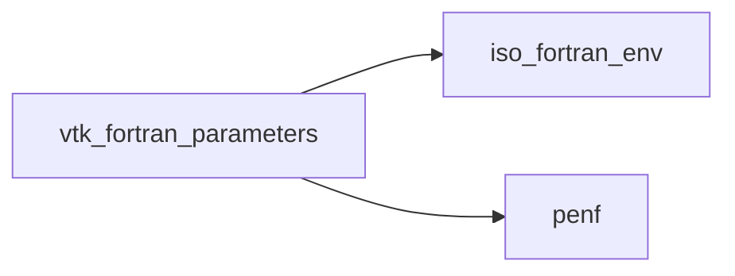

# vtk_fortran_parameters

> VTK_Fortran parameters.

**Source**: `src/third_party/VTKFortran/src/lib/vtk_fortran_parameters.f90`

**Dependencies**

## Variables

| Name | Type | Attributes | Description |
|------|------|------------|-------------|
| `stderr` | integer(kind=[I4P](/api/src/third_party/PENF/src/lib/penf_global_parameters_variables)) | parameter | Standard error unit. |
| `stdout` | integer(kind=[I4P](/api/src/third_party/PENF/src/lib/penf_global_parameters_variables)) | parameter | Standard output unit. |
| `end_rec` | character(len=1) | parameter | End-character for binary-record finalize. |
