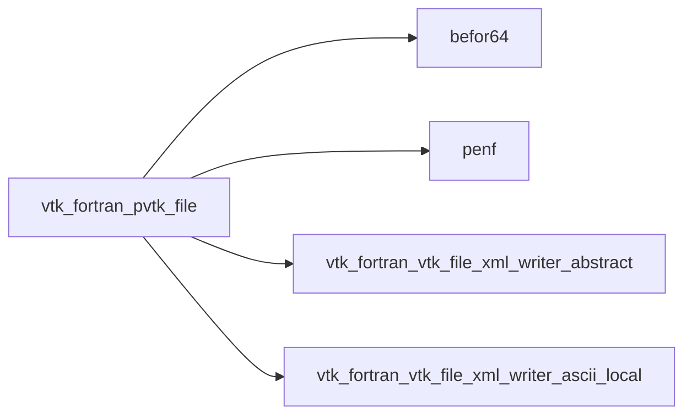
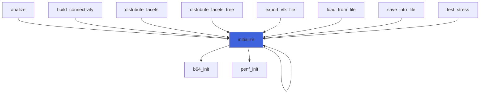
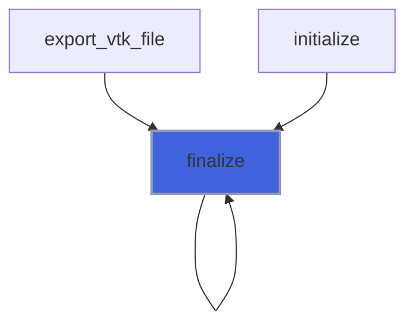

# vtk_fortran_pvtk_file

> Parallel (partioned) VTK file class.

**Source**: `src/third_party/VTKFortran/src/lib/vtk_fortran_pvtk_file.f90`

**Dependencies**



## Contents

- [pvtk_file](#pvtk-file)
- [initialize](#initialize)
- [finalize](#finalize)

## Derived Types

### pvtk_file

VTK parallel (partioned) file class.

#### Components

| Name | Type | Attributes | Description |
|------|------|------------|-------------|
| `xml_writer` | class([xml_writer_abstract](/api/src/third_party/VTKFortran/src/lib/vtk_fortran_vtk_file_xml_writer_abstract#xml-writer-abstract)) | allocatable | XML writer. |

#### Type-Bound Procedures

| Name | Attributes | Description |
|------|------------|-------------|
| `initialize` | pass(self) | Initialize file. |
| `finalize` | pass(self) | Finalize file. |

## Functions

### initialize

Initialize file (writer).

 @note This function must be the first to be called.

### Supported topologies are:

- PRectilinearGrid;
- PStructuredGrid;
- PUnstructuredGrid.

### Example of usage

```fortran
 type(pvtk_file) :: pvtk
 integer(I4P)    :: nx1, nx2, ny1, ny2, nz1, nz2
 ...
 error = pvtk%initialize('XML_RECT_BINARY.pvtr','PRectilinearGrid',nx1=nx1,nx2=nx2,ny1=ny1,ny2=ny2,nz1=nz1,nz2=nz2)
 ...
```
 @note The file extension is necessary in the file name. The XML standard has different extensions for each
 different topologies (e.g. *pvtr* for rectilinear topology). See the VTK-standard file for more information.

**Returns**: integer(kind=[I4P](/api/src/third_party/PENF/src/lib/penf_global_parameters_variables))

```fortran
function initialize(self, filename, mesh_topology, mesh_kind, nx1, nx2, ny1, ny2, nz1, nz2) result(error)
```

**Arguments**

| Name | Type | Intent | Attributes | Description |
|------|------|--------|------------|-------------|
| `self` | class([pvtk_file](/api/src/third_party/VTKFortran/src/lib/vtk_fortran_pvtk_file#pvtk-file)) | inout |  | VTK file. |
| `filename` | character(len=*) | in |  | File name. |
| `mesh_topology` | character(len=*) | in |  | Mesh topology. |
| `mesh_kind` | character(len=*) | in |  | Kind of mesh data: Float64, Float32, ecc. |
| `nx1` | integer(kind=[I4P](/api/src/third_party/PENF/src/lib/penf_global_parameters_variables)) | in | optional | Initial node of x axis. |
| `nx2` | integer(kind=[I4P](/api/src/third_party/PENF/src/lib/penf_global_parameters_variables)) | in | optional | Final node of x axis. |
| `ny1` | integer(kind=[I4P](/api/src/third_party/PENF/src/lib/penf_global_parameters_variables)) | in | optional | Initial node of y axis. |
| `ny2` | integer(kind=[I4P](/api/src/third_party/PENF/src/lib/penf_global_parameters_variables)) | in | optional | Final node of y axis. |
| `nz1` | integer(kind=[I4P](/api/src/third_party/PENF/src/lib/penf_global_parameters_variables)) | in | optional | Initial node of z axis. |
| `nz2` | integer(kind=[I4P](/api/src/third_party/PENF/src/lib/penf_global_parameters_variables)) | in | optional | Final node of z axis. |

**Call graph**



### finalize

Finalize file (writer).

**Returns**: integer(kind=[I4P](/api/src/third_party/PENF/src/lib/penf_global_parameters_variables))

```fortran
function finalize(self) result(error)
```

**Arguments**

| Name | Type | Intent | Attributes | Description |
|------|------|--------|------------|-------------|
| `self` | class([pvtk_file](/api/src/third_party/VTKFortran/src/lib/vtk_fortran_pvtk_file#pvtk-file)) | inout |  | VTK file. |

**Call graph**


