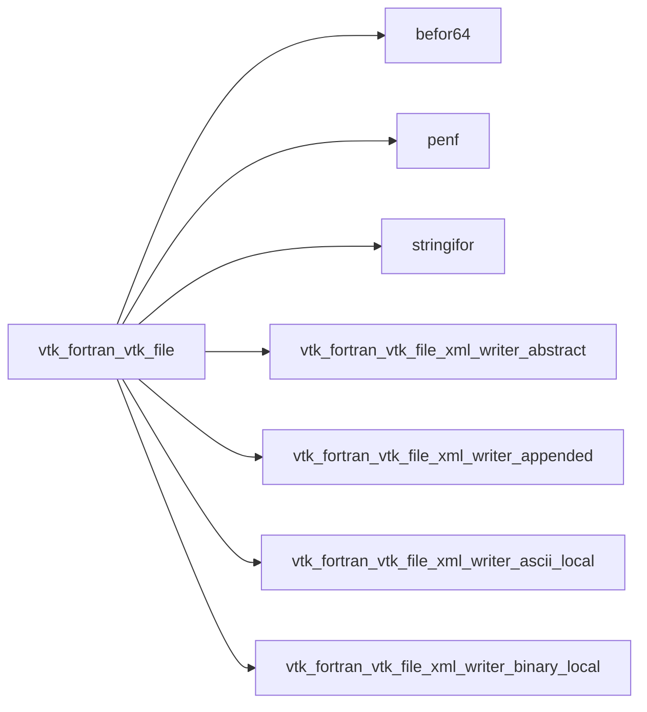
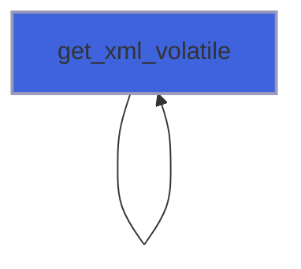
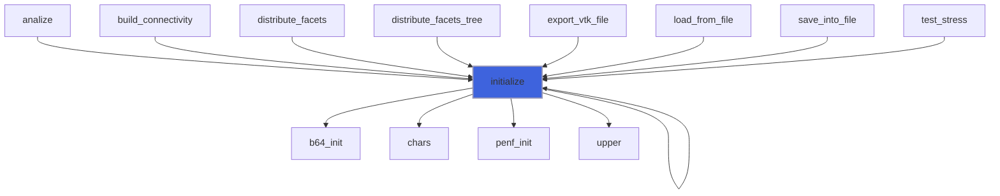
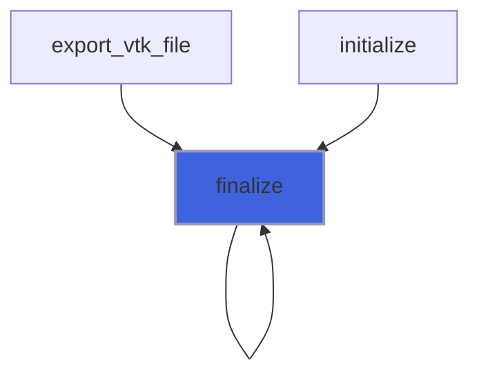

# vtk_fortran_vtk_file

> VTK file class.

**Source**: `src/third_party/VTKFortran/src/lib/vtk_fortran_vtk_file.f90`

**Dependencies**



## Contents

- [vtk_file](#vtk-file)
- [get_xml_volatile](#get-xml-volatile)
- [free](#free)
- [initialize](#initialize)
- [finalize](#finalize)

## Derived Types

### vtk_file

VTK file class.

#### Components

| Name | Type | Attributes | Description |
|------|------|------------|-------------|
| `xml_writer` | class([xml_writer_abstract](/api/src/third_party/VTKFortran/src/lib/vtk_fortran_vtk_file_xml_writer_abstract#xml-writer-abstract)) | allocatable | XML writer. |

#### Type-Bound Procedures

| Name | Attributes | Description |
|------|------------|-------------|
| `get_xml_volatile` | pass(self) | Return the eventual XML volatile string file. |
| `initialize` | pass(self) | Initialize file. |
| `finalize` | pass(self) | Finalize file. |
| `free` | pass(self) | Free allocated memory. |

## Subroutines

### get_xml_volatile

Return the eventual XML volatile string file.

**Attributes**: pure

```fortran
subroutine get_xml_volatile(self, xml_volatile, error)
```

**Arguments**

| Name | Type | Intent | Attributes | Description |
|------|------|--------|------------|-------------|
| `self` | class([vtk_file](/api/src/third_party/VTKFortran/src/lib/vtk_fortran_vtk_file#vtk-file)) | in |  | VTK file. |
| `xml_volatile` | character(len=:) | out | allocatable | XML volatile file. |
| `error` | integer(kind=[I4P](/api/src/third_party/PENF/src/lib/penf_global_parameters_variables)) | out | optional | Error status. |

**Call graph**



### free

Free allocated memory.

**Attributes**: elemental

```fortran
subroutine free(self, error)
```

**Arguments**

| Name | Type | Intent | Attributes | Description |
|------|------|--------|------------|-------------|
| `self` | class([vtk_file](/api/src/third_party/VTKFortran/src/lib/vtk_fortran_vtk_file#vtk-file)) | inout |  | VTK file. |
| `error` | integer(kind=[I4P](/api/src/third_party/PENF/src/lib/penf_global_parameters_variables)) | out | optional | Error status. |

## Functions

### initialize

Initialize file (writer).

 @note This function must be the first to be called.

### Supported output formats are (the passed specifier value is case insensitive):

- ASCII: data are saved in ASCII format;
- BINARY: data are saved in base64 encoded format;
- RAW: data are saved in raw-binary format in the appended tag of the XML file;
- BINARY-APPENDED: data are saved in base64 encoded format in the appended tag of the XML file.

### Supported topologies are:

- RectilinearGrid;
- StructuredGrid;
- UnstructuredGrid.

### Example of usage

```fortran
 type(vtk_file) :: vtk
 integer(I4P)   :: nx1, nx2, ny1, ny2, nz1, nz2
 ...
 error = vtk%initialize('BINARY','XML_RECT_BINARY.vtr','RectilinearGrid',nx1=nx1,nx2=nx2,ny1=ny1,ny2=ny2,nz1=nz1,nz2=nz2)
 ...
```
 @note The file extension is necessary in the file name. The XML standard has different extensions for each
 different topologies (e.g. *vtr* for rectilinear topology). See the VTK-standard file for more information.

**Returns**: integer(kind=[I4P](/api/src/third_party/PENF/src/lib/penf_global_parameters_variables))

```fortran
function initialize(self, format, filename, mesh_topology, is_volatile, nx1, nx2, ny1, ny2, nz1, nz2) result(error)
```

**Arguments**

| Name | Type | Intent | Attributes | Description |
|------|------|--------|------------|-------------|
| `self` | class([vtk_file](/api/src/third_party/VTKFortran/src/lib/vtk_fortran_vtk_file#vtk-file)) | inout |  | VTK file. |
| `format` | character(len=*) | in |  | File format: ASCII, BINARY, RAW or BINARY-APPENDED. |
| `filename` | character(len=*) | in |  | File name. |
| `mesh_topology` | character(len=*) | in |  | Mesh topology. |
| `is_volatile` | logical | in | optional | Flag to check volatile writer. |
| `nx1` | integer(kind=[I4P](/api/src/third_party/PENF/src/lib/penf_global_parameters_variables)) | in | optional | Initial node of x axis. |
| `nx2` | integer(kind=[I4P](/api/src/third_party/PENF/src/lib/penf_global_parameters_variables)) | in | optional | Final node of x axis. |
| `ny1` | integer(kind=[I4P](/api/src/third_party/PENF/src/lib/penf_global_parameters_variables)) | in | optional | Initial node of y axis. |
| `ny2` | integer(kind=[I4P](/api/src/third_party/PENF/src/lib/penf_global_parameters_variables)) | in | optional | Final node of y axis. |
| `nz1` | integer(kind=[I4P](/api/src/third_party/PENF/src/lib/penf_global_parameters_variables)) | in | optional | Initial node of z axis. |
| `nz2` | integer(kind=[I4P](/api/src/third_party/PENF/src/lib/penf_global_parameters_variables)) | in | optional | Final node of z axis. |

**Call graph**



### finalize

Finalize file (writer).

**Returns**: integer(kind=[I4P](/api/src/third_party/PENF/src/lib/penf_global_parameters_variables))

```fortran
function finalize(self) result(error)
```

**Arguments**

| Name | Type | Intent | Attributes | Description |
|------|------|--------|------------|-------------|
| `self` | class([vtk_file](/api/src/third_party/VTKFortran/src/lib/vtk_fortran_vtk_file#vtk-file)) | inout |  | VTK file. |

**Call graph**


