# vtk_fortran_vtk_file_xml_writer_abstract

> VTK file abstract XML writer.

**Source**: `src/third_party/VTKFortran/src/lib/vtk_fortran_vtk_file_xml_writer_abstract.f90`

**Dependencies**

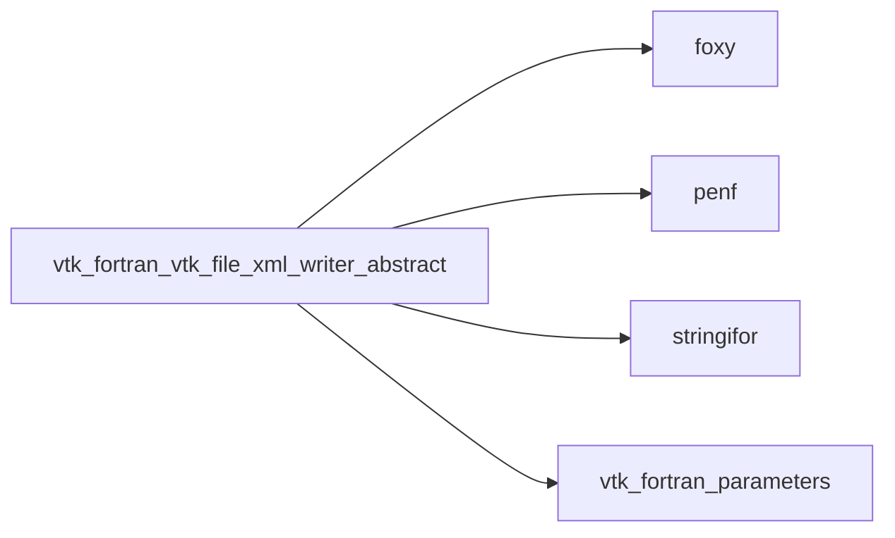

## Contents

- [xml_writer_abstract](#xml-writer-abstract)
- [close_xml_file](#close-xml-file)
- [open_xml_file](#open-xml-file)
- [free](#free)
- [get_xml_volatile](#get-xml-volatile)
- [write_end_tag](#write-end-tag)
- [write_header_tag](#write-header-tag)
- [write_self_closing_tag](#write-self-closing-tag)
- [write_start_tag](#write-start-tag)
- [write_tag](#write-tag)
- [write_topology_tag](#write-topology-tag)
- [write_dataarray_tag](#write-dataarray-tag)
- [write_dataarray_tag_appended](#write-dataarray-tag-appended)
- [write_dataarray_location_tag](#write-dataarray-location-tag)
- [write_fielddata1_rank0](#write-fielddata1-rank0)
- [write_fielddata_tag](#write-fielddata-tag)
- [write_piece_start_tag](#write-piece-start-tag)
- [write_piece_start_tag_unst](#write-piece-start-tag-unst)
- [write_piece_end_tag](#write-piece-end-tag)
- [write_geo_rect_data3_rank1_R8P](#write-geo-rect-data3-rank1-r8p)
- [write_geo_rect_data3_rank1_R4P](#write-geo-rect-data3-rank1-r4p)
- [write_geo_strg_data1_rank2_R8P](#write-geo-strg-data1-rank2-r8p)
- [write_geo_strg_data1_rank2_R4P](#write-geo-strg-data1-rank2-r4p)
- [write_geo_strg_data1_rank4_R8P](#write-geo-strg-data1-rank4-r8p)
- [write_geo_strg_data1_rank4_R4P](#write-geo-strg-data1-rank4-r4p)
- [write_geo_strg_data3_rank1_R8P](#write-geo-strg-data3-rank1-r8p)
- [write_geo_strg_data3_rank1_R4P](#write-geo-strg-data3-rank1-r4p)
- [write_geo_strg_data3_rank3_R8P](#write-geo-strg-data3-rank3-r8p)
- [write_geo_strg_data3_rank3_R4P](#write-geo-strg-data3-rank3-r4p)
- [write_geo_unst_data1_rank2_R8P](#write-geo-unst-data1-rank2-r8p)
- [write_geo_unst_data1_rank2_R4P](#write-geo-unst-data1-rank2-r4p)
- [write_geo_unst_data3_rank1_R8P](#write-geo-unst-data3-rank1-r8p)
- [write_geo_unst_data3_rank1_R4P](#write-geo-unst-data3-rank1-r4p)
- [write_connectivity](#write-connectivity)
- [write_parallel_open_block](#write-parallel-open-block)
- [write_parallel_close_block](#write-parallel-close-block)
- [write_parallel_dataarray](#write-parallel-dataarray)
- [write_parallel_geo](#write-parallel-geo)
- [write_parallel_block_file](#write-parallel-block-file)
- [write_parallel_block_files_array](#write-parallel-block-files-array)
- [write_parallel_block_files_string](#write-parallel-block-files-string)

## Derived Types

### xml_writer_abstract

VTK file abstract XML writer.

**Inheritance**

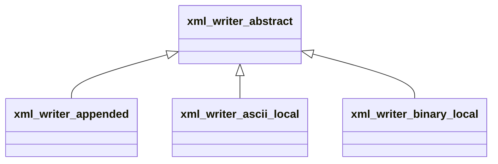

**Attributes**: abstract

#### Components

| Name | Type | Attributes | Description |
|------|------|------------|-------------|
| `format_ch` | type([string](/api/src/third_party/StringiFor/src/lib/stringifor_string_t#string)) |  | Output format, string code. |
| `topology` | type([string](/api/src/third_party/StringiFor/src/lib/stringifor_string_t#string)) |  | Mesh topology. |
| `indent` | integer(kind=[I4P](/api/src/third_party/PENF/src/lib/penf_global_parameters_variables)) |  | Indent count. |
| `ioffset` | integer(kind=[I8P](/api/src/third_party/PENF/src/lib/penf_global_parameters_variables)) |  | Offset count. |
| `xml` | integer(kind=[I4P](/api/src/third_party/PENF/src/lib/penf_global_parameters_variables)) |  | XML Logical unit. |
| `vtm_block` | integer(kind=[I4P](/api/src/third_party/PENF/src/lib/penf_global_parameters_variables)) |  | Block indexes. |
| `error` | integer(kind=[I4P](/api/src/third_party/PENF/src/lib/penf_global_parameters_variables)) |  | IO Error status. |
| `tag` | type([xml_tag](/api/src/third_party/FoXy/src/lib/foxy_xml_tag#xml-tag)) |  | XML tags handler. |
| `is_volatile` | logical |  | Flag to check volatile writer. |
| `xml_volatile` | type([string](/api/src/third_party/StringiFor/src/lib/stringifor_string_t#string)) |  | XML file volatile (not a physical file). |

#### Type-Bound Procedures

| Name | Attributes | Description |
|------|------------|-------------|
| `close_xml_file` | pass(self) | Close xml file. |
| `open_xml_file` | pass(self) | Open xml file. |
| `free` | pass(self) | Free allocated memory. |
| `get_xml_volatile` | pass(self) | Return the XML volatile string file. |
| `write_connectivity` | pass(self) | Write connectivity. |
| `write_dataarray_location_tag` | pass(self) | Write dataarray location tag. |
| `write_dataarray_tag` | pass(self) | Write dataarray tag. |
| `write_dataarray_tag_appended` | pass(self) | Write dataarray appended tag. |
| `write_end_tag` | pass(self) | Write `` end tag. |
| `write_header_tag` | pass(self) | Write header tag. |
| `write_parallel_open_block` | pass(self) | Write parallel open block. |
| `write_parallel_close_block` | pass(self) | Write parallel close block. |
| `write_parallel_dataarray` | pass(self) | Write parallel dataarray. |
| `write_parallel_geo` | pass(self) | Write parallel geo. |
| `write_self_closing_tag` | pass(self) | Write self closing tag. |
| `write_start_tag` | pass(self) | Write start tag. |
| `write_tag` | pass(self) | Write tag. |
| `write_topology_tag` | pass(self) | Write topology tag. |
| `initialize` | pass(self) | Initialize writer. |
| `finalize` | pass(self) | Finalize writer. |
| `write_dataarray` |  | Write data (array). |
| `write_fielddata` |  | Write FieldData tag. |
| `write_geo` |  | Write mesh. |
| `write_parallel_block_files` |  | Write block list of files. |
| `write_piece` |  | Write Piece start/end tag. |
| `write_dataarray1_rank1_R8P` | pass(self) | Data 1, rank 1, R8P. |
| `write_dataarray1_rank1_R4P` | pass(self) | Data 1, rank 1, R4P. |
| `write_dataarray1_rank1_I8P` | pass(self) | Data 1, rank 1, I8P. |
| `write_dataarray1_rank1_I4P` | pass(self) | Data 1, rank 1, I4P. |
| `write_dataarray1_rank1_I2P` | pass(self) | Data 1, rank 1, I2P. |
| `write_dataarray1_rank1_I1P` | pass(self) | Data 1, rank 1, I1P. |
| `write_dataarray1_rank2_R8P` | pass(self) | Data 1, rank 2, R8P. |
| `write_dataarray1_rank2_R4P` | pass(self) | Data 1, rank 2, R4P. |
| `write_dataarray1_rank2_I8P` | pass(self) | Data 1, rank 2, I8P. |
| `write_dataarray1_rank2_I4P` | pass(self) | Data 1, rank 2, I4P. |
| `write_dataarray1_rank2_I2P` | pass(self) | Data 1, rank 2, I2P. |
| `write_dataarray1_rank2_I1P` | pass(self) | Data 1, rank 2, I1P. |
| `write_dataarray1_rank3_R8P` | pass(self) | Data 1, rank 3, R8P. |
| `write_dataarray1_rank3_R4P` | pass(self) | Data 1, rank 3, R4P. |
| `write_dataarray1_rank3_I8P` | pass(self) | Data 1, rank 3, I8P. |
| `write_dataarray1_rank3_I4P` | pass(self) | Data 1, rank 3, I4P. |
| `write_dataarray1_rank3_I2P` | pass(self) | Data 1, rank 3, I2P. |
| `write_dataarray1_rank3_I1P` | pass(self) | Data 1, rank 3, I1P. |
| `write_dataarray1_rank4_R8P` | pass(self) | Data 1, rank 4, R8P. |
| `write_dataarray1_rank4_R4P` | pass(self) | Data 1, rank 4, R4P. |
| `write_dataarray1_rank4_I8P` | pass(self) | Data 1, rank 4, I8P. |
| `write_dataarray1_rank4_I4P` | pass(self) | Data 1, rank 4, I4P. |
| `write_dataarray1_rank4_I2P` | pass(self) | Data 1, rank 4, I2P. |
| `write_dataarray1_rank4_I1P` | pass(self) | Data 1, rank 4, I1P. |
| `write_dataarray3_rank1_R8P` | pass(self) | Data 3, rank 1, R8P. |
| `write_dataarray3_rank1_R4P` | pass(self) | Data 3, rank 1, R4P. |
| `write_dataarray3_rank1_I8P` | pass(self) | Data 3, rank 1, I8P. |
| `write_dataarray3_rank1_I4P` | pass(self) | Data 3, rank 1, I4P. |
| `write_dataarray3_rank1_I2P` | pass(self) | Data 3, rank 1, I2P. |
| `write_dataarray3_rank1_I1P` | pass(self) | Data 3, rank 1, I1P. |
| `write_dataarray3_rank3_R8P` | pass(self) | Data 3, rank 3, R8P. |
| `write_dataarray3_rank3_R4P` | pass(self) | Data 3, rank 3, R4P. |
| `write_dataarray3_rank3_I8P` | pass(self) | Data 3, rank 3, I8P. |
| `write_dataarray3_rank3_I4P` | pass(self) | Data 3, rank 3, I4P. |
| `write_dataarray3_rank3_I2P` | pass(self) | Data 3, rank 3, I2P. |
| `write_dataarray3_rank3_I1P` | pass(self) | Data 3, rank 3, I1P. |
| `write_dataarray6_rank1_R8P` | pass(self) | Data 3, rank 1, R8P. |
| `write_dataarray6_rank1_R4P` | pass(self) | Data 3, rank 1, R4P. |
| `write_dataarray6_rank1_I8P` | pass(self) | Data 3, rank 1, I8P. |
| `write_dataarray6_rank1_I4P` | pass(self) | Data 3, rank 1, I4P. |
| `write_dataarray6_rank1_I2P` | pass(self) | Data 3, rank 1, I2P. |
| `write_dataarray6_rank1_I1P` | pass(self) | Data 3, rank 1, I1P. |
| `write_dataarray6_rank3_R8P` | pass(self) | Data 3, rank 3, R8P. |
| `write_dataarray6_rank3_R4P` | pass(self) | Data 3, rank 3, R4P. |
| `write_dataarray6_rank3_I8P` | pass(self) | Data 3, rank 3, I8P. |
| `write_dataarray6_rank3_I4P` | pass(self) | Data 3, rank 3, I4P. |
| `write_dataarray6_rank3_I2P` | pass(self) | Data 3, rank 3, I2P. |
| `write_dataarray6_rank3_I1P` | pass(self) | Data 3, rank 3, I1P. |
| `write_dataarray_appended` | pass(self) | Write appended. |
| `write_fielddata1_rank0` | pass(self) | Write FieldData tag (data 1, rank 0, R8P). |
| `write_fielddata_tag` | pass(self) | Write FieldData tag. |
| `write_geo_strg_data1_rank2_R8P` | pass(self) | Write **StructuredGrid** mesh (data 1, rank 2, R8P). |
| `write_geo_strg_data1_rank2_R4P` | pass(self) | Write **StructuredGrid** mesh (data 1, rank 2, R4P). |
| `write_geo_strg_data1_rank4_R8P` | pass(self) | Write **StructuredGrid** mesh (data 1, rank 4, R8P). |
| `write_geo_strg_data1_rank4_R4P` | pass(self) | Write **StructuredGrid** mesh (data 1, rank 4, R4P). |
| `write_geo_strg_data3_rank1_R8P` | pass(self) | Write **StructuredGrid** mesh (data 3, rank 1, R8P). |
| `write_geo_strg_data3_rank1_R4P` | pass(self) | Write **StructuredGrid** mesh (data 3, rank 1, R4P). |
| `write_geo_strg_data3_rank3_R8P` | pass(self) | Write **StructuredGrid** mesh (data 3, rank 3, R8P). |
| `write_geo_strg_data3_rank3_R4P` | pass(self) | Write **StructuredGrid** mesh (data 3, rank 3, R4P). |
| `write_geo_rect_data3_rank1_R8P` | pass(self) | Write **RectilinearGrid** mesh (data 3, rank 1, R8P). |
| `write_geo_rect_data3_rank1_R4P` | pass(self) | Write **RectilinearGrid** mesh (data 3, rank 1, R4P). |
| `write_geo_unst_data1_rank2_R8P` | pass(self) | Write **UnstructuredGrid** mesh (data 1, rank 2, R8P). |
| `write_geo_unst_data1_rank2_R4P` | pass(self) | Write **UnstructuredGrid** mesh (data 1, rank 2, R4P). |
| `write_geo_unst_data3_rank1_R8P` | pass(self) | Write **UnstructuredGrid** mesh (data 3, rank 1, R8P). |
| `write_geo_unst_data3_rank1_R4P` | pass(self) | Write **UnstructuredGrid** mesh (data 3, rank 1, R4P). |
| `write_piece_start_tag` | pass(self) | Write `` start tag. |
| `write_piece_start_tag_unst` | pass(self) | Write `` start tag for unstructured topology. |
| `write_piece_end_tag` | pass(self) | Write `` end tag. |
| `write_parallel_block_file` | pass(self) | Write single file that belong to the current block. |
| `write_parallel_block_files_array` | pass(self) | Write block list of files (array input). |
| `write_parallel_block_files_string` | pass(self) | Write block list of files (string input). |

## Subroutines

### close_xml_file

Close XML file.

```fortran
subroutine close_xml_file(self)
```

**Arguments**

| Name | Type | Intent | Attributes | Description |
|------|------|--------|------------|-------------|
| `self` | class([xml_writer_abstract](/api/src/third_party/VTKFortran/src/lib/vtk_fortran_vtk_file_xml_writer_abstract#xml-writer-abstract)) | inout |  | Writer. |

**Call graph**

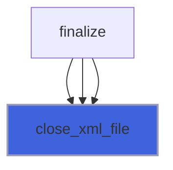

### open_xml_file

Open XML file.

```fortran
subroutine open_xml_file(self, filename)
```

**Arguments**

| Name | Type | Intent | Attributes | Description |
|------|------|--------|------------|-------------|
| `self` | class([xml_writer_abstract](/api/src/third_party/VTKFortran/src/lib/vtk_fortran_vtk_file_xml_writer_abstract#xml-writer-abstract)) | inout |  | Writer. |
| `filename` | character(len=*) | in |  | File name. |

**Call graph**

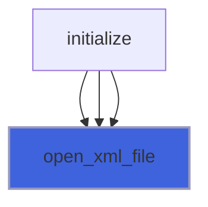

### free

Free allocated memory.

**Attributes**: elemental

```fortran
subroutine free(self, error)
```

**Arguments**

| Name | Type | Intent | Attributes | Description |
|------|------|--------|------------|-------------|
| `self` | class([xml_writer_abstract](/api/src/third_party/VTKFortran/src/lib/vtk_fortran_vtk_file_xml_writer_abstract#xml-writer-abstract)) | inout |  | Writer. |
| `error` | integer(kind=[I4P](/api/src/third_party/PENF/src/lib/penf_global_parameters_variables)) | out | optional | Error status. |

### get_xml_volatile

Return the eventual XML volatile string file.

**Attributes**: pure

```fortran
subroutine get_xml_volatile(self, xml_volatile, error)
```

**Arguments**

| Name | Type | Intent | Attributes | Description |
|------|------|--------|------------|-------------|
| `self` | class([xml_writer_abstract](/api/src/third_party/VTKFortran/src/lib/vtk_fortran_vtk_file_xml_writer_abstract#xml-writer-abstract)) | in |  | Writer. |
| `xml_volatile` | character(len=:) | out | allocatable | XML volatile file. |
| `error` | integer(kind=[I4P](/api/src/third_party/PENF/src/lib/penf_global_parameters_variables)) | out | optional | Error status. |

**Call graph**

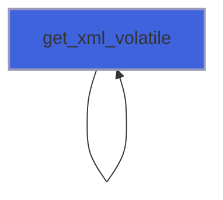

### write_end_tag

Write `</tag_name>` end tag.

```fortran
subroutine write_end_tag(self, name)
```

**Arguments**

| Name | Type | Intent | Attributes | Description |
|------|------|--------|------------|-------------|
| `self` | class([xml_writer_abstract](/api/src/third_party/VTKFortran/src/lib/vtk_fortran_vtk_file_xml_writer_abstract#xml-writer-abstract)) | inout |  | Writer. |
| `name` | character(len=*) | in |  | Tag name. |

**Call graph**


### write_header_tag

Write header tag.

```fortran
subroutine write_header_tag(self)
```

**Arguments**

| Name | Type | Intent | Attributes | Description |
|------|------|--------|------------|-------------|
| `self` | class([xml_writer_abstract](/api/src/third_party/VTKFortran/src/lib/vtk_fortran_vtk_file_xml_writer_abstract#xml-writer-abstract)) | inout |  | Writer. |

**Call graph**

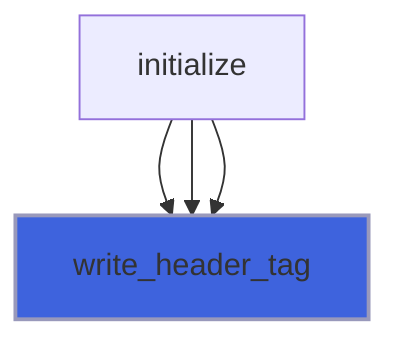

### write_self_closing_tag

Write `<tag_name.../>` self closing tag.

```fortran
subroutine write_self_closing_tag(self, name, attributes)
```

**Arguments**

| Name | Type | Intent | Attributes | Description |
|------|------|--------|------------|-------------|
| `self` | class([xml_writer_abstract](/api/src/third_party/VTKFortran/src/lib/vtk_fortran_vtk_file_xml_writer_abstract#xml-writer-abstract)) | inout |  | Writer. |
| `name` | character(len=*) | in |  | Tag name. |
| `attributes` | character(len=*) | in | optional | Tag attributes. |

**Call graph**

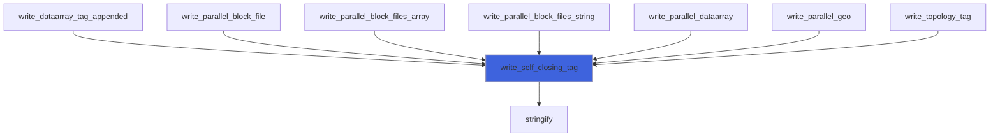

### write_start_tag

Write `<tag_name...>` start tag.

```fortran
subroutine write_start_tag(self, name, attributes)
```

**Arguments**

| Name | Type | Intent | Attributes | Description |
|------|------|--------|------------|-------------|
| `self` | class([xml_writer_abstract](/api/src/third_party/VTKFortran/src/lib/vtk_fortran_vtk_file_xml_writer_abstract#xml-writer-abstract)) | inout |  | Writer. |
| `name` | character(len=*) | in |  | Tag name. |
| `attributes` | character(len=*) | in | optional | Tag attributes. |

**Call graph**


### write_tag

Write `<tag_name...>...</tag_name>` tag.

```fortran
subroutine write_tag(self, name, attributes, content)
```

**Arguments**

| Name | Type | Intent | Attributes | Description |
|------|------|--------|------------|-------------|
| `self` | class([xml_writer_abstract](/api/src/third_party/VTKFortran/src/lib/vtk_fortran_vtk_file_xml_writer_abstract#xml-writer-abstract)) | inout |  | Writer. |
| `name` | character(len=*) | in |  | Tag name. |
| `attributes` | character(len=*) | in | optional | Tag attributes. |
| `content` | character(len=*) | in | optional | Tag content. |

**Call graph**

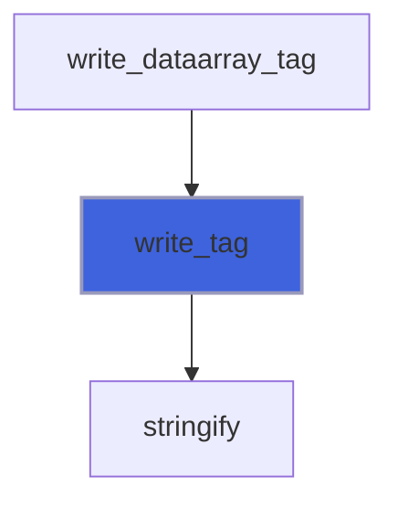

### write_topology_tag

Write XML topology tag.

```fortran
subroutine write_topology_tag(self, nx1, nx2, ny1, ny2, nz1, nz2, mesh_kind)
```

**Arguments**

| Name | Type | Intent | Attributes | Description |
|------|------|--------|------------|-------------|
| `self` | class([xml_writer_abstract](/api/src/third_party/VTKFortran/src/lib/vtk_fortran_vtk_file_xml_writer_abstract#xml-writer-abstract)) | inout |  | Writer. |
| `nx1` | integer(kind=[I4P](/api/src/third_party/PENF/src/lib/penf_global_parameters_variables)) | in | optional | Initial node of x axis. |
| `nx2` | integer(kind=[I4P](/api/src/third_party/PENF/src/lib/penf_global_parameters_variables)) | in | optional | Final node of x axis. |
| `ny1` | integer(kind=[I4P](/api/src/third_party/PENF/src/lib/penf_global_parameters_variables)) | in | optional | Initial node of y axis. |
| `ny2` | integer(kind=[I4P](/api/src/third_party/PENF/src/lib/penf_global_parameters_variables)) | in | optional | Final node of y axis. |
| `nz1` | integer(kind=[I4P](/api/src/third_party/PENF/src/lib/penf_global_parameters_variables)) | in | optional | Initial node of z axis. |
| `nz2` | integer(kind=[I4P](/api/src/third_party/PENF/src/lib/penf_global_parameters_variables)) | in | optional | Final node of z axis. |
| `mesh_kind` | character(len=*) | in | optional | Kind of mesh data: Float64, Float32, ecc. |

**Call graph**

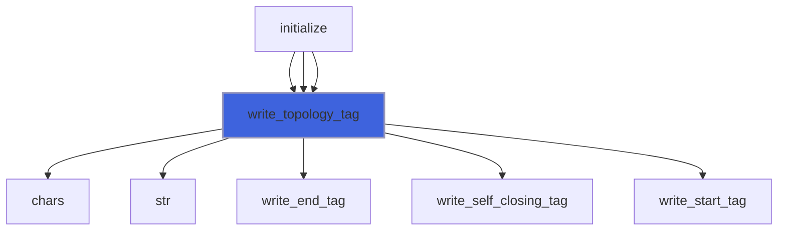

### write_dataarray_tag

Write `<DataArray...>...</DataArray>` tag.

```fortran
subroutine write_dataarray_tag(self, data_type, number_of_components, data_name, data_content, is_tuples)
```

**Arguments**

| Name | Type | Intent | Attributes | Description |
|------|------|--------|------------|-------------|
| `self` | class([xml_writer_abstract](/api/src/third_party/VTKFortran/src/lib/vtk_fortran_vtk_file_xml_writer_abstract#xml-writer-abstract)) | inout |  | Writer. |
| `data_type` | character(len=*) | in |  | Type of dataarray. |
| `number_of_components` | integer(kind=[I4P](/api/src/third_party/PENF/src/lib/penf_global_parameters_variables)) | in |  | Number of dataarray components. |
| `data_name` | character(len=*) | in |  | Data name. |
| `data_content` | character(len=*) | in | optional | Data content. |
| `is_tuples` | logical | in | optional | Use "NumberOfTuples". |

**Call graph**


### write_dataarray_tag_appended

Write `<DataArray.../>` tag.

```fortran
subroutine write_dataarray_tag_appended(self, data_type, number_of_components, data_name, is_tuples)
```

**Arguments**

| Name | Type | Intent | Attributes | Description |
|------|------|--------|------------|-------------|
| `self` | class([xml_writer_abstract](/api/src/third_party/VTKFortran/src/lib/vtk_fortran_vtk_file_xml_writer_abstract#xml-writer-abstract)) | inout |  | Writer. |
| `data_type` | character(len=*) | in |  | Type of dataarray. |
| `number_of_components` | integer(kind=[I4P](/api/src/third_party/PENF/src/lib/penf_global_parameters_variables)) | in |  | Number of dataarray components. |
| `data_name` | character(len=*) | in |  | Data name. |
| `is_tuples` | logical | in | optional | Use "NumberOfTuples". |

**Call graph**


## Functions

### write_dataarray_location_tag

Write `<[/]PointData>` or `<[/]CellData>` open/close tag.

 @note **must** be called before saving the data related to geometric mesh, this function initializes the
 saving of data variables indicating the *location* (node or cell centered) of variables that will be saved.

 @note A single file can contain both cell and node centered variables. In this case the VTK_DAT_XML function must be
 called two times, before saving cell-centered variables and before saving node-centered variables.

### Examples of usage

#### Opening node piece
```fortran
 error = vtk%write_dataarray('node','OPeN')
```

#### Closing node piece
```fortran
 error = vtk%write_dataarray('node','Close')
```

#### Opening cell piece
```fortran
 error = vtk%write_dataarray('cell','OPEN')
```

#### Closing cell piece
```fortran
 error = vtk%write_dataarray('cell','close')
```

**Returns**: integer(kind=[I4P](/api/src/third_party/PENF/src/lib/penf_global_parameters_variables))

```fortran
function write_dataarray_location_tag(self, location, action) result(error)
```

**Arguments**

| Name | Type | Intent | Attributes | Description |
|------|------|--------|------------|-------------|
| `self` | class([xml_writer_abstract](/api/src/third_party/VTKFortran/src/lib/vtk_fortran_vtk_file_xml_writer_abstract#xml-writer-abstract)) | inout |  | Writer. |
| `location` | character(len=*) | in |  | Location of variables: **cell** or **node** centered. |
| `action` | character(len=*) | in |  | Action: **open** or **close** tag. |

**Call graph**

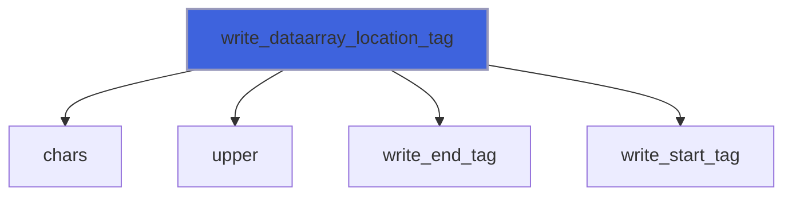

### write_fielddata1_rank0

Write `<DataArray... NumberOfTuples="..."...>...</DataArray>` tag (R8P).

**Returns**: integer(kind=[I4P](/api/src/third_party/PENF/src/lib/penf_global_parameters_variables))

```fortran
function write_fielddata1_rank0(self, data_name, x) result(error)
```

**Arguments**

| Name | Type | Intent | Attributes | Description |
|------|------|--------|------------|-------------|
| `self` | class([xml_writer_abstract](/api/src/third_party/VTKFortran/src/lib/vtk_fortran_vtk_file_xml_writer_abstract#xml-writer-abstract)) | inout |  | Writer. |
| `data_name` | character(len=*) | in |  | Data name. |
| `x` | class(*) | in |  | Data variable. |

**Call graph**

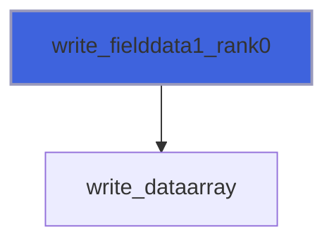

### write_fielddata_tag

Write `<FieldData>`/`</FieldData>` start/end tag.

**Returns**: integer(kind=[I4P](/api/src/third_party/PENF/src/lib/penf_global_parameters_variables))

```fortran
function write_fielddata_tag(self, action) result(error)
```

**Arguments**

| Name | Type | Intent | Attributes | Description |
|------|------|--------|------------|-------------|
| `self` | class([xml_writer_abstract](/api/src/third_party/VTKFortran/src/lib/vtk_fortran_vtk_file_xml_writer_abstract#xml-writer-abstract)) | inout |  | Writer. |
| `action` | character(len=*) | in |  | Action: **open** or **close** tag. |

**Call graph**

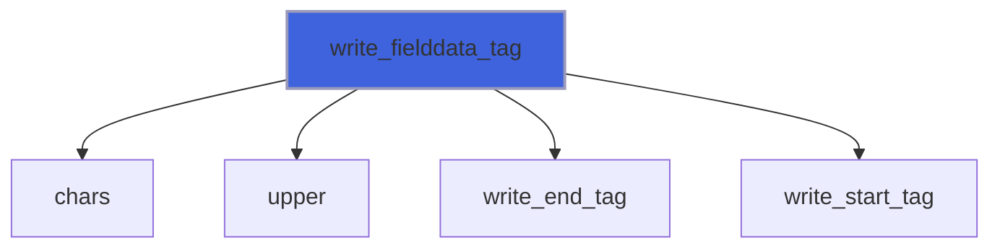

### write_piece_start_tag

Write `<Piece ...>` start tag.

**Returns**: integer(kind=[I4P](/api/src/third_party/PENF/src/lib/penf_global_parameters_variables))

```fortran
function write_piece_start_tag(self, nx1, nx2, ny1, ny2, nz1, nz2) result(error)
```

**Arguments**

| Name | Type | Intent | Attributes | Description |
|------|------|--------|------------|-------------|
| `self` | class([xml_writer_abstract](/api/src/third_party/VTKFortran/src/lib/vtk_fortran_vtk_file_xml_writer_abstract#xml-writer-abstract)) | inout |  | Writer. |
| `nx1` | integer(kind=[I4P](/api/src/third_party/PENF/src/lib/penf_global_parameters_variables)) | in |  | Initial node of x axis. |
| `nx2` | integer(kind=[I4P](/api/src/third_party/PENF/src/lib/penf_global_parameters_variables)) | in |  | Final node of x axis. |
| `ny1` | integer(kind=[I4P](/api/src/third_party/PENF/src/lib/penf_global_parameters_variables)) | in |  | Initial node of y axis. |
| `ny2` | integer(kind=[I4P](/api/src/third_party/PENF/src/lib/penf_global_parameters_variables)) | in |  | Final node of y axis. |
| `nz1` | integer(kind=[I4P](/api/src/third_party/PENF/src/lib/penf_global_parameters_variables)) | in |  | Initial node of z axis. |
| `nz2` | integer(kind=[I4P](/api/src/third_party/PENF/src/lib/penf_global_parameters_variables)) | in |  | Final node of z axis. |

**Call graph**

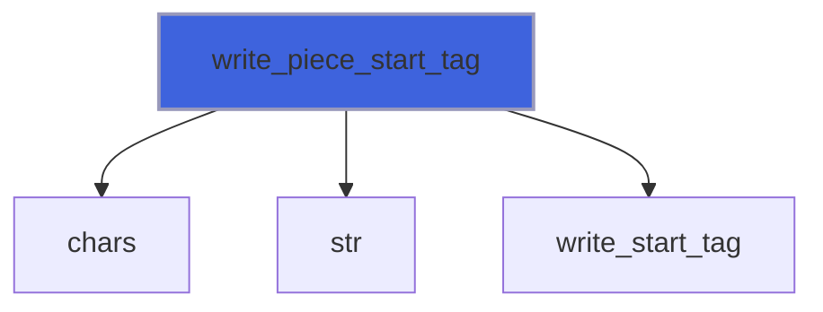

### write_piece_start_tag_unst

Write `<Piece ...>` start tag for unstructured topology.

**Returns**: integer(kind=[I4P](/api/src/third_party/PENF/src/lib/penf_global_parameters_variables))

```fortran
function write_piece_start_tag_unst(self, np, nc) result(error)
```

**Arguments**

| Name | Type | Intent | Attributes | Description |
|------|------|--------|------------|-------------|
| `self` | class([xml_writer_abstract](/api/src/third_party/VTKFortran/src/lib/vtk_fortran_vtk_file_xml_writer_abstract#xml-writer-abstract)) | inout |  | Writer. |
| `np` | integer(kind=[I4P](/api/src/third_party/PENF/src/lib/penf_global_parameters_variables)) | in |  | Number of points. |
| `nc` | integer(kind=[I4P](/api/src/third_party/PENF/src/lib/penf_global_parameters_variables)) | in |  | Number of cells. |

**Call graph**

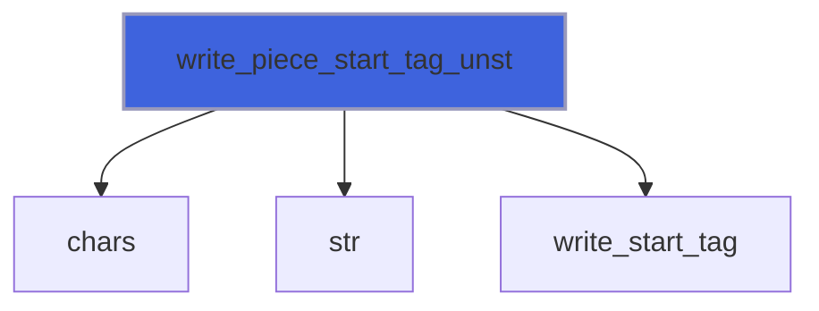

### write_piece_end_tag

Write `</Piece>` end tag.

**Returns**: integer(kind=[I4P](/api/src/third_party/PENF/src/lib/penf_global_parameters_variables))

```fortran
function write_piece_end_tag(self) result(error)
```

**Arguments**

| Name | Type | Intent | Attributes | Description |
|------|------|--------|------------|-------------|
| `self` | class([xml_writer_abstract](/api/src/third_party/VTKFortran/src/lib/vtk_fortran_vtk_file_xml_writer_abstract#xml-writer-abstract)) | inout |  | Writer. |

**Call graph**

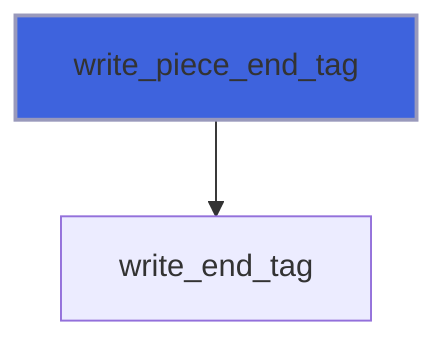

### write_geo_rect_data3_rank1_R8P

Write mesh with **RectilinearGrid** topology (data 3, rank 1, R8P).

**Returns**: integer(kind=[I4P](/api/src/third_party/PENF/src/lib/penf_global_parameters_variables))

```fortran
function write_geo_rect_data3_rank1_R8P(self, x, y, z) result(error)
```

**Arguments**

| Name | Type | Intent | Attributes | Description |
|------|------|--------|------------|-------------|
| `self` | class([xml_writer_abstract](/api/src/third_party/VTKFortran/src/lib/vtk_fortran_vtk_file_xml_writer_abstract#xml-writer-abstract)) | inout |  | Writer. |
| `x` | real(kind=[R8P](/api/src/third_party/PENF/src/lib/penf_global_parameters_variables)) | in |  | X coordinates. |
| `y` | real(kind=[R8P](/api/src/third_party/PENF/src/lib/penf_global_parameters_variables)) | in |  | Y coordinates. |
| `z` | real(kind=[R8P](/api/src/third_party/PENF/src/lib/penf_global_parameters_variables)) | in |  | Z coordinates. |

**Call graph**

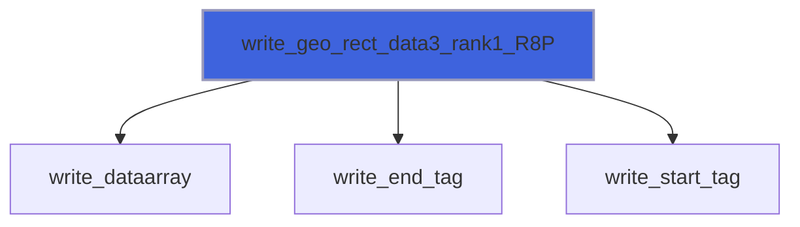

### write_geo_rect_data3_rank1_R4P

Write mesh with **RectilinearGrid** topology (data 3, rank 1, R4P).

**Returns**: integer(kind=[I4P](/api/src/third_party/PENF/src/lib/penf_global_parameters_variables))

```fortran
function write_geo_rect_data3_rank1_R4P(self, x, y, z) result(error)
```

**Arguments**

| Name | Type | Intent | Attributes | Description |
|------|------|--------|------------|-------------|
| `self` | class([xml_writer_abstract](/api/src/third_party/VTKFortran/src/lib/vtk_fortran_vtk_file_xml_writer_abstract#xml-writer-abstract)) | inout |  | Writer. |
| `x` | real(kind=[R4P](/api/src/third_party/PENF/src/lib/penf_global_parameters_variables)) | in |  | X coordinates. |
| `y` | real(kind=[R4P](/api/src/third_party/PENF/src/lib/penf_global_parameters_variables)) | in |  | Y coordinates. |
| `z` | real(kind=[R4P](/api/src/third_party/PENF/src/lib/penf_global_parameters_variables)) | in |  | Z coordinates. |

**Call graph**

```mermaid
flowchart TD
  write_geo_rect_data3_rank1_R4P["write_geo_rect_data3_rank1_R4P"] --> write_dataarray["write_dataarray"]
  write_geo_rect_data3_rank1_R4P["write_geo_rect_data3_rank1_R4P"] --> write_end_tag["write_end_tag"]
  write_geo_rect_data3_rank1_R4P["write_geo_rect_data3_rank1_R4P"] --> write_start_tag["write_start_tag"]
  style write_geo_rect_data3_rank1_R4P fill:#3e63dd,stroke:#99b,stroke-width:2px
```

### write_geo_strg_data1_rank2_R8P

Write mesh with **StructuredGrid** topology (data 1, rank 2, R8P).

**Returns**: integer(kind=[I4P](/api/src/third_party/PENF/src/lib/penf_global_parameters_variables))

```fortran
function write_geo_strg_data1_rank2_R8P(self, xyz) result(error)
```

**Arguments**

| Name | Type | Intent | Attributes | Description |
|------|------|--------|------------|-------------|
| `self` | class([xml_writer_abstract](/api/src/third_party/VTKFortran/src/lib/vtk_fortran_vtk_file_xml_writer_abstract#xml-writer-abstract)) | inout |  | Writer. |
| `xyz` | real(kind=[R8P](/api/src/third_party/PENF/src/lib/penf_global_parameters_variables)) | in |  | X, y, z coordinates [1:3,1:n]. |

**Call graph**

```mermaid
flowchart TD
  write_geo_strg_data1_rank2_R8P["write_geo_strg_data1_rank2_R8P"] --> write_dataarray["write_dataarray"]
  write_geo_strg_data1_rank2_R8P["write_geo_strg_data1_rank2_R8P"] --> write_end_tag["write_end_tag"]
  write_geo_strg_data1_rank2_R8P["write_geo_strg_data1_rank2_R8P"] --> write_start_tag["write_start_tag"]
  style write_geo_strg_data1_rank2_R8P fill:#3e63dd,stroke:#99b,stroke-width:2px
```

### write_geo_strg_data1_rank2_R4P

Write mesh with **StructuredGrid** topology (data 1, rank 2, R4P).

**Returns**: integer(kind=[I4P](/api/src/third_party/PENF/src/lib/penf_global_parameters_variables))

```fortran
function write_geo_strg_data1_rank2_R4P(self, xyz) result(error)
```

**Arguments**

| Name | Type | Intent | Attributes | Description |
|------|------|--------|------------|-------------|
| `self` | class([xml_writer_abstract](/api/src/third_party/VTKFortran/src/lib/vtk_fortran_vtk_file_xml_writer_abstract#xml-writer-abstract)) | inout |  | Writer. |
| `xyz` | real(kind=[R4P](/api/src/third_party/PENF/src/lib/penf_global_parameters_variables)) | in |  | X, y, z coordinates [1:3,:]. |

**Call graph**

```mermaid
flowchart TD
  write_geo_strg_data1_rank2_R4P["write_geo_strg_data1_rank2_R4P"] --> write_dataarray["write_dataarray"]
  write_geo_strg_data1_rank2_R4P["write_geo_strg_data1_rank2_R4P"] --> write_end_tag["write_end_tag"]
  write_geo_strg_data1_rank2_R4P["write_geo_strg_data1_rank2_R4P"] --> write_start_tag["write_start_tag"]
  style write_geo_strg_data1_rank2_R4P fill:#3e63dd,stroke:#99b,stroke-width:2px
```

### write_geo_strg_data1_rank4_R8P

Write mesh with **StructuredGrid** topology (data 1, rank 4, R8P).

**Returns**: integer(kind=[I4P](/api/src/third_party/PENF/src/lib/penf_global_parameters_variables))

```fortran
function write_geo_strg_data1_rank4_R8P(self, xyz) result(error)
```

**Arguments**

| Name | Type | Intent | Attributes | Description |
|------|------|--------|------------|-------------|
| `self` | class([xml_writer_abstract](/api/src/third_party/VTKFortran/src/lib/vtk_fortran_vtk_file_xml_writer_abstract#xml-writer-abstract)) | inout |  | Writer. |
| `xyz` | real(kind=[R8P](/api/src/third_party/PENF/src/lib/penf_global_parameters_variables)) | in |  | X, y, z coordinates [1:3,:,:,:]. |

**Call graph**

```mermaid
flowchart TD
  write_geo_strg_data1_rank4_R8P["write_geo_strg_data1_rank4_R8P"] --> write_dataarray["write_dataarray"]
  write_geo_strg_data1_rank4_R8P["write_geo_strg_data1_rank4_R8P"] --> write_end_tag["write_end_tag"]
  write_geo_strg_data1_rank4_R8P["write_geo_strg_data1_rank4_R8P"] --> write_start_tag["write_start_tag"]
  style write_geo_strg_data1_rank4_R8P fill:#3e63dd,stroke:#99b,stroke-width:2px
```

### write_geo_strg_data1_rank4_R4P

Write mesh with **StructuredGrid** topology (data 1, rank 4, R4P).

**Returns**: integer(kind=[I4P](/api/src/third_party/PENF/src/lib/penf_global_parameters_variables))

```fortran
function write_geo_strg_data1_rank4_R4P(self, xyz) result(error)
```

**Arguments**

| Name | Type | Intent | Attributes | Description |
|------|------|--------|------------|-------------|
| `self` | class([xml_writer_abstract](/api/src/third_party/VTKFortran/src/lib/vtk_fortran_vtk_file_xml_writer_abstract#xml-writer-abstract)) | inout |  | Writer. |
| `xyz` | real(kind=[R4P](/api/src/third_party/PENF/src/lib/penf_global_parameters_variables)) | in |  | X, y, z coordinates [1:3,:,:,:]. |

**Call graph**

```mermaid
flowchart TD
  write_geo_strg_data1_rank4_R4P["write_geo_strg_data1_rank4_R4P"] --> write_dataarray["write_dataarray"]
  write_geo_strg_data1_rank4_R4P["write_geo_strg_data1_rank4_R4P"] --> write_end_tag["write_end_tag"]
  write_geo_strg_data1_rank4_R4P["write_geo_strg_data1_rank4_R4P"] --> write_start_tag["write_start_tag"]
  style write_geo_strg_data1_rank4_R4P fill:#3e63dd,stroke:#99b,stroke-width:2px
```

### write_geo_strg_data3_rank1_R8P

Write mesh with **StructuredGrid** topology (data 3, rank 1, R8P).

**Returns**: integer(kind=[I4P](/api/src/third_party/PENF/src/lib/penf_global_parameters_variables))

```fortran
function write_geo_strg_data3_rank1_R8P(self, n, x, y, z) result(error)
```

**Arguments**

| Name | Type | Intent | Attributes | Description |
|------|------|--------|------------|-------------|
| `self` | class([xml_writer_abstract](/api/src/third_party/VTKFortran/src/lib/vtk_fortran_vtk_file_xml_writer_abstract#xml-writer-abstract)) | inout |  | Writer. |
| `n` | integer(kind=[I4P](/api/src/third_party/PENF/src/lib/penf_global_parameters_variables)) | in |  | Number of nodes. |
| `x` | real(kind=[R8P](/api/src/third_party/PENF/src/lib/penf_global_parameters_variables)) | in |  | X coordinates. |
| `y` | real(kind=[R8P](/api/src/third_party/PENF/src/lib/penf_global_parameters_variables)) | in |  | Y coordinates. |
| `z` | real(kind=[R8P](/api/src/third_party/PENF/src/lib/penf_global_parameters_variables)) | in |  | Z coordinates. |

**Call graph**

```mermaid
flowchart TD
  write_geo_strg_data3_rank1_R8P["write_geo_strg_data3_rank1_R8P"] --> write_dataarray["write_dataarray"]
  write_geo_strg_data3_rank1_R8P["write_geo_strg_data3_rank1_R8P"] --> write_end_tag["write_end_tag"]
  write_geo_strg_data3_rank1_R8P["write_geo_strg_data3_rank1_R8P"] --> write_start_tag["write_start_tag"]
  style write_geo_strg_data3_rank1_R8P fill:#3e63dd,stroke:#99b,stroke-width:2px
```

### write_geo_strg_data3_rank1_R4P

Write mesh with **StructuredGrid** topology (data 3, rank 1, R4P).

**Returns**: integer(kind=[I4P](/api/src/third_party/PENF/src/lib/penf_global_parameters_variables))

```fortran
function write_geo_strg_data3_rank1_R4P(self, n, x, y, z) result(error)
```

**Arguments**

| Name | Type | Intent | Attributes | Description |
|------|------|--------|------------|-------------|
| `self` | class([xml_writer_abstract](/api/src/third_party/VTKFortran/src/lib/vtk_fortran_vtk_file_xml_writer_abstract#xml-writer-abstract)) | inout |  | Writer. |
| `n` | integer(kind=[I4P](/api/src/third_party/PENF/src/lib/penf_global_parameters_variables)) | in |  | Number of nodes. |
| `x` | real(kind=[R4P](/api/src/third_party/PENF/src/lib/penf_global_parameters_variables)) | in |  | X coordinates. |
| `y` | real(kind=[R4P](/api/src/third_party/PENF/src/lib/penf_global_parameters_variables)) | in |  | Y coordinates. |
| `z` | real(kind=[R4P](/api/src/third_party/PENF/src/lib/penf_global_parameters_variables)) | in |  | Z coordinates. |

**Call graph**

```mermaid
flowchart TD
  write_geo_strg_data3_rank1_R4P["write_geo_strg_data3_rank1_R4P"] --> write_dataarray["write_dataarray"]
  write_geo_strg_data3_rank1_R4P["write_geo_strg_data3_rank1_R4P"] --> write_end_tag["write_end_tag"]
  write_geo_strg_data3_rank1_R4P["write_geo_strg_data3_rank1_R4P"] --> write_start_tag["write_start_tag"]
  style write_geo_strg_data3_rank1_R4P fill:#3e63dd,stroke:#99b,stroke-width:2px
```

### write_geo_strg_data3_rank3_R8P

Write mesh with **StructuredGrid** topology (data 3, rank 3, R8P).

**Returns**: integer(kind=[I4P](/api/src/third_party/PENF/src/lib/penf_global_parameters_variables))

```fortran
function write_geo_strg_data3_rank3_R8P(self, n, x, y, z) result(error)
```

**Arguments**

| Name | Type | Intent | Attributes | Description |
|------|------|--------|------------|-------------|
| `self` | class([xml_writer_abstract](/api/src/third_party/VTKFortran/src/lib/vtk_fortran_vtk_file_xml_writer_abstract#xml-writer-abstract)) | inout |  | Writer. |
| `n` | integer(kind=[I4P](/api/src/third_party/PENF/src/lib/penf_global_parameters_variables)) | in |  | Number of nodes. |
| `x` | real(kind=[R8P](/api/src/third_party/PENF/src/lib/penf_global_parameters_variables)) | in |  | X coordinates. |
| `y` | real(kind=[R8P](/api/src/third_party/PENF/src/lib/penf_global_parameters_variables)) | in |  | Y coordinates. |
| `z` | real(kind=[R8P](/api/src/third_party/PENF/src/lib/penf_global_parameters_variables)) | in |  | Z coordinates. |

**Call graph**

```mermaid
flowchart TD
  write_geo_strg_data3_rank3_R8P["write_geo_strg_data3_rank3_R8P"] --> write_dataarray["write_dataarray"]
  write_geo_strg_data3_rank3_R8P["write_geo_strg_data3_rank3_R8P"] --> write_end_tag["write_end_tag"]
  write_geo_strg_data3_rank3_R8P["write_geo_strg_data3_rank3_R8P"] --> write_start_tag["write_start_tag"]
  style write_geo_strg_data3_rank3_R8P fill:#3e63dd,stroke:#99b,stroke-width:2px
```

### write_geo_strg_data3_rank3_R4P

Write mesh with **StructuredGrid** topology (data 3, rank 3, R4P).

**Returns**: integer(kind=[I4P](/api/src/third_party/PENF/src/lib/penf_global_parameters_variables))

```fortran
function write_geo_strg_data3_rank3_R4P(self, n, x, y, z) result(error)
```

**Arguments**

| Name | Type | Intent | Attributes | Description |
|------|------|--------|------------|-------------|
| `self` | class([xml_writer_abstract](/api/src/third_party/VTKFortran/src/lib/vtk_fortran_vtk_file_xml_writer_abstract#xml-writer-abstract)) | inout |  | Writer. |
| `n` | integer(kind=[I4P](/api/src/third_party/PENF/src/lib/penf_global_parameters_variables)) | in |  | Number of nodes. |
| `x` | real(kind=[R4P](/api/src/third_party/PENF/src/lib/penf_global_parameters_variables)) | in |  | X coordinates. |
| `y` | real(kind=[R4P](/api/src/third_party/PENF/src/lib/penf_global_parameters_variables)) | in |  | Y coordinates. |
| `z` | real(kind=[R4P](/api/src/third_party/PENF/src/lib/penf_global_parameters_variables)) | in |  | Z coordinates. |

**Call graph**

```mermaid
flowchart TD
  write_geo_strg_data3_rank3_R4P["write_geo_strg_data3_rank3_R4P"] --> write_dataarray["write_dataarray"]
  write_geo_strg_data3_rank3_R4P["write_geo_strg_data3_rank3_R4P"] --> write_end_tag["write_end_tag"]
  write_geo_strg_data3_rank3_R4P["write_geo_strg_data3_rank3_R4P"] --> write_start_tag["write_start_tag"]
  style write_geo_strg_data3_rank3_R4P fill:#3e63dd,stroke:#99b,stroke-width:2px
```

### write_geo_unst_data1_rank2_R8P

Write mesh with **UnstructuredGrid** topology (data 1, rank 2, R8P).

**Returns**: integer(kind=[I4P](/api/src/third_party/PENF/src/lib/penf_global_parameters_variables))

```fortran
function write_geo_unst_data1_rank2_R8P(self, np, nc, xyz) result(error)
```

**Arguments**

| Name | Type | Intent | Attributes | Description |
|------|------|--------|------------|-------------|
| `self` | class([xml_writer_abstract](/api/src/third_party/VTKFortran/src/lib/vtk_fortran_vtk_file_xml_writer_abstract#xml-writer-abstract)) | inout |  | Writer. |
| `np` | integer(kind=[I4P](/api/src/third_party/PENF/src/lib/penf_global_parameters_variables)) | in |  | Number of points. |
| `nc` | integer(kind=[I4P](/api/src/third_party/PENF/src/lib/penf_global_parameters_variables)) | in |  | Number of cells. |
| `xyz` | real(kind=[R8P](/api/src/third_party/PENF/src/lib/penf_global_parameters_variables)) | in |  | X, y, z coordinates [1:3,:]. |

**Call graph**

```mermaid
flowchart TD
  write_geo_unst_data1_rank2_R8P["write_geo_unst_data1_rank2_R8P"] --> write_dataarray["write_dataarray"]
  write_geo_unst_data1_rank2_R8P["write_geo_unst_data1_rank2_R8P"] --> write_end_tag["write_end_tag"]
  write_geo_unst_data1_rank2_R8P["write_geo_unst_data1_rank2_R8P"] --> write_start_tag["write_start_tag"]
  style write_geo_unst_data1_rank2_R8P fill:#3e63dd,stroke:#99b,stroke-width:2px
```

### write_geo_unst_data1_rank2_R4P

Write mesh with **UnstructuredGrid** topology (data 1, rank 2, R4P).

**Returns**: integer(kind=[I4P](/api/src/third_party/PENF/src/lib/penf_global_parameters_variables))

```fortran
function write_geo_unst_data1_rank2_R4P(self, np, nc, xyz) result(error)
```

**Arguments**

| Name | Type | Intent | Attributes | Description |
|------|------|--------|------------|-------------|
| `self` | class([xml_writer_abstract](/api/src/third_party/VTKFortran/src/lib/vtk_fortran_vtk_file_xml_writer_abstract#xml-writer-abstract)) | inout |  | Writer. |
| `np` | integer(kind=[I4P](/api/src/third_party/PENF/src/lib/penf_global_parameters_variables)) | in |  | Number of points. |
| `nc` | integer(kind=[I4P](/api/src/third_party/PENF/src/lib/penf_global_parameters_variables)) | in |  | Number of cells. |
| `xyz` | real(kind=[R4P](/api/src/third_party/PENF/src/lib/penf_global_parameters_variables)) | in |  | X, y, z coordinates [1:3,:]. |

**Call graph**

```mermaid
flowchart TD
  write_geo_unst_data1_rank2_R4P["write_geo_unst_data1_rank2_R4P"] --> write_dataarray["write_dataarray"]
  write_geo_unst_data1_rank2_R4P["write_geo_unst_data1_rank2_R4P"] --> write_end_tag["write_end_tag"]
  write_geo_unst_data1_rank2_R4P["write_geo_unst_data1_rank2_R4P"] --> write_start_tag["write_start_tag"]
  style write_geo_unst_data1_rank2_R4P fill:#3e63dd,stroke:#99b,stroke-width:2px
```

### write_geo_unst_data3_rank1_R8P

Write mesh with **UnstructuredGrid** topology (data 3, rank 1, R8P).

**Returns**: integer(kind=[I4P](/api/src/third_party/PENF/src/lib/penf_global_parameters_variables))

```fortran
function write_geo_unst_data3_rank1_R8P(self, np, nc, x, y, z) result(error)
```

**Arguments**

| Name | Type | Intent | Attributes | Description |
|------|------|--------|------------|-------------|
| `self` | class([xml_writer_abstract](/api/src/third_party/VTKFortran/src/lib/vtk_fortran_vtk_file_xml_writer_abstract#xml-writer-abstract)) | inout |  | Writer. |
| `np` | integer(kind=[I4P](/api/src/third_party/PENF/src/lib/penf_global_parameters_variables)) | in |  | Number of points. |
| `nc` | integer(kind=[I4P](/api/src/third_party/PENF/src/lib/penf_global_parameters_variables)) | in |  | Number of cells. |
| `x` | real(kind=[R8P](/api/src/third_party/PENF/src/lib/penf_global_parameters_variables)) | in |  | X coordinates. |
| `y` | real(kind=[R8P](/api/src/third_party/PENF/src/lib/penf_global_parameters_variables)) | in |  | Y coordinates. |
| `z` | real(kind=[R8P](/api/src/third_party/PENF/src/lib/penf_global_parameters_variables)) | in |  | Z coordinates. |

**Call graph**

```mermaid
flowchart TD
  write_geo_unst_data3_rank1_R8P["write_geo_unst_data3_rank1_R8P"] --> write_dataarray["write_dataarray"]
  write_geo_unst_data3_rank1_R8P["write_geo_unst_data3_rank1_R8P"] --> write_end_tag["write_end_tag"]
  write_geo_unst_data3_rank1_R8P["write_geo_unst_data3_rank1_R8P"] --> write_start_tag["write_start_tag"]
  style write_geo_unst_data3_rank1_R8P fill:#3e63dd,stroke:#99b,stroke-width:2px
```

### write_geo_unst_data3_rank1_R4P

Write mesh with **UnstructuredGrid** topology (data 3, rank 1, R4P).

**Returns**: integer(kind=[I4P](/api/src/third_party/PENF/src/lib/penf_global_parameters_variables))

```fortran
function write_geo_unst_data3_rank1_R4P(self, np, nc, x, y, z) result(error)
```

**Arguments**

| Name | Type | Intent | Attributes | Description |
|------|------|--------|------------|-------------|
| `self` | class([xml_writer_abstract](/api/src/third_party/VTKFortran/src/lib/vtk_fortran_vtk_file_xml_writer_abstract#xml-writer-abstract)) | inout |  | Writer. |
| `np` | integer(kind=[I4P](/api/src/third_party/PENF/src/lib/penf_global_parameters_variables)) | in |  | Number of points. |
| `nc` | integer(kind=[I4P](/api/src/third_party/PENF/src/lib/penf_global_parameters_variables)) | in |  | Number of cells. |
| `x` | real(kind=[R4P](/api/src/third_party/PENF/src/lib/penf_global_parameters_variables)) | in |  | X coordinates. |
| `y` | real(kind=[R4P](/api/src/third_party/PENF/src/lib/penf_global_parameters_variables)) | in |  | Y coordinates. |
| `z` | real(kind=[R4P](/api/src/third_party/PENF/src/lib/penf_global_parameters_variables)) | in |  | Z coordinates. |

**Call graph**

```mermaid
flowchart TD
  write_geo_unst_data3_rank1_R4P["write_geo_unst_data3_rank1_R4P"] --> write_dataarray["write_dataarray"]
  write_geo_unst_data3_rank1_R4P["write_geo_unst_data3_rank1_R4P"] --> write_end_tag["write_end_tag"]
  write_geo_unst_data3_rank1_R4P["write_geo_unst_data3_rank1_R4P"] --> write_start_tag["write_start_tag"]
  style write_geo_unst_data3_rank1_R4P fill:#3e63dd,stroke:#99b,stroke-width:2px
```

### write_connectivity

Write mesh connectivity.

 **Must** be used when unstructured grid is used, it saves the connectivity of the unstructured gird.
 @note The vector **connect** must follow the VTK-XML standard. It is passed as *assumed-shape array*
 because its dimensions is related to the mesh dimensions in a complex way. Its dimensions can be calculated by the following
 equation: \(dc = \sum\limits_{i = 1}^{NC} {nvertex_i }\).
 Note that this equation is different from the legacy one. The XML connectivity convention is quite different from the
 legacy standard.
 As an example suppose we have a mesh composed by 2 cells, one hexahedron (8 vertices) and one pyramid with
 square basis (5 vertices) and suppose that the basis of pyramid is constitute by a face of the hexahedron and so the two cells
 share 4 vertices. The above equation gives \(dc=8+5=13\). The connectivity vector for this mesh can be:

##### first cell
+ connect(1)  = 0 identification flag of \(1^\circ\) vertex of first cell
+ connect(2)  = 1 identification flag of \(2^\circ\) vertex of first cell
+ connect(3)  = 2 identification flag of \(3^\circ\) vertex of first cell
+ connect(4)  = 3 identification flag of \(4^\circ\) vertex of first cell
+ connect(5)  = 4 identification flag of \(5^\circ\) vertex of first cell
+ connect(6)  = 5 identification flag of \(6^\circ\) vertex of first cell
+ connect(7)  = 6 identification flag of \(7^\circ\) vertex of first cell
+ connect(8)  = 7 identification flag of \(8^\circ\) vertex of first cell

##### second cell
+ connect(9 ) = 0 identification flag of \(1^\circ\) vertex of second cell
+ connect(10) = 1 identification flag of \(2^\circ\) vertex of second cell
+ connect(11) = 2 identification flag of \(3^\circ\) vertex of second cell
+ connect(12) = 3 identification flag of \(4^\circ\) vertex of second cell
+ connect(13) = 8 identification flag of \(5^\circ\) vertex of second cell

 Therefore this connectivity vector convention is more simple than the legacy convention, now we must create also the
 *offset* vector that contains the data now missing in the *connect* vector. The offset
 vector for this mesh can be:

##### first cell
+ offset(1) = 8  => summ of nodes of \(1^\circ\) cell

##### second cell
+ offset(2) = 13 => summ of nodes of \(1^\circ\) and \(2^\circ\) cells

 The value of every cell-offset can be calculated by the following equation: \(offset_c=\sum\limits_{i=1}^{c}{nvertex_i}\)
 where \(offset_c\) is the value of \(c^{th}\) cell and \(nvertex_i\) is the number of vertices of \(i^{th}\) cell.
 The function VTK_CON_XML does not calculate the connectivity and offset vectors: it writes the connectivity and offset
 vectors conforming the VTK-XML standard, but does not calculate them.
 The vector variable *cell\_type* must conform the VTK-XML standard (see the file VTK-Standard at the
 Kitware homepage) that is the same of the legacy standard. It contains the
 *type* of each cells. For the above example this vector is:

##### first cell
+ cell\_type(1) = 12 hexahedron type of first cell

##### second cell
+ cell\_type(2) = 14 pyramid type of second cell
 Add faces and faceoffsets to the cell block for polyhedra. If the cell is not a polyhedron, its offset must be set to -1.

**Returns**: integer(kind=[I4P](/api/src/third_party/PENF/src/lib/penf_global_parameters_variables))

```fortran
function write_connectivity(self, nc, connectivity, offset, cell_type, face, faceoffset) result(error)
```

**Arguments**

| Name | Type | Intent | Attributes | Description |
|------|------|--------|------------|-------------|
| `self` | class([xml_writer_abstract](/api/src/third_party/VTKFortran/src/lib/vtk_fortran_vtk_file_xml_writer_abstract#xml-writer-abstract)) | inout |  | Writer. |
| `nc` | integer(kind=[I4P](/api/src/third_party/PENF/src/lib/penf_global_parameters_variables)) | in |  | Number of cells. |
| `connectivity` | integer(kind=[I4P](/api/src/third_party/PENF/src/lib/penf_global_parameters_variables)) | in |  | Mesh connectivity. |
| `offset` | integer(kind=[I4P](/api/src/third_party/PENF/src/lib/penf_global_parameters_variables)) | in |  | Cell offset. |
| `cell_type` | integer(kind=[I1P](/api/src/third_party/PENF/src/lib/penf_global_parameters_variables)) | in |  | VTK cell type. |
| `face` | integer(kind=[I4P](/api/src/third_party/PENF/src/lib/penf_global_parameters_variables)) | in | optional | face composing the polyhedra. |
| `faceoffset` | integer(kind=[I4P](/api/src/third_party/PENF/src/lib/penf_global_parameters_variables)) | in | optional | face offset. |

**Call graph**

```mermaid
flowchart TD
  write_connectivity["write_connectivity"] --> write_dataarray["write_dataarray"]
  write_connectivity["write_connectivity"] --> write_end_tag["write_end_tag"]
  write_connectivity["write_connectivity"] --> write_start_tag["write_start_tag"]
  style write_connectivity fill:#3e63dd,stroke:#99b,stroke-width:2px
```

### write_parallel_open_block

Write a block (open) container.

**Returns**: integer(kind=[I4P](/api/src/third_party/PENF/src/lib/penf_global_parameters_variables))

```fortran
function write_parallel_open_block(self, name) result(error)
```

**Arguments**

| Name | Type | Intent | Attributes | Description |
|------|------|--------|------------|-------------|
| `self` | class([xml_writer_abstract](/api/src/third_party/VTKFortran/src/lib/vtk_fortran_vtk_file_xml_writer_abstract#xml-writer-abstract)) | inout |  | Writer. |
| `name` | character(len=*) | in | optional | Block name. |

**Call graph**

```mermaid
flowchart TD
  write_block_array["write_block_array"] --> write_parallel_open_block["write_parallel_open_block"]
  write_block_string["write_block_string"] --> write_parallel_open_block["write_parallel_open_block"]
  write_parallel_open_block["write_parallel_open_block"] --> chars["chars"]
  write_parallel_open_block["write_parallel_open_block"] --> str["str"]
  write_parallel_open_block["write_parallel_open_block"] --> write_start_tag["write_start_tag"]
  style write_parallel_open_block fill:#3e63dd,stroke:#99b,stroke-width:2px
```

### write_parallel_close_block

Close a block container.

**Returns**: integer(kind=[I4P](/api/src/third_party/PENF/src/lib/penf_global_parameters_variables))

```fortran
function write_parallel_close_block(self) result(error)
```

**Arguments**

| Name | Type | Intent | Attributes | Description |
|------|------|--------|------------|-------------|
| `self` | class([xml_writer_abstract](/api/src/third_party/VTKFortran/src/lib/vtk_fortran_vtk_file_xml_writer_abstract#xml-writer-abstract)) | inout |  | Writer. |

**Call graph**

```mermaid
flowchart TD
  write_block_array["write_block_array"] --> write_parallel_close_block["write_parallel_close_block"]
  write_block_string["write_block_string"] --> write_parallel_close_block["write_parallel_close_block"]
  write_parallel_close_block["write_parallel_close_block"] --> write_end_tag["write_end_tag"]
  style write_parallel_close_block fill:#3e63dd,stroke:#99b,stroke-width:2px
```

### write_parallel_dataarray

Write parallel (partitioned) VTK-XML dataarray info.

**Returns**: integer(kind=[I4P](/api/src/third_party/PENF/src/lib/penf_global_parameters_variables))

```fortran
function write_parallel_dataarray(self, data_name, data_type, number_of_components) result(error)
```

**Arguments**

| Name | Type | Intent | Attributes | Description |
|------|------|--------|------------|-------------|
| `self` | class([xml_writer_abstract](/api/src/third_party/VTKFortran/src/lib/vtk_fortran_vtk_file_xml_writer_abstract#xml-writer-abstract)) | inout |  | Writer. |
| `data_name` | character(len=*) | in |  | Data name. |
| `data_type` | character(len=*) | in |  | Type of dataarray. |
| `number_of_components` | integer(kind=[I4P](/api/src/third_party/PENF/src/lib/penf_global_parameters_variables)) | in | optional | Number of dataarray components. |

**Call graph**

```mermaid
flowchart TD
  write_parallel_dataarray["write_parallel_dataarray"] --> chars["chars"]
  write_parallel_dataarray["write_parallel_dataarray"] --> str["str"]
  write_parallel_dataarray["write_parallel_dataarray"] --> write_self_closing_tag["write_self_closing_tag"]
  style write_parallel_dataarray fill:#3e63dd,stroke:#99b,stroke-width:2px
```

### write_parallel_geo

Write parallel (partitioned) VTK-XML geo source file.

**Returns**: integer(kind=[I4P](/api/src/third_party/PENF/src/lib/penf_global_parameters_variables))

```fortran
function write_parallel_geo(self, source, nx1, nx2, ny1, ny2, nz1, nz2) result(error)
```

**Arguments**

| Name | Type | Intent | Attributes | Description |
|------|------|--------|------------|-------------|
| `self` | class([xml_writer_abstract](/api/src/third_party/VTKFortran/src/lib/vtk_fortran_vtk_file_xml_writer_abstract#xml-writer-abstract)) | inout |  | Writer. |
| `source` | character(len=*) | in |  | Source file name containing the piece data. |
| `nx1` | integer(kind=[I4P](/api/src/third_party/PENF/src/lib/penf_global_parameters_variables)) | in | optional | Initial node of x axis. |
| `nx2` | integer(kind=[I4P](/api/src/third_party/PENF/src/lib/penf_global_parameters_variables)) | in | optional | Final node of x axis. |
| `ny1` | integer(kind=[I4P](/api/src/third_party/PENF/src/lib/penf_global_parameters_variables)) | in | optional | Initial node of y axis. |
| `ny2` | integer(kind=[I4P](/api/src/third_party/PENF/src/lib/penf_global_parameters_variables)) | in | optional | Final node of y axis. |
| `nz1` | integer(kind=[I4P](/api/src/third_party/PENF/src/lib/penf_global_parameters_variables)) | in | optional | Initial node of z axis. |
| `nz2` | integer(kind=[I4P](/api/src/third_party/PENF/src/lib/penf_global_parameters_variables)) | in | optional | Final node of z axis. |

**Call graph**

```mermaid
flowchart TD
  write_parallel_geo["write_parallel_geo"] --> chars["chars"]
  write_parallel_geo["write_parallel_geo"] --> str["str"]
  write_parallel_geo["write_parallel_geo"] --> write_self_closing_tag["write_self_closing_tag"]
  style write_parallel_geo fill:#3e63dd,stroke:#99b,stroke-width:2px
```

### write_parallel_block_file

Write single file that belong to the current block.

**Returns**: integer(kind=[I4P](/api/src/third_party/PENF/src/lib/penf_global_parameters_variables))

```fortran
function write_parallel_block_file(self, file_index, filename, name) result(error)
```

**Arguments**

| Name | Type | Intent | Attributes | Description |
|------|------|--------|------------|-------------|
| `self` | class([xml_writer_abstract](/api/src/third_party/VTKFortran/src/lib/vtk_fortran_vtk_file_xml_writer_abstract#xml-writer-abstract)) | inout |  | Writer. |
| `file_index` | integer(kind=[I4P](/api/src/third_party/PENF/src/lib/penf_global_parameters_variables)) | in |  | Index of file in the list. |
| `filename` | character(len=*) | in |  | Wrapped file names. |
| `name` | character(len=*) | in | optional | Names attributed to wrapped file. |

**Call graph**

```mermaid
flowchart TD
  write_parallel_block_file["write_parallel_block_file"] --> str["str"]
  write_parallel_block_file["write_parallel_block_file"] --> write_self_closing_tag["write_self_closing_tag"]
  style write_parallel_block_file fill:#3e63dd,stroke:#99b,stroke-width:2px
```

### write_parallel_block_files_array

Write list of files that belong to the current block (list passed as rank 1 array).

#### Example of usage: 3 files blocks
```fortran
 error = vtm%write_files_list_of_block(filenames=['file_1.vts','file_2.vts','file_3.vtu'])
```

#### Example of usage: 3 files blocks with custom name
```fortran
 error = vtm%write_files_list_of_block(filenames=['file_1.vts','file_2.vts','file_3.vtu'],&
                                       names=['block-bar','block-foo','block-baz'])
```

**Returns**: integer(kind=[I4P](/api/src/third_party/PENF/src/lib/penf_global_parameters_variables))

```fortran
function write_parallel_block_files_array(self, filenames, names) result(error)
```

**Arguments**

| Name | Type | Intent | Attributes | Description |
|------|------|--------|------------|-------------|
| `self` | class([xml_writer_abstract](/api/src/third_party/VTKFortran/src/lib/vtk_fortran_vtk_file_xml_writer_abstract#xml-writer-abstract)) | inout |  | Writer. |
| `filenames` | character(len=*) | in |  | List of VTK-XML wrapped file names. |
| `names` | character(len=*) | in | optional | List names attributed to wrapped files. |

**Call graph**

```mermaid
flowchart TD
  write_parallel_block_files_array["write_parallel_block_files_array"] --> str["str"]
  write_parallel_block_files_array["write_parallel_block_files_array"] --> write_self_closing_tag["write_self_closing_tag"]
  style write_parallel_block_files_array fill:#3e63dd,stroke:#99b,stroke-width:2px
```

### write_parallel_block_files_string

Write list of files that belong to the current block (list passed as single string).

#### Example of usage: 3 files blocks
```fortran
 error = vtm%write_files_list_of_block(filenames='file_1.vts file_2.vts file_3.vtu')
```

#### Example of usage: 3 files blocks with custom name
```fortran
 error = vtm%write_files_list_of_block(filenames='file_1.vts file_2.vts file_3.vtu',&
                                       names='block-bar block-foo block-baz')
```

**Returns**: integer(kind=[I4P](/api/src/third_party/PENF/src/lib/penf_global_parameters_variables))

```fortran
function write_parallel_block_files_string(self, filenames, names, delimiter) result(error)
```

**Arguments**

| Name | Type | Intent | Attributes | Description |
|------|------|--------|------------|-------------|
| `self` | class([xml_writer_abstract](/api/src/third_party/VTKFortran/src/lib/vtk_fortran_vtk_file_xml_writer_abstract#xml-writer-abstract)) | inout |  | Writer. |
| `filenames` | character(len=*) | in |  | List of VTK-XML wrapped file names. |
| `names` | character(len=*) | in | optional | List names attributed to wrapped files. |
| `delimiter` | character(len=*) | in | optional | Delimiter character. |

**Call graph**

```mermaid
flowchart TD
  write_parallel_block_files_string["write_parallel_block_files_string"] --> chars["chars"]
  write_parallel_block_files_string["write_parallel_block_files_string"] --> split["split"]
  write_parallel_block_files_string["write_parallel_block_files_string"] --> str["str"]
  write_parallel_block_files_string["write_parallel_block_files_string"] --> write_self_closing_tag["write_self_closing_tag"]
  style write_parallel_block_files_string fill:#3e63dd,stroke:#99b,stroke-width:2px
```
