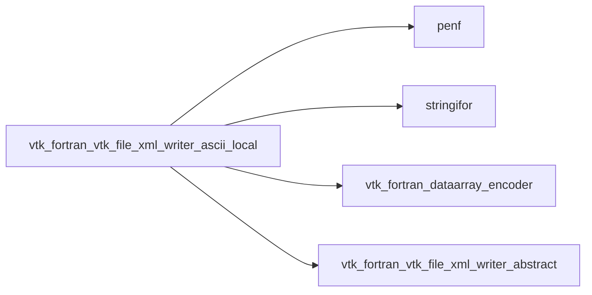
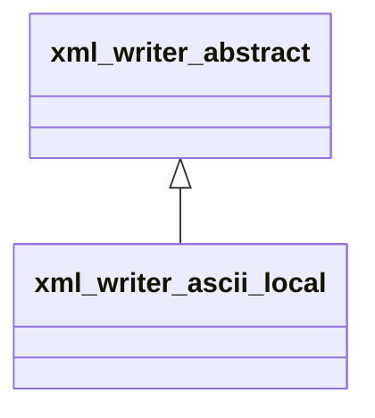
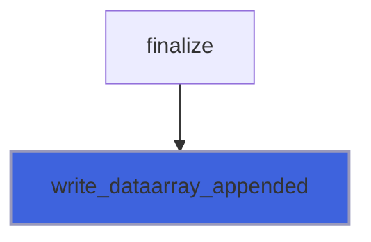
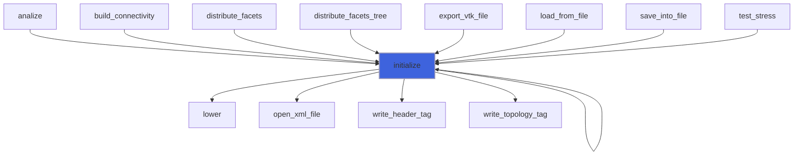
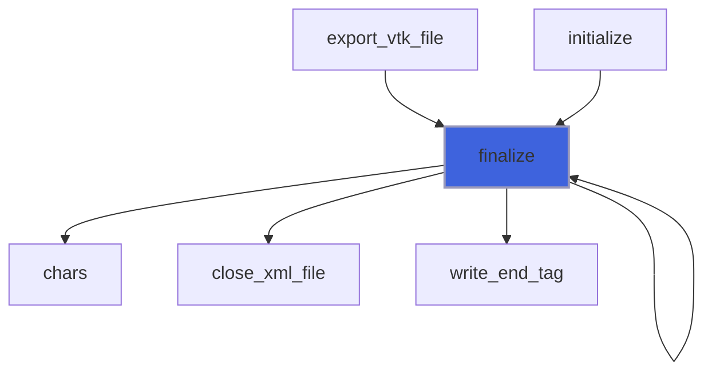
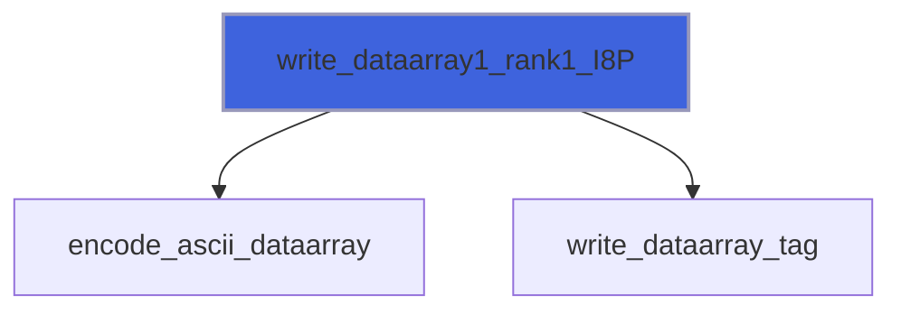
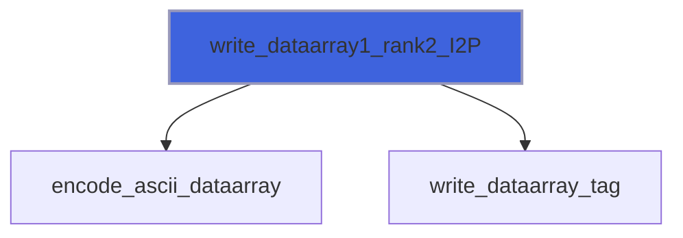
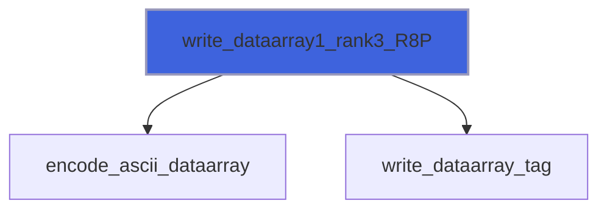

# vtk_fortran_vtk_file_xml_writer_ascii_local

> VTK file XMl writer, ascii local.

**Source**: `src/third_party/VTKFortran/src/lib/vtk_fortran_vtk_file_xml_writer_ascii_local.f90`

**Dependencies**



## Contents

- [xml_writer_ascii_local](#xml-writer-ascii-local)
- [write_dataarray_appended](#write-dataarray-appended)
- [initialize](#initialize)
- [finalize](#finalize)
- [write_dataarray1_rank1_R8P](#write-dataarray1-rank1-r8p)
- [write_dataarray1_rank1_R4P](#write-dataarray1-rank1-r4p)
- [write_dataarray1_rank1_I8P](#write-dataarray1-rank1-i8p)
- [write_dataarray1_rank1_I4P](#write-dataarray1-rank1-i4p)
- [write_dataarray1_rank1_I2P](#write-dataarray1-rank1-i2p)
- [write_dataarray1_rank1_I1P](#write-dataarray1-rank1-i1p)
- [write_dataarray1_rank2_R8P](#write-dataarray1-rank2-r8p)
- [write_dataarray1_rank2_R4P](#write-dataarray1-rank2-r4p)
- [write_dataarray1_rank2_I8P](#write-dataarray1-rank2-i8p)
- [write_dataarray1_rank2_I4P](#write-dataarray1-rank2-i4p)
- [write_dataarray1_rank2_I2P](#write-dataarray1-rank2-i2p)
- [write_dataarray1_rank2_I1P](#write-dataarray1-rank2-i1p)
- [write_dataarray1_rank3_R8P](#write-dataarray1-rank3-r8p)
- [write_dataarray1_rank3_R4P](#write-dataarray1-rank3-r4p)
- [write_dataarray1_rank3_I8P](#write-dataarray1-rank3-i8p)
- [write_dataarray1_rank3_I4P](#write-dataarray1-rank3-i4p)
- [write_dataarray1_rank3_I2P](#write-dataarray1-rank3-i2p)
- [write_dataarray1_rank3_I1P](#write-dataarray1-rank3-i1p)
- [write_dataarray1_rank4_R8P](#write-dataarray1-rank4-r8p)
- [write_dataarray1_rank4_R4P](#write-dataarray1-rank4-r4p)
- [write_dataarray1_rank4_I8P](#write-dataarray1-rank4-i8p)
- [write_dataarray1_rank4_I4P](#write-dataarray1-rank4-i4p)
- [write_dataarray1_rank4_I2P](#write-dataarray1-rank4-i2p)
- [write_dataarray1_rank4_I1P](#write-dataarray1-rank4-i1p)
- [write_dataarray3_rank1_R8P](#write-dataarray3-rank1-r8p)
- [write_dataarray3_rank1_R4P](#write-dataarray3-rank1-r4p)
- [write_dataarray3_rank1_I8P](#write-dataarray3-rank1-i8p)
- [write_dataarray3_rank1_I4P](#write-dataarray3-rank1-i4p)
- [write_dataarray3_rank1_I2P](#write-dataarray3-rank1-i2p)
- [write_dataarray3_rank1_I1P](#write-dataarray3-rank1-i1p)
- [write_dataarray3_rank3_R8P](#write-dataarray3-rank3-r8p)
- [write_dataarray3_rank3_R4P](#write-dataarray3-rank3-r4p)
- [write_dataarray3_rank3_I8P](#write-dataarray3-rank3-i8p)
- [write_dataarray3_rank3_I4P](#write-dataarray3-rank3-i4p)
- [write_dataarray3_rank3_I2P](#write-dataarray3-rank3-i2p)
- [write_dataarray3_rank3_I1P](#write-dataarray3-rank3-i1p)
- [write_dataarray6_rank1_R8P](#write-dataarray6-rank1-r8p)
- [write_dataarray6_rank1_R4P](#write-dataarray6-rank1-r4p)
- [write_dataarray6_rank1_I8P](#write-dataarray6-rank1-i8p)
- [write_dataarray6_rank1_I4P](#write-dataarray6-rank1-i4p)
- [write_dataarray6_rank1_I2P](#write-dataarray6-rank1-i2p)
- [write_dataarray6_rank1_I1P](#write-dataarray6-rank1-i1p)
- [write_dataarray6_rank3_R8P](#write-dataarray6-rank3-r8p)
- [write_dataarray6_rank3_R4P](#write-dataarray6-rank3-r4p)
- [write_dataarray6_rank3_I8P](#write-dataarray6-rank3-i8p)
- [write_dataarray6_rank3_I4P](#write-dataarray6-rank3-i4p)
- [write_dataarray6_rank3_I2P](#write-dataarray6-rank3-i2p)
- [write_dataarray6_rank3_I1P](#write-dataarray6-rank3-i1p)

## Derived Types

### xml_writer_ascii_local

VTK file XML writer, ascii local.

**Inheritance**



**Extends**: [`xml_writer_abstract`](/api/src/third_party/VTKFortran/src/lib/vtk_fortran_vtk_file_xml_writer_abstract#xml-writer-abstract)

#### Components

| Name | Type | Attributes | Description |
|------|------|------------|-------------|
| `format_ch` | type([string](/api/src/third_party/StringiFor/src/lib/stringifor_string_t#string)) |  | Output format, string code. |
| `topology` | type([string](/api/src/third_party/StringiFor/src/lib/stringifor_string_t#string)) |  | Mesh topology. |
| `indent` | integer(kind=[I4P](/api/src/third_party/PENF/src/lib/penf_global_parameters_variables)) |  | Indent count. |
| `ioffset` | integer(kind=[I8P](/api/src/third_party/PENF/src/lib/penf_global_parameters_variables)) |  | Offset count. |
| `xml` | integer(kind=[I4P](/api/src/third_party/PENF/src/lib/penf_global_parameters_variables)) |  | XML Logical unit. |
| `vtm_block` | integer(kind=[I4P](/api/src/third_party/PENF/src/lib/penf_global_parameters_variables)) |  | Block indexes. |
| `error` | integer(kind=[I4P](/api/src/third_party/PENF/src/lib/penf_global_parameters_variables)) |  | IO Error status. |
| `tag` | type([xml_tag](/api/src/third_party/FoXy/src/lib/foxy_xml_tag#xml-tag)) |  | XML tags handler. |
| `is_volatile` | logical |  | Flag to check volatile writer. |
| `xml_volatile` | type([string](/api/src/third_party/StringiFor/src/lib/stringifor_string_t#string)) |  | XML file volatile (not a physical file). |

#### Type-Bound Procedures

| Name | Attributes | Description |
|------|------------|-------------|
| `close_xml_file` | pass(self) | Close xml file. |
| `open_xml_file` | pass(self) | Open xml file. |
| `free` | pass(self) | Free allocated memory. |
| `get_xml_volatile` | pass(self) | Return the XML volatile string file. |
| `write_connectivity` | pass(self) | Write connectivity. |
| `write_dataarray_location_tag` | pass(self) | Write dataarray location tag. |
| `write_dataarray_tag` | pass(self) | Write dataarray tag. |
| `write_dataarray_tag_appended` | pass(self) | Write dataarray appended tag. |
| `write_end_tag` | pass(self) | Write `` end tag. |
| `write_header_tag` | pass(self) | Write header tag. |
| `write_parallel_open_block` | pass(self) | Write parallel open block. |
| `write_parallel_close_block` | pass(self) | Write parallel close block. |
| `write_parallel_dataarray` | pass(self) | Write parallel dataarray. |
| `write_parallel_geo` | pass(self) | Write parallel geo. |
| `write_self_closing_tag` | pass(self) | Write self closing tag. |
| `write_start_tag` | pass(self) | Write start tag. |
| `write_tag` | pass(self) | Write tag. |
| `write_topology_tag` | pass(self) | Write topology tag. |
| `write_dataarray` |  | Write data (array). |
| `write_fielddata` |  | Write FieldData tag. |
| `write_geo` |  | Write mesh. |
| `write_parallel_block_files` |  | Write block list of files. |
| `write_piece` |  | Write Piece start/end tag. |
| `initialize` | pass(self) | Initialize writer. |
| `finalize` | pass(self) | Finalize writer. |
| `write_dataarray1_rank1_R8P` | pass(self) | Write dataarray 1, rank 1, R8P. |
| `write_dataarray1_rank1_R4P` | pass(self) | Write dataarray 1, rank 1, R4P. |
| `write_dataarray1_rank1_I8P` | pass(self) | Write dataarray 1, rank 1, I8P. |
| `write_dataarray1_rank1_I4P` | pass(self) | Write dataarray 1, rank 1, I4P. |
| `write_dataarray1_rank1_I2P` | pass(self) | Write dataarray 1, rank 1, I2P. |
| `write_dataarray1_rank1_I1P` | pass(self) | Write dataarray 1, rank 1, I1P. |
| `write_dataarray1_rank2_R8P` | pass(self) | Write dataarray 1, rank 2, R8P. |
| `write_dataarray1_rank2_R4P` | pass(self) | Write dataarray 1, rank 2, R4P. |
| `write_dataarray1_rank2_I8P` | pass(self) | Write dataarray 1, rank 2, I8P. |
| `write_dataarray1_rank2_I4P` | pass(self) | Write dataarray 1, rank 2, I4P. |
| `write_dataarray1_rank2_I2P` | pass(self) | Write dataarray 1, rank 2, I2P. |
| `write_dataarray1_rank2_I1P` | pass(self) | Write dataarray 1, rank 2, I1P. |
| `write_dataarray1_rank3_R8P` | pass(self) | Write dataarray 1, rank 3, R8P. |
| `write_dataarray1_rank3_R4P` | pass(self) | Write dataarray 1, rank 3, R4P. |
| `write_dataarray1_rank3_I8P` | pass(self) | Write dataarray 1, rank 3, I8P. |
| `write_dataarray1_rank3_I4P` | pass(self) | Write dataarray 1, rank 3, I4P. |
| `write_dataarray1_rank3_I2P` | pass(self) | Write dataarray 1, rank 3, I2P. |
| `write_dataarray1_rank3_I1P` | pass(self) | Write dataarray 1, rank 3, I1P. |
| `write_dataarray1_rank4_R8P` | pass(self) | Write dataarray 1, rank 4, R8P. |
| `write_dataarray1_rank4_R4P` | pass(self) | Write dataarray 1, rank 4, R4P. |
| `write_dataarray1_rank4_I8P` | pass(self) | Write dataarray 1, rank 4, I8P. |
| `write_dataarray1_rank4_I4P` | pass(self) | Write dataarray 1, rank 4, I4P. |
| `write_dataarray1_rank4_I2P` | pass(self) | Write dataarray 1, rank 4, I2P. |
| `write_dataarray1_rank4_I1P` | pass(self) | Write dataarray 1, rank 4, I1P. |
| `write_dataarray3_rank1_R8P` | pass(self) | Write dataarray 3, rank 1, R8P. |
| `write_dataarray3_rank1_R4P` | pass(self) | Write dataarray 3, rank 1, R4P. |
| `write_dataarray3_rank1_I8P` | pass(self) | Write dataarray 3, rank 1, I8P. |
| `write_dataarray3_rank1_I4P` | pass(self) | Write dataarray 3, rank 1, I4P. |
| `write_dataarray3_rank1_I2P` | pass(self) | Write dataarray 3, rank 1, I2P. |
| `write_dataarray3_rank1_I1P` | pass(self) | Write dataarray 3, rank 1, I1P. |
| `write_dataarray3_rank3_R8P` | pass(self) | Write dataarray 3, rank 3, R8P. |
| `write_dataarray3_rank3_R4P` | pass(self) | Write dataarray 3, rank 3, R4P. |
| `write_dataarray3_rank3_I8P` | pass(self) | Write dataarray 3, rank 3, I8P. |
| `write_dataarray3_rank3_I4P` | pass(self) | Write dataarray 3, rank 3, I4P. |
| `write_dataarray3_rank3_I2P` | pass(self) | Write dataarray 3, rank 3, I2P. |
| `write_dataarray3_rank3_I1P` | pass(self) | Write dataarray 3, rank 3, I1P. |
| `write_dataarray6_rank1_R8P` | pass(self) | Write dataarray 6, rank 1, R8P. |
| `write_dataarray6_rank1_R4P` | pass(self) | Write dataarray 6, rank 1, R4P. |
| `write_dataarray6_rank1_I8P` | pass(self) | Write dataarray 6, rank 1, I8P. |
| `write_dataarray6_rank1_I4P` | pass(self) | Write dataarray 6, rank 1, I4P. |
| `write_dataarray6_rank1_I2P` | pass(self) | Write dataarray 6, rank 1, I2P. |
| `write_dataarray6_rank1_I1P` | pass(self) | Write dataarray 6, rank 1, I1P. |
| `write_dataarray6_rank3_R8P` | pass(self) | Write dataarray 6, rank 3, R8P. |
| `write_dataarray6_rank3_R4P` | pass(self) | Write dataarray 6, rank 3, R4P. |
| `write_dataarray6_rank3_I8P` | pass(self) | Write dataarray 6, rank 3, I8P. |
| `write_dataarray6_rank3_I4P` | pass(self) | Write dataarray 6, rank 3, I4P. |
| `write_dataarray6_rank3_I2P` | pass(self) | Write dataarray 6, rank 3, I2P. |
| `write_dataarray6_rank3_I1P` | pass(self) | Write dataarray 6, rank 3, I1P. |
| `write_dataarray_appended` | pass(self) | Write appended. |

## Subroutines

### write_dataarray_appended

Do nothing, ascii data cannot be appended.

```fortran
subroutine write_dataarray_appended(self)
```

**Arguments**

| Name | Type | Intent | Attributes | Description |
|------|------|--------|------------|-------------|
| `self` | class([xml_writer_ascii_local](/api/src/third_party/VTKFortran/src/lib/vtk_fortran_vtk_file_xml_writer_ascii_local#xml-writer-ascii-local)) | inout |  | Writer. |

**Call graph**



## Functions

### initialize

Initialize writer.

**Returns**: integer(kind=[I4P](/api/src/third_party/PENF/src/lib/penf_global_parameters_variables))

```fortran
function initialize(self, format, filename, mesh_topology, nx1, nx2, ny1, ny2, nz1, nz2, is_volatile, mesh_kind) result(error)
```

**Arguments**

| Name | Type | Intent | Attributes | Description |
|------|------|--------|------------|-------------|
| `self` | class([xml_writer_ascii_local](/api/src/third_party/VTKFortran/src/lib/vtk_fortran_vtk_file_xml_writer_ascii_local#xml-writer-ascii-local)) | inout |  | Writer. |
| `format` | character(len=*) | in |  | File format: ASCII. |
| `filename` | character(len=*) | in |  | File name. |
| `mesh_topology` | character(len=*) | in |  | Mesh topology. |
| `nx1` | integer(kind=[I4P](/api/src/third_party/PENF/src/lib/penf_global_parameters_variables)) | in | optional | Initial node of x axis. |
| `nx2` | integer(kind=[I4P](/api/src/third_party/PENF/src/lib/penf_global_parameters_variables)) | in | optional | Final node of x axis. |
| `ny1` | integer(kind=[I4P](/api/src/third_party/PENF/src/lib/penf_global_parameters_variables)) | in | optional | Initial node of y axis. |
| `ny2` | integer(kind=[I4P](/api/src/third_party/PENF/src/lib/penf_global_parameters_variables)) | in | optional | Final node of y axis. |
| `nz1` | integer(kind=[I4P](/api/src/third_party/PENF/src/lib/penf_global_parameters_variables)) | in | optional | Initial node of z axis. |
| `nz2` | integer(kind=[I4P](/api/src/third_party/PENF/src/lib/penf_global_parameters_variables)) | in | optional | Final node of z axis. |
| `is_volatile` | logical | in | optional | Flag to check volatile writer. |
| `mesh_kind` | character(len=*) | in | optional | Kind of mesh data: Float64, Float32, ecc. |

**Call graph**



### finalize

Finalize writer.

**Returns**: integer(kind=[I4P](/api/src/third_party/PENF/src/lib/penf_global_parameters_variables))

```fortran
function finalize(self) result(error)
```

**Arguments**

| Name | Type | Intent | Attributes | Description |
|------|------|--------|------------|-------------|
| `self` | class([xml_writer_ascii_local](/api/src/third_party/VTKFortran/src/lib/vtk_fortran_vtk_file_xml_writer_ascii_local#xml-writer-ascii-local)) | inout |  | Writer. |

**Call graph**



### write_dataarray1_rank1_R8P

Write `<DataArray... NumberOfComponents="1"...>...</DataArray>` tag (R8P).

**Returns**: integer(kind=[I4P](/api/src/third_party/PENF/src/lib/penf_global_parameters_variables))

```fortran
function write_dataarray1_rank1_R8P(self, data_name, x, is_tuples) result(error)
```

**Arguments**

| Name | Type | Intent | Attributes | Description |
|------|------|--------|------------|-------------|
| `self` | class([xml_writer_ascii_local](/api/src/third_party/VTKFortran/src/lib/vtk_fortran_vtk_file_xml_writer_ascii_local#xml-writer-ascii-local)) | inout |  | Writer. |
| `data_name` | character(len=*) | in |  | Data name. |
| `x` | real(kind=[R8P](/api/src/third_party/PENF/src/lib/penf_global_parameters_variables)) | in |  | Data variable. |
| `is_tuples` | logical | in | optional | Use "NumberOfTuples" instead of "NumberOfComponents". |

**Call graph**


### write_dataarray1_rank1_R4P

Write `<DataArray... NumberOfComponents="1"...>...</DataArray>` tag (R4P).

**Returns**: integer(kind=[I4P](/api/src/third_party/PENF/src/lib/penf_global_parameters_variables))

```fortran
function write_dataarray1_rank1_R4P(self, data_name, x, is_tuples) result(error)
```

**Arguments**

| Name | Type | Intent | Attributes | Description |
|------|------|--------|------------|-------------|
| `self` | class([xml_writer_ascii_local](/api/src/third_party/VTKFortran/src/lib/vtk_fortran_vtk_file_xml_writer_ascii_local#xml-writer-ascii-local)) | inout |  | Writer. |
| `data_name` | character(len=*) | in |  | Data name. |
| `x` | real(kind=[R4P](/api/src/third_party/PENF/src/lib/penf_global_parameters_variables)) | in |  | Data variable. |
| `is_tuples` | logical | in | optional | Use "NumberOfTuples" instead of "NumberOfComponents". |

**Call graph**


### write_dataarray1_rank1_I8P

Write `<DataArray... NumberOfComponents="1"...>...</DataArray>` tag (I8P).

**Returns**: integer(kind=[I4P](/api/src/third_party/PENF/src/lib/penf_global_parameters_variables))

```fortran
function write_dataarray1_rank1_I8P(self, data_name, x, is_tuples) result(error)
```

**Arguments**

| Name | Type | Intent | Attributes | Description |
|------|------|--------|------------|-------------|
| `self` | class([xml_writer_ascii_local](/api/src/third_party/VTKFortran/src/lib/vtk_fortran_vtk_file_xml_writer_ascii_local#xml-writer-ascii-local)) | inout |  | Writer. |
| `data_name` | character(len=*) | in |  | Data name. |
| `x` | integer(kind=[I8P](/api/src/third_party/PENF/src/lib/penf_global_parameters_variables)) | in |  | Data variable. |
| `is_tuples` | logical | in | optional | Use "NumberOfTuples" instead of "NumberOfComponents". |

**Call graph**



### write_dataarray1_rank1_I4P

Write `<DataArray... NumberOfComponents="1"...>...</DataArray>` tag (I4P).

**Returns**: integer(kind=[I4P](/api/src/third_party/PENF/src/lib/penf_global_parameters_variables))

```fortran
function write_dataarray1_rank1_I4P(self, data_name, x, is_tuples) result(error)
```

**Arguments**

| Name | Type | Intent | Attributes | Description |
|------|------|--------|------------|-------------|
| `self` | class([xml_writer_ascii_local](/api/src/third_party/VTKFortran/src/lib/vtk_fortran_vtk_file_xml_writer_ascii_local#xml-writer-ascii-local)) | inout |  | Writer. |
| `data_name` | character(len=*) | in |  | Data name. |
| `x` | integer(kind=[I4P](/api/src/third_party/PENF/src/lib/penf_global_parameters_variables)) | in |  | Data variable. |
| `is_tuples` | logical | in | optional | Use "NumberOfTuples" instead of "NumberOfComponents". |

**Call graph**


### write_dataarray1_rank1_I2P

Write `<DataArray... NumberOfComponents="1"...>...</DataArray>` tag (I2P).

**Returns**: integer(kind=[I4P](/api/src/third_party/PENF/src/lib/penf_global_parameters_variables))

```fortran
function write_dataarray1_rank1_I2P(self, data_name, x, is_tuples) result(error)
```

**Arguments**

| Name | Type | Intent | Attributes | Description |
|------|------|--------|------------|-------------|
| `self` | class([xml_writer_ascii_local](/api/src/third_party/VTKFortran/src/lib/vtk_fortran_vtk_file_xml_writer_ascii_local#xml-writer-ascii-local)) | inout |  | Writer. |
| `data_name` | character(len=*) | in |  | Data name. |
| `x` | integer(kind=[I2P](/api/src/third_party/PENF/src/lib/penf_global_parameters_variables)) | in |  | Data variable. |
| `is_tuples` | logical | in | optional | Use "NumberOfTuples" instead of "NumberOfComponents". |

**Call graph**


### write_dataarray1_rank1_I1P

Write `<DataArray... NumberOfComponents="1"...>...</DataArray>` tag (I1P).

**Returns**: integer(kind=[I4P](/api/src/third_party/PENF/src/lib/penf_global_parameters_variables))

```fortran
function write_dataarray1_rank1_I1P(self, data_name, x, is_tuples) result(error)
```

**Arguments**

| Name | Type | Intent | Attributes | Description |
|------|------|--------|------------|-------------|
| `self` | class([xml_writer_ascii_local](/api/src/third_party/VTKFortran/src/lib/vtk_fortran_vtk_file_xml_writer_ascii_local#xml-writer-ascii-local)) | inout |  | Writer. |
| `data_name` | character(len=*) | in |  | Data name. |
| `x` | integer(kind=[I1P](/api/src/third_party/PENF/src/lib/penf_global_parameters_variables)) | in |  | Data variable. |
| `is_tuples` | logical | in | optional | Use "NumberOfTuples" instead of "NumberOfComponents". |

**Call graph**


### write_dataarray1_rank2_R8P

Write `<DataArray... NumberOfComponents="n"...>...</DataArray>` tag (R8P).

**Returns**: integer(kind=[I4P](/api/src/third_party/PENF/src/lib/penf_global_parameters_variables))

```fortran
function write_dataarray1_rank2_R8P(self, data_name, x, one_component, is_tuples) result(error)
```

**Arguments**

| Name | Type | Intent | Attributes | Description |
|------|------|--------|------------|-------------|
| `self` | class([xml_writer_ascii_local](/api/src/third_party/VTKFortran/src/lib/vtk_fortran_vtk_file_xml_writer_ascii_local#xml-writer-ascii-local)) | inout |  | Writer. |
| `data_name` | character(len=*) | in |  | Data name. |
| `x` | real(kind=[R8P](/api/src/third_party/PENF/src/lib/penf_global_parameters_variables)) | in |  | Data variable. |
| `one_component` | logical | in | optional | Force one component. |
| `is_tuples` | logical | in | optional | Use "NumberOfTuples" instead of "NumberOfComponents". |

**Call graph**


### write_dataarray1_rank2_R4P

Write `<DataArray... NumberOfComponents="n"...>...</DataArray>` tag (R4P).

**Returns**: integer(kind=[I4P](/api/src/third_party/PENF/src/lib/penf_global_parameters_variables))

```fortran
function write_dataarray1_rank2_R4P(self, data_name, x, one_component, is_tuples) result(error)
```

**Arguments**

| Name | Type | Intent | Attributes | Description |
|------|------|--------|------------|-------------|
| `self` | class([xml_writer_ascii_local](/api/src/third_party/VTKFortran/src/lib/vtk_fortran_vtk_file_xml_writer_ascii_local#xml-writer-ascii-local)) | inout |  | Writer. |
| `data_name` | character(len=*) | in |  | Data name. |
| `x` | real(kind=[R4P](/api/src/third_party/PENF/src/lib/penf_global_parameters_variables)) | in |  | Data variable. |
| `one_component` | logical | in | optional | Force one component. |
| `is_tuples` | logical | in | optional | Use "NumberOfTuples" instead of "NumberOfComponents". |

**Call graph**


### write_dataarray1_rank2_I8P

Write `<DataArray... NumberOfComponents="n"...>...</DataArray>` tag (I8P).

**Returns**: integer(kind=[I4P](/api/src/third_party/PENF/src/lib/penf_global_parameters_variables))

```fortran
function write_dataarray1_rank2_I8P(self, data_name, x, one_component, is_tuples) result(error)
```

**Arguments**

| Name | Type | Intent | Attributes | Description |
|------|------|--------|------------|-------------|
| `self` | class([xml_writer_ascii_local](/api/src/third_party/VTKFortran/src/lib/vtk_fortran_vtk_file_xml_writer_ascii_local#xml-writer-ascii-local)) | inout |  | Writer. |
| `data_name` | character(len=*) | in |  | Data name. |
| `x` | integer(kind=[I8P](/api/src/third_party/PENF/src/lib/penf_global_parameters_variables)) | in |  | Data variable. |
| `one_component` | logical | in | optional | Force one component. |
| `is_tuples` | logical | in | optional | Use "NumberOfTuples" instead of "NumberOfComponents". |

**Call graph**


### write_dataarray1_rank2_I4P

Write `<DataArray... NumberOfComponents="n"...>...</DataArray>` tag (I4P).

**Returns**: integer(kind=[I4P](/api/src/third_party/PENF/src/lib/penf_global_parameters_variables))

```fortran
function write_dataarray1_rank2_I4P(self, data_name, x, one_component, is_tuples) result(error)
```

**Arguments**

| Name | Type | Intent | Attributes | Description |
|------|------|--------|------------|-------------|
| `self` | class([xml_writer_ascii_local](/api/src/third_party/VTKFortran/src/lib/vtk_fortran_vtk_file_xml_writer_ascii_local#xml-writer-ascii-local)) | inout |  | Writer. |
| `data_name` | character(len=*) | in |  | Data name. |
| `x` | integer(kind=[I4P](/api/src/third_party/PENF/src/lib/penf_global_parameters_variables)) | in |  | Data variable. |
| `one_component` | logical | in | optional | Force one component. |
| `is_tuples` | logical | in | optional | Use "NumberOfTuples" instead of "NumberOfComponents". |

**Call graph**


### write_dataarray1_rank2_I2P

Write `<DataArray... NumberOfComponents="n"...>...</DataArray>` tag (I2P).

**Returns**: integer(kind=[I4P](/api/src/third_party/PENF/src/lib/penf_global_parameters_variables))

```fortran
function write_dataarray1_rank2_I2P(self, data_name, x, one_component, is_tuples) result(error)
```

**Arguments**

| Name | Type | Intent | Attributes | Description |
|------|------|--------|------------|-------------|
| `self` | class([xml_writer_ascii_local](/api/src/third_party/VTKFortran/src/lib/vtk_fortran_vtk_file_xml_writer_ascii_local#xml-writer-ascii-local)) | inout |  | Writer. |
| `data_name` | character(len=*) | in |  | Data name. |
| `x` | integer(kind=[I2P](/api/src/third_party/PENF/src/lib/penf_global_parameters_variables)) | in |  | Data variable. |
| `one_component` | logical | in | optional | Force one component. |
| `is_tuples` | logical | in | optional | Use "NumberOfTuples" instead of "NumberOfComponents". |

**Call graph**



### write_dataarray1_rank2_I1P

Write `<DataArray... NumberOfComponents="n"...>...</DataArray>` tag (I1P).

**Returns**: integer(kind=[I4P](/api/src/third_party/PENF/src/lib/penf_global_parameters_variables))

```fortran
function write_dataarray1_rank2_I1P(self, data_name, x, one_component, is_tuples) result(error)
```

**Arguments**

| Name | Type | Intent | Attributes | Description |
|------|------|--------|------------|-------------|
| `self` | class([xml_writer_ascii_local](/api/src/third_party/VTKFortran/src/lib/vtk_fortran_vtk_file_xml_writer_ascii_local#xml-writer-ascii-local)) | inout |  | Writer. |
| `data_name` | character(len=*) | in |  | Data name. |
| `x` | integer(kind=[I1P](/api/src/third_party/PENF/src/lib/penf_global_parameters_variables)) | in |  | Data variable. |
| `one_component` | logical | in | optional | Force one component. |
| `is_tuples` | logical | in | optional | Use "NumberOfTuples" instead of "NumberOfComponents". |

**Call graph**


### write_dataarray1_rank3_R8P

Write `<DataArray... NumberOfComponents="n"...>...</DataArray>` tag (R8P).

**Returns**: integer(kind=[I4P](/api/src/third_party/PENF/src/lib/penf_global_parameters_variables))

```fortran
function write_dataarray1_rank3_R8P(self, data_name, x, one_component, is_tuples) result(error)
```

**Arguments**

| Name | Type | Intent | Attributes | Description |
|------|------|--------|------------|-------------|
| `self` | class([xml_writer_ascii_local](/api/src/third_party/VTKFortran/src/lib/vtk_fortran_vtk_file_xml_writer_ascii_local#xml-writer-ascii-local)) | inout |  | Writer. |
| `data_name` | character(len=*) | in |  | Data name. |
| `x` | real(kind=[R8P](/api/src/third_party/PENF/src/lib/penf_global_parameters_variables)) | in |  | Data variable. |
| `one_component` | logical | in | optional | Force one component. |
| `is_tuples` | logical | in | optional | Use "NumberOfTuples" instead of "NumberOfComponents". |

**Call graph**



### write_dataarray1_rank3_R4P

Write `<DataArray... NumberOfComponents="n"...>...</DataArray>` tag (R4P).

**Returns**: integer(kind=[I4P](/api/src/third_party/PENF/src/lib/penf_global_parameters_variables))

```fortran
function write_dataarray1_rank3_R4P(self, data_name, x, one_component, is_tuples) result(error)
```

**Arguments**

| Name | Type | Intent | Attributes | Description |
|------|------|--------|------------|-------------|
| `self` | class([xml_writer_ascii_local](/api/src/third_party/VTKFortran/src/lib/vtk_fortran_vtk_file_xml_writer_ascii_local#xml-writer-ascii-local)) | inout |  | Writer. |
| `data_name` | character(len=*) | in |  | Data name. |
| `x` | real(kind=[R4P](/api/src/third_party/PENF/src/lib/penf_global_parameters_variables)) | in |  | Data variable. |
| `one_component` | logical | in | optional | Force one component. |
| `is_tuples` | logical | in | optional | Use "NumberOfTuples" instead of "NumberOfComponents". |

**Call graph**


### write_dataarray1_rank3_I8P

Write `<DataArray... NumberOfComponents="n"...>...</DataArray>` tag (I8P).

**Returns**: integer(kind=[I4P](/api/src/third_party/PENF/src/lib/penf_global_parameters_variables))

```fortran
function write_dataarray1_rank3_I8P(self, data_name, x, one_component, is_tuples) result(error)
```

**Arguments**

| Name | Type | Intent | Attributes | Description |
|------|------|--------|------------|-------------|
| `self` | class([xml_writer_ascii_local](/api/src/third_party/VTKFortran/src/lib/vtk_fortran_vtk_file_xml_writer_ascii_local#xml-writer-ascii-local)) | inout |  | Writer. |
| `data_name` | character(len=*) | in |  | Data name. |
| `x` | integer(kind=[I8P](/api/src/third_party/PENF/src/lib/penf_global_parameters_variables)) | in |  | Data variable. |
| `one_component` | logical | in | optional | Force one component. |
| `is_tuples` | logical | in | optional | Use "NumberOfTuples" instead of "NumberOfComponents". |

**Call graph**


### write_dataarray1_rank3_I4P

Write `<DataArray... NumberOfComponents="n"...>...</DataArray>` tag (I4P).

**Returns**: integer(kind=[I4P](/api/src/third_party/PENF/src/lib/penf_global_parameters_variables))

```fortran
function write_dataarray1_rank3_I4P(self, data_name, x, one_component, is_tuples) result(error)
```

**Arguments**

| Name | Type | Intent | Attributes | Description |
|------|------|--------|------------|-------------|
| `self` | class([xml_writer_ascii_local](/api/src/third_party/VTKFortran/src/lib/vtk_fortran_vtk_file_xml_writer_ascii_local#xml-writer-ascii-local)) | inout |  | Writer. |
| `data_name` | character(len=*) | in |  | Data name. |
| `x` | integer(kind=[I4P](/api/src/third_party/PENF/src/lib/penf_global_parameters_variables)) | in |  | Data variable. |
| `one_component` | logical | in | optional | Force one component. |
| `is_tuples` | logical | in | optional | Use "NumberOfTuples" instead of "NumberOfComponents". |

**Call graph**

```mermaid
flowchart TD
  write_dataarray1_rank3_I4P["write_dataarray1_rank3_I4P"] --> encode_ascii_dataarray["encode_ascii_dataarray"]
  write_dataarray1_rank3_I4P["write_dataarray1_rank3_I4P"] --> write_dataarray_tag["write_dataarray_tag"]
  style write_dataarray1_rank3_I4P fill:#3e63dd,stroke:#99b,stroke-width:2px
```

### write_dataarray1_rank3_I2P

Write `<DataArray... NumberOfComponents="n"...>...</DataArray>` tag (I2P).

**Returns**: integer(kind=[I4P](/api/src/third_party/PENF/src/lib/penf_global_parameters_variables))

```fortran
function write_dataarray1_rank3_I2P(self, data_name, x, one_component, is_tuples) result(error)
```

**Arguments**

| Name | Type | Intent | Attributes | Description |
|------|------|--------|------------|-------------|
| `self` | class([xml_writer_ascii_local](/api/src/third_party/VTKFortran/src/lib/vtk_fortran_vtk_file_xml_writer_ascii_local#xml-writer-ascii-local)) | inout |  | Writer. |
| `data_name` | character(len=*) | in |  | Data name. |
| `x` | integer(kind=[I2P](/api/src/third_party/PENF/src/lib/penf_global_parameters_variables)) | in |  | Data variable. |
| `one_component` | logical | in | optional | Force one component. |
| `is_tuples` | logical | in | optional | Use "NumberOfTuples" instead of "NumberOfComponents". |

**Call graph**

```mermaid
flowchart TD
  write_dataarray1_rank3_I2P["write_dataarray1_rank3_I2P"] --> encode_ascii_dataarray["encode_ascii_dataarray"]
  write_dataarray1_rank3_I2P["write_dataarray1_rank3_I2P"] --> write_dataarray_tag["write_dataarray_tag"]
  style write_dataarray1_rank3_I2P fill:#3e63dd,stroke:#99b,stroke-width:2px
```

### write_dataarray1_rank3_I1P

Write `<DataArray... NumberOfComponents="n"...>...</DataArray>` tag (I1P).

**Returns**: integer(kind=[I4P](/api/src/third_party/PENF/src/lib/penf_global_parameters_variables))

```fortran
function write_dataarray1_rank3_I1P(self, data_name, x, one_component, is_tuples) result(error)
```

**Arguments**

| Name | Type | Intent | Attributes | Description |
|------|------|--------|------------|-------------|
| `self` | class([xml_writer_ascii_local](/api/src/third_party/VTKFortran/src/lib/vtk_fortran_vtk_file_xml_writer_ascii_local#xml-writer-ascii-local)) | inout |  | Writer. |
| `data_name` | character(len=*) | in |  | Data name. |
| `x` | integer(kind=[I1P](/api/src/third_party/PENF/src/lib/penf_global_parameters_variables)) | in |  | Data variable. |
| `one_component` | logical | in | optional | Force one component. |
| `is_tuples` | logical | in | optional | Use "NumberOfTuples" instead of "NumberOfComponents". |

**Call graph**

```mermaid
flowchart TD
  write_dataarray1_rank3_I1P["write_dataarray1_rank3_I1P"] --> encode_ascii_dataarray["encode_ascii_dataarray"]
  write_dataarray1_rank3_I1P["write_dataarray1_rank3_I1P"] --> write_dataarray_tag["write_dataarray_tag"]
  style write_dataarray1_rank3_I1P fill:#3e63dd,stroke:#99b,stroke-width:2px
```

### write_dataarray1_rank4_R8P

Write `<DataArray... NumberOfComponents="n"...>...</DataArray>` tag (R8P).

**Returns**: integer(kind=[I4P](/api/src/third_party/PENF/src/lib/penf_global_parameters_variables))

```fortran
function write_dataarray1_rank4_R8P(self, data_name, x, one_component, is_tuples) result(error)
```

**Arguments**

| Name | Type | Intent | Attributes | Description |
|------|------|--------|------------|-------------|
| `self` | class([xml_writer_ascii_local](/api/src/third_party/VTKFortran/src/lib/vtk_fortran_vtk_file_xml_writer_ascii_local#xml-writer-ascii-local)) | inout |  | Writer. |
| `data_name` | character(len=*) | in |  | Data name. |
| `x` | real(kind=[R8P](/api/src/third_party/PENF/src/lib/penf_global_parameters_variables)) | in |  | Data variable. |
| `one_component` | logical | in | optional | Force one component. |
| `is_tuples` | logical | in | optional | Use "NumberOfTuples" instead of "NumberOfComponents". |

**Call graph**

```mermaid
flowchart TD
  write_dataarray1_rank4_R8P["write_dataarray1_rank4_R8P"] --> encode_ascii_dataarray["encode_ascii_dataarray"]
  write_dataarray1_rank4_R8P["write_dataarray1_rank4_R8P"] --> write_dataarray_tag["write_dataarray_tag"]
  style write_dataarray1_rank4_R8P fill:#3e63dd,stroke:#99b,stroke-width:2px
```

### write_dataarray1_rank4_R4P

Write `<DataArray... NumberOfComponents="n"...>...</DataArray>` tag (R4P).

**Returns**: integer(kind=[I4P](/api/src/third_party/PENF/src/lib/penf_global_parameters_variables))

```fortran
function write_dataarray1_rank4_R4P(self, data_name, x, one_component, is_tuples) result(error)
```

**Arguments**

| Name | Type | Intent | Attributes | Description |
|------|------|--------|------------|-------------|
| `self` | class([xml_writer_ascii_local](/api/src/third_party/VTKFortran/src/lib/vtk_fortran_vtk_file_xml_writer_ascii_local#xml-writer-ascii-local)) | inout |  | Writer. |
| `data_name` | character(len=*) | in |  | Data name. |
| `x` | real(kind=[R4P](/api/src/third_party/PENF/src/lib/penf_global_parameters_variables)) | in |  | Data variable. |
| `one_component` | logical | in | optional | Force one component. |
| `is_tuples` | logical | in | optional | Use "NumberOfTuples" instead of "NumberOfComponents". |

**Call graph**

```mermaid
flowchart TD
  write_dataarray1_rank4_R4P["write_dataarray1_rank4_R4P"] --> encode_ascii_dataarray["encode_ascii_dataarray"]
  write_dataarray1_rank4_R4P["write_dataarray1_rank4_R4P"] --> write_dataarray_tag["write_dataarray_tag"]
  style write_dataarray1_rank4_R4P fill:#3e63dd,stroke:#99b,stroke-width:2px
```

### write_dataarray1_rank4_I8P

Write `<DataArray... NumberOfComponents="n"...>...</DataArray>` tag (I8P).

**Returns**: integer(kind=[I4P](/api/src/third_party/PENF/src/lib/penf_global_parameters_variables))

```fortran
function write_dataarray1_rank4_I8P(self, data_name, x, one_component, is_tuples) result(error)
```

**Arguments**

| Name | Type | Intent | Attributes | Description |
|------|------|--------|------------|-------------|
| `self` | class([xml_writer_ascii_local](/api/src/third_party/VTKFortran/src/lib/vtk_fortran_vtk_file_xml_writer_ascii_local#xml-writer-ascii-local)) | inout |  | Writer. |
| `data_name` | character(len=*) | in |  | Data name. |
| `x` | integer(kind=[I8P](/api/src/third_party/PENF/src/lib/penf_global_parameters_variables)) | in |  | Data variable. |
| `one_component` | logical | in | optional | Force one component. |
| `is_tuples` | logical | in | optional | Use "NumberOfTuples" instead of "NumberOfComponents". |

**Call graph**

```mermaid
flowchart TD
  write_dataarray1_rank4_I8P["write_dataarray1_rank4_I8P"] --> encode_ascii_dataarray["encode_ascii_dataarray"]
  write_dataarray1_rank4_I8P["write_dataarray1_rank4_I8P"] --> write_dataarray_tag["write_dataarray_tag"]
  style write_dataarray1_rank4_I8P fill:#3e63dd,stroke:#99b,stroke-width:2px
```

### write_dataarray1_rank4_I4P

Write `<DataArray... NumberOfComponents="n"...>...</DataArray>` tag (I4P).

**Returns**: integer(kind=[I4P](/api/src/third_party/PENF/src/lib/penf_global_parameters_variables))

```fortran
function write_dataarray1_rank4_I4P(self, data_name, x, one_component, is_tuples) result(error)
```

**Arguments**

| Name | Type | Intent | Attributes | Description |
|------|------|--------|------------|-------------|
| `self` | class([xml_writer_ascii_local](/api/src/third_party/VTKFortran/src/lib/vtk_fortran_vtk_file_xml_writer_ascii_local#xml-writer-ascii-local)) | inout |  | Writer. |
| `data_name` | character(len=*) | in |  | Data name. |
| `x` | integer(kind=[I4P](/api/src/third_party/PENF/src/lib/penf_global_parameters_variables)) | in |  | Data variable. |
| `one_component` | logical | in | optional | Force one component. |
| `is_tuples` | logical | in | optional | Use "NumberOfTuples" instead of "NumberOfComponents". |

**Call graph**

```mermaid
flowchart TD
  write_dataarray1_rank4_I4P["write_dataarray1_rank4_I4P"] --> encode_ascii_dataarray["encode_ascii_dataarray"]
  write_dataarray1_rank4_I4P["write_dataarray1_rank4_I4P"] --> write_dataarray_tag["write_dataarray_tag"]
  style write_dataarray1_rank4_I4P fill:#3e63dd,stroke:#99b,stroke-width:2px
```

### write_dataarray1_rank4_I2P

Write `<DataArray... NumberOfComponents="n"...>...</DataArray>` tag (I2P).

**Returns**: integer(kind=[I4P](/api/src/third_party/PENF/src/lib/penf_global_parameters_variables))

```fortran
function write_dataarray1_rank4_I2P(self, data_name, x, one_component, is_tuples) result(error)
```

**Arguments**

| Name | Type | Intent | Attributes | Description |
|------|------|--------|------------|-------------|
| `self` | class([xml_writer_ascii_local](/api/src/third_party/VTKFortran/src/lib/vtk_fortran_vtk_file_xml_writer_ascii_local#xml-writer-ascii-local)) | inout |  | Writer. |
| `data_name` | character(len=*) | in |  | Data name. |
| `x` | integer(kind=[I2P](/api/src/third_party/PENF/src/lib/penf_global_parameters_variables)) | in |  | Data variable. |
| `one_component` | logical | in | optional | Force one component. |
| `is_tuples` | logical | in | optional | Use "NumberOfTuples" instead of "NumberOfComponents". |

**Call graph**

```mermaid
flowchart TD
  write_dataarray1_rank4_I2P["write_dataarray1_rank4_I2P"] --> encode_ascii_dataarray["encode_ascii_dataarray"]
  write_dataarray1_rank4_I2P["write_dataarray1_rank4_I2P"] --> write_dataarray_tag["write_dataarray_tag"]
  style write_dataarray1_rank4_I2P fill:#3e63dd,stroke:#99b,stroke-width:2px
```

### write_dataarray1_rank4_I1P

Write `<DataArray... NumberOfComponents="n"...>...</DataArray>` tag (I1P).

**Returns**: integer(kind=[I4P](/api/src/third_party/PENF/src/lib/penf_global_parameters_variables))

```fortran
function write_dataarray1_rank4_I1P(self, data_name, x, one_component, is_tuples) result(error)
```

**Arguments**

| Name | Type | Intent | Attributes | Description |
|------|------|--------|------------|-------------|
| `self` | class([xml_writer_ascii_local](/api/src/third_party/VTKFortran/src/lib/vtk_fortran_vtk_file_xml_writer_ascii_local#xml-writer-ascii-local)) | inout |  | Writer. |
| `data_name` | character(len=*) | in |  | Data name. |
| `x` | integer(kind=[I1P](/api/src/third_party/PENF/src/lib/penf_global_parameters_variables)) | in |  | Data variable. |
| `one_component` | logical | in | optional | Force one component. |
| `is_tuples` | logical | in | optional | Use "NumberOfTuples" instead of "NumberOfComponents". |

**Call graph**

```mermaid
flowchart TD
  write_dataarray1_rank4_I1P["write_dataarray1_rank4_I1P"] --> encode_ascii_dataarray["encode_ascii_dataarray"]
  write_dataarray1_rank4_I1P["write_dataarray1_rank4_I1P"] --> write_dataarray_tag["write_dataarray_tag"]
  style write_dataarray1_rank4_I1P fill:#3e63dd,stroke:#99b,stroke-width:2px
```

### write_dataarray3_rank1_R8P

Write `<DataArray... NumberOfComponents="3"...>...</DataArray>` tag (R8P).

**Returns**: integer(kind=[I4P](/api/src/third_party/PENF/src/lib/penf_global_parameters_variables))

```fortran
function write_dataarray3_rank1_R8P(self, data_name, x, y, z, is_tuples) result(error)
```

**Arguments**

| Name | Type | Intent | Attributes | Description |
|------|------|--------|------------|-------------|
| `self` | class([xml_writer_ascii_local](/api/src/third_party/VTKFortran/src/lib/vtk_fortran_vtk_file_xml_writer_ascii_local#xml-writer-ascii-local)) | inout |  | Writer. |
| `data_name` | character(len=*) | in |  | Data name. |
| `x` | real(kind=[R8P](/api/src/third_party/PENF/src/lib/penf_global_parameters_variables)) | in |  | X component of data variable. |
| `y` | real(kind=[R8P](/api/src/third_party/PENF/src/lib/penf_global_parameters_variables)) | in |  | Y component of data variable. |
| `z` | real(kind=[R8P](/api/src/third_party/PENF/src/lib/penf_global_parameters_variables)) | in |  | Z component of data variable. |
| `is_tuples` | logical | in | optional | Use "NumberOfTuples" instead of "NumberOfComponents". |

**Call graph**

```mermaid
flowchart TD
  write_dataarray3_rank1_R8P["write_dataarray3_rank1_R8P"] --> encode_ascii_dataarray["encode_ascii_dataarray"]
  write_dataarray3_rank1_R8P["write_dataarray3_rank1_R8P"] --> write_dataarray_tag["write_dataarray_tag"]
  style write_dataarray3_rank1_R8P fill:#3e63dd,stroke:#99b,stroke-width:2px
```

### write_dataarray3_rank1_R4P

Write `<DataArray... NumberOfComponents="3"...>...</DataArray>` tag (R4P).

**Returns**: integer(kind=[I4P](/api/src/third_party/PENF/src/lib/penf_global_parameters_variables))

```fortran
function write_dataarray3_rank1_R4P(self, data_name, x, y, z, is_tuples) result(error)
```

**Arguments**

| Name | Type | Intent | Attributes | Description |
|------|------|--------|------------|-------------|
| `self` | class([xml_writer_ascii_local](/api/src/third_party/VTKFortran/src/lib/vtk_fortran_vtk_file_xml_writer_ascii_local#xml-writer-ascii-local)) | inout |  | Writer. |
| `data_name` | character(len=*) | in |  | Data name. |
| `x` | real(kind=[R4P](/api/src/third_party/PENF/src/lib/penf_global_parameters_variables)) | in |  | X component of data variable. |
| `y` | real(kind=[R4P](/api/src/third_party/PENF/src/lib/penf_global_parameters_variables)) | in |  | Y component of data variable. |
| `z` | real(kind=[R4P](/api/src/third_party/PENF/src/lib/penf_global_parameters_variables)) | in |  | Z component of data variable. |
| `is_tuples` | logical | in | optional | Use "NumberOfTuples" instead of "NumberOfComponents". |

**Call graph**

```mermaid
flowchart TD
  write_dataarray3_rank1_R4P["write_dataarray3_rank1_R4P"] --> encode_ascii_dataarray["encode_ascii_dataarray"]
  write_dataarray3_rank1_R4P["write_dataarray3_rank1_R4P"] --> write_dataarray_tag["write_dataarray_tag"]
  style write_dataarray3_rank1_R4P fill:#3e63dd,stroke:#99b,stroke-width:2px
```

### write_dataarray3_rank1_I8P

Write `<DataArray... NumberOfComponents="3"...>...</DataArray>` tag (I8P).

**Returns**: integer(kind=[I4P](/api/src/third_party/PENF/src/lib/penf_global_parameters_variables))

```fortran
function write_dataarray3_rank1_I8P(self, data_name, x, y, z, is_tuples) result(error)
```

**Arguments**

| Name | Type | Intent | Attributes | Description |
|------|------|--------|------------|-------------|
| `self` | class([xml_writer_ascii_local](/api/src/third_party/VTKFortran/src/lib/vtk_fortran_vtk_file_xml_writer_ascii_local#xml-writer-ascii-local)) | inout |  | Writer. |
| `data_name` | character(len=*) | in |  | Data name. |
| `x` | integer(kind=[I8P](/api/src/third_party/PENF/src/lib/penf_global_parameters_variables)) | in |  | X component of data variable. |
| `y` | integer(kind=[I8P](/api/src/third_party/PENF/src/lib/penf_global_parameters_variables)) | in |  | Y component of data variable. |
| `z` | integer(kind=[I8P](/api/src/third_party/PENF/src/lib/penf_global_parameters_variables)) | in |  | Z component of data variable. |
| `is_tuples` | logical | in | optional | Use "NumberOfTuples" instead of "NumberOfComponents". |

**Call graph**

```mermaid
flowchart TD
  write_dataarray3_rank1_I8P["write_dataarray3_rank1_I8P"] --> encode_ascii_dataarray["encode_ascii_dataarray"]
  write_dataarray3_rank1_I8P["write_dataarray3_rank1_I8P"] --> write_dataarray_tag["write_dataarray_tag"]
  style write_dataarray3_rank1_I8P fill:#3e63dd,stroke:#99b,stroke-width:2px
```

### write_dataarray3_rank1_I4P

Write `<DataArray... NumberOfComponents="3"...>...</DataArray>` tag (I4P).

**Returns**: integer(kind=[I4P](/api/src/third_party/PENF/src/lib/penf_global_parameters_variables))

```fortran
function write_dataarray3_rank1_I4P(self, data_name, x, y, z, is_tuples) result(error)
```

**Arguments**

| Name | Type | Intent | Attributes | Description |
|------|------|--------|------------|-------------|
| `self` | class([xml_writer_ascii_local](/api/src/third_party/VTKFortran/src/lib/vtk_fortran_vtk_file_xml_writer_ascii_local#xml-writer-ascii-local)) | inout |  | Writer. |
| `data_name` | character(len=*) | in |  | Data name. |
| `x` | integer(kind=[I4P](/api/src/third_party/PENF/src/lib/penf_global_parameters_variables)) | in |  | X component of data variable. |
| `y` | integer(kind=[I4P](/api/src/third_party/PENF/src/lib/penf_global_parameters_variables)) | in |  | Y component of data variable. |
| `z` | integer(kind=[I4P](/api/src/third_party/PENF/src/lib/penf_global_parameters_variables)) | in |  | Z component of data variable. |
| `is_tuples` | logical | in | optional | Use "NumberOfTuples" instead of "NumberOfComponents". |

**Call graph**

```mermaid
flowchart TD
  write_dataarray3_rank1_I4P["write_dataarray3_rank1_I4P"] --> encode_ascii_dataarray["encode_ascii_dataarray"]
  write_dataarray3_rank1_I4P["write_dataarray3_rank1_I4P"] --> write_dataarray_tag["write_dataarray_tag"]
  style write_dataarray3_rank1_I4P fill:#3e63dd,stroke:#99b,stroke-width:2px
```

### write_dataarray3_rank1_I2P

Write `<DataArray... NumberOfComponents="3"...>...</DataArray>` tag (I2P).

**Returns**: integer(kind=[I4P](/api/src/third_party/PENF/src/lib/penf_global_parameters_variables))

```fortran
function write_dataarray3_rank1_I2P(self, data_name, x, y, z, is_tuples) result(error)
```

**Arguments**

| Name | Type | Intent | Attributes | Description |
|------|------|--------|------------|-------------|
| `self` | class([xml_writer_ascii_local](/api/src/third_party/VTKFortran/src/lib/vtk_fortran_vtk_file_xml_writer_ascii_local#xml-writer-ascii-local)) | inout |  | Writer. |
| `data_name` | character(len=*) | in |  | Data name. |
| `x` | integer(kind=[I2P](/api/src/third_party/PENF/src/lib/penf_global_parameters_variables)) | in |  | X component of data variable. |
| `y` | integer(kind=[I2P](/api/src/third_party/PENF/src/lib/penf_global_parameters_variables)) | in |  | Y component of data variable. |
| `z` | integer(kind=[I2P](/api/src/third_party/PENF/src/lib/penf_global_parameters_variables)) | in |  | Z component of data variable. |
| `is_tuples` | logical | in | optional | Use "NumberOfTuples" instead of "NumberOfComponents". |

**Call graph**

```mermaid
flowchart TD
  write_dataarray3_rank1_I2P["write_dataarray3_rank1_I2P"] --> encode_ascii_dataarray["encode_ascii_dataarray"]
  write_dataarray3_rank1_I2P["write_dataarray3_rank1_I2P"] --> write_dataarray_tag["write_dataarray_tag"]
  style write_dataarray3_rank1_I2P fill:#3e63dd,stroke:#99b,stroke-width:2px
```

### write_dataarray3_rank1_I1P

Write `<DataArray... NumberOfComponents="3"...>...</DataArray>` tag (I1P).

**Returns**: integer(kind=[I4P](/api/src/third_party/PENF/src/lib/penf_global_parameters_variables))

```fortran
function write_dataarray3_rank1_I1P(self, data_name, x, y, z, is_tuples) result(error)
```

**Arguments**

| Name | Type | Intent | Attributes | Description |
|------|------|--------|------------|-------------|
| `self` | class([xml_writer_ascii_local](/api/src/third_party/VTKFortran/src/lib/vtk_fortran_vtk_file_xml_writer_ascii_local#xml-writer-ascii-local)) | inout |  | Writer. |
| `data_name` | character(len=*) | in |  | Data name. |
| `x` | integer(kind=[I1P](/api/src/third_party/PENF/src/lib/penf_global_parameters_variables)) | in |  | X component of data variable. |
| `y` | integer(kind=[I1P](/api/src/third_party/PENF/src/lib/penf_global_parameters_variables)) | in |  | Y component of data variable. |
| `z` | integer(kind=[I1P](/api/src/third_party/PENF/src/lib/penf_global_parameters_variables)) | in |  | Z component of data variable. |
| `is_tuples` | logical | in | optional | Use "NumberOfTuples" instead of "NumberOfComponents". |

**Call graph**

```mermaid
flowchart TD
  write_dataarray3_rank1_I1P["write_dataarray3_rank1_I1P"] --> encode_ascii_dataarray["encode_ascii_dataarray"]
  write_dataarray3_rank1_I1P["write_dataarray3_rank1_I1P"] --> write_dataarray_tag["write_dataarray_tag"]
  style write_dataarray3_rank1_I1P fill:#3e63dd,stroke:#99b,stroke-width:2px
```

### write_dataarray3_rank3_R8P

Write `<DataArray... NumberOfComponents="3"...>...</DataArray>` tag (R8P).

**Returns**: integer(kind=[I4P](/api/src/third_party/PENF/src/lib/penf_global_parameters_variables))

```fortran
function write_dataarray3_rank3_R8P(self, data_name, x, y, z, is_tuples) result(error)
```

**Arguments**

| Name | Type | Intent | Attributes | Description |
|------|------|--------|------------|-------------|
| `self` | class([xml_writer_ascii_local](/api/src/third_party/VTKFortran/src/lib/vtk_fortran_vtk_file_xml_writer_ascii_local#xml-writer-ascii-local)) | inout |  | Writer. |
| `data_name` | character(len=*) | in |  | Data name. |
| `x` | real(kind=[R8P](/api/src/third_party/PENF/src/lib/penf_global_parameters_variables)) | in |  | X component of data variable. |
| `y` | real(kind=[R8P](/api/src/third_party/PENF/src/lib/penf_global_parameters_variables)) | in |  | Y component of data variable. |
| `z` | real(kind=[R8P](/api/src/third_party/PENF/src/lib/penf_global_parameters_variables)) | in |  | Z component of data variable. |
| `is_tuples` | logical | in | optional | Use "NumberOfTuples" instead of "NumberOfComponents". |

**Call graph**

```mermaid
flowchart TD
  write_dataarray3_rank3_R8P["write_dataarray3_rank3_R8P"] --> encode_ascii_dataarray["encode_ascii_dataarray"]
  write_dataarray3_rank3_R8P["write_dataarray3_rank3_R8P"] --> write_dataarray_tag["write_dataarray_tag"]
  style write_dataarray3_rank3_R8P fill:#3e63dd,stroke:#99b,stroke-width:2px
```

### write_dataarray3_rank3_R4P

Write `<DataArray... NumberOfComponents="3"...>...</DataArray>` tag (R4P).

**Returns**: integer(kind=[I4P](/api/src/third_party/PENF/src/lib/penf_global_parameters_variables))

```fortran
function write_dataarray3_rank3_R4P(self, data_name, x, y, z, is_tuples) result(error)
```

**Arguments**

| Name | Type | Intent | Attributes | Description |
|------|------|--------|------------|-------------|
| `self` | class([xml_writer_ascii_local](/api/src/third_party/VTKFortran/src/lib/vtk_fortran_vtk_file_xml_writer_ascii_local#xml-writer-ascii-local)) | inout |  | Writer. |
| `data_name` | character(len=*) | in |  | Data name. |
| `x` | real(kind=[R4P](/api/src/third_party/PENF/src/lib/penf_global_parameters_variables)) | in |  | X component of data variable. |
| `y` | real(kind=[R4P](/api/src/third_party/PENF/src/lib/penf_global_parameters_variables)) | in |  | Y component of data variable. |
| `z` | real(kind=[R4P](/api/src/third_party/PENF/src/lib/penf_global_parameters_variables)) | in |  | Z component of data variable. |
| `is_tuples` | logical | in | optional | Use "NumberOfTuples" instead of "NumberOfComponents". |

**Call graph**

```mermaid
flowchart TD
  write_dataarray3_rank3_R4P["write_dataarray3_rank3_R4P"] --> encode_ascii_dataarray["encode_ascii_dataarray"]
  write_dataarray3_rank3_R4P["write_dataarray3_rank3_R4P"] --> write_dataarray_tag["write_dataarray_tag"]
  style write_dataarray3_rank3_R4P fill:#3e63dd,stroke:#99b,stroke-width:2px
```

### write_dataarray3_rank3_I8P

Write `<DataArray... NumberOfComponents="3"...>...</DataArray>` tag (I8P).

**Returns**: integer(kind=[I4P](/api/src/third_party/PENF/src/lib/penf_global_parameters_variables))

```fortran
function write_dataarray3_rank3_I8P(self, data_name, x, y, z, is_tuples) result(error)
```

**Arguments**

| Name | Type | Intent | Attributes | Description |
|------|------|--------|------------|-------------|
| `self` | class([xml_writer_ascii_local](/api/src/third_party/VTKFortran/src/lib/vtk_fortran_vtk_file_xml_writer_ascii_local#xml-writer-ascii-local)) | inout |  | Writer. |
| `data_name` | character(len=*) | in |  | Data name. |
| `x` | integer(kind=[I8P](/api/src/third_party/PENF/src/lib/penf_global_parameters_variables)) | in |  | X component of data variable. |
| `y` | integer(kind=[I8P](/api/src/third_party/PENF/src/lib/penf_global_parameters_variables)) | in |  | Y component of data variable. |
| `z` | integer(kind=[I8P](/api/src/third_party/PENF/src/lib/penf_global_parameters_variables)) | in |  | Z component of data variable. |
| `is_tuples` | logical | in | optional | Use "NumberOfTuples" instead of "NumberOfComponents". |

**Call graph**

```mermaid
flowchart TD
  write_dataarray3_rank3_I8P["write_dataarray3_rank3_I8P"] --> encode_ascii_dataarray["encode_ascii_dataarray"]
  write_dataarray3_rank3_I8P["write_dataarray3_rank3_I8P"] --> write_dataarray_tag["write_dataarray_tag"]
  style write_dataarray3_rank3_I8P fill:#3e63dd,stroke:#99b,stroke-width:2px
```

### write_dataarray3_rank3_I4P

Write `<DataArray... NumberOfComponents="3"...>...</DataArray>` tag (I4P).

**Returns**: integer(kind=[I4P](/api/src/third_party/PENF/src/lib/penf_global_parameters_variables))

```fortran
function write_dataarray3_rank3_I4P(self, data_name, x, y, z, is_tuples) result(error)
```

**Arguments**

| Name | Type | Intent | Attributes | Description |
|------|------|--------|------------|-------------|
| `self` | class([xml_writer_ascii_local](/api/src/third_party/VTKFortran/src/lib/vtk_fortran_vtk_file_xml_writer_ascii_local#xml-writer-ascii-local)) | inout |  | Writer. |
| `data_name` | character(len=*) | in |  | Data name. |
| `x` | integer(kind=[I4P](/api/src/third_party/PENF/src/lib/penf_global_parameters_variables)) | in |  | X component of data variable. |
| `y` | integer(kind=[I4P](/api/src/third_party/PENF/src/lib/penf_global_parameters_variables)) | in |  | Y component of data variable. |
| `z` | integer(kind=[I4P](/api/src/third_party/PENF/src/lib/penf_global_parameters_variables)) | in |  | Z component of data variable. |
| `is_tuples` | logical | in | optional | Use "NumberOfTuples" instead of "NumberOfComponents". |

**Call graph**

```mermaid
flowchart TD
  write_dataarray3_rank3_I4P["write_dataarray3_rank3_I4P"] --> encode_ascii_dataarray["encode_ascii_dataarray"]
  write_dataarray3_rank3_I4P["write_dataarray3_rank3_I4P"] --> write_dataarray_tag["write_dataarray_tag"]
  style write_dataarray3_rank3_I4P fill:#3e63dd,stroke:#99b,stroke-width:2px
```

### write_dataarray3_rank3_I2P

Write `<DataArray... NumberOfComponents="3"...>...</DataArray>` tag (I2P).

**Returns**: integer(kind=[I4P](/api/src/third_party/PENF/src/lib/penf_global_parameters_variables))

```fortran
function write_dataarray3_rank3_I2P(self, data_name, x, y, z, is_tuples) result(error)
```

**Arguments**

| Name | Type | Intent | Attributes | Description |
|------|------|--------|------------|-------------|
| `self` | class([xml_writer_ascii_local](/api/src/third_party/VTKFortran/src/lib/vtk_fortran_vtk_file_xml_writer_ascii_local#xml-writer-ascii-local)) | inout |  | Writer. |
| `data_name` | character(len=*) | in |  | Data name. |
| `x` | integer(kind=[I2P](/api/src/third_party/PENF/src/lib/penf_global_parameters_variables)) | in |  | X component of data variable. |
| `y` | integer(kind=[I2P](/api/src/third_party/PENF/src/lib/penf_global_parameters_variables)) | in |  | Y component of data variable. |
| `z` | integer(kind=[I2P](/api/src/third_party/PENF/src/lib/penf_global_parameters_variables)) | in |  | Z component of data variable. |
| `is_tuples` | logical | in | optional | Use "NumberOfTuples" instead of "NumberOfComponents". |

**Call graph**

```mermaid
flowchart TD
  write_dataarray3_rank3_I2P["write_dataarray3_rank3_I2P"] --> encode_ascii_dataarray["encode_ascii_dataarray"]
  write_dataarray3_rank3_I2P["write_dataarray3_rank3_I2P"] --> write_dataarray_tag["write_dataarray_tag"]
  style write_dataarray3_rank3_I2P fill:#3e63dd,stroke:#99b,stroke-width:2px
```

### write_dataarray3_rank3_I1P

Write `<DataArray... NumberOfComponents="3"...>...</DataArray>` tag (I1P).

**Returns**: integer(kind=[I4P](/api/src/third_party/PENF/src/lib/penf_global_parameters_variables))

```fortran
function write_dataarray3_rank3_I1P(self, data_name, x, y, z, is_tuples) result(error)
```

**Arguments**

| Name | Type | Intent | Attributes | Description |
|------|------|--------|------------|-------------|
| `self` | class([xml_writer_ascii_local](/api/src/third_party/VTKFortran/src/lib/vtk_fortran_vtk_file_xml_writer_ascii_local#xml-writer-ascii-local)) | inout |  | Writer. |
| `data_name` | character(len=*) | in |  | Data name. |
| `x` | integer(kind=[I1P](/api/src/third_party/PENF/src/lib/penf_global_parameters_variables)) | in |  | X component of data variable. |
| `y` | integer(kind=[I1P](/api/src/third_party/PENF/src/lib/penf_global_parameters_variables)) | in |  | Y component of data variable. |
| `z` | integer(kind=[I1P](/api/src/third_party/PENF/src/lib/penf_global_parameters_variables)) | in |  | Z component of data variable. |
| `is_tuples` | logical | in | optional | Use "NumberOfTuples" instead of "NumberOfComponents". |

**Call graph**

```mermaid
flowchart TD
  write_dataarray3_rank3_I1P["write_dataarray3_rank3_I1P"] --> encode_ascii_dataarray["encode_ascii_dataarray"]
  write_dataarray3_rank3_I1P["write_dataarray3_rank3_I1P"] --> write_dataarray_tag["write_dataarray_tag"]
  style write_dataarray3_rank3_I1P fill:#3e63dd,stroke:#99b,stroke-width:2px
```

### write_dataarray6_rank1_R8P

Write `<DataArray... NumberOfComponents="6"...>...</DataArray>` tag (R8P).

**Returns**: integer(kind=[I4P](/api/src/third_party/PENF/src/lib/penf_global_parameters_variables))

```fortran
function write_dataarray6_rank1_R8P(self, data_name, u, v, w, x, y, z, is_tuples) result(error)
```

**Arguments**

| Name | Type | Intent | Attributes | Description |
|------|------|--------|------------|-------------|
| `self` | class([xml_writer_ascii_local](/api/src/third_party/VTKFortran/src/lib/vtk_fortran_vtk_file_xml_writer_ascii_local#xml-writer-ascii-local)) | inout |  | Writer. |
| `data_name` | character(len=*) | in |  | Data name. |
| `u` | real(kind=[R8P](/api/src/third_party/PENF/src/lib/penf_global_parameters_variables)) | in |  | U component of data variable. |
| `v` | real(kind=[R8P](/api/src/third_party/PENF/src/lib/penf_global_parameters_variables)) | in |  | V component of data variable. |
| `w` | real(kind=[R8P](/api/src/third_party/PENF/src/lib/penf_global_parameters_variables)) | in |  | W component of data variable. |
| `x` | real(kind=[R8P](/api/src/third_party/PENF/src/lib/penf_global_parameters_variables)) | in |  | X component of data variable. |
| `y` | real(kind=[R8P](/api/src/third_party/PENF/src/lib/penf_global_parameters_variables)) | in |  | Y component of data variable. |
| `z` | real(kind=[R8P](/api/src/third_party/PENF/src/lib/penf_global_parameters_variables)) | in |  | Z component of data variable. |
| `is_tuples` | logical | in | optional | Use "NumberOfTuples" instead of "NumberOfComponents". |

**Call graph**

```mermaid
flowchart TD
  write_dataarray6_rank1_R8P["write_dataarray6_rank1_R8P"] --> encode_ascii_dataarray["encode_ascii_dataarray"]
  write_dataarray6_rank1_R8P["write_dataarray6_rank1_R8P"] --> write_dataarray_tag["write_dataarray_tag"]
  style write_dataarray6_rank1_R8P fill:#3e63dd,stroke:#99b,stroke-width:2px
```

### write_dataarray6_rank1_R4P

Write `<DataArray... NumberOfComponents="6"...>...</DataArray>` tag (R4P).

**Returns**: integer(kind=[I4P](/api/src/third_party/PENF/src/lib/penf_global_parameters_variables))

```fortran
function write_dataarray6_rank1_R4P(self, data_name, u, v, w, x, y, z, is_tuples) result(error)
```

**Arguments**

| Name | Type | Intent | Attributes | Description |
|------|------|--------|------------|-------------|
| `self` | class([xml_writer_ascii_local](/api/src/third_party/VTKFortran/src/lib/vtk_fortran_vtk_file_xml_writer_ascii_local#xml-writer-ascii-local)) | inout |  | Writer. |
| `data_name` | character(len=*) | in |  | Data name. |
| `u` | real(kind=[R4P](/api/src/third_party/PENF/src/lib/penf_global_parameters_variables)) | in |  | U component of data variable. |
| `v` | real(kind=[R4P](/api/src/third_party/PENF/src/lib/penf_global_parameters_variables)) | in |  | V component of data variable. |
| `w` | real(kind=[R4P](/api/src/third_party/PENF/src/lib/penf_global_parameters_variables)) | in |  | W component of data variable. |
| `x` | real(kind=[R4P](/api/src/third_party/PENF/src/lib/penf_global_parameters_variables)) | in |  | X component of data variable. |
| `y` | real(kind=[R4P](/api/src/third_party/PENF/src/lib/penf_global_parameters_variables)) | in |  | Y component of data variable. |
| `z` | real(kind=[R4P](/api/src/third_party/PENF/src/lib/penf_global_parameters_variables)) | in |  | Z component of data variable. |
| `is_tuples` | logical | in | optional | Use "NumberOfTuples" instead of "NumberOfComponents". |

**Call graph**

```mermaid
flowchart TD
  write_dataarray6_rank1_R4P["write_dataarray6_rank1_R4P"] --> encode_ascii_dataarray["encode_ascii_dataarray"]
  write_dataarray6_rank1_R4P["write_dataarray6_rank1_R4P"] --> write_dataarray_tag["write_dataarray_tag"]
  style write_dataarray6_rank1_R4P fill:#3e63dd,stroke:#99b,stroke-width:2px
```

### write_dataarray6_rank1_I8P

Write `<DataArray... NumberOfComponents="6"...>...</DataArray>` tag (I8P).

**Returns**: integer(kind=[I4P](/api/src/third_party/PENF/src/lib/penf_global_parameters_variables))

```fortran
function write_dataarray6_rank1_I8P(self, data_name, u, v, w, x, y, z, is_tuples) result(error)
```

**Arguments**

| Name | Type | Intent | Attributes | Description |
|------|------|--------|------------|-------------|
| `self` | class([xml_writer_ascii_local](/api/src/third_party/VTKFortran/src/lib/vtk_fortran_vtk_file_xml_writer_ascii_local#xml-writer-ascii-local)) | inout |  | Writer. |
| `data_name` | character(len=*) | in |  | Data name. |
| `u` | integer(kind=[I8P](/api/src/third_party/PENF/src/lib/penf_global_parameters_variables)) | in |  | U component of data variable. |
| `v` | integer(kind=[I8P](/api/src/third_party/PENF/src/lib/penf_global_parameters_variables)) | in |  | V component of data variable. |
| `w` | integer(kind=[I8P](/api/src/third_party/PENF/src/lib/penf_global_parameters_variables)) | in |  | W component of data variable. |
| `x` | integer(kind=[I8P](/api/src/third_party/PENF/src/lib/penf_global_parameters_variables)) | in |  | X component of data variable. |
| `y` | integer(kind=[I8P](/api/src/third_party/PENF/src/lib/penf_global_parameters_variables)) | in |  | Y component of data variable. |
| `z` | integer(kind=[I8P](/api/src/third_party/PENF/src/lib/penf_global_parameters_variables)) | in |  | Z component of data variable. |
| `is_tuples` | logical | in | optional | Use "NumberOfTuples" instead of "NumberOfComponents". |

**Call graph**

```mermaid
flowchart TD
  write_dataarray6_rank1_I8P["write_dataarray6_rank1_I8P"] --> encode_ascii_dataarray["encode_ascii_dataarray"]
  write_dataarray6_rank1_I8P["write_dataarray6_rank1_I8P"] --> write_dataarray_tag["write_dataarray_tag"]
  style write_dataarray6_rank1_I8P fill:#3e63dd,stroke:#99b,stroke-width:2px
```

### write_dataarray6_rank1_I4P

Write `<DataArray... NumberOfComponents="6"...>...</DataArray>` tag (I4P).

**Returns**: integer(kind=[I4P](/api/src/third_party/PENF/src/lib/penf_global_parameters_variables))

```fortran
function write_dataarray6_rank1_I4P(self, data_name, u, v, w, x, y, z, is_tuples) result(error)
```

**Arguments**

| Name | Type | Intent | Attributes | Description |
|------|------|--------|------------|-------------|
| `self` | class([xml_writer_ascii_local](/api/src/third_party/VTKFortran/src/lib/vtk_fortran_vtk_file_xml_writer_ascii_local#xml-writer-ascii-local)) | inout |  | Writer. |
| `data_name` | character(len=*) | in |  | Data name. |
| `u` | integer(kind=[I4P](/api/src/third_party/PENF/src/lib/penf_global_parameters_variables)) | in |  | U component of data variable. |
| `v` | integer(kind=[I4P](/api/src/third_party/PENF/src/lib/penf_global_parameters_variables)) | in |  | V component of data variable. |
| `w` | integer(kind=[I4P](/api/src/third_party/PENF/src/lib/penf_global_parameters_variables)) | in |  | W component of data variable. |
| `x` | integer(kind=[I4P](/api/src/third_party/PENF/src/lib/penf_global_parameters_variables)) | in |  | X component of data variable. |
| `y` | integer(kind=[I4P](/api/src/third_party/PENF/src/lib/penf_global_parameters_variables)) | in |  | Y component of data variable. |
| `z` | integer(kind=[I4P](/api/src/third_party/PENF/src/lib/penf_global_parameters_variables)) | in |  | Z component of data variable. |
| `is_tuples` | logical | in | optional | Use "NumberOfTuples" instead of "NumberOfComponents". |

**Call graph**

```mermaid
flowchart TD
  write_dataarray6_rank1_I4P["write_dataarray6_rank1_I4P"] --> encode_ascii_dataarray["encode_ascii_dataarray"]
  write_dataarray6_rank1_I4P["write_dataarray6_rank1_I4P"] --> write_dataarray_tag["write_dataarray_tag"]
  style write_dataarray6_rank1_I4P fill:#3e63dd,stroke:#99b,stroke-width:2px
```

### write_dataarray6_rank1_I2P

Write `<DataArray... NumberOfComponents="6"...>...</DataArray>` tag (I2P).

**Returns**: integer(kind=[I4P](/api/src/third_party/PENF/src/lib/penf_global_parameters_variables))

```fortran
function write_dataarray6_rank1_I2P(self, data_name, u, v, w, x, y, z, is_tuples) result(error)
```

**Arguments**

| Name | Type | Intent | Attributes | Description |
|------|------|--------|------------|-------------|
| `self` | class([xml_writer_ascii_local](/api/src/third_party/VTKFortran/src/lib/vtk_fortran_vtk_file_xml_writer_ascii_local#xml-writer-ascii-local)) | inout |  | Writer. |
| `data_name` | character(len=*) | in |  | Data name. |
| `u` | integer(kind=[I2P](/api/src/third_party/PENF/src/lib/penf_global_parameters_variables)) | in |  | U component of data variable. |
| `v` | integer(kind=[I2P](/api/src/third_party/PENF/src/lib/penf_global_parameters_variables)) | in |  | V component of data variable. |
| `w` | integer(kind=[I2P](/api/src/third_party/PENF/src/lib/penf_global_parameters_variables)) | in |  | W component of data variable. |
| `x` | integer(kind=[I2P](/api/src/third_party/PENF/src/lib/penf_global_parameters_variables)) | in |  | X component of data variable. |
| `y` | integer(kind=[I2P](/api/src/third_party/PENF/src/lib/penf_global_parameters_variables)) | in |  | Y component of data variable. |
| `z` | integer(kind=[I2P](/api/src/third_party/PENF/src/lib/penf_global_parameters_variables)) | in |  | Z component of data variable. |
| `is_tuples` | logical | in | optional | Use "NumberOfTuples" instead of "NumberOfComponents". |

**Call graph**

```mermaid
flowchart TD
  write_dataarray6_rank1_I2P["write_dataarray6_rank1_I2P"] --> encode_ascii_dataarray["encode_ascii_dataarray"]
  write_dataarray6_rank1_I2P["write_dataarray6_rank1_I2P"] --> write_dataarray_tag["write_dataarray_tag"]
  style write_dataarray6_rank1_I2P fill:#3e63dd,stroke:#99b,stroke-width:2px
```

### write_dataarray6_rank1_I1P

Write `<DataArray... NumberOfComponents="6"...>...</DataArray>` tag (I1P).

**Returns**: integer(kind=[I4P](/api/src/third_party/PENF/src/lib/penf_global_parameters_variables))

```fortran
function write_dataarray6_rank1_I1P(self, data_name, u, v, w, x, y, z, is_tuples) result(error)
```

**Arguments**

| Name | Type | Intent | Attributes | Description |
|------|------|--------|------------|-------------|
| `self` | class([xml_writer_ascii_local](/api/src/third_party/VTKFortran/src/lib/vtk_fortran_vtk_file_xml_writer_ascii_local#xml-writer-ascii-local)) | inout |  | Writer. |
| `data_name` | character(len=*) | in |  | Data name. |
| `u` | integer(kind=[I1P](/api/src/third_party/PENF/src/lib/penf_global_parameters_variables)) | in |  | U component of data variable. |
| `v` | integer(kind=[I1P](/api/src/third_party/PENF/src/lib/penf_global_parameters_variables)) | in |  | V component of data variable. |
| `w` | integer(kind=[I1P](/api/src/third_party/PENF/src/lib/penf_global_parameters_variables)) | in |  | W component of data variable. |
| `x` | integer(kind=[I1P](/api/src/third_party/PENF/src/lib/penf_global_parameters_variables)) | in |  | X component of data variable. |
| `y` | integer(kind=[I1P](/api/src/third_party/PENF/src/lib/penf_global_parameters_variables)) | in |  | Y component of data variable. |
| `z` | integer(kind=[I1P](/api/src/third_party/PENF/src/lib/penf_global_parameters_variables)) | in |  | Z component of data variable. |
| `is_tuples` | logical | in | optional | Use "NumberOfTuples" instead of "NumberOfComponents". |

**Call graph**

```mermaid
flowchart TD
  write_dataarray6_rank1_I1P["write_dataarray6_rank1_I1P"] --> encode_ascii_dataarray["encode_ascii_dataarray"]
  write_dataarray6_rank1_I1P["write_dataarray6_rank1_I1P"] --> write_dataarray_tag["write_dataarray_tag"]
  style write_dataarray6_rank1_I1P fill:#3e63dd,stroke:#99b,stroke-width:2px
```

### write_dataarray6_rank3_R8P

Write `<DataArray... NumberOfComponents="6"...>...</DataArray>` tag (R8P).

**Returns**: integer(kind=[I4P](/api/src/third_party/PENF/src/lib/penf_global_parameters_variables))

```fortran
function write_dataarray6_rank3_R8P(self, data_name, u, v, w, x, y, z, is_tuples) result(error)
```

**Arguments**

| Name | Type | Intent | Attributes | Description |
|------|------|--------|------------|-------------|
| `self` | class([xml_writer_ascii_local](/api/src/third_party/VTKFortran/src/lib/vtk_fortran_vtk_file_xml_writer_ascii_local#xml-writer-ascii-local)) | inout |  | Writer. |
| `data_name` | character(len=*) | in |  | Data name. |
| `u` | real(kind=[R8P](/api/src/third_party/PENF/src/lib/penf_global_parameters_variables)) | in |  | U component of data variable. |
| `v` | real(kind=[R8P](/api/src/third_party/PENF/src/lib/penf_global_parameters_variables)) | in |  | V component of data variable. |
| `w` | real(kind=[R8P](/api/src/third_party/PENF/src/lib/penf_global_parameters_variables)) | in |  | W component of data variable. |
| `x` | real(kind=[R8P](/api/src/third_party/PENF/src/lib/penf_global_parameters_variables)) | in |  | X component of data variable. |
| `y` | real(kind=[R8P](/api/src/third_party/PENF/src/lib/penf_global_parameters_variables)) | in |  | Y component of data variable. |
| `z` | real(kind=[R8P](/api/src/third_party/PENF/src/lib/penf_global_parameters_variables)) | in |  | Z component of data variable. |
| `is_tuples` | logical | in | optional | Use "NumberOfTuples" instead of "NumberOfComponents". |

**Call graph**

```mermaid
flowchart TD
  write_dataarray6_rank3_R8P["write_dataarray6_rank3_R8P"] --> encode_ascii_dataarray["encode_ascii_dataarray"]
  write_dataarray6_rank3_R8P["write_dataarray6_rank3_R8P"] --> write_dataarray_tag["write_dataarray_tag"]
  style write_dataarray6_rank3_R8P fill:#3e63dd,stroke:#99b,stroke-width:2px
```

### write_dataarray6_rank3_R4P

Write `<DataArray... NumberOfComponents="6"...>...</DataArray>` tag (R4P).

**Returns**: integer(kind=[I4P](/api/src/third_party/PENF/src/lib/penf_global_parameters_variables))

```fortran
function write_dataarray6_rank3_R4P(self, data_name, u, v, w, x, y, z, is_tuples) result(error)
```

**Arguments**

| Name | Type | Intent | Attributes | Description |
|------|------|--------|------------|-------------|
| `self` | class([xml_writer_ascii_local](/api/src/third_party/VTKFortran/src/lib/vtk_fortran_vtk_file_xml_writer_ascii_local#xml-writer-ascii-local)) | inout |  | Writer. |
| `data_name` | character(len=*) | in |  | Data name. |
| `u` | real(kind=[R4P](/api/src/third_party/PENF/src/lib/penf_global_parameters_variables)) | in |  | U component of data variable. |
| `v` | real(kind=[R4P](/api/src/third_party/PENF/src/lib/penf_global_parameters_variables)) | in |  | V component of data variable. |
| `w` | real(kind=[R4P](/api/src/third_party/PENF/src/lib/penf_global_parameters_variables)) | in |  | W component of data variable. |
| `x` | real(kind=[R4P](/api/src/third_party/PENF/src/lib/penf_global_parameters_variables)) | in |  | X component of data variable. |
| `y` | real(kind=[R4P](/api/src/third_party/PENF/src/lib/penf_global_parameters_variables)) | in |  | Y component of data variable. |
| `z` | real(kind=[R4P](/api/src/third_party/PENF/src/lib/penf_global_parameters_variables)) | in |  | Z component of data variable. |
| `is_tuples` | logical | in | optional | Use "NumberOfTuples" instead of "NumberOfComponents". |

**Call graph**

```mermaid
flowchart TD
  write_dataarray6_rank3_R4P["write_dataarray6_rank3_R4P"] --> encode_ascii_dataarray["encode_ascii_dataarray"]
  write_dataarray6_rank3_R4P["write_dataarray6_rank3_R4P"] --> write_dataarray_tag["write_dataarray_tag"]
  style write_dataarray6_rank3_R4P fill:#3e63dd,stroke:#99b,stroke-width:2px
```

### write_dataarray6_rank3_I8P

Write `<DataArray... NumberOfComponents="6"...>...</DataArray>` tag (I8P).

**Returns**: integer(kind=[I4P](/api/src/third_party/PENF/src/lib/penf_global_parameters_variables))

```fortran
function write_dataarray6_rank3_I8P(self, data_name, u, v, w, x, y, z, is_tuples) result(error)
```

**Arguments**

| Name | Type | Intent | Attributes | Description |
|------|------|--------|------------|-------------|
| `self` | class([xml_writer_ascii_local](/api/src/third_party/VTKFortran/src/lib/vtk_fortran_vtk_file_xml_writer_ascii_local#xml-writer-ascii-local)) | inout |  | Writer. |
| `data_name` | character(len=*) | in |  | Data name. |
| `u` | integer(kind=[I8P](/api/src/third_party/PENF/src/lib/penf_global_parameters_variables)) | in |  | U component of data variable. |
| `v` | integer(kind=[I8P](/api/src/third_party/PENF/src/lib/penf_global_parameters_variables)) | in |  | V component of data variable. |
| `w` | integer(kind=[I8P](/api/src/third_party/PENF/src/lib/penf_global_parameters_variables)) | in |  | W component of data variable. |
| `x` | integer(kind=[I8P](/api/src/third_party/PENF/src/lib/penf_global_parameters_variables)) | in |  | X component of data variable. |
| `y` | integer(kind=[I8P](/api/src/third_party/PENF/src/lib/penf_global_parameters_variables)) | in |  | Y component of data variable. |
| `z` | integer(kind=[I8P](/api/src/third_party/PENF/src/lib/penf_global_parameters_variables)) | in |  | Z component of data variable. |
| `is_tuples` | logical | in | optional | Use "NumberOfTuples" instead of "NumberOfComponents". |

**Call graph**

```mermaid
flowchart TD
  write_dataarray6_rank3_I8P["write_dataarray6_rank3_I8P"] --> encode_ascii_dataarray["encode_ascii_dataarray"]
  write_dataarray6_rank3_I8P["write_dataarray6_rank3_I8P"] --> write_dataarray_tag["write_dataarray_tag"]
  style write_dataarray6_rank3_I8P fill:#3e63dd,stroke:#99b,stroke-width:2px
```

### write_dataarray6_rank3_I4P

Write `<DataArray... NumberOfComponents="6"...>...</DataArray>` tag (I4P).

**Returns**: integer(kind=[I4P](/api/src/third_party/PENF/src/lib/penf_global_parameters_variables))

```fortran
function write_dataarray6_rank3_I4P(self, data_name, u, v, w, x, y, z, is_tuples) result(error)
```

**Arguments**

| Name | Type | Intent | Attributes | Description |
|------|------|--------|------------|-------------|
| `self` | class([xml_writer_ascii_local](/api/src/third_party/VTKFortran/src/lib/vtk_fortran_vtk_file_xml_writer_ascii_local#xml-writer-ascii-local)) | inout |  | Writer. |
| `data_name` | character(len=*) | in |  | Data name. |
| `u` | integer(kind=[I4P](/api/src/third_party/PENF/src/lib/penf_global_parameters_variables)) | in |  | U component of data variable. |
| `v` | integer(kind=[I4P](/api/src/third_party/PENF/src/lib/penf_global_parameters_variables)) | in |  | V component of data variable. |
| `w` | integer(kind=[I4P](/api/src/third_party/PENF/src/lib/penf_global_parameters_variables)) | in |  | W component of data variable. |
| `x` | integer(kind=[I4P](/api/src/third_party/PENF/src/lib/penf_global_parameters_variables)) | in |  | X component of data variable. |
| `y` | integer(kind=[I4P](/api/src/third_party/PENF/src/lib/penf_global_parameters_variables)) | in |  | Y component of data variable. |
| `z` | integer(kind=[I4P](/api/src/third_party/PENF/src/lib/penf_global_parameters_variables)) | in |  | Z component of data variable. |
| `is_tuples` | logical | in | optional | Use "NumberOfTuples" instead of "NumberOfComponents". |

**Call graph**

```mermaid
flowchart TD
  write_dataarray6_rank3_I4P["write_dataarray6_rank3_I4P"] --> encode_ascii_dataarray["encode_ascii_dataarray"]
  write_dataarray6_rank3_I4P["write_dataarray6_rank3_I4P"] --> write_dataarray_tag["write_dataarray_tag"]
  style write_dataarray6_rank3_I4P fill:#3e63dd,stroke:#99b,stroke-width:2px
```

### write_dataarray6_rank3_I2P

Write `<DataArray... NumberOfComponents="6"...>...</DataArray>` tag (I2P).

**Returns**: integer(kind=[I4P](/api/src/third_party/PENF/src/lib/penf_global_parameters_variables))

```fortran
function write_dataarray6_rank3_I2P(self, data_name, u, v, w, x, y, z, is_tuples) result(error)
```

**Arguments**

| Name | Type | Intent | Attributes | Description |
|------|------|--------|------------|-------------|
| `self` | class([xml_writer_ascii_local](/api/src/third_party/VTKFortran/src/lib/vtk_fortran_vtk_file_xml_writer_ascii_local#xml-writer-ascii-local)) | inout |  | Writer. |
| `data_name` | character(len=*) | in |  | Data name. |
| `u` | integer(kind=[I2P](/api/src/third_party/PENF/src/lib/penf_global_parameters_variables)) | in |  | U component of data variable. |
| `v` | integer(kind=[I2P](/api/src/third_party/PENF/src/lib/penf_global_parameters_variables)) | in |  | V component of data variable. |
| `w` | integer(kind=[I2P](/api/src/third_party/PENF/src/lib/penf_global_parameters_variables)) | in |  | W component of data variable. |
| `x` | integer(kind=[I2P](/api/src/third_party/PENF/src/lib/penf_global_parameters_variables)) | in |  | X component of data variable. |
| `y` | integer(kind=[I2P](/api/src/third_party/PENF/src/lib/penf_global_parameters_variables)) | in |  | Y component of data variable. |
| `z` | integer(kind=[I2P](/api/src/third_party/PENF/src/lib/penf_global_parameters_variables)) | in |  | Z component of data variable. |
| `is_tuples` | logical | in | optional | Use "NumberOfTuples" instead of "NumberOfComponents". |

**Call graph**

```mermaid
flowchart TD
  write_dataarray6_rank3_I2P["write_dataarray6_rank3_I2P"] --> encode_ascii_dataarray["encode_ascii_dataarray"]
  write_dataarray6_rank3_I2P["write_dataarray6_rank3_I2P"] --> write_dataarray_tag["write_dataarray_tag"]
  style write_dataarray6_rank3_I2P fill:#3e63dd,stroke:#99b,stroke-width:2px
```

### write_dataarray6_rank3_I1P

Write `<DataArray... NumberOfComponents="6"...>...</DataArray>` tag (I1P).

**Returns**: integer(kind=[I4P](/api/src/third_party/PENF/src/lib/penf_global_parameters_variables))

```fortran
function write_dataarray6_rank3_I1P(self, data_name, u, v, w, x, y, z, is_tuples) result(error)
```

**Arguments**

| Name | Type | Intent | Attributes | Description |
|------|------|--------|------------|-------------|
| `self` | class([xml_writer_ascii_local](/api/src/third_party/VTKFortran/src/lib/vtk_fortran_vtk_file_xml_writer_ascii_local#xml-writer-ascii-local)) | inout |  | Writer. |
| `data_name` | character(len=*) | in |  | Data name. |
| `u` | integer(kind=[I1P](/api/src/third_party/PENF/src/lib/penf_global_parameters_variables)) | in |  | U component of data variable. |
| `v` | integer(kind=[I1P](/api/src/third_party/PENF/src/lib/penf_global_parameters_variables)) | in |  | V component of data variable. |
| `w` | integer(kind=[I1P](/api/src/third_party/PENF/src/lib/penf_global_parameters_variables)) | in |  | W component of data variable. |
| `x` | integer(kind=[I1P](/api/src/third_party/PENF/src/lib/penf_global_parameters_variables)) | in |  | X component of data variable. |
| `y` | integer(kind=[I1P](/api/src/third_party/PENF/src/lib/penf_global_parameters_variables)) | in |  | Y component of data variable. |
| `z` | integer(kind=[I1P](/api/src/third_party/PENF/src/lib/penf_global_parameters_variables)) | in |  | Z component of data variable. |
| `is_tuples` | logical | in | optional | Use "NumberOfTuples" instead of "NumberOfComponents". |

**Call graph**

```mermaid
flowchart TD
  write_dataarray6_rank3_I1P["write_dataarray6_rank3_I1P"] --> encode_ascii_dataarray["encode_ascii_dataarray"]
  write_dataarray6_rank3_I1P["write_dataarray6_rank3_I1P"] --> write_dataarray_tag["write_dataarray_tag"]
  style write_dataarray6_rank3_I1P fill:#3e63dd,stroke:#99b,stroke-width:2px
```
