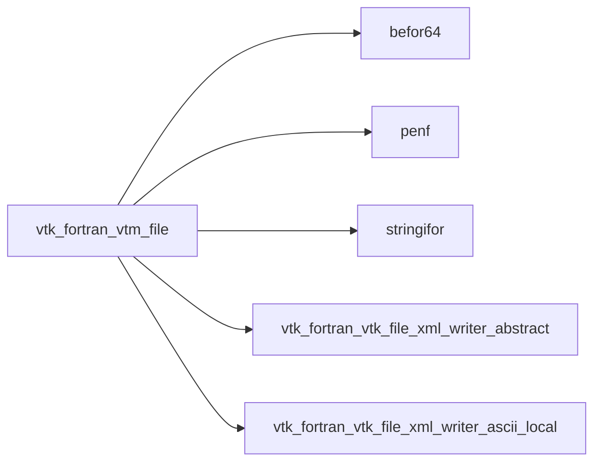
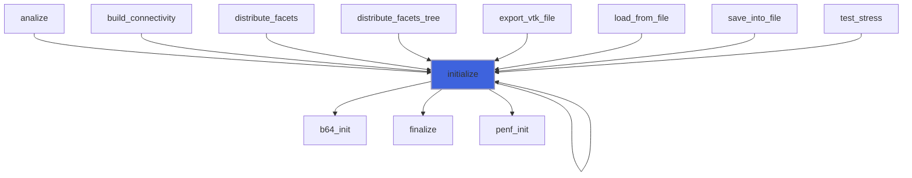
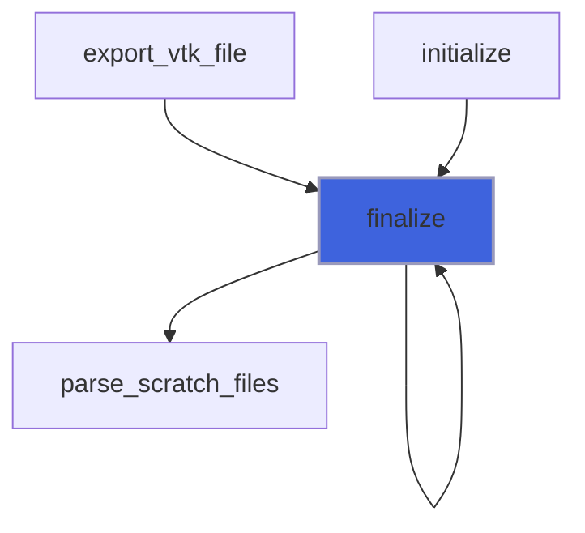
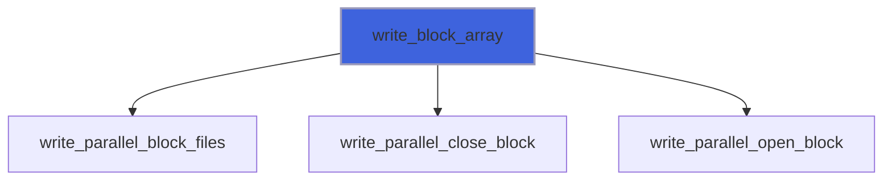
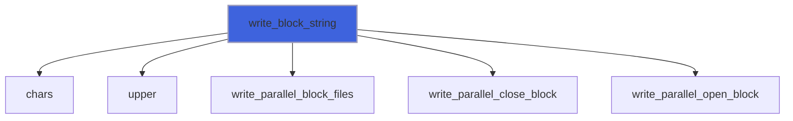
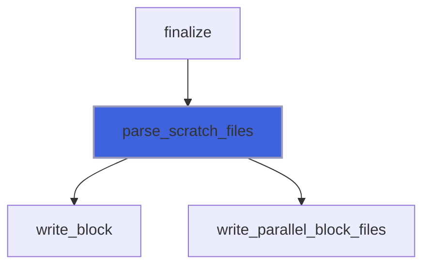
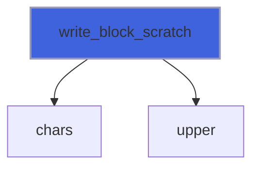

# vtk_fortran_vtm_file

> VTM file class.

**Source**: `src/third_party/VTKFortran/src/lib/vtk_fortran_vtm_file.F90`

**Dependencies**



## Contents

- [vtm_file](#vtm-file)
- [initialize](#initialize)
- [finalize](#finalize)
- [write_block_array](#write-block-array)
- [write_block_string](#write-block-string)
- [parse_scratch_files](#parse-scratch-files)
- [write_block_scratch](#write-block-scratch)

## Derived Types

### vtm_file

VTM file class.

#### Components

| Name | Type | Attributes | Description |
|------|------|------------|-------------|
| `xml_writer` | class([xml_writer_abstract](/api/src/third_party/VTKFortran/src/lib/vtk_fortran_vtk_file_xml_writer_abstract#xml-writer-abstract)) | allocatable | XML writer. |
| `scratch_unit` | integer(kind=[I4P](/api/src/third_party/PENF/src/lib/penf_global_parameters_variables)) | allocatable | Scratch units for very large list of named blocks. |

#### Type-Bound Procedures

| Name | Attributes | Description |
|------|------------|-------------|
| `initialize` | pass(self) | Initialize file. |
| `finalize` | pass(self) | Finalize file. |
| `write_block` |  | Write one block dataset. |
| `write_block_array` | pass(self) | Write one block dataset (array input). |
| `write_block_string` | pass(self) | Write one block dataset (string input). |
| `parse_scratch_files` | pass(self) | Parse scratch files. |
| `write_block_scratch` | pass(self) | Write one block dataset on scratch files. |

## Functions

### initialize

Initialize file (writer).

**Returns**: integer(kind=[I4P](/api/src/third_party/PENF/src/lib/penf_global_parameters_variables))

```fortran
function initialize(self, filename, scratch_units_number) result(error)
```

**Arguments**

| Name | Type | Intent | Attributes | Description |
|------|------|--------|------------|-------------|
| `self` | class([vtm_file](/api/src/third_party/VTKFortran/src/lib/vtk_fortran_vtm_file#vtm-file)) | inout |  | VTM file. |
| `filename` | character(len=*) | in |  | File name of output VTM file. |
| `scratch_units_number` | integer(kind=[I4P](/api/src/third_party/PENF/src/lib/penf_global_parameters_variables)) | in | optional | Number of scratch units for very large list of named blocks. |

**Call graph**



### finalize

Finalize file (writer).

**Returns**: integer(kind=[I4P](/api/src/third_party/PENF/src/lib/penf_global_parameters_variables))

```fortran
function finalize(self) result(error)
```

**Arguments**

| Name | Type | Intent | Attributes | Description |
|------|------|--------|------------|-------------|
| `self` | class([vtm_file](/api/src/third_party/VTKFortran/src/lib/vtk_fortran_vtm_file#vtm-file)) | inout |  | VTM file. |

**Call graph**



### write_block_array

Write one block dataset (array input).

#### Example of usage: 3 files blocks
```fortran
 error = vtm%write_block(filenames=['file_1.vts', 'file_2.vts', 'file_3.vtu'], name='my_block')
```

#### Example of usage: 3 files blocks with custom name
```fortran
 error = vtm%write_block(filenames=['file_1.vts', 'file_2.vts', 'file_3.vtu'], &
                         names=['block-bar', 'block-foo', 'block-baz'], name='my_block')
```

**Returns**: integer(kind=[I4P](/api/src/third_party/PENF/src/lib/penf_global_parameters_variables))

```fortran
function write_block_array(self, filenames, names, name) result(error)
```

**Arguments**

| Name | Type | Intent | Attributes | Description |
|------|------|--------|------------|-------------|
| `self` | class([vtm_file](/api/src/third_party/VTKFortran/src/lib/vtk_fortran_vtm_file#vtm-file)) | inout |  | VTM file. |
| `filenames` | character(len=*) | in |  | File names of VTK files grouped into current block. |
| `names` | character(len=*) | in | optional | Auxiliary names attributed to each files. |
| `name` | character(len=*) | in | optional | Block name |

**Call graph**



### write_block_string

Write one block dataset (string input).

#### Example of usage: 3 files blocks
```fortran
 error = vtm%write_block(filenames='file_1.vts file_2.vts file_3.vtu', name='my_block')
```

#### Example of usage: 3 files blocks with custom name
```fortran
 error = vtm%write_block(filenames='file_1.vts file_2.vts file_3.vtu', names='block-bar block-foo block-baz', name='my_block')
```

**Returns**: integer(kind=[I4P](/api/src/third_party/PENF/src/lib/penf_global_parameters_variables))

```fortran
function write_block_string(self, action, filenames, names, name) result(error)
```

**Arguments**

| Name | Type | Intent | Attributes | Description |
|------|------|--------|------------|-------------|
| `self` | class([vtm_file](/api/src/third_party/VTKFortran/src/lib/vtk_fortran_vtm_file#vtm-file)) | inout |  | VTM file. |
| `action` | character(len=*) | in | optional | Action: [open, close, write]. |
| `filenames` | character(len=*) | in | optional | File names of VTK files grouped into current block. |
| `names` | character(len=*) | in | optional | Auxiliary names attributed to each files. |
| `name` | character(len=*) | in | optional | Block name |

**Call graph**



### parse_scratch_files

Parse scratch files.

**Returns**: integer(kind=[I4P](/api/src/third_party/PENF/src/lib/penf_global_parameters_variables))

```fortran
function parse_scratch_files(self) result(error)
```

**Arguments**

| Name | Type | Intent | Attributes | Description |
|------|------|--------|------------|-------------|
| `self` | class([vtm_file](/api/src/third_party/VTKFortran/src/lib/vtk_fortran_vtm_file#vtm-file)) | inout |  | VTM file. |

**Call graph**



### write_block_scratch

Write one block dataset on scratch files.

**Returns**: integer(kind=[I4P](/api/src/third_party/PENF/src/lib/penf_global_parameters_variables))

```fortran
function write_block_scratch(self, scratch, action, filename, name) result(error)
```

**Arguments**

| Name | Type | Intent | Attributes | Description |
|------|------|--------|------------|-------------|
| `self` | class([vtm_file](/api/src/third_party/VTKFortran/src/lib/vtk_fortran_vtm_file#vtm-file)) | inout |  | VTM file. |
| `scratch` | integer(kind=[I4P](/api/src/third_party/PENF/src/lib/penf_global_parameters_variables)) | in |  | Scratch unit. |
| `action` | character(len=*) | in |  | Action: [open, write]. |
| `filename` | character(len=*) | in | optional | File name of VTK file grouped into current block. |
| `name` | character(len=*) | in | optional | Block name |

**Call graph**


