### coverage-analysis

#### [[fossil_facet_object.f90.gcov]]

|Lines| | |
| --- | --- | --- |
|Executable lines            |384| |
|Executed lines              |313|82%|
|Unexecuted lines            |71|18%|
|Average hits / executed     |7323580.712460064| |

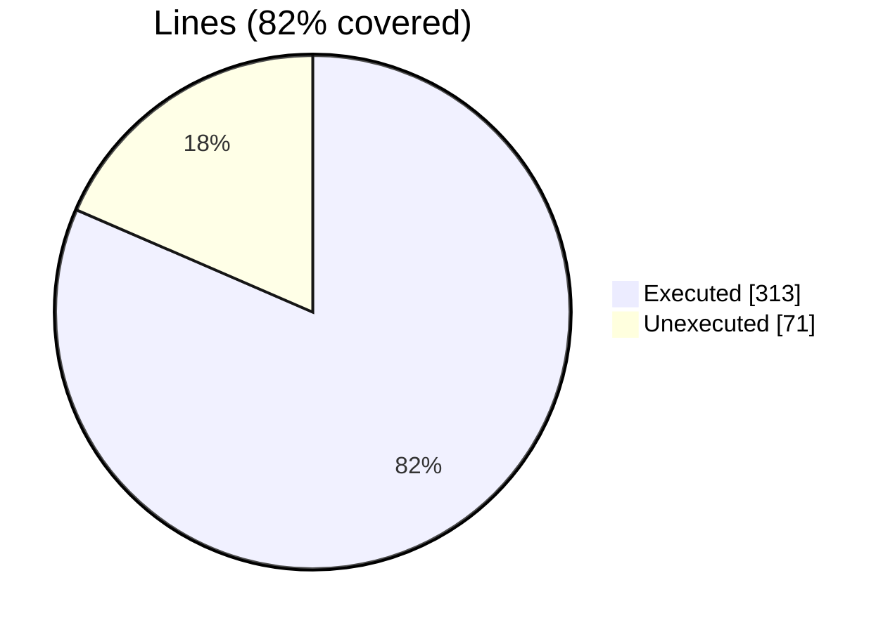
```mermaid
pie showData
    title Lines (82% covered)
    "Executed" : 313
    "Unexecuted" : 71
```

|Procedures| | |
| --- | --- | --- |
|Total procedures            |41| |
|Executed procedures         |33|80%|
|Unexecuted procedures       |8|20%|
|Average hits / executed     |7031995.212121212| |

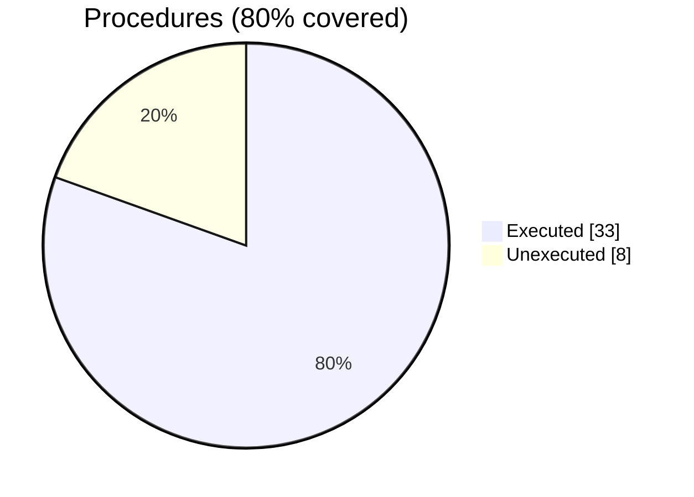
```mermaid
pie showData
    title Procedures (80% covered)
    "Executed" : 33
    "Unexecuted" : 8
```

#### [[fossil_surface_stl.f90.gcov]]

|Lines| | |
| --- | --- | --- |
|Executable lines            |337| |
|Executed lines              |241|72%|
|Unexecuted lines            |96|28%|
|Average hits / executed     |44496.78008298755| |

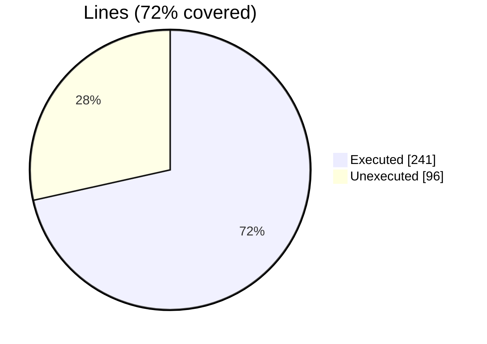
```mermaid
pie showData
    title Lines (72% covered)
    "Executed" : 241
    "Unexecuted" : 96
```

|Procedures| | |
| --- | --- | --- |
|Total procedures            |34| |
|Executed procedures         |25|74%|
|Unexecuted procedures       |9|26%|
|Average hits / executed     |67565.2| |

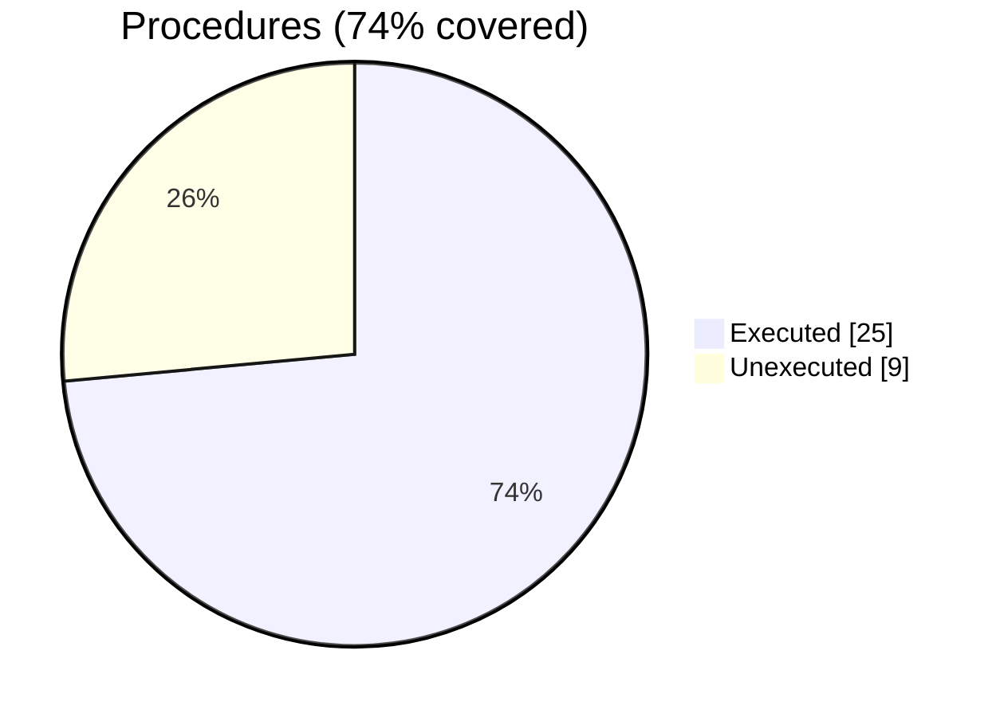
```mermaid
pie showData
    title Procedures (74% covered)
    "Executed" : 25
    "Unexecuted" : 9
```

#### [[fossil_utils.f90.gcov]]

|Lines| | |
| --- | --- | --- |
|Executable lines            |3| |
|Executed lines              |3|100%|
|Unexecuted lines            |0|0%|
|Average hits / executed     |79056.0| |

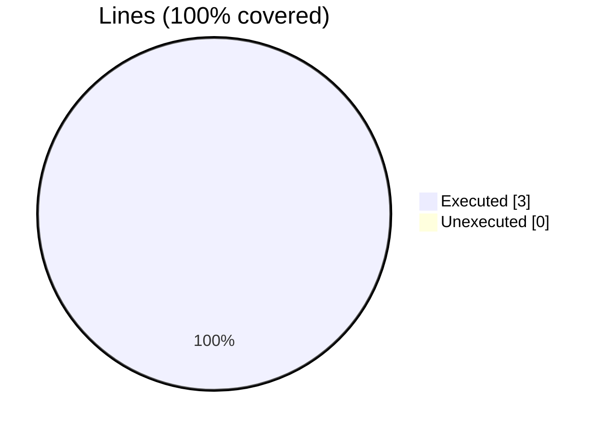
```mermaid
pie showData
    title Lines (100% covered)
    "Executed" : 3
    "Unexecuted" : 0
```

|Procedures| | |
| --- | --- | --- |
|Total procedures            |1| |
|Executed procedures         |1|100%|
|Unexecuted procedures       |0|0%|
|Average hits / executed     |79056.0| |

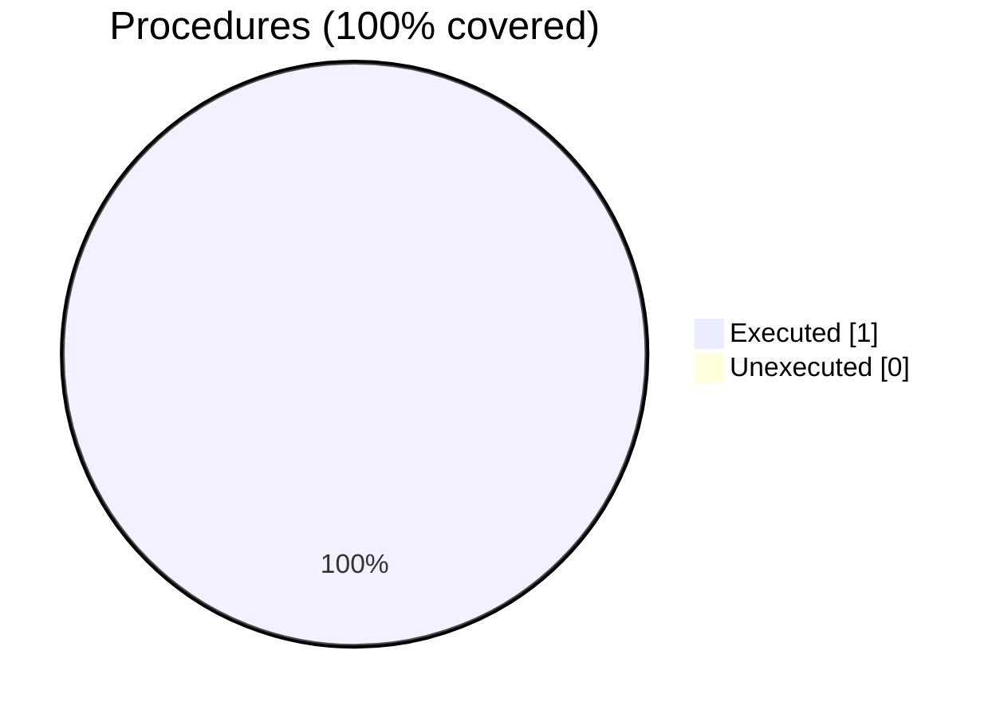
```mermaid
pie showData
    title Procedures (100% covered)
    "Executed" : 1
    "Unexecuted" : 0
```

#### [[fossil_aabb_object.f90.gcov]]

|Lines| | |
| --- | --- | --- |
|Executable lines            |176| |
|Executed lines              |109|62%|
|Unexecuted lines            |67|38%|
|Average hits / executed     |4420195.651376147| |

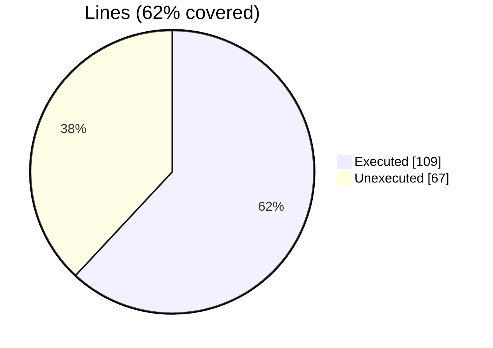
```mermaid
pie showData
    title Lines (62% covered)
    "Executed" : 109
    "Unexecuted" : 67
```

|Procedures| | |
| --- | --- | --- |
|Total procedures            |24| |
|Executed procedures         |15|62%|
|Unexecuted procedures       |9|38%|
|Average hits / executed     |814256.8666666667| |

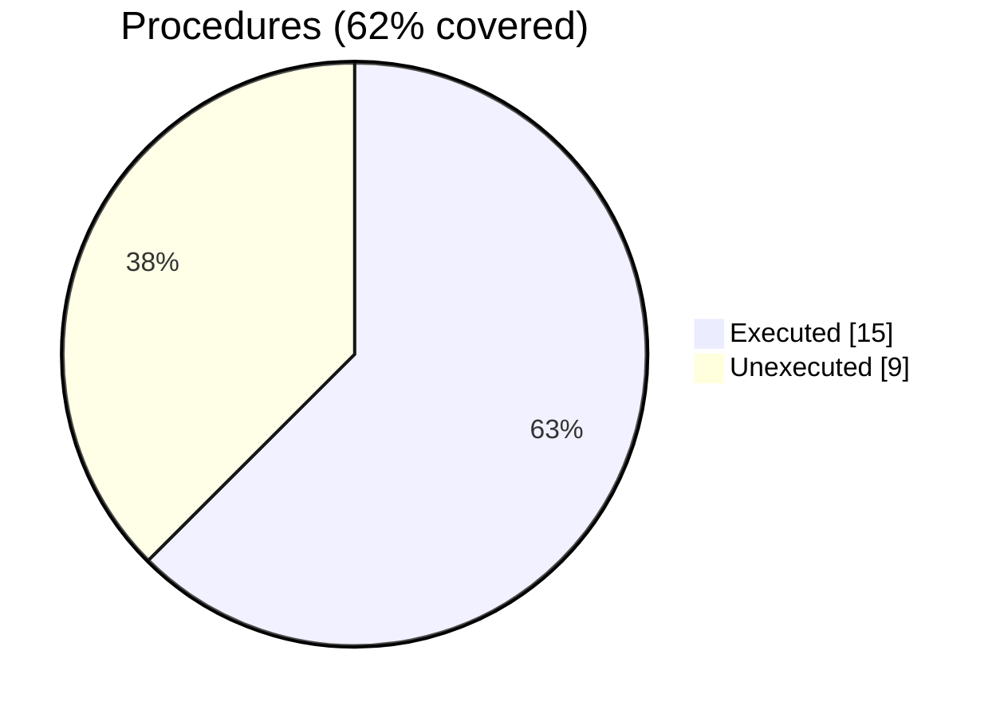
```mermaid
pie showData
    title Procedures (62% covered)
    "Executed" : 15
    "Unexecuted" : 9
```

#### [[fossil_list_id_object.f90.gcov]]

|Lines| | |
| --- | --- | --- |
|Executable lines            |41| |
|Executed lines              |40|98%|
|Unexecuted lines            |1|2%|
|Average hits / executed     |21978862.275| |

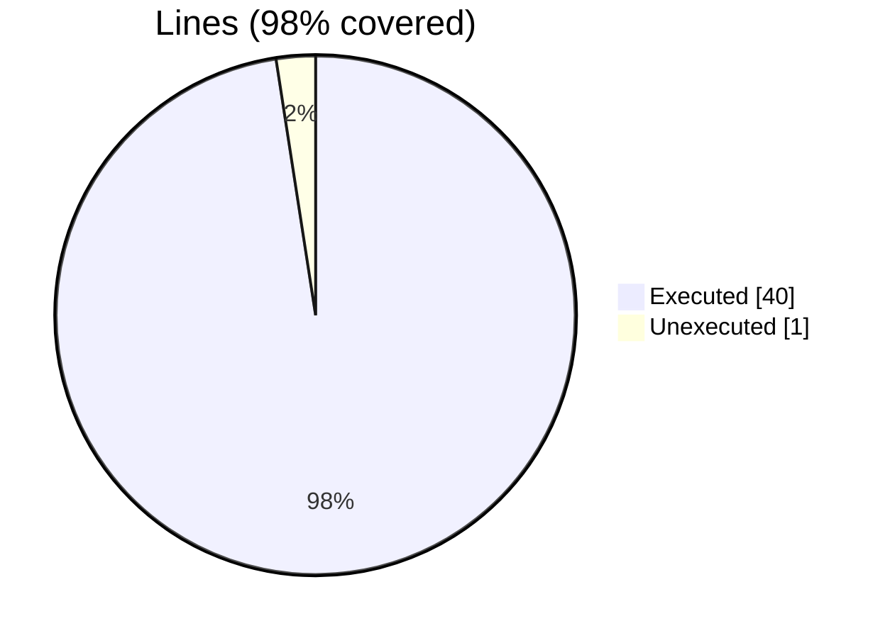
```mermaid
pie showData
    title Lines (98% covered)
    "Executed" : 40
    "Unexecuted" : 1
```

|Procedures| | |
| --- | --- | --- |
|Total procedures            |5| |
|Executed procedures         |5|100%|
|Unexecuted procedures       |0|0%|
|Average hits / executed     |459713.8| |

```mermaid
pie showData
    title Procedures (100% covered)
    "Executed" : 5
    "Unexecuted" : 0
```

#### [[fossil_aabb_node_object.f90.gcov]]

|Lines| | |
| --- | --- | --- |
|Executable lines            |84| |
|Executed lines              |41|49%|
|Unexecuted lines            |43|51%|
|Average hits / executed     |694357.3902439025| |

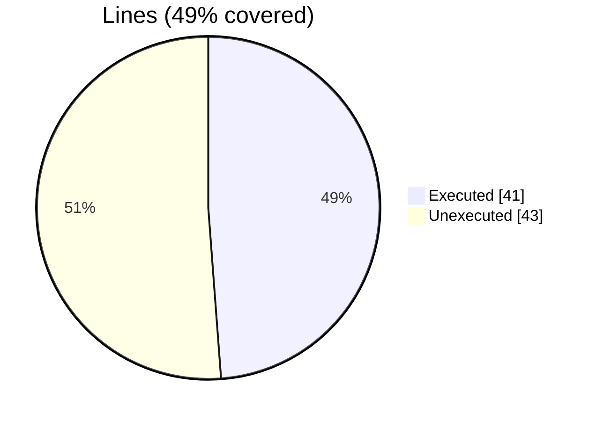
```mermaid
pie showData
    title Lines (49% covered)
    "Executed" : 41
    "Unexecuted" : 43
```

|Procedures| | |
| --- | --- | --- |
|Total procedures            |22| |
|Executed procedures         |11|50%|
|Unexecuted procedures       |11|50%|
|Average hits / executed     |841435.4545454546| |

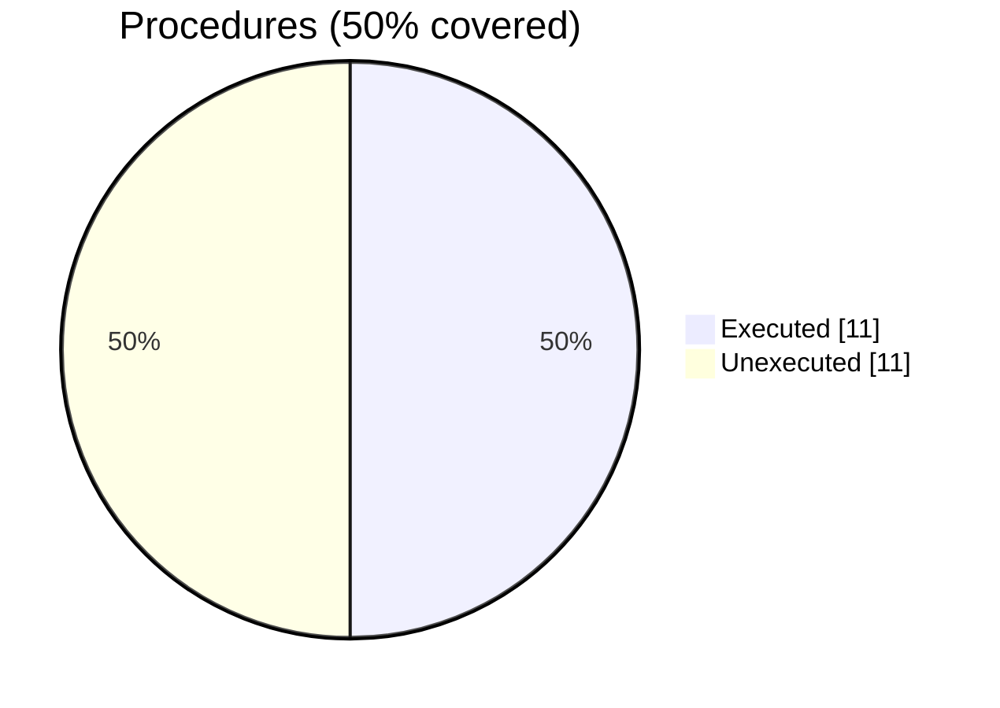
```mermaid
pie showData
    title Procedures (50% covered)
    "Executed" : 11
    "Unexecuted" : 11
```

#### [[fossil_block_object.f90.gcov]]

|Lines| | |
| --- | --- | --- |
|Executable lines            |255| |
|Executed lines              |0|0%|
|Unexecuted lines            |255|100%|
|Average hits / executed     |0| |

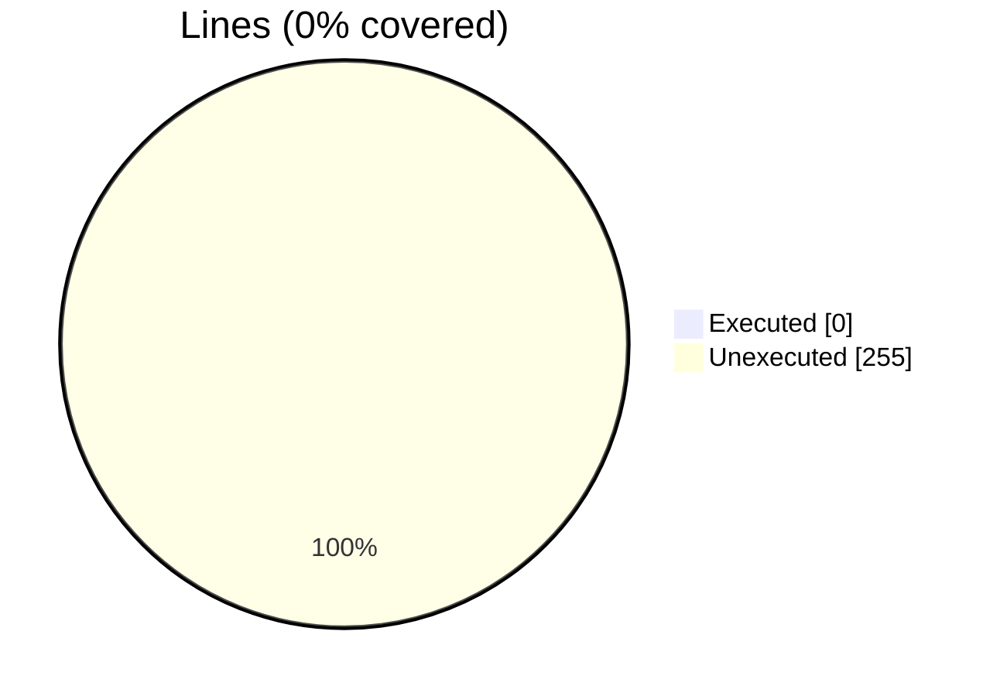
```mermaid
pie showData
    title Lines (0% covered)
    "Executed" : 0
    "Unexecuted" : 255
```

|Procedures| | |
| --- | --- | --- |
|Total procedures            |9| |
|Executed procedures         |0|0%|
|Unexecuted procedures       |9|100%|
|Average hits / executed     |0| |

```mermaid
pie showData
    title Procedures (0% covered)
    "Executed" : 0
    "Unexecuted" : 9
```

#### [[fossil_aabb_tree_object.f90.gcov]]

|Lines| | |
| --- | --- | --- |
|Executable lines            |202| |
|Executed lines              |121|60%|
|Unexecuted lines            |81|40%|
|Average hits / executed     |249296.173553719| |

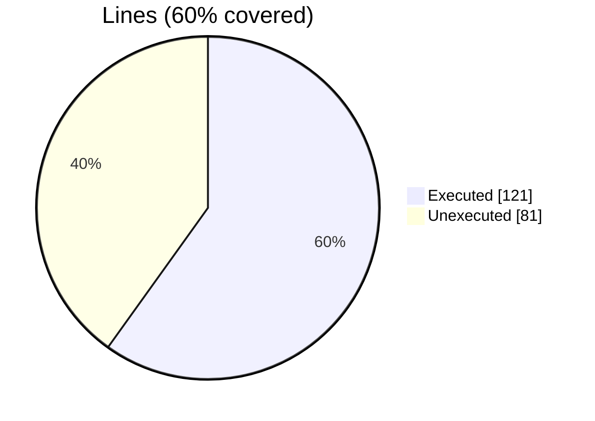
```mermaid
pie showData
    title Lines (60% covered)
    "Executed" : 121
    "Unexecuted" : 81
```

|Procedures| | |
| --- | --- | --- |
|Total procedures            |19| |
|Executed procedures         |14|74%|
|Unexecuted procedures       |5|26%|
|Average hits / executed     |202852.64285714287| |

```mermaid
pie showData
    title Procedures (74% covered)
    "Executed" : 14
    "Unexecuted" : 5
```

#### [[fossil_block_aabb_object.f90.gcov]]

|Lines| | |
| --- | --- | --- |
|Executable lines            |25| |
|Executed lines              |0|0%|
|Unexecuted lines            |25|100%|
|Average hits / executed     |0| |

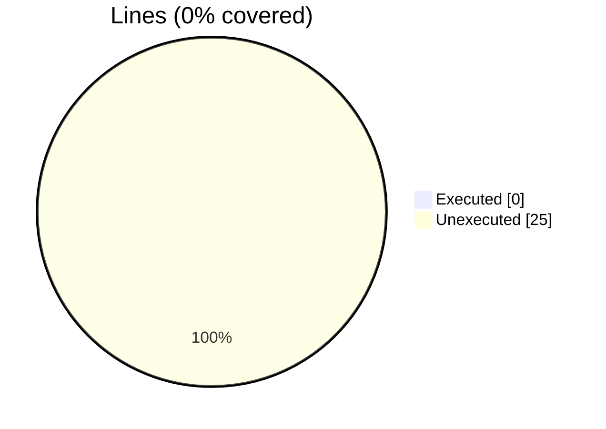
```mermaid
pie showData
    title Lines (0% covered)
    "Executed" : 0
    "Unexecuted" : 25
```

|Procedures| | |
| --- | --- | --- |
|Total procedures            |4| |
|Executed procedures         |0|0%|
|Unexecuted procedures       |4|100%|
|Average hits / executed     |0| |

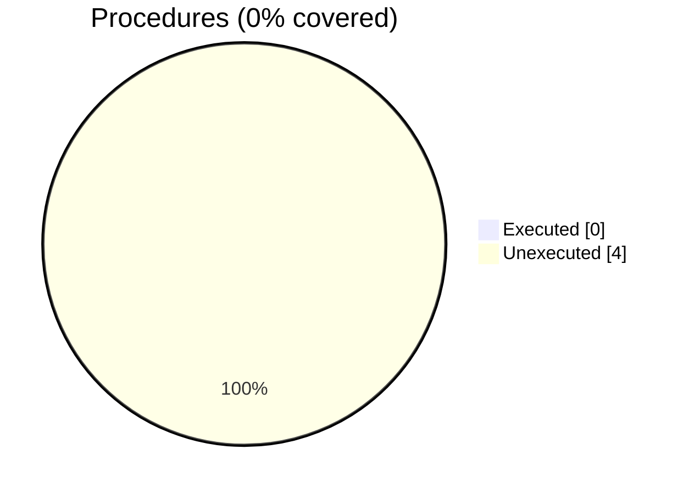
```mermaid
pie showData
    title Procedures (0% covered)
    "Executed" : 0
    "Unexecuted" : 4
```

#### [[fossil_file_stl_object.f90.gcov]]

|Lines| | |
| --- | --- | --- |
|Executable lines            |158| |
|Executed lines              |129|82%|
|Unexecuted lines            |29|18%|
|Average hits / executed     |2308.4418604651164| |

```mermaid
pie showData
    title Lines (82% covered)
    "Executed" : 129
    "Unexecuted" : 29
```

|Procedures| | |
| --- | --- | --- |
|Total procedures            |13| |
|Executed procedures         |12|92%|
|Unexecuted procedures       |1|8%|
|Average hits / executed     |14.083333333333334| |

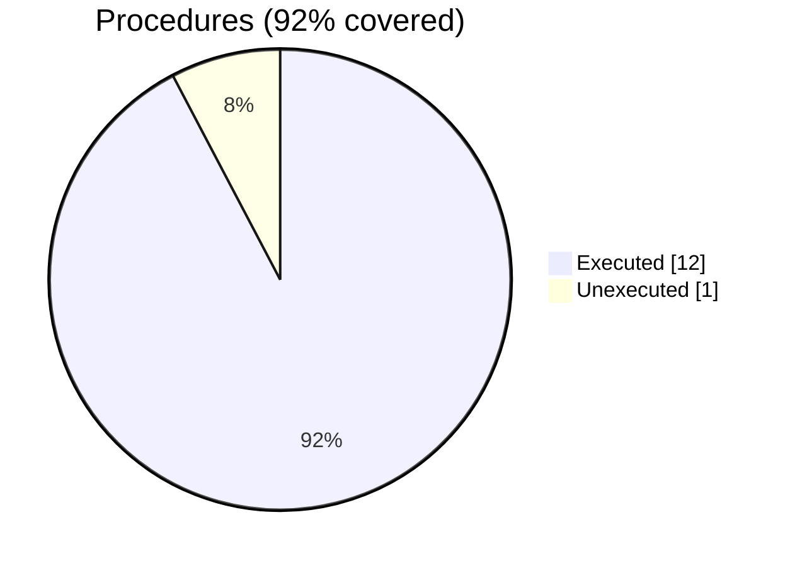
```mermaid
pie showData
    title Procedures (92% covered)
    "Executed" : 12
    "Unexecuted" : 1
```

