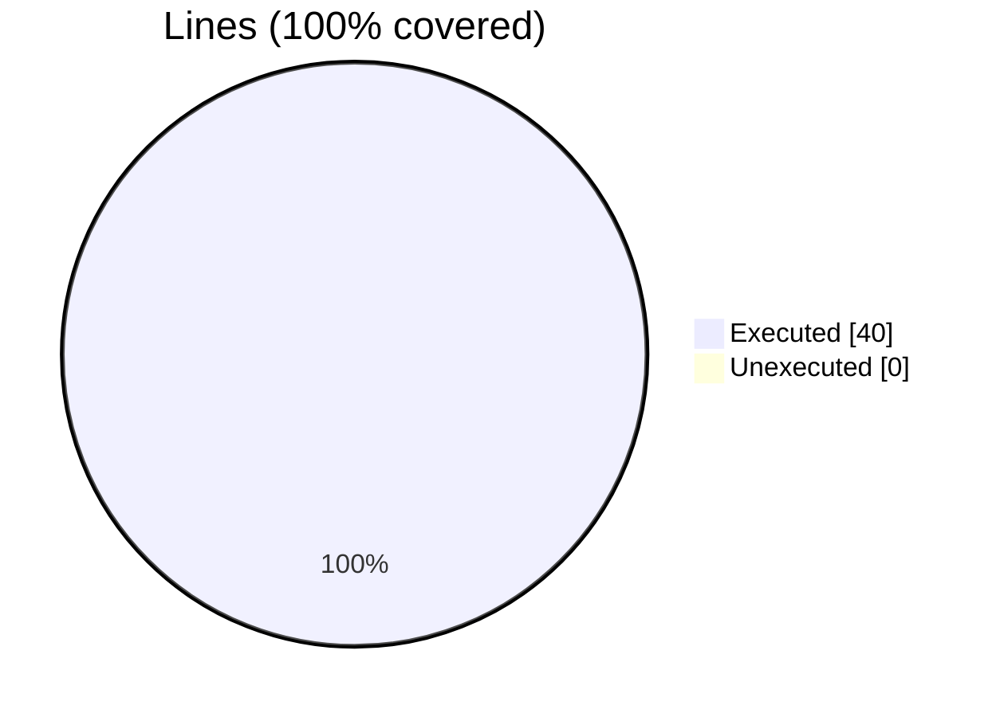
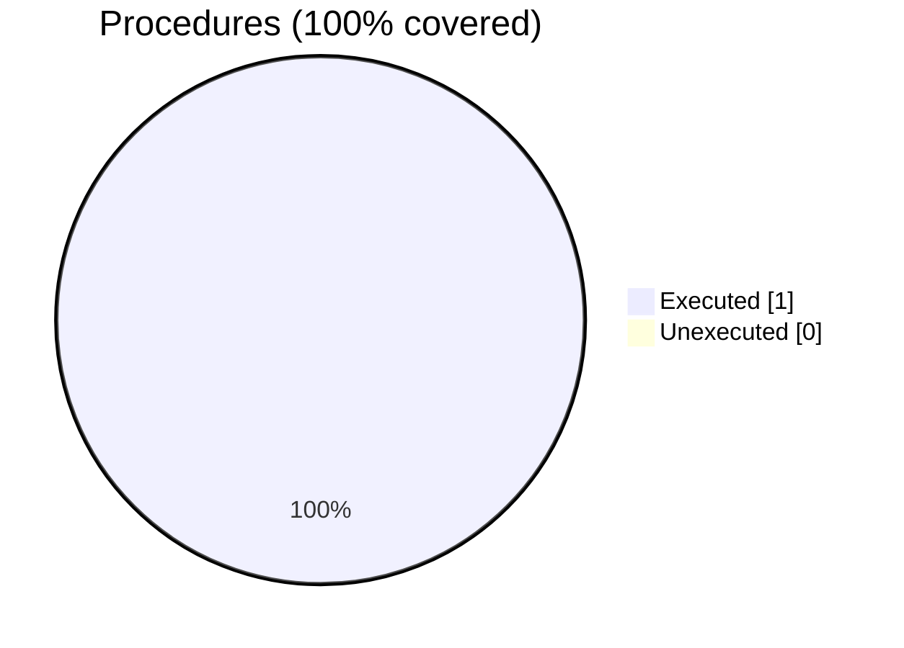
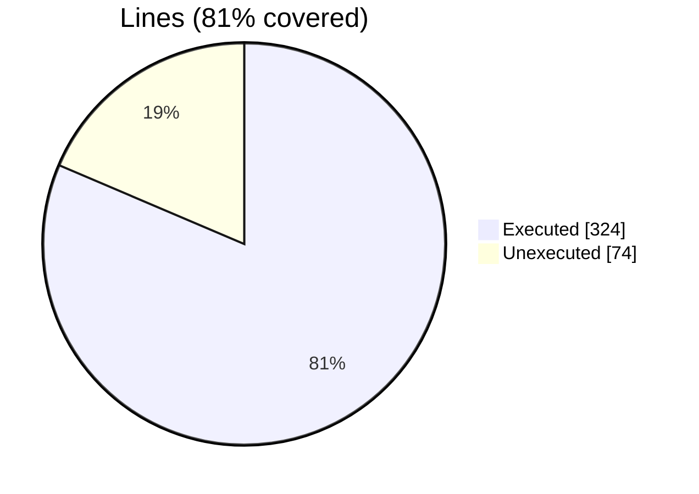
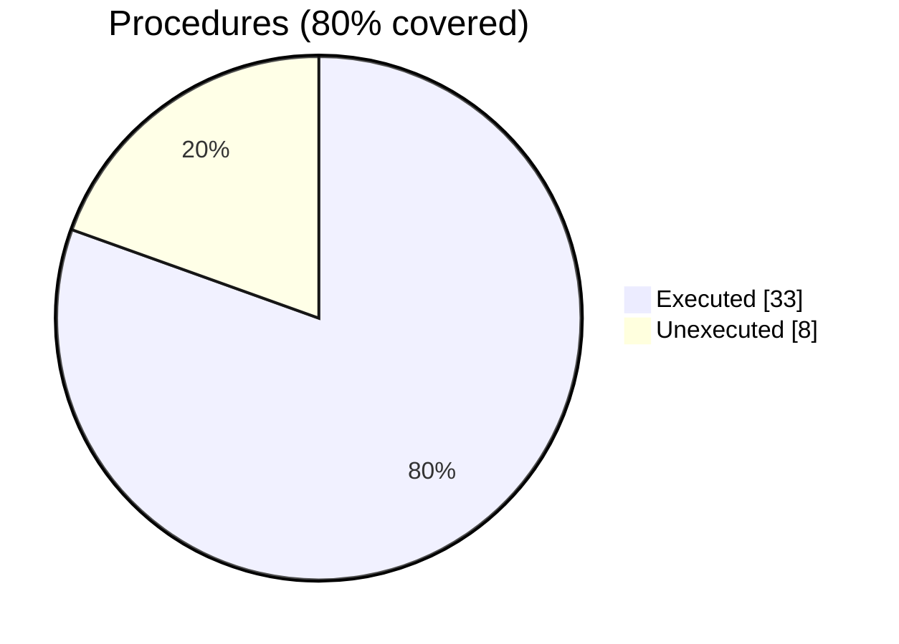
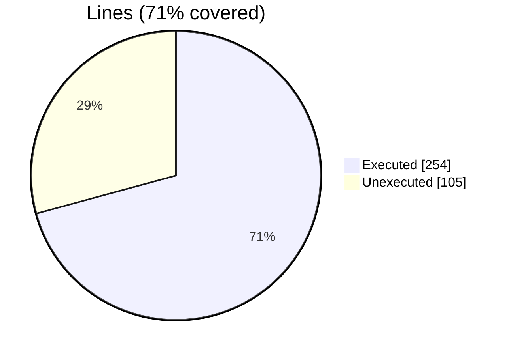
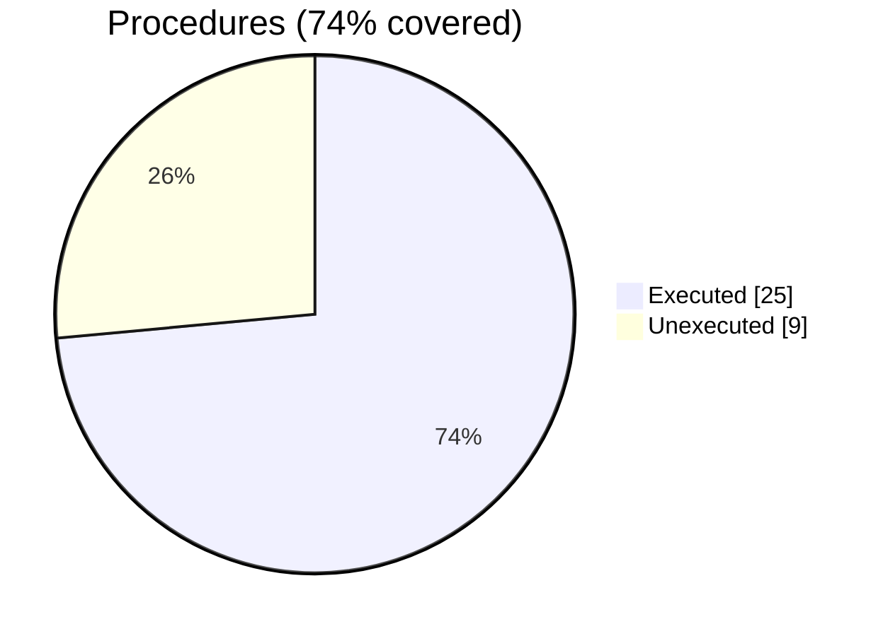
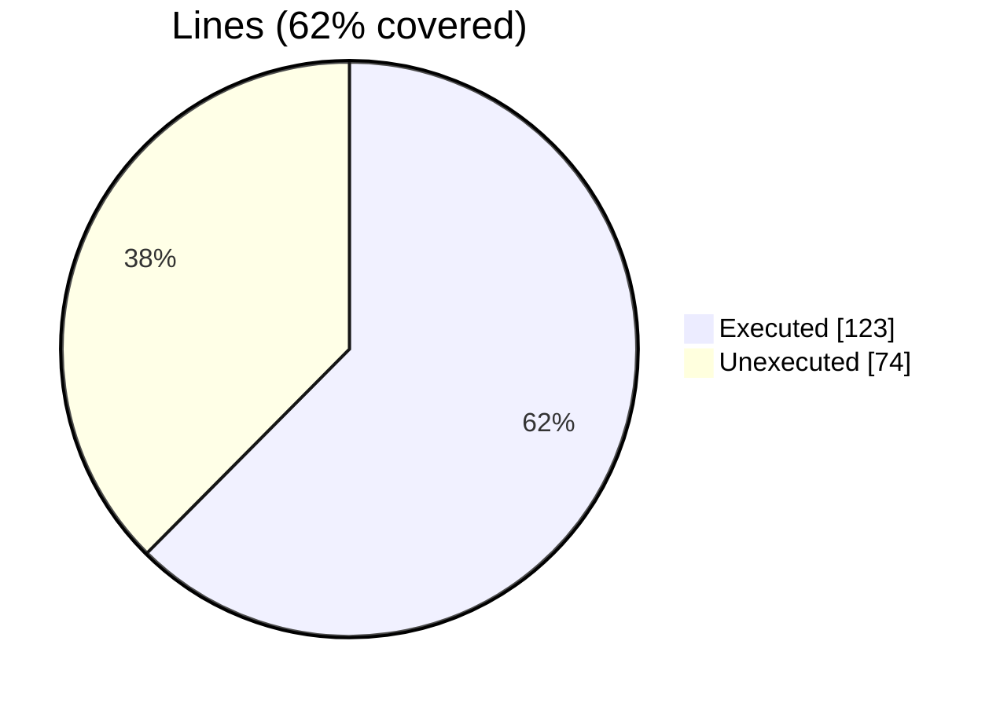
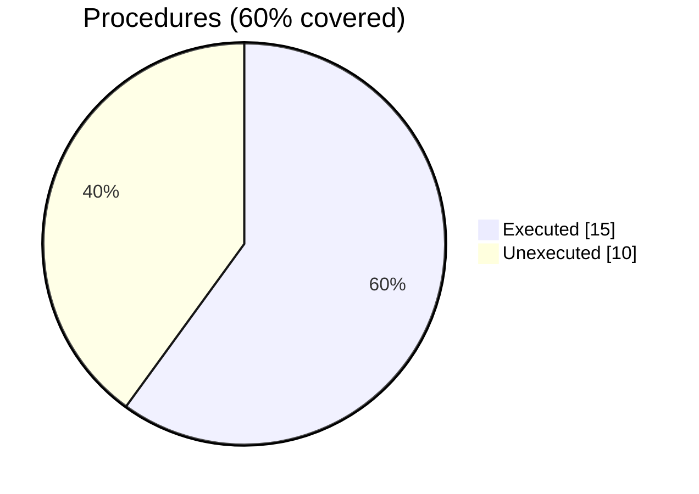

### coverage-analysis

#### [[fossil_test_translate.f90.gcov]]

|Lines| | |
| --- | --- | --- |
|Executable lines            |40| |
|Executed lines              |40|100%|
|Unexecuted lines            |0|0%|
|Average hits / executed     |1.225| |



|Procedures| | |
| --- | --- | --- |
|Total procedures            |1| |
|Executed procedures         |1|100%|
|Unexecuted procedures       |0|0%|
|Average hits / executed     |1.0| |




#### [[fossil_test_clip.f90.gcov]]

|Lines| | |
| --- | --- | --- |
|Executable lines            |37| |
|Executed lines              |37|100%|
|Unexecuted lines            |0|0%|
|Average hits / executed     |711.7027027027027| |


|Procedures| | |
| --- | --- | --- |
|Total procedures            |1| |
|Executed procedures         |1|100%|
|Unexecuted procedures       |0|0%|
|Average hits / executed     |1.0| |


#### [[fossil_facet_object.f90.gcov]]

|Lines| | |
| --- | --- | --- |
|Executable lines            |398| |
|Executed lines              |324|81%|
|Unexecuted lines            |74|19%|
|Average hits / executed     |8086783.009259259| |



|Procedures| | |
| --- | --- | --- |
|Total procedures            |41| |
|Executed procedures         |33|80%|
|Unexecuted procedures       |8|20%|
|Average hits / executed     |7031995.212121212| |




#### [[fossil_test_resize.f90.gcov]]

|Lines| | |
| --- | --- | --- |
|Executable lines            |45| |
|Executed lines              |45|100%|
|Unexecuted lines            |0|0%|
|Average hits / executed     |3.066666666666667| |


|Procedures| | |
| --- | --- | --- |
|Total procedures            |1| |
|Executed procedures         |1|100%|
|Unexecuted procedures       |0|0%|
|Average hits / executed     |1.0| |


#### [[fossil_test_sanitize_normals.f90.gcov]]

|Lines| | |
| --- | --- | --- |
|Executable lines            |22| |
|Executed lines              |22|100%|
|Unexecuted lines            |0|0%|
|Average hits / executed     |1.1818181818181819| |


|Procedures| | |
| --- | --- | --- |
|Total procedures            |1| |
|Executed procedures         |1|100%|
|Unexecuted procedures       |0|0%|
|Average hits / executed     |1.0| |


#### [[fossil_surface_stl.f90.gcov]]

|Lines| | |
| --- | --- | --- |
|Executable lines            |359| |
|Executed lines              |254|71%|
|Unexecuted lines            |105|29%|
|Average hits / executed     |46467.63385826772| |



|Procedures| | |
| --- | --- | --- |
|Total procedures            |34| |
|Executed procedures         |25|74%|
|Unexecuted procedures       |9|26%|
|Average hits / executed     |67565.24| |




#### [[fossil_test_distance.f90.gcov]]

|Lines| | |
| --- | --- | --- |
|Executable lines            |100| |
|Executed lines              |81|81%|
|Unexecuted lines            |19|19%|
|Average hits / executed     |21619.283950617282| |


|Procedures| | |
| --- | --- | --- |
|Total procedures            |1| |
|Executed procedures         |1|100%|
|Unexecuted procedures       |0|0%|
|Average hits / executed     |1.0| |


#### [[fossil_utils.f90.gcov]]

|Lines| | |
| --- | --- | --- |
|Executable lines            |3| |
|Executed lines              |3|100%|
|Unexecuted lines            |0|0%|
|Average hits / executed     |79056.0| |


|Procedures| | |
| --- | --- | --- |
|Total procedures            |1| |
|Executed procedures         |1|100%|
|Unexecuted procedures       |0|0%|
|Average hits / executed     |79056.0| |


#### [[fossil_aabb_object.f90.gcov]]

|Lines| | |
| --- | --- | --- |
|Executable lines            |197| |
|Executed lines              |123|62%|
|Unexecuted lines            |74|38%|
|Average hits / executed     |4215741.62601626| |



|Procedures| | |
| --- | --- | --- |
|Total procedures            |25| |
|Executed procedures         |15|60%|
|Unexecuted procedures       |10|40%|
|Average hits / executed     |814285.5333333333| |




#### [[fossil_test_mirror.f90.gcov]]

|Lines| | |
| --- | --- | --- |
|Executable lines            |29| |
|Executed lines              |29|100%|
|Unexecuted lines            |0|0%|
|Average hits / executed     |1.2413793103448276| |


|Procedures| | |
| --- | --- | --- |
|Total procedures            |1| |
|Executed procedures         |1|100%|
|Unexecuted procedures       |0|0%|
|Average hits / executed     |1.0| |


#### [[fossil_list_id_object.f90.gcov]]

|Lines| | |
| --- | --- | --- |
|Executable lines            |42| |
|Executed lines              |42|100%|
|Unexecuted lines            |0|0%|
|Average hits / executed     |21012250.19047619| |

```mermaid
pie showData
    title Lines (100% covered)
    "Executed" : 42
    "Unexecuted" : 0
```

|Procedures| | |
| --- | --- | --- |
|Total procedures            |5| |
|Executed procedures         |5|100%|
|Unexecuted procedures       |0|0%|
|Average hits / executed     |459722.2| |

```mermaid
pie showData
    title Procedures (100% covered)
    "Executed" : 5
    "Unexecuted" : 0
```


#### [[fossil_aabb_node_object.f90.gcov]]

|Lines| | |
| --- | --- | --- |
|Executable lines            |88| |
|Executed lines              |45|51%|
|Unexecuted lines            |43|49%|
|Average hits / executed     |684746.4| |

```mermaid
pie showData
    title Lines (51% covered)
    "Executed" : 45
    "Unexecuted" : 43
```

|Procedures| | |
| --- | --- | --- |
|Total procedures            |22| |
|Executed procedures         |11|50%|
|Unexecuted procedures       |11|50%|
|Average hits / executed     |841455.0| |

```mermaid
pie showData
    title Procedures (50% covered)
    "Executed" : 11
    "Unexecuted" : 11
```


#### [[fossil_test_rotate.f90.gcov]]

|Lines| | |
| --- | --- | --- |
|Executable lines            |29| |
|Executed lines              |29|100%|
|Unexecuted lines            |0|0%|
|Average hits / executed     |1.2413793103448276| |

```mermaid
pie showData
    title Lines (100% covered)
    "Executed" : 29
    "Unexecuted" : 0
```

|Procedures| | |
| --- | --- | --- |
|Total procedures            |1| |
|Executed procedures         |1|100%|
|Unexecuted procedures       |0|0%|
|Average hits / executed     |1.0| |

```mermaid
pie showData
    title Procedures (100% covered)
    "Executed" : 1
    "Unexecuted" : 0
```


#### [[fossil_test_load_save_binary.f90.gcov]]

|Lines| | |
| --- | --- | --- |
|Executable lines            |24| |
|Executed lines              |24|100%|
|Unexecuted lines            |0|0%|
|Average hits / executed     |1.3333333333333333| |

```mermaid
pie showData
    title Lines (100% covered)
    "Executed" : 24
    "Unexecuted" : 0
```


#### [[fossil_test_merge.f90.gcov]]

|Lines| | |
| --- | --- | --- |
|Executable lines            |23| |
|Executed lines              |23|100%|
|Unexecuted lines            |0|0%|
|Average hits / executed     |1.2173913043478262| |

```mermaid
pie showData
    title Lines (100% covered)
    "Executed" : 23
    "Unexecuted" : 0
```

|Procedures| | |
| --- | --- | --- |
|Total procedures            |1| |
|Executed procedures         |1|100%|
|Unexecuted procedures       |0|0%|
|Average hits / executed     |1.0| |

```mermaid
pie showData
    title Procedures (100% covered)
    "Executed" : 1
    "Unexecuted" : 0
```


#### [[fossil_aabb_tree_object.f90.gcov]]

|Lines| | |
| --- | --- | --- |
|Executable lines            |226| |
|Executed lines              |131|58%|
|Unexecuted lines            |95|42%|
|Average hits / executed     |257305.4351145038| |

```mermaid
pie showData
    title Lines (58% covered)
    "Executed" : 131
    "Unexecuted" : 95
```

|Procedures| | |
| --- | --- | --- |
|Total procedures            |19| |
|Executed procedures         |14|74%|
|Unexecuted procedures       |5|26%|
|Average hits / executed     |202855.64285714287| |

```mermaid
pie showData
    title Procedures (74% covered)
    "Executed" : 14
    "Unexecuted" : 5
```


#### [[fossil_file_stl_object.f90.gcov]]

|Lines| | |
| --- | --- | --- |
|Executable lines            |164| |
|Executed lines              |132|80%|
|Unexecuted lines            |32|20%|
|Average hits / executed     |2256.401515151515| |

```mermaid
pie showData
    title Lines (80% covered)
    "Executed" : 132
    "Unexecuted" : 32
```

|Procedures| | |
| --- | --- | --- |
|Total procedures            |13| |
|Executed procedures         |12|92%|
|Unexecuted procedures       |1|8%|
|Average hits / executed     |14.083333333333334| |

```mermaid
pie showData
    title Procedures (92% covered)
    "Executed" : 12
    "Unexecuted" : 1
```


#### [[fossil_test_load_save_ascii.f90.gcov]]

|Lines| | |
| --- | --- | --- |
|Executable lines            |24| |
|Executed lines              |24|100%|
|Unexecuted lines            |0|0%|
|Average hits / executed     |1.3333333333333333| |

```mermaid
pie showData
    title Lines (100% covered)
    "Executed" : 24
    "Unexecuted" : 0
```

