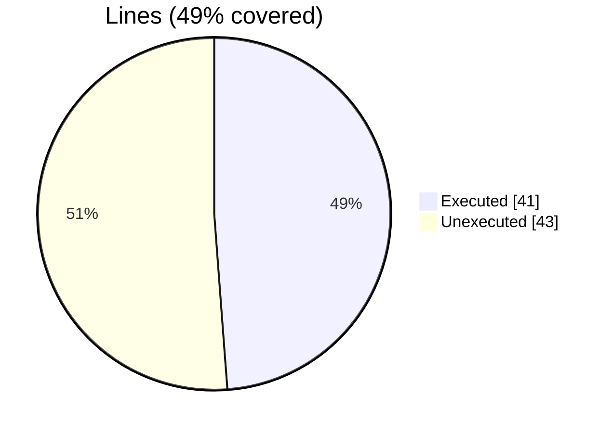
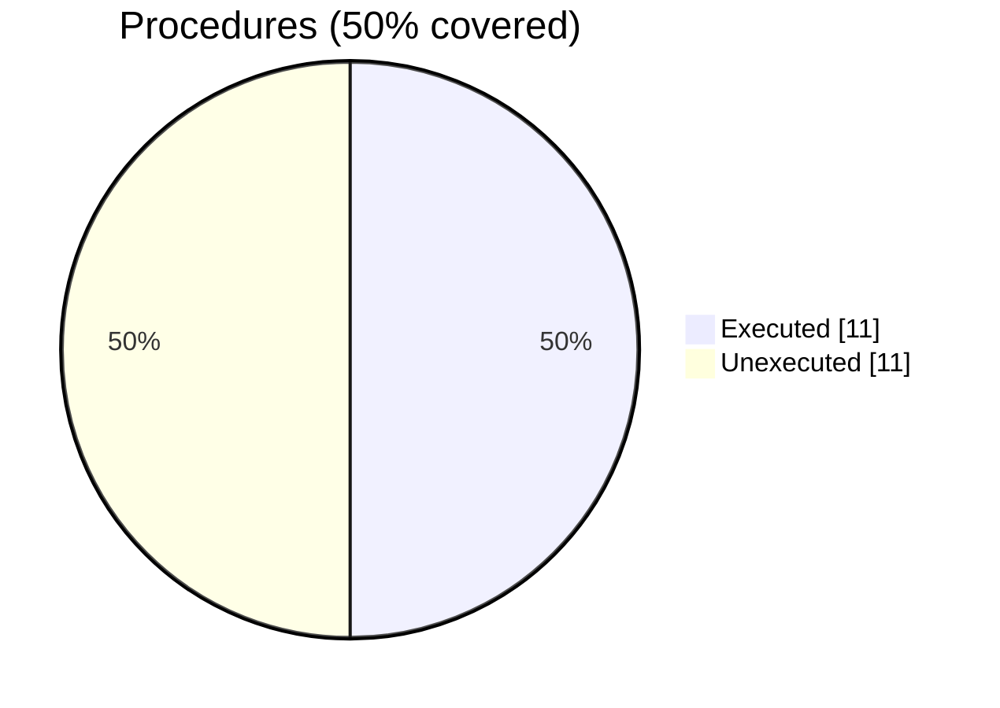

### Coverage analysis of *fossil_aabb_node_object.f90*

|Lines| | |
| --- | --- | --- |
|Executable lines            |84| |
|Executed lines              |41|49%|
|Unexecuted lines            |43|51%|
|Average hits / executed     |694357.3902439025| |

|Procedures| | |
| --- | --- | --- |
|Total procedures            |22| |
|Executed procedures         |11|50%|
|Unexecuted procedures       |11|50%|
|Average hits / executed     |841435.4545454546| |

#### Unexecuted procedures

 + *function* **bmax**, line 72
 + *function* **bmin**, line 64
 + *function* **closest_point**, line 80
 + *function* **distance**, line 123
 + *subroutine* **aabb_node_assign_aabb_node**, line 267
 + *subroutine* **get_aabb_facets**, line 163
 + *subroutine* **save_facets_into_file_stl**, line 225
 + *subroutine* **save_geometry_tecplot_ascii**, line 216
 + *subroutine* **translate**, line 235
 + *subroutine* **union**, line 243
 + *subroutine* **update_extents**, line 257

#### Executed procedures

 + *function* **is_allocated**: tested **7569807** times
 + *function* **do_ray_intersect**: tested **698599** times
 + *function* **ray_intersections_number**: tested **698599** times
 + *function* **distance_from_facets**: tested **247585** times
 + *subroutine* **destroy**: tested **33576** times
 + *subroutine* **compute_octants**: tested **2941** times
 + *subroutine* **add_facets**: tested **1338** times
 + *function* **has_facets**: tested **1338** times
 + *subroutine* **initialize**: tested **1338** times
 + *subroutine* **compute_vertices_nearby**: tested **588** times
 + *function* **facet_id**: tested **81** times

 --- 
 Report generated by [FoBiS.py](https://github.com/szaghi/FoBiS)