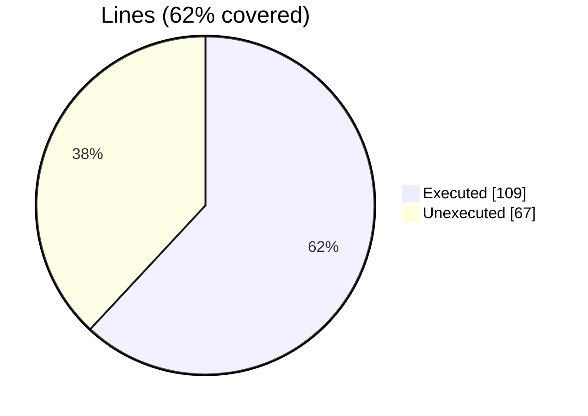
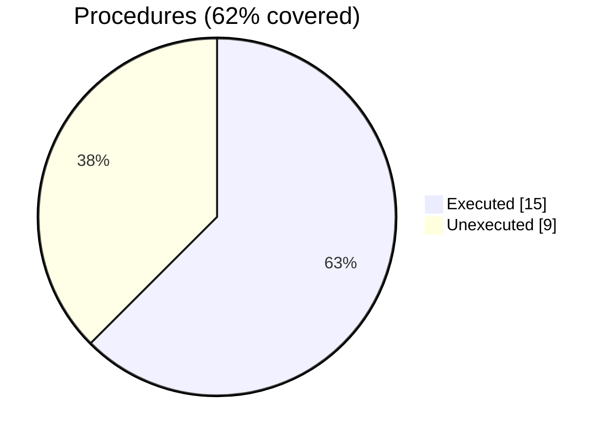

### Coverage analysis of *fossil_aabb_object.f90*

|Lines| | |
| --- | --- | --- |
|Executable lines            |176| |
|Executed lines              |109|62%|
|Unexecuted lines            |67|38%|
|Average hits / executed     |4420195.651376147| |

|Procedures| | |
| --- | --- | --- |
|Total procedures            |24| |
|Executed procedures         |15|62%|
|Unexecuted procedures       |9|38%|
|Average hits / executed     |814256.8666666667| |

#### Unexecuted procedures

 + *function* **closest_point**, line 89
 + *function* **distance**, line 145
 + *subroutine* **close_file**, line 377
 + *subroutine* **get_aabb_facets**, line 248
 + *subroutine* **save_facets_into_file_stl**, line 341
 + *subroutine* **save_geometry_tecplot_ascii**, line 324
 + *subroutine* **translate**, line 385
 + *subroutine* **union**, line 394
 + *subroutine* **update_extents**, line 411

#### Executed procedures

 + *function* **is_inside**: tested **8460379** times
 + *subroutine* **check_slab**: tested **2095797** times
 + *function* **do_ray_intersect**: tested **698599** times
 + *function* **ray_intersections_number**: tested **698599** times
 + *function* **distance_from_facets**: tested **247585** times
 + *subroutine* **compute_octants**: tested **2941** times
 + *subroutine* **destroy**: tested **1894** times
 + *subroutine* **aabb_assign_aabb**: tested **1894** times
 + *function* **vertex**: tested **1557** times
 + *subroutine* **add_facets**: tested **1338** times
 + *function* **has_facets**: tested **1338** times
 + *subroutine* **initialize**: tested **1338** times
 + *subroutine* **compute_vertices_nearby**: tested **460** times
 + *function* **median**: tested **92** times
 + *subroutine* **compute_bb_from_facets**: tested **42** times

 --- 
 Report generated by [FoBiS.py](https://github.com/szaghi/FoBiS)