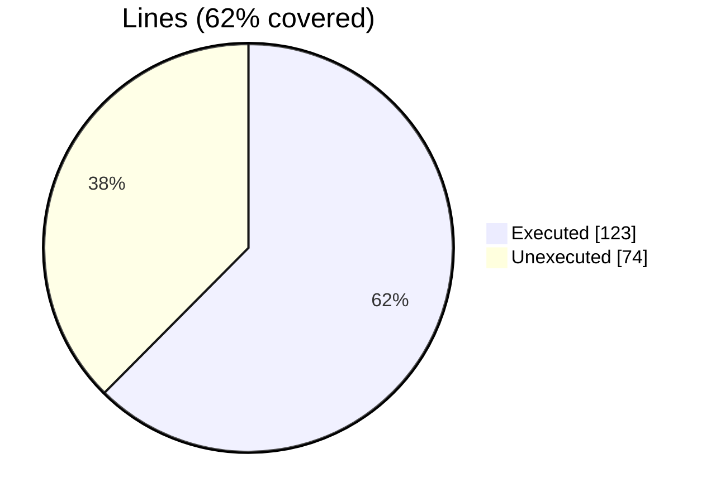
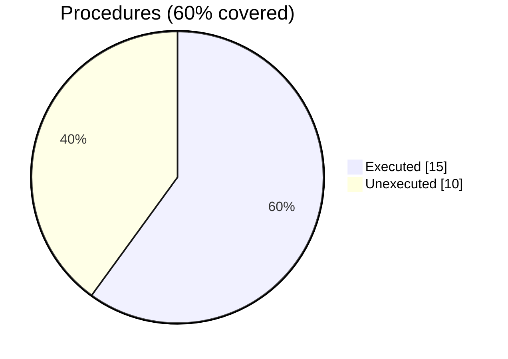

### Coverage analysis of *fossil_aabb_object.f90*

|Lines| | |
| --- | --- | --- |
|Executable lines            |197| |
|Executed lines              |123|62%|
|Unexecuted lines            |74|38%|
|Average hits / executed     |4215741.62601626| |

```mermaid
pie showData
    title Lines (62% covered)
    "Executed" : 123
    "Unexecuted" : 74
```

|Procedures| | |
| --- | --- | --- |
|Total procedures            |25| |
|Executed procedures         |15|60%|
|Unexecuted procedures       |10|40%|
|Average hits / executed     |814285.5333333333| |

```mermaid
pie showData
    title Procedures (60% covered)
    "Executed" : 15
    "Unexecuted" : 10
```

#### Unexecuted procedures

 + *function* **closest_point**, line 89
 + *function* **distance**, line 145
 + *subroutine* **close_file**, line 377
 + *subroutine* **get_aabb_facets**, line 248
 + *subroutine* **open_file**, line 364
 + *subroutine* **save_facets_into_file_stl**, line 341
 + *subroutine* **save_geometry_tecplot_ascii**, line 324
 + *subroutine* **translate**, line 385
 + *subroutine* **union**, line 394
 + *subroutine* **update_extents**, line 411

#### Executed procedures

 + *function* **is_inside**: tested **8460379** times
 + *subroutine* **check_slab**: tested **2095797** times
 + *function* **do_ray_intersect**: tested **698599** times
 + *function* **ray_intersections_number**: tested **698599** times
 + *function* **distance_from_facets**: tested **247585** times
 + *subroutine* **compute_octants**: tested **3114** times
 + *subroutine* **destroy**: tested **1894** times
 + *subroutine* **aabb_assign_aabb**: tested **1894** times
 + *function* **vertex**: tested **1730** times
 + *subroutine* **initialize**: tested **1380** times
 + *subroutine* **add_facets**: tested **1338** times
 + *function* **has_facets**: tested **1338** times
 + *subroutine* **compute_vertices_nearby**: tested **460** times
 + *function* **median**: tested **92** times
 + *subroutine* **compute_bb_from_facets**: tested **84** times

 --- 
 Report generated by [FoBiS.py](https://github.com/szaghi/FoBiS)