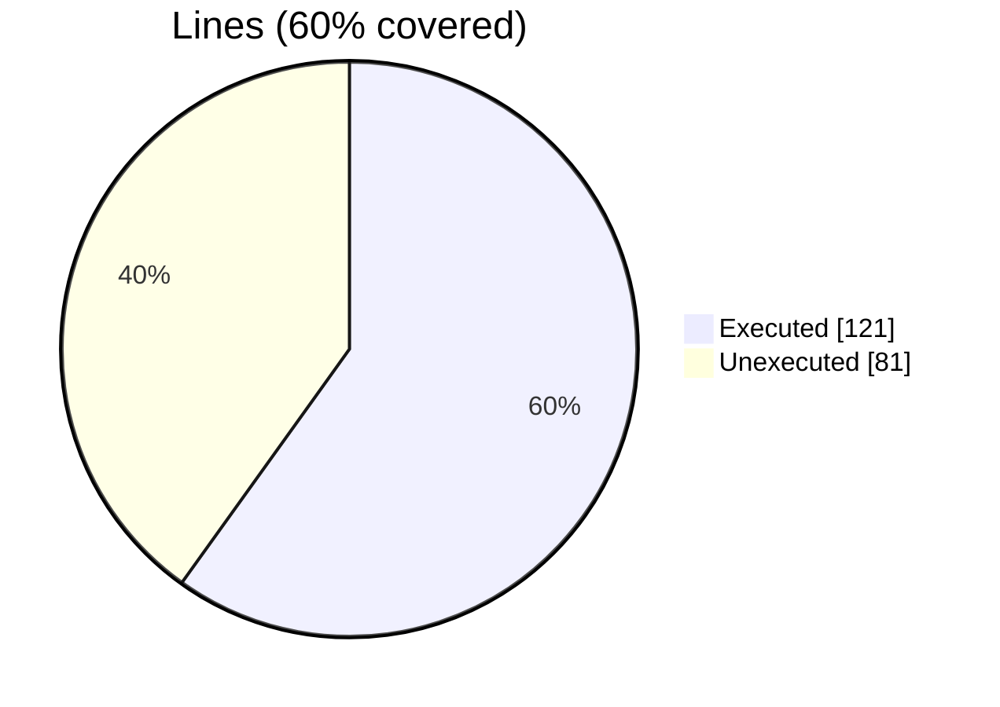
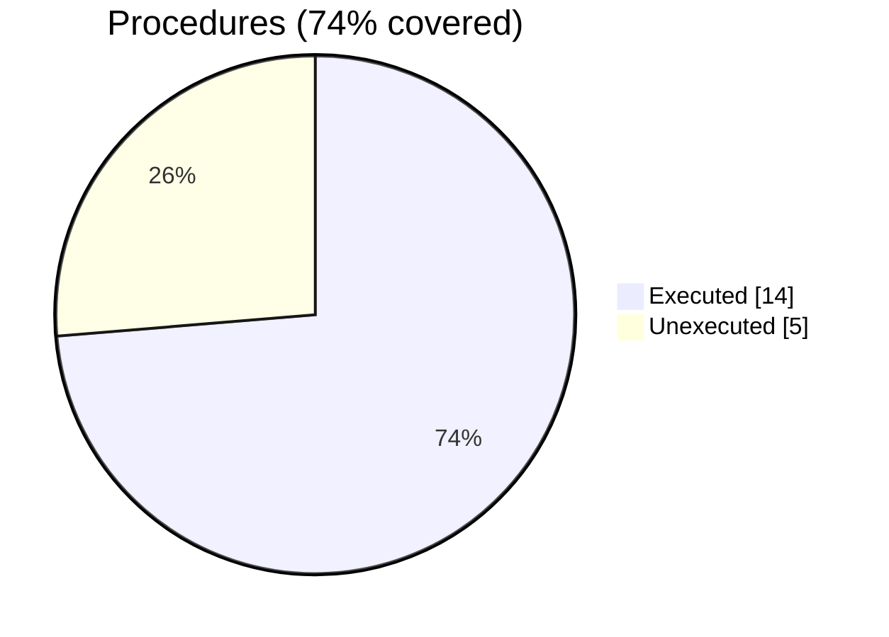

### Coverage analysis of *fossil_aabb_tree_object.f90*

|Lines| | |
| --- | --- | --- |
|Executable lines            |202| |
|Executed lines              |121|60%|
|Unexecuted lines            |81|40%|
|Average hits / executed     |249296.173553719| |

|Procedures| | |
| --- | --- | --- |
|Total procedures            |19| |
|Executed procedures         |14|74%|
|Unexecuted procedures       |5|26%|
|Average hits / executed     |202852.64285714287| |

#### Unexecuted procedures

 + *function* **distance**, line 127
 + *function* **level**, line 575
 + *function* **loop_node**, line 352
 + *subroutine* **save_geometry_tecplot_ascii**, line 422
 + *subroutine* **translate**, line 447

#### Executed procedures

 + *function* **has_children**: tested **946184** times
 + *function* **first_child_node**: tested **946184** times
 + *function* **ray_intersections_number**: tested **698599** times
 + *function* **distance_tree**: tested **247585** times
 + *function* **nodes_number_at_level**: tested **494** times
 + *function* **parent_node**: tested **254** times
 + *function* **nodes_number**: tested **245** times
 + *function* **first_node**: tested **203** times
 + *subroutine* **destroy**: tested **42** times
 + *subroutine* **initialize**: tested **42** times
 + *subroutine* **aabb_tree_assign_aabb_tree**: tested **42** times
 + *subroutine* **compute_vertices_nearby**: tested **21** times
 + *subroutine* **distribute_facets**: tested **21** times
 + *subroutine* **distribute_facets_tree**: tested **21** times

 --- 
 Report generated by [FoBiS.py](https://github.com/szaghi/FoBiS)