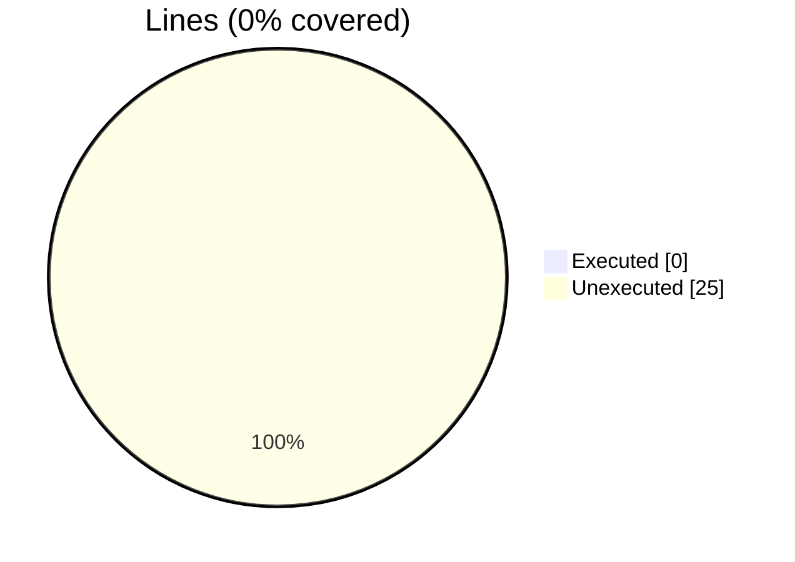
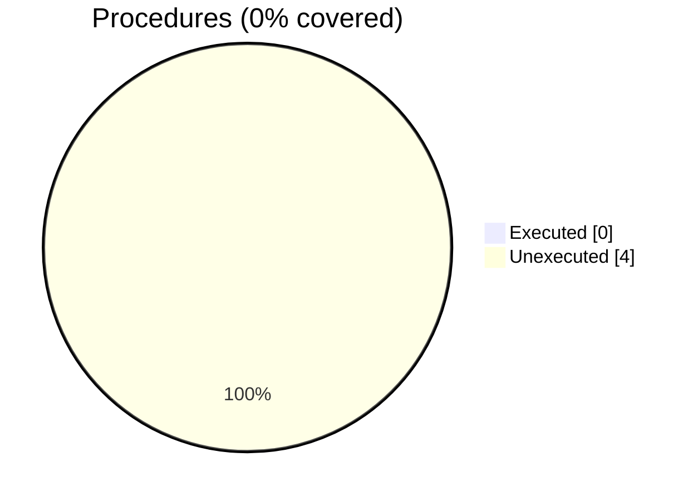

### Coverage analysis of *fossil_block_aabb_object.f90*

|Lines| | |
| --- | --- | --- |
|Executable lines            |25| |
|Executed lines              |0|0%|
|Unexecuted lines            |25|100%|
|Average hits / executed     |0| |

|Procedures| | |
| --- | --- | --- |
|Total procedures            |4| |
|Executed procedures         |0|0%|
|Unexecuted procedures       |4|100%|
|Average hits / executed     |0| |

#### Unexecuted procedures

 + *function* **is_inside**, line 44
 + *function* **vertex**, line 55
 + *subroutine* **aabb_assign_aabb**, line 72
 + *subroutine* **compute_octants**, line 29

#### Executed procedures

 + *none*

 --- 
 Report generated by [FoBiS.py](https://github.com/szaghi/FoBiS)