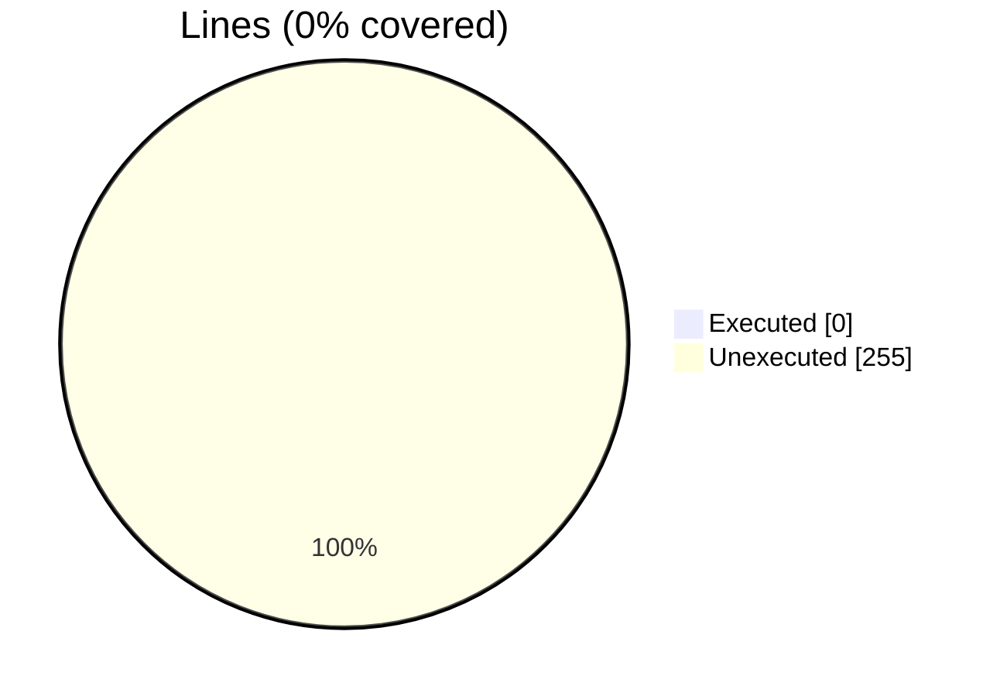
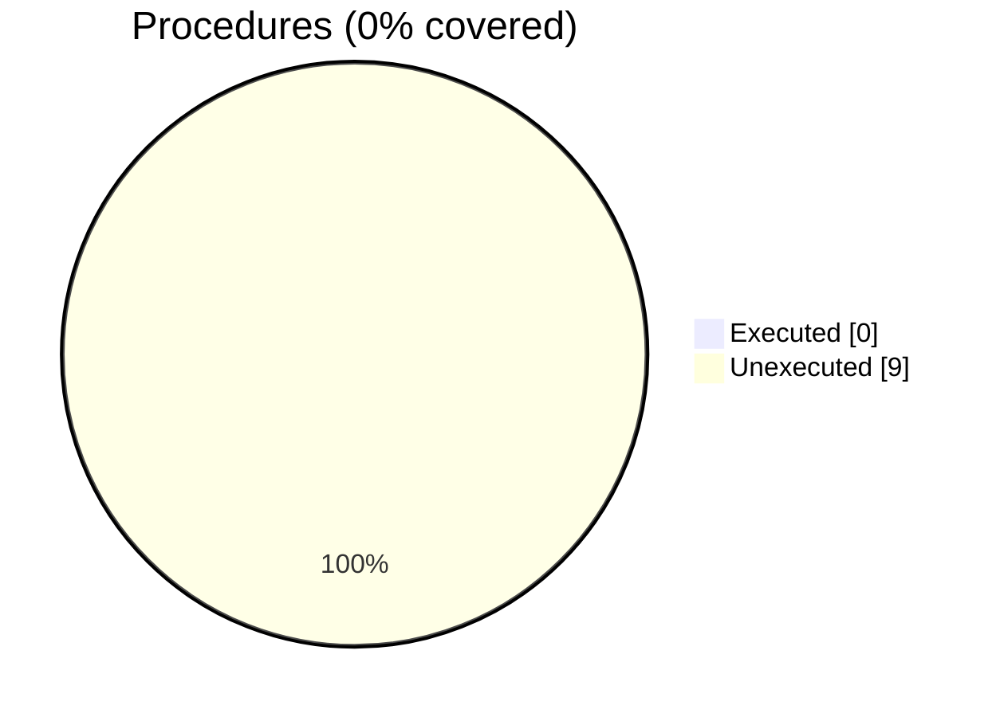

### Coverage analysis of *fossil_block_object.f90*

|Lines| | |
| --- | --- | --- |
|Executable lines            |255| |
|Executed lines              |0|0%|
|Unexecuted lines            |255|100%|
|Average hits / executed     |0| |

|Procedures| | |
| --- | --- | --- |
|Total procedures            |9| |
|Executed procedures         |0|0%|
|Unexecuted procedures       |9|100%|
|Average hits / executed     |0| |

#### Unexecuted procedures

 + *subroutine* **block_assign_block**, line 395
 + *subroutine* **compute_cells_centers**, line 46
 + *subroutine* **compute_distances**, line 63
 + *subroutine* **export_aabb_tecplot_ascii**, line 97
 + *subroutine* **export_vtk_file**, line 125
 + *subroutine* **export_xall_files**, line 148
 + *subroutine* **extrapolate_distances**, line 184
 + *subroutine* **get_closest_cells_indexes**, line 327
 + *subroutine* **initialize**, line 334

#### Executed procedures

 + *none*

 --- 
 Report generated by [FoBiS.py](https://github.com/szaghi/FoBiS)