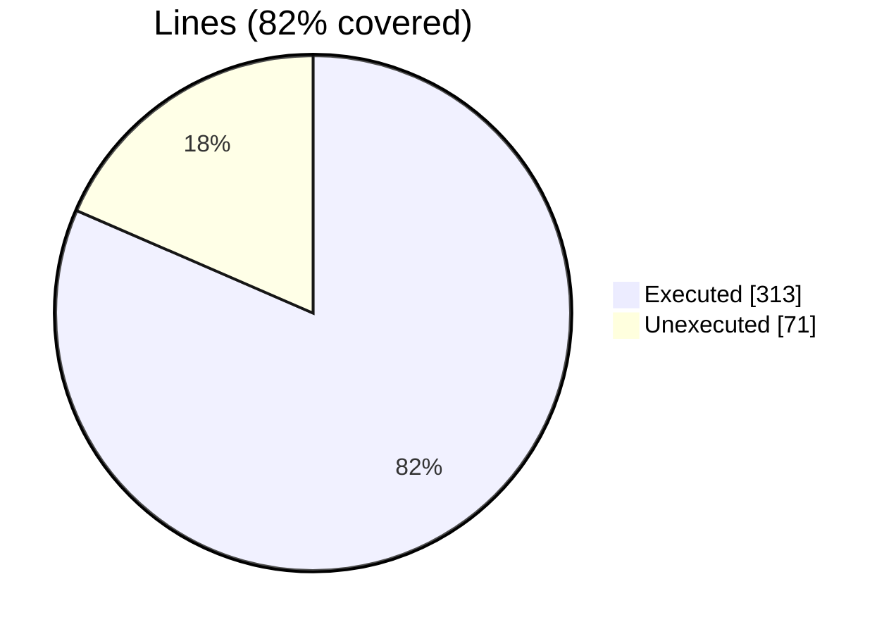
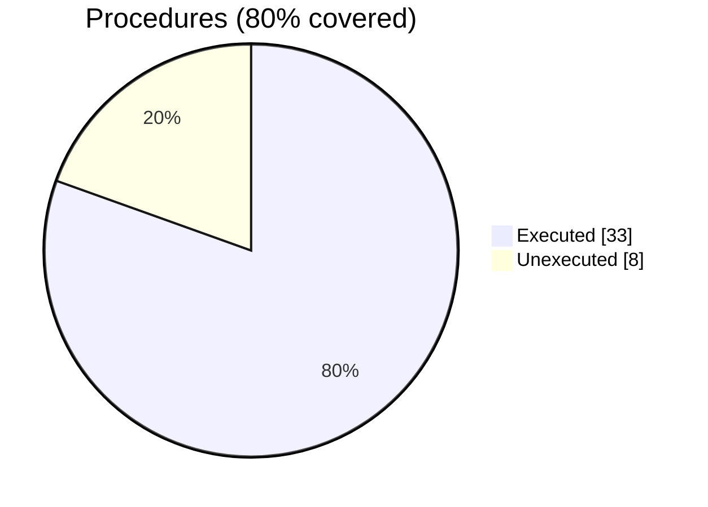

### Coverage analysis of *fossil_facet_object.f90*

|Lines| | |
| --- | --- | --- |
|Executable lines            |384| |
|Executed lines              |313|82%|
|Unexecuted lines            |71|18%|
|Average hits / executed     |7323580.712460064| |

|Procedures| | |
| --- | --- | --- |
|Total procedures            |41| |
|Executed procedures         |33|80%|
|Unexecuted procedures       |8|20%|
|Average hits / executed     |7031995.212121212| |

#### Unexecuted procedures

 + *function* **check_normal**, line 130
 + *function* **solid_angle**, line 633
 + *function* **vertex_angle**, line 720
 + *subroutine* **compute_pseudo_normals**, line 329
 + *subroutine* **destroy**, line 429
 + *subroutine* **initialize**, line 480
 + *subroutine* **mirror_by_normal**, line 807
 + *subroutine* **rotate_by_axis_angle**, line 833

#### Executed procedures

 + *function* **do_ray_intersect**: tested **131336612** times
 + *function* **are_nearby**: tested **47668959** times
 + *subroutine* **compute_distance**: tested **46543868** times
 + *subroutine* **compute_vertices_nearby**: tested **5254342** times
 + *function* **vertex_global_id**: tested **759762** times
 + *function* **facet_connected**: tested **114213** times
 + *function* **tetrahedron_volume**: tested **38283** times
 + *subroutine* **compute_metrix**: tested **38272** times
 + *subroutine* **compute_normal**: tested **38272** times
 + *function* **centroid_part**: tested **38071** times
 + *subroutine* **destroy_connectivity**: tested **38071** times
 + *function* **largest_edge_len**: tested **38071** times
 + *function* **smallest_edge_len**: tested **38071** times
 + *subroutine* **update_connectivity**: tested **38071** times
 + *subroutine* **load_from_file_binary**: tested **24095** times
 + *subroutine* **facet_assign_facet**: tested **16931** times
 + *subroutine* **save_into_file_binary**: tested **13364** times
 + *subroutine* **load_facet_record**: tested **13076** times
 + *subroutine* **load_from_file_ascii**: tested **3269** times
 + *function* **face_id**: tested **400** times
 + *function* **vertex_local_id**: tested **400** times
 + *subroutine* **save_into_file_ascii**: tested **272** times
 + *subroutine* **flip_edge**: tested **201** times
 + *subroutine* **flip_vertices**: tested **201** times
 + *subroutine* **reverse_normal**: tested **200** times
 + *subroutine* **make_normal_consistent**: tested **102** times
 + *subroutine* **edge_connection_in_other_ref**: tested **102** times
 + *subroutine* **connect_nearby_vertices**: tested **72** times
 + *subroutine* **resize**: tested **72** times
 + *subroutine* **merge_vertices**: tested **63** times
 + *subroutine* **translate**: tested **60** times
 + *subroutine* **mirror_by_matrix**: tested **12** times
 + *subroutine* **rotate_by_matrix**: tested **12** times

 --- 
 Report generated by [FoBiS.py](https://github.com/szaghi/FoBiS)