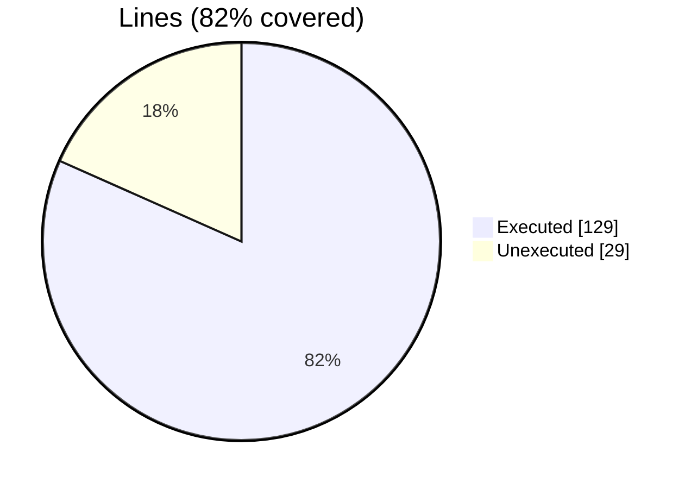
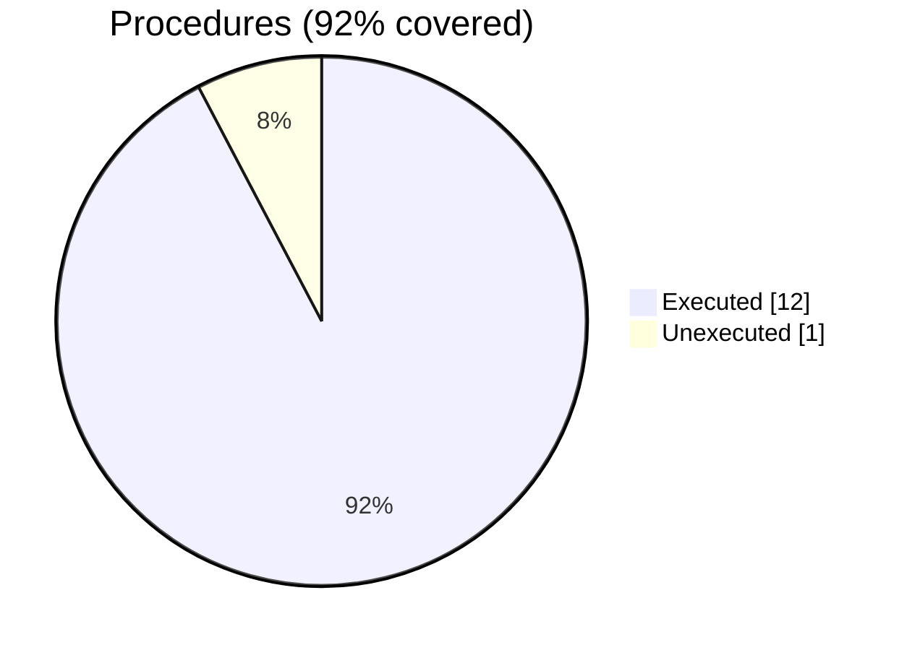

### Coverage analysis of *fossil_file_stl_object.f90*

|Lines| | |
| --- | --- | --- |
|Executable lines            |158| |
|Executed lines              |129|82%|
|Unexecuted lines            |29|18%|
|Average hits / executed     |2308.4418604651164| |

|Procedures| | |
| --- | --- | --- |
|Total procedures            |13| |
|Executed procedures         |12|92%|
|Unexecuted procedures       |1|8%|
|Average hits / executed     |14.083333333333334| |

#### Unexecuted procedures

 + *subroutine* **save_aabb_into_file**, line 213

#### Executed procedures

 + *subroutine* **initialize**: tested **28** times
 + *subroutine* **close_file**: tested **27** times
 + *subroutine* **open_file**: tested **27** times
 + *subroutine* **load_header_from_file**: tested **16** times
 + *subroutine* **load_from_file**: tested **15** times
 + *subroutine* **load_facets_number_from_file**: tested **15** times
 + *subroutine* **save_into_file**: tested **12** times
 + *subroutine* **save_header_into_file**: tested **12** times
 + *subroutine* **save_trailer_into_file**: tested **12** times
 + *function* **statistics**: tested **3** times
 + *subroutine* **destroy**: tested **1** times
 + *subroutine* **file_stl_assign_file_stl**: tested **1** times

 --- 
 Report generated by [FoBiS.py](https://github.com/szaghi/FoBiS)