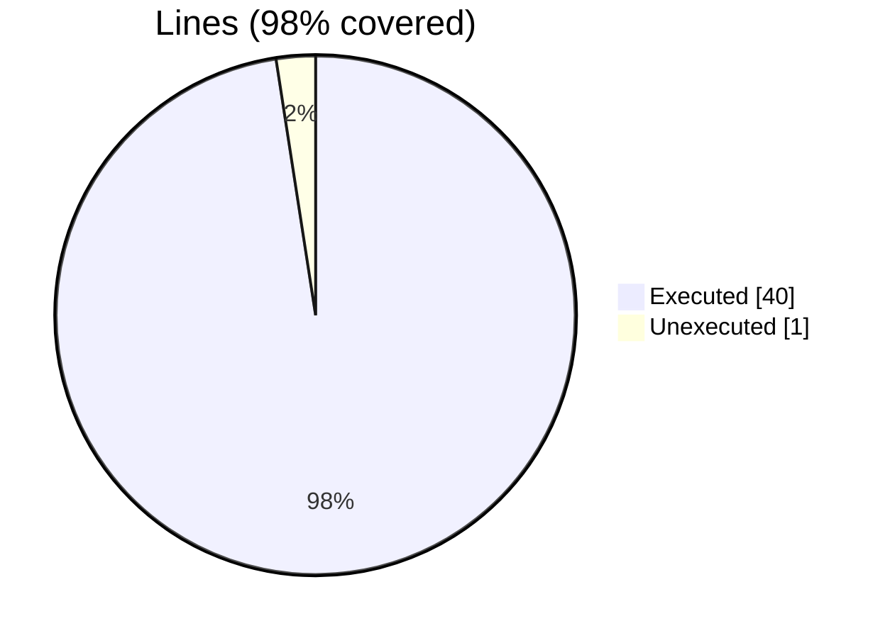
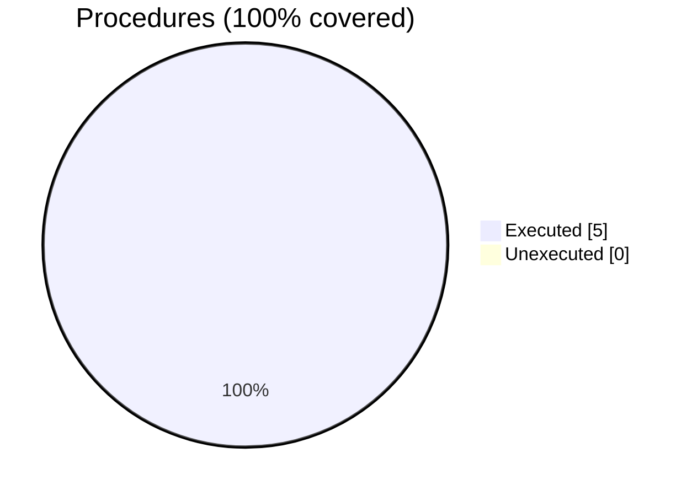

### Coverage analysis of *fossil_list_id_object.f90*

|Lines| | |
| --- | --- | --- |
|Executable lines            |41| |
|Executed lines              |40|98%|
|Unexecuted lines            |1|2%|
|Average hits / executed     |21978862.275| |

|Procedures| | |
| --- | --- | --- |
|Total procedures            |5| |
|Executed procedures         |5|100%|
|Unexecuted procedures       |0|0%|
|Average hits / executed     |459713.8| |

#### Unexecuted procedures

 + *none*

#### Executed procedures

 + *subroutine* **put**: tested **1760404** times
 + *subroutine* **list_id_assign_list_id**: tested **234601** times
 + *subroutine* **destroy**: tested **230132** times
 + *subroutine* **del**: tested **73390** times
 + *subroutine* **initialize**: tested **42** times

 --- 
 Report generated by [FoBiS.py](https://github.com/szaghi/FoBiS)