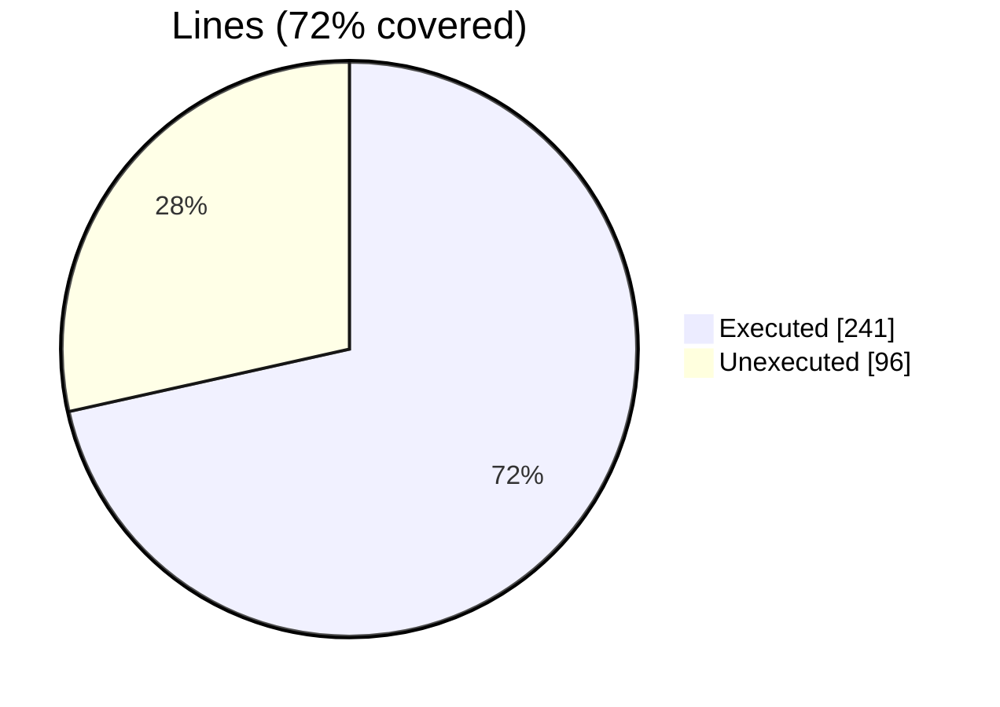
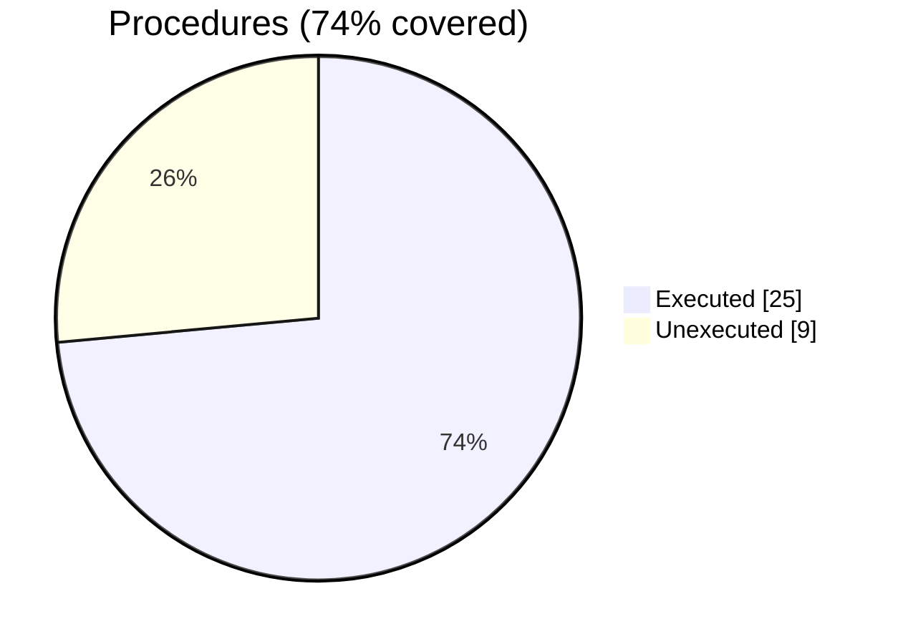

### Coverage analysis of *fossil_surface_stl.f90*

|Lines| | |
| --- | --- | --- |
|Executable lines            |337| |
|Executed lines              |241|72%|
|Unexecuted lines            |96|28%|
|Average hits / executed     |44496.78008298755| |

|Procedures| | |
| --- | --- | --- |
|Total procedures            |34| |
|Executed procedures         |25|74%|
|Unexecuted procedures       |9|26%|
|Average hits / executed     |67565.2| |

#### Unexecuted procedures

 + *function* **is_point_inside_polyhedron_sa**, line 459
 + *subroutine* **allocate_facets**, line 75
 + *subroutine* **compute_mesh_distance**, line 262
 + *subroutine* **compute_normals**, line 321
 + *subroutine* **destroy**, line 365
 + *subroutine* **initialize**, line 480
 + *subroutine* **mirror_by_matrix**, line 781
 + *subroutine* **rotate_by_matrix**, line 814
 + *subroutine* **surface_stl_assign_surface_stl**, line 710

#### Executed procedures

 + *function* **is_inside_by_ray_intersect**: tested **698599** times
 + *subroutine* **compute_distance**: tested **247585** times
 + *function* **distance**: tested **247585** times
 + *function* **is_point_inside**: tested **247572** times
 + *function* **is_point_inside_polyhedron_ri**: tested **247572** times
 + *subroutine* **compute_volume**: tested **24** times
 + *subroutine* **analize**: tested **21** times
 + *subroutine* **build_connectivity**: tested **21** times
 + *subroutine* **compute_centroid**: tested **21** times
 + *subroutine* **compute_metrix**: tested **21** times
 + *function* **largest_edge_len**: tested **21** times
 + *function* **smallest_edge_len**: tested **21** times
 + *subroutine* **compute_facets_disconnected**: tested **21** times
 + *subroutine* **set_facets_id**: tested **21** times
 + *subroutine* **resize**: tested **6** times
 + *subroutine* **translate**: tested **5** times
 + *function* **statistics**: tested **4** times
 + *subroutine* **reverse_normals**: tested **2** times
 + *subroutine* **sanitize_normals**: tested **2** times
 + *subroutine* **clip**: tested **1** times
 + *subroutine* **connect_nearby_vertices**: tested **1** times
 + *subroutine* **merge_solids**: tested **1** times
 + *subroutine* **sanitize**: tested **1** times
 + *subroutine* **mirror_by_normal**: tested **1** times
 + *subroutine* **rotate_by_axis_angle**: tested **1** times

 --- 
 Report generated by [FoBiS.py](https://github.com/szaghi/FoBiS)