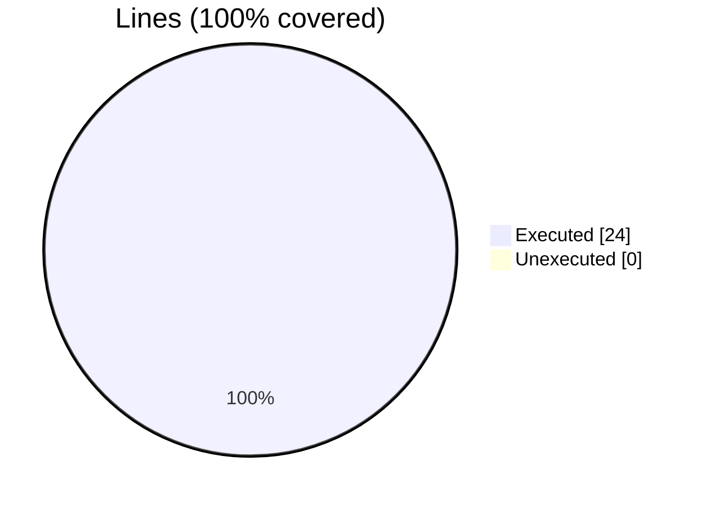

### Coverage analysis of *fossil_test_load_save_binary.f90*

|Lines| | |
| --- | --- | --- |
|Executable lines            |24| |
|Executed lines              |24|100%|
|Unexecuted lines            |0|0%|
|Average hits / executed     |1.3333333333333333| |

#### Unexecuted procedures

 + *none*

#### Executed procedures

 + *none*

 --- 
 Report generated by [FoBiS.py](https://github.com/szaghi/FoBiS)